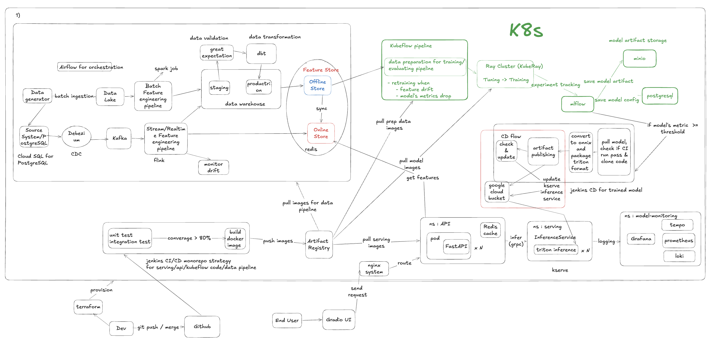
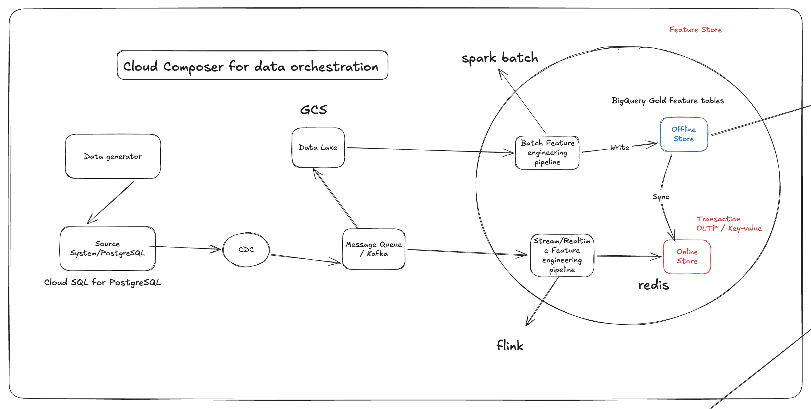

# Full Data & ML system

## Business Domain

This project is an end-to-end e-commerce recommendation system. It simulates product catalog, users, sessions, impressions, behavior events, and orders, then turns those raw events into offline and online features for a BST-style recommender. The platform covers the practical MLOps path: generate and ingest data, process batch/stream features, validate/govern data, train and register models, serve recommendations through FastAPI/Triton, and observe the running system.

## Table Of Contents

- [Submission docs](#submission-docs)
- [Repository structure](#repository-structure)
- [Local full-service cluster](#local-full-service-cluster)
- [High-level deployment diagrams](#high-level-deployment-diagrams)
- [Data platform](#data-platform)

## Submission docs

Detailed final-coursework proof documents live under `docs/submission/rubic-final-coursework-(final-ml)/`. README stays as a short navigation page; use the docs below for screenshots, commands, observed outputs, and design notes.

Mini-coursework proof documents live under `docs/submission/rubic-(mini-coursework)/`.

| Mini-coursework area | Document |
|---|---|
| Mini proof index | [README.md](docs/submission/rubic-(mini-coursework)/README.md) |
| Docker and Docker Compose | [docker.md](docs/submission/rubic-(mini-coursework)/docker.md) |
| Data generator | [data_generator.md](docs/submission/rubic-(mini-coursework)/data_generator.md) |
| Processing jobs | [processing_jobs.md](docs/submission/rubic-(mini-coursework)/processing_jobs.md) |
| Data storage optimization | [data_storage.md](docs/submission/rubic-(mini-coursework)/data_storage.md) |
| Data pipeline orchestration | [data_pipeline_orchestration.md](docs/submission/rubic-(mini-coursework)/data_pipeline_orchestration.md) |
| Data governance | [data_governance.md](docs/submission/rubic-(mini-coursework)/data_governance.md) |
| Schema design | [schema_design.md](docs/submission/rubic-(mini-coursework)/schema_design.md) |
| Novel ideas | [novel_ideas.md](docs/submission/rubic-(mini-coursework)/novel_ideas.md) |

| Area | Document |
|---|---|
| Infrastructure as Code on GCP/GKE | [iac.md](docs/submission/rubic-final-coursework-(final-ml)/iac.md) |
| Routing, gateway, auth, rate limit | [routing_gateway.md](docs/submission/rubic-final-coursework-(final-ml)/routing_gateway.md) |
| Observability dashboards and telemetry data | [observability.md](docs/submission/rubic-final-coursework-(final-ml)/observability.md) |
| A/B testing for inference services | [ab_testing.md](docs/submission/rubic-final-coursework-(final-ml)/ab_testing.md) |
| Security: centralized secrets and service mesh auth | [security.md](docs/submission/rubic-final-coursework-(final-ml)/security.md) |
| Repository design and design patterns | [repository_design.md](docs/submission/rubic-final-coursework-(final-ml)/repository_design.md) |
| Low-level ML design: 5 key classes | [low_level_ml_design.md](docs/submission/rubic-final-coursework-(final-ml)/low_level_ml_design.md) |

## Repository Structure

```text
apps/
  api-serving/          FastAPI recommendation API and Triton/Redis clients.
  data-platform/        Data generator, CDC ingest, Spark/Flink features, Airflow DAGs, DataHub metadata, drift checks.
  ml-system/            Training code, Kubeflow pipelines, MLflow/model promotion, Triton model packaging.
configs/
  local/                Local and Kubernetes runtime configs for generator, Spark, Flink, Airflow, feature store.
docs/
  pngs/                 Screenshot proof assets for rubric submission.
  submission/           Mini-coursework and final-coursework proof documents.
infra/
  cloudbuild/           GCP Cloud Build image pipeline.
  docker/               Local Docker Compose and base service images.
  helm/                 Kubernetes charts for data platform, serving, observability, gateway, security.
  terraform/gcp/        Terraform-managed GCP/GKE infrastructure and Helm releases.
jenkins/
  scripts/              CI/CD component detection, test, build, deploy, and validation scripts.
tests/
  unit/                 Unit and contract tests for data platform, API serving, ML system.
```

## Local full-service cluster

Use these two commands for the whole local Kubernetes stack.

```bash
make cluster-up
```

`cluster-up` starts the `recsys-mlops` Minikube profile, installs or upgrades the full RecSys service stack, waits for rollouts, and verifies required deployments/services. The default profile resources are 8 CPUs, 16GiB memory, and 40GiB disk. If the cluster needs more memory:

```bash
MINIKUBE_MEMORY_MB=18432 make cluster-up
```

For a fresh Minikube Docker daemon, rebuild local images before installing services:

```bash
RECSYS_CLUSTER_BUILD_IMAGES=1 make cluster-up
```

The full-service stack includes Kubeflow Pipelines, KubeRay, MLflow, MinIO, Postgres, the data platform, KEDA, KServe/Triton serving, FastAPI serving, observability, and the gateway. DataHub is optional because it is a heavier governance add-on:

```bash
RECSYS_CLUSTER_INSTALL_DATAHUB=1 make cluster-up
```

For local macOS/arm64 stability, `cluster-up` scales optional KFP `metadata-writer` and `proxy-agent` deployments to 0 by default. To keep them enabled:

```bash
RECSYS_CLUSTER_SCALE_OPTIONAL_KFP=0 make cluster-up
```

To stop the stack while keeping data, PVCs, MLflow artifacts, MinIO buckets, and model weights:

```bash
make cluster-down
```

`cluster-down` is non-destructive: it prints the retained PVCs/namespaces and stops the Minikube profile. Use it when you want to pause local services and resume later with the same data.

To run the full data setup and verify that the feature store bucket plus Redis online store are populated:

```bash
make cluster-data-setup
```

This starts the full-service stack if needed, triggers `k8s_data_platform_dag`, waits for the Airflow run to finish, then verifies MinIO lake data, feature-store offline paths, warehouse tables, and Redis online feature keys.

To run the full ML path from Kubeflow to serving validation:

```bash
make cluster-mlops-serving-e2e
```

This submits the compiled BST Kubeflow pipeline, waits through MLflow/Ray/evaluation/promotion-manifest creation, runs model CD to Triton/KServe, sends real FastAPI recommendation traffic, and verifies Grafana plus Prometheus serving metrics.

To clean up the full-service stack and delete local Kubernetes data:

```bash
make cluster-destroy
```

`cluster-destroy` uninstalls the RecSys Helm releases, deletes full-service namespaces/PVCs, verifies they are gone, then stops Minikube. To delete the Minikube profile entirely:

```bash
RECSYS_CLUSTER_DELETE_PROFILE=1 make cluster-destroy
```

## High-Level Deployment Diagrams

Each major box below is a deployable/runtime unit such as Kafka, Flink, Airflow, Redis, MinIO, Kubeflow, MLflow, KServe/Triton, API Serving, Grafana, DataHub, or NGINX Gateway. Arrows show the main data movement from source events to features, training, serving, and observability.



# Data platform



CDC ingestion details live in [apps/data-platform/README.md](apps/data-platform/README.md).
