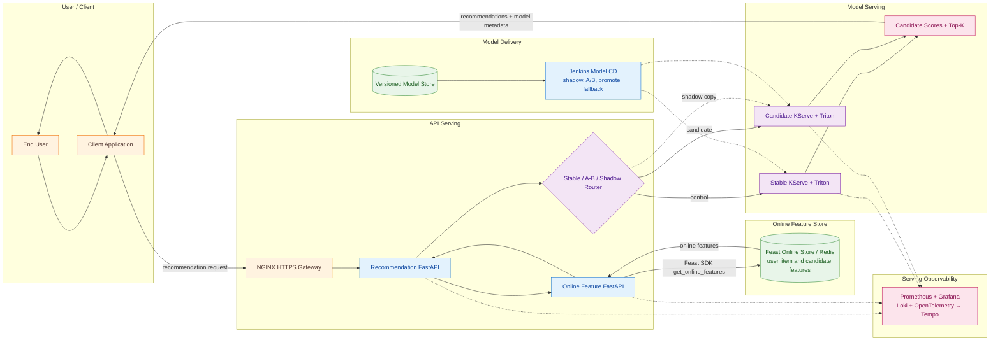
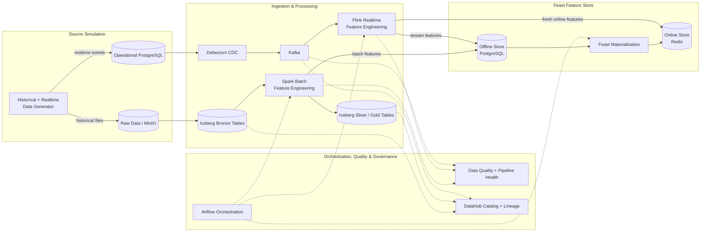
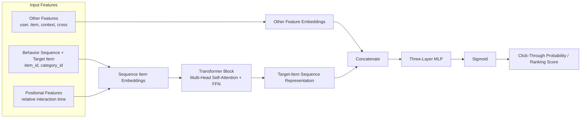

# End-to-End E-commerce Recommendation Platform

A **production-style, end-to-end recommendation platform** for data engineering, machine learning, deployment, serving, governance, and observability workflows on Kubernetes.

## 🛍️ Business Domain

This project is an end-to-end recommendation platform for e-commerce. It turns catalog, user, session, impression, behavior, and order data into batch and real-time features, trains a Behavior Sequence Transformer (BST), and serves personalized Top-K product recommendations through a production-style MLOps workflow.

---

## 📝 System Overview

- **Functionality:** Generate and ingest data; process batch and streaming features; govern and validate data; train, version, and deploy models; serve recommendations; monitor quality and runtime health.
- **Tech stack:** Python, FastAPI, PostgreSQL, MinIO, Iceberg, Kafka, Debezium, Spark, Flink, Airflow, Feast, Redis, Kubeflow, KubeRay, MLflow, KServe, Triton, Jenkins, Helm, Terraform, Prometheus, Grafana, Loki, Tempo, and DataHub.

---

## 📚 Table of Contents

1. [🛍️ Business Domain](#-business-domain)
2. [📝 System Overview](#-system-overview)
3. [🏗️ Architecture](#-architecture)
   - [Overall System Flow](#overall-system-flow)
   - [Serving Pipeline](#serving-pipeline)
   - [Data Platform Pipeline](#data-platform-pipeline)
   - [Ranking Sequence Model Architecture](#ranking-sequence-model-architecture)
4. [📁 Repository Main Folder Structure](#-repository-main-folder-structure)
5. [📖 Code Documentation Standards](#-code-documentation-standards)
6. [🗂️ Coursework Documentation](#-coursework-documentation)

---

## 🏗️ Architecture

### Overall System Flow

```mermaid
flowchart LR
  %% ===== Data platform and feature store =====
  subgraph DP["Data Platform & Feature Store"]
    direction TB
    Generator["Historical + Realtime<br/>Data Generator"]
    SourceDB[("Operational PostgreSQL")]
    Raw[("Raw Data / MinIO")]
    Debezium["Debezium CDC"]
    Kafka["Kafka"]
    BronzeLake[("Iceberg Bronze Tables")]
    Spark["Spark Batch<br/>Feature Engineering"]
    SilverGoldLake[("Iceberg Silver / Gold Tables")]
    Flink["Flink Realtime<br/>Feature Engineering"]
    Airflow["Airflow Orchestration"]
    DataChecks["Data Quality + Pipeline Health<br/>failures, freshness, contracts, lag"]
    DataHub["DataHub Governance<br/>Catalog + Lineage"]

    Generator --> Raw --> BronzeLake --> Spark --> SilverGoldLake
    Generator --> SourceDB --> Debezium --> Kafka --> Flink
    Airflow -.-> Spark
    Airflow -.-> Flink
    Airflow -.-> DataChecks
    Spark -.-> DataChecks
    Flink -.-> DataChecks
    Kafka -.-> DataChecks
    BronzeLake -.-> DataHub
    SilverGoldLake -.-> DataHub
    Kafka -.-> DataHub

    subgraph FP["Feast Feature Store"]
      direction TB
      Offline[("Feast Offline Store<br/>PostgreSQL")]
      Materialize["Feast Materialization"]
      Online[("Feast Online Store<br/>Redis")]

      Offline --> Materialize --> Online
    end

    Spark --> Offline
    Flink --> Offline
    Flink --> Online
    Airflow -.-> Materialize
  end

  %% ===== Analytics platform =====
  subgraph AP["Analytics Platform"]
    direction TB
    SilverSync["Silver Sync<br/>Iceberg Silver → Analytics Staging"]
    Analytics["Trino + dbt<br/>Gold marts"]
    Superset["Superset BI"]
    AnalyticsStakeholder["Analytics Stakeholders<br/>Business / Product / ML"]

    SilverSync --> Analytics --> Superset --> AnalyticsStakeholder
  end

  SilverGoldLake -->|read curated Silver tables| SilverSync
  Airflow -.-> SilverSync

  %% ===== ML platform =====
  subgraph ML["ML Training Platform"]
    direction TB
    Drift["Feature Drift Monitoring"]
    KFP["Kubeflow Pipeline<br/>prepare → train → evaluate"]
    Ray["KubeRay<br/>Ray Tune + Distributed Training"]
    Evaluate["Model Evaluation<br/>& Promotion Gate"]

    Drift -->|retrain trigger| KFP
    KFP --> Ray --> Evaluate
  end

  Offline --> Drift
  Offline -->|historical training features| KFP
  Airflow -.-> Drift

  %% ===== Tracking, artifacts and model delivery =====
  subgraph MR["Experiment Tracking & Model Registry"]
    direction TB
    MLflow["MLflow"]
    TrackingDB[("PostgreSQL<br/>metadata + registry")]
    Artifacts[("MinIO<br/>checkpoints + artifacts")]
    ModelStore[("Versioned Triton<br/>Model Repository")]

    MLflow --> TrackingDB
    MLflow --> Artifacts
  end

  Ray --> MLflow
  Evaluate --> MLflow
  Evaluate --> ModelStore

  subgraph CD["Controlled Model CD"]
    direction TB
    CandidateSelect["Select MLflow Candidate<br/>candidate=test"]
    ModelCD["Jenkins Model CD"]
    ShadowDeploy["Shadow Deployment<br/>candidate gets async traffic copy<br/>user response stays on control"]
    ShadowGate{"Candidate ready and<br/>shadow healthy?"}
    Progressive["Progressive A/B<br/>10% → 25% → 50%<br/>wait for samples at each stage"]
    RolloutGate{"Online gates pass?<br/>sample count, errors, p95 latency"}
    PromoteModel["Promote Candidate<br/>update latest + champion alias"]
    Fallback["Automatic Fallback<br/>candidate weight = 0<br/>keep old champion"]
    Cleanup["Delete Temporary<br/>Candidate Triton"]

    CandidateSelect --> ModelCD --> ShadowDeploy --> ShadowGate
    ShadowGate -->|pass| Progressive --> RolloutGate
    ShadowGate -->|fail| Fallback
    RolloutGate -->|hold: need more samples| Progressive
    RolloutGate -->|pass at 50%| PromoteModel
    RolloutGate -->|regression| Fallback
    PromoteModel --> Cleanup
    Fallback --> Cleanup
  end
  ModelStore --> ModelCD
  MLflow -.->|candidate and champion aliases| CandidateSelect

  %% ===== Online serving =====
  subgraph OS["Online Serving"]
    direction TB
    Gateway["NGINX HTTPS Gateway"]
    API["Recommendation FastAPI"]
    FeatureAPI["Online Feature FastAPI"]
    Router["Stable / A-B / Shadow Router"]
    Triton["KServe + Triton<br/>Stable and Candidate Models"]
    TopK["Top-K Recommendations"]

    Gateway --> API
    API --> FeatureAPI
    FeatureAPI --> API
    API --> Router --> Triton --> TopK
  end

  FeatureAPI -->|read via Feast SDK| Online
  Online -->|user, item and candidate features| FeatureAPI
  ShadowDeploy -.->|deploy candidate at 0% response traffic| Triton
  Progressive -->|set candidate weight| Triton
  PromoteModel -->|replace stable champion| Triton
  Fallback -->|restore stable-only serving| Triton
  Cleanup -.->|remove temporary candidate| Triton

  subgraph UX["User / Client"]
    direction TB
    EndUser["End User"]
    ClientApp["Client Application"]

    EndUser --> ClientApp
  end
  ClientApp -->|recommendation request| Gateway
  TopK -->|recommendations| ClientApp
  ClientApp --> EndUser
  ClientApp -.->|clicks, carts, purchases| SourceDB

  %% ===== Cross-cutting platform capabilities =====
  subgraph OBS["Observability"]
    direction TB
    Pushgateway["PushGateway + Exporters"]
    Prometheus["Prometheus Metrics"]
    Logs["Promtail + Loki Logs"]
    OTel["OpenTelemetry<br/>OTLP Traces"]
    Tempo["Tempo Trace Backend"]
    Grafana["Grafana Dashboards"]
    Alerts["Grafana Alerts<br/>data quality, job failures,<br/>stream lag and service health"]

    Pushgateway --> Prometheus --> Grafana --> Alerts
    Logs --> Grafana
    OTel --> Tempo --> Grafana
  end
  DataChecks -.-> Pushgateway
  Airflow -.-> Prometheus
  Airflow -.-> Logs
  Spark -.-> Logs
  Flink -.-> Logs
  KFP -.-> Prometheus
  ModelCD -.-> Prometheus
  API -.-> Prometheus
  API -.-> Logs
  API -.-> OTel
  Triton -.-> Prometheus

  subgraph DELIVERY["Platform Delivery"]
    direction TB
    Dev["Developer + Git"]
    Tests["Unit + Integration Tests"]
    Coverage{"Coverage > 90%?"}
    CIFail["Fail CI"]
    Build["Build Versioned Docker Images<br/>Jenkins + Cloud Build"]
    Registry[("GCP Artifact Registry")]
    AppCD["Application CD<br/>helm upgrade --install"]
    Platform["Infrastructure: Terraform<br/>GKE, security, secrets, autoscaling"]

    Dev --> Tests --> Coverage
    Coverage -->|pass| Build --> Registry
    Coverage -->|fail| CIFail
    Registry -->|pull versioned images| AppCD
  end
  AppCD -->|upgrade data platform| Airflow
  AppCD -->|upgrade analytics| Superset
  AppCD -->|upgrade ML runtime| KFP
  AppCD -->|upgrade API serving| API
  AppCD -->|upgrade model serving| Triton
  AppCD -->|upgrade observability| Grafana
  Platform -.-> Airflow
  Platform -.-> KFP
  Platform -.-> API
  Platform -.-> Triton

  classDef data fill:#e3f2fd,stroke:#1976d2,color:#0d47a1;
  classDef store fill:#e8f5e9,stroke:#388e3c,color:#1b5e20;
  classDef ml fill:#f3e5f5,stroke:#7b1fa2,color:#4a148c;
  classDef serve fill:#fce4ec,stroke:#c2185b,color:#880e4f;
  classDef ops fill:#fff3e0,stroke:#ef6c00,color:#4e342e;

  class Generator,SourceDB,Raw,Debezium,Kafka,BronzeLake,Spark,SilverGoldLake,Flink,Airflow,DataChecks,DataHub,SilverSync,Analytics,Superset,AnalyticsStakeholder data;
  class Offline,Materialize,Online,TrackingDB,Artifacts,ModelStore,Registry store;
  class Drift,KFP,Ray,Evaluate,MLflow,CandidateSelect,ModelCD,ShadowDeploy,ShadowGate,Progressive,RolloutGate,PromoteModel,Fallback,Cleanup ml;
  class EndUser,ClientApp,Gateway,API,FeatureAPI,Router,Triton,TopK serve;
  class Pushgateway,Prometheus,Logs,OTel,Tempo,Grafana,Alerts,Dev,Tests,Coverage,CIFail,Build,AppCD,Platform ops;
```

The following Mermaid diagram is the **End-to-End Platform** view from [high-level system design](<docs/submission/rubic-final-coursework-(final-ml)/high_level_system_design.md>).



### Serving Pipeline

The serving module retrieves fresh online features, routes stable, candidate, or shadow traffic, scores candidates with KServe/Triton, and returns Top-K recommendations.



### Data Platform Pipeline

The data platform combines batch and CDC ingestion, Spark and Flink processing, Airflow orchestration, data-quality checks, DataHub lineage, and Feast offline/online feature stores.



### Ranking Sequence Model Architecture

The ranking model follows the architecture in [*Behavior Sequence Transformer for E-commerce Recommendation in Alibaba*](https://arxiv.org/pdf/1905.06874): positional and item features represent the ordered behavior sequence, a Transformer captures dependencies between interactions, and its target-item representation is combined with user, item, context, and cross features for CTR prediction.



---

## 📁 Repository Main Folder Structure

```txt
├── apps                                      /* Deployable application and data/ML workloads */
│   ├── analytics                             /* Trino/dbt Gold models and Superset dashboard bootstrap */
│   ├── api-serving                           /* Online-feature and recommendation FastAPI services */
│   ├── data-platform                         /* Generator, ingestion, Spark/Flink, Airflow, Feast, quality, and governance */
│   └── ml-system                             /* BST training, Kubeflow, Ray, MLflow, promotion, and Triton packaging */
├── configs                                   /* Local, proof, and Kubernetes runtime configuration */
├── docs                                      /* Design notes, coursework evidence, screenshots, and tracking workbook */
│   ├── submission/rubic-(mini-coursework)    /* Data Platform rubric documentation */
│   └── submission/rubic-final-coursework-(final-ml) /* ML System rubric documentation */
├── graphify-out                              /* Generated knowledge graph, architecture report, and code relationships */
├── infra                                     /* Runtime and cloud infrastructure */
│   ├── cloudbuild                            /* GCP Cloud Build image pipelines */
│   ├── docker                                /* Local Docker Compose stack and shared service images */
│   ├── helm                                  /* Kubernetes charts for platform, serving, security, CI, and observability */
│   ├── k8s                                   /* Standalone proof and verification manifests */
│   ├── kubeflow                              /* Compiled Kubeflow pipeline packages */
│   └── terraform/gcp                         /* Terraform-managed GCP/GKE resources and Helm releases */
├── jenkins                                   /* Component CI/CD, model rollout, deployment, and verification scripts */
├── notebooks                                 /* Interactive ML workflow and local experimentation */
├── tests                                     /* Unit, contract, integration, end-to-end, mutation, and load tests */
├── Jenkinsfile                               /* Monorepo path-based CI/CD pipeline entrypoint */
├── Makefile                                  /* Common local, Docker, GCP, test, and proof commands */
└── pyproject.toml                            /* Python dependencies and tooling configuration */
```

---

## 📖 Code Documentation Standards

All production source code must follow these documentation rules:

- Every source file starts with a concise **module-level docstring** that explains the file's responsibility.
- Every **class, function, and method** has a docstring describing its purpose.
- Docstrings document inputs, return values, important side effects, and raised exceptions when they are not obvious from the signature.
- Documentation stays focused on behavior and contracts; it should not repeat the implementation line by line.

```python
"""Build and validate recommendation features for offline training."""


class FeatureBuilder:
    """Create model-ready features from governed Silver tables."""

    def build(self, source_uri: str) -> dict[str, int]:
        """Build feature tables and return their row counts."""
```

---

## 🗂️ Coursework Documentation

The two tables below convert the major sections from the first two tabs of [Coursework Tracking (Public).xlsx](<docs/xlsx/Coursework Tracking (Public).xlsx>) into navigable documentation indexes.

### Data Platform

Source: tab **`rubic (mini-coursework)`**.

| Rubric area | Coverage |
| --- | --- |
| [README and high-level design](README.md) | Business domain, repository structure, table of contents, and deployable-unit architecture. |
| [Engineering Fundamentals](<docs/submission/rubic-(mini-coursework)/docker.md>) | Docker, Docker Compose, multi-stage builds, and image-size optimization. |
| [Implement Data Generator](<docs/submission/rubic-(mini-coursework)/data_generator.md>) | Offline skew, high cardinality, schema evolution, duplicates, streaming burst/late events, configuration, and raw storage. |
| [Processing Jobs](<docs/submission/rubic-(mini-coursework)/processing_jobs.md>) | Spark offline processing, Flink streaming processing, optimization evidence, pipeline integration, and window processing. |
| [Data Storage](<docs/submission/rubic-(mini-coursework)/data_storage.md>) | Lakehouse compaction/partitioning and data-warehouse indexing. |
| [Data Pipeline Orchestration](<docs/submission/rubic-(mini-coursework)/data_pipeline_orchestration.md>) | Airflow DP1, DP2, and DP3 ingest/validate stages. |
| [Data Governance](<docs/submission/rubic-(mini-coursework)/data_governance.md>) | DataHub lineage, validation, and data contracts for DP1, DP2, and DP3. |
| [Schema Design](<docs/submission/rubic-(mini-coursework)/schema_design.md>) | Zone schemas, SCD2 dimensions, feature timestamps, table relationships, and naming conventions. |
| [Novel Ideas](<docs/submission/rubic-(mini-coursework)/novel_ideas.md>) | Grafana-based data-quality monitoring and analytics-platform extensions. |

### ML System

Source: tab **`rubic final-coursework (final -`**.

| Rubric area | Coverage |
| --- | --- |
| [High-Level System Design](<docs/submission/rubic-final-coursework-(final-ml)/high_level_system_design.md>) | End-to-end deployment, serving, model, infrastructure, security, and delivery architecture. |
| [Web API: Pull Online Features](<docs/submission/rubic-final-coursework-(final-ml)/web-api-pull-data.md>) | FastAPI, Pydantic validation, async feature retrieval, health checks, Helm rollout, and fallback. |
| [Web API: Model Prediction](<docs/submission/rubic-final-coursework-(final-ml)/web-api-model-prediction.md>) | Online features, Triton request construction, inference, ranking, and response validation. |
| [Real-Time Drift Detection and ML Telemetry](<docs/submission/rubic-final-coursework-(final-ml)/observability.md>) | Drift telemetry, scheduled comparison, dashboards, and Kubeflow retraining trigger. |
| [Autoscale](<docs/submission/rubic-final-coursework-(final-ml)/autoscale.md>) | KEDA/HPA autoscaling for APIs and Triton with load-test evidence. |
| [Validation & Verification](<docs/submission/rubic-final-coursework-(final-ml)/validation_verification.md>) | Coverage, fixtures/mocks, equivalence partitions, boundary values, mutation/property-based tests, and load tests. |
| [Improve the Data Generator](<docs/submission/rubic-final-coursework-(final-ml)/improve_data_generator.md>) | Configurable data drift and ID-label generation for training joins. |
| [Feature Store](<docs/submission/rubic-final-coursework-(final-ml)/feature_store.md>) | Incremental materialization, streaming writes to offline/online stores, and TTL design. |
| [ML](<docs/submission/rubic-final-coursework-(final-ml)/ml.md>) | Feast training-data retrieval, train/validation split, BST training, evaluation, and model saving. |
| [ML Pipelines](<docs/submission/rubic-final-coursework-(final-ml)/ml_pipelines.md>) | Kubeflow pipeline stages, Ray Tune, distributed training, evaluation, and promotion. |
| [Versioning](<docs/submission/rubic-final-coursework-(final-ml)/versioning.md>) | MLflow model versioning and incremental data versioning. |
| [CI/CD](<docs/submission/rubic-final-coursework-(final-ml)/ci_cd.md>) | CI/CD for materialization, training, DP1–DP3, APIs, inference, drift detection, and streaming jobs. |
| [Routing & Gateway](<docs/submission/rubic-final-coursework-(final-ml)/routing_gateway.md>) | NGINX gateway, hidden services, authentication, rate limits, domains, and HTTPS. |
| [Infrastructure as Code](<docs/submission/rubic-final-coursework-(final-ml)/iac.md>) | Terraform-managed GCP/GKE services and infrastructure layout. |
| [Observability](<docs/submission/rubic-final-coursework-(final-ml)/observability.md>) | API and infrastructure metrics, logs, traces, Grafana dashboards, and drift monitoring. |
| [A/B Testing](<docs/submission/rubic-final-coursework-(final-ml)/ab_testing.md>) | Stable/candidate traffic split and per-version monitoring. |
| [Security](<docs/submission/rubic-final-coursework-(final-ml)/security.md>) | Centralized secret management, service-mesh authentication, mTLS, and authorization. |
| [Repository Design](<docs/submission/rubic-final-coursework-(final-ml)/repository_design.md>) | Clean repository boundaries, clean code, and design-pattern evidence. |
| [Low-Level ML Design](<docs/submission/rubic-final-coursework-(final-ml)/low_level_ml_design.md>) | Five key service classes and their implementation mappings. |
| [Novel Ideas](<docs/submission/rubic-final-coursework-(final-ml)/noval_ideas.md>) | Automated shadow deployment, progressive A/B gates, promotion, fallback, and cleanup. |
