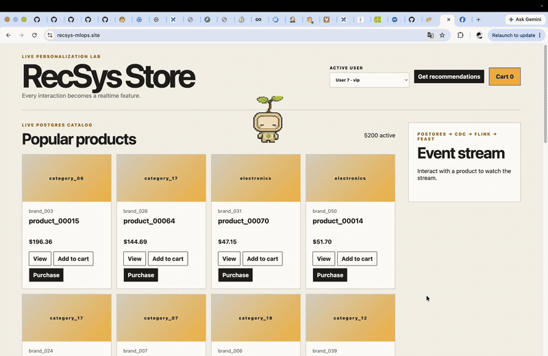
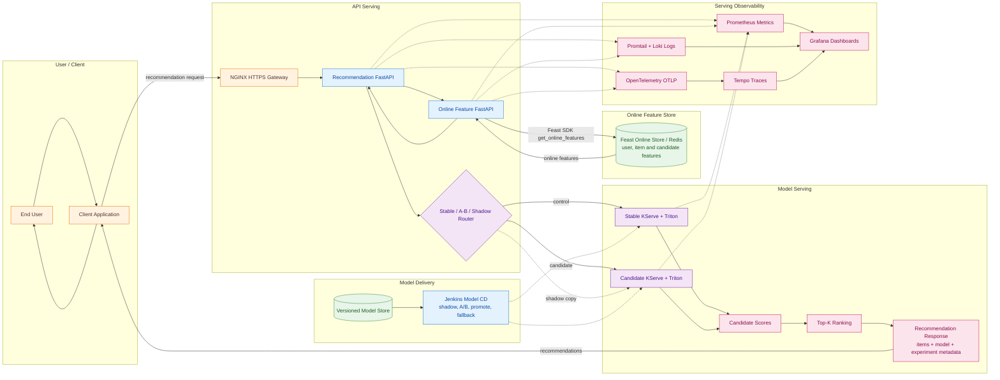
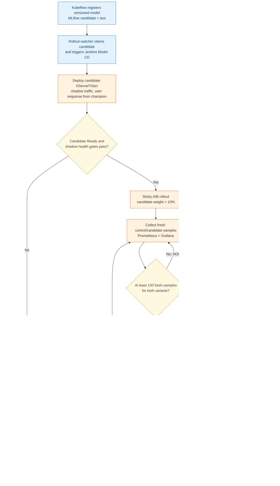
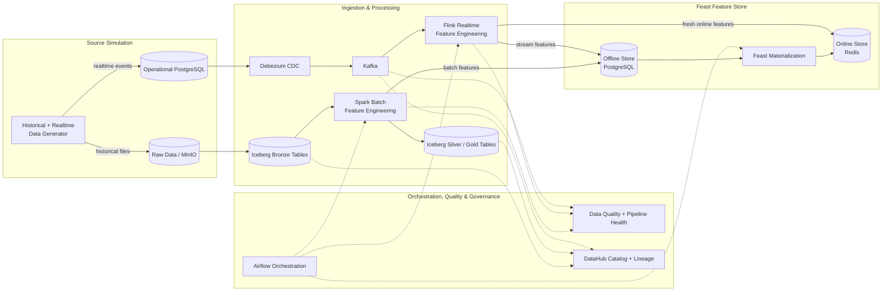
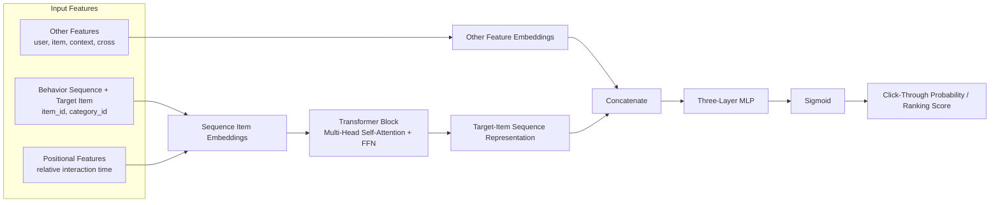

# End-to-End E-commerce Recommendation Platform

A **production-style, end-to-end recommendation platform** for data engineering, machine learning, deployment, serving, governance, and observability workflows on Kubernetes.

## 🛍️ Business Domain

This project is an end-to-end recommendation platform for e-commerce. It turns catalog, user, session, impression, behavior, and order data into batch and real-time features, trains a Behavior Sequence Transformer (BST), and serves personalized Top-K product recommendations through a production-style MLOps workflow.

---

## 📝 System Overview

- **Data and analytics platform:** Generates configurable historical and real-time e-commerce events in PostgreSQL and MinIO, then streams CDC records through Debezium and Kafka. Spark builds batch features and Iceberg Bronze/Silver/Gold tables, while Flink handles event-time processing, deduplication, watermarking, streaming quality windows, and online feature updates. Airflow orchestrates ingestion, validation, compaction, materialization, drift, and analytics workflows; Feast serves PostgreSQL offline features and Redis online features; Hudi, DataHub, Trino, dbt, Superset, and Evidently provide dataset versioning, lineage, governed analytics, data quality, and drift monitoring.

- **ML training and retraining platform:** Trains a PyTorch Behavior Sequence Transformer with time-aware datasets, negative sampling, ranking metrics, checkpointing, and ONNX/Triton model packaging. Kubeflow Pipelines coordinates data preparation, KubeRay/Ray Tune hyperparameter search and distributed training, evaluation, and promotion. MLflow uses PostgreSQL for tracking and registry metadata and MinIO for artifacts and versioned models; offline NDCG gates, feature-drift checks, and online candidate error/latency gates control promotion and drift-triggered retraining.

- **Serving, infrastructure, and delivery:** FastAPI retrieves Feast online features, calls the Triton V2 inference API, ranks candidates, and returns personalized Top-K recommendations through NGINX. KServe manages stable and candidate Triton deployments, while KEDA HTTP/resource scalers and HPA policies autoscale API and inference workloads. Terraform and Helm provision GCP/GKE and Kubernetes resources; Jenkins and Cloud Build automate testing, image publishing, and deployment with shadow traffic, sticky progressive A/B rollout, model promotion, champion fallback, Helm rollback, and candidate cleanup.

- **Web UI module:** Provides a React, TypeScript, Vite, and TanStack Query storefront served by a non-root NGINX container, backed by a same-origin FastAPI API. The backend uses a bounded PostgreSQL connection pool for transactional user, event, and order writes, and calls the feature and recommendation services to exercise the complete `PostgreSQL → Debezium → Kafka → Flink → Redis/Feast → Triton` real-time path. The frontend and backend are released atomically with Helm and include ingress routing, PDBs, External Secrets, Prometheus/OpenTelemetry instrumentation, CI security checks, deployment smoke tests, and revision-based rollback.

- **Security and observability:** Vault and External Secrets Operator manage runtime credentials; Istio mTLS, authorization policies, and Kubernetes NetworkPolicies secure service-to-service communication. Prometheus and Pushgateway collect infrastructure, pipeline, quality, drift, API, and model-rollout metrics; Grafana provides dashboards and alerts, Loki/Promtail centralize logs, and Tempo/OpenTelemetry provide distributed tracing.

---

## 🎬 Recommendation Web Demo

The demo shows the production web flow from user interactions and streaming feature updates through personalized recommendation serving.

[](docs/pngs/web_demo.mp4)

---

## 📚 Table of Contents

1. [🛍️ Business Domain](#-business-domain)
2. [📝 System Overview](#-system-overview)
3. [🎬 Recommendation Web Demo](#-recommendation-web-demo)
4. [🏗️ Architecture](#-architecture)
   - [Overall System Flow](#overall-system-flow)
   - [Serving Pipeline High-Level Architecture](#serving-pipeline-high-level-architecture)
   - [Progressive A/B Testing and Automatic Rollback](#progressive-ab-testing-and-automatic-rollback)
   - [Data Platform Pipeline](#data-platform-pipeline)
   - [Ranking Sequence Model Architecture](#ranking-sequence-model-architecture)
5. [📁 Repository Main Folder Structure](#-repository-main-folder-structure)
6. [📖 Code Documentation Standards](#-code-documentation-standards)
7. [🗂️ Coursework Documentation](#-coursework-documentation)

---

## 🏗️ Architecture

### Overall System Flow

The following diagram presents the **End-to-End Platform** architecture documented in [high-level system design](<docs/submission/rubic-final-coursework-(final-ml)/high_level_system_design.md>).


### Serving Pipeline High-Level Architecture

The serving module retrieves fresh online features, routes stable, candidate, or shadow traffic, scores candidates with KServe/Triton, and returns Top-K recommendations.



### Progressive A/B Testing and Automatic Rollback

The model-delivery controller turns an MLflow candidate into a shadow deployment, then progressively exposes sticky user traffic at **10% → 25% → 50%**. At every step, Jenkins evaluates fresh control/candidate samples from Prometheus; a regression immediately restores champion-only traffic, while a final pass promotes the candidate and removes the temporary Triton service. See [A/B testing](<docs/submission/rubic-final-coursework-(final-ml)/ab_testing.md>) and [progressive rollout details](<docs/submission/rubic-final-coursework-(final-ml)/noval_ideas.md>).



### Data Platform Pipeline

The data platform combines batch and CDC ingestion, Spark and Flink processing, Airflow orchestration, data-quality checks, DataHub lineage, and Feast offline/online feature stores.



### Ranking Sequence Model Architecture

The ranking model follows the architecture in [*Behavior Sequence Transformer for E-commerce Recommendation in Alibaba*](https://arxiv.org/pdf/1905.06874): positional and item features represent the ordered behavior sequence, a Transformer captures dependencies between interactions, and its target-item representation is combined with user, item, context, and cross features for CTR prediction.



---

## 📁 Repository Main Folder Structure

```txt
├── apps/                         # Deployable product and data/ML workloads
│   ├── analytics/                # Analytics models and dashboard bootstrap
│   ├── api-serving/              # Online feature and recommendation APIs
│   ├── data-platform/            # Ingestion, processing, orchestration, feature store, and governance
│   └── ml-system/                # Training, experimentation, model promotion, and serving packaging
├── configs/                      # Versioned environment and service configuration
├── docs/                         # Architecture, design, and coursework documentation
├── infra/                        # Local and cloud infrastructure definitions
│   ├── cloudbuild/               # Cloud image build pipelines
│   ├── docker/                   # Docker images and local Compose runtime
│   ├── helm/                     # Kubernetes application charts
│   ├── k8s/                      # Kubernetes manifests and cluster lifecycle scripts
│   ├── kubeflow/                 # Kubeflow pipeline deployment artifacts
│   └── terraform/                # Cloud infrastructure as code
├── jenkins/                      # CI/CD jobs, model rollout, and deployment automation
├── notebooks/                    # Tracked exploration and ML workflow notebooks
└── tests/                        # Unit, contract, integration, end-to-end, and load tests
```

---

## 🗂️ Coursework Documentation

The two tables below convert the major sections from the first two tabs of [Coursework Tracking (Public).xlsx](<docs/xlsx/Coursework Tracking (Public).xlsx>) into navigable documentation indexes.

### Data Platform

Source: tab **`rubic (mini-coursework)`**.

| Rubric area | Coverage |
| --- | --- |
| [README and high-level design](README.md) | Business domain, repository structure, table of contents, and deployable-unit architecture. |
| [Engineering Fundamentals](<docs/submission/rubic-(mini-coursework)/docker.md>) | Docker, Docker Compose, multi-stage builds, and image-size optimization. |
| [Implement Data Generator](<docs/submission/rubic-(mini-coursework)/data_generator.md>) | Offline skew, high cardinality, schema evolution, duplicates, streaming burst/late events, configuration, and raw storage. |
| [Processing Jobs](<docs/submission/rubic-(mini-coursework)/processing_jobs.md>) | Spark offline processing, Flink streaming processing, optimization evidence, pipeline integration, and window processing. |
| [Data Storage](<docs/submission/rubic-(mini-coursework)/data_storage.md>) | Lakehouse compaction/partitioning and data-warehouse indexing. |
| [Data Pipeline Orchestration](<docs/submission/rubic-(mini-coursework)/data_pipeline_orchestration.md>) | Airflow DP1, DP2, and DP3 ingest/validate stages. |
| [Data Governance](<docs/submission/rubic-(mini-coursework)/data_governance.md>) | DataHub lineage, validation, and data contracts for DP1, DP2, and DP3. |
| [Schema Design](<docs/submission/rubic-(mini-coursework)/schema_design.md>) | Zone schemas, SCD2 dimensions, feature timestamps, table relationships, and naming conventions. |
| [Novel Ideas](<docs/submission/rubic-(mini-coursework)/novel_ideas.md>) | Grafana-based data-quality monitoring and analytics-platform extensions. |

### ML System

Source: tab **`rubic final-coursework (final -`**.

| Rubric area | Coverage |
| --- | --- |
| [High-Level System Design](<docs/submission/rubic-final-coursework-(final-ml)/high_level_system_design.md>) | End-to-end deployment, serving, model, infrastructure, security, and delivery architecture. |
| [Web API: Pull Online Features](<docs/submission/rubic-final-coursework-(final-ml)/web-api-pull-data.md>) | FastAPI, Pydantic validation, async feature retrieval, health checks, Helm rollout, and fallback. |
| [Web API: Model Prediction](<docs/submission/rubic-final-coursework-(final-ml)/web-api-model-prediction.md>) | Online features, Triton request construction, inference, ranking, and response validation. |
| [Real-Time Drift Detection and ML Telemetry](<docs/submission/rubic-final-coursework-(final-ml)/observability.md>) | Drift telemetry, scheduled comparison, dashboards, and Kubeflow retraining trigger. |
| [Autoscale](<docs/submission/rubic-final-coursework-(final-ml)/autoscale.md>) | KEDA/HPA autoscaling for APIs and Triton with load-test evidence. |
| [Validation & Verification](<docs/submission/rubic-final-coursework-(final-ml)/validation_verification.md>) | Coverage, fixtures/mocks, equivalence partitions, boundary values, mutation/property-based tests, and load tests. |
| [Improve the Data Generator](<docs/submission/rubic-final-coursework-(final-ml)/improve_data_generator.md>) | Configurable data drift and ID-label generation for training joins. |
| [Feature Store](<docs/submission/rubic-final-coursework-(final-ml)/feature_store.md>) | Incremental materialization, streaming writes to offline/online stores, and TTL design. |
| [ML](<docs/submission/rubic-final-coursework-(final-ml)/ml.md>) | Feast training-data retrieval, train/validation split, BST training, evaluation, and model saving. |
| [ML Pipelines](<docs/submission/rubic-final-coursework-(final-ml)/ml_pipelines.md>) | Kubeflow pipeline stages, Ray Tune, distributed training, evaluation, and promotion. |
| [Versioning](<docs/submission/rubic-final-coursework-(final-ml)/versioning.md>) | MLflow model versioning and incremental data versioning. |
| [CI/CD](<docs/submission/rubic-final-coursework-(final-ml)/ci_cd.md>) | CI/CD for materialization, training, DP1–DP3, APIs, inference, drift detection, and streaming jobs. |
| [Routing & Gateway](<docs/submission/rubic-final-coursework-(final-ml)/routing_gateway.md>) | NGINX gateway, hidden services, authentication, rate limits, domains, and HTTPS. |
| [Infrastructure as Code](<docs/submission/rubic-final-coursework-(final-ml)/iac.md>) | Terraform-managed GCP/GKE services and infrastructure layout. |
| [Observability](<docs/submission/rubic-final-coursework-(final-ml)/observability.md>) | API and infrastructure metrics, logs, traces, Grafana dashboards, and drift monitoring. |
| [A/B Testing](<docs/submission/rubic-final-coursework-(final-ml)/ab_testing.md>) | Stable/candidate traffic split and per-version monitoring. |
| [Security](<docs/submission/rubic-final-coursework-(final-ml)/security.md>) | Centralized secret management, service-mesh authentication, mTLS, and authorization. |
| [Repository Design](<docs/submission/rubic-final-coursework-(final-ml)/repository_design.md>) | Clean repository boundaries, clean code, and design-pattern evidence. |
| [Low-Level ML Design](<docs/submission/rubic-final-coursework-(final-ml)/low_level_ml_design.md>) | Five key service classes and their implementation mappings. |
| [Novel Ideas](<docs/submission/rubic-final-coursework-(final-ml)/noval_ideas.md>) | Automated shadow deployment, progressive A/B gates, promotion, fallback, and cleanup. |
