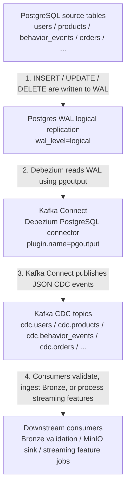

# RecSys Data Platform

This module owns the RecSys data platform ingestion, validation, warehouse,
feature-store, and streaming feature paths.

## CDC Flow

The realtime path uses PostgreSQL logical replication, Debezium, Kafka Connect,
Kafka topics, and downstream consumers for Bronze ingestion and streaming
features.



1. PostgreSQL source tables receive `INSERT`, `UPDATE`, and `DELETE` operations,
   and each change is written to the WAL.
2. The Debezium PostgreSQL connector reads the WAL through PostgreSQL logical
   replication using the `pgoutput` plugin.
3. Kafka Connect runs the Debezium connector and publishes CDC change events as
   JSON messages to Kafka topics.
4. Downstream consumers read those Kafka topics to validate records, ingest raw
   CDC data into the Bronze zone, and process streaming features.

For the primary realtime feature path:

```text
public.behavior_events
  -> Postgres WAL
  -> Debezium pgoutput connector
  -> Kafka Connect
  -> cdc.behavior_events
  -> Bronze CDC validation / MinIO sink / realtime stream consumer
```

For the full source OLTP path:

```text
public.* source tables
  -> Postgres WAL
  -> Debezium pgoutput connector
  -> Kafka Connect
  -> cdc.* Kafka topics
  -> Bronze zone / warehouse staging / streaming features
```

## Implementation Map

| Platform part | Implementation |
| --- | --- |
| PostgreSQL WAL logical replication | `infra/docker/docker-compose.dataflow.yml`, `infra/helm/recsys-data-platform/templates/postgres.yaml` |
| Debezium connector config | `infra/docker/debezium/postgres-connector.json`, `apps/data-platform/src/ingest/register_k8s_connectors.py` |
| Kafka Connect image | `infra/docker/Dockerfile.kafka-connect` |
| CDC topic contracts | `apps/data-platform/src/ingest/postgres_cdc_contracts.py`, `apps/data-platform/src/ingest/kafka_raw_reader.py` |
| Bronze CDC reader | `apps/data-platform/src/ingest/bronze_cdc_reader.py` |
| Bronze CDC validation | `infra/docker/scripts/validate_bronze_cdc.py`, `infra/docker/scripts/smoke_check_stack.py` |
| Kafka to MinIO Bronze sink | `infra/docker/debezium/kafka-connect-s3-sink.json`, `apps/data-platform/src/ingest/register_k8s_connectors.py` |
| PySpark offline processing | `apps/data-platform/src/feature_engineering/spark/spark_batch_entrypoint.py`, `apps/data-platform/src/feature_engineering/spark/*.py` |
| PySpark Bronze CDC batch features | `apps/data-platform/src/feature_engineering/spark/spark_realtime_bronze_entrypoint.py` |
| PyFlink realtime stream feature consumer | `apps/data-platform/src/feature_engineering/flink/realtime_stream_job.py` |
| Local Airflow CDC path | `apps/data-platform/src/orchestration/airflow/dags/full_dataflow_local_dag.py` |
| Kubernetes Airflow CDC path | `apps/data-platform/src/orchestration/airflow/dags/k8s_data_platform_dag.py` |
| Governance lineage | `apps/data-platform/src/metadata/ingest_datahub_governance.py` |

## CDC Runtime Notes

- Source PostgreSQL is started with `wal_level=logical`,
  `max_replication_slots=8`, and `max_wal_senders=8`.
- Debezium uses `plugin.name=pgoutput`, `slot.name=recsys_slot`, and
  `publication.autocreate.mode=filtered`.
- Debezium first maps source tables to `cdc.public.<table>` topics, then the
  connector `RegexRouter` rewrites them to `cdc.<table>`.
- The MinIO sink persists raw CDC JSON under `s3://recsys-lake/bronze/kafka`.
- Offline and Bronze feature jobs use PySpark DataFrame APIs and are submitted
  with `spark-submit`.
- The default streaming feature topic is `cdc.behavior_events`, and Airflow
  submits the realtime consumer with `--runner pyflink`.

## Useful Evidence Commands

Check connector status:

```bash
kubectl exec -n recsys-dataflow deploy/kafka-connect -- \
  curl -fsS http://localhost:8083/connectors/recsys-postgres-cdc/status
```

List CDC topics:

```bash
kubectl exec -n recsys-dataflow deploy/kafka -- \
  kafka-topics --bootstrap-server kafka:29092 --list | grep '^cdc\.'
```

Validate Bronze CDC records:

```bash
kubectl exec -n recsys-dataflow deploy/airflow-webserver -- \
  bash -lc 'PYTHONPATH=/opt/recsys/apps/data-platform/src:/opt/recsys python infra/docker/scripts/validate_bronze_cdc.py --topic cdc.behavior_events --min-records 1'
```

Run the bounded realtime consumer:

```bash
kubectl run recsys-cdc-consumer-smoke \
  -n recsys-dataflow \
  --rm -it --restart=Never \
  --image=recsys-flink:local \
  --image-pull-policy=Never \
  -- bash -lc 'PYTHONPATH=/opt/recsys/apps/data-platform/src:/opt/recsys python3 apps/data-platform/src/feature_engineering/flink/realtime_stream_job.py --topic cdc.behavior_events --max-events 20 --min-events 1 --idle-timeout-seconds 60'
```
