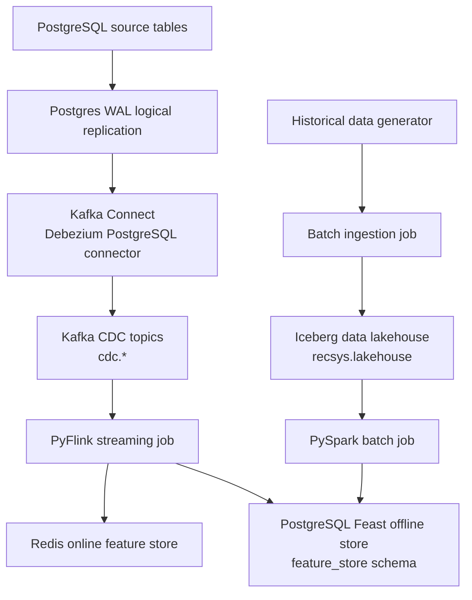

# RecSys Data Platform

This module owns the native RecSys data platform runtime: PostgreSQL CDC,
Kafka topics, Apache Iceberg lakehouse tables, PySpark batch features,
PyFlink streaming features, and Redis online feature serving.

## Native Lakehouse Flow



1. PostgreSQL writes source table changes to WAL with logical replication.
2. Debezium reads WAL through `pgoutput` and publishes JSON CDC events to Kafka.
3. PyFlink consumes `cdc.behavior_events`, owns streaming state, writes Redis
   online keys, and writes PostgreSQL Feast offline feature rows.
4. The historical data generator creates an ephemeral batch run, then Spark
   commits it into `recsys.lakehouse.bronze_*` Iceberg tables.
5. PySpark reads those lakehouse tables, writes clean silver lakehouse tables,
   writes lakehouse feature tables for audit/versioned storage, and exports the
   serving/training feature tables into PostgreSQL Feast offline store.

## Implementation Map

| Platform part | Implementation |
| --- | --- |
| PostgreSQL WAL logical replication | `infra/docker/docker-compose.dataflow.yml`, `infra/helm/recsys-data-platform/templates/postgres.yaml` |
| Debezium connector config | `infra/docker/debezium/postgres-connector.json`, `apps/data-platform/src/ingest/register_k8s_connectors.py` |
| Kafka Connect image | `infra/docker/Dockerfile.kafka-connect` |
| CDC topic contracts | `apps/data-platform/src/ingest/postgres_cdc_contracts.py`, `apps/data-platform/src/ingest/kafka_raw_reader.py` |
| Iceberg lakehouse config | `apps/data-platform/src/lakehouse/iceberg.py`, `configs/local/spark_batch.yaml` |
| Batch generator -> Bronze Iceberg ingestion | `apps/data-platform/src/ingest/batch_lakehouse_ingestion.py` |
| PySpark offline processing | `apps/data-platform/src/features/spark/spark_batch_entrypoint.py` |
| PyFlink realtime feature consumer | `apps/data-platform/src/features/flink/realtime_stream_job.py` |
| Redis online writer | `apps/data-platform/src/feature_store/online_writer.py` |
| Airflow orchestration | `apps/data-platform/src/orchestration/airflow/dags/rubric_data_pipeline_dags.py` |
| Governance lineage | `apps/data-platform/src/metadata/ingest_datahub_governance.py` |

## Runtime Notes

- Kafka Connect is kept only for the Debezium PostgreSQL source connector.
- The default lakehouse warehouse is `s3a://recsys-lakehouse/warehouse`.
- The default feature lakehouse warehouse is `s3a://recsys-offline-feature-store/warehouse`.
- The default lakehouse namespace is `recsys.lakehouse`.
- The default lakehouse feature namespace is `recsys_features.feature_store`.
- Feast offline feature tables live in PostgreSQL; Iceberg/Hudi/S3 paths are used for lakehouse, audit, and versioning proof storage.
- Online feature store keys live in Redis with the `fs:*` key templates.
- Spark and Flink production paths use native Spark/Flink APIs.

## Useful Evidence Commands

Check Debezium connector status:

```bash
kubectl exec -n recsys-dataflow deploy/kafka-connect -- \
  curl -fsS http://localhost:8083/connectors/recsys-postgres-cdc/status
```

List CDC topics:

```bash
kubectl exec -n recsys-dataflow deploy/kafka -- \
  kafka-topics --bootstrap-server kafka:29092 --list | grep '^cdc\.'
```

Run bounded native Flink stream:

```bash
kubectl exec -n recsys-dataflow deploy/flink-jobmanager -- \
  bash -lc 'PYTHONPATH=/opt/flink/opt/python:/opt/recsys/apps/data-platform/src:/opt/recsys \
  flink run -m flink-jobmanager:8081 \
  -py apps/data-platform/src/features/flink/realtime_stream_job.py -- \
  --runner pyflink --topic cdc.behavior_events --max-events 20 --min-events 1 \
  --offline-store-enabled'
```
