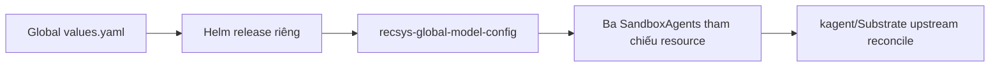

**Global ModelConfig do Helm ứng dụng quản lý**

Nguồn settings cho ba RecSys agent mặc định là [values.yaml](/Users/KHOAI/anhkhoa/RecSys-MLops/infra/helm/recsys-global-model-config/values.yaml). Release `recsys-global-model-config` tạo resource cùng tên trong namespace `kagent`. Terraform tiếp tục quản lý kagent/platform; `default-model-config` của chart kagent được giữ cho bootstrap/UI và rollback, không còn là config của ba RecSys agent mặc định.



**Cập nhật bằng Helm**

Sửa generation settings tại `modelConfig.openAI` trong file trên. Chạy từ repo root, dùng môi trường Python có PyYAML và kube/Helm credentials:

```bash
PATH="$PWD/.venv/bin:$PATH" bash ops/helm/deploy_global_model_config.sh
```

Script hiện chỉ gửi job `RecSys-Global-Model-Config` tới Jenkins, không chạy Helm trực tiếp. Cần môi trường Python có dependencies của workflow runtime và quyền đọc Jenkins credential; credentials chỉ xử lý trong memory. Jenkins không sẵn sàng thì fail closed. Nếu gửi job mất phản hồi, kiểm tra queue/build trước khi gửi lại; không tự retry.

Job giữ lock `recsys-production-release`, chạy release guard rồi kiểm tra consumer releases, deploy global config và nâng cấp Context, Recommendation, Coordinator. Nó giữ live Helm values, bao gồm Recommendation router activation, rồi chờ readiness do controller upstream quản lý. Có thể truyền values file đầy đủ làm argument đầu tiên; tên resource phải là `recsys-global-model-config`. Helper Helm nội bộ là `jenkins/scripts/deploy/global_model_config_locked.sh`, không dùng làm entrypoint trực tiếp.

Không chạy `helm upgrade` trực tiếp ngoài Jenkins. Thao tác nhiều release không có rollback nguyên tử; nếu bị ngắt, kiểm tra từng Helm release và trạng thái controller trước khi tiếp tục. Để quay lại settings cũ, khôi phục values file đã biết tốt và chạy lại script; giữ global resource tới khi mọi consumer đã chuyển xong.

**Jenkins**

- Thay đổi chart global chọn cả ba agent components.
- Deploy unit `global-model-config` đứng trước `context-agent`, `recommendation-agent`, `coordinator-agent`.
- Agent deployment giữ reference `spec.declarative.modelConfig`; kagent và Substrate upstream quản lý reconciliation/lifecycle.
- Không có checksum prompt marker, custom revision annotation hoặc helper xóa ActorTemplate.
- CI lint chart global cùng các chart agent.

Không thay đổi generation config hoặc binding của immutable `rec-ab-*` releases. Agent A/B có ModelConfig riêng; thay global không tạo một A/B experiment. Tên mới được chặn nếu đặt thành `default-model-config`, tránh tranh ownership với Terraform/kagent.

Model alias và inference endpoint là config của client. Đổi weights/quantization/context window vẫn thuộc chart serving hoặc LLM release; nếu đổi endpoint cần cập nhật network allowlist của sandbox tương ứng. Script này không sửa backend hay allowlist tự động.

**Kiểm tra**

```bash
kubectl -n kagent get modelconfig recsys-global-model-config
kubectl -n kagent get sandboxagents \
  -o 'custom-columns=NAME:.metadata.name,MODEL:.spec.declarative.modelConfig,READY:.status.conditions[?(@.type=="Ready")].status'
helm history recsys-global-model-config -n kagent
```

Các file triển khai: [chart template](/Users/KHOAI/anhkhoa/RecSys-MLops/infra/helm/recsys-global-model-config/templates/modelconfig.yaml), [Jenkins dispatcher](/Users/KHOAI/anhkhoa/RecSys-MLops/ops/helm/deploy_global_model_config.sh), [locked deploy helper](/Users/KHOAI/anhkhoa/RecSys-MLops/jenkins/scripts/deploy/global_model_config_locked.sh), [deploy order](/Users/KHOAI/anhkhoa/RecSys-MLops/jenkins/config/deploy-units.json).

**Kết quả chuyển đổi ngày 09/09/2026**

- Global Helm release revision 1; Context revision 62; Recommendation revision 52; Coordinator revision 65.
- Ba agent mặc định tham chiếu `recsys-global-model-config`, đã rebuild golden snapshots và đều Ready.
- Giữ `qwen3.5-0.8b`, temperature 0, maxTokens 384, seed 42 và endpoint gateway hiện có.
- Coordinator vẫn gọi `recsys-recommendation-router`; `rec-ab-7c965ae4a090d308fb5d` vẫn tham chiếu ModelConfig riêng.
- 103 unit/contract tests passed; hai contract modules MCP khác bỏ qua do môi trường local thiếu dependencies của CI profile. Bốn chart lint passed, server-side dry-run passed. Kiểm tra deploy ở mức resource/snapshot readiness; không chạy thêm conversation inference benchmark.
