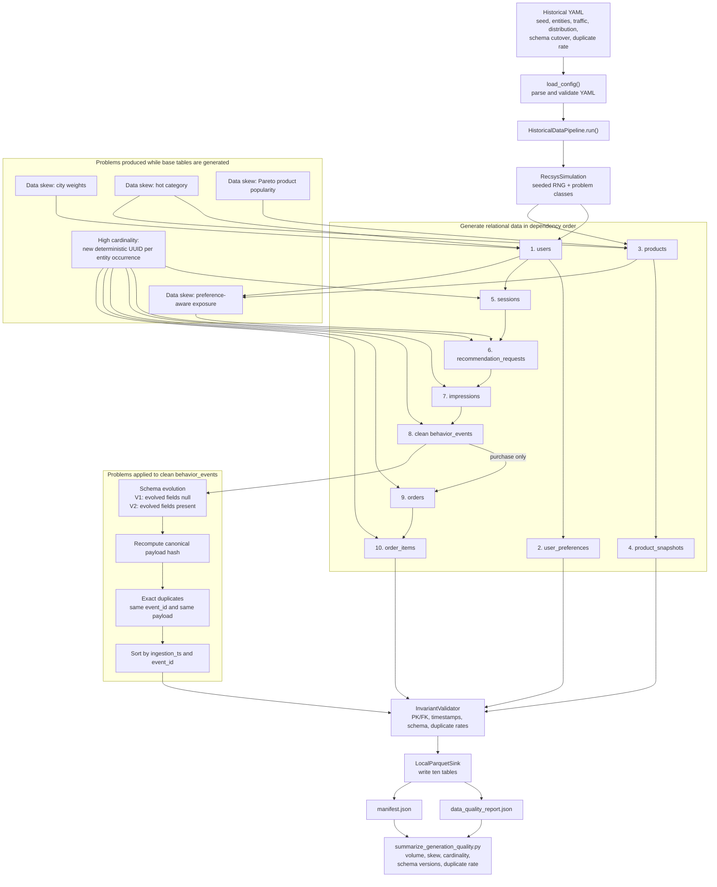
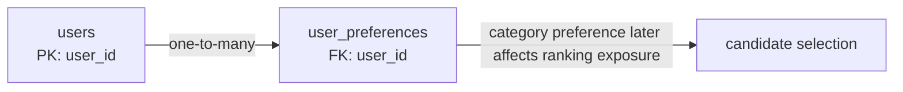
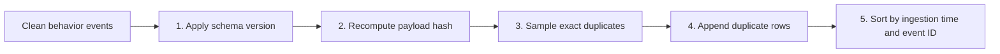
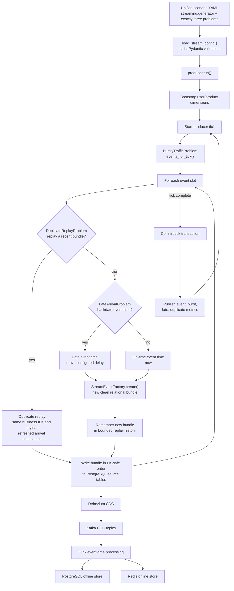

# Data Generator

The repository uses two independent data-generation paths:

- **Historical/offline generator:** creates ten related tables and simulates data
  skew, high cardinality, schema evolution, and exact duplicate rows.
- **Continuous streaming producer:** creates new relational event bundles and
  simulates bursty traffic, late arrival, and duplicate replay.

Both paths keep the same table and field contracts from
[domain.py (line 194)](../../../apps/data-platform/data-generator/src/domain.py#L194)
and [schemas.py (line 11)](../../../apps/data-platform/data-generator/src/schemas.py#L11).
The problem implementations are separated so historical problems cannot be
accidentally configured as streaming problems, or vice versa.

## Code Layout

```text
apps/data-platform/data-generator/src/
├── cli.py
├── config.py
├── domain.py
├── schemas.py
├── sink.py
├── validation.py
├── offline/
│   ├── historical_pipeline.py
│   ├── simulation.py
│   ├── problem_pipeline.py
│   └── problems/
│       ├── skew.py
│       ├── high_cardinality.py
│       ├── schema_evolution.py
│       └── exact_duplicate.py
├── streaming/
│   ├── config.py
│   ├── event_factory.py
│   ├── problem_pipeline.py
│   ├── producer.py
│   ├── postgres.py
│   └── problems/
│       ├── burst_traffic.py
│       ├── late_arrival.py
│       └── duplicate_replay.py
└── scripts/
    └── summarize_generation_quality.py
```

The offline package contains only the four assessed historical problems. The
streaming package contains only the three assessed online-event problems.
Late arrival is therefore not part of historical generation, while skew and
schema evolution are not injected by the continuous producer.

## Generator Configuration

### Unified offline and streaming configuration

Both generators read the same scenario document,
[data_generator_test.yaml (line 1)](../../../configs/local/data_generator_test.yaml#L1).
Offline and streaming problem values are adjacent and explicit:

| Configuration | Purpose | Code reference |
|---|---|---|
| root `seed` | shared deterministic seed | [data_generator_test.yaml (line 1)](../../../configs/local/data_generator_test.yaml#L1) |
| `offline.generator` | historical time range, volume, behavior, and output | [data_generator_test.yaml (line 3)](../../../configs/local/data_generator_test.yaml#L3) |
| `offline.problems.skew` | city/category/exposure skew | [data_generator_test.yaml (line 32)](../../../configs/local/data_generator_test.yaml#L32) |
| `offline.problems.high_cardinality` | user/product/category/brand cardinality | [data_generator_test.yaml (line 46)](../../../configs/local/data_generator_test.yaml#L46) |
| `offline.problems.schema_evolution` | schema cutover | [data_generator_test.yaml (line 52)](../../../configs/local/data_generator_test.yaml#L52) |
| `offline.problems.exact_duplicate` | exact duplicate rate | [data_generator_test.yaml (line 54)](../../../configs/local/data_generator_test.yaml#L54) |
| `streaming.generator` | tick rate and source dimension sizes | [data_generator_test.yaml (line 57)](../../../configs/local/data_generator_test.yaml#L57) |
| `streaming.problems` | burst, replay, and late-arrival settings | [data_generator_test.yaml (line 64)](../../../configs/local/data_generator_test.yaml#L64) |

Pydantic loads and validates this YAML before generation through
[config.py (line 219)](../../../apps/data-platform/data-generator/src/config.py#L219).
An invalid rate, date range, or entity count therefore fails before any table
is written.

### Streaming configuration

The continuous producer reads the `streaming` section from that same file. It
does not obtain problem rates from Helm `values.yaml`.

| Configuration | Purpose | Code reference |
|---|---|---|
| `generator` | tick interval, base events per tick, and dimension sizes | [data_generator_test.yaml (line 58)](../../../configs/local/data_generator_test.yaml#L58) |
| `burst_traffic` | burst cadence and multiplier | [data_generator_test.yaml (line 65)](../../../configs/local/data_generator_test.yaml#L65) |
| `duplicate_replay` | replay probability and bounded history | [data_generator_test.yaml (line 68)](../../../configs/local/data_generator_test.yaml#L68) |
| `late_arrival` | probability and event-time delay range | [data_generator_test.yaml (line 71)](../../../configs/local/data_generator_test.yaml#L71) |

Unknown streaming fields are rejected because every streaming config model uses
`extra="forbid"` at
[config.py (line 44)](../../../apps/data-platform/data-generator/src/streaming/config.py#L44).
The unified document contract is defined at
[config.py (line 160)](../../../apps/data-platform/data-generator/src/config.py#L160),
and the producer extracts its typed streaming section at
[config.py (line 248)](../../../apps/data-platform/data-generator/src/config.py#L248).

### Previously captured generator configuration evidence

The following repository image is the configuration/drift capture referenced by
the earlier detailed version of this document:


## Historical Data Generator

### End-to-end historical generation flow



The flow has two deliberately different problem stages:

1. `DataSkewProblem` and `HighCardinalityProblem` participate in creating the
   relational rows, because their effects must appear across parent and child
   tables.
2. `SchemaEvolutionProblem` and `ExactDuplicateProblem` transform the completed
   clean event list, because they are event-history issues rather than entity
   generation rules.

### Step 1: Parse and validate YAML

The CLI exposes the generation and validation commands at
[cli.py (line 13)](../../../apps/data-platform/data-generator/src/cli.py#L13).
It loads the selected YAML before constructing the pipeline at
[cli.py (line 30)](../../../apps/data-platform/data-generator/src/cli.py#L30).

Why this step matters:

- a seed makes the same configuration reproducible;
- typed ranges prevent impossible rates and negative volumes;
- the output run ID keeps evidence from different experiments separate;
- the config is later embedded in `manifest.json`, so the dataset remains
  traceable to its generation parameters.

### Step 2: Initialize deterministic simulation state

`HistoricalDataPipeline.run()` creates `RecsysSimulation` at
[historical_pipeline.py (line 25)](../../../apps/data-platform/data-generator/src/offline/historical_pipeline.py#L25).
The simulation initializes one NumPy random generator, one high-cardinality ID
allocator, and one skew implementation at
[simulation.py (line 37)](../../../apps/data-platform/data-generator/src/offline/simulation.py#L37).

All random choices use the seeded generator. IDs are also deterministic, which
means repeated runs with the same configuration create the same logical data
while still producing many distinct IDs.

### Step 3: Generate `users` and `user_preferences`

`generate()` starts with the two user-side tables at
[simulation.py (line 49)](../../../apps/data-platform/data-generator/src/offline/simulation.py#L49).
The user generator selects cities using skewed weights at
[simulation.py (line 111)](../../../apps/data-platform/data-generator/src/offline/simulation.py#L111).
It also assigns preferred categories and brands, then emits multiple weighted
preferences per user at
[simulation.py (line 151)](../../../apps/data-platform/data-generator/src/offline/simulation.py#L151).

Table relationship:



### Step 4: Generate `products` and `product_snapshots`

Products are created at
[simulation.py (line 174)](../../../apps/data-platform/data-generator/src/offline/simulation.py#L174).
Each product receives a category sampled from the configured category skew at
[simulation.py (line 181)](../../../apps/data-platform/data-generator/src/offline/simulation.py#L181)
and a long-tailed popularity weight at
[simulation.py (line 197)](../../../apps/data-platform/data-generator/src/offline/simulation.py#L197).

The matching `product_snapshots` row records the effective catalog attributes.
This preserves the source-system relation needed by later point-in-time product
features instead of generating a disconnected event-only dataset.

### Step 5: Compute the clean event target

The requested `target_behavior_events` includes injected duplicates. The
simulation therefore divides the requested target by `1 + duplicate_rate` at
[simulation.py (line 60)](../../../apps/data-platform/data-generator/src/offline/simulation.py#L60)
to estimate how many clean events should be produced first.

For example, a target near 10,000 rows and a 1.5% duplicate rate first produces
approximately 9,852 clean rows. The exact final count can differ slightly
because duplicate selection is probabilistic.

### Step 6: Generate session and transaction tables

For each sampled active user and historical date, `_generate_session()` creates
the dependent rows at
[simulation.py (line 242)](../../../apps/data-platform/data-generator/src/offline/simulation.py#L242).

The dependency order inside a session is:

1. Allocate `session_id` at
   [simulation.py (line 252)](../../../apps/data-platform/data-generator/src/offline/simulation.py#L252).
2. Allocate `request_id` and create `recommendation_requests` at
   [simulation.py (line 275)](../../../apps/data-platform/data-generator/src/offline/simulation.py#L275).
3. Select candidate products using popularity and user preferences at
   [simulation.py (line 302)](../../../apps/data-platform/data-generator/src/offline/simulation.py#L302).
4. Allocate `impression_id` and create ranked `impressions` at
   [simulation.py (line 306)](../../../apps/data-platform/data-generator/src/offline/simulation.py#L306).
5. Run the behavior state machine and create view/cart/purchase events at
   [simulation.py (line 341)](../../../apps/data-platform/data-generator/src/offline/simulation.py#L341).
6. For purchase states, allocate `order_id`, then create `orders` and
   `order_items` at
   [simulation.py (line 353)](../../../apps/data-platform/data-generator/src/offline/simulation.py#L353).
7. Finish the parent session with start/end timestamps and its terminal reason
   at [simulation.py (line 394)](../../../apps/data-platform/data-generator/src/offline/simulation.py#L394).

This construction order keeps foreign keys valid by design: no request exists
without a session, no impression without a request, and no order item without
an order.

### Step 7: Apply schema evolution and exact duplicates

After clean generation finishes, `HistoricalDataPipeline` creates
`OfflineProblemPipeline` at
[historical_pipeline.py (line 29)](../../../apps/data-platform/data-generator/src/offline/historical_pipeline.py#L29).
Only `behavior_events` are passed to it at
[historical_pipeline.py (line 39)](../../../apps/data-platform/data-generator/src/offline/historical_pipeline.py#L39).

The application order is explicit at
[problem_pipeline.py (line 32)](../../../apps/data-platform/data-generator/src/offline/problem_pipeline.py#L32):



Hashing occurs before duplication. Consequently, an exact duplicate preserves
both the same `event_id` and the same canonical payload hash; it is not merely
a new event with similar fields.

### Step 8: Validate relational and data-quality invariants

The completed ten-table bundle is validated before persistence at
[historical_pipeline.py (line 44)](../../../apps/data-platform/data-generator/src/offline/historical_pipeline.py#L44).
Generation fails rather than publishing invalid data when the validator reports
an error at
[historical_pipeline.py (line 49)](../../../apps/data-platform/data-generator/src/offline/historical_pipeline.py#L49).

The validator checks relational keys, timestamps, event payloads, schema
versions, expected volumes, and duplicate behavior through
[validation.py (line 36)](../../../apps/data-platform/data-generator/src/validation.py#L36).
This is important because a simulated problem must remain intentional: for
example, duplicate event IDs are allowed at the configured rate, but broken
foreign keys are not.

### Step 9: Write all tables in a stable order

The ten-table data contract is collected by `GeneratedData` at
[domain.py (line 194)](../../../apps/data-platform/data-generator/src/domain.py#L194).
`table_records()` fixes the write order at
[domain.py (line 206)](../../../apps/data-platform/data-generator/src/domain.py#L206):

| Order | Table | Primary dependency |
|---:|---|---|
| 1 | `users` | none |
| 2 | `user_preferences` | `users` |
| 3 | `products` | none |
| 4 | `product_snapshots` | `products` |
| 5 | `sessions` | `users` |
| 6 | `recommendation_requests` | `users`, `sessions` |
| 7 | `impressions` | `requests`, `sessions`, `products` |
| 8 | `behavior_events` | `impressions`, `requests`, `products` |
| 9 | `orders` | `users`, `sessions` |
| 10 | `order_items` | `orders`, `products` |

The pipeline iterates this mapping and writes each table through
[historical_pipeline.py (line 55)](../../../apps/data-platform/data-generator/src/offline/historical_pipeline.py#L55).
`LocalParquetSink` applies the Arrow schema and partitioning rules at
[sink.py (line 70)](../../../apps/data-platform/data-generator/src/sink.py#L70).

### Step 10: Write reproducibility and quality evidence

The pipeline computes observed duplicate, city-skew, category-skew, and schema
metrics at
[historical_pipeline.py (line 73)](../../../apps/data-platform/data-generator/src/offline/historical_pipeline.py#L73).
It writes:

- `data_quality_report.json`: validation result, injected counts, and observed
  problem metrics;
- `manifest.json`: seed, configuration hash, full configuration, row counts,
  schema versions, and table paths.

The two JSON artifacts are persisted at
[historical_pipeline.py (line 119)](../../../apps/data-platform/data-generator/src/offline/historical_pipeline.py#L119).

## Offline Data Problems

### Problem 1: Data skew

Data skew is not one random field. It is represented in four connected parts
of the relational generation flow.

#### City skew

The top city receives `top_city_ratio`; the remaining probability is split
equally across the other configured cities at
[skew.py (line 24)](../../../apps/data-platform/data-generator/src/offline/problems/skew.py#L24).
The user generator samples from those weights at
[simulation.py (line 115)](../../../apps/data-platform/data-generator/src/offline/simulation.py#L115).

**Effect:** one geographic key becomes much more frequent in `users`, and the
same city later propagates into order shipping data. Grouping or partitioning
by city therefore encounters uneven group sizes.

#### Category skew

`category_id=1` is selected with `top_category_ratio`; other categories share
the remaining samples at
[skew.py (line 36)](../../../apps/data-platform/data-generator/src/offline/problems/skew.py#L36).
This rule is used for users at
[simulation.py (line 121)](../../../apps/data-platform/data-generator/src/offline/simulation.py#L121)
and products at
[simulation.py (line 182)](../../../apps/data-platform/data-generator/src/offline/simulation.py#L182).

**Effect:** the hot category appears disproportionately in the catalog and user
preferences, then propagates into impressions and behavior events.

#### Product popularity skew

Popularity weights use a Pareto distribution at
[skew.py (line 43)](../../../apps/data-platform/data-generator/src/offline/problems/skew.py#L43).
Each product stores that weight at
[simulation.py (line 197)](../../../apps/data-platform/data-generator/src/offline/simulation.py#L197).

**Effect:** most products have modest exposure while a small head receives much
larger weights, approximating the long-tail shape of recommender traffic.

#### Preference-aware exposure skew

Candidate selection multiplies product popularity by category and brand
preference boosts at
[skew.py (line 46)](../../../apps/data-platform/data-generator/src/offline/problems/skew.py#L46).
The weighted sampling is called for every recommendation request at
[simulation.py (line 302)](../../../apps/data-platform/data-generator/src/offline/simulation.py#L302).

**Effect:** skew is carried into the actual impressions and events instead of
existing only as an unused `popularity_weight` column.

#### How skew is proven

The evidence script calculates top city, event category, and product category
percentages at
[summarize_generation_quality.py (line 231)](../../../apps/data-platform/data-generator/src/scripts/summarize_generation_quality.py#L231).
These observed ratios make the skew visible without reading raw Parquet rows.

#### Image evidence: volume, storage, and skew


### Problem 2: High cardinality

`HighCardinalityProblem` wraps the deterministic ID allocator at
[high_cardinality.py (line 6)](../../../apps/data-platform/data-generator/src/offline/problems/high_cardinality.py#L6).
Every call to `next_id()` returns the next distinct UUID for an entity type at
[high_cardinality.py (line 12)](../../../apps/data-platform/data-generator/src/offline/problems/high_cardinality.py#L12).

It is used for:

| Entity | Code reference | Result |
|---|---|---|
| session | [simulation.py (line 252)](../../../apps/data-platform/data-generator/src/offline/simulation.py#L252) | distinct session key |
| recommendation request | [simulation.py (line 275)](../../../apps/data-platform/data-generator/src/offline/simulation.py#L275) | distinct request key |
| impression | [simulation.py (line 306)](../../../apps/data-platform/data-generator/src/offline/simulation.py#L306) | distinct exposure key |
| order | [simulation.py (line 353)](../../../apps/data-platform/data-generator/src/offline/simulation.py#L353) | distinct purchase key |
| behavior event | [simulation.py (line 428)](../../../apps/data-platform/data-generator/src/offline/simulation.py#L428) | distinct clean-event key |
| order item | [simulation.py (line 474)](../../../apps/data-platform/data-generator/src/offline/simulation.py#L474) | distinct line-item key |

**How it applies:** increasing the configured entity and event counts increases
the number of unique grouping/join keys. The seed keeps those keys reproducible;
it does not reduce their cardinality.

Exact duplicates intentionally reduce the final `event_id` distinct ratio
slightly because duplicated rows preserve their original ID. This interaction
is expected and is part of the proof rather than a generator bug.

The evidence script reports rows, distinct IDs, and distinct ratio for each
major table at
[summarize_generation_quality.py (line 243)](../../../apps/data-platform/data-generator/src/scripts/summarize_generation_quality.py#L243).
The column is labelled `approx_count_distinct` for rubric presentation, but the
small local proof uses an exact Python set at
[summarize_generation_quality.py (line 247)](../../../apps/data-platform/data-generator/src/scripts/summarize_generation_quality.py#L247).

### Problem 3: Schema evolution

The historical config declares the cutover date at
[data_generator_test.yaml (line 52)](../../../configs/local/data_generator_test.yaml#L52).
`SchemaEvolutionProblem.apply()` compares each event's business date with that
cutover at
[schema_evolution.py (line 20)](../../../apps/data-platform/data-generator/src/offline/problems/schema_evolution.py#L20).

| Historical period | Stored representation | Code reference |
|---|---|---|
| before cutover | V1; `device_type` and `campaign_id` are null | [schema_evolution.py (line 27)](../../../apps/data-platform/data-generator/src/offline/problems/schema_evolution.py#L27) |
| from cutover | V2; evolved columns retain generated values | [schema_evolution.py (line 29)](../../../apps/data-platform/data-generator/src/offline/problems/schema_evolution.py#L29) |
| optional breaking cutover | configured breaking schema version | [schema_evolution.py (line 22)](../../../apps/data-platform/data-generator/src/offline/problems/schema_evolution.py#L22) |

The problem pipeline applies this rule to every clean behavior event before
hashing at
[problem_pipeline.py (line 38)](../../../apps/data-platform/data-generator/src/offline/problem_pipeline.py#L38).

**How it applies:** old and new historical partitions have compatible but
different field population. Downstream Spark processing must normalize V1/V2
rows before feature computation, while an explicitly configured breaking
version can be rejected or quarantined.

The evidence script separates old, new, and optional breaking partitions and
reports version/null counts at
[summarize_generation_quality.py (line 262)](../../../apps/data-platform/data-generator/src/scripts/summarize_generation_quality.py#L262).

### Problem 4: Exact duplicates

The configured historical duplicate probability is declared at
[data_generator_test.yaml (line 54)](../../../configs/local/data_generator_test.yaml#L54).
`ExactDuplicateProblem.apply()` samples completed events at
[exact_duplicate.py (line 13)](../../../apps/data-platform/data-generator/src/offline/problems/exact_duplicate.py#L13).

The class returns references to the already-normalized events; it does not
create new IDs or mutate timestamps. The pipeline appends those selected rows
at
[problem_pipeline.py (line 43)](../../../apps/data-platform/data-generator/src/offline/problem_pipeline.py#L43).

Therefore an injected exact duplicate has:

- the same `event_id`;
- the same business payload;
- the same `payload_hash`;
- the same event, creation, and ingestion timestamps.

**How it applies:** the output reproduces an at-least-once historical ingestion
issue. A downstream deduplication keyed by `event_id` can remove the additional
rows deterministically.

The evidence script calculates duplicate rows before and after deduplication at
[summarize_generation_quality.py (line 320)](../../../apps/data-platform/data-generator/src/scripts/summarize_generation_quality.py#L320)
and separately confirms exact `(event_id, payload_hash)` duplicates at
[summarize_generation_quality.py (line 123)](../../../apps/data-platform/data-generator/src/scripts/summarize_generation_quality.py#L123).

#### Image evidence: cardinality, schema evolution, and deduplication


This image is retained from the earlier document version. Its cardinality,
schema V1/V2, and exact-duplicate rows remain relevant. The old
`conflicting duplicate` row shown in the capture is legacy evidence and is not
one of the four current offline problem classes.

## Continuous Streaming Generator

### Continuous stream event flow



The producer entry point loads the unified scenario config at
[producer.py (line 93)](../../../apps/data-platform/data-generator/src/streaming/producer.py#L93).
`run()` creates the problem pipeline and clean event factory at
[producer.py (line 19)](../../../apps/data-platform/data-generator/src/streaming/producer.py#L19).

Each new clean bundle contains related session, request, impression, behavior
event, and optional order rows. The factory constructs that bundle at
[event_factory.py (line 16)](../../../apps/data-platform/data-generator/src/streaming/event_factory.py#L16).
The bundle is written to PostgreSQL in dependency-safe order at
[postgres.py (line 30)](../../../apps/data-platform/data-generator/src/streaming/postgres.py#L30),
then the producer commits the tick at
[producer.py (line 59)](../../../apps/data-platform/data-generator/src/streaming/producer.py#L59).

PostgreSQL is the streaming source system here. Debezium captures its changes
to Kafka; Flink consumes event-time records and updates the PostgreSQL offline
feature store and Redis online feature store. Iceberg is not part of this
continuous producer-to-feature-store runtime path.

## Streaming Data Problems

### Problem 1: Bursty traffic

The checked-in shared config defines the base rate at
[data_generator_test.yaml (line 60)](../../../configs/local/data_generator_test.yaml#L60)
and the burst cadence/multiplier at
[data_generator_test.yaml (line 65)](../../../configs/local/data_generator_test.yaml#L65).

`BurstTrafficProblem.events_for_tick()` returns the base size for normal ticks
and multiplies it every configured Nth tick at
[burst_traffic.py (line 6)](../../../apps/data-platform/data-generator/src/streaming/problems/burst_traffic.py#L6).
The producer requests this value before its inner emission loop at
[producer.py (line 38)](../../../apps/data-platform/data-generator/src/streaming/producer.py#L38).

**How it applies:** with the checked-in values, a normal tick emits 40 bundles
and every fifth tick emits 320. The producer therefore creates periodic input
spikes without changing the data contract or embedding the behavior in Helm.

The producer records whether the current tick is bursty and publishes the
metric at
[producer.py (line 62)](../../../apps/data-platform/data-generator/src/streaming/producer.py#L62).

### Problem 2: Late arrival

The rate and delay interval are configured at
[data_generator_test.yaml (line 71)](../../../configs/local/data_generator_test.yaml#L71).
`LateArrivalProblem.apply()` probabilistically subtracts a delay from `now` at
[late_arrival.py (line 14)](../../../apps/data-platform/data-generator/src/streaming/problems/late_arrival.py#L14).

`StreamProblemPipeline.event_time()` returns either the delayed timestamp or the
current timestamp at
[problem_pipeline.py (line 38)](../../../apps/data-platform/data-generator/src/streaming/problem_pipeline.py#L38).
The event factory stores this chosen value as `event_timestamp`, while keeping
`created_ts` and `ingestion_ts` at the current arrival time at
[event_factory.py (line 76)](../../../apps/data-platform/data-generator/src/streaming/event_factory.py#L76).

**How it applies:** the row is inserted into PostgreSQL now and reaches Kafka
now, but its business event time is 45-180 minutes old under the checked-in
config. Flink can therefore exercise watermarks, allowed lateness, and late-data
handling with a real difference between event time and arrival time.

Late arrival is applied only to newly created bundles at
[producer.py (line 50)](../../../apps/data-platform/data-generator/src/streaming/producer.py#L50).
It is not an offline historical-generator problem.

### Problem 3: Duplicate replay

The replay rate and bounded history size are configured at
[data_generator_test.yaml (line 68)](../../../configs/local/data_generator_test.yaml#L68).
New clean bundles are retained in bounded history at
[duplicate_replay.py (line 17)](../../../apps/data-platform/data-generator/src/streaming/problems/duplicate_replay.py#L17).

`replay()` samples a previous bundle and deep-copies it at
[duplicate_replay.py (line 21)](../../../apps/data-platform/data-generator/src/streaming/problems/duplicate_replay.py#L21).
It refreshes arrival metadata while preserving business identity and payload at
[duplicate_replay.py (line 25)](../../../apps/data-platform/data-generator/src/streaming/problems/duplicate_replay.py#L25).
The producer attempts replay before generating a new event at
[producer.py (line 46)](../../../apps/data-platform/data-generator/src/streaming/producer.py#L46).

**How it applies:** PostgreSQL and CDC receive the same logical event again,
with the same event identity, but at a later arrival time. This represents an
online retry/replay issue and allows Flink deduplication state to be tested.

This differs from the historical exact duplicate:

| Aspect | Historical exact duplicate | Streaming duplicate replay |
|---|---|---|
| Source | completed offline event list | bounded recent online history |
| Identity/payload | unchanged | unchanged |
| Arrival timestamps | unchanged | refreshed to replay time |
| Purpose | historical batch dedup proof | CDC/Flink replay dedup proof |

### Previously captured streaming issue evidence


This image is preserved because it was referenced by the earlier detailed
document. It predates the offline/streaming package split: its burst, late, and
duplicate rows are useful historical evidence, but its `out-of-order` row is
legacy and is not part of the current continuous producer. The current
authoritative streaming scope is the three classes referenced above.

## Evidence and Output

### Run historical generation

```bash
PYTHONPATH=apps/data-platform/data-generator/src \
  .venv/bin/python apps/data-platform/data-generator/src/cli.py generate \
  --config configs/local/data_generator_test.yaml
```

### Validate the generated dataset

```bash
PYTHONPATH=apps/data-platform/data-generator/src \
  .venv/bin/python apps/data-platform/data-generator/src/cli.py validate \
  --config configs/local/data_generator_test.yaml
```

### Print problem evidence

```bash
PYTHONPATH=apps/data-platform/data-generator/src \
  .venv/bin/python \
  apps/data-platform/data-generator/src/scripts/summarize_generation_quality.py \
  --config configs/local/data_generator_test.yaml
```

The summary command prints:

- configuration and table volumes;
- Parquet format, file count, compression, and partition layout;
- city and category skew percentages;
- row count and distinct ID count by table;
- V1/V2 population and evolved-field null percentages;
- duplicate rate before and after deduplication;
- the injected-versus-observed data-quality report.

The implementation starts the summary at
[summarize_generation_quality.py (line 109)](../../../apps/data-platform/data-generator/src/scripts/summarize_generation_quality.py#L109).

### Run unit tests

```bash
.venv/bin/pytest -q \
  --override-ini='pythonpath=apps/data-platform/data-generator/src' \
  tests/unit/data_generator
```

### Output layout

For the checked-in proof config, the output is written under
`apps/data-platform/data-generator/src/output/test_10k_seed42/`:

```text
test_10k_seed42/
├── users/
├── user_preferences/
├── products/
├── product_snapshots/
├── sessions/
├── recommendation_requests/
├── impressions/
├── behavior_events/
├── orders/
├── order_items/
├── data_quality_report.json
└── manifest.json
```

The physical files are Parquet, using the explicit Arrow contracts from
[schemas.py (line 11)](../../../apps/data-platform/data-generator/src/schemas.py#L11).
The sink selects partition columns for time-based fact tables at
[sink.py (line 80)](../../../apps/data-platform/data-generator/src/sink.py#L80).

## Code Reference Map

| Concern | Main implementation |
|---|---|
| shared ten-table contract | [domain.py (line 194)](../../../apps/data-platform/data-generator/src/domain.py#L194) |
| Arrow schemas | [schemas.py (line 11)](../../../apps/data-platform/data-generator/src/schemas.py#L11) |
| historical orchestration | [historical_pipeline.py (line 21)](../../../apps/data-platform/data-generator/src/offline/historical_pipeline.py#L21) |
| clean relational simulation | [simulation.py (line 37)](../../../apps/data-platform/data-generator/src/offline/simulation.py#L37) |
| offline problem order | [problem_pipeline.py (line 15)](../../../apps/data-platform/data-generator/src/offline/problem_pipeline.py#L15) |
| skew | [skew.py (line 11)](../../../apps/data-platform/data-generator/src/offline/problems/skew.py#L11) |
| high cardinality | [high_cardinality.py (line 6)](../../../apps/data-platform/data-generator/src/offline/problems/high_cardinality.py#L6) |
| schema evolution | [schema_evolution.py (line 9)](../../../apps/data-platform/data-generator/src/offline/problems/schema_evolution.py#L9) |
| historical exact duplicates | [exact_duplicate.py (line 8)](../../../apps/data-platform/data-generator/src/offline/problems/exact_duplicate.py#L8) |
| streaming config contract | [config.py (line 44)](../../../apps/data-platform/data-generator/src/streaming/config.py#L44) |
| clean streaming event bundle | [event_factory.py (line 9)](../../../apps/data-platform/data-generator/src/streaming/event_factory.py#L9) |
| streaming problem order | [problem_pipeline.py (line 23)](../../../apps/data-platform/data-generator/src/streaming/problem_pipeline.py#L23) |
| continuous producer | [producer.py (line 19)](../../../apps/data-platform/data-generator/src/streaming/producer.py#L19) |
| bursty traffic | [burst_traffic.py (line 1)](../../../apps/data-platform/data-generator/src/streaming/problems/burst_traffic.py#L1) |
| late arrival | [late_arrival.py (line 7)](../../../apps/data-platform/data-generator/src/streaming/problems/late_arrival.py#L7) |
| streaming duplicate replay | [duplicate_replay.py (line 9)](../../../apps/data-platform/data-generator/src/streaming/problems/duplicate_replay.py#L9) |
| PostgreSQL stream sink | [postgres.py (line 30)](../../../apps/data-platform/data-generator/src/streaming/postgres.py#L30) |
| validation | [validation.py (line 36)](../../../apps/data-platform/data-generator/src/validation.py#L36) |
| problem evidence | [summarize_generation_quality.py (line 109)](../../../apps/data-platform/data-generator/src/scripts/summarize_generation_quality.py#L109) |
