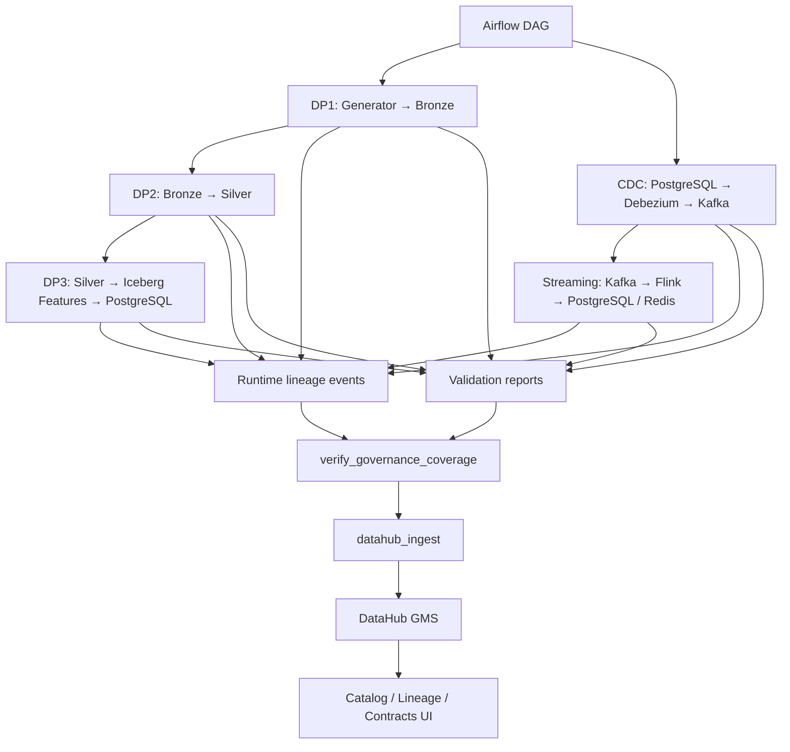
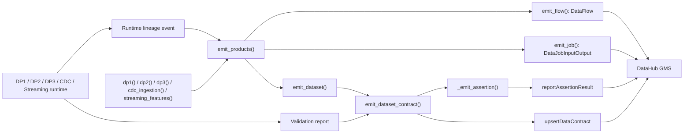
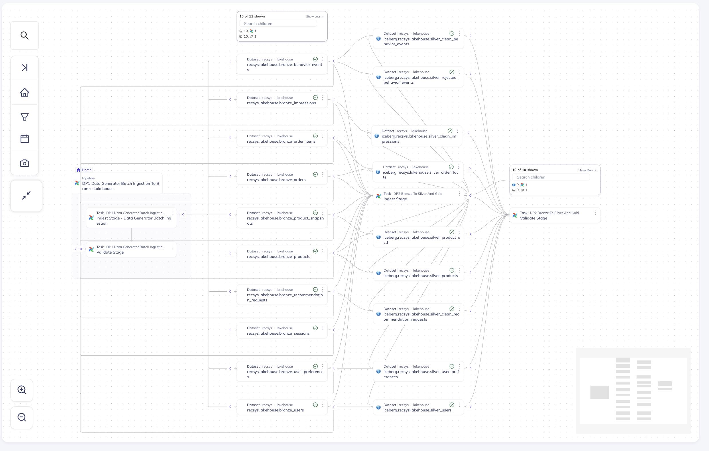
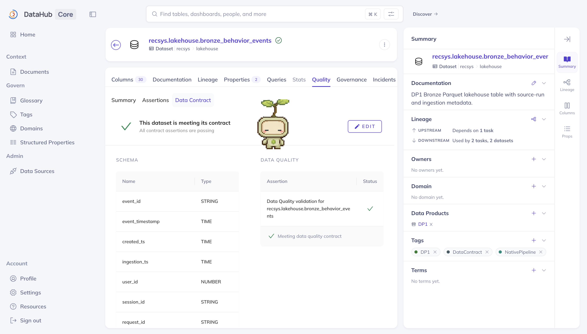
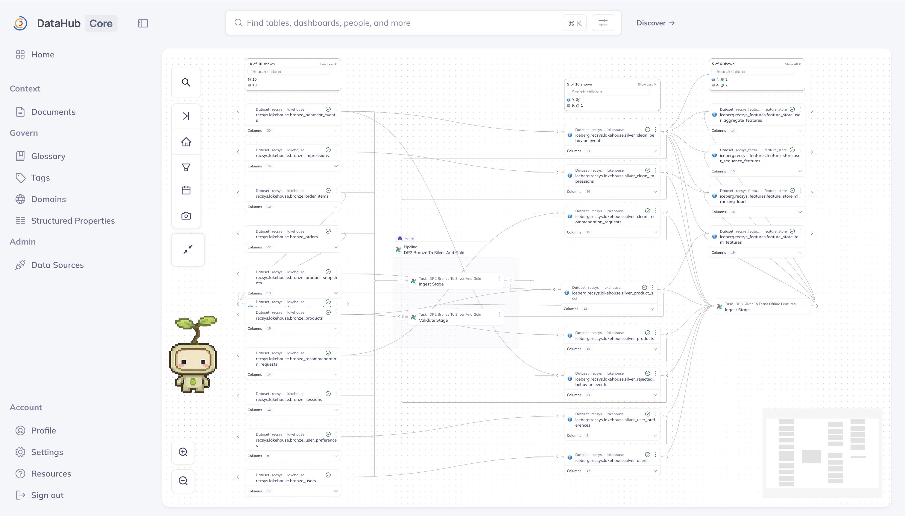
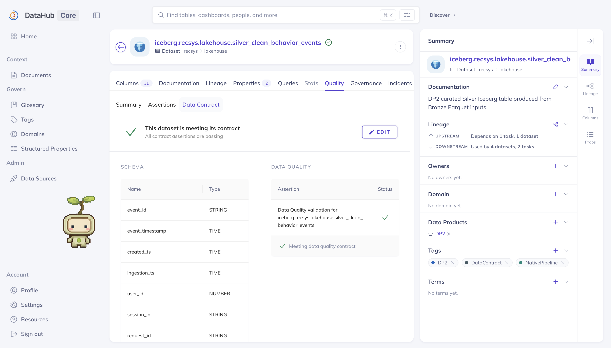
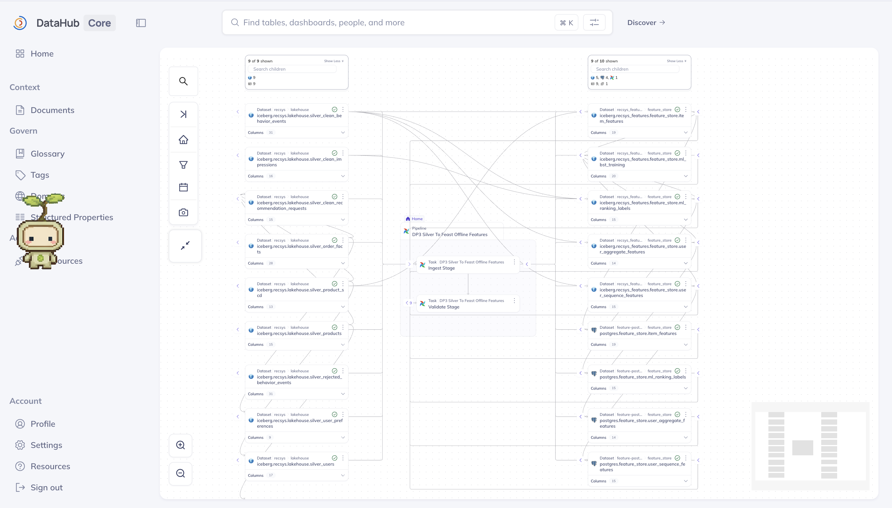
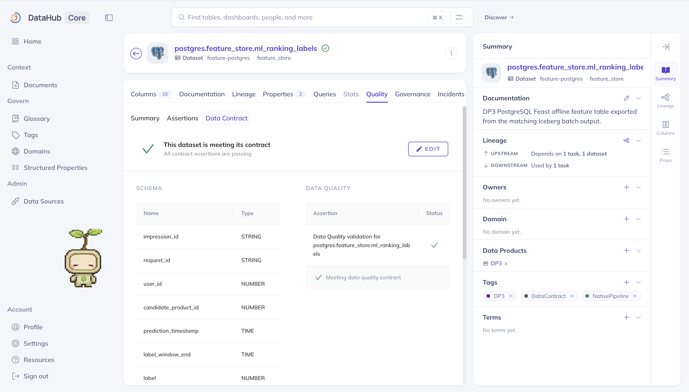
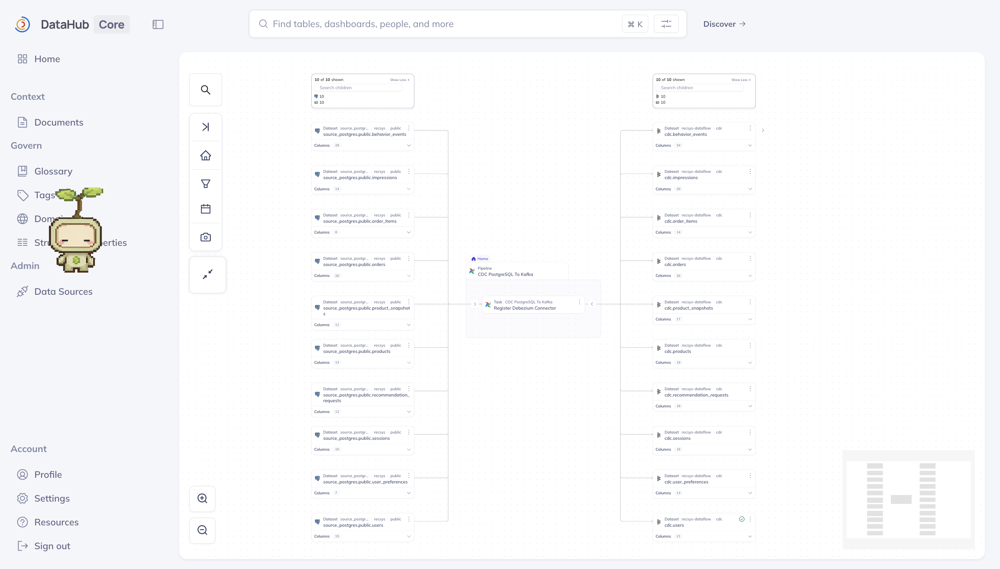
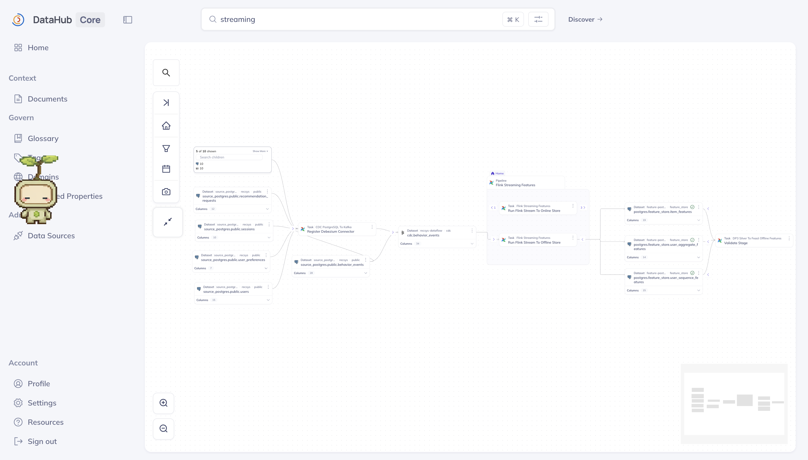

# Data Governance

DataHub governs the three rubric batch pipelines as `DP1`, `DP2`, and `DP3`. CDC and continuous feature processing are intentionally separated into `CDC_INGESTION` and `STREAMING_FEATURES`, so their lineage no longer changes the rubric numbering.

The governed flows are:

- `DP1`: Data Generator batch ingestion -> Bronze Iceberg lakehouse.
- `DP2`: Bronze Iceberg -> PySpark -> curated Silver Iceberg.
- `DP3`: Silver Iceberg -> PySpark features -> Iceberg feature tables -> PostgreSQL Feast offline store.
- `CDC_INGESTION`: source PostgreSQL -> Debezium -> `cdc.*` Kafka topics.
- `STREAMING_FEATURES`: `cdc.behavior_events` -> two continuously running Flink jobs -> PostgreSQL offline features and Redis online features.

## End-To-End Governance Flow



The mechanism has a **data plane**, which creates and moves real data, and a **governance plane**, which records what happened and publishes that evidence to DataHub.

### 1. Define The Governed Catalog

The repository first declares the expected governance model through `dp1()`, `dp2()`, `dp3()`, `cdc_ingestion()`, and `streaming_features()`. Together these definitions describe five Data Products, 51 datasets, five DataFlows, and nine DataJobs, along with each dataset's schema, primary key, contract description, and validation pipeline. These definitions are the expected catalog model; they do not prove that a runtime job actually produced the data.

The component definitions are assembled and published by [`emit_products`](../../../apps/data-platform/src/metadata/ingest_datahub_governance.py#L965-L994).

### 2. Run The Data Plane

Airflow starts the batch and real-time branches. The batch branch runs DP1, DP2, and DP3 in order; the real-time branch registers Debezium and verifies the continuously running Flink jobs.

```text
DP1: Data Generator -> Bronze Iceberg -> optimization -> validation
DP2: Bronze Iceberg -> Silver Iceberg -> optimization -> validation
DP3: Silver Iceberg -> Iceberg features -> PostgreSQL Feast

CDC: source PostgreSQL -> Debezium -> Kafka
Streaming offline: Kafka -> Flink -> PostgreSQL Feast
Streaming online: Kafka -> Flink -> Redis
```

These jobs create the real Parquet, Iceberg, PostgreSQL, Kafka, and Redis data. DataHub does not process or copy these rows.

### 3. Record Runtime Lineage

Each processing or validation job uses [`RuntimeLineageRecorder`](../../../apps/data-platform/src/metadata/runtime_lineage.py#L201-L255). Entering the context emits `START`; a successful exit emits `COMPLETE`; an exception emits `FAIL`. The event contains the pipeline and job identity, Airflow run ID, deterministic runtime UUID, event time, upstream jobs, and the dataset URNs observed as inputs and outputs.

```text
DP1.ingest_stage: no catalog input -> 10 Bronze outputs
DP2.ingest_stage: 10 Bronze inputs -> 9 Silver outputs
DP3.ingest_stage: 9 Silver inputs -> 5 Iceberg + 4 PostgreSQL outputs
CDC connector job: 10 source PostgreSQL inputs -> 10 Kafka outputs
Flink offline job: cdc.behavior_events -> 3 PostgreSQL outputs
Flink online job: cdc.behavior_events -> 3 Redis outputs
```

[`write_event`](../../../apps/data-platform/src/metadata/runtime_lineage.py#L160-L168) stores both a run-scoped event and a job-level latest event:

```text
s3a://recsys-lakehouse/governance/lineage/<pipeline>/runs/<run-id>/<job>/<event>.json
s3a://recsys-lakehouse/governance/lineage/<pipeline>/jobs/<job>/latest.json
```

### 4. Execute Data Validation

After data processing, the validators read the real storage systems and produce dataset-level checks. DP1 verifies readable, non-empty Bronze tables and required key/audit columns. DP2 verifies Silver row counts, required clean-event columns, and unique `event_id`. DP3 verifies non-empty Iceberg/PostgreSQL features, required schemas, and non-null entity keys and timestamps. CDC verifies the accepted source-table/topic mappings. Streaming verifies that the governed Redis key families and sampled hashes are non-empty.

[`write_report`](../../../apps/data-platform/src/validate/governance_contracts.py#L73-L99) aggregates individual checks into `SUCCESS`, `FAILURE`, or `ERROR` and writes:

```text
s3a://recsys-lakehouse/governance/validation/<pipeline>/<run-id>.json
s3a://recsys-lakehouse/governance/validation/<pipeline>/latest.json
```

The detailed check logic and direct code references appear in each component section below.

### 5. Verify Governance Coverage

Before publishing to DataHub, [`verify_governance_coverage`](../../../apps/data-platform/src/metadata/ingest_datahub_governance.py#L883-L962) loads the runtime events and validation reports and verifies that:

- every governed DataJob has a runtime event;
- all 51 governed datasets appear in runtime lineage;
- runtime events contain no unknown dataset URNs;
- pipeline, job, run, and event identities are valid;
- every dataset has a schema, contract description, and validation pipeline;
- every Data Product has a validation report containing all expected datasets.

The gate fails before DataHub publication when any required evidence is missing, preventing a complete-looking catalog from being built from incomplete runtime observations.

### 6. Ingest Governance Metadata Into DataHub

When coverage succeeds, `datahub_ingest` calls `emit_products()`. For each component, the emitter creates or updates the Domain, Data Product, Dataset, schema, DataFlow, DataJob, tags, assertions, and Data Contract. This is metadata ingestion only; no business data is copied into DataHub.

[`emit_flow`](../../../apps/data-platform/src/metadata/ingest_datahub_governance.py#L557-L575) creates the parent DataFlow. [`emit_job`](../../../apps/data-platform/src/metadata/ingest_datahub_governance.py#L578-L612) converts the latest runtime event into `DataJobInfo` and `DataJobInputOutput`:

```text
runtime inputs        -> inputDatasets  (SDK term: inlets)
runtime outputs       -> outputDatasets (SDK term: outlets)
runtime upstream jobs -> inputDatajobs
```

DataHub can then render dataset -> job -> dataset lineage and downstream impact paths.

### 7. Publish Assertions And Data Contracts

For each dataset with a validation pipeline, `emit_dataset()` calls `emit_dataset_contract()`. The latest validation report is converted into a schema assertion result and a data-quality assertion result. [`_emit_assertion`](../../../apps/data-platform/src/metadata/ingest_datahub_governance.py#L457-L514) calls `reportAssertionResult` with the dataset's `SUCCESS`, `FAILURE`, or `ERROR` status and includes the pipeline, run ID, and observed checks.

[`emit_dataset_contract`](../../../apps/data-platform/src/metadata/ingest_datahub_governance.py#L517-L554) then calls `upsertDataContract` to attach both assertion URNs to an active contract:

```text
Data Contract
|- Schema assertion
`- Data-quality assertion
```

The contract is `PASSING` when its latest assertion results succeed and `FAILING` when a linked assertion reports failure or error.

### 8. Render The Governance UI

DataHub GMS persists and indexes the metadata for the frontend. A governed dataset page can then show its description, schema, primary keys, Data Product, upstream and downstream lineage, producing and consuming DataJobs, assertion history, and current Data Contract status. DataHub provides catalog, lineage, contract, and impact visibility; Airflow and the runtime validators remain responsible for pipeline execution and enforcement.

### Failure Path

The validator writes its failure report before returning a non-zero exit code or raising an exception. Airflow then marks that validation task as failed and normally skips the downstream governance ingest task. As a result, DataHub may continue displaying the previous successful assertion result even though the newest report contains a failure. Publishing every failure would require a final governance-ingest task with an `all_done`-style trigger after the report has been written.

## How The Components Reach DataHub

DataHub's high-level SDK documentation calls a job's dataset dependencies `inlets` and `outlets`. This repository emits the equivalent low-level `DataJobInputOutput` aspect: `inputDatasets` are the inlets and `outputDatasets` are the outlets. The mapping is implemented by [`emit_job`](../../../apps/data-platform/src/metadata/ingest_datahub_governance.py#L578-L612), while [`emit_flow`](../../../apps/data-platform/src/metadata/ingest_datahub_governance.py#L557-L575) creates the parent `DataFlow`. This follows the official [DataHub DataFlow and DataJob model](https://docs.datahub.com/docs/api/tutorials/dataflow-datajob).

Every governed component enters the same publication path:



The orchestration loop is visible in [`emit_products`](../../../apps/data-platform/src/metadata/ingest_datahub_governance.py#L965-L994): it emits each component's datasets, `DataFlow`, and `DataJob` entities. For every dataset with a validation pipeline, [`emit_dataset`](../../../apps/data-platform/src/metadata/ingest_datahub_governance.py#L317-L343) calls `emit_dataset_contract`. The assertion path then calls [`reportAssertionResult`](../../../apps/data-platform/src/metadata/ingest_datahub_governance.py#L457-L514) with `SUCCESS`, `FAILURE`, or `ERROR`, following DataHub's official [Custom Assertions result-reporting pattern](https://docs.datahub.com/docs/api/tutorials/custom-assertions). Finally, [`upsertDataContract`](../../../apps/data-platform/src/metadata/ingest_datahub_governance.py#L517-L554) bundles the schema and data-quality assertion URNs into an active contract, following the official [Data Contracts API](https://docs.datahub.com/docs/api/tutorials/data-contracts).

## DP1 Linked With Related Tables

`recsys_dp1_raw_to_bronze` runs the Data Generator inside the Spark task pod and commits its ephemeral output directly into ten named Bronze Iceberg tables. There is no separate persistent Parquet or raw-S3 dataset in the governed lineage. MinIO is only the S3-compatible object-storage backend beneath Iceberg. `optimize_stage` applies the shared physical-layout policy, then `validate_stage` checks Iceberg readability, `row_count > 0`, source keys, `source_run_id`, `lakehouse_ingestion_ts`, and null required values.

### DP1 Lineage Image Proof



**Figure 1 — DP1 batch ingestion and downstream handoff.** DataHub shows the DP1 `Ingest Stage - Data Generator Batch Ingestion` and `Validate Stage`, the ten governed `recsys.lakehouse.bronze_*` Parquet outputs, and their downstream consumption by DP2. No raw-S3 dataset appears between the DP1 task and Bronze, confirming that DP1 writes directly to the governed Bronze lakehouse layer. The DP2 nodes on the right are downstream context, not DP1-owned outputs.

### DP1 Validation And Data Contract Image Proof



**Figure 2 — DP1 schema and data-quality contract.** The `recsys.lakehouse.bronze_behavior_events` contract is passing, its Columns badge reports 30 fields, and the Schema table exposes field names and normalized types. The green data-quality assertion, `DP1` Data Product association, and `DataContract`/`NativePipeline` tags demonstrate that the Bronze table is governed by both structural and runtime-quality checks.

### Execution And Governance Steps

1. **Data lineage:** [`load_generator_run_to_lakehouse`](../../../apps/data-platform/src/ingest/batch_lakehouse_ingestion.py) opens the `DP1.ingest_stage` runtime recorder and records ten Bronze Iceberg outputs. [`optimize.py`](../../../apps/data-platform/src/lakehouse/optimize.py) records the same tables as optimization inputs/outputs, and validation records `optimize_stage` as its upstream job.
2. **Data contract:** [`dp1`](../../../apps/data-platform/src/metadata/ingest_datahub_governance.py#L640-L678) defines one contract-bearing dataset for each Bronze table. Each definition supplies the full Bronze schema, the source primary key prefixed by `source_run_id`, the DP1 validation pipeline, and the required ingestion-audit columns.
3. **Data validation:** [`validate_dp1_bronze`](../../../apps/data-platform/src/validate/governance_contracts.py) opens every Bronze table through the Iceberg catalog, checks `row_count > 0`, and verifies the source primary-key columns plus `source_run_id` and `lakehouse_ingestion_ts` are present and non-null. It marks validation `COMPLETE` only when every dataset succeeds.

## DP2 Linked With Related Tables

`recsys_dp2_bronze_to_silver_gold` reads the DP1 Bronze Iceberg tables and writes nine curated `silver_*` Iceberg tables. `clean_behavior_events` is normalized and deduplicated with `.dropDuplicates(["event_id"])`; `silver_rejected_behavior_events` contains unsupported-schema rows and may legitimately be empty. The Silver tables pass through `optimize_stage` before validation.

### DP2 Lineage Image Proof



**Figure 3 — DP2 Bronze-to-Silver transformation.** The expanded graph centers the DP2 `Ingest Stage` and `Validate Stage`, with ten DP1 Bronze inputs on the left and nine curated `iceberg.recsys.lakehouse.silver_*` outputs on the right. The additional DP3 feature nodes are downstream impact context; the DP2 evidence is the Bronze → PySpark tasks → Silver path.

### DP2 Validation And Data Contract Image Proof



**Figure 4 — DP2 curated-table contract.** The `iceberg.recsys.lakehouse.silver_clean_behavior_events` dataset is associated with DP2 and has a passing active contract. Its 31-column schema is rendered alongside the successful data-quality assertion, proving that the curated Silver output has both registered structure and runtime validation.

### Execution And Governance Steps

1. **Data lineage:** [`build_dp2_silver_gold`](../../../apps/data-platform/src/features/spark/dp2_silver_gold_entrypoint.py#L20-L30) records all ten DP1 Bronze datasets as inputs and the nine Silver Iceberg tables actually returned by the Spark transformation as outputs of `DP2.ingest_stage`.
2. **Data contract:** [`dp2`](../../../apps/data-platform/src/metadata/ingest_datahub_governance.py#L681-L719) defines one contract-bearing dataset for each Silver table, including its schema and primary key. `silver_clean_behavior_events` additionally requires `event_id`, `event_timestamp`, and `ingestion_ts`, and its contract states that `event_id` must be unique.
3. **Data validation:** [`validate_dp2_silver_gold`](../../../apps/data-platform/src/features/spark/dp2_silver_gold_entrypoint.py#L35-L72) reads every Silver table and checks its row count. All normal tables require `row_count > 0`; `silver_rejected_behavior_events` may be empty. For `silver_clean_behavior_events`, it also checks the three required columns and requires `duplicate_event_id == 0`. A failure writes the report, emits failed lineage, and raises an exception.

## DP3 Linked With Related Tables

`recsys_dp3_offline_feature_table` now consumes DP2 `silver_*` tables directly. It does not rebuild Silver. PySpark computes five Iceberg feature outputs, exports the four Feast source tables to PostgreSQL, and validates both storage layers.

### DP3 Lineage Image Proof



**Figure 5 — DP3 Silver-to-Feast offline-feature lineage.** Nine DP2 Silver datasets feed the DP3 `Ingest Stage`; the flow produces five Iceberg feature tables and exports the four Feast source tables to PostgreSQL before `Validate Stage`. The separate Iceberg and PostgreSQL nodes make the storage boundary explicit: Iceberg holds batch feature outputs, while PostgreSQL is the Feast offline store.

### DP3 Validation And Data Contract Image Proof



**Figure 6 — DP3 PostgreSQL Feast-table contract.** The final `postgres.feature_store.ml_ranking_labels` dataset is attached to DP3 and its active contract is passing. DataHub renders all 15 schema fields and a successful data-quality assertion, proving that governance continues across the Iceberg-to-PostgreSQL export boundary.

### Execution And Governance Steps

1. **Data lineage:** [`run_pyspark_batch`](../../../apps/data-platform/src/features/spark/spark_batch_entrypoint.py#L178-L201) records the nine DP2 Silver tables as inputs, the five Iceberg feature tables as batch outputs, and the four PostgreSQL Feast tables returned by the export step as additional outputs of `DP3.ingest_stage`.
2. **Data contract:** [`dp3`](../../../apps/data-platform/src/metadata/ingest_datahub_governance.py#L722-L781) defines contracts for five Iceberg feature datasets and four PostgreSQL Feast datasets. Each requires a non-empty dataset, the appropriate entity key, the feature or prediction timestamp, and non-null key/timestamp values.
3. **Data validation:** the Spark stage first runs the [Iceberg output checks](../../../apps/data-platform/src/features/spark/spark_batch_entrypoint.py#L116-L149): `row_count > 0`, required key/timestamp columns present, and zero null key/timestamp rows. The following [`validate_dp3_postgres`](../../../apps/data-platform/src/validate/governance_contracts.py#L134-L202) checks the four exported PostgreSQL tables for a complete configured schema, `row_count > 0`, and zero null entity-key/timestamp rows. Both parts merge into the DP3 validation report for the same run.

## CDC Ingestion

`recsys_cdc_postgres_to_kafka` owns source PostgreSQL and Kafka datasets. The graph is `source_postgres.public.* -> Register Debezium Connector -> cdc.*`; it is no longer labelled DP1.



**Figure 7 — CDC ingestion lineage.** Ten source PostgreSQL tables feed the `Register Debezium Connector` task and map to ten `cdc.*` Kafka topics. The connector is represented as the processing node between the source tables and topics, and the dedicated `CDC PostgreSQL To Kafka` flow keeps this real-time ingestion path separate from rubric DP1.

The accepted connector configuration determines the runtime source-table and Kafka-topic observations.

### Execution And Governance Steps

1. **Data lineage:** the [connector registration runtime](../../../apps/data-platform/src/ingest/register_k8s_connectors.py#L89-L100) reads the accepted Debezium `table.include.list`, records the included source PostgreSQL tables as inputs, and records their canonical `cdc.*` Kafka topics as outputs of `CDC_INGESTION.register_debezium_connector`.
2. **Data contract:** [`cdc_ingestion`](../../../apps/data-platform/src/metadata/ingest_datahub_governance.py#L784-L826) defines contracts for ten source PostgreSQL datasets and ten Kafka topic datasets. Source contracts carry the source schema and primary key; topic contracts carry the Debezium envelope schema and expected source-to-topic mapping.
3. **Data validation:** the [CDC mapping validator](../../../apps/data-platform/src/ingest/register_k8s_connectors.py#L101-L111) requires each expected source table to be present in the submitted connector configuration and maps it to `cdc.<table>`. This validates the accepted connector configuration, not the later existence of Kafka messages; any missing mapping fails the report and connector task.

## Streaming Features

`recsys_flink_stream_features` contains two distinct jobs:

- `Run Flink Stream To Offline Store`: `cdc.behavior_events` -> PostgreSQL Feast offline feature tables.
- `Run Flink Stream To Online Store`: `cdc.behavior_events` -> Redis feature keys.

The PostgreSQL datasets remain owned by DP3 and are only referenced by the streaming flow. This avoids duplicate Data Product ownership while retaining cross-flow lineage.



**Figure 8 — Streaming feature-store processing.** The `cdc.behavior_events` topic branches into distinct `Run Flink Stream To Online Store` and `Run Flink Stream To Offline Store` jobs. The expanded offline branch shows the three PostgreSQL feature tables; the Redis children of the online-store job are collapsed in this capture. The two job nodes still make the online and offline processing responsibilities explicit.

The event reports the PostgreSQL offline outputs for the offline-store job and the Redis outputs for the online-store job.

### Execution And Governance Steps

1. **Data lineage:** the [Flink entrypoint](../../../apps/data-platform/src/features/flink/realtime_stream_job.py#L1188-L1224) creates two runtime recorders with the same `cdc.behavior_events` input. The offline job records the three PostgreSQL Feast feature tables as outputs, while the online job records the three Redis feature datasets. A continuously running job remains at `START`; termination records `COMPLETE` or `FAIL`.
2. **Data contract:** [`streaming_features`](../../../apps/data-platform/src/metadata/ingest_datahub_governance.py#L829-L866) owns contracts only for the three Redis datasets because the PostgreSQL offline tables remain owned by DP3. Each Redis contract declares the entity key, feature schema, and intended TTL semantics.
3. **Data validation:** [`validate_streaming_redis`](../../../apps/data-platform/src/validate/governance_contracts.py#L205-L230) scans `fs:user_sequence:*`, `fs:user_aggregate:*`, and `fs:item:*`. Each contract passes only when at least one matching key exists and a sampled Redis hash has a non-empty payload. The current validator does not yet verify TTL, and PostgreSQL outputs are validated under DP3 rather than duplicated under Streaming.

## Runtime Governance Verification

After the DP1, DP2, DP3, CDC, and streaming validation tasks have run, verify coverage without contacting DataHub:

```bash
python -m metadata.ingest_datahub_governance --verify-only
```

A successful result contains `"verified": true`, `"datasets": 51`, the latest status/run ID for every job, and a validation report for every data product. The full Kubernetes DAG runs this gate immediately before strict DataHub ingestion.
