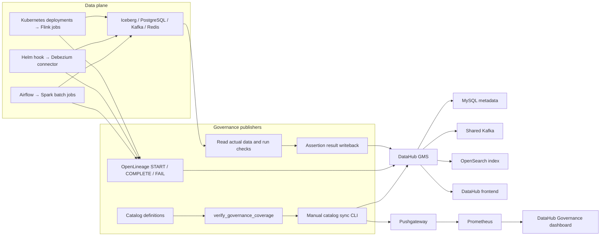
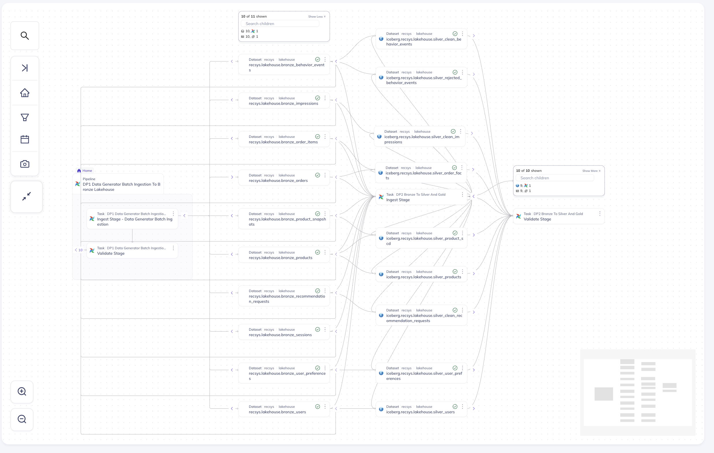
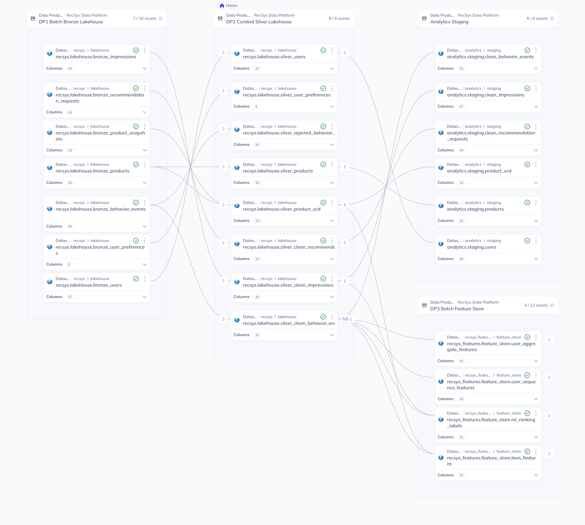
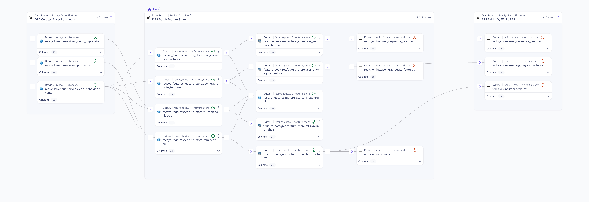
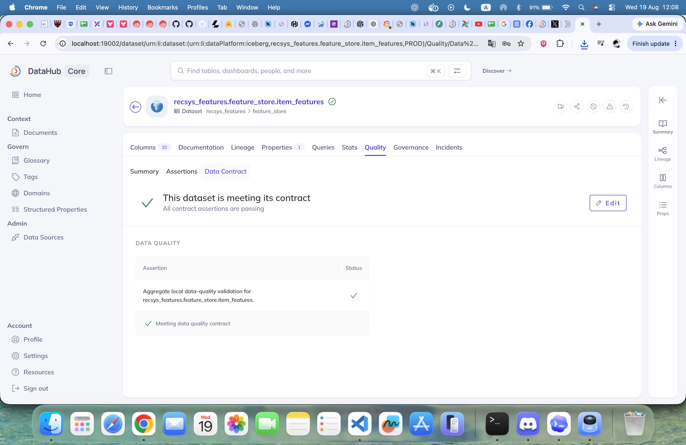
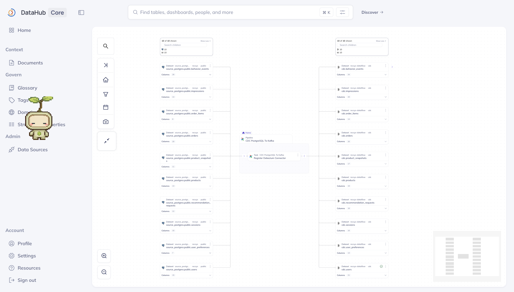
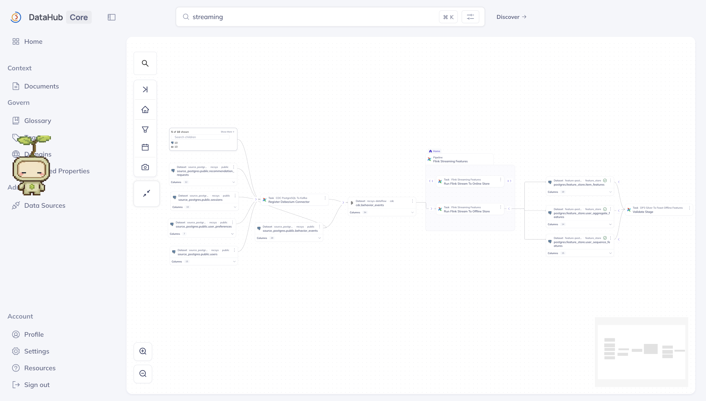

# Data Governance

DataHub governs the three rubric batch pipelines as `DP1`, `DP2`, and `DP3`. CDC and continuous feature processing are intentionally separated into `CDC_INGESTION` and `STREAMING_FEATURES`, so their lineage no longer changes the rubric numbering.

The governed flows are:

- `DP1`: Data Generator batch ingestion -> Bronze Iceberg lakehouse.
- `DP2`: Bronze Iceberg -> PySpark -> curated Silver Iceberg.
- `DP3`: Silver Iceberg -> PySpark features -> Iceberg feature tables -> PostgreSQL Feast offline store.
- `CDC_INGESTION`: source PostgreSQL -> Debezium -> `cdc.*` Kafka topics.
- `STREAMING_FEATURES`: `cdc.behavior_events` -> two continuously running Flink jobs -> PostgreSQL offline features and Redis online features.

## How Governance Works End To End


```mermaid
flowchart LR
  subgraph DataPlane["Data plane"]
    Batch["Airflow → Spark batch jobs"]
    CDC["Helm hook → Debezium connector"]
    Stream["Kubernetes deployments → Flink jobs"]
    Stores["Iceberg / PostgreSQL / Kafka / Redis"]
    Batch --> Stores
    CDC --> Stores
    Stream --> Stores
  end

  subgraph GovernancePublishers["Governance publishers"]
    Definitions["Catalog definitions"] --> Coverage["verify_governance_coverage"]
    Coverage --> CatalogCLI["Manual catalog sync CLI"]
    Batch --> OL["OpenLineage START / COMPLETE / FAIL"]
    CDC --> OL
    Stream --> OL
    Stores --> Validator["Read actual data and run checks"]
    Validator --> Results["Assertion result writeback"]
  end

  CatalogCLI --> GMS["DataHub GMS"]
  OL --> GMS
  Results --> GMS
  GMS --> MySQL["MySQL metadata"]
  GMS --> Kafka["Shared Kafka"]
  GMS --> Search["OpenSearch index"]
  GMS --> UI["DataHub frontend"]
  CatalogCLI --> Pushgateway["Pushgateway"]
  Pushgateway --> Prometheus["Prometheus"]
  Prometheus --> Grafana["DataHub Governance dashboard"]
```

### 1. Data Lineage

Every governed stage uses `RuntimeLineageRecorder`. Entering its context emits `START`; a successful exit emits `COMPLETE`; an exception or explicit `fail()` emits `FAIL`. Each event carries the Airflow run ID, pipeline and job/stage identity, canonical DataHub input/output Dataset URNs, and an error message when the run fails. The event is sent to DataHub's native OpenLineage endpoint.

**Proof:** the recorder owns the run lifecycle, converts canonical DataHub URNs into OpenLineage datasets, and publishes the resulting event directly to DataHub.

**Reference code:**

- [`build_event()` constructs the OpenLineage run, job, inputs, and outputs](../../../apps/data-platform/src/metadata/runtime_lineage.py#L66-L124).
- [`_openlineage_client()` configures the native DataHub OpenLineage endpoint](../../../apps/data-platform/src/metadata/runtime_lineage.py#L127-L149).
- [`RuntimeLineageRecorder` emits `START`, `COMPLETE`, and `FAIL`](../../../apps/data-platform/src/metadata/runtime_lineage.py#L179-L239).
- [Canonical flow, job, and Dataset URNs are centralized in `governance_catalog.py`](../../../apps/data-platform/src/metadata/governance_catalog.py#L11-L122).

The catalog does not declare static lineage. Catalog synchronization deliberately writes an empty `upstreamLineage` aspect to remove stale direct Dataset edges, leaving runtime OpenLineage as the only lineage source.

**Proof:** governed Dataset definitions contain no predeclared inputs or outputs, and catalog emission clears both upstream and fine-grained lineage lists.

**Reference code:**

- [`emit_dataset()` removes static Dataset lineage](../../../apps/data-platform/src/metadata/ingest_datahub_governance.py#L327-L353).
- [The catalog test verifies there is no predeclared lineage](../../../tests/unit/test_runtime_lineage.py#L42-L51).
- [The DP2 mapping test proves runtime OpenLineage resolves to the exact catalog URNs](../../../tests/unit/test_runtime_lineage.py#L54-L75).

### 2. Data Validation

Validators produce checks in the form `name + status + expected + observed`. Dataset checks are aggregated into `SUCCESS`, `FAILURE`, or `ERROR`, then published directly to the Dataset's schema assertion and data-quality assertion together with the run ID and serialized observed checks.

**Proof:** each Dataset result upserts its data-quality assertion and writes one schema assertion result plus one data-quality assertion result.

**Reference code:**

- [`check()` and `dataset_result()` define and aggregate native validation results](../../../apps/data-platform/src/validate/governance_contracts.py#L26-L44).
- [`publish_validation_results()` writes both assertion results to DataHub](../../../apps/data-platform/src/metadata/datahub_validation.py#L108-L195).
- [The assertion-writeback test verifies the upsert plus two result writes](../../../tests/unit/test_runtime_lineage.py#L112-L146).

### 3. Data Contract

Every governed Dataset declares a canonical URN, schema and native data types, primary keys, required columns, a contract description, and the validation pipeline responsible for the Dataset. DataHub receives one `DATA_SCHEMA` assertion, one `DATA_QUALITY` assertion, and one `ACTIVE` Data Contract that references both assertions.

**Proof:** the governance publisher creates the two assertion identities and uses GraphQL `upsertDataContract` to attach them to the Dataset.

**Reference code:**

- [The `Dataset` governance model contains schema, keys, required columns, and validation ownership](../../../apps/data-platform/src/metadata/ingest_datahub_governance.py#L54-L65).
- [`schema_assertion_info()` publishes the declared schema with `EXACT_MATCH` compatibility](../../../apps/data-platform/src/metadata/ingest_datahub_governance.py#L432-L447).
- [`emit_dataset_contract()` creates the active schema-plus-quality contract](../../../apps/data-platform/src/metadata/ingest_datahub_governance.py#L481-L509).
- [Centralized Bronze, Silver, and feature schemas are defined in `governance_schemas.py`](../../../apps/data-platform/src/metadata/governance_schemas.py#L21-L307).
- [The contract test verifies the native DataHub schema assertion and exact-match policy](../../../tests/unit/data_platform/test_governance_lineage.py#L179-L203).

## Operations And Observability

The catalog CLI pushes `recsys_datahub_ingest_success`, timestamp, dataset count, job count, product count, and per-product presence to Pushgateway under job `recsys_datahub_governance`. Prometheus scrapes the values, and the `DataHub Governance` Grafana dashboard combines them with DataHub container CPU/memory/health metrics.

Because catalog sync is not scheduled, its Pushgateway counters and timestamp change only when the CLI runs. The timestamp should therefore be read as **age of the last attempted catalog sync**, not proof that runtime lineage or assertions are fresh. Runtime state is inspected in DataHub, while pod/service health is covered by the observability stack and `ops/gcp/services_power.sh` smoke checks.

For direct local inspection:

```bash
kubectl -n datahub port-forward svc/datahub-datahub-gms 8088:8080
kubectl -n datahub port-forward svc/datahub-datahub-frontend 9002:9002
```

## Current Boundaries And Security Gaps

- Catalog sync is not automated. `DATAHUB_INGEST_ENABLED=false` is currently unused by application code, so definitions can drift from source until an operator reruns the CLI.
- GMS metadata-service authentication is disabled, the frontend chart contains the default `datahub:datahub` credential, MySQL uses a non-TLS JDBC URL, and OpenSearch's security plugin is disabled.
- GMS/frontend are internal `ClusterIP` services and the namespace has Istio sidecars, but `datahub` is not one of the namespaces covered by the chart's namespace-wide `STRICT` mTLS and default-deny policies.
- MySQL and encryption secrets are created directly by Terraform. They may be generated when inputs are omitted, but they remain sensitive Terraform/Kubernetes state rather than External Secrets-managed references.
- Product membership, schemas, contracts, and runtime lineage are implemented; named stewards/owners, glossary/classification, retention enforcement, approval workflows, and automatic stale-entity cleanup are not.
- `verify_governance_coverage()` protects declared metadata completeness, not physical freshness. Physical truth comes only from a later pipeline run and validator result.

These gaps do not prevent the current catalog/lineage/contract demonstration, but they are the main items to close before treating DataHub as a production governance control plane.

## Entity And Relationship Model

DataHub receives runtime dependencies through its native OpenLineage endpoint. OpenLineage `inputs` and `outputs` become the DataJob's inlets and outlets, while the catalog path uses `DataHubRestEmitter`, `MetadataChangeProposalWrapper`, GraphQL, and `DataHubGraph` for definitions and contracts.

```text
Domain: RecSys Data Platform
`- Data Product: DP1 / DP2 / DP3 / CDC_INGESTION / STREAMING_FEATURES
   |- Dataset(s): schema + tags + custom properties + contract
   |- DataFlow: canonical OpenLineage flow identity
   `- DataJob(s): catalog definition + runtime runs

Data Contract
|- Schema assertion
`- Data-quality assertion

Runtime inputs  -> DataJob -> runtime outputs
```

For every governed dataset, `emit_dataset_contract()` defines the schema and data-quality assertion URNs and bundles them into an active contract. Runtime validation updates the result history independently; OpenLineage updates run and lineage history independently. This separation lets the UI show both the expected model and the evidence produced by real executions.

## DP1 Linked With Related Tables

`recsys_dp1_raw_to_bronze` runs the Data Generator inside the batch task and commits its ephemeral Parquet fragments directly into Bronze Iceberg tables. There is no separate MinIO data-lake stage or governed Parquet dataset in the lineage. MinIO is only the S3-compatible object-storage backend underneath Iceberg. `optimize_stage` rewrites the Bronze physical layout before `validate_stage` checks table readability, `row_count > 0`, source key columns, `source_run_id`, and `lakehouse_ingestion_ts`.

### DP1 Lineage Image Proof



**Figure 1 — DP1 batch ingestion and downstream handoff.** DataHub shows the DP1 ingestion and validation jobs, the ten governed `recsys.lakehouse.bronze_*` Iceberg outputs, and their downstream consumption by DP2. This historical capture predates the separate `optimize_stage` node; current runtime lineage records optimization between ingestion and validation. No raw-S3 or governed Parquet dataset appears between the DP1 task and Bronze.

### DP1 Validation And Data Contract Image Proof


**Figure 2 — DP1 schema and data-quality contract.** The `recsys.lakehouse.bronze_behavior_events` contract is passing, its Columns badge reports 30 fields, and the Schema table exposes field names and normalized types. The green data-quality assertion, `DP1` Data Product association, and `DataContract`/`NativePipeline` tags demonstrate that the Bronze table is governed by both structural and runtime-quality checks.

### Execution And Governance Steps

#### Data Lineage

DP1 executes `generate Parquet -> ingest Bronze -> optimize Bronze -> validate Bronze`. The ingestion recorder commits ten generated tables to `recsys.lakehouse.bronze_*` and adds each canonical Bronze URN as an observed output. It has no governed Parquet input because those files are an ephemeral exchange format rather than catalog Datasets. Optimization records the same Bronze URNs as both inputs and outputs because it rewrites physical files without creating new logical Datasets; validation records all Bronze URNs as inputs.

**Proof:** Airflow enforces `ingest_stage >> optimize_stage >> validate_stage`, ingestion adds a lineage output immediately after each Iceberg write, and optimization constructs a self-lineage recorder for the Bronze scope.

**Reference code:**

- [DP1 Airflow commands and stage ordering](../../../apps/data-platform/src/orchestration/airflow/dags/recsys_dp1_raw_to_bronze.py#L13-L67).
- [`load_generator_run_to_lakehouse()` writes the ten Bronze tables and records their output URNs](../../../apps/data-platform/src/ingest/batch_lakehouse_ingestion.py#L69-L102).
- [`optimization_dataset_urns()` and `optimize_stage` record Bronze as both input and output](../../../apps/data-platform/src/lakehouse/optimize.py#L76-L84), [recorder construction](../../../apps/data-platform/src/lakehouse/optimize.py#L149-L171).
- [The canonical ten raw/Bronze table identities](../../../apps/data-platform/src/lakehouse/iceberg.py#L53-L67).

#### Data Contract

DP1 owns ten Bronze Dataset contracts. Each contract combines the full generator schema with `source_run_id` and `lakehouse_ingestion_ts`; its DataHub primary key is `source_run_id` followed by the source table's primary key. The Dataset is assigned to validation pipeline `DP1` and requires both ingestion-audit columns.

**Proof:** `dp1()` constructs one contract-bearing Dataset per raw table from the shared Bronze schema and source-key definitions.

**Reference code:**

- [`SOURCE_TABLE_CONTRACTS` defines the source primary keys](../../../apps/data-platform/src/ingest/postgres_cdc_contracts.py#L6-L31).
- [`bronze_schema()` merges raw columns with Bronze audit columns](../../../apps/data-platform/src/metadata/governance_schemas.py#L182-L201).
- [`dp1()` declares all ten Dataset contracts, keys, required columns, and jobs](../../../apps/data-platform/src/metadata/ingest_datahub_governance.py#L574-L619).

#### Data Validation

Before ingestion, the generator rejects broken relational and business invariants. The governed Bronze validator then opens each Iceberg table, requires `row_count > 0`, checks that the source keys plus `source_run_id` and `lakehouse_ingestion_ts` exist, and requires those values to be non-null. It publishes the Dataset results to DataHub; a non-success report makes the validation command exit with status `1` and therefore fails the Airflow task.

**Proof:** generation raises before writing invalid Parquet, while the post-ingestion validator derives its required fields from the same source contract used by governance and returns a non-zero process status on failure.

**Reference code:**

- [Generator invariant validation before Parquet writes](../../../apps/data-platform/data-generator/src/offline/historical_pipeline.py#L25-L63), [relational and business checks](../../../apps/data-platform/data-generator/src/validation.py#L36-L194).
- [`validate_dp1_bronze()` performs the governed Bronze checks and publishes their results](../../../apps/data-platform/src/validate/governance_contracts.py#L47-L112).
- [The validator CLI converts a failed report into exit code `1`](../../../apps/data-platform/src/validate/governance_contracts.py#L297-L319).

## DP2 Linked With Related Tables

`recsys_dp2_bronze_to_silver_gold` reads the DP1 Bronze Iceberg tables and writes nine curated `silver_*` Iceberg tables. `clean_behavior_events` is normalized and deduplicated with `.dropDuplicates(["event_id"])`; `silver_rejected_behavior_events` contains unsupported-schema rows and may legitimately be empty. The Silver tables are optimized before validation.

### DP2 Lineage Image Proof



**Figure 3 — DP2 Bronze-to-Silver transformation.** The expanded historical graph centers the DP2 ingestion and validation endpoints, with ten DP1 Bronze inputs on the left and nine curated `iceberg.recsys.lakehouse.silver_*` outputs on the right. Current lineage inserts `Optimize Stage` between those endpoints. The additional DP3 feature nodes are downstream impact context; the DP2 evidence is the Bronze -> PySpark -> optimized Silver path.

### DP2 Validation And Data Contract Image Proof


**Figure 4 — DP2 curated-table contract.** The `iceberg.recsys.lakehouse.silver_clean_behavior_events` dataset is associated with DP2 and has a passing active contract. Its 31-column schema is rendered alongside the successful data-quality assertion, proving that the curated Silver output has both registered structure and runtime validation.

### Execution And Governance Steps

#### Data Lineage

DP2 records `10 Bronze Iceberg inputs -> DP2.ingest_stage -> 9 Silver Iceberg outputs`. Spark normalizes compatible schema evolution, splits unsupported behavior-event versions, deduplicates events and impressions, builds order facts and product SCD data, and writes only `silver_*` logical outputs. The following optimize stage records the same nine Silver URNs as inputs and outputs before validation consumes them.

**Proof:** the runtime entrypoint adds every canonical Bronze URN to the ingest recorder and only the Silver tables returned by the transformation as outputs.

**Reference code:**

- [DP2 Airflow ingest, optimize, validate commands and ordering](../../../apps/data-platform/src/orchestration/airflow/dags/recsys_dp2_bronze_to_silver_gold.py#L13-L57).
- [`build_dp2_silver_gold()` records all Bronze inputs and actual Silver outputs](../../../apps/data-platform/src/features/spark/dp2_silver_gold_entrypoint.py#L20-L31).
- [Silver normalization, rejection, deduplication, joins, and writes](../../../apps/data-platform/src/features/spark/build_silver_tables.py#L25-L118).
- [Canonical Bronze and Silver URN maps](../../../apps/data-platform/src/metadata/governance_catalog.py#L80-L113).

#### Data Contract

DP2 owns nine Silver Dataset contracts. Each contract declares the transformation-aligned Silver schema and primary key. `clean_behavior_events` additionally requires `event_id`, `event_timestamp`, and `ingestion_ts`, and its contract description requires `event_id` uniqueness.

**Proof:** the centralized Silver schema composes source fields with derived fields such as `event_type_id` and `is_valid_purchase`, and `dp2()` attaches those schemas and keys to the nine governed Datasets.

**Reference code:**

- [Silver Dataset schemas and derived columns](../../../apps/data-platform/src/metadata/governance_schemas.py#L204-L231).
- [Silver primary-key definitions](../../../apps/data-platform/src/metadata/governance_schemas.py#L289-L299).
- [`dp2()` declares the nine Silver contracts and their validation ownership](../../../apps/data-platform/src/metadata/ingest_datahub_governance.py#L622-L669).

#### Data Validation

Every normal Silver table requires `row_count > 0`; `rejected_behavior_events` may be empty. `clean_behavior_events` is also required to contain `event_id`, `event_timestamp`, and `ingestion_ts`, with `duplicate_event_id == 0`. A failed report is written to DataHub, the validation lineage run is marked `FAIL`, and Spark raises an exception so Airflow cannot continue successfully.

**Proof:** validation reads each expected Silver table, evaluates the special rejected-table and clean-event rules, publishes all Dataset results, and raises when the aggregate report is not `SUCCESS`.

**Reference code:**

- [`validate_dp2_silver_gold()` implements row-count, required-column, and uniqueness checks](../../../apps/data-platform/src/features/spark/dp2_silver_gold_entrypoint.py#L34-L96).
- [The validation action is selected by the DP2 entrypoint CLI](../../../apps/data-platform/src/features/spark/dp2_silver_gold_entrypoint.py#L99-L116).
- [`publish_validation_results()` writes schema and quality evidence](../../../apps/data-platform/src/metadata/datahub_validation.py#L108-L195).

## DP3 Linked With Related Tables

`recsys_dp3_offline_feature_table` now consumes DP2 `silver_*` tables directly. It does not rebuild Silver. PySpark computes five Iceberg feature outputs, exports the four Feast source tables to PostgreSQL, and validates both storage layers.

### DP3 Lineage Image Proof



**Figure 5 — DP3 Silver-to-Feast offline-feature lineage.** Nine DP2 Silver datasets feed the DP3 `Ingest Stage`; the flow produces five Iceberg feature tables and exports the four Feast source tables to PostgreSQL before `Validate Stage`. The separate Iceberg and PostgreSQL nodes make the storage boundary explicit: Iceberg holds batch feature outputs, while PostgreSQL is the Feast offline store.

### DP3 Validation And Data Contract Image Proof



**Figure 6 — DP3 PostgreSQL Feast-table contract.** The final `postgres.feature_store.ml_ranking_labels` dataset is attached to DP3 and its active contract is passing. DataHub renders all 15 schema fields and a successful data-quality assertion, proving that governance continues across the Iceberg-to-PostgreSQL export boundary.

### Execution And Governance Steps

#### Data Lineage

With the default `silver_lakehouse` source, DP3 records `9 Silver inputs -> DP3.ingest_stage -> 5 Iceberg feature outputs + 4 PostgreSQL Feast outputs`. The PostgreSQL lineage outputs are added only when PostgreSQL export is enabled. Optional Feast Parquet copies and drift snapshots are physical side outputs but are not governed Dataset URNs, so they do not appear in DataHub lineage.

**Proof:** the runtime selects the input URN family from the configured source, adds an Iceberg URN after each feature-table write, and adds the PostgreSQL URNs returned by the enabled export step.

**Reference code:**

- [DP3 Airflow Spark ingest and PostgreSQL validation ordering](../../../apps/data-platform/src/orchestration/airflow/dags/recsys_dp3_offline_feature_table.py#L14-L40).
- [DP3 feature construction graph](../../../apps/data-platform/src/features/spark/dp3_offline_feature_entrypoint.py#L74-L109).
- [PostgreSQL export returns the four governed output URNs](../../../apps/data-platform/src/features/spark/dp3_offline_feature_entrypoint.py#L138-L155).
- [`run_dp3_offline_features()` records Silver inputs and Iceberg/PostgreSQL outputs](../../../apps/data-platform/src/features/spark/dp3_offline_feature_entrypoint.py#L214-L298).

#### Data Contract

DP3 owns nine Dataset contracts: five Iceberg feature tables and four PostgreSQL Feast tables. Each contract declares the full feature schema and primary key and requires the relevant entity key plus feature or prediction timestamp. `ml_bst_training` is governed only as Iceberg output and is not one of the PostgreSQL Feast tables.

**Proof:** the shared feature schema definitions drive both the governed Iceberg metadata and the PostgreSQL export schema, while `dp3()` explicitly builds separate Iceberg and PostgreSQL contract collections.

**Reference code:**

- [DP3 Iceberg and PostgreSQL table sets and canonical URNs](../../../apps/data-platform/src/metadata/governance_catalog.py#L19-L25), [URN maps](../../../apps/data-platform/src/metadata/governance_catalog.py#L112-L117).
- [Feature schemas and primary keys](../../../apps/data-platform/src/metadata/governance_schemas.py#L234-L307).
- [Physical PostgreSQL Feast table schemas](../../../apps/data-platform/src/feature_store/postgres_offline_store.py#L13-L111).
- [`dp3()` declares five Iceberg plus four PostgreSQL contracts](../../../apps/data-platform/src/metadata/ingest_datahub_governance.py#L672-L731).

#### Data Validation

Validation is split across two execution points. During `ingest_stage`, Spark checks all five Iceberg outputs for `row_count > 0`, required entity-key/timestamp columns, and zero null key/timestamp rows. After ingest succeeds, Airflow's `validate_stage` checks the four PostgreSQL tables for the complete configured schema, `row_count > 0`, and zero null entity-key/timestamp rows. Both paths publish Dataset assertion results directly to DataHub and fail their task when the aggregate contract result is not successful.

**Proof:** Iceberg validation is invoked before the DP3 ingest recorder completes, while the separate Airflow task runs `validate_dp3_postgres()` only after the Spark stage.

**Reference code:**

- [DP3 Iceberg validation checks and assertion publication](../../../apps/data-platform/src/features/spark/dp3_offline_feature_entrypoint.py#L158-L211).
- [The ingest task fails when its Iceberg contract report is not successful](../../../apps/data-platform/src/features/spark/dp3_offline_feature_entrypoint.py#L287-L298).
- [`validate_dp3_postgres()` implements PostgreSQL schema, row-count, and null-key/timestamp checks](../../../apps/data-platform/src/validate/governance_contracts.py#L115-L201).
- [The validator CLI returns non-zero for a failed PostgreSQL report](../../../apps/data-platform/src/validate/governance_contracts.py#L297-L319).

## CDC Ingestion

`recsys_cdc_postgres_to_kafka` owns source PostgreSQL and Kafka datasets. The graph is `source_postgres.public.* -> Register Debezium Connector -> cdc.*`; it is no longer labelled DP1.



**Figure 7 — CDC ingestion lineage.** Ten source PostgreSQL tables feed the `Register Debezium Connector` task and map to ten `cdc.*` Kafka topics. The connector is represented as the processing node between the source tables and topics, and the dedicated `CDC PostgreSQL To Kafka` flow keeps this real-time ingestion path separate from rubric DP1.

The accepted connector configuration determines the runtime source-table and Kafka-topic observations.

### Execution And Governance Steps

1. **Data lineage:** the [connector registration runtime](../../../apps/data-platform/src/ingest/register_k8s_connectors.py#L89-L100) reads the accepted Debezium `table.include.list`, records the included source PostgreSQL tables as inputs, and records their canonical `cdc.*` Kafka topics as outputs of `CDC_INGESTION.register_debezium_connector`.
2. **Data contract:** [`cdc_ingestion`](../../../apps/data-platform/src/metadata/ingest_datahub_governance.py#L784-L826) defines contracts for ten source PostgreSQL datasets and ten Kafka topic datasets. Source contracts carry the source schema and primary key; topic contracts carry the Debezium envelope schema and expected source-to-topic mapping.
3. **Data validation:** the [CDC mapping validator](../../../apps/data-platform/src/ingest/register_k8s_connectors.py#L101-L111) requires each expected source table to be present in the submitted connector configuration and maps it to `cdc.<table>`. This validates the accepted connector configuration, not the later existence of Kafka messages; any missing mapping fails the report and connector task.

## Streaming Features

`recsys_flink_stream_features` contains two distinct jobs:

- `Run Flink Stream To Offline Store`: `cdc.behavior_events` -> PostgreSQL Feast offline feature tables.
- `Run Flink Stream To Online Store`: `cdc.behavior_events` -> Redis feature keys.

The PostgreSQL datasets remain owned by DP3 and are only referenced by the streaming flow. This avoids duplicate Data Product ownership while retaining cross-flow lineage.



**Figure 8 — Streaming feature-store processing.** The `cdc.behavior_events` topic branches into distinct `Run Flink Stream To Online Store` and `Run Flink Stream To Offline Store` jobs. The expanded offline branch shows the three PostgreSQL feature tables; the Redis children of the online-store job are collapsed in this capture. The two job nodes still make the online and offline processing responsibilities explicit.

The event reports the PostgreSQL offline outputs for the offline-store job and the Redis outputs for the online-store job.

### Execution And Governance Steps

1. **Data lineage:** the [Flink entrypoint](../../../apps/data-platform/src/features/flink/realtime_stream_job.py#L174) creates two runtime recorders with the same `cdc.behavior_events` input. The offline job records the three PostgreSQL Feast feature tables as outputs, while the online job records the three Redis feature datasets. A continuously running job remains at `START`; termination records `COMPLETE` or `FAIL`.
2. **Data contract:** [`streaming_features`](../../../apps/data-platform/src/metadata/ingest_datahub_governance.py#L829-L866) owns contracts only for the three Redis datasets because the PostgreSQL offline tables remain owned by DP3. Each Redis contract declares the entity key, feature schema, and intended TTL semantics.
3. **Data validation:** [`validate_streaming_redis`](../../../apps/data-platform/src/validate/governance_contracts.py#L219-L249) scans `fs:user_sequence:*`, `fs:user_aggregate:*`, and `fs:item:*`. Each contract passes only when at least one matching key exists and a sampled Redis hash has a non-empty payload. The current validator does not yet verify TTL, and PostgreSQL outputs are validated under DP3 rather than duplicated under Streaming.

## Runtime Governance Verification

After the DP1, DP2, DP3, CDC, and streaming validation tasks have run, verify coverage without contacting DataHub:

```bash
PYTHONPATH=apps/data-platform/src \
python -m metadata.ingest_datahub_governance --verify-only
```

A successful result contains `"verified": true`, `"datasets": 51`, `"jobs": 11`, native OpenLineage mode, and direct assertion-writeback mode. It verifies static governance identity and coverage without depending on legacy files.
