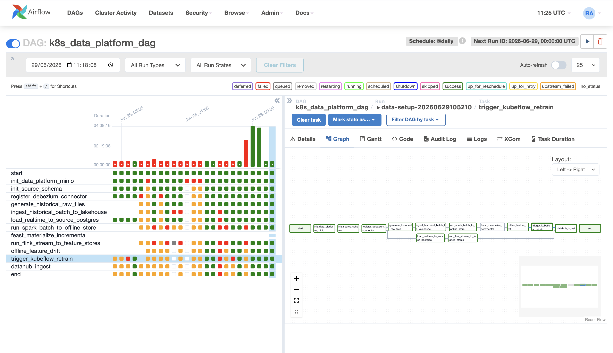

# Data Pipeline Orchestration

This document covers the rubric rows for Airflow DP1, DP2, and DP3. All connections, credentials, and runtime variables are injected through Kubernetes ConfigMaps/Secrets into Airflow tasks so pipeline tasks can reuse them.

Code reference:

- [apps/data-platform/src/orchestration/airflow/dags/k8s_data_platform_dag.py](../../../apps/data-platform/src/orchestration/airflow/dags/k8s_data_platform_dag.py): Airflow DAG for DP1/DP2/DP3.
- [infra/helm/recsys-data-platform/templates/airflow.yaml](../../../infra/helm/recsys-data-platform/templates/airflow.yaml): Airflow scheduler/webserver deployment.
- [infra/helm/recsys-data-platform/templates/configmap.yaml](../../../infra/helm/recsys-data-platform/templates/configmap.yaml): shared runtime variables.
- [infra/helm/recsys-data-platform/templates/realtime-flink-consumer.yaml](../../../infra/helm/recsys-data-platform/templates/realtime-flink-consumer.yaml): Flink streaming deployment checked by Airflow.

## DP1 - Raw Data Into Bronze Zone

Airflow stage order:

```text
start
-> init_data_platform_minio
-> init_source_schema
-> register_debezium_connector
-> generate_historical_raw_files
-> ingest_historical_batch_to_lakehouse
```

| Stage | Task | Purpose |
|---|---|---|
| Ingest | `generate_historical_raw_files` | Generates historical source data and stores it under the raw lake prefix. |
| Ingest | `load_realtime_to_source_postgres` | Loads realtime source rows into Postgres for Debezium CDC. |
| Validate | `init_source_schema` | Ensures source schema and indexes are present before load/CDC. |
| Validate | `register_debezium_connector` | Registers the CDC connector and validates Kafka topic path. |
| Bronze write | `ingest_historical_batch_to_lakehouse` | Copies raw generator tables into lakehouse table paths with ingestion metadata. |

## DP2 - Bronze To Silver/Gold

Airflow stage order:

```text
ingest_historical_batch_to_lakehouse
-> run_spark_batch_to_offline_store
-> feast_materialize_incremental
```

| Stage | Task | Purpose |
|---|---|---|
| Ingest | `run_spark_batch_to_offline_store` | Reads raw lakehouse tables and builds silver tables. |
| Validate | `build_clean_behavior_events` inside Spark | Handles schema evolution, deduplication, event timestamp normalization. |
| Gold/offline write | Spark feature builders | Writes user sequence, user aggregate, item features, labels, and training tables. |
| Materialize | `feast_materialize_incremental` | Applies Feast repo and materializes offline features for online serving. |

## DP3 - Offline Feature Table

Airflow stage order:

```text
run_spark_batch_to_offline_store
-> feast_materialize_incremental
-> offline_feature_drift
-> trigger_kubeflow_retrain
```

| Stage | Task | Purpose |
|---|---|---|
| Ingest | `run_spark_batch_to_offline_store` | Produces `user_sequence_features`, `user_aggregate_features`, `item_features`, and `ml_bst_training`. |
| Validate | `offline_feature_drift` | Compares current offline features with baseline and pushes metrics. |
| Validate/retrain | `trigger_kubeflow_retrain` | Triggers retraining when drift threshold fails. |

## Run And Check Logs

```bash
cd /Users/KHOAI/anhkhoa/RecSys-MLops

kubectl get pods -n recsys-dataflow | rg 'airflow|spark|flink'
kubectl logs -n recsys-dataflow deploy/airflow-scheduler --tail=100
kubectl logs -n recsys-dataflow deploy/airflow-webserver --tail=100

kubectl port-forward -n recsys-dataflow svc/airflow-webserver 8080:8080
```

Open `http://127.0.0.1:8080` and capture Graph view for `k8s_data_platform_dag`.

Observed GCP runtime:

```text
airflow-scheduler READY 1/1
airflow-webserver READY 1/1
flink-jobmanager READY 1/1
flink-taskmanager READY Running
realtime-flink-consumer READY Running
Flink job ae265b6977210f116628e6c1349e7174 RUNNING with 5/5 tasks.
Flink checkpoints 1 and 2 completed.
```

Image proof:


