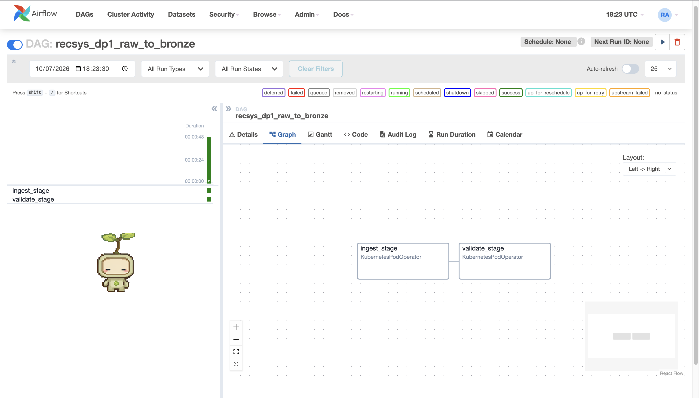

# Data Pipeline Orchestration

The data platform exposes the three rubric data pipelines as Airflow DAGs. Each DAG follows the same two-stage structure:

1. `ingest_stage`: run the actual pipeline transformation.
2. `validate_stage`: evaluate the pipeline-specific runtime contract and fail the DAG when a required check fails.

The DAGs reuse shared platform configuration through Kubernetes `ConfigMap` and `Secret` injection instead of hard-coding connection details in each task. The common `KubernetesPodOperator` wrapper loads `recsys-data-platform-config` and `recsys-data-platform-secret`, forwards logs to Airflow, disables sidecar injection for batch pods, and pins the task to the configured dataflow node pool.

Code reference:

- [apps/data-platform/src/orchestration/airflow/dags/rubric_data_pipeline_dags.py line 56](../../../apps/data-platform/src/orchestration/airflow/dags/rubric_data_pipeline_dags.py#L56): shared `ConfigMap` and `Secret` injection for reusable Airflow connections/variables.
- [apps/data-platform/src/orchestration/airflow/dags/rubric_data_pipeline_dags.py line 80](../../../apps/data-platform/src/orchestration/airflow/dags/rubric_data_pipeline_dags.py#L80): common `KubernetesPodOperator` factory used by all DP1/DP2/DP3 stages.
- [apps/data-platform/src/orchestration/airflow/dags/rubric_data_pipeline_dags.py line 99](../../../apps/data-platform/src/orchestration/airflow/dags/rubric_data_pipeline_dags.py#L99): shared Spark-on-Kubernetes submit command used by DP2 and DP3.

Storage terminology in this document is intentionally strict: Bronze Parquet, Silver Iceberg, and intermediate Iceberg feature tables are zones or tables inside the same data lakehouse. PostgreSQL is the Feast offline feature store. The architecture does not introduce an independent data-lake layer between the Data Generator and the lakehouse.

## Pipeline To Ingest Raw Data Into Bronze Zone (DP1)

DP1 is the direct batch ingestion pipeline from the Data Generator to the Parquet lakehouse Bronze zone. The generator writes temporary files inside the Airflow batch pod; the same `ingest_stage` immediately loads them into Bronze and the temporary pod output disappears when the task finishes. There is no separate raw data-lake or object-storage stage in this flow. The object-storage implementation is only infrastructure beneath the governed lakehouse warehouse.

Flow: `Data Generator -> batch ingest_stage -> Bronze Parquet lakehouse`.

Input: historical data generated inside the batch pod from `$DATA_GENERATOR_CONFIG`.

Output: Bronze Parquet tables under `$LAKEHOUSE_WAREHOUSE/lakehouse/<table>`.

DataHub identifies these physical tables through logical Parquet URNs named `recsys.lakehouse.bronze_<table>`; the lineage therefore represents the lakehouse dataset rather than its S3-compatible storage backend.

### Reference Code

- [apps/data-platform/src/orchestration/airflow/dags/rubric_data_pipeline_dags.py line 152](../../../apps/data-platform/src/orchestration/airflow/dags/rubric_data_pipeline_dags.py#L152): `DP1_INGEST_COMMAND` runs the Data Generator locally inside the batch pod.
- [apps/data-platform/src/orchestration/airflow/dags/rubric_data_pipeline_dags.py line 157](../../../apps/data-platform/src/orchestration/airflow/dags/rubric_data_pipeline_dags.py#L157): the same task ingests the ephemeral generated run directly into the Bronze lakehouse layout.
- [apps/data-platform/src/orchestration/airflow/dags/rubric_data_pipeline_dags.py line 164](../../../apps/data-platform/src/orchestration/airflow/dags/rubric_data_pipeline_dags.py#L164): `DP1_VALIDATE_COMMAND` validates every Bronze table and publishes runtime observations.
- [apps/data-platform/src/orchestration/airflow/dags/rubric_data_pipeline_dags.py line 181](../../../apps/data-platform/src/orchestration/airflow/dags/rubric_data_pipeline_dags.py#L181): Airflow DAG definition for `recsys_dp1_raw_to_bronze`.
- [apps/data-platform/data-generator/src/cli.py line 25](../../../apps/data-platform/data-generator/src/cli.py#L25): the historical generator loads its config and creates the ephemeral batch output consumed by DP1.
- [apps/data-platform/src/ingest/batch_lakehouse_ingestion.py line 109](../../../apps/data-platform/src/ingest/batch_lakehouse_ingestion.py#L109): generated Parquet tables are enriched with run metadata and written directly into the Bronze lakehouse layout.

### Stage Explanation

`ingest_stage` runs two steps in one Airflow task. First, it calls the historical Data Generator with `$DATA_GENERATOR_CONFIG`; output remains ephemeral inside that Kubernetes pod. Second, it runs `ingest.batch_lakehouse_ingestion` against the local run path and writes every generated table directly into the Bronze lakehouse warehouse with `source_run_id` and `lakehouse_ingestion_ts` metadata.

`validate_stage` reads the configured Bronze namespace with PyArrow. It verifies every table is readable and non-empty and contains its source key plus `source_run_id` and `lakehouse_ingestion_ts`. The observed values and Airflow run ID are written to the DP1 governance report.

### Image Proof Show Ingest Stage & Validate Stage

**Figure: DP1 Airflow orchestration proof.** The Airflow Graph tab shows DAG `recsys_dp1_raw_to_bronze` with exactly two ordered tasks: `ingest_stage -> validate_stage`. The left task list shows both stages present in the same DAG, and the graph node labels confirm both tasks are executed by `KubernetesPodOperator`.

## Pipeline To Ingest Data From Bronze Into Silver And Gold Zone (DP2)

DP2 is the Spark batch processing pipeline from DP1 Bronze Parquet tables to curated Silver Iceberg tables. It handles timestamp normalization, compatible schema evolution, duplicate behavior-event rejection, order fact construction, product slowly changing dimension preparation, and curated `silver_*` writes.

Flow: `Bronze Parquet -> PySpark -> Silver Iceberg`.

Input: DP1 Bronze Parquet tables.

Output: curated silver/gold-style Apache Iceberg lakehouse tables such as clean behavior events, rejected behavior events, clean impressions, clean recommendation requests, order facts, product SCD, users, products, and user preferences.

### Reference Code

- [apps/data-platform/src/orchestration/airflow/dags/rubric_data_pipeline_dags.py line 166](../../../apps/data-platform/src/orchestration/airflow/dags/rubric_data_pipeline_dags.py#L166): `DP2_INGEST_COMMAND` submits the Spark ingest action.
- [apps/data-platform/src/orchestration/airflow/dags/rubric_data_pipeline_dags.py line 172](../../../apps/data-platform/src/orchestration/airflow/dags/rubric_data_pipeline_dags.py#L172): `DP2_VALIDATE_COMMAND` submits the Spark validate action.
- [apps/data-platform/src/orchestration/airflow/dags/rubric_data_pipeline_dags.py line 202](../../../apps/data-platform/src/orchestration/airflow/dags/rubric_data_pipeline_dags.py#L202): Airflow DAG definition for `recsys_dp2_bronze_to_silver_gold`.
- [apps/data-platform/src/features/spark/dp2_silver_gold_entrypoint.py line 19](../../../apps/data-platform/src/features/spark/dp2_silver_gold_entrypoint.py#L19): DP2 Spark ingest builds Silver tables from the Bronze lakehouse path.
- [apps/data-platform/src/features/spark/dp2_silver_gold_entrypoint.py line 31](../../../apps/data-platform/src/features/spark/dp2_silver_gold_entrypoint.py#L31): DP2 Spark validate reads every expected Silver table and publishes runtime checks.
- [apps/data-platform/src/features/spark/build_silver_tables.py line 95](../../../apps/data-platform/src/features/spark/build_silver_tables.py#L95): Bronze tables are normalized into clean Silver tables, rejected-event tables, order facts, product SCD, and related curated datasets.

### Stage Explanation

`ingest_stage` submits a Spark-on-Kubernetes job that runs `dp2_silver_gold_entrypoint.py --action ingest`. The Spark job reads DP1 bronze Parquet tables, normalizes event timestamps, adds missing schema-evolution columns when needed, deduplicates behavior events by latest `ingestion_ts`, builds silver tables, and writes them back to the lakehouse as `silver_*` tables.

`validate_stage` submits the same Spark entrypoint with `--action validate`. It checks every `silver_*` Iceberg table, permits the rejected-event table to be empty, validates required event columns, and requires `duplicate_event_id = 0` in `silver_clean_behavior_events`. Results are published to the DP2 governance report before DP3 consumes Silver.

### Image Proof Show Ingest Stage & Validate Stage

**Figure: DP2 Airflow orchestration proof.** The Airflow Graph tab shows DAG `recsys_dp2_bronze_to_silver_gold` with the required `ingest_stage -> validate_stage` order. The proof also shows recent green duration bars on the left for both stages, meaning the two-stage Spark pipeline ran successfully in Airflow.

## Pipeline To Compute Offline Feature Table (DP3)

DP3 is the Spark batch feature-engineering pipeline from curated silver/gold lakehouse tables to offline feature tables. It consumes DP2 curated data, computes model features, writes feature outputs to the feature lakehouse path, and exports the serving/training feature tables into PostgreSQL. In this project, PostgreSQL is the Feast offline feature store, while Apache Iceberg remains the data lakehouse/storage layer. DP3 is therefore the bridge between the data platform and the ML system: it produces user sequence features, user aggregate features, item features, and labels/training samples where configured.

Flow: `Apache Iceberg Silver/Gold -> feature lakehouse outputs -> PostgreSQL Feast offline store`.

Input: curated silver/gold Apache Iceberg lakehouse tables from DP2 and the Spark batch feature config.

Output: offline feature tables in the feature lakehouse path plus PostgreSQL tables used by Feast as the offline feature store.

### Reference Code

- [apps/data-platform/src/orchestration/airflow/dags/rubric_data_pipeline_dags.py line 143](../../../apps/data-platform/src/orchestration/airflow/dags/rubric_data_pipeline_dags.py#L143): `SPARK_BATCH_COMMAND` submits the DP3 batch feature job.
- [apps/data-platform/src/orchestration/airflow/dags/rubric_data_pipeline_dags.py line 149](../../../apps/data-platform/src/orchestration/airflow/dags/rubric_data_pipeline_dags.py#L149): `VERIFY_POSTGRES_OFFLINE_STORE_COMMAND` validates the PostgreSQL Feast offline feature store tables.
- [apps/data-platform/src/orchestration/airflow/dags/rubric_data_pipeline_dags.py line 223](../../../apps/data-platform/src/orchestration/airflow/dags/rubric_data_pipeline_dags.py#L223): Airflow DAG definition for `recsys_dp3_offline_feature_table`.
- [apps/data-platform/src/features/spark/spark_batch_entrypoint.py line 150](../../../apps/data-platform/src/features/spark/spark_batch_entrypoint.py#L150): DP3 Spark batch entrypoint.
- [apps/data-platform/src/features/spark/spark_batch_entrypoint.py line 177](../../../apps/data-platform/src/features/spark/spark_batch_entrypoint.py#L177): DP3 loads the existing DP2 Silver Iceberg tables when `source: silver_lakehouse` is configured.
- [apps/data-platform/src/features/spark/spark_batch_entrypoint.py line 181](../../../apps/data-platform/src/features/spark/spark_batch_entrypoint.py#L181): DP3 computes and writes offline feature outputs.
- [apps/data-platform/src/features/spark/spark_batch_entrypoint.py line 191](../../../apps/data-platform/src/features/spark/spark_batch_entrypoint.py#L191): DP3 exports feature outputs into the PostgreSQL Feast offline store.

### Stage Explanation

`ingest_stage` submits the production Spark batch feature job through `spark-submit`. The job reads the existing DP2 `silver_*` Iceberg tables directly; it does not rebuild Silver. It computes user sequence, user aggregate, item, ranking-label, and training feature outputs, writes Iceberg feature tables, then exports the four Feast source tables to PostgreSQL.

`validate_stage` connects to the PostgreSQL Feast offline store and checks table existence, required columns, row counts, and non-null entity keys/timestamps. It merges those observations with the Iceberg checks emitted by `ingest_stage`, producing one DP3 report that covers both intermediate feature tables and the real Feast offline store.

### Image Proof Show Ingest Stage & Validate Stage

**Figure: DP3 Airflow orchestration proof.** The Airflow Graph tab shows DAG `recsys_dp3_offline_feature_table` with `ingest_stage` followed by `validate_stage`. Both nodes are green and labeled `success`, proving the Spark feature computation stage completed and the PostgreSQL offline-store validation stage passed in the same Airflow run.
