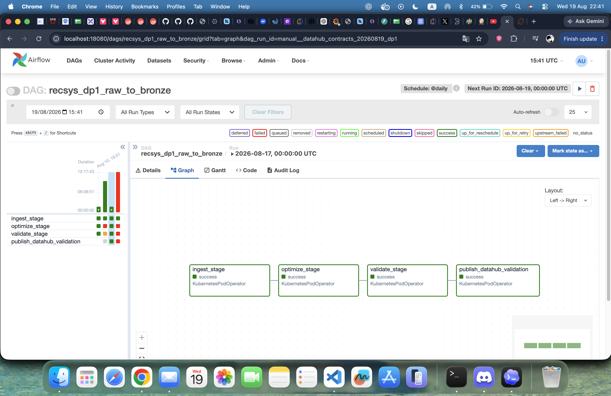
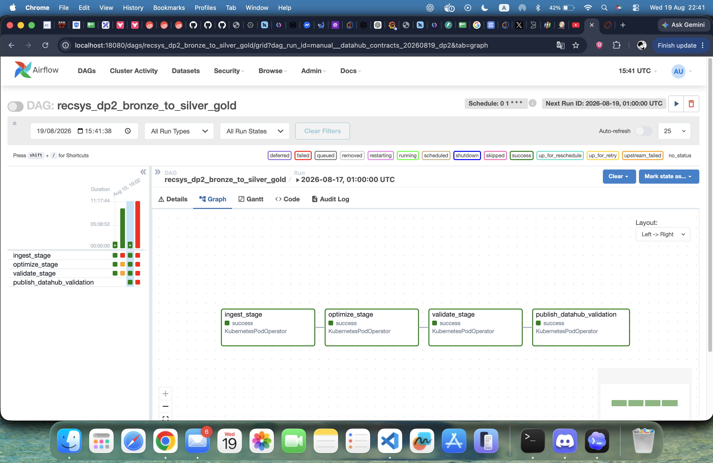
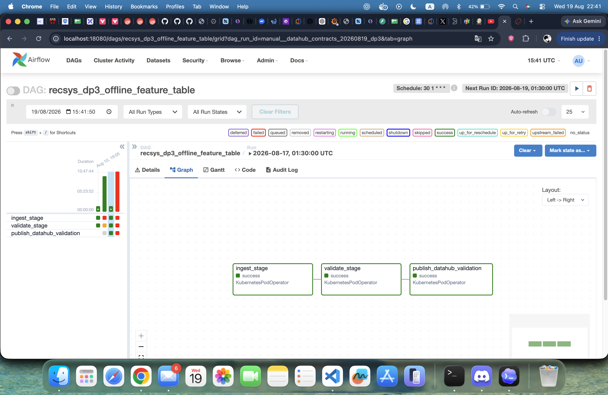
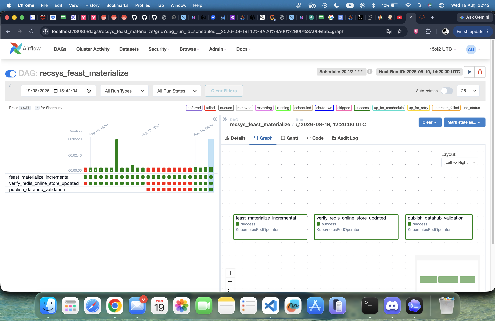

# Data Pipeline Orchestration

This document describes the implemented batch data path from generated source data to Bronze and Silver Iceberg tables, offline features, Feast materialization, Redis online serving, and DataHub validation. Airflow is the orchestration boundary; Spark, Feast, PostgreSQL, Redis, MinIO, Iceberg, and DataHub perform the data-plane and governance work.

The four core DAGs covered here are:

```text
recsys_dp1_raw_to_bronze
    -> recsys_dp2_bronze_to_silver_gold
    -> recsys_dp3_offline_feature_table
    -> recsys_feast_materialize
```

## 1. End-to-end architecture

```text
Synthetic data generator
    |
    v
DP1: generated Parquet -> Bronze Iceberg -> optimize -> validate
    |
    v
DP2: Bronze Iceberg -> curated Silver Iceberg -> optimize -> validate
    |
    v
DP3: Silver Iceberg -> feature/training Iceberg tables
                       -> Feast PostgreSQL offline tables -> validate
    |
    v
Feast materialization: PostgreSQL offline store -> Redis online store
                                              -> native Feast lookup validation
    |
    v
Validation reports in MinIO -> DataHub CUSTOM assertions and contracts
```

Each data-product DAG creates a run-scoped validation report before publishing the result to DataHub. A DataHub outage is therefore separated from the transformation itself: the report remains the durable hand-off between local validation and governance publication.

Primary references:

- [DP1 DAG](../../../apps/data-platform/src/orchestration/airflow/dags/recsys_dp1_raw_to_bronze.py)
- [DP2 DAG](../../../apps/data-platform/src/orchestration/airflow/dags/recsys_dp2_bronze_to_silver_gold.py)
- [DP3 DAG](../../../apps/data-platform/src/orchestration/airflow/dags/recsys_dp3_offline_feature_table.py)
- [Feast materialization DAG](../../../apps/data-platform/src/orchestration/airflow/dags/recsys_feast_materialize.py)
- [Shared KubernetesPodOperator and Spark helpers](../../../apps/data-platform/src/orchestration/airflow/spark_utils.py)

## 2. Deployed schedules and task chains

Schedules are injected through the shared Helm ConfigMap rather than hard-coded into a cluster-specific DAG image.

| Data product | DAG ID | Configured schedule | Ordered task chain |
|---|---|---:|---|
| DP1 | `recsys_dp1_raw_to_bronze` | `@daily` | `ingest_stage -> optimize_stage -> validate_stage -> publish_datahub_validation` |
| DP2 | `recsys_dp2_bronze_to_silver_gold` | `0 1 * * *` | `ingest_stage -> optimize_stage -> validate_stage -> publish_datahub_validation` |
| DP3 | `recsys_dp3_offline_feature_table` | `30 1 * * *` | `ingest_stage -> validate_stage -> publish_datahub_validation` |
| Feast online materialization | `recsys_feast_materialize` | `20 */2 * * *` | `feast_materialize_incremental -> verify_redis_online_store_updated -> publish_datahub_validation` |

Schedule references:

- [Helm schedule values](../../../infra/helm/recsys-data-config/values.yaml#L234-L243)
- [ConfigMap schedule injection](../../../infra/helm/recsys-data-config/templates/configmap.yaml#L40-L50)
- [`env_schedule()` manual/cron resolution](../../../apps/data-platform/src/orchestration/airflow/spark_utils.py#L77-L81)

All four DAGs set `catchup=False` and `max_active_runs=1`. This prevents backfill storms and prevents two runs of the same data product from mutating the same target tables concurrently.

## 3. Kubernetes and Spark execution model

### 3.1 KubernetesPodOperator boundary

`pod_task()` creates one `KubernetesPodOperator` in the `recsys-dataflow` namespace. Every task:

- Executes with `set -euo pipefail`.
- Receives the shared data-platform ConfigMap and Secret.
- Uses the configured CPU-services node selector.
- Streams container logs to Airflow.
- Disables the Istio sidecar by default for finite batch jobs.
- Deletes a successful task pod after completion.
- Uses the image appropriate to the stage: Spark, feature store, or data ingestion.

Reference: [`pod_task()`](../../../apps/data-platform/src/orchestration/airflow/spark_utils.py#L109-L147).

### 3.2 Spark-on-Kubernetes boundary

DP1 optimization/validation, DP2, and DP3 use `spark_native_submit()`. Spark runs in Kubernetes cluster deploy mode, forwards object-store and feature-store configuration to driver and executors, disables Istio injection on Spark pods, and enables dynamic allocation.

Two completion guards prevent false Airflow success:

```text
spark.kubernetes.submission.waitAppCompletion=true
grep -q "phase: Succeeded" "$SPARK_SUBMIT_LOG"
```

Airflow marks the task successful only when the submitted Spark application reaches the Kubernetes `Succeeded` phase.

Reference: [`spark_native_submit()`](../../../apps/data-platform/src/orchestration/airflow/spark_utils.py#L167-L225).

## 4. DP1 — generated data to Bronze Iceberg

### 4.1 Task graph

```text
ingest_stage
    -> optimize_stage
    -> validate_stage
    -> publish_datahub_validation
```

The DAG defines ten governed Bronze datasets: users, products, product snapshots, user preferences, behavior events, impressions, recommendation requests, orders, order items, and sessions.

Reference: [DP1 report path, dataset keys, commands, and DAG](../../../apps/data-platform/src/orchestration/airflow/dags/recsys_dp1_raw_to_bronze.py#L14-L95).

### 4.2 `ingest_stage`

The first task performs two operations inside the Spark image:

1. Run the deterministic historical data generator with `$DATA_GENERATOR_CONFIG`.
2. Run `batch_lakehouse_ingestion.py` against the generated run directory.

The generated Parquet fragments are an exchange format inside the task pod. The persistent governed outputs are the ten Bronze Iceberg tables.

For every generated source table, the ingestion code:

1. Reads the Parquet table.
2. Adds `source_run_id`.
3. Adds `lakehouse_ingestion_ts`.
4. Counts the rows.
5. Creates or replaces the corresponding Bronze Iceberg table.

Reference: [generator-to-Iceberg loading loop](../../../apps/data-platform/src/ingest/batch_lakehouse_ingestion.py#L67-L98).

Example stage output summary:

```json
{
  "behavior_events": 10000,
  "impressions": 10000,
  "order_items": 1000,
  "orders": 500,
  "products": 1000,
  "product_snapshots": 1000,
  "recommendation_requests": 2000,
  "sessions": 3000,
  "user_preferences": 1000,
  "users": 1000
}
```

### 4.3 `optimize_stage`

The optimizer runs with `--scope bronze`. It enumerates all ten Bronze tables and applies Iceberg compaction with the configured target file size and minimum input-file count. When `zorder` is requested, only tables with a defined access-path profile receive sort columns; all others still receive bin-packing.

The DAG does not use `--skip-missing`, so a missing expected Bronze table fails the stage instead of silently reducing the data product.

References:

- [DP1 optimize command](../../../apps/data-platform/src/orchestration/airflow/dags/recsys_dp1_raw_to_bronze.py#L48-L55)
- [Optimization table selection and compaction report](../../../apps/data-platform/src/lakehouse/optimize.py#L40-L117)

### 4.4 `validate_stage`

The validator opens every Bronze table through the Spark Iceberg catalog and checks:

- Row count is greater than zero.
- Required source primary-key columns exist.
- `source_run_id` and `lakehouse_ingestion_ts` exist.
- Required key and audit values are not null.

The result is written to:

```text
s3://recsys-lakehouse/governance-validation/DP1/<Airflow timestamp>/dp1.json
```

Reference: [DP1 Bronze contract checks](../../../apps/data-platform/src/validate/governance_contracts.py#L69-L122).

### 4.5 `publish_datahub_validation`

The final task reads the DP1 validation report and publishes one DataHub CUSTOM assertion result per expected Bronze dataset. It uses `trigger_rule="all_done"`, so a failed upstream validation can still be represented as failure evidence in DataHub rather than disappearing from governance history.

The publisher runs in strict mode: if the report contains a failure or error, the publication task exits non-zero after publishing the evidence.

References:

- [DP1 DataHub publication task](../../../apps/data-platform/src/orchestration/airflow/dags/recsys_dp1_raw_to_bronze.py#L88-L95)
- [Strict DataHub validation publisher](../../../apps/data-platform/src/metadata/publish_datahub_validation.py#L27-L56)

### 4.6 Airflow UI proof



**Figure note — DP1 orchestration proof.** The selected `recsys_dp1_raw_to_bronze` run shows all four current tasks in green: ingestion, Bronze optimization, contract validation, and DataHub validation publication. The left-hand history preserves earlier retries/failures, while the selected graph proves that the complete current task chain has subsequently succeeded. The UI schedule `@daily` matches the deployed Helm value.

## 5. DP2 — Bronze Iceberg to curated Silver Iceberg

### 5.1 Task graph

```text
ingest_stage
    -> optimize_stage
    -> validate_stage
    -> publish_datahub_validation
```

The governed outputs are eight Silver datasets:

```text
silver_clean_behavior_events
silver_rejected_behavior_events
silver_clean_impressions
silver_clean_recommendation_requests
silver_product_scd
silver_users
silver_products
silver_user_preferences
```

Reference: [DP2 dataset keys and DAG](../../../apps/data-platform/src/orchestration/airflow/dags/recsys_dp2_bronze_to_silver_gold.py#L14-L83).

### 5.2 `ingest_stage`

The Spark job reads persisted DP1 Bronze tables and builds curated Silver outputs. The transformation layer:

- Normalizes timestamp and compatible schema-evolution columns.
- Separates unsupported behavior-event schema versions.
- Deduplicates supported behavior events by `event_id`.
- Produces clean events, impressions, recommendation requests, product SCD, user, product, and preference tables.
- Commits each Silver output to Iceberg.

References:

- [DP2 Spark entry point](../../../apps/data-platform/src/features/spark/dp2_silver_gold_entrypoint.py#L18-L26)
- [Silver transformation builder](../../../apps/data-platform/src/features/spark/build_silver_tables.py)

### 5.3 `optimize_stage`

The optimizer runs with `--scope silver` and applies the same Iceberg physical-file policy used by DP1. Clean behavior events and impressions have query-oriented Z-order profiles for user, item, and event-time access paths when the configured strategy is `zorder`.

References:

- [DP2 optimize command](../../../apps/data-platform/src/orchestration/airflow/dags/recsys_dp2_bronze_to_silver_gold.py#L36-L43)
- [Silver Z-order profiles](../../../apps/data-platform/src/lakehouse/optimize.py#L26-L31)

### 5.4 `validate_stage`

The validator reopens persisted Silver Iceberg tables and requires:

- Every normal output to contain at least one row.
- `rejected_behavior_events` to be readable but allowed to contain zero rows.
- Clean behavior events to include `event_id`, `event_timestamp`, and `ingestion_ts`.
- `duplicate_event_id` to equal zero.

The report is written to:

```text
s3://recsys-lakehouse/governance-validation/DP2/<Airflow timestamp>/dp2.json
```

Reference: [DP2 validation implementation and report write](../../../apps/data-platform/src/features/spark/dp2_silver_gold_entrypoint.py#L29-L120).

### 5.5 `publish_datahub_validation`

The final task publishes the eight Silver dataset results to DataHub. Like DP1, it runs after all upstream states are terminal and uses strict publication semantics.

Reference: [DP2 DataHub publication task](../../../apps/data-platform/src/orchestration/airflow/dags/recsys_dp2_bronze_to_silver_gold.py#L76-L83).

### 5.6 Airflow UI proof



**Figure note — DP2 orchestration proof.** The selected `recsys_dp2_bronze_to_silver_gold` run shows the complete four-task graph in green: Silver transformation, Silver optimization, Silver validation, and DataHub publication. The selected scheduled run is `2026-08-17 01:00 UTC`, consistent with the deployed `0 1 * * *` schedule. Earlier red/orange states remain visible as operational history and are not represented as part of the selected successful run.

## 6. DP3 — offline feature tables and Feast PostgreSQL source

### 6.1 Task graph

```text
ingest_stage
    -> validate_stage
    -> publish_datahub_validation
```

DP3 is both a feature-computation pipeline and the bridge into Feast's offline source:

```text
Silver Iceberg
    -> five Iceberg feature/training tables
    -> four PostgreSQL offline tables
    -> two validation reports
```

Reference: [DP3 report paths, dataset keys, and DAG](../../../apps/data-platform/src/orchestration/airflow/dags/recsys_dp3_offline_feature_table.py#L15-L82).

### 6.2 `ingest_stage`

The Spark entry point reads the existing Silver lakehouse and builds:

| Output | Entity/time grain | Purpose |
|---|---|---|
| `user_sequence_features` | user and feature timestamp | Bounded behavioral history for sequence models |
| `user_aggregate_features` | user and feature timestamp | Windowed user behavior aggregates |
| `item_features` | product and feature timestamp | Item metadata, popularity, and conversion features |
| `ml_ranking_labels` | impression and prediction timestamp | Supervised ranking labels |
| `ml_bst_training` | impression and prediction timestamp | Joined BST training examples |

The five outputs are written to the feature Iceberg catalog. When PostgreSQL export is enabled, four Feast-compatible tables are recreated and loaded in PostgreSQL; `ml_bst_training` remains an Iceberg training artifact and is not an online FeatureView source.

References:

- [Feature-output construction](../../../apps/data-platform/src/features/spark/dp3_offline_feature_entrypoint.py#L67-L102)
- [PostgreSQL export](../../../apps/data-platform/src/features/spark/dp3_offline_feature_entrypoint.py#L116-L145)
- [Persist, validate, and report DP3 outputs](../../../apps/data-platform/src/features/spark/dp3_offline_feature_entrypoint.py#L244-L290)
- [DP3 output configuration](../../../configs/data-platform/spark/dp3.yaml#L1-L30)

### 6.3 Iceberg validation inside `ingest_stage`

Before the Spark task can succeed, all five Iceberg feature/training outputs must have:

- A positive row count.
- The expected entity key and feature/prediction timestamp columns.
- No null values in those required columns.

This check produces the DP3 Iceberg report:

```text
s3://recsys-lakehouse/governance-validation/DP3/<Airflow timestamp>/iceberg.json
```

Reference: [DP3 Iceberg feature validation](../../../apps/data-platform/src/features/spark/dp3_offline_feature_entrypoint.py#L148-L202).

### 6.4 `validate_stage` — PostgreSQL offline-store contract

The second task validates the four PostgreSQL tables independently of the Spark process. It checks:

- The configured table schema exists.
- The table has a positive row count.
- All required feature columns exist.
- Entity key and feature/prediction timestamp are non-null.

It writes:

```text
s3://recsys-lakehouse/governance-validation/DP3/<Airflow timestamp>/postgres.json
```

Reference: [DP3 PostgreSQL contract validation](../../../apps/data-platform/src/validate/governance_contracts.py#L125-L201).

### 6.5 `publish_datahub_validation`

The final task reads both the Iceberg and PostgreSQL reports and publishes results for all nine DP3 datasets. Publishing both reports from one task makes the DataHub state represent the complete offline feature product rather than only one storage layer.

Reference: [DP3 two-report publication](../../../apps/data-platform/src/orchestration/airflow/dags/recsys_dp3_offline_feature_table.py#L71-L82).

### 6.6 Airflow UI proof



**Figure note — DP3 orchestration proof.** The selected `recsys_dp3_offline_feature_table` run shows `ingest_stage`, `validate_stage`, and `publish_datahub_validation` in green. The selected scheduled run is `2026-08-17 01:30 UTC`, matching the deployed `30 1 * * *` schedule. The image proves that feature computation, PostgreSQL contract validation, and DataHub publication all completed in the same successful run.

## 7. Feast materialization — PostgreSQL offline store to Redis online store

### 7.1 Why materialization is a separate DAG

DP3 owns offline feature computation and PostgreSQL export. Feast materialization is a separate, more frequent operational loop that moves only registered online FeatureViews into Redis. This separation allows feature computation and online freshness to have independent schedules and retry behavior.

```text
DP3 PostgreSQL tables
    -> Feast registry and online FeatureViews
    -> Redis online store
    -> native Feast get_online_features validation
    -> DataHub Redis assertions
```

The current FeatureViews are:

- `user_sequence_features`
- `user_aggregate_features`
- `item_features`

Each FeatureView is marked `online=True`, reads from a PostgreSQL source, and is tagged with `offline_store=postgresql` and `online_store=redis`.

Reference: [Feast entities, PostgreSQL sources, FeatureViews, and FeatureService](../../../apps/data-platform/feature-store/feature_repo/recsys_feature_definitions.py#L18-L119).

### 7.2 Feast store configuration

The standard RecSys Feast repository uses:

```yaml
offline_store:
  type: postgres
  host: feature-postgres.recsys-dataflow.svc.cluster.local
  database: feature_store
  db_schema: feature_store

online_store:
  type: redis
  connection_string: redis:6379
```

Reference: [Feast PostgreSQL offline store and Redis online store configuration](../../../apps/data-platform/feature-store/feature_repo/feature_store.yaml#L1-L26).

### 7.3 Materialization task graph

```text
feast_materialize_incremental
    -> verify_redis_online_store_updated
    -> publish_datahub_validation
```

Reference: [Feast materialization DAG](../../../apps/data-platform/src/orchestration/airflow/dags/recsys_feast_materialize.py#L13-L74).

### 7.4 `feast_materialize_incremental`

The task configures the SQL registry URL, loads the Feast repository, and determines the real source-time range by reading `MIN(feature_timestamp)` and `MAX(feature_timestamp)` from all three PostgreSQL online-source tables.

The recovery-aware decision is:

| Condition | Feast action | Reported mode |
|---|---|---|
| All online watermarks already cover the source end | No materialization write | `noop` |
| A FeatureView watermark is missing or behind source end | `materialize_incremental(source_end)` | `incremental` |
| A registry watermark is ahead of the available source range | Full bounded `materialize(start, end)` | `full_watermark_recovery` |
| Post-write native Feast validation fails | Full bounded materialization, then revalidate | `full_online_store_recovery` |

If validation still fails after full recovery, the task raises an error rather than reporting online freshness that cannot be read through Feast.

Reference: [source bounds and recovery-aware materialization](../../../apps/data-platform/src/feature_store/materialize_online.py#L43-L155).

Example task-output shape (timestamps and values vary by run):

```json
{
  "mode": "incremental",
  "source_start": "2026-08-18T00:00:00+00:00",
  "source_end": "2026-08-19T12:20:00+00:00",
  "validation_status": "SUCCESS"
}
```

### 7.5 `verify_redis_online_store_updated`

The verification task does not merely scan raw Redis keys. For each FeatureView it:

1. Reads a recent entity ID from the corresponding PostgreSQL offline table.
2. Calls `FeatureStore.get_online_features()` for a representative registered feature.
3. Requires the returned online value to be non-null.

Representative checks are:

```text
user_sequence_features -> hist_length
user_aggregate_features -> views_30m
item_features -> category_id
```

This proves that the full Feast registry/entity encoding/Redis read path works, not only that Redis contains some keys.

The report is written to:

```text
s3://recsys-lakehouse/governance-validation/DP3/<Airflow timestamp>/redis.json
```

Reference: [native Feast online-store validation](../../../apps/data-platform/src/validate/governance_contracts.py#L241-L290).

### 7.6 `publish_datahub_validation`

The final task publishes the three Redis dataset results as DP3 governance evidence. It uses `trigger_rule="all_done"` and has two task retries, so temporary DataHub availability issues can recover without rematerializing features.

Reference: [Redis report publication and retry policy](../../../apps/data-platform/src/orchestration/airflow/dags/recsys_feast_materialize.py#L66-L74).

### 7.7 Airflow UI proof — replaced Feast image



**Figure note — Feast materialization proof.** The replacement screenshot shows the current three-task `recsys_feast_materialize` graph. In the selected `2026-08-19 12:20 UTC` scheduled run, incremental materialization, native Redis/Feast verification, and DataHub publication are all green. The left history records an earlier interval with failures and later recovery; the selected graph proves the current complete pipeline succeeds. The displayed `20 */2 * * *` schedule matches the Helm deployment value.

## 8. Validation-report and DataHub publication contract

All pipeline validators produce the same versioned report shape:

```json
{
  "schema_version": 1,
  "product_id": "DP3",
  "run_id": "scheduled__2026-08-19T12:20:00+00:00",
  "generated_at": "2026-08-19T12:22:04+00:00",
  "datasets": [
    {
      "dataset_key": "redis.item_features",
      "status": "SUCCESS",
      "checks": [
        {
          "name": "native_feast_lookup",
          "status": "SUCCESS",
          "expected": "non-null online feature",
          "observed": 9000
        }
      ]
    }
  ]
}
```

Reports are written atomically. For S3/MinIO targets, the writer uploads a temporary object, copies it to the final key, and deletes the temporary object. DataHub therefore never reads a partially written JSON report.

References:

- [Versioned validation report contract](../../../apps/data-platform/src/validate/report_io.py#L15-L82)
- [Atomic local/S3 report write](../../../apps/data-platform/src/validate/report_io.py#L85-L129)
- [DataHub report reader and publisher](../../../apps/data-platform/src/metadata/publish_datahub_validation.py#L27-L56)

## 9. Dependency ordering and freshness

The scheduled cluster values create the intended batch order:

```text
00:00 UTC  DP1 generates and commits Bronze
01:00 UTC  DP2 curates Bronze into Silver
01:30 UTC  DP3 computes offline features and exports PostgreSQL
every 2h at :20  Feast refreshes Redis from PostgreSQL
```

The individual DAGs do not automatically trigger one another. Their dependency is operational and data-based: DP2 fails if required Bronze tables are unavailable, DP3 fails if required Silver tables are unavailable, and Feast materialization fails if its PostgreSQL source tables are empty or invalid.

Production deployment only deploys and verifies resources. It does not implicitly trigger the data-product DAGs. Operational execution comes from the configured schedules or an explicit operator trigger.

## 10. Failure and recovery behavior

- A generator or Bronze commit failure stops DP1 before optimization.
- A missing expected table or failed Iceberg rewrite stops DP1/DP2 before validation.
- Validation writes failure/error evidence and exits non-zero.
- `publish_datahub_validation` still runs after an upstream terminal failure because it uses `all_done`.
- Strict DataHub publication fails if a published report contains `FAILURE` or `ERROR`.
- DP3 cannot succeed unless both its in-task Iceberg validation and separate PostgreSQL validation pass.
- Feast first attempts an incremental refresh, can recover from invalid watermarks with a bounded full materialization, and performs a full recovery if native online reads fail.
- Feast DataHub publication can retry independently without repeating materialization.
- `max_active_runs=1` prevents concurrent mutation of the same data-product targets.
- Spark completion checking prevents a submitted-but-failed Spark driver from appearing as a successful Airflow task.

## 11. Operator commands

```bash
# List the deployed DAGs.
kubectl exec -n recsys-dataflow deploy/airflow-webserver -- airflow dags list

# Trigger the core batch stages in dependency order when running manually.
kubectl exec -n recsys-dataflow deploy/airflow-webserver -- \
  airflow dags trigger recsys_dp1_raw_to_bronze

kubectl exec -n recsys-dataflow deploy/airflow-webserver -- \
  airflow dags trigger recsys_dp2_bronze_to_silver_gold

kubectl exec -n recsys-dataflow deploy/airflow-webserver -- \
  airflow dags trigger recsys_dp3_offline_feature_table

kubectl exec -n recsys-dataflow deploy/airflow-webserver -- \
  airflow dags trigger recsys_feast_materialize

# Inspect recent runs for one data product.
kubectl exec -n recsys-dataflow deploy/airflow-webserver -- \
  airflow dags list-runs -d recsys_feast_materialize
```

Task logs are streamed through `KubernetesPodOperator`; Spark tasks additionally wait for the cluster-mode Spark application and verify its final Kubernetes phase.
