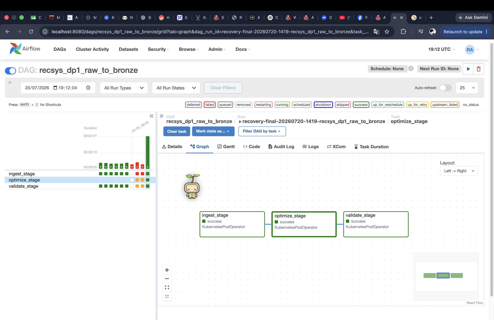
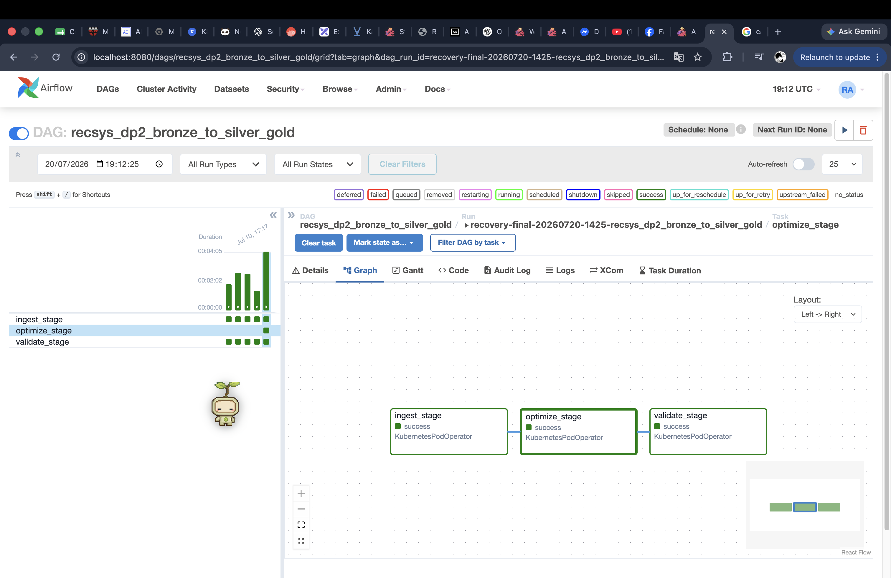
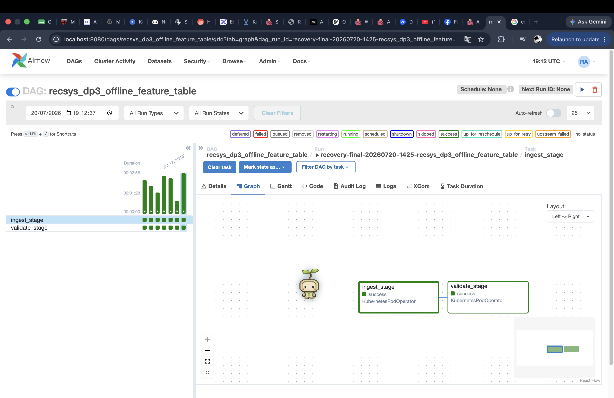

# Data Pipeline Orchestration

This document covers the complete Airflow surface and the step-by-step execution of DP1, DP2, and DP3. DP1 and DP2 place lakehouse optimization inside the governed data-product run; DP3 remains a two-stage feature pipeline.

## Airflow Surface

Six operational DAGs are deployed, one DAG per Python source file: [DP1](../../../apps/data-platform/src/orchestration/airflow/dags/recsys_dp1_raw_to_bronze.py), [DP2](../../../apps/data-platform/src/orchestration/airflow/dags/recsys_dp2_bronze_to_silver_gold.py), [DP3](../../../apps/data-platform/src/orchestration/airflow/dags/recsys_dp3_offline_feature_table.py), [Feast materialization](../../../apps/data-platform/src/orchestration/airflow/dags/recsys_feast_materialize.py), [drift/retrain](../../../apps/data-platform/src/orchestration/airflow/dags/recsys_feature_drift_monitoring.py), and [analytics](../../../apps/analytics/orchestration/airflow/dags/recsys_analytics_daily.py).

| Purpose | DAG ID | Default schedule | Ordered stages |
|---|---|---|---|
| DP1 | `recsys_dp1_raw_to_bronze` | manual | `ingest_stage -> optimize_stage -> validate_stage` |
| DP2 | `recsys_dp2_bronze_to_silver_gold` | manual | `ingest_stage -> optimize_stage -> validate_stage` |
| DP3 | `recsys_dp3_offline_feature_table` | manual | `ingest_stage -> validate_stage` |
| Feast materialization | `recsys_feast_materialize` | every two hours | materialize incremental -> validate Redis |
| Drift and conditional retraining | `recsys_feature_drift_monitoring` | daily | drift report -> metrics -> Kubeflow retrain trigger |
| Analytics and Superset marts | `recsys_analytics_daily` | daily | sync Silver -> build dbt Gold marts |

The obsolete composite `k8s_data_platform_dag` DAG ID, duplicate `recsys_batch_feature_pipeline`, raw-ingestion wrappers, and standalone `recsys_lakehouse_maintenance` DAG are not part of the Airflow surface. The two former multi-DAG source files have also been removed so Airflow discovery and Jenkins change detection operate at DAG-file granularity.

Code references:

- Shared schedule and pod helpers: [spark_utils.py](../../../apps/data-platform/src/orchestration/airflow/spark_utils.py).
- DP1, DP2, and DP3 DAG definitions: [recsys_dp1_raw_to_bronze.py](../../../apps/data-platform/src/orchestration/airflow/dags/recsys_dp1_raw_to_bronze.py), [recsys_dp2_bronze_to_silver_gold.py](../../../apps/data-platform/src/orchestration/airflow/dags/recsys_dp2_bronze_to_silver_gold.py), and [recsys_dp3_offline_feature_table.py](../../../apps/data-platform/src/orchestration/airflow/dags/recsys_dp3_offline_feature_table.py).
- Feast materialization and drift/retrain DAG definitions: [recsys_feast_materialize.py](../../../apps/data-platform/src/orchestration/airflow/dags/recsys_feast_materialize.py) and [recsys_feature_drift_monitoring.py](../../../apps/data-platform/src/orchestration/airflow/dags/recsys_feature_drift_monitoring.py).
- Analytics DAG definition and Silver-to-dbt dependency: [recsys_analytics_daily.py](../../../apps/analytics/orchestration/airflow/dags/recsys_analytics_daily.py).

## Kubernetes Execution Model

`pod_task()` creates a `KubernetesPodOperator` in `recsys-dataflow`. Every task receives the shared ConfigMap and Secret, runs with `set -euo pipefail`, disables the Istio sidecar for finite batch work, streams logs to Airflow, selects the configured node pool, and deletes its pod after completion. The helper also converts canonical Dataset URNs into DataHub plugin `Urn` objects for declared `inlets` and `outlets`. See [spark_utils.py](../../../apps/data-platform/src/orchestration/airflow/spark_utils.py).

`spark_native_submit()` submits Spark applications in Kubernetes cluster mode and forwards the lakehouse catalogs, object-store credentials, validation settings, resource limits, shuffle sizing, and dynamic-allocation settings to the driver and executors. It propagates `RUNTIME_LINEAGE_ENABLED=false`; task success/failure and declared table lineage are emitted once by the DataHub Airflow listener. `spark.kubernetes.submission.waitAppCompletion=true` prevents Airflow from marking a task successful before its Spark application finishes.

The Airflow image pins `acryl-datahub-airflow-plugin==1.6.0` for Airflow `2.9.3`. Scheduler and webserver share the REST connection, `cluster=PROD`, execution capture, DataJob lineage, and iolet materialization settings; extractors and the plugin's OpenLineage bridge are disabled. See the [DataHub Airflow plugin documentation](https://docs.datahub.com/docs/metadata-ingestion-modules/airflow-plugin).

## DP1: Data Generator To Bronze Iceberg

### Airflow Stage Order

```text
Data Generator
  -> ingest_stage
  -> recsys.lakehouse.bronze_* Iceberg tables
  -> optimize_stage
  -> validate_stage
```

The generator's Parquet fragments exist only inside the DP1 task pod. They are an ephemeral exchange format, not a persistent governed zone. The first persistent DP1 datasets are the ten Bronze Iceberg tables.

### Step 1: Ingest Stage

`DP1_INGEST_COMMAND` performs two operations in one Airflow task:

1. Run the historical generator with `$DATA_GENERATOR_CONFIG`.
2. Start Spark locally in the same pod and load that run through `batch_lakehouse_ingestion.py`.
3. Read all ten generated tables with Parquet schema merge enabled.
4. Add `source_run_id` and `lakehouse_ingestion_ts`.
5. Create the Iceberg namespace when necessary.
6. atomically create or replace `recsys.lakehouse.bronze_<source_table>`.
7. Commit the ten Bronze Iceberg tables; the DAG already declares those canonical URNs as task outlets.

References: [recsys_dp1_raw_to_bronze.py](../../../apps/data-platform/src/orchestration/airflow/dags/recsys_dp1_raw_to_bronze.py#L13), [batch_lakehouse_ingestion.py (line 69)](../../../apps/data-platform/src/ingest/batch_lakehouse_ingestion.py#L69), [line 87](../../../apps/data-platform/src/ingest/batch_lakehouse_ingestion.py#L87), and [line 97](../../../apps/data-platform/src/ingest/batch_lakehouse_ingestion.py#L97).

### Step 2: Optimize Stage

`DP1_OPTIMIZE_COMMAND` runs `optimize.py --scope bronze --pipeline DP1`. All ten Bronze tables receive compaction, target-file sizing, Zstandard compression, hash write distribution, manifest maintenance, and optional Z-order clustering. Missing tables fail the governed run because `--skip-missing` is not used.

References: [recsys_dp1_raw_to_bronze.py](../../../apps/data-platform/src/orchestration/airflow/dags/recsys_dp1_raw_to_bronze.py#L29), [optimize.py (line 34)](../../../apps/data-platform/src/lakehouse/optimize.py#L34), and [line 130](../../../apps/data-platform/src/lakehouse/optimize.py#L130).

### Step 3: Validate Stage

The validator reads every Bronze table through the Spark Iceberg catalog and requires a positive row count, all source primary-key/audit columns, and no nulls in those required fields. It publishes the DP1 governance report and records `optimize_stage` as its upstream job.

References: [recsys_dp1_raw_to_bronze.py](../../../apps/data-platform/src/orchestration/airflow/dags/recsys_dp1_raw_to_bronze.py#L39), [governance_contracts.py (line 102)](../../../apps/data-platform/src/validate/governance_contracts.py#L102), and [line 121](../../../apps/data-platform/src/validate/governance_contracts.py#L121).

### Airflow DAG And Image Proof

The DAG creates all three tasks and enforces their order in [recsys_dp1_raw_to_bronze.py](../../../apps/data-platform/src/orchestration/airflow/dags/recsys_dp1_raw_to_bronze.py#L46).



**Figure: DP1 Airflow orchestration proof.** The successful Graph run shows the current `ingest_stage -> optimize_stage -> validate_stage` dependency for `recsys_dp1_raw_to_bronze`; all three tasks are green.

## DP2: Bronze Iceberg To Silver Iceberg

### Airflow Stage Order

```text
Bronze Iceberg
  -> Spark ingest_stage
  -> Silver Iceberg
  -> optimize_stage
  -> Spark validate_stage
```

### Step 1: Ingest Stage

1. Submit `dp2_silver_gold_entrypoint.py --action ingest` through Spark on Kubernetes.
2. Read all ten DP1 tables through `catalog.bronze_table()` and the Iceberg catalog.
3. Normalize timestamps and compatible schema-evolution columns.
4. Separate unsupported schema versions.
5. Deduplicate supported behavior events by `event_id`.
6. Build clean events/impressions/requests, order facts, product SCD, users, products, and preferences.
7. Commit eight curated `silver_*` Iceberg tables; the DAG declares them as task outlets.

References: [recsys_dp2_bronze_to_silver_gold.py](../../../apps/data-platform/src/orchestration/airflow/dags/recsys_dp2_bronze_to_silver_gold.py#L13), [dp2_silver_gold_entrypoint.py (line 15)](../../../apps/data-platform/src/features/spark/dp2_silver_gold_entrypoint.py#L15), and [build_silver_tables.py (line 28)](../../../apps/data-platform/src/features/spark/build_silver_tables.py#L28).

### Step 2: Optimize Stage

`DP2_OPTIMIZE_COMMAND` runs the shared optimizer with `--scope silver --pipeline DP2`. All eight Silver tables receive the same physical-file policy as DP1; clean behavior events and impressions also have optional user/item/time Z-order profiles.

References: [recsys_dp2_bronze_to_silver_gold.py](../../../apps/data-platform/src/orchestration/airflow/dags/recsys_dp2_bronze_to_silver_gold.py#L19), [optimize.py (line 24)](../../../apps/data-platform/src/lakehouse/optimize.py#L24), and [line 38](../../../apps/data-platform/src/lakehouse/optimize.py#L38).

### Step 3: Validate Stage

The validation action opens all persisted Silver tables, requires normal outputs to be non-empty, permits only `silver_rejected_behavior_events` to be empty, verifies required event columns, and requires `duplicate_event_id = 0` for `silver_clean_behavior_events`.

References: [recsys_dp2_bronze_to_silver_gold.py](../../../apps/data-platform/src/orchestration/airflow/dags/recsys_dp2_bronze_to_silver_gold.py#L29) and [dp2_silver_gold_entrypoint.py (line 29)](../../../apps/data-platform/src/features/spark/dp2_silver_gold_entrypoint.py#L29).

### Airflow DAG And Image Proof

The DAG creates all three tasks and enforces their order in [recsys_dp2_bronze_to_silver_gold.py](../../../apps/data-platform/src/orchestration/airflow/dags/recsys_dp2_bronze_to_silver_gold.py#L36).



**Figure: DP2 Airflow orchestration proof.** The successful Graph run shows `ingest_stage -> optimize_stage -> validate_stage` for `recsys_dp2_bronze_to_silver_gold`; all three tasks are green.

## DP3: Feature Tables And Feast Offline Store

### Airflow Stage Order

```text
Silver Iceberg
  -> Spark ingest_stage
  -> Iceberg feature/training tables
  -> PostgreSQL Feast offline tables
  -> validate_stage
```

### Step 1: Ingest Stage

1. Submit `dp3_offline_feature_entrypoint.py` through Spark on Kubernetes.
2. Read the existing DP2 `silver_*` Iceberg tables; DP3 does not rebuild Silver.
3. Compute user-sequence, user-aggregate, item, ranking-label, and training outputs.
4. Commit the Iceberg feature tables.
5. Export the four Feast source tables to PostgreSQL.

References:
[`recsys_dp3_offline_feature_table.py`](../../../apps/data-platform/src/orchestration/airflow/dags/recsys_dp3_offline_feature_table.py#L14)
and
[`dp3_offline_feature_entrypoint.py`](../../../apps/data-platform/src/features/spark/dp3_offline_feature_entrypoint.py#L159).

### Step 2: Validate Stage

The PostgreSQL validator checks table existence, the configured schema, positive row counts, required entity/timestamp columns, and non-null key/timestamp values. It merges these observations with the Iceberg checks emitted during ingestion.

References: [recsys_dp3_offline_feature_table.py](../../../apps/data-platform/src/orchestration/airflow/dags/recsys_dp3_offline_feature_table.py#L19) and [governance_contracts.py (line 148)](../../../apps/data-platform/src/validate/governance_contracts.py#L148).

### Airflow DAG And Image Proof

The DAG and dependency are defined in [recsys_dp3_offline_feature_table.py](../../../apps/data-platform/src/orchestration/airflow/dags/recsys_dp3_offline_feature_table.py#L24).



**Figure: DP3 Airflow orchestration proof.** The successful Graph run shows `ingest_stage -> validate_stage` for `recsys_dp3_offline_feature_table`; both tasks are green.

## End-To-End Ordering

The data dependency order is:

```text
DP1 success -> DP2 success -> DP3 success -> feature-store verification
```

Production deployment deliberately does not trigger this workflow. Jenkins
deploys and verifies registrations/resources only; it never starts Airflow
DAGs, Spark jobs, or synthetic events. Operators trigger the data products
manually or let their configured schedules run. The CI/CD verification contract
is documented in [`jenkins/README.md`](../../../jenkins/README.md).

## Run And Check Airflow

```bash
# List the six deployed DAGs.
kubectl exec -n recsys-dataflow deploy/airflow-webserver -- airflow dags list

# Trigger one data product manually.
kubectl exec -n recsys-dataflow deploy/airflow-webserver -- \
  airflow dags trigger recsys_dp1_raw_to_bronze

# Inspect recent runs and task state.
kubectl exec -n recsys-dataflow deploy/airflow-webserver -- \
  airflow dags list-runs -d recsys_dp1_raw_to_bronze
```

Task logs are streamed by `KubernetesPodOperator`; Spark tasks additionally wait for and report the cluster-mode application result.

## Failure Behavior

- Generator or Bronze commit failure stops DP1 before optimization.
- Missing tables or a failed Iceberg rewrite stop DP1/DP2 before validation.
- A contract failure writes its governance report, exits non-zero, and fails the validation task.
- Operators must preserve `DP1 -> DP2 -> DP3 -> materialize`; deployment
  verification does not execute production data workflows.
- `catchup=False` and `max_active_runs=1` prevent backfill storms and overlapping runs of the same DAG.
- Spark completion waiting prevents a submitted-but-failed driver from being reported as an Airflow success.
