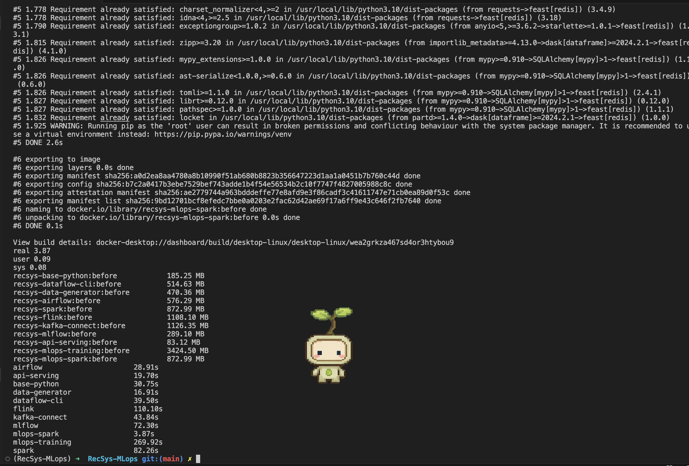
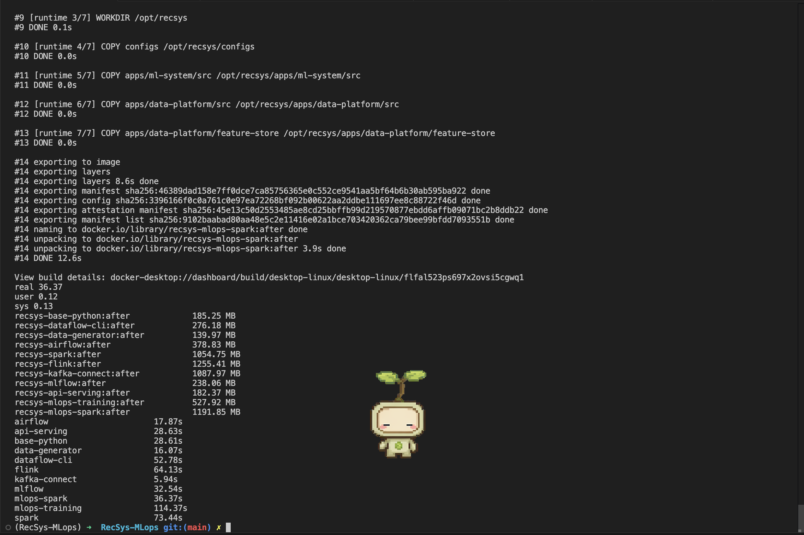

# Docker And Docker Compose

This document covers the rubric rows:

- Docker and Docker Compose are used.
- Dockerfiles are optimized.
- Image-size/optimization proof is documented.

## Runtime Layout

Docker Compose is the local data-platform runtime. GCP proof builds use Cloud Build so image build does not depend on local Docker.

Runtime orchestration references:

- [docker-compose.dataflow.yml (line 44)](../../../infra/docker/docker-compose.dataflow.yml#L44), [docker-compose.dataflow.yml (line 371)](../../../infra/docker/docker-compose.dataflow.yml#L371): local data-platform Compose services and build mappings.
- [recsys-images.yaml (line 1)](../../../infra/cloudbuild/recsys-images.yaml#L1), [recsys-images.yaml (line 176)](../../../infra/cloudbuild/recsys-images.yaml#L176): GCP Cloud Build image pipeline.

### Shared Base

| Image | Purpose | Dockerfile |
|---|---|---|
| `recsys-base-python` | Shared slim Python base image | [Dockerfile.base-python (line 1)](../../../infra/docker/Dockerfile.base-python#L1), [Dockerfile.base-python (line 19)](../../../infra/docker/Dockerfile.base-python#L19) |

### Data Platform

| Image / component | Purpose | Dockerfile |
|---|---|---|
| `recsys-dataflow-cli` | Data pipeline CLI, Feast materialization, and drift jobs | [Dockerfile.dataflow-cli (line 1)](../../../apps/data-platform/Dockerfile.dataflow-cli#L1), [Dockerfile.dataflow-cli (line 49)](../../../apps/data-platform/Dockerfile.dataflow-cli#L49) |
| `recsys-data-generator` | Synthetic source-data generation | [Dockerfile (line 1)](../../../apps/data-platform/data-generator/Dockerfile#L1), [Dockerfile (line 27)](../../../apps/data-platform/data-generator/Dockerfile#L27) |
| `recsys-airflow` | Data-pipeline orchestration with the Airflow scheduler and webserver | [Dockerfile.airflow (line 1)](../../../infra/docker/Dockerfile.airflow#L1), [Dockerfile.airflow (line 34)](../../../infra/docker/Dockerfile.airflow#L34) |
| `recsys-spark` | Batch processing with Spark, Iceberg, and Hudi | [Dockerfile.spark (line 1)](../../../apps/data-platform/Dockerfile.spark#L1), [Dockerfile.spark (line 50)](../../../apps/data-platform/Dockerfile.spark#L50) |
| `recsys-flink` | Streaming from Kafka to the PostgreSQL offline store and Redis online store | [Dockerfile.flink (line 1)](../../../apps/data-platform/Dockerfile.flink#L1), [Dockerfile.flink (line 94)](../../../apps/data-platform/Dockerfile.flink#L94) |
| `recsys-kafka-connect` | Debezium CDC from PostgreSQL into Kafka | [Dockerfile.kafka-connect (line 1)](../../../infra/docker/Dockerfile.kafka-connect#L1), [Dockerfile.kafka-connect (line 23)](../../../infra/docker/Dockerfile.kafka-connect#L23) |

### ML/MLOps

| Image / component | Purpose | Dockerfile |
|---|---|---|
| `recsys-mlflow` | Experiment tracking and model registry | [Dockerfile.mlflow (line 1)](../../../infra/docker/Dockerfile.mlflow#L1), [Dockerfile.mlflow (line 30)](../../../infra/docker/Dockerfile.mlflow#L30) |
| `recsys-api-serving` | Online model inference and recommendation API | [Dockerfile (line 1)](../../../apps/api-serving/Dockerfile#L1), [Dockerfile (line 46)](../../../apps/api-serving/Dockerfile#L46) |
| `recsys-mlops-training` | Model training and Kubeflow pipeline runtime | [Dockerfile.training (line 1)](../../../apps/ml-system/Dockerfile.training#L1), [Dockerfile.training (line 61)](../../../apps/ml-system/Dockerfile.training#L61) |
| `recsys-mlops-spark` | ML jobs running on the shared Spark image | [Dockerfile.spark (line 1)](../../../apps/ml-system/Dockerfile.spark#L1), [Dockerfile.spark (line 40)](../../../apps/ml-system/Dockerfile.spark#L40) |

## Optimization Notes

The Dockerfile optimization follows the Docker Build Cloud guidance from <https://docs.docker.com/build-cloud/optimization/>:

- Multi-stage builds: build dependency/tooling layers in a separate stage, then copy only runtime artifacts into the final stage.
- Multi-threaded tools: enable tool-level parallelism where the tool does not use multiple cores by default.

| Image | Optimization used | Why it reduces image/runtime cost |
|---|---|---|
| `recsys-base-python` | `python:3.11-slim`, `--no-install-recommends`, removes `/var/lib/apt/lists` | Avoids full Debian/Python image and removes apt metadata. |
| `recsys-dataflow-cli` | Multi-stage build: dependency stage uses shared `recsys-base-python`; final stage is `python:3.11-slim` with only venv, configs, data-platform source, feature repo, data generator, Docker scripts, Debezium connector config. `uv` uses `UV_CONCURRENT_DOWNLOADS=8` and `UV_CONCURRENT_BUILDS=8`. | Keeps build tools and dependency resolver out of the final runtime image, avoids copying the full repository, and parallelizes dependency resolution/build work. |
| `recsys-data-generator` | Multi-stage build with `uv` concurrency; final image copies only venv, configs, and data-generator source. | Removes build-only base tooling from the final image and avoids shipping unrelated repo files. |
| `recsys-spark` | Multi-stage JAR downloader; Spark/Iceberg/Hudi/S3 JARs are fetched in parallel with `xargs -P ${DOWNLOAD_JOBS}` and copied into the final Spark runtime. Final stage copies only runtime source folders. | Parallel remote downloads reduce build latency; selective copy avoids docs/tests/artifacts in the runtime layer. |
| `recsys-flink` | Multi-stage JAR downloader; Flink Kafka/Iceberg/Hadoop/S3 JARs are fetched in parallel with `xargs -P ${DOWNLOAD_JOBS}` and copied into the final Flink runtime. Final stage copies only runtime source folders. | Parallel remote downloads reduce build latency; final image keeps only Flink runtime files and required project code. |
| `recsys-kafka-connect` | Multi-stage connector installer; the Debezium connector is installed into a plugin stage with bounded shell background jobs controlled by `CONNECTOR_INSTALL_JOBS`, and only `/usr/share/confluent-hub-components` is copied into the final Kafka Connect runtime. | Keeps connector installation work out of the final runtime stage and supports parallel connector installation without adding the removed S3 sink plugin. |
| `recsys-airflow` | Multi-stage Airflow dependency image; final Airflow image copies only `/home/airflow/.local` provider packages and DAG/runtime folders. | Avoids copying the full repository into the scheduler/webserver image while preserving Airflow provider dependencies. |
| `recsys-api-serving` | Multi-stage Python venv build with `uv` concurrency; final `python:3.11-slim` image copies only venv, API source, Feast repo, and feature-store module. | Keeps dependency build tooling out of serving runtime and narrows the serving attack surface. |
| `recsys-mlflow` | Multi-stage Python venv build with `uv` concurrency; final `python:3.11-slim` image copies only the MLflow venv. | Removes dependency resolver tooling from the final tracking image while parallelizing Python package download/build work. |
| `recsys-mlops-training` | Multi-stage Python venv build with `uv` concurrency; final `python:3.11-slim` image copies venv plus ML source, data-platform source, configs, Kubeflow package, and feature repo. | Removes base image build tooling from the final training image and avoids full-repo copy. |
| `recsys-mlops-spark` | Multi-stage Python venv build on top of `recsys-spark`; `uv` concurrency installs ML Spark dependencies, Feast, PostgreSQL client/pool packages, and the MinIO/S3 client in a dependency stage, then the final Spark runtime copies only the venv and ML/data source folders. | Keeps ML-specific Python dependency installation separate from the final runtime and avoids copying docs/tests/artifacts. |

## Before/After Measurement

Use these commands to capture the proof before and after Dockerfile optimization. They keep stable `:before` and `:after` tags, record build latency from `/usr/bin/time -p`, and record image size from `docker image inspect`.

Run these commands from the repository root. Use `set -eo pipefail` instead of `set -euo pipefail` because interactive zsh/VS Code prompts may reference unset prompt variables such as `RPROMPT`.

Run this shared helper in the same terminal session before the before/after command blocks:

```bash
mkdir -p .docker-metrics

measure_build() {
  image="$1"
  logfile="$2"
  shift 2
  /usr/bin/time -p docker build --no-cache -t "$image" "$@" . 2>&1 | tee "$logfile"
}

write_image_sizes() {
  output_path="$1"
  shift
  : > "$output_path"
  for image in "$@"; do
    size_bytes="$(docker image inspect "$image" --format '{{.Size}}')"
    awk -v image="$image" -v size_bytes="$size_bytes" \
      'BEGIN { printf "%-36s %.2f MB\n", image, size_bytes / 1024 / 1024 }' \
      | tee -a "$output_path"
  done
}

write_build_latency() {
  output_path="$1"
  shift
  : > "$output_path"
  for logfile in "$@"; do
    image="$(basename "$logfile" -build.log)"
    latency="$(awk '/^real / {print $2 "s"}' "$logfile" | tail -1)"
    printf "%-28s %s\n" "$image" "$latency" | tee -a "$output_path"
  done
}
```

Run this before applying the Dockerfile optimization. This block uses the historical Dockerfile snapshots in `dockerfiles-before-optimization/` so the `:before` images are a real baseline even when the active repo Dockerfiles are already optimized:

```bash
set -eo pipefail
mkdir -p .docker-metrics/before

measure_build recsys-base-python:before .docker-metrics/before/base-python-build.log \
  -f 'docs/submission/rubic-(mini-coursework)/dockerfiles-before-optimization/Dockerfile.base-python.before'
measure_build recsys-dataflow-cli:before .docker-metrics/before/dataflow-cli-build.log \
  --build-arg RECSYS_BASE_IMAGE=recsys-base-python:before \
  -f 'docs/submission/rubic-(mini-coursework)/dockerfiles-before-optimization/Dockerfile.dataflow-cli.before'
measure_build recsys-data-generator:before .docker-metrics/before/data-generator-build.log \
  --build-arg RECSYS_BASE_IMAGE=recsys-base-python:before \
  -f 'docs/submission/rubic-(mini-coursework)/dockerfiles-before-optimization/Dockerfile.data-generator.before'
measure_build recsys-airflow:before .docker-metrics/before/airflow-build.log \
  -f 'docs/submission/rubic-(mini-coursework)/dockerfiles-before-optimization/Dockerfile.airflow.before'
measure_build recsys-spark:before .docker-metrics/before/spark-build.log \
  -f 'docs/submission/rubic-(mini-coursework)/dockerfiles-before-optimization/Dockerfile.spark.before'
measure_build recsys-flink:before .docker-metrics/before/flink-build.log \
  -f 'docs/submission/rubic-(mini-coursework)/dockerfiles-before-optimization/Dockerfile.flink.before'
measure_build recsys-kafka-connect:before .docker-metrics/before/kafka-connect-build.log \
  -f 'docs/submission/rubic-(mini-coursework)/dockerfiles-before-optimization/Dockerfile.kafka-connect.before'
measure_build recsys-mlflow:before .docker-metrics/before/mlflow-build.log \
  -f 'docs/submission/rubic-(mini-coursework)/dockerfiles-before-optimization/Dockerfile.mlflow.before'
measure_build recsys-api-serving:before .docker-metrics/before/api-serving-build.log \
  -f 'docs/submission/rubic-(mini-coursework)/dockerfiles-before-optimization/Dockerfile.api-serving.before'
measure_build recsys-mlops-training:before .docker-metrics/before/mlops-training-build.log \
  --build-arg RECSYS_BASE_IMAGE=recsys-base-python:before \
  -f 'docs/submission/rubic-(mini-coursework)/dockerfiles-before-optimization/Dockerfile.mlops-training.before'
measure_build recsys-mlops-spark:before .docker-metrics/before/mlops-spark-build.log \
  --build-arg RECSYS_SPARK_BASE_IMAGE=recsys-spark:before \
  -f 'docs/submission/rubic-(mini-coursework)/dockerfiles-before-optimization/Dockerfile.mlops-spark.before'

write_image_sizes .docker-metrics/before/image-size.txt \
  recsys-base-python:before \
  recsys-dataflow-cli:before \
  recsys-data-generator:before \
  recsys-airflow:before \
  recsys-spark:before \
  recsys-flink:before \
  recsys-kafka-connect:before \
  recsys-mlflow:before \
  recsys-api-serving:before \
  recsys-mlops-training:before \
  recsys-mlops-spark:before

write_build_latency .docker-metrics/before/build-latency.txt .docker-metrics/before/*-build.log
```

Run this after applying the Dockerfile optimization:

```bash
set -eo pipefail
mkdir -p .docker-metrics/after

measure_build recsys-base-python:after .docker-metrics/after/base-python-build.log \
  -f infra/docker/Dockerfile.base-python
measure_build recsys-dataflow-cli:after .docker-metrics/after/dataflow-cli-build.log \
  --build-arg RECSYS_BASE_IMAGE=recsys-base-python:after \
  -f apps/data-platform/Dockerfile.dataflow-cli
measure_build recsys-data-generator:after .docker-metrics/after/data-generator-build.log \
  --build-arg RECSYS_BASE_IMAGE=recsys-base-python:after \
  -f apps/data-platform/data-generator/Dockerfile
measure_build recsys-airflow:after .docker-metrics/after/airflow-build.log \
  -f infra/docker/Dockerfile.airflow
measure_build recsys-spark:after .docker-metrics/after/spark-build.log \
  --build-arg DOWNLOAD_JOBS=4 \
  -f apps/data-platform/Dockerfile.spark
measure_build recsys-flink:after .docker-metrics/after/flink-build.log \
  --build-arg DOWNLOAD_JOBS=4 \
  -f apps/data-platform/Dockerfile.flink
measure_build recsys-kafka-connect:after .docker-metrics/after/kafka-connect-build.log \
  --build-arg CONNECTOR_INSTALL_JOBS=2 \
  -f infra/docker/Dockerfile.kafka-connect
measure_build recsys-mlflow:after .docker-metrics/after/mlflow-build.log \
  -f infra/docker/Dockerfile.mlflow
measure_build recsys-api-serving:after .docker-metrics/after/api-serving-build.log \
  -f apps/api-serving/Dockerfile
measure_build recsys-mlops-training:after .docker-metrics/after/mlops-training-build.log \
  --build-arg RECSYS_BASE_IMAGE=recsys-base-python:after \
  -f apps/ml-system/Dockerfile.training
measure_build recsys-mlops-spark:after .docker-metrics/after/mlops-spark-build.log \
  --build-arg RECSYS_SPARK_BASE_IMAGE=recsys-spark:after \
  -f apps/ml-system/Dockerfile.spark

write_image_sizes .docker-metrics/after/image-size.txt \
  recsys-base-python:after \
  recsys-dataflow-cli:after \
  recsys-data-generator:after \
  recsys-airflow:after \
  recsys-spark:after \
  recsys-flink:after \
  recsys-kafka-connect:after \
  recsys-mlflow:after \
  recsys-api-serving:after \
  recsys-mlops-training:after \
  recsys-mlops-spark:after

write_build_latency .docker-metrics/after/build-latency.txt .docker-metrics/after/*-build.log
```

Generate the before/after proof summary:

```bash
set -eo pipefail

{
  echo "## Before Optimization"
  echo
  echo "### Build latency"
  sed 's/^/- /' .docker-metrics/before/build-latency.txt
  echo
  echo "### Image size"
  sed 's/^/- /' .docker-metrics/before/image-size.txt
  echo
  echo "## After Optimization"
  echo
  echo "### Build latency"
  sed 's/^/- /' .docker-metrics/after/build-latency.txt
  echo
  echo "### Image size"
  sed 's/^/- /' .docker-metrics/after/image-size.txt
} | tee .docker-metrics/docker-optimization-proof.md
```

After running the summary command, capture the terminal output as screenshots and save them to these paths for the submission:





Measured results from `.docker-metrics/`:

| Image | Before build latency (`real`) | After build latency (`real`) | Latency result | Before size | After size | Size result | Optimization responsible |
|---|---:|---:|---:|---:|---:|---:|---|
| `recsys-dataflow-cli` | 39.50s | 52.78s | 13.28s slower (33.6%) | 514.63 MB | 276.18 MB | 238.45 MB smaller (46.3%) | Multi-stage venv + selective runtime copy + `uv` concurrency |
| `recsys-data-generator` | 16.91s | 16.07s | 0.84s faster (5.0%) | 470.36 MB | 139.97 MB | 330.39 MB smaller (70.2%) | Multi-stage venv + selective runtime copy + `uv` concurrency |
| `recsys-airflow` | 28.91s | 17.87s | 11.04s faster (38.2%) | 576.29 MB | 378.83 MB | 197.46 MB smaller (34.3%) | Multi-stage provider install + selective DAG/runtime copy |
| `recsys-spark` | 82.26s | 73.44s | 8.82s faster (10.7%) | 872.99 MB | 1054.75 MB | 181.76 MB larger (20.8%) | Multi-stage parallel JAR download + selective runtime copy |
| `recsys-flink` | 110.10s | 64.13s | 45.97s faster (41.8%) | 1108.10 MB | 1255.41 MB | 147.31 MB larger (13.3%) | Multi-stage parallel JAR download + selective runtime copy |
| `recsys-kafka-connect` | 43.84s | 5.94s | 37.90s faster (86.5%) | 1126.35 MB | 1087.97 MB | 38.38 MB smaller (3.4%) | Multi-stage connector install + bounded parallel connector installer |
| `recsys-api-serving` | 19.70s | 28.63s | 8.93s slower (45.3%) | 83.12 MB | 182.37 MB | 99.25 MB larger (119.4%) | Multi-stage venv + API-only runtime copy + `uv` concurrency |
| `recsys-mlflow` | 72.30s | 32.54s | 39.76s faster (55.0%) | 289.10 MB | 238.06 MB | 51.04 MB smaller (17.7%) | Multi-stage venv + `uv` concurrency |
| `recsys-mlops-training` | 269.92s | 114.37s | 155.55s faster (57.6%) | 3424.50 MB | 527.92 MB | 2896.58 MB smaller (84.6%) | Multi-stage venv + ML/runtime-only copy + `uv` concurrency |
| `recsys-mlops-spark` | 3.87s | 36.37s | 32.50s slower (839.8%) | 872.99 MB | 1191.85 MB | 318.86 MB larger (36.5%) | Multi-stage Spark venv + Feast/Postgres client and pool deps + MinIO/S3 client + ML/runtime-only copy + `uv` concurrency |

## Optimization Result Analysis

Across the ten runtime images measured in the table, total no-cache build latency fell from 687.31s to 442.14s. That is a 245.17s reduction, or 35.7% faster overall. The largest latency wins came from `recsys-mlops-training` (155.55s faster), `recsys-flink` (45.97s faster), `recsys-mlflow` (39.76s faster), and `recsys-kafka-connect` (37.90s faster). These are the images where multi-stage builds and tool-level parallelism removed the most repeated dependency/build work.

Total image size fell from 9338.43 MB to 6333.31 MB, a reduction of 3005.12 MB, or 32.2% smaller overall. The largest image-size reduction was `recsys-mlops-training`, which dropped from 3424.50 MB to 527.92 MB (2896.58 MB smaller, 84.6%). The next biggest reductions were `recsys-data-generator` (330.39 MB smaller, 70.2%), `recsys-dataflow-cli` (238.45 MB smaller, 46.3%), and `recsys-airflow` (197.46 MB smaller, 34.3%).

Not every individual image became smaller or faster. `recsys-spark` and `recsys-flink` became larger because the optimized runtime now includes the required lakehouse, object-store, and streaming JARs in a reproducible runtime layer instead of relying on ad hoc runtime resolution. `recsys-api-serving` and `recsys-mlops-spark` also became larger because the final images now include the full runtime dependencies needed in GCP/Kubeflow, including Feast, PostgreSQL client/pool packages, and MinIO/S3 client support. Those are intentional reliability trade-offs: the optimized image set is smaller overall, while the larger images are the ones that carry additional production runtime dependencies.
