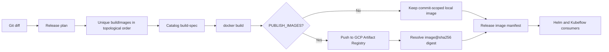
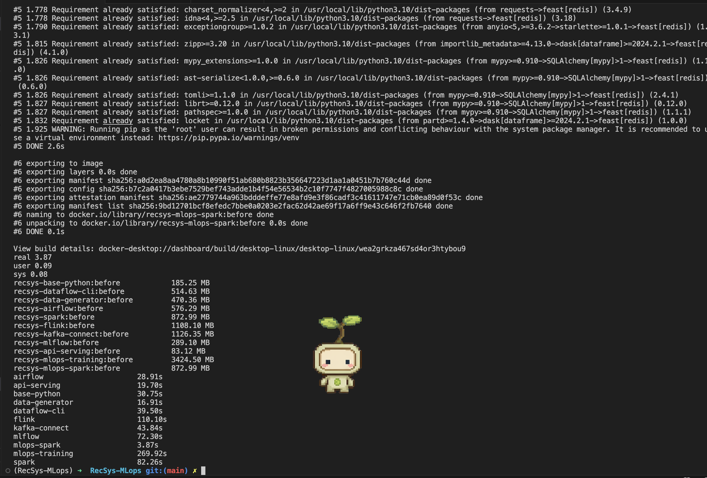
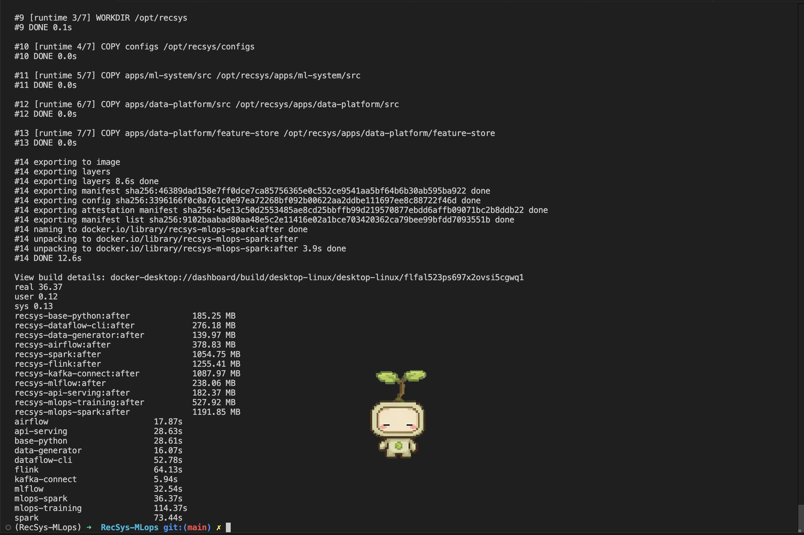

# Docker Image Architecture

This document covers the mini-coursework evidence for:

- using Docker to package the RecSys platform;
- organizing and optimizing Dockerfiles;
- validating, building, scanning and publishing images reproducibly; and
- measuring image size and clean-build latency.

The current repository is **production-only**. Docker Compose, Minikube and the
old local runtime have been retired. Docker produces immutable application
images; Jenkins publishes them to GCP Artifact Registry, and Helm deploys them
to GKE.

## Current Runtime Contract

The runtime contract has four rules:

1. [`images/catalog.json`](../../../images/catalog.json) is the single source of
   truth for image names, Dockerfile locations, build context and internal image
   dependencies.
2. The catalog contains exactly **15 images** and exactly one Spark image:
   `recsys-spark`.
3. Every production Dockerfile is located below `images/`; a Dockerfile outside
   that tree fails the repository layout contract.
4. Production workloads use immutable
   `registry/image@sha256:<digest>` references, not mutable `:local` tags.

The JSON schema fixes the catalog at 15 entries, requires Dockerfile paths to
match `images/**/Dockerfile`, requires repository-root build context, and
defines the dependency `image` plus `buildArg` contract
([catalog schema](../../../images/catalog.schema.json#L1-L55)).

The Python validator additionally rejects:

- a catalog version other than 1;
- either retired Spark image name;
- missing Dockerfiles or contexts;
- unknown dependencies;
- duplicate build arguments;
- dependency cycles; and
- images that are not reachable from at least one Jenkins component.

Code:
[`image_catalog.py`, lines 9-88](../../../jenkins/python/image_catalog.py#L9-L88)
and
[`image_catalog.py`, lines 96-184](../../../jenkins/python/image_catalog.py#L96-L184).

## Why Docker Compose Is Not Used

Docker Compose previously represented the local platform. That architecture was
removed because production deployment is split into independently owned Helm
releases and Jenkins is the only CI/CD implementation.

The current contract test requires these runtime roots to be absent:

```text
infra/docker
infra/k8s
infra/kubeflow
infra/cloudbuild
configs/local
```

It also compares every runtime Dockerfile in the repository with the catalog,
so adding an unregistered Dockerfile fails CI
([repository layout contract](../../../tests/contract/test_repository_layout_contracts.py#L44-L63)).

Therefore:

- Docker remains the application packaging and build mechanism.
- Helm/Kubernetes is the runtime orchestration mechanism.
- Docker Compose is historical evidence only and is not a supported execution
  path.

## 15-Image Catalog

### Shared base

| Image | Responsibility | Dockerfile |
| --- | --- | --- |
| `recsys-base-python` | Shared Python 3.11 build/dependency base used by selected Python images | [`images/base/recsys-base-python/Dockerfile`](../../../images/base/recsys-base-python/Dockerfile) |

### Data platform

| Image | Responsibility | Dockerfile |
| --- | --- | --- |
| `recsys-data-ingestion` | Synthetic generator, source ingestion and lakehouse ingestion runtime | [`images/data/recsys-data-ingestion/Dockerfile`](../../../images/data/recsys-data-ingestion/Dockerfile) |
| `recsys-feature-store` | Feast repository, SQL registry, offline/online feature-store operations | [`images/data/recsys-feature-store/Dockerfile`](../../../images/data/recsys-feature-store/Dockerfile) |
| `recsys-drift-retrain` | Drift reporting and Kubeflow retraining trigger runtime | [`images/data/recsys-drift-retrain/Dockerfile`](../../../images/data/recsys-drift-retrain/Dockerfile) |
| `recsys-spark` | Unified data-platform, ML-system and analytics Spark runtime | [`images/data/recsys-spark/Dockerfile`](../../../images/data/recsys-spark/Dockerfile) |
| `recsys-flink` | Continuous Kafka-to-offline-store and Kafka-to-online-store processing | [`images/data/recsys-flink/Dockerfile`](../../../images/data/recsys-flink/Dockerfile) |
| `recsys-airflow` | Airflow scheduler/webserver plus data and analytics DAGs | [`images/data/recsys-airflow/Dockerfile`](../../../images/data/recsys-airflow/Dockerfile) |
| `recsys-kafka-connect` | Kafka Connect worker with verified Debezium PostgreSQL CDC plugin | [`images/data/recsys-kafka-connect/Dockerfile`](../../../images/data/recsys-kafka-connect/Dockerfile) |

### ML platform

| Image | Responsibility | Dockerfile |
| --- | --- | --- |
| `recsys-mlops-training` | Kubeflow components, Ray Train/Tune, evaluation and model promotion | [`images/ml/recsys-mlops-training/Dockerfile`](../../../images/ml/recsys-mlops-training/Dockerfile) |
| `recsys-mlflow` | MLflow experiment tracking and model registry server | [`images/ml/recsys-mlflow/Dockerfile`](../../../images/ml/recsys-mlflow/Dockerfile) |

### Serving

| Image | Responsibility | Dockerfile |
| --- | --- | --- |
| `recsys-api-serving` | Recommendation API, online feature API and Triton client | [`images/serving/recsys-api-serving/Dockerfile`](../../../images/serving/recsys-api-serving/Dockerfile) |

### Demo application

| Image | Responsibility | Dockerfile |
| --- | --- | --- |
| `recsys-demo-api` | Demo backend API | [`images/demo/recsys-demo-api/Dockerfile`](../../../images/demo/recsys-demo-api/Dockerfile) |
| `recsys-demo-web` | Compiled frontend served by unprivileged Nginx | [`images/demo/recsys-demo-web/Dockerfile`](../../../images/demo/recsys-demo-web/Dockerfile) |

### Analytics

| Image | Responsibility | Dockerfile |
| --- | --- | --- |
| `recsys-analytics-dbt` | dbt transformations through Trino | [`images/analytics/recsys-analytics-dbt/Dockerfile`](../../../images/analytics/recsys-analytics-dbt/Dockerfile) |
| `recsys-analytics-superset` | Superset BI runtime and dashboard bootstrap | [`images/analytics/recsys-analytics-superset/Dockerfile`](../../../images/analytics/recsys-analytics-superset/Dockerfile) |

The exact names and paths above are machine-readable in
[`catalog.json`, lines 1-100](../../../images/catalog.json#L1-L100).

## Internal Image Dependencies

Only images that genuinely consume the shared build base declare an internal
dependency:

```text
recsys-base-python
├── recsys-data-ingestion
├── recsys-feature-store
├── recsys-drift-retrain
└── recsys-mlops-training
```

For example, the catalog edge:

```json
{
  "image": "recsys-base-python",
  "buildArg": "RECSYS_BASE_IMAGE"
}
```

means Jenkins must build `recsys-base-python:<commit>` before the consumer and
pass:

```text
--build-arg RECSYS_BASE_IMAGE=recsys-base-python:<commit>
```

The catalog CLI exposes the resolved order and arguments:

```bash
python3 jenkins/python/image_catalog.py validate
python3 jenkins/python/image_catalog.py dependencies recsys-data-ingestion
python3 jenkins/python/image_catalog.py build-args \
  recsys-data-ingestion \
  --tag "$(git rev-parse HEAD)"
python3 jenkins/python/image_catalog.py build-spec \
  recsys-data-ingestion \
  --tag "$(git rev-parse HEAD)"
```

Implementation:
[`image_catalog.py`, lines 115-158](../../../jenkins/python/image_catalog.py#L115-L158)
and
[`image_catalog.py`, lines 187-226](../../../jenkins/python/image_catalog.py#L187-L226).

## Unified `recsys-spark`

`recsys-spark` replaces separate data, ML and analytics Spark variants. Spark
jobs differ primarily by command and configuration, so one tested runtime
eliminates dependency drift and guarantees that all domains execute against the
same Spark/JAR/Python closure.

The image uses three stages:

1. `jar-downloader` downloads in parallel:
   - Iceberg Spark runtime;
   - Hudi Spark 3.5 bundle;
   - Hadoop AWS;
   - AWS SDK bundle; and
   - PostgreSQL JDBC.
2. `python-deps` exports the locked ML and data dependency closure, installs a
   CPU-only PyTorch wheel, and verifies the environment with `uv pip check`.
3. `runtime` copies only the JARs, virtual environment, configs and required
   data/ML/analytics source trees.

Runtime variables force both PySpark driver and executors to use
`/opt/venv/bin/python`, while `PYTHONPATH` exposes all three domains
([unified Spark Dockerfile](../../../images/data/recsys-spark/Dockerfile#L1-L115)).

The post-build smoke test verifies:

- data ingestion and DP2/DP3 imports;
- ML preparation, training and Hudi savepoint imports;
- analytics `sync_silver` imports;
- CPU-only PyTorch and absence of CUDA/NVIDIA packages;
- Spark 3.5.8;
- absence of duplicate PyPI `pyspark` and Ray;
- all five required JARs;
- the standardized DP2, DP3, generator and BST configs; and
- `/opt/venv` as both PySpark Python executables.

Code:
[`unified_spark_image.sh`, lines 4-74](../../../jenkins/scripts/test/unified_spark_image.sh#L4-L74).
The catalog contract also asserts that there are 15 images and only one Spark
image
([catalog tests](../../../tests/unit/jenkins/test_image_catalog.py#L27-L43)).

The accepted trade-off is that the unified image is larger than a domain-only
Spark image. The benefit is one build, one scan baseline, one digest and one
runtime dependency closure across data processing, ML preparation and
analytics.

## Dockerfile Optimization

The implementation follows Docker's official guidance for
[multi-stage builds](https://docs.docker.com/build/building/multi-stage/),
[build contexts and `.dockerignore`](https://docs.docker.com/build/concepts/context/),
and
[image build best practices](https://docs.docker.com/build/building/best-practices/).

### 1. Build dependencies do not automatically enter runtime images

Twelve of the fifteen Dockerfiles use multiple stages. Typical Python images
create `/opt/venv` in `deps`, then copy that environment into a fresh slim
runtime image. Spark/Flink download or resolve JARs in dedicated stages.
Kafka Connect extracts the Debezium plugin in Alpine before copying only the
plugin directory into the worker.

Examples:

- [`recsys-feature-store`](../../../images/data/recsys-feature-store/Dockerfile#L1-L59)
- [`recsys-spark`](../../../images/data/recsys-spark/Dockerfile#L1-L115)
- [`recsys-flink`](../../../images/data/recsys-flink/Dockerfile#L1-L104)
- [`recsys-kafka-connect`](../../../images/data/recsys-kafka-connect/Dockerfile#L1-L29)
- [`recsys-api-serving`](../../../images/serving/recsys-api-serving/Dockerfile#L1-L35)
- [`recsys-demo-web`](../../../images/demo/recsys-demo-web/Dockerfile#L1-L15)

### 2. Dependency inputs are reproducible

- Every direct Python requirement written in a Dockerfile uses an exact
  `package==version` specifier. A catalog unit test parses every `pip install`
  and `uv pip install` command and rejects a floating requirement.
- Project-based Python images run `uv sync --frozen` or `uv export --frozen`
  against checked-in lock files. Data ingestion, drift, feature store, Spark,
  MLflow and training also install against an exported lock constraint, so
  their transitive closure cannot silently move.
- Airflow is pinned to 2.9.3/Python 3.10 and installs against the matching
  official constraints file.
- Spark, Flink, Kafka Connect, Debezium, Superset, Nginx and other major runtime
  versions are explicit.
- The Debezium plugin archive is checked against a pinned SHA-256 value before
  extraction.
- `npm ci` builds the frontend from `package-lock.json`.

This makes a changed lock/version/checksum an explicit source change rather than
an invisible runtime mutation. The enforcement test is
[`test_dockerfile_python_dependencies_are_exactly_pinned`](../../../tests/unit/jenkins/test_image_catalog.py).

### 3. Runtime content is selective

Dockerfiles copy the virtual environment and only the source/config directories
needed by that workload. They do not use `COPY . .`.

The common root context remains necessary because images combine code from
multiple monorepo domains. [`.dockerignore`](../../../.dockerignore#L1-L46)
prevents Git history, virtual environments, caches, bytecode, reports,
`node_modules`, notebook data, generated lake data and artifacts from being sent
to the builder.

### 4. Package-manager residue is removed

Runtime stages use `--no-install-recommends`, remove apt metadata and disable
Python package caches. Several final Python images also remove the system
`pip`/build tooling after the prepared virtual environment is copied.

### 5. Parallel work is bounded

- Python dependency stages use `UV_CONCURRENT_DOWNLOADS=8` and
  `UV_CONCURRENT_BUILDS=8`.
- Spark downloads independent JARs with `xargs -P "${DOWNLOAD_JOBS}"`.
- Flink separates Maven dependency resolution from bounded parallel downloads.

These settings reduce clean-build latency without introducing multiple
different runtime images.

### 6. Non-root execution is used where supported

Airflow runs as `airflow`, Flink as `flink`, Kafka Connect as `appuser`,
Superset as `superset`, the demo backend as UID/GID `10001`, and the frontend as
unprivileged Nginx UID `101`.

Some framework images still require root-owned runtime preparation. Those are
handled through Kubernetes security configuration; this document does not
claim that every image is rootless.

## Jenkins Build and Publish Flow


```mermaid
flowchart LR
    A["Git diff"] --> B["Release plan"]
    B --> C["Unique buildImages in topological order"]
    C --> D["Catalog build-spec"]
    D --> E["docker build"]
    E --> G{"PUBLISH_IMAGES?"}
    G -- "No" --> H["Keep commit-scoped local image"]
    G -- "Yes" --> I["Push to GCP Artifact Registry"]
    I --> J["Resolve image@sha256 digest"]
    H --> K["Release image manifest"]
    J --> K
    K --> L["Helm and Kubeflow consumers"]
```

Jenkins does not run a separate recursive build function per component:

1. The release plan provides one unique, topologically ordered `buildImages`
   list.
2. `release_build_publish.sh` loops through that list once.
3. The engine asks the catalog for Dockerfile, context and internal build args.
4. Each image runs build, optional push and manifest recording once.
5. If Spark was built, its unified smoke test runs once.

Code:
[`release_build_publish.sh`, lines 17-42](../../../jenkins/scripts/entrypoints/release_build_publish.sh#L17-L42)
and
[`engine.sh`, lines 96-162](../../../jenkins/scripts/build/engine.sh#L96-L162).

Production publishing requires:

- the configured GCP Artifact Registry;
- a full 40-character Git commit tag;
- successful registry permission/login checks; and
- an immutable digest resolved after push.

Code:
[`build runtime`, lines 3-42](../../../jenkins/scripts/build/runtime.sh#L3-L42)
and
[`Jenkinsfile`, lines 140-175](../../../Jenkinsfile#L140-L175).

Tags provide build traceability, while the deployment manifest stores the
immutable digest. Docker documents that pulling by digest selects one exact
image version:
[Docker image pull by digest](https://docs.docker.com/reference/cli/docker/image/pull/#pull-an-image-by-digest-immutable-identifier).

## Validation and Proof Commands

Run all commands from the repository root.

### Fast catalog and layout validation

```bash
make validate

uv run pytest \
  tests/unit/jenkins/test_image_catalog.py \
  tests/contract/test_repository_layout_contracts.py \
  tests/contract/test_docker_dataflow_contracts.py \
  -q
```

These tests prove the 15-image count, one-Spark invariant, dependency order,
build-once behavior, Dockerfile ownership, unified Spark capabilities, and
catalog policy.

### Build one standalone image

```bash
commit="$(git rev-parse HEAD)"

/usr/bin/time -p docker build \
  --pull \
  --no-cache \
  --platform linux/amd64 \
  -f images/data/recsys-spark/Dockerfile \
  -t "recsys-spark:${commit}" \
  .

bash jenkins/scripts/test/unified_spark_image.sh "recsys-spark:${commit}"

docker image inspect "recsys-spark:${commit}" \
  --format 'size_bytes={{.Size}} layers={{len .RootFS.Layers}}'
```

### Build a catalog image with an internal base

```bash
commit="$(git rev-parse HEAD)"

docker build \
  --platform linux/amd64 \
  -f images/base/recsys-base-python/Dockerfile \
  -t "recsys-base-python:${commit}" \
  .

docker build \
  --platform linux/amd64 \
  --build-arg "RECSYS_BASE_IMAGE=recsys-base-python:${commit}" \
  -f images/data/recsys-feature-store/Dockerfile \
  -t "recsys-feature-store:${commit}" \
  .

docker image inspect \
  "recsys-base-python:${commit}" \
  "recsys-feature-store:${commit}" \
  --format '{{.RepoTags}} {{.Size}}'
```

### Full 15-image build-parity proof without publishing

This is intentionally expensive. It uses the same release builder as Jenkins,
scans every image and runs the unified Spark smoke test, but does not push:

```bash
set -eo pipefail

commit="$(git rev-parse HEAD)"
components="$(
  python3 jenkins/python/configuration.py components-tsv \
    | cut -f2 \
    | paste -sd, -
)"

python3 jenkins/python/release_plan.py create \
  --components "${components}" \
  --commit "${commit}" \
  --output /tmp/recsys-full-image-plan.json

IMAGE_PUSH_REGISTRY=registry.example.invalid/recsys \
IMAGE_TAG="${commit}" \
PUBLISH_IMAGES=0 \
REQUIRE_GCP_ARTIFACT_REGISTRY=0 \
jenkins/scripts/entrypoints/release_build_publish.sh \
  /tmp/recsys-full-image-plan.json
```

Record the current size of every built image:

```bash
mkdir -p .docker-metrics/current
commit="$(git rev-parse HEAD)"

{
  printf '%-36s %14s %12s\n' IMAGE SIZE_BYTES SIZE_MIB
  python3 jenkins/python/release_plan.py plan-images \
    --plan /tmp/recsys-full-image-plan.json \
    | while IFS= read -r image; do
        bytes="$(docker image inspect "${image}:${commit}" --format '{{.Size}}')"
        mib="$(awk -v value="${bytes}" 'BEGIN {printf "%.2f", value/1024/1024}')"
        printf '%-36s %14s %12s\n' "${image}" "${bytes}" "${mib}"
      done
} | tee .docker-metrics/current/image-sizes.txt
```

Docker's `image inspect` command is the source for the byte measurement:
[Docker image inspect reference](https://docs.docker.com/reference/cli/docker/image/inspect/).

## How to Interpret Optimization Evidence

Compare measurements only when these inputs are identical:

- source commit;
- build platform;
- Docker/BuildKit version;
- `--pull` and `--no-cache` settings;
- network/registry location; and
- image capability set.

Do not claim that a larger image is automatically worse. For example,
`recsys-spark` intentionally includes the data, ML and analytics dependency
closure and five production JARs. The valid comparison is:

1. total catalog size and build time;
2. number of separately maintained images;
3. runtime capabilities present;
4. vulnerability results; and
5. whether one immutable digest is reused consistently.

The files under
[`dockerfiles-before-optimization/`](dockerfiles-before-optimization/)
and the existing `.docker-metrics/` output are historical coursework evidence
from the pre-catalog architecture. They must not be presented as a current
15-image benchmark because the image names and capability boundaries changed
during the production-only refactor.



**Figure: historical pre-optimization measurement.** This screenshot belongs to
the archived image layout and is retained only as before-refactor evidence.



**Figure: historical post-optimization measurement.** This result predates the
15-image catalog and unified Spark refactor; use the current proof commands
above for present-day measurements.

## Evidence Checklist

For the final submission, capture:

- `make validate` passing;
- the catalog showing exactly 15 image IDs;
- a full plan showing each image once and `recsys-spark` once;
- Jenkins `[BUILD] Build image N/M` markers;
- unified Spark smoke-test success;
- Artifact Registry commit tag and SHA-256 digest;
- `.ci-image-manifest/release-plan.env`; and
- Helm/Kubeflow values using the same immutable digest produced by the build.

Suggested screenshot filenames:

```text
docs/pngs/docker_catalog_validation_proof.png
docs/pngs/docker_build_publish_proof.png
docs/pngs/docker_artifact_registry_digest_proof.png
docs/pngs/docker_unified_spark_smoke_proof.png
```

## Authoritative Code Reference

| Responsibility | Code |
| --- | --- |
| Image catalog | [`images/catalog.json`](../../../images/catalog.json) |
| Catalog schema | [`images/catalog.schema.json`](../../../images/catalog.schema.json) |
| Catalog validation/query CLI | [`jenkins/python/image_catalog.py`](../../../jenkins/python/image_catalog.py) |
| Release image ordering | [`jenkins/python/release_plan.py`](../../../jenkins/python/release_plan.py) |
| Build-once loop | [`release_build_publish.sh`](../../../jenkins/scripts/entrypoints/release_build_publish.sh) |
| Build, push and digest recording | [`engine.sh`](../../../jenkins/scripts/build/engine.sh) |
| Image manifest | [`image_manifest.sh`](../../../jenkins/scripts/lib/image_manifest.sh) |
| Unified Spark smoke test | [`unified_spark_image.sh`](../../../jenkins/scripts/test/unified_spark_image.sh) |
| Build context exclusions | [`.dockerignore`](../../../.dockerignore) |
| No-legacy/runtime layout contracts | [`test_repository_layout_contracts.py`](../../../tests/contract/test_repository_layout_contracts.py) |
