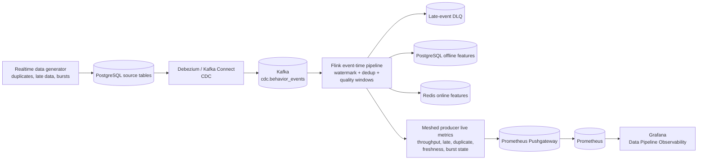
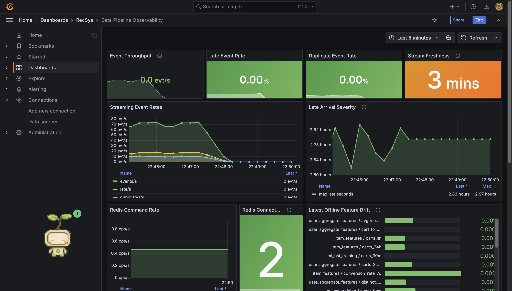
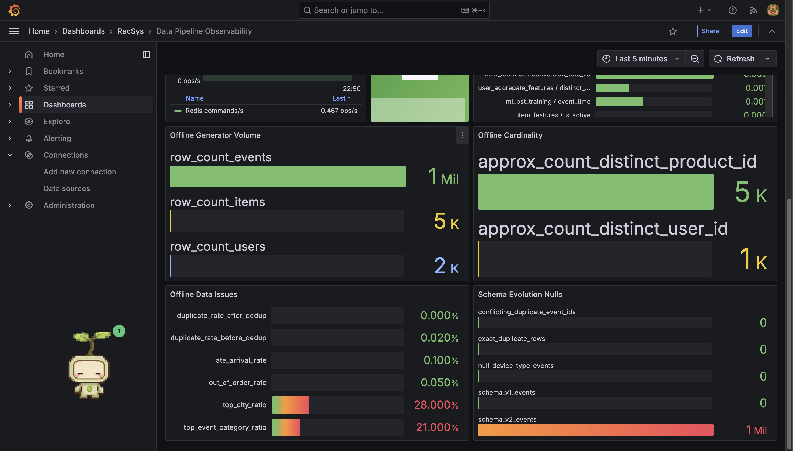
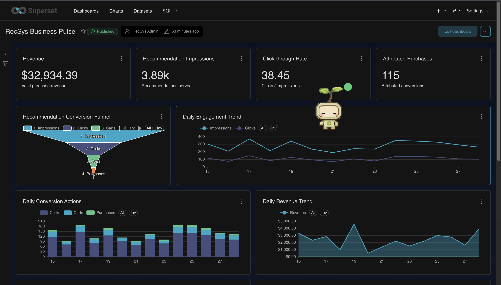
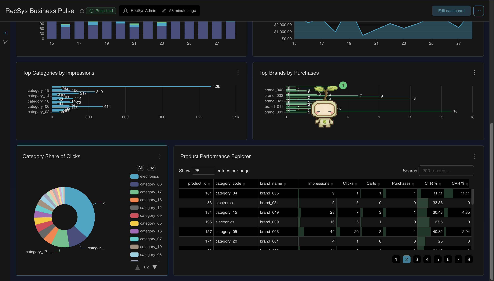

```mermaid
flowchart LR
    SILVER[("Operational Silver Iceberg<br/>Hadoop catalog")]
    SYNC["Spark analytics sync<br/>isolated catalog boundary"]
    STAGING[("Analytics staging Iceberg<br/>JDBC REST-like shared catalog")]
    DBT["dbt Core on Trino<br/>staging → intermediate → marts<br/>tests + contracts"]
    CORE[("Gold core<br/>dimensions + facts")]
    MARTS[("Gold recsys marts<br/>funnel + product + A/B")]
    SUPERSET["Superset semantic datasets<br/>read-only Gold access"]
    DASH["RecSys Business Pulse<br/>12 charts"]
    AIRFLOW["Airflow daily DAG"]
    DATAHUB["DataHub lineage"]
    GIT["GitHub push or merge"]
    JENKINS["Jenkins shared pipeline<br/>RecSys-GitHub-CICD"]
    DETECT{"Detect changed components<br/>RUN_ANALYTICS=true"}
    CI["Analytics CI<br/>unit + contract tests<br/>Helm lint and render"]
    BUILD["Build and publish<br/>Spark + dbt + Superset<br/>and Airflow images"]
    REGISTRY[("GCP Artifact Registry")]
    DEPLOY["Deploy on main<br/>Helm upgrade data-platform<br/>and recsys-analytics"]
    VIEW["Jenkins proof view<br/>10 Analytics And BI<br/>FORCE_COMPONENTS=analytics"]

    SILVER --> SYNC --> STAGING --> DBT
    DBT --> CORE
    DBT --> MARTS
    CORE --> SUPERSET
    MARTS --> SUPERSET --> DASH
    AIRFLOW -. orchestrates .-> SYNC
    AIRFLOW -. orchestrates .-> DBT
    SYNC -. runtime lineage .-> DATAHUB

    GIT --> JENKINS --> DETECT
    DETECT -->|"analytics paths changed"| CI
    CI --> BUILD --> REGISTRY --> DEPLOY
    VIEW -. reuses the same Jenkinsfile .-> CI
    DEPLOY -. rolls out .-> AIRFLOW
    DEPLOY -. rolls out .-> DBT
    DEPLOY -. rolls out .-> SUPERSET
```

# Novel ideas

## 1. Monitor data issues on Grafana (Data Platform dashboard)

The first novel idea is to treat data quality as a live production signal rather than a batch-only
validation report. The realtime generator deliberately produces duplicates, late arrivals,
and periodic bursts. Flink evaluates those events with
event-time windows and exports counters and freshness gauges. Prometheus scrapes the live Flink
metrics and Grafana turns them into an operational Data Platform dashboard.

This gives the platform team one place to answer three questions: **Is data still arriving? Is it
fresh? Is its quality changing?** The dashboard also relates quality problems to downstream Redis
and PostgreSQL/Redis feature-store writes, so an operator can distinguish a source-data problem from a sink
or processing problem.

### Mermaid workflow

### Code reference

| Focus | Code reference |
| --- | --- |
| Source issue injection | [problem_pipeline.py (line 23)](../../../apps/data-platform/data-generator/src/streaming/problem_pipeline.py#L23), [producer.py (line 34)](../../../apps/data-platform/data-generator/src/streaming/producer.py#L34) — burst, late-arrival, and duplicate classes plus the runtime loop. |
| Event-time quality metrics | [realtime_stream_job.py (line 80)](../../../apps/data-platform/src/features/flink/realtime_stream_job.py#L80), [realtime_stream_job.py (line 155)](../../../apps/data-platform/src/features/flink/realtime_stream_job.py#L155), [realtime_stream_job.py (line 896)](../../../apps/data-platform/src/features/flink/realtime_stream_job.py#L896), [realtime_stream_job.py (line 1018)](../../../apps/data-platform/src/features/flink/realtime_stream_job.py#L1018) — quality windows, freshness, and structured reconciliation output. |
| Metric publication | [pushgateway.py (line 12)](../../../apps/data-platform/src/monitoring/pushgateway.py#L12), [pushgateway.py (line 55)](../../../apps/data-platform/src/monitoring/pushgateway.py#L55), [prometheus.yaml (line 49)](../../../infra/helm/recsys-observability/templates/prometheus.yaml#L49), [prometheus.yaml (line 55)](../../../infra/helm/recsys-observability/templates/prometheus.yaml#L55) — publish and scrape runtime signals. |
| Dashboard | [data-pipeline-observability.json (line 1)](../../../infra/helm/recsys-observability/dashboards/data-pipeline-observability.json#L1), [data-pipeline-observability.json (line 151)](../../../infra/helm/recsys-observability/dashboards/data-pipeline-observability.json#L151) — PromQL and panels for data quality and sink health. |
| Regression contract | [test_observability_contracts.py (line 156)](../../../tests/contract/test_observability_contracts.py#L156), [test_observability_contracts.py (line 188)](../../../tests/contract/test_observability_contracts.py#L188) — verifies live queries are not replaced by constant demo series. |

### Image proof

**Figure 1 — Live streaming observability.** The five-minute view correlates event throughput with
late and duplicate events, stream freshness, late-arrival severity, Redis command rate, connected
clients, and offline drift scores.

> **Note:** The right edge drops to zero because the five-minute generator run had already stopped
> when this screenshot was taken. The earlier non-zero segment (including burst variation) is the
> intended proof of real traffic; the orange freshness value shows how quickly the dashboard makes a
> stopped or stale source visible.

**Figure 2 — Offline quality and volume evidence.** This continuation of the same dashboard shows
generated row volume and cardinality together with exact-duplicate, skew, and schema-evolution indicators.

> **Note:** The panels distinguish defects deliberately injected before processing from the cleaned
> result after deduplication. A zero post-deduplication value is therefore evidence of the correction,
> while the non-zero source-side issue rates prove that the quality checks received problematic data.

### Note (for image)

- Open Grafana with `kubectl port-forward -n observability svc/recsys-grafana 3000:3000`, then select **RecSys / Data Pipeline Observability**.
- The screenshots use the **Last 5 minutes** range and were captured after a controlled five-minute
  producer run with `40 events/tick`, `14%` duplicate probability, `28%` late-arrival probability,
  and an `8x` burst every fifth tick.
- The proof window is **2026-07-12 22:41:14–22:46:46 (Asia/Ho_Chi_Minh)**. Use this absolute range
  if the historical run needs to be inspected again after the live series expires.
- A nearly horizontal line is valid only when the measured rate is stable. The proof should still show movement or spikes around burst ticks; a permanently constant value across unrelated panels is not sufficient evidence.

## 2. Data analytics for the data platform

The second novel idea adds a separate BI analytics plane without exposing operational Silver tables
directly to business users. Spark snapshots curated Silver data into an isolated JDBC-backed
Iceberg catalog. dbt on Trino then builds tested dimensions, facts, and recommendation marts.
Superset receives read-only access to the `core` and `recsys` Gold schemas and publishes the
**RecSys Business Pulse** dashboard.

The separation keeps ML feature engineering, operational streaming, and BI semantics independent.
Business metrics are version-controlled as dbt models, checked by data tests, orchestrated by
Airflow, queryable through Trino, and reproducibly visualized by an idempotent Superset bootstrap
job. The analytics plane also has its own component-aware CI/CD route: Jenkins detects changes to
the analytics application, tests, or Helm chart; validates and publishes only the affected analytics
images; and upgrades the data-platform and analytics releases automatically after a merge to `main`.

### Mermaid workflow

### Code reference

| Focus | Code reference |
| --- | --- |
| Silver isolation and lineage | [sync_silver.py (line 21)](../../../apps/analytics/src/sync_silver.py#L21), [sync_silver.py (line 127)](../../../apps/analytics/src/sync_silver.py#L127) — snapshots operational Silver into the analytics catalog. |
| Orchestration | [analytics_dag.py (line 19)](../../../apps/analytics/orchestration/airflow/dags/analytics_dag.py#L19), [analytics_dag.py (line 68)](../../../apps/analytics/orchestration/airflow/dags/analytics_dag.py#L68) — orders Silver sync before dbt build/test. |
| Gold semantics and tests | [`models/marts/`](../../../apps/analytics/models/marts), [schema.yml (line 1)](../../../apps/analytics/models/schema.yml#L1), [schema.yml (line 70)](../../../apps/analytics/models/schema.yml#L70) — dimensions, facts, marts, grains, and quality tests. |
| Read-only query boundary | [trino-config.yaml (line 1)](../../../infra/helm/recsys-analytics/templates/trino-config.yaml#L1), [trino-config.yaml (line 58)](../../../infra/helm/recsys-analytics/templates/trino-config.yaml#L58) — shared catalog and restricted Superset access. |
| BI provisioning | [bootstrap_dashboards.py (line 67)](../../../apps/analytics/superset/bootstrap_dashboards.py#L67), [bootstrap_dashboards.py (line 596)](../../../apps/analytics/superset/bootstrap_dashboards.py#L596), [superset-dashboard-bootstrap.yaml (line 1)](../../../infra/helm/recsys-analytics/templates/superset-dashboard-bootstrap.yaml#L1), [superset-dashboard-bootstrap.yaml (line 32)](../../../infra/helm/recsys-analytics/templates/superset-dashboard-bootstrap.yaml#L32) — idempotent datasets, charts, and dashboard deployment. |
| Main-flow change detection | [Jenkinsfile (line 1)](../../../Jenkinsfile#L1), [Jenkinsfile (line 18)](../../../Jenkinsfile#L18), [Jenkinsfile (line 153)](../../../Jenkinsfile#L153), [Jenkinsfile (line 314)](../../../Jenkinsfile#L314), [detect_changed_components.py (line 265)](../../../jenkins/scripts/detect_changed_components.py#L265), [detect_changed_components.py (line 342)](../../../jenkins/scripts/detect_changed_components.py#L342), [detect_changed_components.py (line 386)](../../../jenkins/scripts/detect_changed_components.py#L386), [detect_changed_components.py (line 486)](../../../jenkins/scripts/detect_changed_components.py#L486) — maps analytics application, tests, and Helm changes to `RUN_ANALYTICS=true` and enables component CI, build, and deploy stages. |
| Analytics CI gates | [component_ci.sh (line 209)](../../../jenkins/scripts/component_ci.sh#L209), [component_ci.sh (line 214)](../../../jenkins/scripts/component_ci.sh#L214) — runs analytics unit/contract tests plus Helm lint and template validation. |
| Image build and publish | [component_build_publish.sh (line 189)](../../../jenkins/scripts/component_build_publish.sh#L189), [component_build_publish.sh (line 195)](../../../jenkins/scripts/component_build_publish.sh#L195), [component_build_publish.sh (line 262)](../../../jenkins/scripts/component_build_publish.sh#L262), [component_build_publish.sh (line 263)](../../../jenkins/scripts/component_build_publish.sh#L263) — builds the analytics Spark, dbt, Superset, and shared Airflow images with an immutable commit tag. |
| Deployment | [component_deploy.sh (line 652)](../../../jenkins/scripts/component_deploy.sh#L652), [component_deploy.sh (line 690)](../../../jenkins/scripts/component_deploy.sh#L690) — upgrades the data-platform Airflow runtime and the `recsys-analytics` Helm release, then waits for its workloads. |
| Jenkins analytics view | [jenkins-init-configmap.yaml (line 391)](../../../infra/helm/recsys-ci/templates/jenkins-init-configmap.yaml#L391), [jenkins-init-configmap.yaml (line 470)](../../../infra/helm/recsys-ci/templates/jenkins-init-configmap.yaml#L470) — provisions `RecSys-Analytics-BI-CICD` with `FORCE_COMPONENTS=analytics`. |

### Image proof

**Figure 3 — Business Pulse overview.** The published dashboard summarizes revenue, recommendation
impressions, CTR, and attributed purchases, followed by the conversion funnel and daily engagement,
conversion-action, and revenue trends.

> **Note:** The KPI cards provide the current business outcome, while the time-series charts retain
> the daily context needed to detect whether a change is isolated or sustained. All displayed values
> are queried from tested Gold marts rather than operational Silver tables.

**Figure 4 — Product-performance drill-down.** Category impressions, brand purchases, category click
share, and the product explorer expose the composition behind the headline KPIs, including per-product
impressions, clicks, carts, purchases, CTR, and CVR.

> **Note:** Rankings and the paginated product table make the dashboard useful for BI exploration, not
> only monitoring. Together, Figures 3 and 4 cover all twelve charts backed by the three read-only
> Superset semantic datasets.

### Note (for image)

- Open Superset with `kubectl port-forward -n analytics svc/recsys-analytics-superset 8088:8088`, then browse to `http://localhost:8088/superset/dashboard/recsys-business-pulse/`.
- Figures 3 and 4 are two viewport captures of the same published **RecSys Business Pulse** dashboard:
  the first records KPIs and trends; the second records category, brand, and product-level analysis.
- The production proof has three semantic datasets and twelve charts. Every chart reads only from tested Gold marts through the read-only `superset` Trino user.
- `mart_ab_experiment_daily` can legitimately contain zero rows until real recommendation requests include both `experiment_id` and `variant`; this does not indicate an analytics pipeline failure.
- Analytics delivery is part of the main path-based pipeline, not a duplicated Jenkinsfile. Changes
  under `apps/analytics/`, analytics tests, or `infra/helm/recsys-analytics/` select only the analytics
  component; deployment is gated to `main` unless a manual proof run explicitly enables forced deploy.
- The GKE Jenkins release was upgraded to revision `46` and verified with the live Jenkins API. The
  `10 Analytics And BI` view contains the buildable `RecSys-Analytics-BI-CICD` job, whose default is
  `FORCE_COMPONENTS=analytics`.
