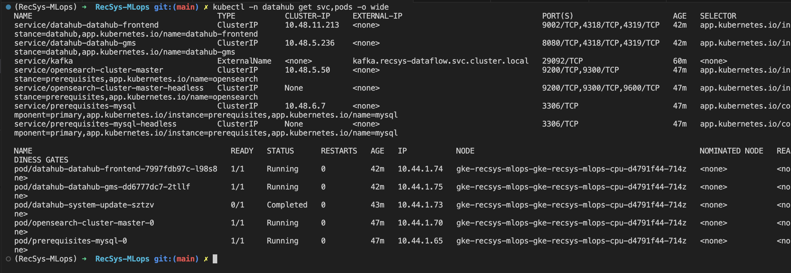
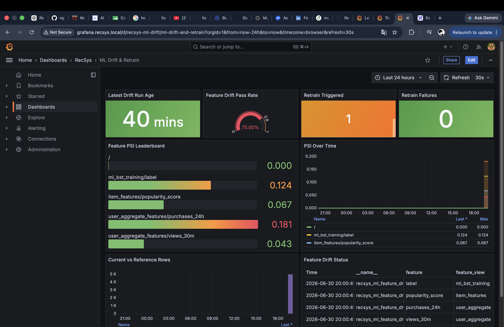

# Novel Ideas

This document covers the two mini-coursework novel-idea rows. Both ideas are implemented and reusable in the final system.

## Idea 1 - DataHub Data Product Governance

Why it is novel for the mini-coursework:

- Instead of only showing tables in a database UI, the project publishes DP1/DP2/DP3 as governed DataHub data products.
- Each product links datasets, Airflow jobs, tags, lineage, and contract metadata.
- Ingest metrics are pushed to PushGateway/Grafana so governance is observable.

Code reference:

- [apps/data-platform/src/metadata/ingest_datahub_governance.py](../../../apps/data-platform/src/metadata/ingest_datahub_governance.py): DataHub ingestion implementation.
- [infra/helm/recsys-observability/dashboards/datahub-governance.json](../../../infra/helm/recsys-observability/dashboards/datahub-governance.json): Grafana dashboard for DataHub ingest/runtime telemetry.
- [apps/data-platform/src/orchestration/airflow/dags/k8s_data_platform_dag.py](../../../apps/data-platform/src/orchestration/airflow/dags/k8s_data_platform_dag.py): `datahub_ingest` task.

Proof command:

```bash
kubectl get pods -n datahub
kubectl port-forward -n datahub svc/datahub-datahub-frontend 9002:9002
```

Image proof:



## Idea 2 - Drift-To-Retrain Control Loop

Why it is novel for the mini-coursework:

- The system does not stop at static data quality checks.
- Airflow periodically runs offline feature drift, pushes PSI metrics to Prometheus/Grafana, then calls Kubeflow retraining trigger logic when drift fails threshold.
- This links data platform telemetry directly to ML retraining.

Code reference:

- [apps/data-platform/src/validate/offline_feature_drift.py](../../../apps/data-platform/src/validate/offline_feature_drift.py): PSI-based offline feature drift analysis and PushGateway metrics.
- [apps/data-platform/src/mlops/trigger_kubeflow_retrain.py](../../../apps/data-platform/src/mlops/trigger_kubeflow_retrain.py): Kubeflow retrain trigger and metrics.
- [apps/data-platform/src/orchestration/airflow/dags/k8s_data_platform_dag.py](../../../apps/data-platform/src/orchestration/airflow/dags/k8s_data_platform_dag.py): `offline_feature_drift -> trigger_kubeflow_retrain` task order.
- [infra/helm/recsys-observability/dashboards/ml-drift-observability.json](../../../infra/helm/recsys-observability/dashboards/ml-drift-observability.json): drift dashboard.

Proof commands:

```bash
kubectl logs -n recsys-dataflow deploy/airflow-scheduler --tail=200 | rg 'offline_feature_drift|trigger_kubeflow_retrain'
kubectl port-forward -n observability svc/grafana 3000:80
```

Image proof:



