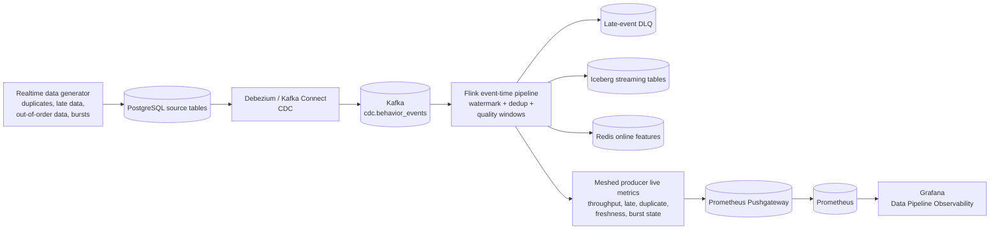
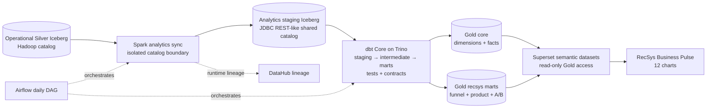

# Novel ideas

## 1. Monitor data issues on Grafana (Data Platform dashboard)

The first novel idea is to treat data quality as a live production signal rather than a batch-only
validation report. The realtime generator deliberately produces duplicates, late arrivals,
out-of-order events, hot-product skew, and periodic bursts. Flink evaluates those events with
event-time windows and exports counters and freshness gauges. Prometheus scrapes the live Flink
metrics and Grafana turns them into an operational Data Platform dashboard.

This gives the platform team one place to answer three questions: **Is data still arriving? Is it
fresh? Is its quality changing?** The dashboard also relates quality problems to downstream Redis
and Iceberg feature-store writes, so an operator can distinguish a source-data problem from a sink
or processing problem.

### Mermaid workflow

### Code reference

| Focus | Code reference |
| --- | --- |
| Source issue injection | [`run_realtime_postgres_producer.py`](../../../apps/data-platform/data-generator/src/scripts/run_realtime_postgres_producer.py) — duplicate, late, out-of-order, and burst controls. |
| Event-time quality metrics | [`realtime_stream_job.py`](../../../apps/data-platform/src/features/flink/realtime_stream_job.py) — quality windows, freshness, and structured reconciliation output. |
| Metric publication | [`pushgateway.py`](../../../apps/data-platform/src/monitoring/pushgateway.py), [`prometheus.yaml`](../../../infra/helm/recsys-observability/templates/prometheus.yaml) — publish and scrape runtime signals. |
| Dashboard | [`data-pipeline-observability.json`](../../../infra/helm/recsys-observability/dashboards/data-pipeline-observability.json) — PromQL and panels for data quality and sink health. |
| Regression contract | [`test_observability_contracts.py`](../../../tests/contract/test_observability_contracts.py) — verifies live queries are not replaced by constant demo series. |

### Image proof

**Figure 1 — Live streaming observability.** The five-minute view correlates event throughput with
late and duplicate events, stream freshness, late-arrival severity, Redis command rate, connected
clients, and offline drift scores.

> **Note:** The right edge drops to zero because the five-minute generator run had already stopped
> when this screenshot was taken. The earlier non-zero segment (including burst variation) is the
> intended proof of real traffic; the orange freshness value shows how quickly the dashboard makes a
> stopped or stale source visible.

**Figure 2 — Offline quality and volume evidence.** This continuation of the same dashboard shows
generated row volume and cardinality together with duplicate, late-arrival, out-of-order, skew, and
schema-evolution indicators.

> **Note:** The panels distinguish defects deliberately injected before processing from the cleaned
> result after deduplication. A zero post-deduplication value is therefore evidence of the correction,
> while the non-zero source-side issue rates prove that the quality checks received problematic data.

### Note (for image)

- Open Grafana with `kubectl port-forward -n observability svc/recsys-grafana 3000:3000`, then select **RecSys / Data Pipeline Observability**.
- The screenshots use the **Last 5 minutes** range and were captured after a controlled five-minute
  producer run with `40 events/tick`, `14%` duplicate probability, `28%` late-arrival probability,
  `10%` out-of-order probability, and an `8x` burst every fifth tick.
- The proof window is **2026-07-12 22:41:14–22:46:46 (Asia/Ho_Chi_Minh)**. Use this absolute range
  if the historical run needs to be inspected again after the live series expires.
- A nearly horizontal line is valid only when the measured rate is stable. The proof should still show movement or spikes around burst ticks; a permanently constant value across unrelated panels is not sufficient evidence.

## 2. Data analytics for the data platform

The second novel idea adds a separate BI analytics plane without exposing operational Silver tables
directly to business users. Spark snapshots curated Silver data into an isolated JDBC-backed
Iceberg catalog. dbt on Trino then builds tested dimensions, facts, and recommendation marts.
Superset receives read-only access to the `core` and `recsys` Gold schemas and publishes the
**RecSys Business Pulse** dashboard.

The separation keeps ML feature engineering, operational streaming, and BI semantics independent.
Business metrics are version-controlled as dbt models, checked by data tests, orchestrated by
Airflow, queryable through Trino, and reproducibly visualized by an idempotent Superset bootstrap
job.

### Mermaid workflow

### Code reference

| Focus | Code reference |
| --- | --- |
| Silver isolation and lineage | [`sync_silver.py`](../../../apps/analytics/src/sync_silver.py) — snapshots operational Silver into the analytics catalog. |
| Orchestration | [`analytics_dag.py`](../../../apps/analytics/orchestration/airflow/dags/analytics_dag.py) — orders Silver sync before dbt build/test. |
| Gold semantics and tests | [`models/marts/`](../../../apps/analytics/models/marts), [`schema.yml`](../../../apps/analytics/models/schema.yml) — dimensions, facts, marts, grains, and quality tests. |
| Read-only query boundary | [`trino-config.yaml`](../../../infra/helm/recsys-analytics/templates/trino-config.yaml) — shared catalog and restricted Superset access. |
| BI provisioning | [`bootstrap_dashboards.py`](../../../apps/analytics/superset/bootstrap_dashboards.py), [`superset-dashboard-bootstrap.yaml`](../../../infra/helm/recsys-analytics/templates/superset-dashboard-bootstrap.yaml) — idempotent datasets, charts, and dashboard deployment. |

### Image proof

**Figure 3 — Business Pulse overview.** The published dashboard summarizes revenue, recommendation
impressions, CTR, and attributed purchases, followed by the conversion funnel and daily engagement,
conversion-action, and revenue trends.

> **Note:** The KPI cards provide the current business outcome, while the time-series charts retain
> the daily context needed to detect whether a change is isolated or sustained. All displayed values
> are queried from tested Gold marts rather than operational Silver tables.

**Figure 4 — Product-performance drill-down.** Category impressions, brand purchases, category click
share, and the product explorer expose the composition behind the headline KPIs, including per-product
impressions, clicks, carts, purchases, CTR, and CVR.

> **Note:** Rankings and the paginated product table make the dashboard useful for BI exploration, not
> only monitoring. Together, Figures 3 and 4 cover all twelve charts backed by the three read-only
> Superset semantic datasets.

### Note (for image)

- Open Superset with `kubectl port-forward -n analytics svc/recsys-analytics-superset 8088:8088`, then browse to `http://localhost:8088/superset/dashboard/recsys-business-pulse/`.
- Figures 3 and 4 are two viewport captures of the same published **RecSys Business Pulse** dashboard:
  the first records KPIs and trends; the second records category, brand, and product-level analysis.
- The production proof has three semantic datasets and twelve charts. Every chart reads only from tested Gold marts through the read-only `superset` Trino user.
- `mart_ab_experiment_daily` can legitimately contain zero rows until real recommendation requests include both `experiment_id` and `variant`; this does not indicate an analytics pipeline failure.
