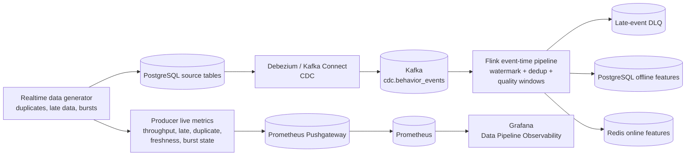
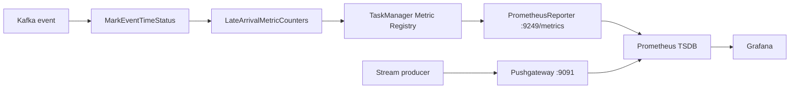
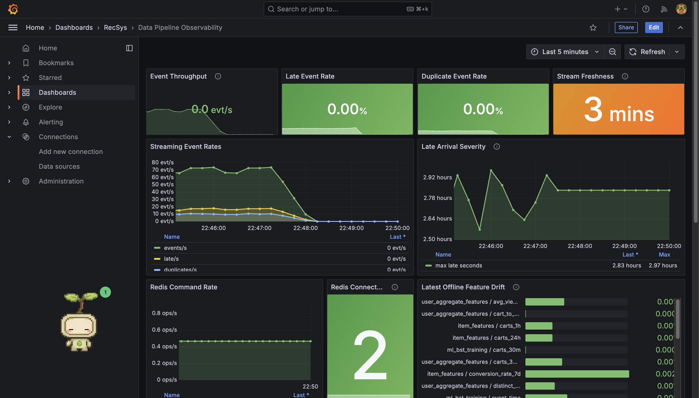
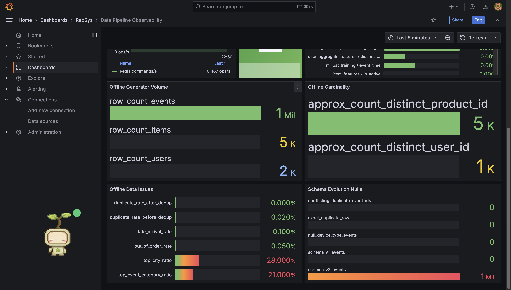
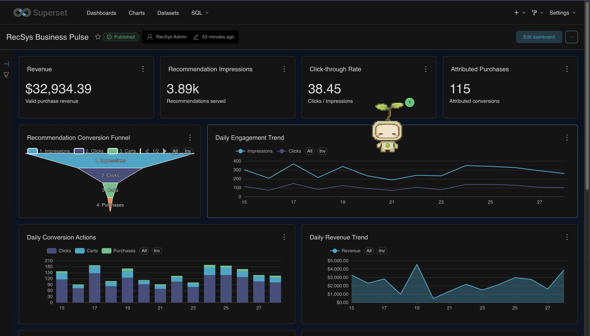
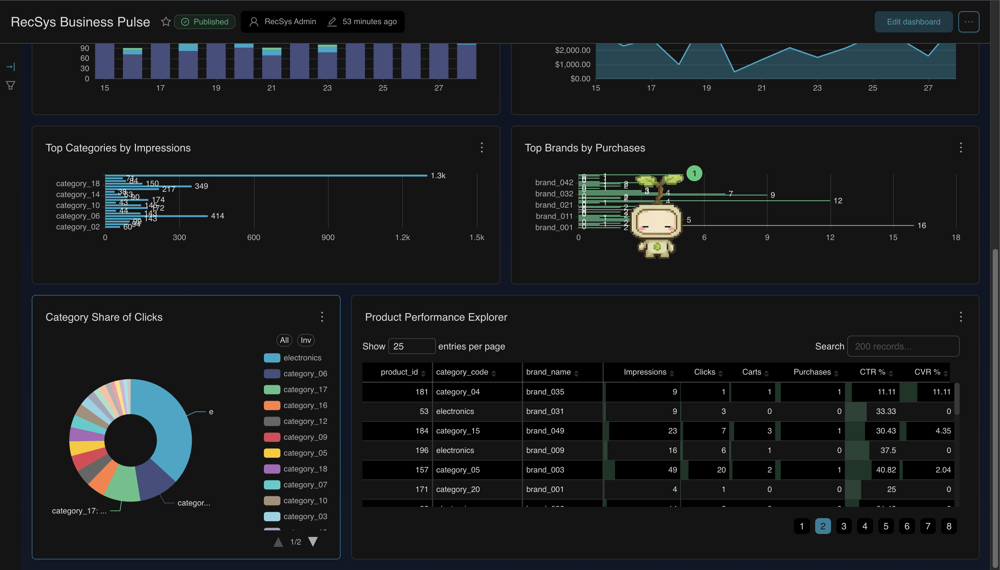

# Novel ideas

## 1. Monitor data issues on Grafana (Data Platform dashboard)

The first novel idea is to treat data quality as a live production signal rather than a batch-only
validation report. The realtime generator deliberately produces duplicates, late arrivals,
and periodic bursts. Flink evaluates those events with
event-time windows and exports counters and freshness gauges. Prometheus scrapes the live Flink
metrics and Grafana turns them into an operational Data Platform dashboard.

This gives the platform team one place to answer three questions: **Is data still arriving? Is it
fresh? Is its quality changing?** The dashboard also relates quality problems to downstream Redis
and PostgreSQL/Redis feature-store writes, so an operator can distinguish a source-data problem from a sink
or processing problem.

### Mermaid workflow


```mermaid
flowchart LR
    GEN["Realtime data generator<br/>duplicates, late data, bursts"]
    PG[("PostgreSQL source tables")]
    CDC["Debezium / Kafka Connect<br/>CDC"]
    KAFKA[("Kafka<br/>cdc.behavior_events")]
    FLINK["Flink event-time pipeline<br/>watermark + dedup +<br/>quality windows"]
    DLQ[("Late-event DLQ")]
    OFFLINE[("PostgreSQL offline features")]
    REDIS[("Redis online features")]
    METRICS["Producer live metrics<br/>throughput, late, duplicate,<br/>freshness, burst state"]
    PUSH[("Prometheus Pushgateway")]
    PROM[("Prometheus")]
    GRAFANA["Grafana<br/>Data Pipeline Observability"]

    GEN --> PG --> CDC --> KAFKA --> FLINK
    FLINK --> DLQ
    FLINK --> OFFLINE
    FLINK --> REDIS
    GEN --> METRICS --> PUSH --> PROM --> GRAFANA
```

### Metric collection flow


```mermaid
flowchart LR
    K["Kafka event"] --> O["MarkEventTimeStatus"]
    O --> C["LateArrivalMetricCounters"]
    C --> R["TaskManager Metric Registry"]
    R --> E["PrometheusReporter :9249/metrics"]
    E --> P["Prometheus TSDB"]
    P --> G["Grafana"]

    SP["Stream producer"] --> PG["Pushgateway :9091"]
    PG --> P
```

The two branches use different collection models. Flink registers
`late_arrivals_total`, `accepted_late_events_total`, and
`too_late_events_total` in the TaskManager metric registry. The
`PrometheusReporter` exposes the registry at `:9249/metrics`; Prometheus then
**pulls** that endpoint through Kubernetes pod discovery. The TaskManager does
not push metrics to Prometheus. In the second branch, the short-lived stream
producer explicitly sends an HTTP `PUT` to Pushgateway, and Prometheus scrapes
the retained Pushgateway series. Grafana queries both branches from the same
Prometheus datasource.

> **Official implementation note:**
>
> 1. [realtime_stream_job.py (line 142)](../../../apps/data-platform/src/features/flink/realtime_stream_job.py#L142) attaches `MarkEventTimeStatus` to the stream; [late_policy.py (line 13)](../../../apps/data-platform/src/features/flink/operators/late_policy.py#L13) creates `LateArrivalMetricCounters`; and [event_time.py (line 27)](../../../apps/data-platform/src/features/flink/event_time.py#L27) registers those counters through `runtime_context.get_metrics_group()`. This follows the official [Flink Metrics API](https://nightlies.apache.org/flink/flink-docs-release-2.2/docs/ops/metrics/#registering-metrics).
> 2. [The current Flink image](../../../images/data/recsys-flink/Dockerfile#L73) verifies that the Prometheus reporter plugin is present. [The split streaming chart](../../../infra/helm/recsys-streaming/templates/flink.yaml#L97) injects `PrometheusReporterFactory`, exposes the port from [streaming values](../../../infra/helm/recsys-streaming/values.yaml#L18), and declares the TaskManager metrics container port. This implements the official [Flink PrometheusReporter](https://nightlies.apache.org/flink/flink-docs-release-2.2/docs/deployment/metric_reporters/#prometheus) pull endpoint at `:9249/metrics`.
> 3. [The TaskManager pod template](../../../infra/helm/recsys-streaming/templates/flink.yaml#L93) carries the scrape annotations. [prometheus.yaml (line 94)](../../../infra/helm/recsys-observability/templates/prometheus.yaml#L94) uses official Prometheus [Kubernetes service discovery](https://prometheus.io/docs/prometheus/latest/configuration/configuration/#kubernetes_sd_config) and [relabeling](https://prometheus.io/docs/prometheus/latest/configuration/configuration/#relabel_config) to build the target and scrape it. This is a pull path: the TaskManager exposes metrics, while Prometheus initiates `GET http://<taskmanager-pod-ip>:9249/metrics`.

### Code, Helm, and configuration reference by flow block

| Flow block | Code / Helm / configuration | Runtime responsibility |
| --- | --- | --- |
| `K` — Kafka event | [source.py (line 132)](../../../apps/data-platform/src/features/flink/source.py#L132) builds `KafkaSource` with broker, topic, group, offsets, and fetch settings; [realtime_stream_job.py (line 123)](../../../apps/data-platform/src/features/flink/realtime_stream_job.py#L123) attaches it to the Flink graph with the watermark strategy. | Continuously reads `cdc.behavior_events` and assigns event-time watermarks before classification. |
| `O` — `MarkEventTimeStatus` | [realtime_stream_job.py (line 142)](../../../apps/data-platform/src/features/flink/realtime_stream_job.py#L142) installs the keyed operator; [late_policy.py (line 9)](../../../apps/data-platform/src/features/flink/operators/late_policy.py#L9) compares each event timestamp with the current watermark and allowed-lateness policy. | Classifies each record as on-time, accepted-late, or too-late. |
| `C` — `LateArrivalMetricCounters` | [late_policy.py (line 13)](../../../apps/data-platform/src/features/flink/operators/late_policy.py#L13) creates the counters from the operator runtime context; [event_time.py (line 12)](../../../apps/data-platform/src/features/flink/event_time.py#L12) registers `late_arrivals_total`, `accepted_late_events_total`, and `too_late_events_total`; [event_time.py (line 30)](../../../apps/data-platform/src/features/flink/event_time.py#L30) increments the matching outcome. | Converts the event-time classification into Flink-native cumulative counters. |
| `R` — TaskManager Metric Registry | [event_time.py (line 27)](../../../apps/data-platform/src/features/flink/event_time.py#L27) calls `runtime_context.get_metrics_group()`; [flink.yaml](../../../infra/helm/recsys-streaming/templates/flink.yaml#L81) defines the TaskManager workload that owns the running operator/subtask. | Stores operator metrics inside the TaskManager metric registry; application code does not call Prometheus directly. |
| `E` — `PrometheusReporter :9249/metrics` | [The Flink image](../../../images/data/recsys-flink/Dockerfile#L73) verifies the plugin JAR; [flink.yaml](../../../infra/helm/recsys-streaming/templates/flink.yaml#L97) injects the reporter and port through `FLINK_PROPERTIES`; [values.yaml](../../../infra/helm/recsys-streaming/values.yaml#L18) resolves that port to `9249`. | Flink starts the bundled reporter, reads the TaskManager registry, and serves Prometheus text format at `/metrics` on port `9249`. |
| `E -> P` — Prometheus pulls Flink metrics | [flink.yaml](../../../infra/helm/recsys-streaming/templates/flink.yaml#L93) annotates TaskManager pods with scrape path and port; [prometheus.yaml (line 94)](../../../infra/helm/recsys-observability/templates/prometheus.yaml#L94) discovers annotated Kubernetes pods and rewrites the scrape address to the annotated port. | Prometheus performs `GET http://<taskmanager-pod-ip>:9249/metrics`; the TaskManager does **not** push to Prometheus. |
| `P` — Prometheus TSDB | [prometheus.yaml (line 40)](../../../infra/helm/recsys-observability/templates/prometheus.yaml#L40) sets the 15-second scrape interval; [prometheus.yaml (line 225)](../../../infra/helm/recsys-observability/templates/prometheus.yaml#L225) starts Prometheus with `/prometheus` as its TSDB path and mounts its data volume; [observability values.yaml (line 15)](../../../infra/helm/recsys-observability/values.yaml#L15) sets seven-day retention. | Scrapes and stores both Flink and Pushgateway time series for PromQL queries. |
| `P -> G` — Grafana | [grafana.yaml (line 13)](../../../infra/helm/recsys-observability/templates/grafana.yaml#L13) provisions `http://recsys-prometheus:9090` as the default datasource; [data-pipeline-observability.json (line 18)](../../../infra/helm/recsys-observability/dashboards/data-pipeline-observability.json#L18) queries Flink throughput; [line 27](../../../infra/helm/recsys-observability/dashboards/data-pipeline-observability.json#L27) queries the producer late-event series. | Grafana reads Prometheus with PromQL; it does not scrape TaskManagers or Pushgateway itself. |
| `SP` — Stream producer | [producer.py (line 64)](../../../apps/data-platform/data-generator/src/streaming/producer.py#L64) publishes source totals for events, late events, duplicates, freshness, and burst state; [metrics.py (line 4)](../../../apps/data-platform/data-generator/src/streaming/metrics.py#L4) assigns job name `recsys_streaming_source_live` and grouping labels. | Emits source-side metrics from the short-lived producer process. These series are separate from Flink-native counters. |
| `SP -> PG` — Pushgateway client configuration | [data ConfigMap](../../../infra/helm/recsys-data-config/templates/configmap.yaml#L96) injects `PUSHGATEWAY_URL`; [data-config values](../../../infra/helm/recsys-data-config/values.yaml#L270) set the in-cluster URL to port `9091`; [pushgateway.py (line 38)](../../../apps/data-platform/src/monitoring/pushgateway.py#L38) renders Prometheus samples and sends an HTTP `PUT`. | Pushes producer metrics to a persistent scrape target because the producer may terminate between Prometheus scrape intervals. |
| `PG` — Pushgateway `:9091` | [pushgateway.yaml (line 1)](../../../infra/helm/recsys-observability/templates/pushgateway.yaml#L1) deploys Pushgateway; [pushgateway.yaml (line 23)](../../../infra/helm/recsys-observability/templates/pushgateway.yaml#L23) exposes its ClusterIP service on `9091`. | Retains the most recently pushed producer metric group until Prometheus collects it. |
| `PG -> P` — Prometheus pulls Pushgateway | [prometheus.yaml (line 49)](../../../infra/helm/recsys-observability/templates/prometheus.yaml#L49) defines the static `recsys-pushgateway` scrape job with `honor_labels: true`. | Prometheus scrapes Pushgateway on `9091` and stores the producer series in the same TSDB as Flink metrics. |

Supporting proof: [problem_pipeline.py (line 23)](../../../apps/data-platform/data-generator/src/streaming/problem_pipeline.py#L23) injects burst, late-arrival, and duplicate scenarios, while [test_observability_contracts.py (line 156)](../../../tests/contract/test_observability_contracts.py#L156) verifies that dashboard queries use live metrics rather than constant demo series.

### Image proof



**Figure 1 — Live streaming observability.** The five-minute view correlates event throughput with
late and duplicate events, stream freshness, late-arrival severity, Redis command rate, connected
clients, and offline drift scores.

> **Note:** The right edge drops to zero because the five-minute generator run had already stopped
> when this screenshot was taken. The earlier non-zero segment (including burst variation) is the
> intended proof of real traffic; the orange freshness value shows how quickly the dashboard makes a
> stopped or stale source visible.



**Figure 2 — Offline quality and volume evidence.** This continuation of the same dashboard shows
generated row volume and cardinality together with exact-duplicate, skew, and schema-evolution indicators.

> **Note:** The panels distinguish defects deliberately injected before processing from the cleaned
> result after deduplication. A zero post-deduplication value is therefore evidence of the correction,
> while the non-zero source-side issue rates prove that the quality checks received problematic data.

### Note (for image)

- Open Grafana with `kubectl port-forward -n observability svc/recsys-grafana 3000:3000`, then select **RecSys / Data Pipeline Observability**.
- The screenshots use the **Last 5 minutes** range and were captured after a controlled five-minute
  producer run with `40 events/tick`, `14%` duplicate probability, `28%` late-arrival probability,
  and an `8x` burst every fifth tick.
- The proof window is **2026-07-12 22:41:14–22:46:46 (Asia/Ho_Chi_Minh)**. Use this absolute range
  if the historical run needs to be inspected again after the live series expires.
- A nearly horizontal line is valid only when the measured rate is stable. The proof should still show movement or spikes around burst ticks; a permanently constant value across unrelated panels is not sufficient evidence.

## 2. Data analytics for the data platform

The second novel idea adds a separate BI analytics plane without exposing operational Silver tables
directly to business users. Spark snapshots curated Silver data into an isolated JDBC-backed
Iceberg catalog. dbt on Trino then builds tested dimensions, facts, and recommendation marts.
Superset receives read-only access to the `core` and `recsys` Gold schemas and publishes the
**RecSys Business Pulse** dashboard.

The separation keeps ML feature engineering, operational streaming, and BI semantics independent.
Business metrics are version-controlled as dbt models, checked by data tests, orchestrated by
Airflow, queryable through Trino, and reproducibly visualized by an idempotent Superset bootstrap
job. The analytics plane also has its own component-aware CI/CD route: Jenkins detects changes to
the analytics application, tests, or Helm chart; validates and publishes only the affected analytics
images; and upgrades the data-platform and analytics releases automatically after a merge to `main`.

### Mermaid workflow


```mermaid
flowchart LR
    SILVER[("Operational Silver Iceberg<br/>Hadoop catalog")]
    SYNC["Spark analytics sync<br/>isolated catalog boundary"]
    STAGING[("Analytics staging Iceberg<br/>JDBC REST-like shared catalog")]
    DBT["dbt Core on Trino<br/>staging → intermediate → marts<br/>tests + contracts"]
    CORE[("Gold core<br/>dimensions + facts")]
    MARTS[("Gold recsys marts<br/>funnel + product + A/B")]
    SUPERSET["Superset semantic datasets<br/>read-only Gold access"]
    DASH["RecSys Business Pulse<br/>12 charts"]
    AIRFLOW["Airflow daily DAG"]
    DATAHUB["DataHub lineage"]
    GIT["GitHub push or merge"]
    JENKINS["Jenkins shared pipeline<br/>RecSys-GitHub-CICD"]
    DETECT{"Detect changed components<br/>RUN_ANALYTICS=true"}
    CI["Analytics CI<br/>unit + contract tests<br/>Helm lint and render"]
    BUILD["Build and publish<br/>Spark + dbt + Superset<br/>and Airflow images"]
    REGISTRY[("GCP Artifact Registry")]
    DEPLOY["Deploy on main<br/>Helm upgrade data-platform<br/>and recsys-analytics"]
    VIEW["Jenkins proof view<br/>10 Analytics And BI<br/>FORCE_COMPONENTS=analytics"]

    SILVER --> SYNC --> STAGING --> DBT
    DBT --> CORE
    DBT --> MARTS
    CORE --> SUPERSET
    MARTS --> SUPERSET --> DASH
    AIRFLOW -. orchestrates .-> SYNC
    AIRFLOW -. orchestrates .-> DBT
    AIRFLOW -. declared task lineage .-> DATAHUB

    GIT --> JENKINS --> DETECT
    DETECT -->|"analytics paths changed"| CI
    CI --> BUILD --> REGISTRY --> DEPLOY
    VIEW -. reuses the same Jenkinsfile .-> CI
    DEPLOY -. rolls out .-> AIRFLOW
    DEPLOY -. rolls out .-> DBT
    DEPLOY -. rolls out .-> SUPERSET
```

### Code, Helm, and configuration reference by flow block

| Flow block | Code / Helm / configuration | Runtime responsibility |
| --- | --- | --- |
| `SILVER` — Operational Silver Iceberg | [sync_silver.py (line 21)](../../../apps/analytics/src/sync_silver.py#L21) defines the source Hadoop catalog and warehouse; [config.yaml (line 17)](../../../infra/helm/recsys-analytics/templates/config.yaml#L17) injects the operational catalog and warehouse into analytics jobs. | Keeps the operational Silver catalog as a source boundary; BI users do not query it directly. |
| `SYNC` — Spark analytics sync | [sync_silver.py (line 61)](../../../apps/analytics/src/sync_silver.py#L61) configures source and target Iceberg catalogs; [sync_silver.py (line 97)](../../../apps/analytics/src/sync_silver.py#L97) reads each curated Silver table and performs `createOrReplace()` into analytics staging; [Dockerfile.spark](https://github.com/itsmekhoathekid/RecSys-MLops/blob/c6ed0d1621e1362185b5d2798928cd88a521b99a/apps/analytics/Dockerfile.spark) packages the sync runtime. | Creates reproducible analytics snapshots without coupling BI queries to operational Silver workloads. |
| `STAGING` — Analytics staging Iceberg | [sync_silver.py (line 67)](../../../apps/analytics/src/sync_silver.py#L67) configures the isolated JDBC-backed target catalog; [secret.yaml (line 9)](../../../infra/helm/recsys-analytics/templates/secret.yaml#L9) provides JDBC credentials; [catalog-postgres.yaml (line 1)](../../../infra/helm/recsys-analytics/templates/catalog-postgres.yaml#L1) deploys the shared Iceberg catalog database; [values.yaml (line 21)](../../../infra/helm/recsys-analytics/values.yaml#L21) defines its database and warehouse. | Stores analytics metadata separately while keeping table data in the analytics Iceberg warehouse. |
| `DBT` — dbt Core on Trino | [dbt_project.yml](../../../apps/analytics/dbt_project.yml) defines the project and model paths; [profiles.yml](../../../apps/analytics/profiles/profiles.yml) connects dbt to Trino; [recsys_analytics_daily.py](../../../apps/analytics/orchestration/airflow/dags/recsys_analytics_daily.py) runs `dbt build`; [Dockerfile.dbt](https://github.com/itsmekhoathekid/RecSys-MLops/blob/c6ed0d1621e1362185b5d2798928cd88a521b99a/apps/analytics/Dockerfile.dbt) packages dbt and its dependencies. | Executes staging, intermediate, mart models, and their data tests as one dependency-aware build. |
| `CORE` — Gold dimensions and facts | [dim_product.sql](../../../apps/analytics/models/marts/core/dim_product.sql), [fct_order_items.sql](../../../apps/analytics/models/marts/core/fct_order_items.sql), and [fct_recommendation_impressions.sql](../../../apps/analytics/models/marts/core/fct_recommendation_impressions.sql) define reusable dimensions and facts; [schema.yml (line 1)](../../../apps/analytics/models/schema.yml#L1) defines grain and quality tests. | Produces governed Gold entities shared by downstream business marts. |
| `MARTS` — Gold recommendation marts | [mart_recsys_funnel_daily.sql](../../../apps/analytics/models/marts/recsys/mart_recsys_funnel_daily.sql), [mart_product_performance_daily.sql](../../../apps/analytics/models/marts/recsys/mart_product_performance_daily.sql), and [mart_ab_experiment_daily.sql](../../../apps/analytics/models/marts/recsys/mart_ab_experiment_daily.sql) implement funnel, product, and experiment semantics; [schema.yml (line 50)](../../../apps/analytics/models/schema.yml#L50) tests mart keys and required measures. | Converts facts into dashboard-ready daily business metrics. |
| `SUPERSET` — Read-only semantic datasets | [trino-config.yaml (line 24)](../../../infra/helm/recsys-analytics/templates/trino-config.yaml#L24) configures Trino's shared Iceberg JDBC catalog; [trino-config.yaml (line 45)](../../../infra/helm/recsys-analytics/templates/trino-config.yaml#L45) restricts the `superset` user to `SELECT` on `core` and `recsys`; [superset.yaml (line 33)](../../../infra/helm/recsys-analytics/templates/superset.yaml#L33) initializes Superset and registers the Trino database URI. | Enforces the read-only BI boundary between Superset and tested Gold models. |
| `DASH` — RecSys Business Pulse | [bootstrap_dashboards.py (line 203)](../../../apps/analytics/superset/bootstrap_dashboards.py#L203) defines chart specifications; [bootstrap_dashboards.py (line 447)](../../../apps/analytics/superset/bootstrap_dashboards.py#L447) upserts the dashboard; [bootstrap_dashboards.py (line 473)](../../../apps/analytics/superset/bootstrap_dashboards.py#L473) upserts semantic datasets; [superset-dashboard-bootstrap.yaml (line 1)](../../../infra/helm/recsys-analytics/templates/superset-dashboard-bootstrap.yaml#L1) runs the idempotent bootstrap Job. | Reconciles three datasets and twelve charts into a reproducible published dashboard. |
| `AIRFLOW` — Daily orchestration | [recsys_analytics_daily.py](../../../apps/analytics/orchestration/airflow/dags/recsys_analytics_daily.py) creates isolated Kubernetes tasks, defines the daily DAG, and enforces `sync_silver >> dbt_build`; [config.yaml (line 21)](../../../infra/helm/recsys-analytics/templates/config.yaml#L21) injects the Helm-configured schedule. | Runs the Silver snapshot before dbt transformation and prevents overlapping DAG runs. |
| `DATAHUB` — Runtime lineage | [recsys_analytics_daily.py](../../../apps/analytics/orchestration/airflow/dags/recsys_analytics_daily.py) declares the sync task's Bronze/Silver inputs and analytics staging outputs. The DataHub Airflow listener emits the task run and lineage; the dbt task retains its own run metadata without fabricated SQL lineage. | Records the governed cross-catalog copy once at the orchestration boundary. |
| `GIT -> JENKINS -> DETECT` | [`Jenkinsfile`](../../../Jenkinsfile) defines the shared pipeline; [`components.json`](../../../jenkins/config/components.json) owns analytics path rules; [`detector.py`](../../../jenkins/python/change_detection/detector.py) emits the component flags and release plan consumed by Jenkins. | Selects `RUN_ANALYTICS=true` only when analytics application, test, or Helm paths change. |
| `CI` — Analytics validation | [`analytics.sh`](../../../jenkins/scripts/ci/analytics.sh) runs analytics unit and contract tests and validates the analytics Helm chart; [`component_ci.sh`](../../../jenkins/scripts/entrypoints/component_ci.sh) dispatches the selected component. | Blocks image publication when analytics logic, contracts, or Kubernetes manifests fail. |
| `BUILD -> REGISTRY` | [`components.json`](../../../jenkins/config/components.json) selects the unified Spark, dbt, Superset, and Airflow images; [`release_build_publish.sh`](../../../jenkins/scripts/entrypoints/release_build_publish.sh) builds, scans, publishes, and resolves each selected image once. | Produces traceable runtime artifacts and uploads immutable digest references to GCP Artifact Registry. |
| `DEPLOY` — Helm rollout | [`deploy-units.json`](../../../jenkins/config/deploy-units.json) separates Airflow and analytics ownership; [`release_deploy_unit.sh`](../../../jenkins/scripts/entrypoints/release_deploy_unit.sh) deploys each selected unit, while [`deploy/analytics.sh`](../../../jenkins/scripts/deploy/analytics.sh) upgrades and verifies the analytics release. | Rolls the same tested image digests into Airflow, Trino, Spark/dbt tasks, Superset, and bootstrap resources after merge to `main`. |
| `VIEW` — Jenkins proof view | [`jenkins-init-configmap.yaml`](../../../infra/helm/recsys-ci/templates/jenkins-init-configmap.yaml) provisions the analytics proof job and `10 Analytics And BI` view with `FORCE_COMPONENTS=analytics`. | Provides a dedicated proof entry point while reusing the same shared Jenkinsfile and gates. |

### Superset-to-Trino query reference

During Superset initialization, Helm registers the read-only Trino connection defined in
[superset.yaml (line 46)](../../../infra/helm/recsys-analytics/templates/superset.yaml#L46):

```bash
superset set-database-uri \
  --database_name RecSysAnalytics \
  --uri trino://superset@recsys-analytics-trino:8080/analytics/recsys
```

Here, `superset` is the restricted Trino user, `analytics` is the Iceberg catalog, and `recsys` is
the default Gold schema. When a dashboard chart is opened or refreshed, Superset generates SQL from
the semantic dataset and chart configuration, sends it to this Trino endpoint, and renders the result
returned from the Iceberg-backed Gold marts. The bootstrap script stores those virtual-dataset SQL
definitions in [bootstrap_dashboards.py (line 20)](../../../apps/analytics/superset/bootstrap_dashboards.py#L20)
and reconciles the datasets through the Superset API in
[bootstrap_dashboards.py (line 473)](../../../apps/analytics/superset/bootstrap_dashboards.py#L473);
it does not copy or materialize the underlying analytics data.

### Image proof



**Figure 3 — Business Pulse overview.** The published dashboard summarizes revenue, recommendation
impressions, CTR, and attributed purchases, followed by the conversion funnel and daily engagement,
conversion-action, and revenue trends.

> **Note:** The KPI cards provide the current business outcome, while the time-series charts retain
> the daily context needed to detect whether a change is isolated or sustained. All displayed values
> are queried from tested Gold marts rather than operational Silver tables.



**Figure 4 — Product-performance drill-down.** Category impressions, brand purchases, category click
share, and the product explorer expose the composition behind the headline KPIs, including per-product
impressions, clicks, carts, purchases, CTR, and CVR.

> **Note:** Rankings and the paginated product table make the dashboard useful for BI exploration, not
> only monitoring. Together, Figures 3 and 4 cover all twelve charts backed by the three read-only
> Superset semantic datasets.

### Note (for image)

- Open Superset with `kubectl port-forward -n analytics svc/recsys-analytics-superset 8088:8088`, then browse to `http://localhost:8088/superset/dashboard/recsys-business-pulse/`.
- Figures 3 and 4 are two viewport captures of the same published **RecSys Business Pulse** dashboard:
  the first records KPIs and trends; the second records category, brand, and product-level analysis.
- The production proof has three semantic datasets and twelve charts. Every chart reads only from tested Gold marts through the read-only `superset` Trino user.
- `mart_ab_experiment_daily` can legitimately contain zero rows until real recommendation requests include both `experiment_id` and `variant`; this does not indicate an analytics pipeline failure.
- Analytics delivery is part of the main path-based pipeline, not a duplicated Jenkinsfile. Changes
  under `apps/analytics/`, analytics tests, or `infra/helm/recsys-analytics/` select only the analytics
  component; deployment is gated to `main` unless a manual proof run explicitly enables forced deploy.
- The GKE Jenkins release was upgraded to revision `46` and verified with the live Jenkins API. The
  `10 Analytics And BI` view contains the buildable `RecSys-Analytics-BI-CICD` job, whose default is
  `FORCE_COMPONENTS=analytics`.
