# Processing Jobs

This page documents the current runtime proof plan for Spark batch processing and Flink stream processing. The proof is based on the real data generator, lakehouse input, Kafka CDC stream, Spark UI, Flink UI, and feature-store outputs.

## Current Data Generator Data Problems Config

### Batch generator for lakehouse data

The batch generator writes raw recommendation-system data into the lakehouse with data issues turned on, so the Spark batch job can process realistic offline data problems before exporting features to the Feast PostgreSQL offline store.

Code reference:

- [data_generator_e2e_1k.yaml (line 7)](../../../configs/local/data_generator_e2e_1k.yaml#L7), [data_generator_e2e_1k.yaml (line 48)](../../../configs/local/data_generator_e2e_1k.yaml#L48): batch traffic and high-cardinality volume.
- [data_generator_e2e_1k.yaml (line 33)](../../../configs/local/data_generator_e2e_1k.yaml#L33), [data_generator_e2e_1k.yaml (line 47)](../../../configs/local/data_generator_e2e_1k.yaml#L47): skewed city/category distribution knobs.
- [data_generator_e2e_1k.yaml (line 58)](../../../configs/local/data_generator_e2e_1k.yaml#L58): exact-duplicate configuration.
- [data_generator_e2e_1k.yaml (line 54)](../../../configs/local/data_generator_e2e_1k.yaml#L54), [data_generator_e2e_1k.yaml (line 57)](../../../configs/local/data_generator_e2e_1k.yaml#L57): schema evolution and breaking-schema config.

The current batch config is intentionally stress-heavy. It uses a large entity space (`20,000` products, `8,000` users, `5,000` brands, `1,000` categories) for high-cardinality proof. Category and city distributions are uneven (`top_category_ratio=0.99`, `top_city_ratio=0.96`) for skew proof. Exact duplicates use `duplicate_event_rate=0.45`, and schema evolution has a compatible cutover on `2026-03-23` plus breaking v3 rows after `2026-03-27`. These are the four offline problem groups: skew, high cardinality, schema evolution, and duplicates.

### Streaming generator for Kafka CDC and Flink jobs

The realtime producer continuously inserts source rows into PostgreSQL. CDC then sends behavior events to Kafka topic `cdc.behavior_events`, where the two continuous Flink jobs consume them:

- Flink offline-store job writes processed streaming features to the Feast PostgreSQL offline store.
- Flink online-store job writes online features to Redis.

Code reference:

- [data_generator_e2e_1k.yaml (line 61)](../../../configs/local/data_generator_e2e_1k.yaml#L61), [data_generator_e2e_1k.yaml (line 78)](../../../configs/local/data_generator_e2e_1k.yaml#L78): streaming generator plus burst, late-arrival, and duplicate settings in the shared scenario config.
- [problem_pipeline.py (line 23)](../../../apps/data-platform/data-generator/src/streaming/problem_pipeline.py#L23), [producer.py (line 20)](../../../apps/data-platform/data-generator/src/streaming/producer.py#L20), [producer.py (line 35)](../../../apps/data-platform/data-generator/src/streaming/producer.py#L35): three-class problem wiring, producer entrypoint, and continuous emission loop.

The streaming config contains exactly three problems. A normal tick emits `40` events and every fifth tick multiplies it by `8`; recent events are replayed at `14%`; and late events are backdated by `45–180` minutes at `28%`.

## Spark Job To Handle Offline Data Problems

The Spark batch job reads raw tables from the data lakehouse, normalizes/deduplicates them into silver tables, computes offline feature tables, writes Iceberg feature tables, and exports to the Feast PostgreSQL offline feature store.

Code reference:

- [spark_batch_entrypoint.py (line 34)](../../../apps/data-platform/src/features/spark/spark_batch_entrypoint.py#L34), [spark_batch_entrypoint.py (line 39)](../../../apps/data-platform/src/features/spark/spark_batch_entrypoint.py#L39), [spark_batch_entrypoint.py (line 152)](../../../apps/data-platform/src/features/spark/spark_batch_entrypoint.py#L152), [spark_batch_entrypoint.py (line 209)](../../../apps/data-platform/src/features/spark/spark_batch_entrypoint.py#L209): configuration loading, source resolution, production batch flow, and CLI entrypoint.
- [spark_batch_entrypoint.py (line 53)](../../../apps/data-platform/src/features/spark/spark_batch_entrypoint.py#L53), [spark_batch_entrypoint.py (line 76)](../../../apps/data-platform/src/features/spark/spark_batch_entrypoint.py#L76), [spark_batch_entrypoint.py (line 180)](../../../apps/data-platform/src/features/spark/spark_batch_entrypoint.py#L180), [spark_batch_entrypoint.py (line 186)](../../../apps/data-platform/src/features/spark/spark_batch_entrypoint.py#L186): selects or builds Silver inputs and constructs the offline feature outputs.
- [spark_batch_entrypoint.py (line 93)](../../../apps/data-platform/src/features/spark/spark_batch_entrypoint.py#L93), [spark_batch_entrypoint.py (line 102)](../../../apps/data-platform/src/features/spark/spark_batch_entrypoint.py#L102), [spark_batch_entrypoint.py (line 108)](../../../apps/data-platform/src/features/spark/spark_batch_entrypoint.py#L108), [spark_batch_entrypoint.py (line 112)](../../../apps/data-platform/src/features/spark/spark_batch_entrypoint.py#L112): configures the PostgreSQL export, prepares the Feast tables, and writes each batch feature row.

#### Skew Problems

**Spark UI navigation**

1. Open `SQL / DataFrame`.
2. Open `DP3 HEAVY SQL - skewed category_id aggregation with 32 shuffle tasks`.
3. Use the description as the stable lookup key. The numeric SQL id changes every rerun.
4. Capture the SQL DAG where `Generate`, `Expand`, `Exchange`, and `HashAggregate` are visible.
5. Open the associated job/stage from that SQL execution.
6. Capture the stage `Event Timeline`, `Summary Metrics`, and task table. Focus on `Shuffle Read Size / Records`, `Shuffle Write Size / Records`, and the difference between median and max task duration.


**Figure: Spark stage-level skew proof.** This screenshot shows the skew proof stage with `32 completed tasks`, `Shuffle Read Size / Records = 1856.9 KiB / 30751`, and `Shuffle Write Size / Records = 1593.3 KiB / 51752`. The important part is the task-level comparison: the stage is no longer a tiny single-task check, so the reviewer can compare task duration and shuffle records across 32 tasks. In this capture, max task duration is `0.2 s` while the median is `28 ms`, which is the kind of imbalance Spark UI exposes when a hot key creates uneven work.

Reference Spark SQL code here:

[spark-baseline-ui-job.yaml (line 67)](../../../infra/k8s/processing-baseline/spark-baseline-ui-job.yaml#L67), [spark-baseline-ui-job.yaml (line 74)](../../../infra/k8s/processing-baseline/spark-baseline-ui-job.yaml#L74), [spark-baseline-ui-job.yaml (line 161)](../../../infra/k8s/processing-baseline/spark-baseline-ui-job.yaml#L161), [spark-baseline-ui-job.yaml (line 189)](../../../infra/k8s/processing-baseline/spark-baseline-ui-job.yaml#L189), [spark-baseline-ui-job.yaml (line 212)](../../../infra/k8s/processing-baseline/spark-baseline-ui-job.yaml#L212) defines the baseline Spark settings, both heavy SQL queries, and their UI actions. The core skew line is the `CASE WHEN category_id = 1 THEN 24 ELSE 2 END` multiplier: rows from the hot category are expanded 24 times, while other categories are expanded only 2 times. This keeps the proof deterministic and makes the skew obvious in one SQL execution with 32 shuffle tasks.

```sql
WITH amplified AS (
  SELECT
    category_id,
    product_id,
    event_id,
    user_id,
    CAST(price AS DOUBLE) AS price,
    repeat_id
  FROM clean_behavior_events_proof
  LATERAL VIEW explode(
    sequence(
      1,
      CASE WHEN category_id = 1 THEN 24 ELSE 2 END
    )
  ) repeat_view AS repeat_id
)
SELECT
  category_id,
  COUNT(*) AS amplified_event_rows,
  COUNT(DISTINCT event_id) AS source_event_count,
  COUNT(DISTINCT product_id) AS product_cardinality_inside_category,
  SUM(price) AS amplified_price_sum
FROM amplified
GROUP BY category_id
ORDER BY amplified_event_rows DESC
LIMIT 20
```

**Spark SQL note:** the generator config creates the real hot category distribution, then this proof query amplifies that hot key so the Spark UI shows a visible heavy aggregation. The `GROUP BY category_id` forces a category-key aggregation, and the proof wrapper runs it with `spark.sql.shuffle.partitions=32` and AQE disabled so Spark exposes multiple comparable tasks instead of coalescing them away.


**Figure: Spark SQL DAG proof for skew amplification.** This screenshot shows the SQL DAG path used by the skew proof: `Generate` outputs `736,572` rows, `Expand` outputs `2,209,716` rows, then `HashAggregate` groups the expanded data and reports `51,752` output rows. The `HashAggregate` node also shows aggregation build time and peak memory, which proves this is a real Spark SQL aggregation path rather than a simple printed log.

**What to point out in the screenshots:** the Spark SQL DAG proves the query shape (`Generate -> Expand -> HashAggregate`), while the Spark stage screenshot proves that Spark executed it as a multi-task shuffle/aggregation stage. The CLI summary can be captured separately to show the business-level hot key: `category_id=1` has the largest `amplified_event_rows`, so the Spark UI evidence can be tied back to a concrete skewed category.

**Analysis:** this is the baseline data-skew proof for the lakehouse-to-offline-store Spark path. The data generator creates the skew through `top_category_ratio=0.99`, and the heavy SQL query makes that skew visible in Spark UI by expanding the dominant category and grouping by `category_id`. The proof is stronger than the old count-only query because one SQL execution now has enough rows and enough shuffle tasks to compare task-level behavior.

Code reference:

- [data_generator_e2e_1k.yaml (line 33)](../../../configs/local/data_generator_e2e_1k.yaml#L33), [data_generator_e2e_1k.yaml (line 47)](../../../configs/local/data_generator_e2e_1k.yaml#L47): skewed category and city distribution config.
- [spark-baseline-ui-job.yaml (line 161)](../../../infra/k8s/processing-baseline/spark-baseline-ui-job.yaml#L161), [spark-baseline-ui-job.yaml (line 173)](../../../infra/k8s/processing-baseline/spark-baseline-ui-job.yaml#L173), [spark-baseline-ui-job.yaml (line 212)](../../../infra/k8s/processing-baseline/spark-baseline-ui-job.yaml#L212): heavy skew SQL, hot-category amplification, and the Spark UI action that executes it.

#### High Cardinality

**Spark UI navigation**

1. Open `SQL / DataFrame`.
2. Open `DP3 HEAVY SQL - high-cardinality product_event_key aggregation with 32 shuffle tasks`.
3. Use the description as the stable lookup key. The numeric SQL id changes every rerun.
4. Capture the SQL DAG where `Generate`, `Expand`, `Exchange`, and `HashAggregate` are visible.
5. Open the associated job/stage from that SQL execution.
6. Capture the stage `Event Timeline`, `Summary Metrics`, and task table. Focus on `Shuffle Read Size / Records`, the number of completed tasks, and task duration spread.


**Figure: Spark stage-level high-cardinality proof.** This screenshot shows the high-cardinality proof stage with `32 completed tasks`, `Shuffle Read Size / Records = 1792.1 KiB / 30751`, and associated job `53`. The stage view is useful because it proves the query ran as a real multi-task Spark shuffle stage, not as a small driver-only count. The task timeline and summary metrics let the reviewer compare how many records Spark had to shuffle and how evenly those records were processed across tasks.

Reference Spark SQL code here:

[spark-baseline-ui-job.yaml (line 189)](../../../infra/k8s/processing-baseline/spark-baseline-ui-job.yaml#L189), [spark-baseline-ui-job.yaml (line 196)](../../../infra/k8s/processing-baseline/spark-baseline-ui-job.yaml#L196), [spark-baseline-ui-job.yaml (line 203)](../../../infra/k8s/processing-baseline/spark-baseline-ui-job.yaml#L203), [spark-baseline-ui-job.yaml (line 204)](../../../infra/k8s/processing-baseline/spark-baseline-ui-job.yaml#L204), [spark-baseline-ui-job.yaml (line 216)](../../../infra/k8s/processing-baseline/spark-baseline-ui-job.yaml#L216) defines the heavy high-cardinality SQL, composite key, exact/approximate measures, and UI action. The important field is `product_event_key`, which combines `product_id`, `event_id`, and `repeat_id` so Spark has to aggregate many near-unique keys.

```sql
WITH amplified AS (
  SELECT
    product_id,
    event_id,
    user_id,
    category_id,
    repeat_id,
    CONCAT(
      CAST(product_id AS STRING),
      ':',
      event_id,
      ':',
      CAST(repeat_id AS STRING)
    ) AS product_event_key
  FROM clean_behavior_events_proof
  LATERAL VIEW explode(sequence(1, 8)) repeat_view AS repeat_id
)
SELECT
  product_id,
  COUNT(*) AS amplified_rows,
  COUNT(DISTINCT product_event_key) AS exact_high_cardinality_keys,
  approx_count_distinct(product_event_key, 0.05) AS approx_high_cardinality_keys,
  COUNT(DISTINCT user_id) AS user_cardinality_per_product
FROM amplified
GROUP BY product_id
ORDER BY exact_high_cardinality_keys DESC, product_id ASC
LIMIT 100
```

**Spark SQL note:** the generator config already creates a large entity space with `20,000` products and `8,000` users. This proof query makes the high-cardinality pressure obvious in Spark UI by expanding each behavior event 8 times and creating a near-unique `product_event_key`. The `GROUP BY product_id` plus `COUNT(DISTINCT product_event_key)` forces Spark to maintain many distinct keys, while `approx_count_distinct(product_event_key, 0.05)` shows the approximate estimator that can be used when exact cardinality is too expensive.


**Figure: Spark SQL DAG proof for high cardinality.** This screenshot shows the DAG generated by the heavy high-cardinality SQL. `Generate` outputs `246,008` rows, `Expand` outputs `738,024` rows, and the downstream `HashAggregate` reports `289,053` output rows. The same `HashAggregate` node shows aggregation build time, peak memory, and hash probe metrics, which are the Spark UI signals that this query is doing substantial distinct-key aggregation work.

**What to point out in the screenshots:** the SQL DAG proves the query shape (`Generate -> Expand -> HashAggregate`) and the large output-row counts produced by distinct-key aggregation. The stage screenshot proves Spark executed the query with 32 tasks and shuffle metrics. Together, they show high cardinality as a physical Spark workload: many unique keys flow through an aggregation and shuffle boundary, instead of only being described in text.

**Analysis:** high cardinality means Spark must process many distinct business keys. The stress generator creates the raw entity space, then the heavy SQL makes the pressure visible by creating `product_event_key` values that are close to unique per event expansion. The exact `COUNT(DISTINCT product_event_key)` is the baseline pressure point, while `approx_count_distinct(product_event_key, 0.05)` is the lightweight estimator proof when the pipeline needs a cardinality signal without fully materializing every distinct key.

Code reference:

- [data_generator_e2e_1k.yaml (line 48)](../../../configs/local/data_generator_e2e_1k.yaml#L48), [data_generator_e2e_1k.yaml (line 53)](../../../configs/local/data_generator_e2e_1k.yaml#L53): high-cardinality entity counts and preferences per user.
- [spark-baseline-ui-job.yaml (line 196)](../../../infra/k8s/processing-baseline/spark-baseline-ui-job.yaml#L196), [spark-baseline-ui-job.yaml (line 203)](../../../infra/k8s/processing-baseline/spark-baseline-ui-job.yaml#L203), [spark-baseline-ui-job.yaml (line 204)](../../../infra/k8s/processing-baseline/spark-baseline-ui-job.yaml#L204): composite key, exact distinct count, and `approx_count_distinct(..., 0.05)`.

#### Schema Evolution

**Failure-proof capture command**

```bash
kubectl apply -f infra/k8s/processing-baseline/spark-schema-evolution-fail-job.yaml
kubectl wait --for=condition=failed job/spark-schema-evolution-fail-proof -n recsys-dataflow --timeout=5m
kubectl logs -n recsys-dataflow job/spark-schema-evolution-fail-proof
```

Capture these log lines:

```text
ValueError: unsupported behavior_events schema_version=3
Task 0 in stage 13.0 failed 1 times; aborting job
```

**Image proof: Spark UI counts breaking schema rows before normalization**


**Figure: Spark UI schema-evolution proof from `docs/pngs/schema_evolution_proof.png`.** This image should show the Spark SQL/DataFrame execution labelled `DP3 CHECK - count breaking schema_version rows before silver normalization`. The stable evidence is the execution description plus the DAG `Filter` metric showing rows where `schema_version > 2`. In the current proof run, this filter outputs `6,774` rows, meaning the lakehouse contains breaking schema v3 events before the batch job normalizes or exports data to the Feast PostgreSQL offline store.

**Note for capture:** do not rely on the numeric SQL execution id because Spark regenerates ids after every rerun. Use browser search for `DP3 CHECK - count breaking schema_version rows before silver normalization`, then capture the full Spark UI page with the `Filter` node and `number of output rows` visible.

**Figure: Spark schema-evolution failure proof.** Capture the `kubectl logs` output from `spark-schema-evolution-fail-proof`. The important evidence is `ValueError: unsupported behavior_events schema_version=3`, followed by Spark aborting the task. This shows the failure mode explicitly: if the batch contract only supports v1/v2 and a breaking v3 event arrives, the Spark task fails instead of silently writing bad data.

**What to point out in the screenshot:** the generator has three schema phases: v1 old rows before `2026-03-23`, v2 evolved rows from `2026-03-23`, and v3 breaking rows from `2026-03-27`. The normal baseline Spark job counts v3 rows in the UI, while the fail-proof job intentionally treats v3 as unsupported to demonstrate the runtime schema-evolution problem.

**Analysis:** historical rows before the schema cutover may not have the same evolved fields as newer rows, and future rows may introduce a breaking contract. The normal baseline Spark job preserves old valid rows by normalizing missing fields, but the separate fail-proof job proves why schema contracts matter: an incompatible `schema_version=3` breaks the Spark task before offline-store export.

Code reference:

- [data_generator_e2e_1k.yaml (line 54)](../../../configs/local/data_generator_e2e_1k.yaml#L54), [data_generator_e2e_1k.yaml (line 57)](../../../configs/local/data_generator_e2e_1k.yaml#L57): schema evolution dates and breaking version.
- [simulation.py (line 234)](../../../apps/data-platform/data-generator/src/offline/simulation.py#L234), [simulation.py (line 236)](../../../apps/data-platform/data-generator/src/offline/simulation.py#L236), [simulation.py (line 238)](../../../apps/data-platform/data-generator/src/offline/simulation.py#L238), [simulation.py (line 240)](../../../apps/data-platform/data-generator/src/offline/simulation.py#L240), [simulation.py (line 288)](../../../apps/data-platform/data-generator/src/offline/simulation.py#L288), [simulation.py (line 290)](../../../apps/data-platform/data-generator/src/offline/simulation.py#L290), [simulation.py (line 292)](../../../apps/data-platform/data-generator/src/offline/simulation.py#L292): v3/v1/v2 selection and version-dependent request-field population.
- [build_silver_tables.py (line 17)](../../../apps/data-platform/src/features/spark/build_silver_tables.py#L17), [build_silver_tables.py (line 28)](../../../apps/data-platform/src/features/spark/build_silver_tables.py#L28), [build_silver_tables.py (line 30)](../../../apps/data-platform/src/features/spark/build_silver_tables.py#L30), [build_silver_tables.py (line 41)](../../../apps/data-platform/src/features/spark/build_silver_tables.py#L41), [build_silver_tables.py (line 45)](../../../apps/data-platform/src/features/spark/build_silver_tables.py#L45): compatible-column normalization, schema-version gating, and event-ID deduplication.
- [spark-baseline-ui-job.yaml (line 55)](../../../infra/k8s/processing-baseline/spark-baseline-ui-job.yaml#L55), [spark-baseline-ui-job.yaml (line 125)](../../../infra/k8s/processing-baseline/spark-baseline-ui-job.yaml#L125), [spark-baseline-ui-job.yaml (line 130)](../../../infra/k8s/processing-baseline/spark-baseline-ui-job.yaml#L130): fail helper, breaking-row count, and optional fail-proof action.
- [spark-schema-evolution-fail-job.yaml (line 26)](../../../infra/k8s/processing-baseline/spark-schema-evolution-fail-job.yaml#L26), [spark-schema-evolution-fail-job.yaml (line 47)](../../../infra/k8s/processing-baseline/spark-schema-evolution-fail-job.yaml#L47): Spark submission and `--fail-on-breaking-schema` flag in the intentional failure manifest.

#### Duplicate Records, Events

Use the checked-in generator summary for source-side duplicate counts and the Spark UI job for the post-deduplication check:

```bash
PYTHONPATH=apps/data-platform/data-generator/src uv run python \
  apps/data-platform/data-generator/src/scripts/summarize_generation_quality.py \
  --config configs/local/data_generator_e2e_1k.yaml \
  --lake-root data_platform/lake | \
  awk '/## Duplicate Rate Before And After Dedup/{flag=1} /^## Injected Vs Observed/{flag=0} flag'
```

**Image proof: duplicate events detected in generated data**


**Figure: Duplicate-event proof from `docs/pngs/duplicate_events_proof.png`.** The capture records raw row count, distinct event IDs, and exact duplicate rows from the generated input used by the Spark proof.

**Spark UI companion proof:** capture the Spark UI action labelled `DP3 CHECK - count supported rows removed by dropDuplicates(event_id)`. It subtracts the clean behavior-event count from the supported raw-event count, so it reports the rows removed by `.dropDuplicates(["event_id"])` without mixing in unsupported-schema rows.

**Analysis:** the generator injects exact duplicates. The Silver builder normalizes supported rows and calls `.dropDuplicates(["event_id"])` before offline-store export. Spark keeps one arbitrary row for each duplicate event ID; this implementation does not promise that the surviving row has the latest `ingestion_ts`. `silver_rejected_behavior_events` now contains unsupported-schema rows only, not the rows removed by deduplication.

Code reference:

- [data_generator_e2e_1k.yaml (line 58)](../../../configs/local/data_generator_e2e_1k.yaml#L58), [data_generator_e2e_1k.yaml (line 59)](../../../configs/local/data_generator_e2e_1k.yaml#L59): exact-duplicate rate.
- [exact_duplicate.py (line 13)](../../../apps/data-platform/data-generator/src/offline/problems/exact_duplicate.py#L13), [exact_duplicate.py (line 14)](../../../apps/data-platform/data-generator/src/offline/problems/exact_duplicate.py#L14): selects exact duplicate events using the configured rate.
- [problem_pipeline.py (line 43)](../../../apps/data-platform/data-generator/src/offline/problem_pipeline.py#L43), [problem_pipeline.py (line 44)](../../../apps/data-platform/data-generator/src/offline/problem_pipeline.py#L44): injects the selected rows into the offline output.
- [summarize_generation_quality.py (line 119)](../../../apps/data-platform/data-generator/src/scripts/summarize_generation_quality.py#L119), [summarize_generation_quality.py (line 122)](../../../apps/data-platform/data-generator/src/scripts/summarize_generation_quality.py#L122), [summarize_generation_quality.py (line 123)](../../../apps/data-platform/data-generator/src/scripts/summarize_generation_quality.py#L123), [summarize_generation_quality.py (line 126)](../../../apps/data-platform/data-generator/src/scripts/summarize_generation_quality.py#L126): raw-row, repeated-event-ID, and exact `(event_id, payload_hash)` duplicate calculations.
- [build_silver_tables.py (line 41)](../../../apps/data-platform/src/features/spark/build_silver_tables.py#L41), [build_silver_tables.py (line 44)](../../../apps/data-platform/src/features/spark/build_silver_tables.py#L44), [build_silver_tables.py (line 45)](../../../apps/data-platform/src/features/spark/build_silver_tables.py#L45), [build_silver_tables.py (line 46)](../../../apps/data-platform/src/features/spark/build_silver_tables.py#L46): quarantines unsupported schemas, gates supported rows, applies `.dropDuplicates(["event_id"])`, and returns the clean/rejected outputs.
- [spark-baseline-ui-job.yaml (line 150)](../../../infra/k8s/processing-baseline/spark-baseline-ui-job.yaml#L150), [spark-baseline-ui-job.yaml (line 152)](../../../infra/k8s/processing-baseline/spark-baseline-ui-job.yaml#L152), [spark-baseline-ui-job.yaml (line 153)](../../../infra/k8s/processing-baseline/spark-baseline-ui-job.yaml#L153): Spark UI action and input-minus-clean count for rows removed by event-ID deduplication.

### Develop Batch Processing Script To Handle Offline Problems

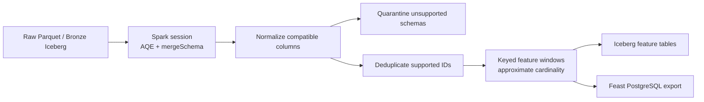

Step-by-step problem handling:

1. **Skew:** [`spark_session()`](../../../apps/data-platform/src/features/spark/session.py#L15) enables AQE, partition coalescing, and advisory partition sizing so Spark can revise shuffle partitions at runtime. Reference: [Spark Adaptive Query Execution](https://spark.apache.org/docs/latest/sql-performance-tuning.html#adaptive-query-execution).
2. **Schema evolution:** DP1 reads partitioned Parquet with [`mergeSchema=true`](../../../apps/data-platform/src/features/spark/session.py#L58) and commits Bronze Iceberg at [batch_lakehouse_ingestion.py line 91](../../../apps/data-platform/src/ingest/batch_lakehouse_ingestion.py#L91). DP2 fills compatible V1 fields and splits unsupported V3+ rows in [`build_clean_behavior_events()`](../../../apps/data-platform/src/features/spark/build_silver_tables.py#L25). Reference: [Spark Parquet Schema Merging](https://spark.apache.org/docs/latest/sql-data-sources-parquet.html#schema-merging).
3. **Duplicate events:** supported behavior events use [`.dropDuplicates(["event_id"])`](../../../apps/data-platform/src/features/spark/build_silver_tables.py#L45), while impressions deduplicate by `impression_id` at [line 49](../../../apps/data-platform/src/features/spark/build_silver_tables.py#L49). Reference: [PySpark `dropDuplicates`](https://spark.apache.org/docs/latest/api/python/reference/pyspark.sql/api/pyspark.sql.DataFrame.dropDuplicates.html).
4. **High cardinality:** the seven-day per-user window uses [`approx_count_distinct(category_id, 0.05)`](../../../apps/data-platform/src/features/spark/build_user_aggregate_features.py#L36) instead of collecting every category ID. Reference: [PySpark `approx_count_distinct`](https://spark.apache.org/docs/latest/api/python/reference/pyspark.sql/api/pyspark.sql.functions.approx_count_distinct.html).
5. **Feature output:** [`_build_feature_outputs()`](../../../apps/data-platform/src/features/spark/spark_batch_entrypoint.py#L47) builds user, item, label, and training tables; [`run_pyspark_batch()`](../../../apps/data-platform/src/features/spark/spark_batch_entrypoint.py#L152) writes Iceberg, optional Parquet/Feast PostgreSQL, and validates the result.

### View Spark UI To Show Problems Have Been Minimized

#### Reproducible Baseline/Production Comparison

The current reproducible comparison uses the checked-in baseline Kubernetes job and the production Spark session. The captured comparison artifact and UI screenshots below remain the numeric and visual proof from the earlier optimization run.

```bash
kubectl apply -f infra/k8s/processing-baseline/spark-baseline-ui-job.yaml
kubectl -n recsys-dataflow wait --for=condition=complete job/spark-baseline-ui --timeout=20m
kubectl -n recsys-dataflow logs job/spark-baseline-ui | \
  grep -E 'SPARK_LAKEHOUSE_TO_OFFLINE_STORE_BASELINE|DP3 (HEAVY SQL|CHECK)'
```


**Figure: Spark offline optimization comparison run.** The screenshot captures the comparison script running inside the Spark proof pod. The highlighted `SPARK_OFFLINE_OPTIMIZATION_COMPARISON={...}` line is the compact proof to pair with the Spark UI captures: it reports baseline and optimized values for skew, high cardinality, schema evolution, and duplicate events from the same local lakehouse input. For duplication, the captured run starts with `50,179` raw behavior-event rows, identifies `19,428` extra duplicate rows across `16,863` repeated event IDs (including `5,615` IDs with conflicting payloads), and produces `30,751` clean rows with `0` duplicate extras remaining, reported as a `100%` duplicate-extra-row reduction. The technique label embedded in this historical artifact refers to the earlier ordered-window implementation; the current production cleaner uses native Spark `.dropDuplicates(["event_id"])` and therefore guarantees one supported row per event ID but does not guarantee that the retained row has the latest `ingestion_ts`.

Current comparison report:

- [spark_offline_optimization_comparison.json (line 1)](spark_offline_optimization_comparison.json#L1): baseline vs optimized comparison output from the latest run.

**Result explanation from the artifact:** skew salting reduced max partition rows from `30,698` to `11,601`, so the hottest partition pressure dropped by `62.21%`. The partition skew ratio moved from `7.9862` to `3.018`, matching the more balanced Spark UI task distribution below. For high cardinality, exact `product_id` distinct count was `10,109`; the optimized `approx_count_distinct(product_id, 0.05)` estimate was `9,977`, only `1.31%` away from exact while avoiding a full exact distinct materialization for monitoring. Schema handling quarantined all `6,774` unsupported v3 rows before the feature path. Duplicate handling removed `19,428` extra duplicate rows, leaving `0` duplicate extras after dedup.

#### Skew Problems

**Spark UI navigation**

1. Open `SQL / DataFrame`.
2. Open `DP3 OPTIMIZED - salted category_id partition load after skew handling`.
3. Click the associated job/stage.
4. Capture `Event Timeline` and `Summary Metrics`.
5. Compare with the baseline `DP3 CHECK - category_id partition load before skew salting` screenshot.


**Figure: Spark skew minimized proof.** The optimized stage shows `4` completed tasks with very similar task durations: min `73 ms`, median `74 ms`, and max `75 ms`. The shuffle-read distribution is also tightly grouped: min `317.5 KiB / 7,550 records`, median `324.6 KiB / 7,739 records`, and max `327.1 KiB / 7,787 records`.

**Analysis:** this captured controlled comparison is the post-salting proof. Instead of one partition carrying most of the hot `category_id` work, the salted aggregation distributes the workload across partitions. The UI evidence is the narrow spread in both duration and shuffle-read records across tasks; the companion JSON confirms the skew ratio reduction from `7.9862` to `3.018`. This is retained as optimization evidence; the current production implementation uses AQE/coalescing and does not claim a custom salting algorithm.

#### High Cardinality

**Spark UI navigation**

1. Open `SQL / DataFrame`.
2. Open the optimized cardinality query, currently shown as `collect at /tmp/compare_spark_offline_optimizations.py`.
3. Scroll below the DAG and expand **Physical Plan > Details**.
4. Capture the `HashAggregate` physical plan line that contains `partial_approx_count_distinct(product_id..., 0.05...)`.
5. Pair it with the comparison artifact above, which shows exact distinct vs approximate distinct error.


**Figure: Spark high-cardinality minimized proof.** The screenshot is from Spark SQL physical plan details. It highlights `partial_approx_count_distinct(product_id#268L, 0.05, 0, 0)` inside `HashAggregate`, proving that the optimized path estimates product cardinality using Spark's approximate distinct-count aggregate instead of materializing the full exact distinct set.

**Analysis:** the baseline exact distinct check must shuffle and materialize unique product ids. The optimized proof replaces that with an approximate cardinality estimator for the monitoring/check path. The comparison artifact reports exact `10,109` vs approximate `9,977`, a `1.31%` relative error, which is accurate enough for a data-quality signal while reducing pressure from exact high-cardinality distinct computation.

## Flink Job To Handle Streaming Data Problems

The streaming path uses PostgreSQL CDC to Kafka topic `cdc.behavior_events`, then two continuous Flink jobs process events into feature stores:

- Offline-store Flink job writes processed streaming features to the Feast PostgreSQL offline feature store.
- Online-store Flink job writes low-latency online features to Redis.

The captured baseline/optimized proof used two TaskManagers with one slot each and parallelism one so the screenshots compare the graphs under the same topology. The current deployment still starts each job at parallelism one, but may autoscale sustained production load after that historical comparison.

Code reference:

- [realtime-flink-consumer.yaml (line 52)](../../../infra/helm/recsys-data-platform/templates/realtime-flink-consumer.yaml#L52): gives the Redis job its own Kafka consumer group.
- [realtime-flink-consumer.yaml (line 144)](../../../infra/helm/recsys-data-platform/templates/realtime-flink-consumer.yaml#L144): gives the PostgreSQL job a different Kafka consumer group.
- [source.py (line 138)](../../../apps/data-platform/src/features/flink/source.py#L138): builds the native `KafkaSource`.
- [realtime_stream_job.py (line 112)](../../../apps/data-platform/src/features/flink/realtime_stream_job.py#L112): connects reusable operators into the production event-time graph.
- [realtime_stream_job.py (line 82)](../../../apps/data-platform/src/features/flink/realtime_stream_job.py#L82): attaches the async Redis writer.
- [realtime_stream_job.py (line 93)](../../../apps/data-platform/src/features/flink/realtime_stream_job.py#L93): attaches the async PostgreSQL writer.

### View Flink UI To Show Baseline Problems

These screenshots are the **before-optimization baseline**, captured on 18 July 2026 from the GCP deployment built from branch `feats/unoptimized-processing-metrics` (commit `6f25ad7`). The online job uses Kafka consumer group `recsys-flink-baseline-online-store`; the equivalent offline job uses `recsys-flink-baseline-offline-store`. Both baseline jobs retain the same three late-event counters as the optimized build so that the two runs can be compared with the same definitions.

The baseline graph can be distinguished from the optimized graph by its manual `KEYED PROCESS, streaming-quality-window-metrics` operator. A clean-looking graph is not evidence of optimization: the runtime overlays and tabs below show that this graph reaches high backpressure and accumulates too-late events under the stress workload.

#### Bursty Traffic

The stress producer emits `40` events on a normal one-second tick and multiplies every fifth tick by eight, producing a `320`-event burst. The following captures show how the unoptimized job reacts.


**Figure: Unoptimized Flink baseline overview under burst traffic.** The real CDC-to-Redis online job is `RUNNING`, but the graph overlay records severe pressure: the source reaches `Backpressured (max): 99%`, the `watermark-lateness-classifier` reaches `80%`, and the feature branch remains busy up to `77%`. The table also shows records continuing to move through every stage. This is evidence of a live but saturated baseline, not a stopped or failed job.


**Figure: Unoptimized Flink baseline reports `HIGH` backpressure.** On the selected `watermark-lateness-classifier` subtask, Flink reports `66%` backpressured, `20%` idle, and `14%` busy, with the overall status marked `HIGH`. The job is still `RUNNING`; therefore the red status is direct runtime evidence that the burst workload is propagating downstream pressure through the manual baseline graph.


**Figure: Unoptimized Flink baseline input and output rates during burst traffic.** The `watermark-lateness-classifier` input and output rates move together through repeated plateaus of approximately `60-69 records/s`, then drop to about `54 records/s` near the end of the capture. Flink displays rolling rates rather than the producer's instantaneous `320`-event burst tick, so the important signal is the repeated rate change while the selected operator simultaneously records `Backpressured (max): 85%`. Input and output remaining close also confirms that the job is still making progress rather than silently stalling.


**Figure: Unoptimized Flink baseline backpressure time versus busy time.** `backPressuredTimeMsPerSecond` rises from roughly `817` to above `910 ms/s` and remains above `830 ms/s` across the visible interval. Meanwhile, `busyTimeMsPerSecond` falls from just over `100` to about `50-75 ms/s`. This inverse pattern shows that the subtask is spending most of each second blocked by downstream pressure rather than executing useful processing work; the graph overlay independently reports a maximum backpressure of `83%`.


**Figure: Unoptimized Flink baseline mailbox latency and input-buffer queue.** The Netty input queue repeatedly expands from roughly `2` buffers to `15`, drains to about `6`, and then fills to `15` again. At the same time, mailbox p95 latency remains near `370 ms` for most of the interval before recovering to about `100 ms`. The recurring queue fill/drain cycle is direct evidence that burst input is being buffered and processed unevenly rather than flowing at a stable rate.

**Analysis:** `RUNNING` only proves liveness. Taken together, the screenshots show the complete baseline symptom chain: the rolling input/output rate changes, the input queue repeatedly fills, mailbox latency stays elevated, and the operator spends more than `800 ms` of many one-second intervals backpressured. The later optimized capture must replay the same `40 -> 320` workload and reduce backpressure, queue occupancy, and mailbox latency while preserving comparable throughput before claiming improvement.

Code reference:

- [data_generator_e2e_2k.yaml (line 60)](../../../configs/local/data_generator_e2e_2k.yaml#L60): configures 40 normal events per producer tick.
- [data_generator_e2e_2k.yaml (line 66)](../../../configs/local/data_generator_e2e_2k.yaml#L66): triggers a burst every fifth tick.
- [data_generator_e2e_2k.yaml (line 67)](../../../configs/local/data_generator_e2e_2k.yaml#L67): multiplies burst ticks by eight.
- [burst_traffic.py (line 6)](../../../apps/data-platform/data-generator/src/streaming/problems/burst_traffic.py#L6): calculates the per-tick event count.
- [producer.py (line 39)](../../../apps/data-platform/data-generator/src/streaming/producer.py#L39): applies the result in the live loop.
- [flink-baseline-ui-job.yaml (line 100)](../../../infra/k8s/processing-baseline/flink-baseline-ui-job.yaml#L100): identifies the baseline online consumer group used by these screenshots.

#### Late Arrival Problems

The same stress run marks `28%` of newly generated events as late and backdates their event timestamps by `45-180` minutes. The baseline classifier compares each event timestamp with the current Flink watermark and exposes three cumulative counters:

- `late_arrivals_total`: every event for which `event_timestamp <= current_watermark`.
- `accepted_late_events_total`: a late event still inside the configured allowed-lateness/cleanup boundary.
- `too_late_events_total`: a late event beyond that boundary, which must not update the live feature window.

For a single subtask sampled at the same instant, the expected invariant is `late_arrivals_total = accepted_late_events_total + too_late_events_total`.


**Figure: Unoptimized Flink baseline late-arrival and accepted-late counters.** The Metrics tab on `watermark-lateness-classifier` shows both `late_arrivals_total` and `accepted_late_events_total` increasing in steps while records continue to enter the operator. Each step corresponds to another injected batch crossing the watermark; only the smaller accepted subset remains within allowed lateness. At the same time, the vertex overlay reaches `Backpressured (max): 82%`, linking the event-time problem proof to the pressured baseline run.


**Figure: Unoptimized Flink baseline too-late events versus operator input.** The upper chart shows `too_late_events_total` rising past `9,000`; the lower `numRecordsIn` chart rises to approximately `45,000`. Thus a substantial share of processed input is arriving beyond the cleanup boundary rather than contributing safely to the live feature state. The classifier's maximum backpressure also reaches `86%` in this capture.

**Analysis:** these are cumulative counter charts, so their staircase shape is expected and their absolute values include all events since this job attempt started. The two screenshots were taken at different times; endpoint values across them must not be added together. To verify the invariant exactly, switch all three counter cards to **Numeric** and record them at the same instant. The baseline proves the problem exists; improvement is demonstrated only by replaying the same workload against the optimized job and comparing ratios such as `too_late_events_total / numRecordsIn`, together with backpressure and throughput.

**How to reproduce the Flink UI proof:** open the baseline online job, select `watermark-lateness-classifier`, choose **BackPressure** for the pressure capture, then choose **Metrics** and add `late_arrivals_total`, `accepted_late_events_total`, `too_late_events_total`, and `numRecordsIn`. Use **Big** charts for the trend and **Numeric** for an exact before/after table.

Code reference:

- [data_generator_e2e_2k.yaml (line 72)](../../../configs/local/data_generator_e2e_2k.yaml#L72), [data_generator_e2e_2k.yaml (line 74)](../../../configs/local/data_generator_e2e_2k.yaml#L74): configures the 28% late-arrival rate and 45-180 minute delay range.
- [late_arrival.py (line 14)](../../../apps/data-platform/data-generator/src/streaming/problems/late_arrival.py#L14): samples and backdates a late event.
- [problem_pipeline.py (line 38)](../../../apps/data-platform/data-generator/src/streaming/problem_pipeline.py#L38): applies the late-arrival class to new events.
- [event_time.py (line 13)](../../../apps/data-platform/src/features/flink/event_time.py#L13): registers the three shared Flink counters through the operator `MetricGroup`.
- [event_time.py (line 31)](../../../apps/data-platform/src/features/flink/event_time.py#L31): increments and partitions late arrivals into accepted and too-late outcomes.
- [flink-baseline-ui-job.yaml (line 94)](../../../infra/k8s/processing-baseline/flink-baseline-ui-job.yaml#L94): submits the baseline online job used for the UI comparison.

### Develop Stream Processing Script To Handle Streaming Problems

#### Stream Processing Flow

The two jobs start at parallelism one and consume continuously. Kafka retains a temporary backlog; bounded async sink capacity propagates backpressure, while the autoscaler increases operator parallelism and TaskManager capacity for sustained load.

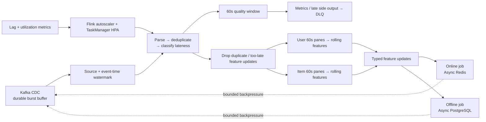

Step-by-step code reference:

1. [Kafka source, CDC parsing, and watermark construction](../../../apps/data-platform/src/features/flink/source.py#L59) establish continuous event-time input.
2. [Deduplication](../../../apps/data-platform/src/features/flink/operators/dedup.py#L8) and [lateness policy](../../../apps/data-platform/src/features/flink/operators/late_policy.py#L8) run before the graph fans out.
3. [The incremental quality window](../../../apps/data-platform/src/features/flink/operators/quality.py) detects burst/late behavior without retaining the full window.
4. [Parallel user/item event-time panes](../../../apps/data-platform/src/features/flink/feature_windows.py#L366) produce rolling `30m/1h/24h/7d` features and the last-50 user sequence.
5. [Bounded `AsyncDataStream.unordered_wait` sinks](../../../apps/data-platform/src/features/flink/realtime_stream_job.py#L82) perform non-blocking Redis/PostgreSQL I/O; the [async token bucket](../../../apps/data-platform/src/features/flink/sinks/rate_limit.py) caps each sink subtask.
6. [Standalone autoscaler and TaskManager HPA](../../../infra/helm/recsys-data-platform/templates/flink-autoscaler.yaml#L1) scale sustained load from the [initial parallelism of one](../../../infra/helm/recsys-data-platform/values.yaml#L180).

#### Bursty Traffic

The quality window detects the problem; async capacity, Kafka buffering, and autoscaling handle it:

1. [`NativeQualityWindowAggregate`](../../../apps/data-platform/src/features/flink/operators/quality.py) increments constant-size counters and marks `is_bursty`; it does not buffer the full window or throttle traffic.
2. [`AsyncRedisFeatureWriter`](../../../apps/data-platform/src/features/flink/sinks/redis_async.py) and [`AsyncPostgresFeastOfflineWriter`](../../../apps/data-platform/src/features/flink/sinks/postgres_async.py) await real async clients, so one slow request does not block all records in the subtask.
3. Both writers use [`AsyncDataStream.unordered_wait`](../../../apps/data-platform/src/features/flink/realtime_stream_job.py#L82) with `capacity=64` and a 120-second timeout. Full capacity backpressures Kafka; the [`timeout()` fallbacks](../../../apps/data-platform/src/features/flink/sinks/redis_async.py#L125) log the affected `event_id` instead of restarting the TaskManager. Reference: [Flink 2.2 Async I/O](https://nightlies.apache.org/flink/flink-docs-release-2.2/docs/dev/datastream/operators/asyncio/).
4. Jobs start at [`parallelism: 1`](../../../infra/helm/recsys-data-platform/values.yaml#L181), and [`taskSlots: 1`](../../../infra/helm/recsys-data-platform/values.yaml#L136) isolates online/offline jobs on separate TaskManagers. Flink Autoscaler 1.15 and the max-four TaskManager HPA are configured in [`flink-autoscaler.yaml`](../../../infra/helm/recsys-data-platform/templates/flink-autoscaler.yaml#L1). Reference: [Flink Autoscaler 1.15](https://nightlies.apache.org/flink/flink-kubernetes-operator-docs-release-1.15/docs/custom-resource/autoscaler/).

The two scaling layers solve different parts of the burst: HPA creates TaskManager capacity, while Adaptive Scheduler plus the standalone autoscaler changes vertex parallelism. Extra TaskManagers alone do not reduce pressure when a rolling operator remains at parallelism one.

```yaml
# values.yaml: start small, but allow the rolling vertices to scale to the
# four-partition / four-TaskManager burst ceiling.
flink:
  scheduler: adaptive
realtimeFlinkConsumer:
  parallelism: "1"
flinkAutoscaler:
  scalingEnabled: true
  targetUtilization: "0.65"
  vertexMinParallelism: "1"
  vertexMaxParallelism: "4"
  taskManagerHpa:
    minReplicas: 2
    maxReplicas: 4
```

The chart renders `jobmanager.scheduler: adaptive` and declarative resource management in [the JobManager startup config](../../../infra/helm/recsys-data-platform/templates/kafka-redis-flink.yaml#L268). The standalone process renders the matching [vertex scaling bounds](../../../infra/helm/recsys-data-platform/templates/flink-autoscaler.yaml#L33), so sustained pressure on `user/item-feature-rolling-horizons` can produce real subtasks instead of only idle TaskManager pods.

Autoscaling code path during sustained bursts:

1. The job begins at [operator parallelism one](../../../infra/helm/recsys-data-platform/values.yaml#L180), so normal traffic does not reserve peak operator capacity.
2. The [standalone autoscaler control loop](../../../infra/helm/recsys-data-platform/templates/flink-autoscaler.yaml#L33) samples Flink metrics using a three-minute window, targets `65%` utilization, and includes catch-up duration when backlog is present.
3. The [TaskManager HPA](../../../infra/helm/recsys-data-platform/templates/flink-autoscaler.yaml#L57) independently targets `65%` CPU and scales worker capacity between `2` and `4` replicas, as configured in [values.yaml](../../../infra/helm/recsys-data-platform/values.yaml#L210).
4. The JobManager starts Flink with the [Adaptive Scheduler](../../../infra/helm/recsys-data-platform/templates/kafka-redis-flink.yaml#L268), allowing available slots and autoscaler recommendations to be applied without changing the source code.

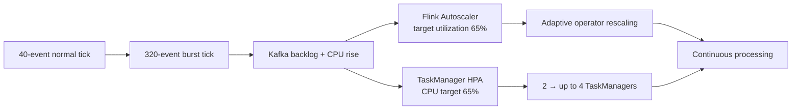

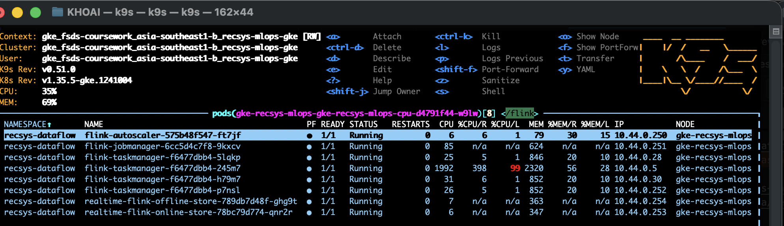

**Figure: scaled Flink worker capacity during burst traffic.** The capture shows the standalone `flink-autoscaler` pod, JobManager, both realtime submitters, and four `flink-taskmanager` pods all `Running`. One TaskManager reaches `1,992m` CPU (`99%` of its two-core limit and `398%` of its `500m` request), while the other workers remain available. Paired with the HPA configuration above, this is runtime evidence that the Flink worker tier reached its configured four-replica burst capacity. It proves TaskManager capacity scaling; operator-parallelism changes must be verified separately in the Flink job graph.

#### Late Arrival

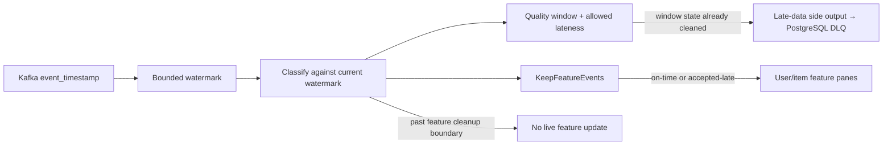

Step-by-step code reference:

1. [`EventTimestampAssigner`](../../../apps/data-platform/src/features/flink/source.py) reads `event_timestamp`; [the watermark builder](../../../apps/data-platform/src/features/flink/source.py) bounds out-of-order delay and handles idle partitions.
2. [`event_time_status()`](../../../apps/data-platform/src/features/flink/event_time.py#L48) compares the event with the current watermark and the aligned feature-pane cleanup boundary; [`MarkEventTimeStatus`](../../../apps/data-platform/src/features/flink/operators/late_policy.py) records accepted-late and too-late counters.
3. [The quality window](../../../apps/data-platform/src/features/flink/operators/quality.py) applies `allowed_lateness` and routes records arriving after state cleanup to the native side output and PostgreSQL DLQ. Reference: [Flink 2.2 late data](https://nightlies.apache.org/flink/flink-docs-release-2.2/docs/dev/datastream/operators/windows/#getting-late-data-as-a-side-output).
4. [`KeepFeatureEvents`](../../../apps/data-platform/src/features/flink/operators/late_policy.py) admits on-time and accepted-late records to [the feature windows](../../../apps/data-platform/src/features/flink/feature_windows.py), while [`AsyncPostgresLateEventDlqWriter`](../../../apps/data-platform/src/features/flink/sinks/postgres_async.py) stores post-cleanup records for backfill without blocking the Python worker.

#### Failure Recovery And Sink Replay

**Techniques used:** Flink EXACTLY_ONCE checkpoint mode for Kafka offsets and operator state, retained externalized checkpoints, one in-flight checkpoint, checkpoint timeout/failure tolerance, optional unaligned checkpoints, and idempotent external writes.

**Best-practice reference:** [Apache Flink 2.2 - Checkpointing](https://nightlies.apache.org/flink/flink-docs-release-2.2/docs/dev/datastream/fault-tolerance/checkpointing/). Flink checkpoints recover operator state and source positions with failure-free execution semantics. The production job enables `CheckpointingMode.EXACTLY_ONCE`, one concurrent checkpoint, retained externalized checkpoints, and optional unaligned checkpoints.

**Delivery-guarantee reference:** [Apache Flink - Exactly Once End-to-end](https://nightlies.apache.org/flink/flink-docs-stable/docs/learn-flink/fault_tolerance/#exactly-once-end-to-end). Kafka and Flink state recover exactly once; the async Redis/PostgreSQL writers remain external side effects and therefore use idempotent writes instead of a Flink two-phase commit.

PostgreSQL upserts by `source_event_id`, the DLQ ignores duplicate `(event_id, reason)`, and Redis uses an atomic Lua compare-and-set so an older replay cannot overwrite a newer feature payload.

Code reference:

- [runtime.py](../../../apps/data-platform/src/features/flink/runtime.py): configures `EXACTLY_ONCE`, checkpoint pause/timeout/concurrency/failure tolerance, retained externalized checkpoints, and optional unaligned checkpoints.
- [realtime_stream_job.py (line 161)](../../../apps/data-platform/src/features/flink/realtime_stream_job.py#L161): applies checkpoint configuration before building/executing the job.
- [row_mappers.py (line 110)](../../../apps/data-platform/src/features/flink/operators/row_mappers.py#L110): carries the source event id into user feature rows.
- [row_mappers.py (line 183)](../../../apps/data-platform/src/features/flink/operators/row_mappers.py#L183): carries the source event id into item feature rows.
- [postgres_offline_store.py (line 194)](../../../apps/data-platform/src/feature_store/postgres_offline_store.py#L194): creates the partial unique index on `source_event_id`.
- [postgres_offline_store.py (line 204)](../../../apps/data-platform/src/feature_store/postgres_offline_store.py#L204): creates the DLQ uniqueness constraint.
- [postgres_offline_store.py (line 250)](../../../apps/data-platform/src/feature_store/postgres_offline_store.py#L250): upserts replayed feature events.
- [postgres_offline_store.py (line 253)](../../../apps/data-platform/src/feature_store/postgres_offline_store.py#L253): ignores a replayed DLQ event.
- [online_writer.py (line 35)](../../../apps/data-platform/src/feature_store/online_writer.py#L35): compares the stored and incoming `updated_at` values atomically in Redis Lua.
- [online_writer.py (line 39)](../../../apps/data-platform/src/feature_store/online_writer.py#L39): atomically writes the accepted latest payload with TTL.
- [online_writer.py (line 51)](../../../apps/data-platform/src/feature_store/online_writer.py#L51): executes the Lua compare-and-set through Redis.
- [values.yaml (line 248)](../../../infra/helm/recsys-data-platform/values.yaml#L248): configures checkpoint minimum pause.
- [values.yaml (line 249)](../../../infra/helm/recsys-data-platform/values.yaml#L249): configures checkpoint timeout.
- [values.yaml (line 251)](../../../infra/helm/recsys-data-platform/values.yaml#L251): enables unaligned checkpoints in production.

#### Production Runtime Routing

The deployed streaming layout is `Kafka CDC -> Flink -> PostgreSQL Feast offline store` and `Kafka CDC -> Flink -> Redis online store`. Iceberg remains part of the batch lakehouse, but it is not the production streaming offline-store sink.

Code reference:

- [values.yaml (line 193)](../../../infra/helm/recsys-data-platform/values.yaml#L193): selects PostgreSQL as the realtime offline sink.
- [realtime-flink-consumer.yaml (line 91)](../../../infra/helm/recsys-data-platform/templates/realtime-flink-consumer.yaml#L91): disables the offline branch in the Redis online-store consumer.
- [realtime-flink-consumer.yaml (line 198)](../../../infra/helm/recsys-data-platform/templates/realtime-flink-consumer.yaml#L198): enables the offline branch in the PostgreSQL consumer.
- [realtime-flink-consumer.yaml (line 199)](../../../infra/helm/recsys-data-platform/templates/realtime-flink-consumer.yaml#L199): disables Redis writes in the PostgreSQL consumer.
- [realtime-flink-consumer.yaml (line 200)](../../../infra/helm/recsys-data-platform/templates/realtime-flink-consumer.yaml#L200): passes the configured PostgreSQL sink selection.


### View Flink UI To Show Problems Have Been Minimized

#### Bursty Traffic

These captures show the deployed event-time window build (`flink-2.2-event-window-20260721-r3`), online job `d099cf2d82583c91d79cf311a6403862`, under the same `40 -> 320` burst pattern. The defensible optimization claim is lower classifier blocking and mailbox latency. The evidence does not show higher throughput or complete removal of every bottleneck.

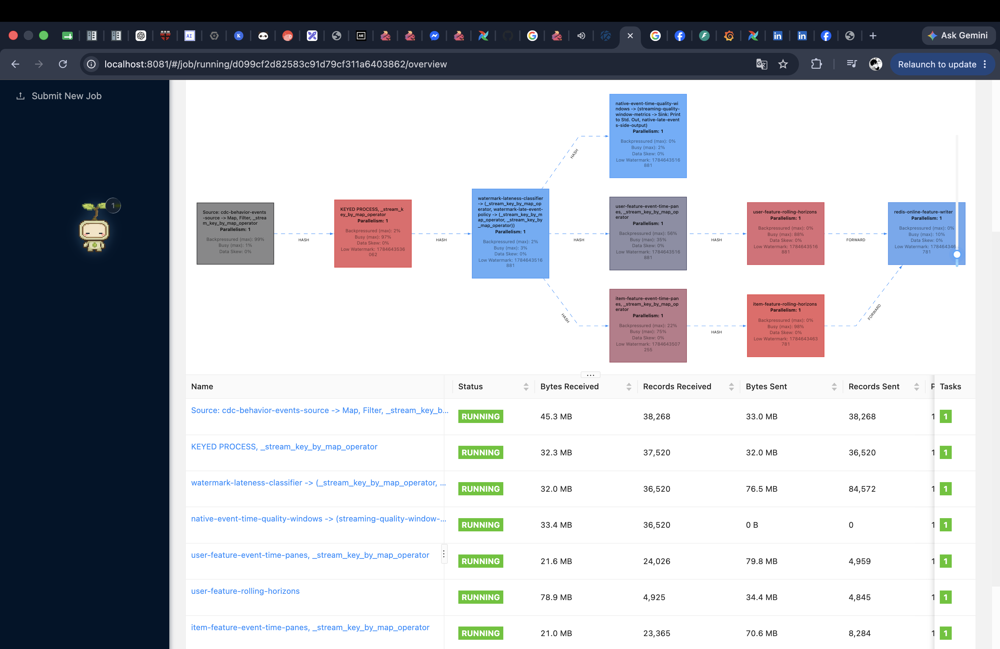

**Figure: r3 event-time window topology and residual bottlenecks.** All nine vertices are `RUNNING`; records pass through separate user/item 60-second panes, rolling horizons, and the async Redis writer. The source still reaches `99%` maximum backpressure, the user pane reaches `56%`, and rolling user/item operators are up to `88%/98%` busy. This image proves the new window topology and end-to-end continuity, but must not be used alone as optimization proof.

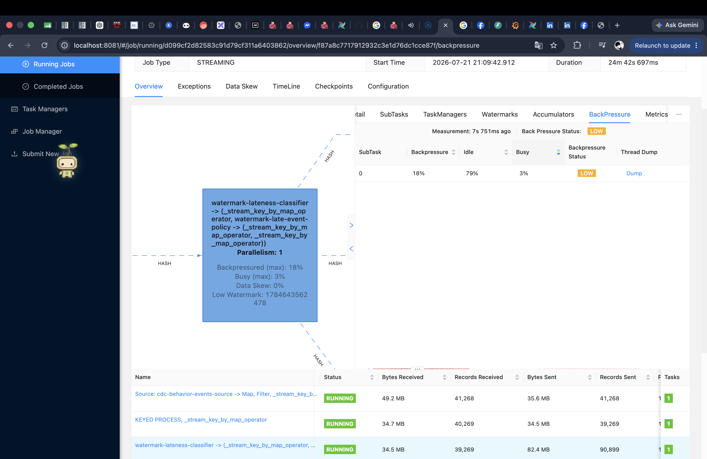

**Figure: classifier changes from HIGH to LOW backpressure.** r3 reports `18%` backpressure, `79%` idle, and `3%` busy. The baseline reports `66%`, `20%`, and `14%` with status `HIGH`; therefore classifier pressure falls by `48` percentage points and the status becomes `LOW`.

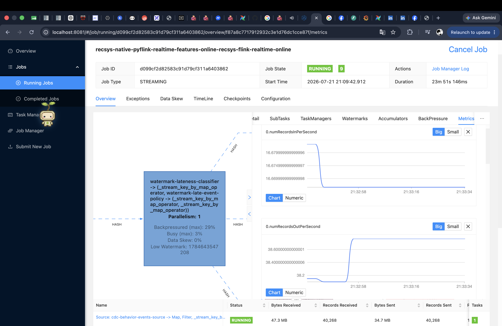

**Figure: r3 remains live, but this is not throughput-improvement proof.** Input holds near `16.67 records/s`; fan-out output rises from about `38.2` to `38.6 records/s`. Baseline input is approximately `54-69 records/s`, and the current output counts multiple downstream branches, so the two output series are not directly comparable. This capture proves continuous processing only.

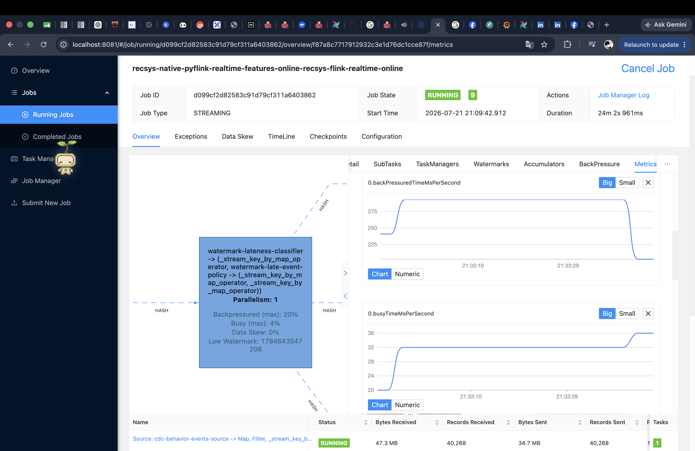

**Figure: classifier spends much less time blocked.** r3 backpressure time is approximately `200-290 ms/s`, versus baseline `817-916 ms/s`, a reduction of roughly `64-78%`. Busy time remains about `20-36 ms/s`, while records continue moving. This is the strongest direct evidence of improved pressure handling.


**Figure: mailbox responsiveness improves, but queue peak does not.** Mailbox p95 remains at `1 ms`, versus the baseline's sustained approximately `370 ms` (more than `99%` lower). The input queue, however, spikes from `0` to `21` buffers, above the baseline peak of `15`, before the later capture shows recovery to about `1`. This supports lower scheduling latency, not lower peak buffering.

**Analysis:** r3 clearly improves classifier backpressure status, blocked time, and mailbox latency while preserving continuous processing and adding real event-time feature windows. It does not prove higher throughput; the overview still exposes source/window pressure and the captured input-queue peak is worse than baseline. The correct claim is improved classifier responsiveness under bursts, not an end-to-end throughput increase.

#### Late Arrival


**Figure: r3 continues classifying accepted-late events.** `late_arrivals_total` and `accepted_late_events_total` rise together during the injected late-event burst, proving that events still inside the allowed-lateness boundary are accepted while the job remains live.

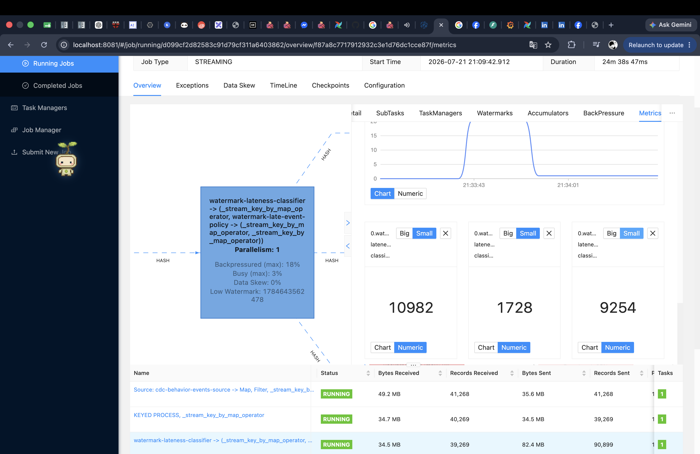

**Figure: the late-event invariant is exact.** The same-instant Numeric cards report `10,982` late arrivals, `1,728` accepted-late events, and `9,254` too-late events: `10,982 = 1,728 + 9,254`. Accepted-late share is about `15.7%`; the classifier table shows `39,269` records received, so the cumulative too-late/input ratio is about `23.6%`, versus roughly `20%` in the baseline capture. These images validate classification correctness, but do not prove that r3 reduces lateness.


### Window Processing

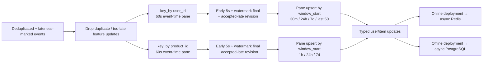

1. [`KeepFeatureEvents`](../../../apps/data-platform/src/features/flink/operators/late_policy.py) removes duplicates and, when `dropLateEvents=true`, events past `window_end + allowed_lateness`.
2. User and item branches independently key by entity and use 60-second `TumblingEventTimeWindows`. After a new element marks the pane dirty, the trigger emits once after five seconds; it does not reschedule itself for an unchanged pane. Watermark close emits the final pane, and an accepted-late element emits a correction immediately.
3. Each emission carries `window_start`, `window_end`, and `is_final`. Rolling `MapState` replaces revisions by `window_start`, ignores an identical revision, deduplicates by `event_id`, and prunes state beyond seven days; early/final/late emissions therefore do not double-count or flood the sinks.
4. The two deployments run the same feature graph: the online job enables async Redis only, while the offline job enables async PostgreSQL only.

```python
feature_events = marked.filter(KeepFeatureEvents(args))
user_panes = (
    feature_events.key_by(lambda event: int(event["user_id"]))
    .window(TumblingEventTimeWindows.of(Time.seconds(args.feature_window_seconds)))
    .allowed_lateness(args.allowed_lateness_seconds * 1000)
    .side_output_late_data(user_feature_late_tag)
    .trigger(
        EarlyAndEventTimeTrigger(
            args.feature_early_fire_seconds,
            "user-feature-early-fire-timer",
        )
    )
    .aggregate(
        FeaturePaneAggregate(),
        FeaturePaneWindowFunction("user"),
        accumulator_type=Types.PICKLED_BYTE_ARRAY(),
        output_type=Types.PICKLED_BYTE_ARRAY(),
    )
    .name("user-feature-event-time-panes")
)
user_updates = (
    user_panes.key_by(lambda pane: int(pane["entity_id"]))
    .process(
        UserRollingFeatureProcess(args),
        output_type=Types.PICKLED_BYTE_ARRAY(),
    )
    .name("user-feature-rolling-horizons")
)
# The parallel item branch uses product_id and ItemRollingFeatureProcess(args).
```

Code reference:

- [User/item feature-window graph](../../../apps/data-platform/src/features/flink/feature_windows.py#L366) and [sink routing](../../../apps/data-platform/src/features/flink/realtime_stream_job.py#L58)
- [Incremental pane accumulator and window metadata](../../../apps/data-platform/src/features/flink/feature_windows.py#L17)
- [Pane revision overwrite, event deduplication, and seven-day pruning](../../../apps/data-platform/src/features/flink/feature_windows.py#L70)
- [Identical revision guard](../../../apps/data-platform/src/features/flink/feature_windows.py#L104)
- [Dirty-gated early, final, and accepted-late trigger](../../../apps/data-platform/src/features/flink/feature_windows.py#L205)
- [Rolling keyed `MapState` processors](../../../apps/data-platform/src/features/flink/feature_windows.py#L299)
- [User 30m/24h/7d aggregates](../../../apps/data-platform/src/features/flink/features/user_aggregate.py), [last-50 sequence](../../../apps/data-platform/src/features/flink/features/user_sequence.py), and [item 1h/24h/7d aggregates](../../../apps/data-platform/src/features/flink/features/item.py)
- [Window/trigger Helm defaults](../../../infra/helm/recsys-data-platform/values.yaml#L236) and [CLI wiring for both deployments](../../../infra/helm/recsys-data-platform/templates/realtime-flink-consumer.yaml#L84)

## Production Integration Proof

### Spark Batch Job Integrated Into Airflow Pipeline

Spark batch processing is integrated into the Airflow DAGs through native Spark-on-Kubernetes submission rather than a permanently running Spark cluster, a local Spark process, or a Spark Operator `SparkApplication` resource. The shared `spark_native_submit()` helper builds the same production `spark-submit` contract for the DP2 and DP3 Spark tasks. See [rubric_data_pipeline_dags.py (line 86)](../../../apps/data-platform/src/orchestration/airflow/dags/rubric_data_pipeline_dags.py#L86) for the `KubernetesPodOperator` wrapper and [rubric_data_pipeline_dags.py (line 105)](../../../apps/data-platform/src/orchestration/airflow/dags/rubric_data_pipeline_dags.py#L105) for the shared submission helper.

#### Native Spark-On-Kubernetes Execution Flow

The integration uses the following reference-backed execution path:

| Step | Execution flow | Code reference |
|---:|---|---|
| 1 | The Airflow scheduler loads and schedules the rubric DAGs. | [airflow.yaml (line 67)](../../../infra/helm/recsys-data-platform/templates/airflow.yaml#L67) declares the scheduler Deployment and [line 92](../../../infra/helm/recsys-data-platform/templates/airflow.yaml#L92) starts `airflow scheduler`. |
| 2 | `KubernetesPodOperator` creates a temporary Spark submission pod for the Airflow task. | [rubric_data_pipeline_dags.py (line 86)](../../../apps/data-platform/src/orchestration/airflow/dags/rubric_data_pipeline_dags.py#L86) constructs the operator; [line 99](../../../apps/data-platform/src/orchestration/airflow/dags/rubric_data_pipeline_dags.py#L99) deletes the temporary pod after completion. |
| 3 | The submission pod runs `spark-submit` against the Kubernetes API. | [rubric_data_pipeline_dags.py (line 119)](../../../apps/data-platform/src/orchestration/airflow/dags/rubric_data_pipeline_dags.py#L119) invokes `spark-submit`, and [line 120](../../../apps/data-platform/src/orchestration/airflow/dags/rubric_data_pipeline_dags.py#L120) selects the in-cluster Kubernetes API master. |
| 4 | Kubernetes creates a separate Spark driver pod because submission uses cluster deploy mode. | [rubric_data_pipeline_dags.py (line 121)](../../../apps/data-platform/src/orchestration/airflow/dags/rubric_data_pipeline_dags.py#L121) sets `--deploy-mode cluster`; [line 123](../../../apps/data-platform/src/orchestration/airflow/dags/rubric_data_pipeline_dags.py#L123) selects the driver namespace and [line 124](../../../apps/data-platform/src/orchestration/airflow/dags/rubric_data_pipeline_dags.py#L124) selects the Spark container image. |
| 5 | The driver requests, monitors, and removes executor pods according to the Spark allocation policy. | [rubric_data_pipeline_dags.py (line 126)](../../../apps/data-platform/src/orchestration/airflow/dags/rubric_data_pipeline_dags.py#L126) assigns the driver's Kubernetes service account; [rbac.yaml (line 7)](../../../infra/helm/recsys-data-platform/templates/rbac.yaml#L7) permits pod lifecycle operations; [rubric_data_pipeline_dags.py (line 139)](../../../apps/data-platform/src/orchestration/airflow/dags/rubric_data_pipeline_dags.py#L139) through [line 146](../../../apps/data-platform/src/orchestration/airflow/dags/rubric_data_pipeline_dags.py#L146) define dynamic executor allocation. |
| 6 | The submission pod waits until the driver application succeeds or fails. | [rubric_data_pipeline_dags.py (line 127)](../../../apps/data-platform/src/orchestration/airflow/dags/rubric_data_pipeline_dags.py#L127) sets `spark.kubernetes.submission.waitAppCompletion=true`; [line 130](../../../apps/data-platform/src/orchestration/airflow/dags/rubric_data_pipeline_dags.py#L130) reports application state every five seconds. |
| 7 | Airflow marks a Spark stage successful only after the application completes, then releases the next stage. | [rubric_data_pipeline_dags.py (line 272)](../../../apps/data-platform/src/orchestration/airflow/dags/rubric_data_pipeline_dags.py#L272) enforces DP2 `ingest -> optimize -> validate`; [line 293](../../../apps/data-platform/src/orchestration/airflow/dags/rubric_data_pipeline_dags.py#L293) enforces DP3 `ingest -> validate`. |

The submission command therefore keeps the Airflow task attached to the real Spark application outcome instead of treating a successful submission request as job completion. The temporary submission pod, driver, and executors use the Spark image and run in namespace `recsys-dataflow`; driver and executor pods are placed on the `cpu-services` node pool by [rubric_data_pipeline_dags.py (line 133)](../../../apps/data-platform/src/orchestration/airflow/dags/rubric_data_pipeline_dags.py#L133). ConfigMap values, object-store settings, PostgreSQL settings, and Kubernetes Secrets are propagated from the `KubernetesPodOperator` environment into both the driver and executors.

#### How The Shared Spark Contract Is Applied To Airflow Pipelines

The GCP Helm values are rendered into `recsys-data-platform-config`. Each `KubernetesPodOperator` imports that ConfigMap and the platform Secret with `env_from`. The shared helper then converts the environment variables into `spark-submit --conf` settings. This creates one configuration path:

```text
values-gcp.yaml
  -> Helm ConfigMap
  -> KubernetesPodOperator submission pod environment
  -> spark_native_submit()
  -> Spark driver and executor configuration
```

Implementation reference: [values-gcp.yaml (line 27)](../../../infra/helm/recsys-data-platform/values-gcp.yaml#L27) defines the GCP Spark values; [configmap.yaml (line 51)](../../../infra/helm/recsys-data-platform/templates/configmap.yaml#L51) renders them as environment variables; [rubric_data_pipeline_dags.py (line 65)](../../../apps/data-platform/src/orchestration/airflow/dags/rubric_data_pipeline_dags.py#L65) imports the ConfigMap and Secret; and [rubric_data_pipeline_dags.py (line 107)](../../../apps/data-platform/src/orchestration/airflow/dags/rubric_data_pipeline_dags.py#L107) forwards runtime settings to the driver and executors.

Terraform applies `values-gcp.yaml` when initially installing the data-platform Helm release. Jenkins component deployment also sets the GCP Spark resource and dynamic-allocation values explicitly, so later component updates do not silently fall back to the local profile. See [recsys_services.tf (line 116)](../../../infra/terraform/gcp/recsys_services.tf#L116) for the Terraform Helm release and [component_deploy.sh (line 257)](../../../jenkins/scripts/component_deploy.sh#L257) plus [line 271](../../../jenkins/scripts/component_deploy.sh#L271) for the Jenkins Helm update and `spark.dynamicAllocation.enabled` override.

#### DP1: Generated Data To Bronze Iceberg

In DAG `recsys_dp1_raw_to_bronze`, `ingest_stage` generates the source Parquet fragments and loads them into governed Bronze Iceberg tables. Airflow then gates completion through physical-layout optimization and Bronze contract validation.

Implementation reference: [rubric_data_pipeline_dags.py (line 166)](../../../apps/data-platform/src/orchestration/airflow/dags/rubric_data_pipeline_dags.py#L166) builds ingestion, [line 182](../../../apps/data-platform/src/orchestration/airflow/dags/rubric_data_pipeline_dags.py#L182) builds optimization, and [line 246](../../../apps/data-platform/src/orchestration/airflow/dags/rubric_data_pipeline_dags.py#L246) enforces `ingest_stage >> optimize_stage >> validate_stage`.

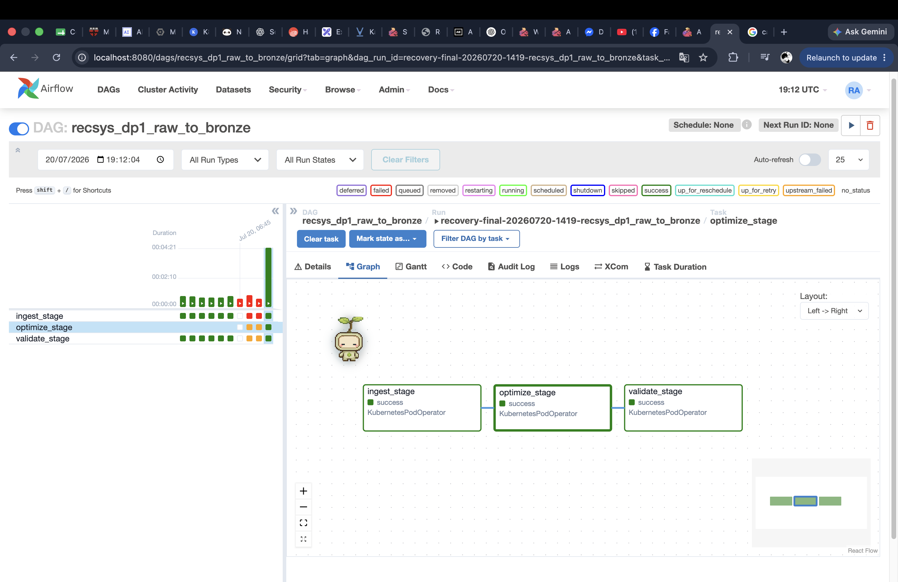

**Figure: DP1 batch processing in Airflow.** The successful run proves that Bronze ingestion, optimization, and validation completed in order.

#### DP2: Spark Bronze To Silver Processing

In DAG `recsys_dp2_bronze_to_silver_gold`, all three Airflow stages submit Spark applications. The `ingest_stage` reads the Bronze Iceberg tables produced by DP1, normalizes timestamps and compatible schema changes, rejects invalid behavior events, deduplicates supported events, builds order facts and product SCD data, and writes the curated datasets as `silver_*` Iceberg tables. `optimize_stage` then compacts and maintains the Silver physical layout. The following `validate_stage` reads every expected curated table with Spark and fails the DAG when a required table is empty or its contract fails.

Implementation reference: [rubric_data_pipeline_dags.py (line 198)](../../../apps/data-platform/src/orchestration/airflow/dags/rubric_data_pipeline_dags.py#L198), [line 204](../../../apps/data-platform/src/orchestration/airflow/dags/rubric_data_pipeline_dags.py#L204), and [line 210](../../../apps/data-platform/src/orchestration/airflow/dags/rubric_data_pipeline_dags.py#L210) build the ingest, validate, and optimize commands; [line 248](../../../apps/data-platform/src/orchestration/airflow/dags/rubric_data_pipeline_dags.py#L248) and [line 272](../../../apps/data-platform/src/orchestration/airflow/dags/rubric_data_pipeline_dags.py#L272) declare the DAG and enforce `ingest_stage >> optimize_stage >> validate_stage`; [dp2_silver_gold_entrypoint.py (line 15)](../../../apps/data-platform/src/features/spark/dp2_silver_gold_entrypoint.py#L15) and [line 29](../../../apps/data-platform/src/features/spark/dp2_silver_gold_entrypoint.py#L29) implement ingestion and validation.

The `silver_gold` suffix remains in the historical DAG and Python identifiers, but DP2 physically writes only the `silver_*` Iceberg layer.

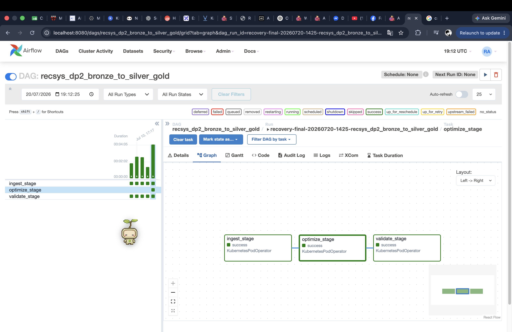

**Figure: DP2 Spark integration in Airflow.** The successful Graph run proves that Spark ingestion, Silver optimization, and contract validation completed in the required order.

#### DP3: Spark Offline Feature Engineering

In DAG `recsys_dp3_offline_feature_table`, the `ingest_stage` submits the production Spark batch feature job. Spark builds the clean input frames, computes `user_sequence_features`, `user_aggregate_features`, `item_features`, ranking labels, and the BST training dataset, writes the feature outputs to the feature lakehouse namespace, and exports the Feast-facing tables to PostgreSQL. PostgreSQL is the configured Feast offline store; Apache Iceberg remains the upstream lakehouse and feature-storage layer.

Implementation reference: [rubric_data_pipeline_dags.py (line 157)](../../../apps/data-platform/src/orchestration/airflow/dags/rubric_data_pipeline_dags.py#L157) builds the DP3 Spark command; [line 274](../../../apps/data-platform/src/orchestration/airflow/dags/rubric_data_pipeline_dags.py#L274) and [line 282](../../../apps/data-platform/src/orchestration/airflow/dags/rubric_data_pipeline_dags.py#L282) attach it to the DP3 `ingest_stage`; [spark_batch_entrypoint.py (line 181)](../../../apps/data-platform/src/features/spark/spark_batch_entrypoint.py#L181), [line 186](../../../apps/data-platform/src/features/spark/spark_batch_entrypoint.py#L186), and [line 197](../../../apps/data-platform/src/features/spark/spark_batch_entrypoint.py#L197) read Silver, compute/write feature outputs, and export PostgreSQL tables.

The DP3 `validate_stage` does not perform feature engineering. It connects to PostgreSQL after Spark finishes and runs row-count checks against every expected offline-store table. Therefore, the count checks are completion validation only; the actual transformations and feature calculations happen in the preceding Spark `ingest_stage`.

Implementation reference: [rubric_data_pipeline_dags.py (line 287)](../../../apps/data-platform/src/orchestration/airflow/dags/rubric_data_pipeline_dags.py#L287) runs the non-Spark validation task after ingestion, [line 293](../../../apps/data-platform/src/orchestration/airflow/dags/rubric_data_pipeline_dags.py#L293) enforces the ordering, and [governance_contracts.py (line 148)](../../../apps/data-platform/src/validate/governance_contracts.py#L148) implements PostgreSQL offline-store validation.

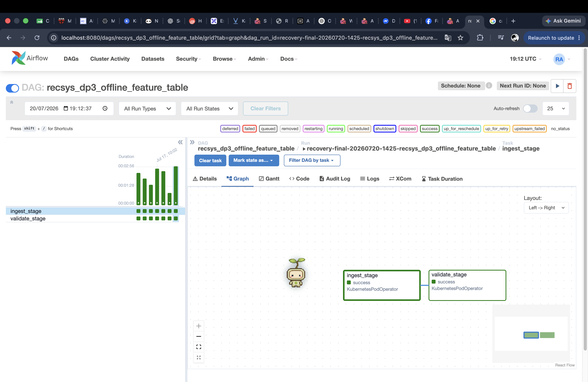

**Figure: DP3 Spark integration in Airflow.** The Airflow Graph view shows `ingest_stage -> validate_stage` in DAG `recsys_dp3_offline_feature_table`. The successful Spark ingest node proves that feature computation and PostgreSQL export completed, while the successful validation node proves that the resulting Feast offline-store tables contain data.

#### Spark Scaling On GCP

The GCP profile enables `spark.dynamicAllocation.enabled=true` with Kubernetes-compatible shuffle tracking. Spark 3.5 uses `spark.dynamicAllocation.shuffleTracking.enabled=true`, so executor removal does not require an external shuffle service. The GCP switch and bounds are defined in [values-gcp.yaml](../../../infra/helm/recsys-data-platform/values-gcp.yaml), rendered by [configmap.yaml](../../../infra/helm/recsys-data-platform/templates/configmap.yaml), and passed to every native Airflow Spark application by [rubric_data_pipeline_dags.py](../../../apps/data-platform/src/orchestration/airflow/dags/rubric_data_pipeline_dags.py). This follows the [Apache Spark 3.5 dynamic resource allocation requirements](https://spark.apache.org/docs/3.5.7/job-scheduling.html#dynamic-resource-allocation). The configured policy is:

| Setting | GCP value | Behavior |
|---|---:|---|
| `spark.dynamicAllocation.minExecutors` | `1` | Keeps one executor available while the Spark application is active. |
| `spark.dynamicAllocation.initialExecutors` | `1` | Starts each application with one executor. |
| `spark.dynamicAllocation.maxExecutors` | `4` | Caps application-level horizontal scaling at four executor pods. |
| `spark.dynamicAllocation.schedulerBacklogTimeout` | `1s` | Requests another executor after tasks remain queued for one second. |
| `spark.dynamicAllocation.sustainedSchedulerBacklogTimeout` | `1s` | Continues requesting executors while the task backlog persists. |
| `spark.dynamicAllocation.executorIdleTimeout` | `60s` | Removes an idle executor after 60 seconds, down to the minimum. |

Each GCP executor is configured with one Spark core, `4g` heap, and `1g` memory overhead; the driver uses one core, `2g` heap, and `768m` overhead. `spark.sql.shuffle.partitions=16` supplies enough task partitions for more than one executor to work concurrently. These GCP values are declared in [values-gcp.yaml (line 27)](../../../infra/helm/recsys-data-platform/values-gcp.yaml#L27). The base/local Helm profile leaves dynamic allocation disabled and keeps the previous single-executor behavior for lightweight deterministic runs, as shown in [values.yaml (line 80)](../../../infra/helm/recsys-data-platform/values.yaml#L80) and [line 92](../../../infra/helm/recsys-data-platform/values.yaml#L92).

Spark executor scaling and Kubernetes node scaling are separate control loops. Dynamic allocation changes the number of executor pods between one and four according to the Spark task backlog. If the `cpu-services` nodes cannot place those pods, the GKE Cluster Autoscaler can grow the CPU node pool from its configured minimum of two nodes to its maximum of five. When executors become idle, Spark releases them first; the GKE autoscaler can later remove unused nodes. The node autoscaler never decides how many Spark executors an application needs. The CPU node-pool autoscaler is implemented in [gke.tf (line 97)](../../../infra/terraform/gcp/gke.tf#L97); its default minimum and maximum are defined in [variables.tf (line 79)](../../../infra/terraform/gcp/variables.tf#L79) and [line 85](../../../infra/terraform/gcp/variables.tf#L85).

Each rubric DAG uses `max_active_runs=1`, and its stage dependencies remain sequential. Dynamic allocation therefore changes parallelism inside the active Spark application; it does not create overlapping Airflow runs or bypass optimization/validation ordering. DP2 declares the run limit and dependency at [rubric_data_pipeline_dags.py (line 253)](../../../apps/data-platform/src/orchestration/airflow/dags/rubric_data_pipeline_dags.py#L253) and [line 272](../../../apps/data-platform/src/orchestration/airflow/dags/rubric_data_pipeline_dags.py#L272); DP3 does the same at [line 279](../../../apps/data-platform/src/orchestration/airflow/dags/rubric_data_pipeline_dags.py#L279) and [line 293](../../../apps/data-platform/src/orchestration/airflow/dags/rubric_data_pipeline_dags.py#L293).
