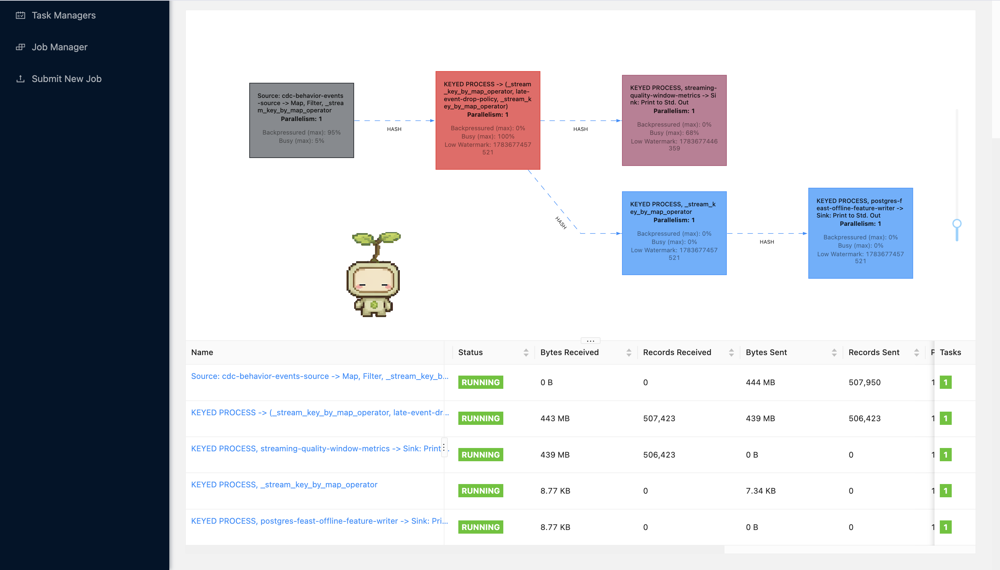
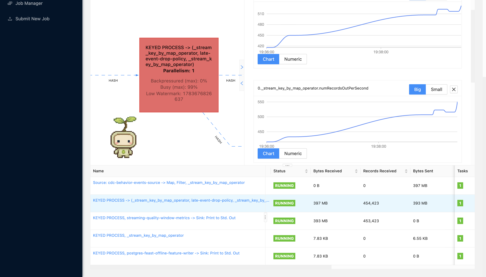
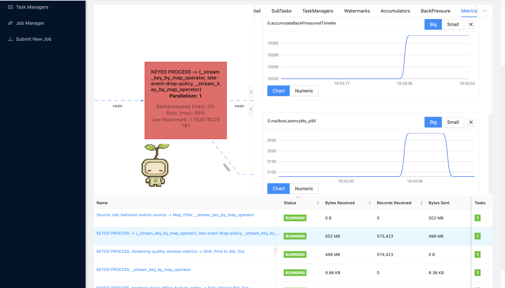
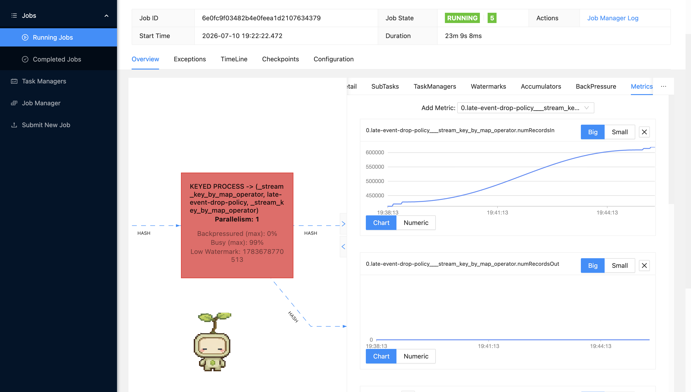
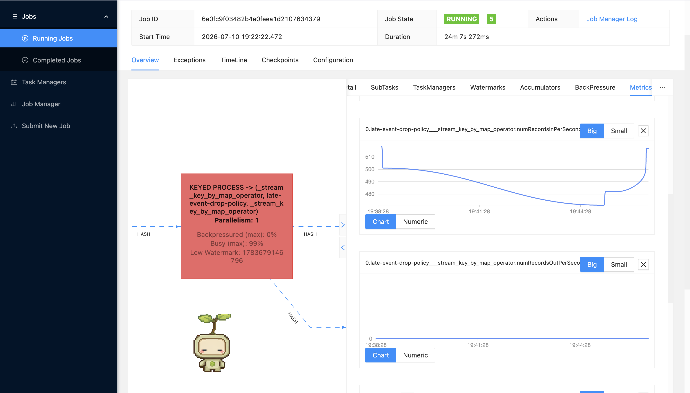
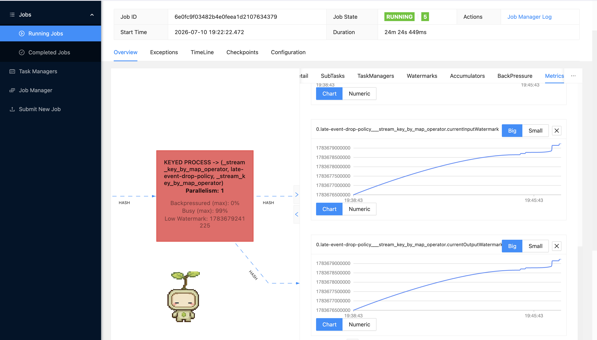
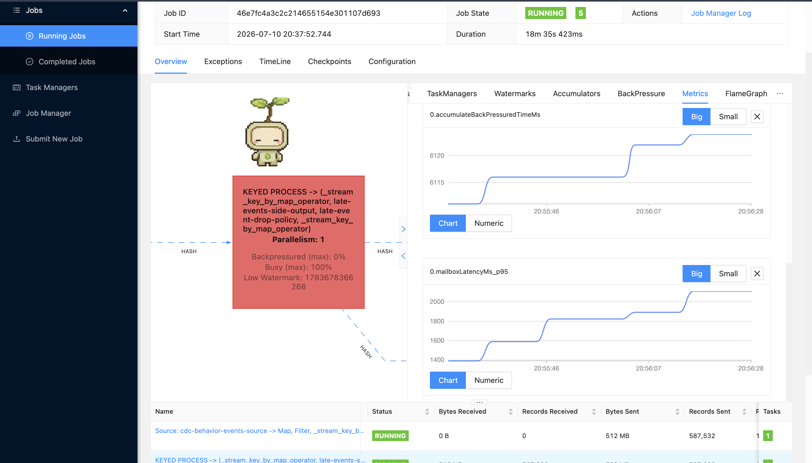
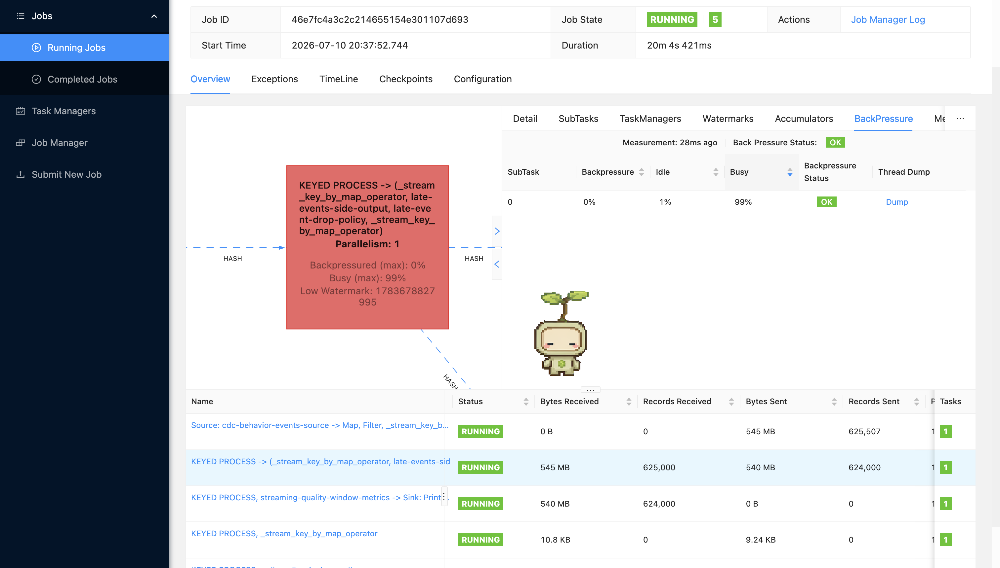
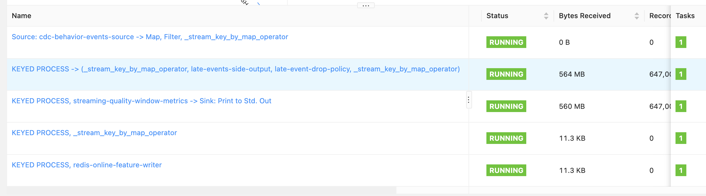
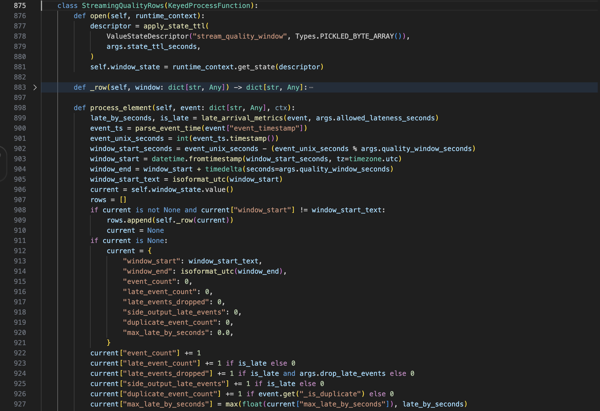

# Processing Jobs

This page documents the current runtime proof plan for Spark batch processing and Flink stream processing. The proof is based on the real data generator, lakehouse input, Kafka CDC stream, Spark UI, Flink UI, and feature-store outputs.

## Current Data Generator Data Problems Config

### Batch generator for lakehouse data

The batch generator writes raw recommendation-system data into the lakehouse with data issues turned on, so the Spark batch job can process realistic offline data problems before exporting features to the Feast PostgreSQL offline store.

Code reference:

- [data_generator_e2e_1k.yaml (line 7)](../../../configs/local/data_generator_e2e_1k.yaml#L7), [data_generator_e2e_1k.yaml (line 48)](../../../configs/local/data_generator_e2e_1k.yaml#L48): batch traffic and high-cardinality volume.
- [data_generator_e2e_1k.yaml (line 33)](../../../configs/local/data_generator_e2e_1k.yaml#L33), [data_generator_e2e_1k.yaml (line 47)](../../../configs/local/data_generator_e2e_1k.yaml#L47): skewed city/category distribution knobs.
- [data_generator_e2e_1k.yaml (line 58)](../../../configs/local/data_generator_e2e_1k.yaml#L58): exact-duplicate configuration.
- [data_generator_e2e_1k.yaml (line 54)](../../../configs/local/data_generator_e2e_1k.yaml#L54), [data_generator_e2e_1k.yaml (line 57)](../../../configs/local/data_generator_e2e_1k.yaml#L57): schema evolution and breaking-schema config.

The current batch config is intentionally stress-heavy. It uses a large entity space (`20,000` products, `8,000` users, `5,000` brands, `1,000` categories) for high-cardinality proof. Category and city distributions are uneven (`top_category_ratio=0.99`, `top_city_ratio=0.96`) for skew proof. Exact duplicates use `duplicate_event_rate=0.45`, and schema evolution has a compatible cutover on `2026-03-23` plus breaking v3 rows after `2026-03-27`. These are the four offline problem groups: skew, high cardinality, schema evolution, and duplicates.

### Streaming generator for Kafka CDC and Flink jobs

The realtime producer continuously inserts source rows into PostgreSQL. CDC then sends behavior events to Kafka topic `cdc.behavior_events`, where the two continuous Flink jobs consume them:

- Flink offline-store job writes processed streaming features to the Feast PostgreSQL offline store.
- Flink online-store job writes online features to Redis.

Code reference:

- [data_generator_e2e_1k.yaml (line 61)](../../../configs/local/data_generator_e2e_1k.yaml#L61), [data_generator_e2e_1k.yaml (line 78)](../../../configs/local/data_generator_e2e_1k.yaml#L78): streaming generator plus burst, late-arrival, and duplicate settings in the shared scenario config.
- [problem_pipeline.py (line 23)](../../../apps/data-platform/data-generator/src/streaming/problem_pipeline.py#L23), [producer.py (line 34)](../../../apps/data-platform/data-generator/src/streaming/producer.py#L34): three-class wiring and continuous runtime emission loop.

The streaming config contains exactly three problems. A normal tick emits `40` events and every fifth tick multiplies it by `8`; recent events are replayed at `14%`; and late events are backdated by `45–180` minutes at `28%`.

## Spark Job To Handle Offline Data Problems

The Spark batch job reads raw tables from the data lakehouse, normalizes/deduplicates them into silver tables, computes offline feature tables, writes Iceberg feature tables, and exports to the Feast PostgreSQL offline feature store.

Code reference:

- [spark_batch_entrypoint.py (line 34)](../../../apps/data-platform/src/features/spark/spark_batch_entrypoint.py#L34), [spark_batch_entrypoint.py (line 45)](../../../apps/data-platform/src/features/spark/spark_batch_entrypoint.py#L45), [spark_batch_entrypoint.py (line 152)](../../../apps/data-platform/src/features/spark/spark_batch_entrypoint.py#L152), [spark_batch_entrypoint.py (line 207)](../../../apps/data-platform/src/features/spark/spark_batch_entrypoint.py#L207): production Spark configuration and entrypoint.
- [spark_batch_entrypoint.py (line 47)](../../../apps/data-platform/src/features/spark/spark_batch_entrypoint.py#L47), [spark_batch_entrypoint.py (line 83)](../../../apps/data-platform/src/features/spark/spark_batch_entrypoint.py#L83): builds normalized Silver inputs and offline feature outputs.
- [spark_batch_entrypoint.py (line 93)](../../../apps/data-platform/src/features/spark/spark_batch_entrypoint.py#L93), [spark_batch_entrypoint.py (line 114)](../../../apps/data-platform/src/features/spark/spark_batch_entrypoint.py#L114): exports batch features into the PostgreSQL Feast offline store.

#### Skew Problems

**Spark UI navigation**

1. Open `SQL / DataFrame`.
2. Open `DP3 HEAVY SQL - skewed category_id aggregation with 32 shuffle tasks`.
3. Use the description as the stable lookup key. The numeric SQL id changes every rerun.
4. Capture the SQL DAG where `Generate`, `Expand`, `Exchange`, and `HashAggregate` are visible.
5. Open the associated job/stage from that SQL execution.
6. Capture the stage `Event Timeline`, `Summary Metrics`, and task table. Focus on `Shuffle Read Size / Records`, `Shuffle Write Size / Records`, and the difference between median and max task duration.


**Figure: Spark stage-level skew proof.** This screenshot shows the skew proof stage with `32 completed tasks`, `Shuffle Read Size / Records = 1856.9 KiB / 30751`, and `Shuffle Write Size / Records = 1593.3 KiB / 51752`. The important part is the task-level comparison: the stage is no longer a tiny single-task check, so the reviewer can compare task duration and shuffle records across 32 tasks. In this capture, max task duration is `0.2 s` while the median is `28 ms`, which is the kind of imbalance Spark UI exposes when a hot key creates uneven work.

Reference Spark SQL code here:

[spark-baseline-ui-job.yaml (line 68)](../../../infra/k8s/processing-baseline/spark-baseline-ui-job.yaml#L68), [spark-baseline-ui-job.yaml (line 84)](../../../infra/k8s/processing-baseline/spark-baseline-ui-job.yaml#L84), [spark-baseline-ui-job.yaml (line 166)](../../../infra/k8s/processing-baseline/spark-baseline-ui-job.yaml#L166), [spark-baseline-ui-job.yaml (line 221)](../../../infra/k8s/processing-baseline/spark-baseline-ui-job.yaml#L221) defines the baseline Spark settings and heavy skew/cardinality SQL used by the Spark UI proof. The core line is the `CASE WHEN category_id = 1 THEN 24 ELSE 2 END` multiplier: rows from the hot category are expanded 24 times, while other categories are expanded only 2 times. This keeps the proof deterministic and makes the skew obvious in one SQL execution with 32 shuffle tasks.

```sql
WITH amplified AS (
  SELECT
    category_id,
    product_id,
    event_id,
    user_id,
    CAST(price AS DOUBLE) AS price,
    repeat_id
  FROM clean_behavior_events_proof
  LATERAL VIEW explode(
    sequence(
      1,
      CASE WHEN category_id = 1 THEN 24 ELSE 2 END
    )
  ) repeat_view AS repeat_id
)
SELECT
  category_id,
  COUNT(*) AS amplified_event_rows,
  COUNT(DISTINCT event_id) AS source_event_count,
  COUNT(DISTINCT product_id) AS product_cardinality_inside_category,
  SUM(price) AS amplified_price_sum
FROM amplified
GROUP BY category_id
ORDER BY amplified_event_rows DESC
LIMIT 20
```

**Spark SQL note:** the generator config creates the real hot category distribution, then this proof query amplifies that hot key so the Spark UI shows a visible heavy aggregation. The `GROUP BY category_id` forces a category-key aggregation, and the proof wrapper runs it with `spark.sql.shuffle.partitions=32` and AQE disabled so Spark exposes multiple comparable tasks instead of coalescing them away.


**Figure: Spark SQL DAG proof for skew amplification.** This screenshot shows the SQL DAG path used by the skew proof: `Generate` outputs `736,572` rows, `Expand` outputs `2,209,716` rows, then `HashAggregate` groups the expanded data and reports `51,752` output rows. The `HashAggregate` node also shows aggregation build time and peak memory, which proves this is a real Spark SQL aggregation path rather than a simple printed log.

**What to point out in the screenshots:** the Spark SQL DAG proves the query shape (`Generate -> Expand -> HashAggregate`), while the Spark stage screenshot proves that Spark executed it as a multi-task shuffle/aggregation stage. The CLI summary can be captured separately to show the business-level hot key: `category_id=1` has the largest `amplified_event_rows`, so the Spark UI evidence can be tied back to a concrete skewed category.

**Analysis:** this is the baseline data-skew proof for the lakehouse-to-offline-store Spark path. The data generator creates the skew through `top_category_ratio=0.99`, and the heavy SQL query makes that skew visible in Spark UI by expanding the dominant category and grouping by `category_id`. The proof is stronger than the old count-only query because one SQL execution now has enough rows and enough shuffle tasks to compare task-level behavior.

Code reference:

- [data_generator_e2e_1k.yaml (line 33)](../../../configs/local/data_generator_e2e_1k.yaml#L33), [data_generator_e2e_1k.yaml (line 47)](../../../configs/local/data_generator_e2e_1k.yaml#L47): skewed category and city distribution config.
- [spark-baseline-ui-job.yaml (line 166)](../../../infra/k8s/processing-baseline/spark-baseline-ui-job.yaml#L166), [spark-baseline-ui-job.yaml (line 191)](../../../infra/k8s/processing-baseline/spark-baseline-ui-job.yaml#L191): heavy skew SQL with hot-category amplification.

#### High Cardinality

**Spark UI navigation**

1. Open `SQL / DataFrame`.
2. Open `DP3 HEAVY SQL - high-cardinality product_event_key aggregation with 32 shuffle tasks`.
3. Use the description as the stable lookup key. The numeric SQL id changes every rerun.
4. Capture the SQL DAG where `Generate`, `Expand`, `Exchange`, and `HashAggregate` are visible.
5. Open the associated job/stage from that SQL execution.
6. Capture the stage `Event Timeline`, `Summary Metrics`, and task table. Focus on `Shuffle Read Size / Records`, the number of completed tasks, and task duration spread.


**Figure: Spark stage-level high-cardinality proof.** This screenshot shows the high-cardinality proof stage with `32 completed tasks`, `Shuffle Read Size / Records = 1792.1 KiB / 30751`, and associated job `53`. The stage view is useful because it proves the query ran as a real multi-task Spark shuffle stage, not as a small driver-only count. The task timeline and summary metrics let the reviewer compare how many records Spark had to shuffle and how evenly those records were processed across tasks.

Reference Spark SQL code here:

[spark-baseline-ui-job.yaml (line 193)](../../../infra/k8s/processing-baseline/spark-baseline-ui-job.yaml#L193), [spark-baseline-ui-job.yaml (line 221)](../../../infra/k8s/processing-baseline/spark-baseline-ui-job.yaml#L221) defines the heavy high-cardinality SQL used by the Spark UI proof. The important field is `product_event_key`, which combines `product_id`, `event_id`, and `repeat_id` so Spark has to aggregate many near-unique keys. The query also includes both exact distinct counting and `approx_count_distinct(product_event_key, 0.05)` to show the optimized estimator in the same SQL path.

```sql
WITH amplified AS (
  SELECT
    product_id,
    event_id,
    user_id,
    category_id,
    repeat_id,
    CONCAT(
      CAST(product_id AS STRING),
      ':',
      event_id,
      ':',
      CAST(repeat_id AS STRING)
    ) AS product_event_key
  FROM clean_behavior_events_proof
  LATERAL VIEW explode(sequence(1, 8)) repeat_view AS repeat_id
)
SELECT
  product_id,
  COUNT(*) AS amplified_rows,
  COUNT(DISTINCT product_event_key) AS exact_high_cardinality_keys,
  approx_count_distinct(product_event_key, 0.05) AS approx_high_cardinality_keys,
  COUNT(DISTINCT user_id) AS user_cardinality_per_product
FROM amplified
GROUP BY product_id
ORDER BY exact_high_cardinality_keys DESC, product_id ASC
LIMIT 100
```

**Spark SQL note:** the generator config already creates a large entity space with `20,000` products and `8,000` users. This proof query makes the high-cardinality pressure obvious in Spark UI by expanding each behavior event 8 times and creating a near-unique `product_event_key`. The `GROUP BY product_id` plus `COUNT(DISTINCT product_event_key)` forces Spark to maintain many distinct keys, while `approx_count_distinct(product_event_key, 0.05)` shows the approximate estimator that can be used when exact cardinality is too expensive.


**Figure: Spark SQL DAG proof for high cardinality.** This screenshot shows the DAG generated by the heavy high-cardinality SQL. `Generate` outputs `246,008` rows, `Expand` outputs `738,024` rows, and the downstream `HashAggregate` reports `289,053` output rows. The same `HashAggregate` node shows aggregation build time, peak memory, and hash probe metrics, which are the Spark UI signals that this query is doing substantial distinct-key aggregation work.

**What to point out in the screenshots:** the SQL DAG proves the query shape (`Generate -> Expand -> HashAggregate`) and the large output-row counts produced by distinct-key aggregation. The stage screenshot proves Spark executed the query with 32 tasks and shuffle metrics. Together, they show high cardinality as a physical Spark workload: many unique keys flow through an aggregation and shuffle boundary, instead of only being described in text.

**Analysis:** high cardinality means Spark must process many distinct business keys. The stress generator creates the raw entity space, then the heavy SQL makes the pressure visible by creating `product_event_key` values that are close to unique per event expansion. The exact `COUNT(DISTINCT product_event_key)` is the baseline pressure point, while `approx_count_distinct(product_event_key, 0.05)` is the lightweight estimator proof when the pipeline needs a cardinality signal without fully materializing every distinct key.

Code reference:

- [data_generator_e2e_1k.yaml (line 48)](../../../configs/local/data_generator_e2e_1k.yaml#L48), [data_generator_e2e_1k.yaml (line 53)](../../../configs/local/data_generator_e2e_1k.yaml#L53): high-cardinality entity counts and preferences per user.
- [spark-baseline-ui-job.yaml (line 193)](../../../infra/k8s/processing-baseline/spark-baseline-ui-job.yaml#L193), [spark-baseline-ui-job.yaml (line 221)](../../../infra/k8s/processing-baseline/spark-baseline-ui-job.yaml#L221): composite key, exact distinct count, and `approx_count_distinct(..., 0.05)`.

#### Schema Evolution

**Failure-proof capture command**

```bash
kubectl apply -f infra/k8s/processing-baseline/spark-schema-evolution-fail-job.yaml
kubectl wait --for=condition=failed job/spark-schema-evolution-fail-proof -n recsys-dataflow --timeout=5m
kubectl logs -n recsys-dataflow job/spark-schema-evolution-fail-proof
```

Capture these log lines:

```text
ValueError: unsupported behavior_events schema_version=3
Task 0 in stage 13.0 failed 1 times; aborting job
```

**Image proof: Spark UI counts breaking schema rows before normalization**


**Figure: Spark UI schema-evolution proof from `docs/pngs/schema_evolution_proof.png`.** This image should show the Spark SQL/DataFrame execution labelled `DP3 CHECK - count breaking schema_version rows before silver normalization`. The stable evidence is the execution description plus the DAG `Filter` metric showing rows where `schema_version > 2`. In the current proof run, this filter outputs `6,774` rows, meaning the lakehouse contains breaking schema v3 events before the batch job normalizes or exports data to the Feast PostgreSQL offline store.

**Note for capture:** do not rely on the numeric SQL execution id because Spark regenerates ids after every rerun. Use browser search for `DP3 CHECK - count breaking schema_version rows before silver normalization`, then capture the full Spark UI page with the `Filter` node and `number of output rows` visible.

**Figure: Spark schema-evolution failure proof.** Capture the `kubectl logs` output from `spark-schema-evolution-fail-proof`. The important evidence is `ValueError: unsupported behavior_events schema_version=3`, followed by Spark aborting the task. This shows the failure mode explicitly: if the batch contract only supports v1/v2 and a breaking v3 event arrives, the Spark task fails instead of silently writing bad data.

**What to point out in the screenshot:** the generator has three schema phases: v1 old rows before `2026-03-23`, v2 evolved rows from `2026-03-23`, and v3 breaking rows from `2026-03-27`. The normal baseline Spark job counts v3 rows in the UI, while the fail-proof job intentionally treats v3 as unsupported to demonstrate the runtime schema-evolution problem.

**Analysis:** historical rows before the schema cutover may not have the same evolved fields as newer rows, and future rows may introduce a breaking contract. The normal baseline Spark job preserves old valid rows by normalizing missing fields, but the separate fail-proof job proves why schema contracts matter: an incompatible `schema_version=3` breaks the Spark task before offline-store export.

Code reference:

- [data_generator_e2e_1k.yaml (line 54)](../../../configs/local/data_generator_e2e_1k.yaml#L54), [data_generator_e2e_1k.yaml (line 57)](../../../configs/local/data_generator_e2e_1k.yaml#L57): schema evolution dates and breaking version.
- [simulation.py (line 234)](../../../apps/data-platform/data-generator/src/offline/simulation.py#L234), [simulation.py (line 240)](../../../apps/data-platform/data-generator/src/offline/simulation.py#L240), [simulation.py (line 279)](../../../apps/data-platform/data-generator/src/offline/simulation.py#L279), [simulation.py (line 292)](../../../apps/data-platform/data-generator/src/offline/simulation.py#L292): schema-version selection and request-field population for v1/v2/v3 rows.
- [build_silver_tables.py (line 14)](../../../apps/data-platform/src/features/spark/build_silver_tables.py#L14), [build_silver_tables.py (line 38)](../../../apps/data-platform/src/features/spark/build_silver_tables.py#L38): compatible missing-column normalization and event deduplication.
- [spark-baseline-ui-job.yaml (line 55)](../../../infra/k8s/processing-baseline/spark-baseline-ui-job.yaml#L55), [spark-baseline-ui-job.yaml (line 64)](../../../infra/k8s/processing-baseline/spark-baseline-ui-job.yaml#L64), [spark-baseline-ui-job.yaml (line 119)](../../../infra/k8s/processing-baseline/spark-baseline-ui-job.yaml#L119), [spark-baseline-ui-job.yaml (line 137)](../../../infra/k8s/processing-baseline/spark-baseline-ui-job.yaml#L137): counts breaking rows and optionally fails on unsupported versions.
- [spark-schema-evolution-fail-job.yaml (line 1)](../../../infra/k8s/processing-baseline/spark-schema-evolution-fail-job.yaml#L1), [spark-schema-evolution-fail-job.yaml (line 70)](../../../infra/k8s/processing-baseline/spark-schema-evolution-fail-job.yaml#L70): intentional schema-evolution failure manifest.

#### Duplicate Records, Events

Use the checked-in generator summary for source-side duplicate counts and the Spark UI job for the post-deduplication check:

```bash
PYTHONPATH=apps/data-platform/data-generator/src uv run python \
  apps/data-platform/data-generator/src/scripts/summarize_generation_quality.py \
  --config configs/local/data_generator_e2e_1k.yaml \
  --lake-root data_platform/lake | \
  awk '/## Duplicate Rate Before And After Dedup/{flag=1} /^## Injected Vs Observed/{flag=0} flag'
```

**Image proof: duplicate events detected in generated data**


**Figure: Duplicate-event proof from `docs/pngs/duplicate_events_proof.png`.** The capture records raw row count, distinct event IDs, and exact duplicate rows from the generated input used by the Spark proof.

**Spark UI companion proof:** capture the Spark UI SQL execution labelled `DP3 CHECK - count rejected duplicate event_id rows before offline-store write`. That UI stage proves the batch job rejects duplicate rows before writing offline feature tables, while the terminal proof above proves the duplicate events exist in the raw lakehouse input.

**Analysis:** the generator injects exact duplicates. The Silver builder ranks rows by `event_id` and latest `ingestion_ts`, keeps one row, and sends repeated rows to the rejected dataset before offline-store export.

Code reference:

- [data_generator_e2e_1k.yaml (line 58)](../../../configs/local/data_generator_e2e_1k.yaml#L58), [data_generator_e2e_1k.yaml (line 59)](../../../configs/local/data_generator_e2e_1k.yaml#L59): exact-duplicate rate.
- [summarize_generation_quality.py (line 119)](../../../apps/data-platform/data-generator/src/scripts/summarize_generation_quality.py#L119), [summarize_generation_quality.py (line 129)](../../../apps/data-platform/data-generator/src/scripts/summarize_generation_quality.py#L129): reproducible exact-duplicate calculation.
- [build_silver_tables.py (line 18)](../../../apps/data-platform/src/features/spark/build_silver_tables.py#L18), [build_silver_tables.py (line 38)](../../../apps/data-platform/src/features/spark/build_silver_tables.py#L38): event-ID deduplication by latest `ingestion_ts` and rejected-row split.
- [spark-baseline-ui-job.yaml (line 137)](../../../infra/k8s/processing-baseline/spark-baseline-ui-job.yaml#L137), [spark-baseline-ui-job.yaml (line 155)](../../../infra/k8s/processing-baseline/spark-baseline-ui-job.yaml#L155): Spark UI action that counts rejected duplicates.

### Develop Batch Processing Script To Handle Offline Problems

#### Skew Problems

**Technique used:** expose hot-category pressure with the checked-in Spark UI proof query, then run production DP2/DP3 with Spark Adaptive Query Execution (AQE), partition coalescing, and an advisory partition size. The current implementation does not claim a custom salting algorithm.

**Technique reference:** [Spark SQL Performance Tuning — Adaptive Query Execution](https://spark.apache.org/docs/latest/sql-performance-tuning.html#adaptive-query-execution).

Code reference:

- [spark-baseline-ui-job.yaml (line 68)](../../../infra/k8s/processing-baseline/spark-baseline-ui-job.yaml#L68), [spark-baseline-ui-job.yaml (line 84)](../../../infra/k8s/processing-baseline/spark-baseline-ui-job.yaml#L84), [spark-baseline-ui-job.yaml (line 166)](../../../infra/k8s/processing-baseline/spark-baseline-ui-job.yaml#L166), [spark-baseline-ui-job.yaml (line 191)](../../../infra/k8s/processing-baseline/spark-baseline-ui-job.yaml#L191): reproducible skew-amplification query with AQE disabled for baseline visibility.
- [session.py (line 11)](../../../apps/data-platform/src/features/spark/session.py#L11), [session.py (line 30)](../../../apps/data-platform/src/features/spark/session.py#L30): production AQE, coalescing, and advisory partition sizing.

#### High Cardinality

**Technique used:** generate a large entity/id space through the data generator config, expose the baseline pressure with exact `distinct().count()`, then use Spark `approx_count_distinct(..., 0.05)` as the lightweight cardinality estimator proof. The batch job still converts raw behavior logs into compact user, item, and sequence feature tables before exporting to the Feast PostgreSQL offline store.

**Technique reference:** [PySpark approx_count_distinct](https://spark.apache.org/docs/latest/api/python/reference/pyspark.sql/api/pyspark.sql.functions.approx_count_distinct.html). Spark provides `approx_count_distinct(col, rsd)` for approximate cardinality estimation with a configurable relative standard deviation. This is the right optimization when the pipeline needs a high-cardinality signal for monitoring or validation, but does not need to materialize every distinct `product_id` or `user_id`.

Code reference:

- [spark-baseline-ui-job.yaml (line 193)](../../../infra/k8s/processing-baseline/spark-baseline-ui-job.yaml#L193), [spark-baseline-ui-job.yaml (line 221)](../../../infra/k8s/processing-baseline/spark-baseline-ui-job.yaml#L221): runs exact and `approx_count_distinct(..., 0.05)` cardinality measures in the same proof query.

#### Schema Evolution

**Technique used:** this is now a real Parquet schema-merge path, not only rows with nullable columns. Historical V1 `behavior_events` files physically omit `device_type` and `campaign_id`; V2 files contain them. DP1 copies each Parquet fragment independently so those physical schemas remain different in Bronze. Spark enables `spark.sql.parquet.mergeSchema=true` both at session level and on the Parquet read. The Silver contract then fills compatible missing/null V1 fields, admits V1/V2, quarantines V3, and deduplicates only the supported rows.

**Technique reference:** [Spark Parquet Schema Merging](https://spark.apache.org/docs/latest/sql-data-sources-parquet.html#schema-merging). Spark supports compatible schema evolution by merging schemas, but the feature-store path uses a stricter contract: compatible v1/v2 rows are normalized, while unsupported v3 rows are quarantined before offline-store export.

Code reference:

- [sink.py (line 58)](../../../apps/data-platform/data-generator/src/sink.py#L58): removes the V2-only fields from the physical V1 Arrow schema.
- [sink.py (line 97)](../../../apps/data-platform/data-generator/src/sink.py#L97): chooses the physical schema separately for each date partition.
- [sink.py (line 110)](../../../apps/data-platform/data-generator/src/sink.py#L110): writes that physical schema into each Parquet file.
- [batch_lakehouse_ingestion.py (line 109)](../../../apps/data-platform/src/ingest/batch_lakehouse_ingestion.py#L109): reads each physical Parquet fragment without dataset-level schema merging.
- [batch_lakehouse_ingestion.py (line 125)](../../../apps/data-platform/src/ingest/batch_lakehouse_ingestion.py#L125): gives every fragment a distinct output file.
- [batch_lakehouse_ingestion.py (line 126)](../../../apps/data-platform/src/ingest/batch_lakehouse_ingestion.py#L126): persists each fragment independently, preserving its schema.
- [session.py (line 20)](../../../apps/data-platform/src/features/spark/session.py#L20): enables Parquet schema merging for the production Spark session.
- [session.py (line 55)](../../../apps/data-platform/src/features/spark/session.py#L55): explicitly enables `mergeSchema` on each Parquet table read.
- [build_silver_tables.py (line 29)](../../../apps/data-platform/src/features/spark/build_silver_tables.py#L29): supplies the V1 default for missing/null `device_type`.
- [build_silver_tables.py (line 30)](../../../apps/data-platform/src/features/spark/build_silver_tables.py#L30): supplies the V1 default for missing/null `campaign_id`.
- [build_silver_tables.py (line 42)](../../../apps/data-platform/src/features/spark/build_silver_tables.py#L42): selects unsupported V3+ rows.
- [build_silver_tables.py (line 43)](../../../apps/data-platform/src/features/spark/build_silver_tables.py#L43): labels those rows `unsupported_schema_version`.
- [build_silver_tables.py (line 45)](../../../apps/data-platform/src/features/spark/build_silver_tables.py#L45): gates the feature path to supported V1/V2 rows.
- [build_silver_tables.py (line 52)](../../../apps/data-platform/src/features/spark/build_silver_tables.py#L52): combines duplicate and unsupported rows in the rejected Silver output.

#### Duplicate Records, Events

**Technique used:** event-id deduplication ordered by ingestion time. The latest version of an event is kept, and older duplicate rows are rejected before offline-store export.

**Technique reference:** [PySpark dropDuplicates](https://spark.apache.org/docs/latest/api/python/reference/pyspark.sql/api/pyspark.sql.DataFrame.dropDuplicates.html). Spark provides built-in duplicate removal, but this repo uses a more explicit event-correctness rule for offline features: window by `event_id`, order by latest `ingestion_ts`, keep the latest row, and write older duplicate rows to the rejected dataset.

Code reference:

- [build_silver_tables.py (line 18)](../../../apps/data-platform/src/features/spark/build_silver_tables.py#L18), [build_silver_tables.py (line 38)](../../../apps/data-platform/src/features/spark/build_silver_tables.py#L38): applies event-ID deduplication with latest `ingestion_ts` ordering in the Spark Silver-table job.

### View Spark UI To Show Problems Have Been Minimized

#### Reproducible Baseline/Production Comparison

The current reproducible comparison uses the checked-in baseline Kubernetes job and the production Spark session. The captured comparison artifact and UI screenshots below remain the numeric and visual proof from the earlier optimization run.

```bash
kubectl apply -f infra/k8s/processing-baseline/spark-baseline-ui-job.yaml
kubectl -n recsys-dataflow wait --for=condition=complete job/spark-baseline-ui --timeout=20m
kubectl -n recsys-dataflow logs job/spark-baseline-ui | \
  grep -E 'SPARK_LAKEHOUSE_TO_OFFLINE_STORE_BASELINE|DP3 (HEAVY SQL|CHECK)'
```


**Figure: Spark offline optimization comparison run.** The screenshot captures the comparison script running inside the Spark proof pod. The highlighted `SPARK_OFFLINE_OPTIMIZATION_COMPARISON={...}` line is the compact proof to pair with the Spark UI captures: it reports baseline and optimized values for skew, high cardinality, schema evolution, and duplicate events from the same local lakehouse input.

Current comparison report:

- [spark_offline_optimization_comparison.json (line 1)](spark_offline_optimization_comparison.json#L1): baseline vs optimized comparison output from the latest run.

**Result explanation from the artifact:** skew salting reduced max partition rows from `30,698` to `11,601`, so the hottest partition pressure dropped by `62.21%`. The partition skew ratio moved from `7.9862` to `3.018`, matching the more balanced Spark UI task distribution below. For high cardinality, exact `product_id` distinct count was `10,109`; the optimized `approx_count_distinct(product_id, 0.05)` estimate was `9,977`, only `1.31%` away from exact while avoiding a full exact distinct materialization for monitoring. Schema handling quarantined all `6,774` unsupported v3 rows before the feature path. Duplicate handling rejected `19,428` extra duplicate rows, leaving `0` duplicate extras after dedup.

#### Skew Problems

**Spark UI navigation**

1. Open `SQL / DataFrame`.
2. Open `DP3 OPTIMIZED - salted category_id partition load after skew handling`.
3. Click the associated job/stage.
4. Capture `Event Timeline` and `Summary Metrics`.
5. Compare with the baseline `DP3 CHECK - category_id partition load before skew salting` screenshot.


**Figure: Spark skew minimized proof.** The optimized stage shows `4` completed tasks with very similar task durations: min `73 ms`, median `74 ms`, and max `75 ms`. The shuffle-read distribution is also tightly grouped: min `317.5 KiB / 7,550 records`, median `324.6 KiB / 7,739 records`, and max `327.1 KiB / 7,787 records`.

**Analysis:** this captured controlled comparison is the post-salting proof. Instead of one partition carrying most of the hot `category_id` work, the salted aggregation distributes the workload across partitions. The UI evidence is the narrow spread in both duration and shuffle-read records across tasks; the companion JSON confirms the skew ratio reduction from `7.9862` to `3.018`. This is retained as optimization evidence; the current production implementation uses AQE/coalescing and does not claim a custom salting algorithm.

#### High Cardinality

**Spark UI navigation**

1. Open `SQL / DataFrame`.
2. Open the optimized cardinality query, currently shown as `collect at /tmp/compare_spark_offline_optimizations.py`.
3. Scroll below the DAG and expand **Physical Plan > Details**.
4. Capture the `HashAggregate` physical plan line that contains `partial_approx_count_distinct(product_id..., 0.05...)`.
5. Pair it with the comparison artifact above, which shows exact distinct vs approximate distinct error.


**Figure: Spark high-cardinality minimized proof.** The screenshot is from Spark SQL physical plan details. It highlights `partial_approx_count_distinct(product_id#268L, 0.05, 0, 0)` inside `HashAggregate`, proving that the optimized path estimates product cardinality using Spark's approximate distinct-count aggregate instead of materializing the full exact distinct set.

**Analysis:** the baseline exact distinct check must shuffle and materialize unique product ids. The optimized proof replaces that with an approximate cardinality estimator for the monitoring/check path. The comparison artifact reports exact `10,109` vs approximate `9,977`, a `1.31%` relative error, which is accurate enough for a data-quality signal while reducing pressure from exact high-cardinality distinct computation.

## Flink Job To Handle Streaming Data Problems

The streaming path uses PostgreSQL CDC to Kafka topic `cdc.behavior_events`, then two continuous Flink jobs process events into feature stores:

- Offline-store Flink job writes processed streaming features to the Feast PostgreSQL offline feature store.
- Online-store Flink job writes low-latency online features to Redis.

Code reference:

- [realtime-flink-consumer.yaml (line 52)](../../../infra/helm/recsys-data-platform/templates/realtime-flink-consumer.yaml#L52): gives the Redis job its own Kafka consumer group.
- [realtime-flink-consumer.yaml (line 144)](../../../infra/helm/recsys-data-platform/templates/realtime-flink-consumer.yaml#L144): gives the PostgreSQL job a different Kafka consumer group.
- [realtime_stream_job.py (line 420)](../../../apps/data-platform/src/features/flink/realtime_stream_job.py#L420): builds the native `KafkaSource`.
- [realtime_stream_job.py (line 875)](../../../apps/data-platform/src/features/flink/realtime_stream_job.py#L875): connects that source to the production event-time graph.
- [realtime_stream_job.py (line 941)](../../../apps/data-platform/src/features/flink/realtime_stream_job.py#L941): names the Redis online-store writer.
- [realtime_stream_job.py (line 951)](../../../apps/data-platform/src/features/flink/realtime_stream_job.py#L951): names the PostgreSQL offline-store writer.

### View Flink UI To Show Baseline Problems

> **Screenshot version note:** the checked-in screenshots below were captured from the previous manual keyed-process implementation, so labels such as `late-event-drop-policy` and `late-events-side-output` describe that baseline graph. After this native refactor, a new production capture should show `watermark-lateness-classifier`, `native-event-time-quality-windows`, `native-late-events-side-output`, and `watermark-late-event-policy`. The old images remain baseline evidence and must not be presented as the post-change graph.

#### Bursty Traffic

**Flink UI navigation**

1. Open the Flink dashboard at `http://localhost:18083` and choose one of the continuous realtime jobs:
   `recsys-native-pyflink-realtime-features-online-recsys-flink-realtime-online`
   or `recsys-native-pyflink-realtime-features-online-recsys-flink-realtime-offline`.
2. Open the job **Overview** page and capture the operator graph. The graph should show `Source: cdc-behavior-events-source`, `streaming-quality-window-metrics`, `late-event-drop-policy`, and the online/offline writer path.
3. Click the `KEYED PROCESS -> (..., late-event-drop-policy, ...)` vertex.
4. Open **Metrics** and add `0._stream_key_by_map_operator.numRecordsOutPerSecond`, `0.late-event-drop-policy___stream_key_by_map_operator.numRecordsInPerSecond`, `0.busyTimeMsPerSecond`, `0.accumulateBackPressuredTimeMs`, and `0.mailboxLatencyMs_p95`.
5. Capture the metric graphs while the producer is running. In the current proof images, the useful signals are the rising records/second graph, `Busy (max): 99%`, the `accumulateBackPressuredTimeMs` step, and the `mailboxLatencyMs_p95` spike.
6. Optionally click `Source: cdc-behavior-events-source -> Map, Filter -> ...` and add `0.numRecordsOutPerSecond` if the reviewer wants a source-side view of the incoming Kafka burst.
7. Open the job-level **BackPressure** tab and capture the color/status for source, policy, metric, and writer operators.
8. Open the job-level **Checkpoints** tab and capture checkpoint duration/alignment data during a burst.



**Figure: Flink realtime job graph for streaming problem proof.** This image shows the continuous CDC job running from `Source: cdc-behavior-events-source` into `late-event-drop-policy`, then splitting into the `streaming-quality-window-metrics` branch and the Feast PostgreSQL offline writer branch. The table below the graph shows the job is `RUNNING` and has already processed hundreds of thousands of records, so the proof is taken from the real Kafka CDC to feature-store path rather than a standalone demo job.



**Figure: Flink bursty-traffic throughput proof.** This image focuses on the `KEYED PROCESS -> (..., late-event-drop-policy, ...)` vertex. The selected vertex is `RUNNING`, has `Busy (max): 99%`, and the metric graph for `numRecordsOutPerSecond` rises from roughly `420` to `550` records/second. That upward rate movement is the UI symptom of the generator's burst windows: records arrive faster than the operator can smoothly process them, so the operator stays almost fully busy.



**Figure: Flink bursty-traffic pressure proof.** This image keeps the same `late-event-drop-policy` vertex selected and adds pressure metrics. `accumulateBackPressuredTimeMs` steps upward, while `mailboxLatencyMs_p95` jumps from about `2080 ms` to about `2280 ms` during the burst interval. The important reader takeaway is that burst traffic is visible not only as higher throughput, but also as increased operator scheduling/mailbox latency and accumulated backpressure time.

**Analysis:** every 5th realtime producer tick multiplies a normal `40` event tick into a `320` event burst. Flink UI does not label a spike as "burst" directly; it exposes the symptoms through source output-rate spikes, quality-metric input-rate spikes, backpressure, busy time, and checkpoint duration/alignment. The quality output also emits `is_bursty=true` when the window crosses the configured burst threshold.

Code reference:

- [data_generator_e2e_1k.yaml (line 64)](../../../configs/local/data_generator_e2e_1k.yaml#L64): configures 40 normal events per producer tick.
- [data_generator_e2e_1k.yaml (line 70)](../../../configs/local/data_generator_e2e_1k.yaml#L70): triggers a burst every fifth tick.
- [data_generator_e2e_1k.yaml (line 71)](../../../configs/local/data_generator_e2e_1k.yaml#L71): multiplies burst ticks by eight.
- [burst_traffic.py (line 6)](../../../apps/data-platform/data-generator/src/streaming/problems/burst_traffic.py#L6): calculates the per-tick event count.
- [producer.py (line 38)](../../../apps/data-platform/data-generator/src/streaming/producer.py#L38): applies the result in the live loop.
- [quality_windows.py (line 124)](../../../apps/data-platform/src/features/flink/quality_windows.py#L124): emits the production `is_bursty` flag.

#### Late Arrival Problems

**Flink UI navigation**

1. Open the same continuous Flink job used for the burst proof.
2. Click the `KEYED PROCESS -> (..., late-event-drop-policy, ...)` vertex.
3. Open **Metrics** and add `0.late-event-drop-policy___stream_key_by_map_operator.numRecordsIn`, `0.late-event-drop-policy___stream_key_by_map_operator.numRecordsOut`, `0.late-event-drop-policy___stream_key_by_map_operator.numRecordsInPerSecond`, and `0.late-event-drop-policy___stream_key_by_map_operator.numRecordsOutPerSecond`.
4. Add `0.late-event-drop-policy___stream_key_by_map_operator.currentInputWatermark` and `0.late-event-drop-policy___stream_key_by_map_operator.currentOutputWatermark` when you want to prove event-time progress from the Metrics tab.
5. Pair the UI screenshot with TaskManager log lines from `streaming-quality-window-metrics` if the reviewer wants the exact late counters. The log output contains `late_event_count`, `max_late_by_seconds`, `late_events_dropped`, and `side_output_late_events`.
6. Do not use the Flink **Watermarks** tab for this proof. In this local PyFlink job, the vertex-level Metrics tab is clearer because it can show both watermarks and the `numRecordsIn` versus `numRecordsOut` drop effect.



**Figure: Flink late-arrival drop-count proof.** This image selects the same production `late-event-drop-policy` vertex and compares the scoped metrics `late-event-drop-policy.numRecordsIn` and `late-event-drop-policy.numRecordsOut`. `numRecordsIn` climbs beyond `600,000`, while `numRecordsOut` stays at `0`, which means the policy is receiving CDC records but dropping them before the feature update path because the current stress run generated too-late events and `dropLateEvents=true`.



**Figure: Flink late-arrival drop-rate proof.** This image shows the per-second version of the same policy check. `late-event-drop-policy.numRecordsInPerSecond` fluctuates around roughly `470-515` records/second, while `late-event-drop-policy.numRecordsOutPerSecond` remains `0`. This is the easiest Flink UI proof that late arrival is not just counted in logs; the operator is actively filtering the stream at runtime.



**Figure: Flink late-arrival watermark metric proof.** This image shows `currentInputWatermark` and `currentOutputWatermark` for the `late-event-drop-policy` vertex. Both watermark metrics move forward over time, proving the job is running with event-time/watermark awareness. Pair this with the previous `numRecordsIn` versus `numRecordsOut` screenshots: the watermark metrics show event-time progress, while the in/out metrics show the actual late-event drop effect.

**Analysis:** the realtime producer intentionally emits late events with event timestamps `45-180` minutes behind processing time. The production Flink job classifies lateness against Flink's current event-time watermark, not wall-clock processing time. The UI watermarks show event-time progress; the native late-data side output and PostgreSQL DLQ show events that arrived after window cleanup.

Code reference:

- [data_generator_e2e_1k.yaml (line 75)](../../../configs/local/data_generator_e2e_1k.yaml#L75), [data_generator_e2e_1k.yaml (line 78)](../../../configs/local/data_generator_e2e_1k.yaml#L78): configures late-arrival rate and delay range.
- [late_arrival.py (line 14)](../../../apps/data-platform/data-generator/src/streaming/problems/late_arrival.py#L14): samples and backdates a late event.
- [problem_pipeline.py (line 38)](../../../apps/data-platform/data-generator/src/streaming/problem_pipeline.py#L38): applies the late-arrival class to new events.
- [realtime_stream_job.py (line 655)](../../../apps/data-platform/src/features/flink/realtime_stream_job.py#L655): reads the native current watermark used for classification.
- [realtime_stream_job.py (line 922)](../../../apps/data-platform/src/features/flink/realtime_stream_job.py#L922): exposes the native too-late side output.

### Develop Stream Processing Script To Handle Streaming Problems

#### Bursty Traffic

**Techniques used:** native tumbling event-time windows, incremental aggregation, Kafka/Flink parallelism, RocksDB state, incremental checkpoints, unaligned checkpoints, and exponential-delay restart. The implementation is split into `event_time.py`, `quality_windows.py`, and `runtime_config.py`; `realtime_stream_job.py` only wires those responsibilities into the production graph.

**Best-practice reference:** [Flink Windows](https://nightlies.apache.org/flink/flink-docs-master/docs/dev/datastream/operators/windows/). Flink describes windows as the core mechanism for splitting an infinite stream into finite buckets for computation. The streaming job applies that pattern by assigning CDC events into fixed event-time quality windows and marking a window as bursty when `event_count >= burst_threshold_event_count`.

**How this minimizes burst pressure:** Kafka is created with four partitions, production runs with parallelism two and two TaskManagers/two slots each, and the quality window uses `AggregateFunction` rather than buffering every event until the window closes. Unaligned checkpoints avoid waiting for all in-flight buffers during backpressure. Exponential-delay restart prevents tight crash loops. These settings increase processing capacity and make recovery bounded; they do not claim that a burst disappears.

Code reference:

- [quality_windows.py (line 89)](../../../apps/data-platform/src/features/flink/quality_windows.py#L89): implements the native incremental `AggregateFunction`.
- [quality_windows.py (line 102)](../../../apps/data-platform/src/features/flink/quality_windows.py#L102): increments the event counter without retaining the full window contents.
- [quality_windows.py (line 124)](../../../apps/data-platform/src/features/flink/quality_windows.py#L124): derives `is_bursty` from the configured event threshold.
- [realtime_stream_job.py (line 908)](../../../apps/data-platform/src/features/flink/realtime_stream_job.py#L908): creates the native `TumblingEventTimeWindows` operator.
- [realtime_stream_job.py (line 911)](../../../apps/data-platform/src/features/flink/realtime_stream_job.py#L911): attaches the incremental aggregate to that window.
- [values.yaml (line 100)](../../../infra/helm/recsys-data-platform/values.yaml#L100): declares four Kafka partitions.
- [values.yaml (line 113)](../../../infra/helm/recsys-data-platform/values.yaml#L113): runs two Flink TaskManagers.
- [values.yaml (line 126)](../../../infra/helm/recsys-data-platform/values.yaml#L126): gives each TaskManager two task slots.
- [values.yaml (line 131)](../../../infra/helm/recsys-data-platform/values.yaml#L131): selects RocksDB for production state.
- [values.yaml (line 132)](../../../infra/helm/recsys-data-platform/values.yaml#L132): enables incremental RocksDB checkpoints.
- [values.yaml (line 179)](../../../infra/helm/recsys-data-platform/values.yaml#L179): runs each realtime Flink job at parallelism two.
- [kafka-topic-init.yaml (line 27)](../../../infra/helm/recsys-data-platform/templates/kafka-topic-init.yaml#L27): creates the CDC topic with the requested partition count.
- [kafka-topic-init.yaml (line 30)](../../../infra/helm/recsys-data-platform/templates/kafka-topic-init.yaml#L30): raises the partition count on an existing topic when necessary.
- [kafka-redis-flink.yaml (line 271)](../../../infra/helm/recsys-data-platform/templates/kafka-redis-flink.yaml#L271): configures task slots, RocksDB/incremental state, exponential-delay restart, and checkpoint storage for JobManager.
- [kafka-redis-flink.yaml (line 330)](../../../infra/helm/recsys-data-platform/templates/kafka-redis-flink.yaml#L330): applies the matching runtime properties to TaskManager.

#### Late Arrival

**Techniques used:** source-level event timestamps, bounded-out-of-orderness watermarks, idle-partition detection, watermark alignment, native event-time tumbling windows, native allowed lateness, native late-data `OutputTag`, PostgreSQL DLQ, and state TTL.

**Best-practice reference:** [Flink Generating Watermarks](https://nightlies.apache.org/flink/flink-docs-master/docs/dev/datastream/event-time/generating_watermarks/). Flink defines `WatermarkStrategy` as the combination of timestamp assignment and watermark generation, documents Python `for_bounded_out_of_orderness(...)`, recommends applying watermark strategy directly at the source when possible, documents `.with_idleness(...)` for idle source/partition handling, and documents `.with_watermark_alignment(...)` for keeping fast sources from moving too far ahead of slow ones.

**Best-practice reference:** [Flink Windows - Allowed Lateness and Side Output Late Data](https://nightlies.apache.org/flink/flink-docs-master/docs/dev/datastream/operators/windows/#allowed-lateness). The production graph now calls Flink's native `.allowed_lateness(...)` and `.side_output_late_data(...)` APIs. The separate watermark classifier mirrors the window cleanup boundary so a too-late event cannot update Redis or PostgreSQL after Flink routes it to the late-data branch.

**Best-practice reference:** [Flink Working with State - State Time-To-Live](https://nightlies.apache.org/flink/flink-docs-master/docs/dev/datastream/fault-tolerance/state/#state-time-to-live-ttl). Flink supports TTL on keyed state descriptors so dedup/history/window state does not grow forever. This repo enables TTL on dedup, user-history, item-history, and quality-window state.

**How this minimizes late-data errors:** an event behind the watermark can still update its window until `window_end + allowed_lateness`; after that cleanup boundary, Flink routes it through the native side output and the feature branch rejects it. The PostgreSQL DLQ preserves the rejected event for a future replay/backfill workflow. This job implements the capture point, but it does not claim that an automated reconciliation/backfill job already exists.

Code reference:

- [realtime_stream_job.py (line 876)](../../../apps/data-platform/src/features/flink/realtime_stream_job.py#L876): creates the bounded-out-of-orderness watermark strategy.
- [realtime_stream_job.py (line 878)](../../../apps/data-platform/src/features/flink/realtime_stream_job.py#L878): assigns `event_timestamp` as native event time.
- [realtime_stream_job.py (line 880)](../../../apps/data-platform/src/features/flink/realtime_stream_job.py#L880): marks idle Kafka partitions so they do not stall the global watermark.
- [realtime_stream_job.py (line 882)](../../../apps/data-platform/src/features/flink/realtime_stream_job.py#L882): enables watermark alignment for uneven Kafka partitions.
- [realtime_stream_job.py (line 655)](../../../apps/data-platform/src/features/flink/realtime_stream_job.py#L655): reads Flink's current operator watermark.
- [event_time.py (line 30)](../../../apps/data-platform/src/features/flink/event_time.py#L30): calculates the event's event-time window end.
- [event_time.py (line 33)](../../../apps/data-platform/src/features/flink/event_time.py#L33): uses `window_end + allowed_lateness` as the too-late boundary.
- [realtime_stream_job.py (line 905)](../../../apps/data-platform/src/features/flink/realtime_stream_job.py#L905): declares the native late-event `OutputTag`.
- [realtime_stream_job.py (line 909)](../../../apps/data-platform/src/features/flink/realtime_stream_job.py#L909): configures native allowed lateness in milliseconds.
- [realtime_stream_job.py (line 910)](../../../apps/data-platform/src/features/flink/realtime_stream_job.py#L910): attaches native late-data side output to the window.
- [realtime_stream_job.py (line 922)](../../../apps/data-platform/src/features/flink/realtime_stream_job.py#L922): reads the native late-data side output.
- [realtime_stream_job.py (line 925)](../../../apps/data-platform/src/features/flink/realtime_stream_job.py#L925): writes too-late events to the PostgreSQL DLQ.
- [realtime_stream_job.py (line 928)](../../../apps/data-platform/src/features/flink/realtime_stream_job.py#L928): prevents too-late events from entering the feature path.
- [runtime_config.py (line 13)](../../../apps/data-platform/src/features/flink/runtime_config.py#L13): builds native state TTL.
- [runtime_config.py (line 18)](../../../apps/data-platform/src/features/flink/runtime_config.py#L18): enables TTL on each keyed-state descriptor.
- [values.yaml (line 212)](../../../infra/helm/recsys-data-platform/values.yaml#L212): sets the production watermark delay.
- [values.yaml (line 213)](../../../infra/helm/recsys-data-platform/values.yaml#L213): sets the allowed-lateness interval.
- [values.yaml (line 215)](../../../infra/helm/recsys-data-platform/values.yaml#L215): enables watermark alignment in production.

#### Failure Recovery And Sink Replay

**Techniques used:** Flink EXACTLY_ONCE checkpoint mode for Kafka offsets and operator state, retained externalized checkpoints, one in-flight checkpoint, checkpoint timeout/failure tolerance, optional unaligned checkpoints, and idempotent external writes.

Flink's checkpoint mode does not make a synchronous Python PostgreSQL/Redis client a two-phase-commit sink. Therefore, this implementation states the boundary precisely: Kafka offsets and Flink keyed state recover exactly once; replayed external writes are made idempotent. PostgreSQL upserts by `source_event_id`, the DLQ ignores duplicate `(event_id, reason)`, and Redis uses an atomic Lua compare-and-set so an older replay cannot overwrite a newer feature payload.

Code reference:

- [runtime_config.py (line 28)](../../../apps/data-platform/src/features/flink/runtime_config.py#L28): selects Flink `CheckpointingMode.EXACTLY_ONCE`.
- [runtime_config.py (line 29)](../../../apps/data-platform/src/features/flink/runtime_config.py#L29): enforces a minimum pause between checkpoints.
- [runtime_config.py (line 30)](../../../apps/data-platform/src/features/flink/runtime_config.py#L30): bounds checkpoint duration.
- [runtime_config.py (line 31)](../../../apps/data-platform/src/features/flink/runtime_config.py#L31): limits concurrent checkpoints to one.
- [runtime_config.py (line 32)](../../../apps/data-platform/src/features/flink/runtime_config.py#L32): configures tolerated checkpoint failures.
- [runtime_config.py (line 33)](../../../apps/data-platform/src/features/flink/runtime_config.py#L33): retains externalized checkpoints on cancellation.
- [runtime_config.py (line 35)](../../../apps/data-platform/src/features/flink/runtime_config.py#L35): enables unaligned checkpoints for backpressured streams.
- [realtime_stream_job.py (line 1088)](../../../apps/data-platform/src/features/flink/realtime_stream_job.py#L1088): applies checkpoint configuration before building/executing the job.
- [realtime_stream_job.py (line 279)](../../../apps/data-platform/src/features/flink/realtime_stream_job.py#L279): carries the source event id into user-sequence rows.
- [realtime_stream_job.py (line 299)](../../../apps/data-platform/src/features/flink/realtime_stream_job.py#L299): carries the source event id into user-aggregate rows.
- [realtime_stream_job.py (line 318)](../../../apps/data-platform/src/features/flink/realtime_stream_job.py#L318): carries the source event id into item-feature rows.
- [postgres_offline_store.py (line 194)](../../../apps/data-platform/src/feature_store/postgres_offline_store.py#L194): creates the partial unique index on `source_event_id`.
- [postgres_offline_store.py (line 204)](../../../apps/data-platform/src/feature_store/postgres_offline_store.py#L204): creates the DLQ uniqueness constraint.
- [postgres_offline_store.py (line 250)](../../../apps/data-platform/src/feature_store/postgres_offline_store.py#L250): upserts replayed feature events.
- [postgres_offline_store.py (line 253)](../../../apps/data-platform/src/feature_store/postgres_offline_store.py#L253): ignores a replayed DLQ event.
- [online_writer.py (line 35)](../../../apps/data-platform/src/feature_store/online_writer.py#L35): compares the stored and incoming `updated_at` values atomically in Redis Lua.
- [online_writer.py (line 39)](../../../apps/data-platform/src/feature_store/online_writer.py#L39): atomically writes the accepted latest payload with TTL.
- [online_writer.py (line 51)](../../../apps/data-platform/src/feature_store/online_writer.py#L51): executes the Lua compare-and-set through Redis.
- [values.yaml (line 209)](../../../infra/helm/recsys-data-platform/values.yaml#L209): configures checkpoint minimum pause.
- [values.yaml (line 210)](../../../infra/helm/recsys-data-platform/values.yaml#L210): configures checkpoint timeout.
- [values.yaml (line 212)](../../../infra/helm/recsys-data-platform/values.yaml#L212): enables unaligned checkpoints in production.

#### Production Runtime Routing

The deployed streaming layout is `Kafka CDC -> Flink -> PostgreSQL Feast offline store` and `Kafka CDC -> Flink -> Redis online store`. Iceberg remains part of the batch lakehouse, but it is not the production streaming offline-store sink.

Code reference:

- [values.yaml (line 187)](../../../infra/helm/recsys-data-platform/values.yaml#L187): selects PostgreSQL as the realtime offline sink.
- [realtime-flink-consumer.yaml (line 77)](../../../infra/helm/recsys-data-platform/templates/realtime-flink-consumer.yaml#L77): disables the offline branch in the Redis online-store consumer.
- [realtime-flink-consumer.yaml (line 169)](../../../infra/helm/recsys-data-platform/templates/realtime-flink-consumer.yaml#L169): enables the offline branch in the PostgreSQL consumer.
- [realtime-flink-consumer.yaml (line 170)](../../../infra/helm/recsys-data-platform/templates/realtime-flink-consumer.yaml#L170): disables Redis writes in the PostgreSQL consumer.
- [realtime-flink-consumer.yaml (line 171)](../../../infra/helm/recsys-data-platform/templates/realtime-flink-consumer.yaml#L171): passes the configured PostgreSQL sink selection.


### View Flink UI To Show Problems Have Been Minimized

#### Bursty Traffic



> **Comparison with the baseline burst graphs above:** at the captured snapshot,
> `accumulateBackPressuredTimeMs` is about `6.12k ms`, compared with about
> `10.30k ms` in the baseline (`~4.18k ms`, or `~41%`, lower). The observed
> `mailboxLatencyMs_p95` peak is about `2.10 s`, down from the baseline peak of
> about `2.28 s` (`~180 ms`, or `~8%`, lower). Operator utilization remains high
> (`Busy (max): 100%` versus `99%`), so the improvement is not lower workload;
> it is that the same burst is handled with lower accumulated pressure and a
> lower mailbox-latency peak while the job remains `RUNNING`. Because
> `accumulateBackPressuredTimeMs` is cumulative and the screenshots come from
> different runtime windows, the `41%` value is snapshot evidence rather than a
> controlled benchmark. The stronger runtime result is confirmed by the next
> image: Back Pressure is `OK` and the subtask reports `0%` backpressure.

**Figure: optimized Flink operator metrics under bursty traffic.** The selected
`KEYED PROCESS -> (_stream_key_by_map_operator, late-events-side-output,
late-event-drop-policy, _stream_key_by_map_operator)` vertex remains `RUNNING`
while the Metrics tab tracks `accumulateBackPressuredTimeMs` and
`mailboxLatencyMs_p95`. This proves the burst is no longer turning into job
failure or restart; pressure still exists because the generator is pushing a
heavy stream, but it is bounded inside a running operator.



**Figure: BackPressure tab after handling bursty traffic.** The same keyed
operator reports `Back Pressure Status: OK`, with subtask backpressure at `0%`
and the task still `RUNNING`. The operator is busy processing the burst, but it
is not blocked by downstream backpressure.



**Figure: operator-level proof that the optimized stream graph is active.** The
job graph shows the source, `late-events-side-output`, `late-event-drop-policy`,
`streaming-quality-window-metrics`, and online feature writer operators all in
`RUNNING` state. This confirms the proof is captured from the real continuous
Flink jobs, not from an isolated test operator.


### Window Processing



**Figure: Flink window processing proof.** Capture the Flink UI operator graph and the `streaming-quality-window-metrics` TaskManager log records with `window_start`, `window_end`, `event_count`, `late_event_count`, `duplicate_event_count`, `max_late_by_seconds`, and `is_bursty`. In the PostgreSQL production-sink branch, quality windows are emitted as structured metrics logs; the job does not claim that a `streaming_quality_windows` PostgreSQL table is persisted. Too-late records are verified separately through `native-late-events-side-output` and `stream_late_events_dlq`.

**How the production window works:** the deduplicated event stream is marked against Flink's current watermark, keyed by topic, and passed into native `TumblingEventTimeWindows`. Flink owns window lifecycle and cleanup. `allowed_lateness` keeps a fired window open for permitted late updates; events arriving after cleanup are emitted through the native `OutputTag` side output. A custom incremental `AggregateFunction` stores only counters and the maximum lateness, rather than buffering all events.

For each accepted window event, the accumulator increments `event_count`, `late_event_count`, and `duplicate_event_count`, retains `max_late_by_seconds`, and emits `is_bursty` when the configured threshold is reached. `late_events_dropped` and `side_output_late_events` in the main window row remain zero because events that are too late are no longer members of that window; the separate side-output/DLQ branch is the authoritative record for dropped late events.

**What this proves:** the current production path uses Flink-native event-time windows, allowed lateness, cleanup, and side output. `StreamQualityTracker` remains only as a pure-Python unit-test/local-diagnostic helper; it is not the production window operator.

Code reference:

- [realtime_stream_job.py (line 901)](../../../apps/data-platform/src/features/flink/realtime_stream_job.py#L901): keys and classifies each event against the native watermark.
- [realtime_stream_job.py (line 907)](../../../apps/data-platform/src/features/flink/realtime_stream_job.py#L907): keys quality aggregation by Kafka topic.
- [realtime_stream_job.py (line 908)](../../../apps/data-platform/src/features/flink/realtime_stream_job.py#L908): defines the native tumbling event-time window.
- [realtime_stream_job.py (line 909)](../../../apps/data-platform/src/features/flink/realtime_stream_job.py#L909): retains fired windows for configured allowed lateness.
- [realtime_stream_job.py (line 910)](../../../apps/data-platform/src/features/flink/realtime_stream_job.py#L910): routes post-cleanup late records to native side output.
- [quality_windows.py (line 93)](../../../apps/data-platform/src/features/flink/quality_windows.py#L93): initializes constant-size window counters.
- [quality_windows.py (line 103)](../../../apps/data-platform/src/features/flink/quality_windows.py#L103): counts accepted late updates.
- [quality_windows.py (line 104)](../../../apps/data-platform/src/features/flink/quality_windows.py#L104): counts duplicate markers.
- [quality_windows.py (line 105)](../../../apps/data-platform/src/features/flink/quality_windows.py#L105): keeps only the maximum lateness value.
- [quality_windows.py (line 124)](../../../apps/data-platform/src/features/flink/quality_windows.py#L124): computes the burst flag.

## Production Integration Proof

### Spark Batch Job Integrated Into Airflow Pipeline

Spark batch processing is integrated into two Airflow DAGs rather than being run as a standalone script. Airflow starts each workload with `spark-submit` in Kubernetes cluster mode, waits for the Spark driver application to finish, and only then allows the validation stage to run.

#### DP2: Spark Bronze To Silver/Gold Processing

In DAG `recsys_dp2_bronze_to_silver_gold`, both Airflow stages submit Spark applications. The `ingest_stage` reads the Bronze lakehouse data produced by DP1, normalizes timestamps and compatible schema changes, rejects duplicate or invalid behavior events, builds order facts and product SCD data, and writes the curated datasets as `silver_*` lakehouse tables. The following `validate_stage` reads every expected curated table with Spark and fails the DAG when any table is empty.


**Figure: DP2 Spark integration in Airflow.** The Airflow Graph view shows the ordered `ingest_stage -> validate_stage` workflow in DAG `recsys_dp2_bronze_to_silver_gold`. Both green nodes prove that Spark completed the Bronze-to-Silver/Gold transformation and subsequently verified the resulting curated lakehouse tables.

#### DP3: Spark Offline Feature Engineering

In DAG `recsys_dp3_offline_feature_table`, the `ingest_stage` submits the production Spark batch feature job. Spark builds the clean input frames, computes `user_sequence_features`, `user_aggregate_features`, `item_features`, ranking labels, and the BST training dataset, writes the feature outputs to the feature lakehouse namespace, and exports the Feast-facing tables to PostgreSQL. PostgreSQL is the configured Feast offline store; Apache Iceberg remains the upstream lakehouse and feature-storage layer.

The DP3 `validate_stage` does not perform feature engineering. It connects to PostgreSQL after Spark finishes and runs row-count checks against every expected offline-store table. Therefore, the count checks are completion validation only; the actual transformations and feature calculations happen in the preceding Spark `ingest_stage`.


**Figure: DP3 Spark integration in Airflow.** The Airflow Graph view shows `ingest_stage -> validate_stage` in DAG `recsys_dp3_offline_feature_table`. The successful Spark ingest node proves that feature computation and PostgreSQL export completed, while the successful validation node proves that the resulting Feast offline-store tables contain data.

Code reference:

- [rubric_data_pipeline_dags.py (line 105)](../../../apps/data-platform/src/orchestration/airflow/dags/rubric_data_pipeline_dags.py#L105), [rubric_data_pipeline_dags.py (line 181)](../../../apps/data-platform/src/orchestration/airflow/dags/rubric_data_pipeline_dags.py#L181): shared Spark-on-Kubernetes submission plus DP2/DP3 commands.
- [rubric_data_pipeline_dags.py (line 218)](../../../apps/data-platform/src/orchestration/airflow/dags/rubric_data_pipeline_dags.py#L218), [rubric_data_pipeline_dags.py (line 258)](../../../apps/data-platform/src/orchestration/airflow/dags/rubric_data_pipeline_dags.py#L258): ordered DP2 and DP3 Airflow DAG stages.
- [dp2_silver_gold_entrypoint.py (line 20)](../../../apps/data-platform/src/features/spark/dp2_silver_gold_entrypoint.py#L20), [dp2_silver_gold_entrypoint.py (line 75)](../../../apps/data-platform/src/features/spark/dp2_silver_gold_entrypoint.py#L75): DP2 Bronze-to-Silver/Gold Spark processing and validation.
- [spark_batch_entrypoint.py (line 34)](../../../apps/data-platform/src/features/spark/spark_batch_entrypoint.py#L34), [spark_batch_entrypoint.py (line 207)](../../../apps/data-platform/src/features/spark/spark_batch_entrypoint.py#L207): DP3 feature/training outputs, PostgreSQL export, validation, and production entrypoint.
