# Processing Jobs

This page documents the current runtime proof plan for Spark batch processing and Flink stream processing. The proof is based on the real data generator, lakehouse input, Kafka CDC stream, Spark UI, Flink UI, and feature-store outputs.

Commit-pinned GitHub links on this page preserve removed baseline proof
manifests. Relative links identify the current production implementation; see
the [submission reference guide](../README.md).

## Current Data Generator Data Problems Config

### Batch generator for lakehouse data

The batch generator writes raw recommendation-system data into the lakehouse with data issues turned on, so the Spark batch job can process realistic offline data problems before exporting features to the Feast PostgreSQL offline store.

Code reference:

- [Traffic volume](../../../configs/data-platform/generator/e2e-1k.yaml#L7) and [high-cardinality volume](../../../configs/data-platform/generator/e2e-1k.yaml#L48).
- [City/category skew](../../../configs/data-platform/generator/e2e-1k.yaml#L32).
- [Exact-duplicate configuration](../../../configs/data-platform/generator/e2e-1k.yaml#L58).
- [Compatible and breaking schema evolution](../../../configs/data-platform/generator/e2e-1k.yaml#L54).

The current batch config is intentionally stress-heavy. It uses a large entity space (`20,000` products, `8,000` users, `5,000` brands, `1,000` categories) for high-cardinality proof. Category and city distributions are uneven (`top_category_ratio=0.99`, `top_city_ratio=0.96`) for skew proof. Exact duplicates use `duplicate_event_rate=0.45`, and schema evolution has a compatible cutover on `2026-03-23` plus breaking v3 rows after `2026-03-27`. These are the four offline problem groups: skew, high cardinality, schema evolution, and duplicates.

### Streaming generator for Kafka CDC and Flink jobs

The realtime producer continuously inserts source rows into PostgreSQL. CDC then sends behavior events to Kafka topic `cdc.behavior_events`, where the two continuous Flink jobs consume them:

- Flink offline-store job writes processed streaming features to the Feast PostgreSQL offline store.
- Flink online-store job writes online features to Redis.

Code reference:

- [Streaming generator and problem settings](../../../configs/data-platform/generator/e2e-1k.yaml#L61): burst, duplicate replay, and late-arrival settings in the shared scenario config.
- [problem_pipeline.py (line 23)](../../../apps/data-platform/data-generator/src/streaming/problem_pipeline.py#L23), [producer.py (line 20)](../../../apps/data-platform/data-generator/src/streaming/producer.py#L20), [producer.py (line 35)](../../../apps/data-platform/data-generator/src/streaming/producer.py#L35): three-class problem wiring, producer entrypoint, and continuous emission loop.

The streaming config contains exactly three problems. A normal tick emits `40` events and every fifth tick multiplies it by `8`; recent events are replayed at `14%`; and late events are backdated by `45–180` minutes at `28%`.

## Spark Job To Handle Offline Data Problems

The Spark batch job reads raw tables from the data lakehouse, normalizes/deduplicates them into silver tables, computes offline feature tables, writes Iceberg feature tables, and exports to the Feast PostgreSQL offline feature store.

Code reference:

- [`load_config()` and source resolution](../../../apps/data-platform/src/features/spark/dp3_offline_feature_entrypoint.py#L41), [`run_dp3_offline_features()`](../../../apps/data-platform/src/features/spark/dp3_offline_feature_entrypoint.py#L159), and [`main()`](../../../apps/data-platform/src/features/spark/dp3_offline_feature_entrypoint.py#L223): configuration loading, source selection, production batch flow, and CLI entrypoint.
- [`_build_feature_outputs()`](../../../apps/data-platform/src/features/spark/dp3_offline_feature_entrypoint.py#L54) and [Silver input selection](../../../apps/data-platform/src/features/spark/dp3_offline_feature_entrypoint.py#L185): select or build Silver inputs and construct the offline feature outputs.
- [PostgreSQL export configuration](../../../apps/data-platform/src/features/spark/dp3_offline_feature_entrypoint.py#L100) and [`_write_postgres_tables()`](../../../apps/data-platform/src/features/spark/dp3_offline_feature_entrypoint.py#L109): configure the Feast export and write each batch feature table.

#### Data Skew

##### Normal Spark

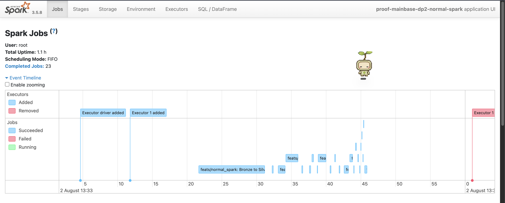

**Note:** the `proof-mainbase-dp2-normal-spark` application completed `23` jobs in FIFO mode with no failed jobs. The timeline establishes the baseline application and shows the build and validation actions completing between approximately `13:33:21` and `13:33:45`.

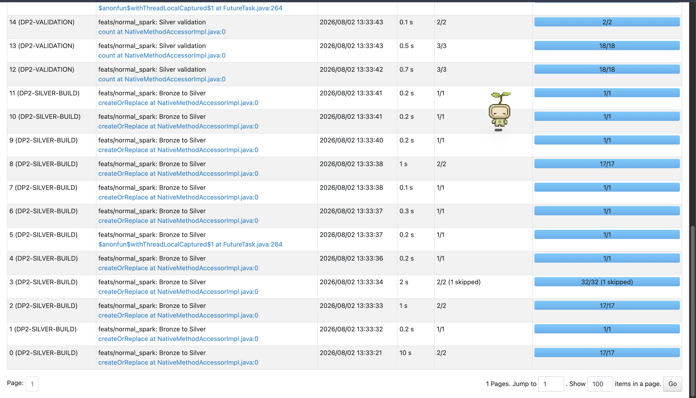

**Note:** Jobs `0-11` belong to `DP2-SILVER-BUILD`, and Jobs `12-14` show the beginning of `DP2-VALIDATION`. Job `0` was submitted at `13:33:21` and took approximately `10 s`; all visible jobs succeeded, and Spark reports the skipped stage separately rather than as a failure.

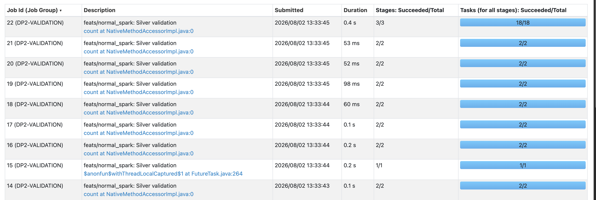

**Note:** Jobs `14-22` complete the Silver validation group. Job `22`, the final scheduler job, was submitted at `13:33:45`, completed all `18/18` tasks, and provides the visible end boundary for the baseline run.

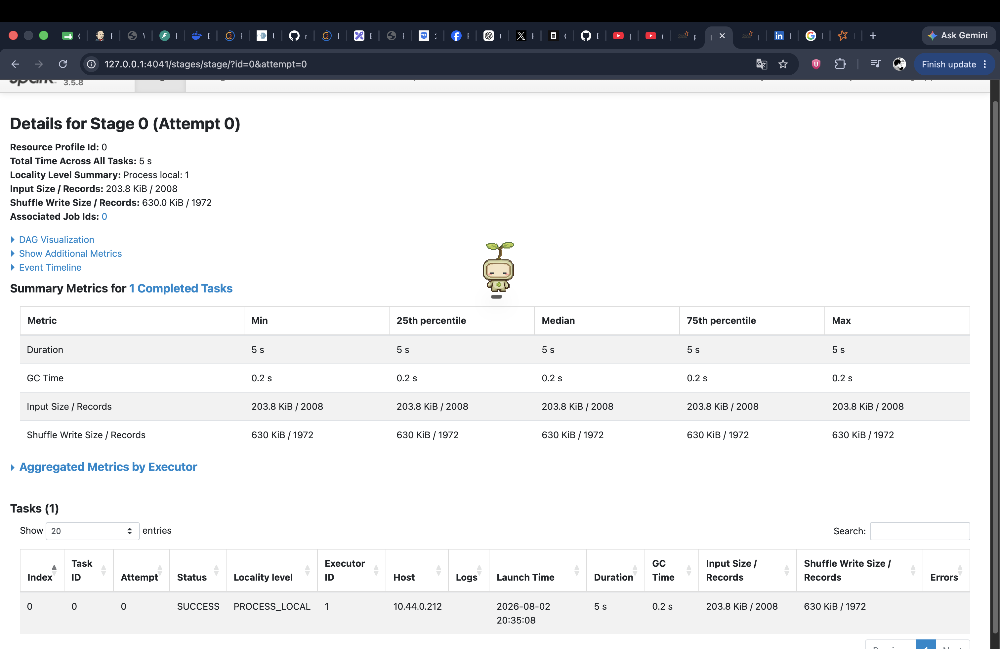

**Note:** Job `0`, Stage `0` executed one task for `5 s`, reading `203.8 KiB / 2,008 records` and writing `630.0 KiB / 1,972 shuffle records`. This is the baseline input and shuffle-volume reference used to verify that the optimized run processed the same source workload.

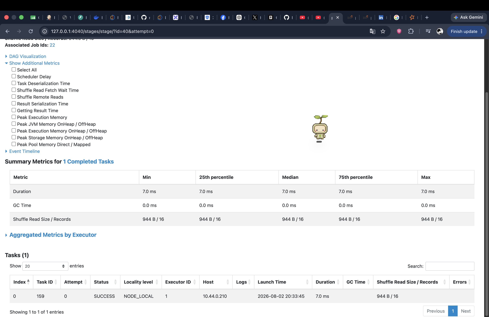

**Note:** Job `22`, Stage `40` is the final validation stage. Its single task completed in `7 ms`, read `944 B / 16 shuffle records`, and reported no GC time or errors. Together with the first and last REST timestamps, the baseline end-to-end compute span is `24.249 s`.

##### Data Skew

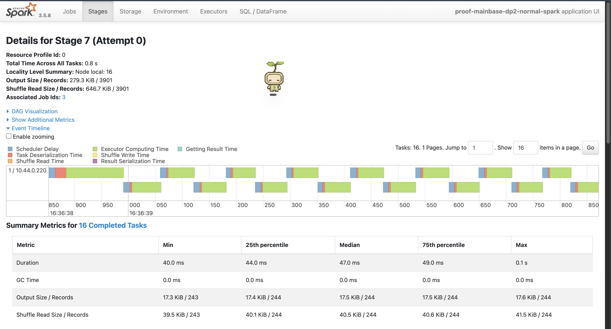

**Note:** Job `3`, Stage `7` is the multi-task stage used to inspect partition balance in the normal application. It executed `16` tasks, read `646.7 KiB / 3,901 shuffle records`, and wrote `279.3 KiB / 3,901 records`. The median task duration was `47 ms`, while the UI-rounded maximum was `0.1 s` (approximately `2.1x` the median). A max task duration noticeably above the median is a **data-skew/straggler warning signal** because it shows that one task remained active longer than the typical task. Spark's Web UI exposes task-duration distributions together with shuffle records, spill, GC, and scheduler delay specifically so the slow task can be investigated. In this capture, however, each task processed approximately `243-244` records, so the duration gap is evidence of task-time imbalance but is not sufficient on its own to attribute the delay conclusively to an oversized data partition.

Official Spark references:

- [Spark 3.5.8 Web UI: Stage detail and task summary metrics](https://spark.apache.org/docs/3.5.8/web-ui.html) documents duration, shuffle read/write, GC, spill, scheduler delay, and task-level details as the metrics used to investigate stage imbalance.
- [Spark SQL performance tuning: Optimizing Skew Join](https://spark.apache.org/docs/3.5.5/sql-performance-tuning.html#optimizing-skew-join) defines Spark's default automatic skew criterion by partition size: a partition must be larger than `5x` the median and larger than `256 MiB`. Therefore, a `2.1x` duration ratio is a useful warning signal, not proof that Spark's AQE skew threshold was met.

##### Data Skew Handling

**Technique:** the skew-handling branch enables Spark SQL Adaptive Query Execution (AQE). Adaptive partition coalescing is enabled with `parallelismFirst=false` and a `128 MiB` advisory partition size. Spark 3.5 also reports `spark.sql.adaptive.skewJoin.enabled=true` when AQE is active, allowing an eligible skewed sort-merge-join partition to be split at runtime. DP2 applies these settings while cleaning, deduplicating, joining, and writing the Silver Iceberg tables.

Reference code:

- [session.py (line 21)](https://file+.vscode-resource.vscode-cdn.net/Users/KHOAI/anhkhoa/RecSys-MLops/apps/data-platform/src/features/spark/session.py#L21) — **Note:** enables Spark SQL Adaptive Query Execution, which allows Spark to revise the physical plan using runtime statistics.
- [session.py (line 22)](https://file+.vscode-resource.vscode-cdn.net/Users/KHOAI/anhkhoa/RecSys-MLops/apps/data-platform/src/features/spark/session.py#L22) — **Note:** enables adaptive shuffle-partition coalescing so Spark can merge undersized post-shuffle partitions.
- [session.py (line 23)](https://file+.vscode-resource.vscode-cdn.net/Users/KHOAI/anhkhoa/RecSys-MLops/apps/data-platform/src/features/spark/session.py#L23) — **Note:** sets `parallelismFirst=false`, making the configured advisory partition size the primary coalescing target.
- [session.py (line 26)](https://file+.vscode-resource.vscode-cdn.net/Users/KHOAI/anhkhoa/RecSys-MLops/apps/data-platform/src/features/spark/session.py#L26) — **Note:** configures the AQE advisory partition-size property; the following line supplies the environment override or `128 MiB` default.
- [build_silver_tables.py (line 69)](https://file+.vscode-resource.vscode-cdn.net/Users/KHOAI/anhkhoa/RecSys-MLops/apps/data-platform/src/features/spark/build_silver_tables.py#L69) — **Note:** performs the `order_items` to `orders` join on `order_id`, the DP2 join path on which eligible runtime skew handling can be applied.
- [build_silver_tables.py (line 117)](https://file+.vscode-resource.vscode-cdn.net/Users/KHOAI/anhkhoa/RecSys-MLops/apps/data-platform/src/features/spark/build_silver_tables.py#L117) — **Note:** writes every constructed Silver DataFrame to Iceberg under the AQE-enabled Spark session.
- [e2e-1k.yaml (line 33)](https://file+.vscode-resource.vscode-cdn.net/Users/KHOAI/anhkhoa/RecSys-MLops/configs/data-platform/generator/e2e-1k.yaml#L33) — **Note:** begins the generator's skew-problem configuration used to produce an intentionally imbalanced input distribution.
- [e2e-1k.yaml (line 35)](https://file+.vscode-resource.vscode-cdn.net/Users/KHOAI/anhkhoa/RecSys-MLops/configs/data-platform/generator/e2e-1k.yaml#L35) — **Note:** assigns `96%` of generated city values to the top city, creating the controlled hot-key distribution.

##### Data Skew Handling Proof

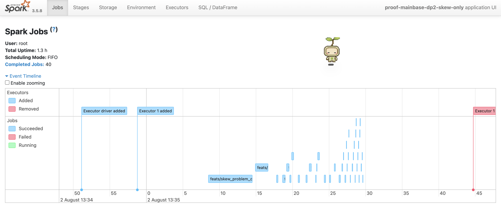

**Note:** the `proof-mainbase-dp2-skew-only` application completed `40` jobs successfully. The denser timeline reflects AQE query-stage materialization and adaptive replanning; the additional scheduler jobs are not additional business transformations.

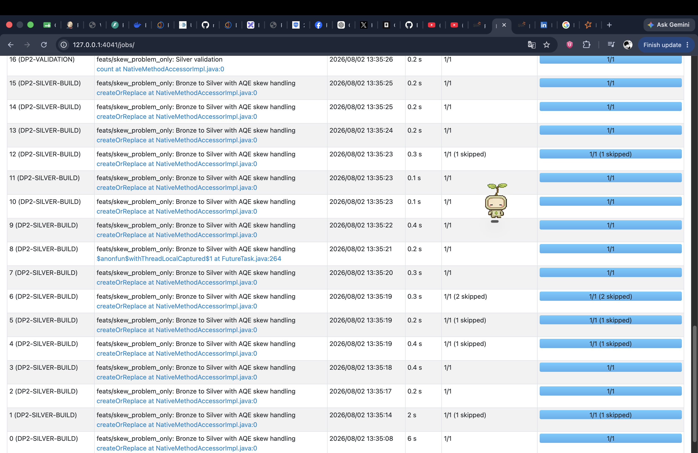

**Note:** Jobs `0-15` are the AQE-enabled `DP2-SILVER-BUILD` group. Job `0` began at `13:35:08` and took approximately `6 s`; later jobs are shorter, and the skipped stages shown for some jobs are expected when AQE replaces an initial plan with an adaptive final plan.

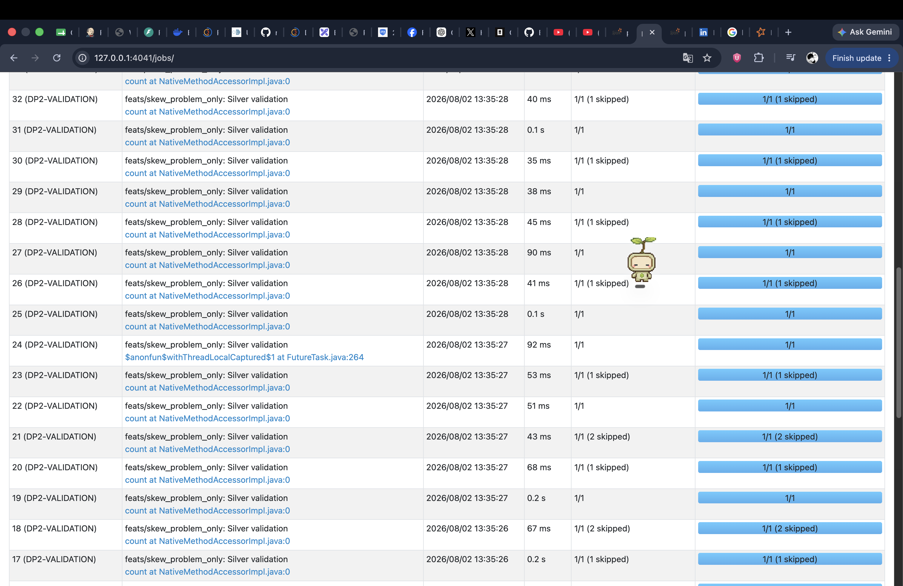

**Note:** this capture shows the middle of the `DP2-VALIDATION` group, including Jobs `17-32`. The visible actions complete successfully in roughly `35-200 ms`; skipped stages are AQE plan substitutions and do not represent failed validation.

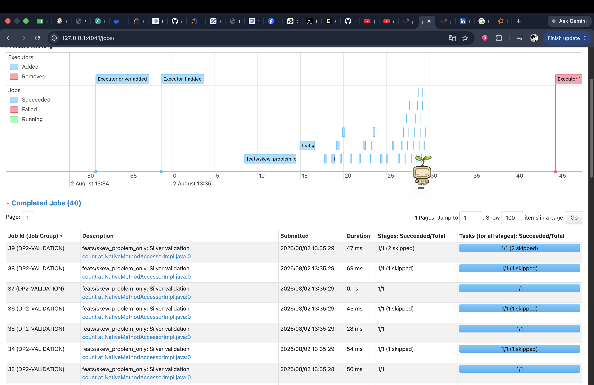

**Note:** Jobs `33-39` finish the validation group. Job `39`, the final scheduler job, was submitted at `13:35:29`; the application reports all `40` jobs completed and no failed jobs.

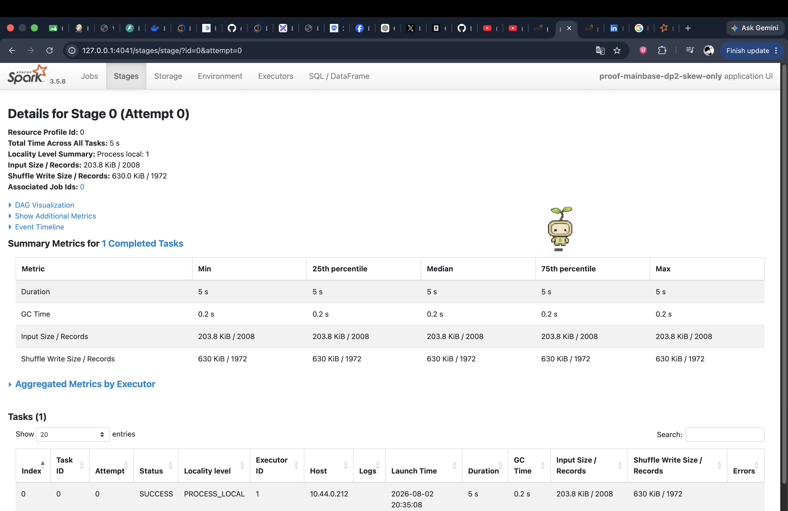

**Note:** the AQE-enabled Stage `0` processed the same `203.8 KiB / 2,008` input records and wrote the same `630.0 KiB / 1,972` shuffle records as the baseline Stage `0`. Its one executed task took `5 s`, supporting an input-equivalent comparison while not, by itself, proving that a skewed partition was split.

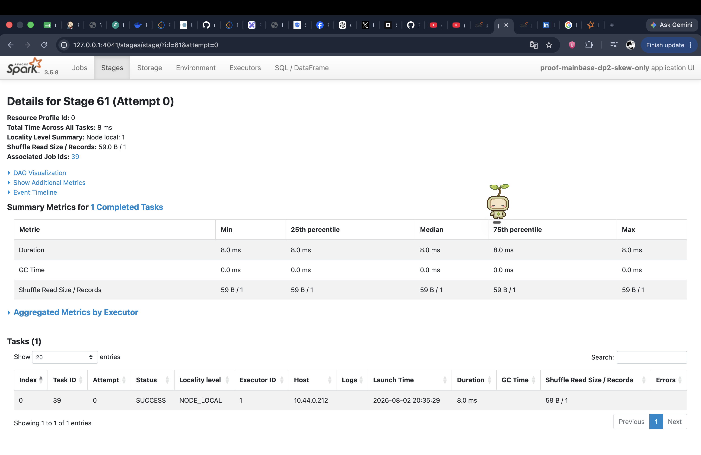

**Note:** this is the terminal-stage proof for the skew-handling run. Stage `61` is associated with the final Job `39`; its single task succeeded in `8 ms`, read `59 B / 1 shuffle record`, and launched at `20:35:29` in the browser's ICT display. That timestamp corresponds to `13:35:29 UTC/GMT` in the Jobs list and Spark REST data, confirming the end boundary used in the `21.157 s` latency calculation.

**Total-duration comparison:**

| DP2 variant | First submitted job | Final submitted job | Total execution duration |
|---|---:|---:|---:|
| Normal Spark | `13:33:21` | `13:33:45` | **`24.249 s`** |
| Data-skew handling | `13:35:08` | `13:35:29` | **`21.157 s`** |

The data-skew-handling run was `3.092 s` faster, an observed reduction of `12.75%` against the Normal Spark total duration.

**Note:** the AQE-enabled DP2 run completed `40` scheduler jobs: build jobs `0-15` and validation jobs `16-39`. Stage 0 processed the same `203.8 KiB / 2,008` input records and produced the same `630.0 KiB / 1,972` shuffle records, supporting an input-equivalent comparison. The extra scheduler jobs are AQE query-stage/materialization work and should not be interpreted as more business processing. The separate Normal Spark Job `3` / Stage `7` capture exposes a possible task-duration imbalance (`0.1 s` max versus `47 ms` median), which is a reason to enable and evaluate skew handling. Because the skew-handling Stage 0 capture itself has only one executed task, this evidence proves the AQE/skew-handling configuration and successful output-equivalent execution, but it does not by itself prove that Spark split a skewed partition. The total-duration reduction is therefore reported as an observed single-run result rather than a causal benchmark.

#### High Cardinality

##### Before Optimization: SQL/DataFrame Proof

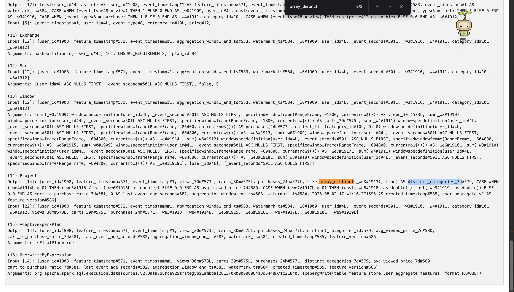

**Note:** in the `feats/skew_problem_only` DP3 application, SQL execution `5` builds `feature_store.user_aggregate_features`. Its Window operator first evaluates `collect_list(category_id)` over each user's seven-day window. The following Project evaluates `size(array_distinct(...)) AS distinct_categories_7d`. This plan materializes the category values before removing duplicates, so the aggregation state grows with the number of events and distinct categories in the window. The screenshot proves the high-cardinality-sensitive implementation; the small proof input (`1,972` rows) did not spill, so it should not be presented as a production-scale memory failure.

##### After Optimization Proof

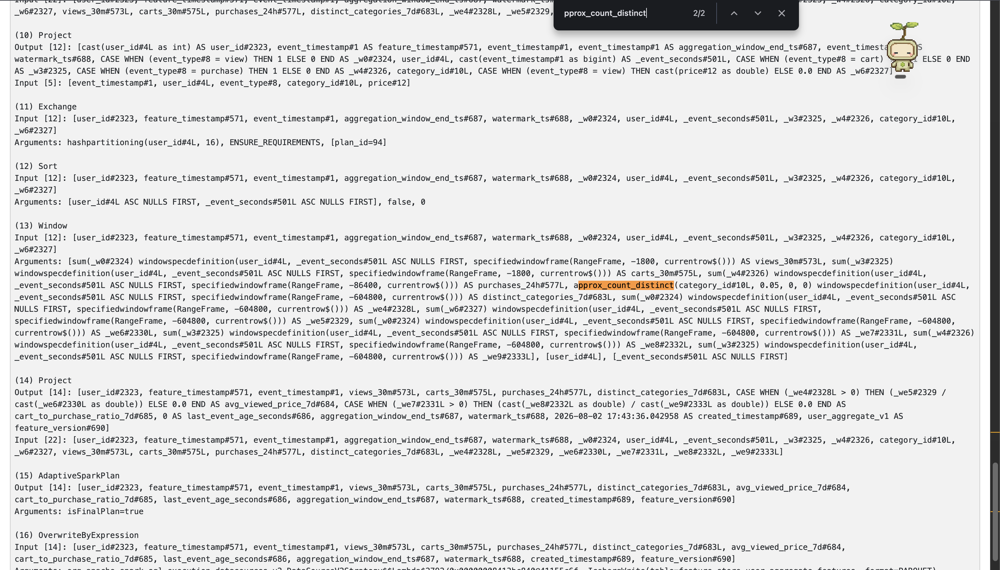

**Note:** in the `feats/skew_and_high_card` DP3 application, the matching SQL execution `5` computes `distinct_categories_7d` directly with `approx_count_distinct(category_id, 0.05)` over the same user-partitioned seven-day Window. The physical plan no longer contains the `collect_list -> array_distinct -> size` chain. This is execution-plan proof that the optimized branch uses an approximate distinct-count state instead of materializing the complete category array.

##### High Cardinality Handling Technique

**Technique:** replace the exact rolling distinct implementation with Spark's approximate distinct aggregate. The baseline collects every `category_id` in the window and then deduplicates the resulting array. The optimized implementation uses HyperLogLog++ through `approx_count_distinct` with a configured relative standard deviation of `0.05`. This bounds aggregation-state growth at the cost of an explicitly accepted approximate result while preserving the output field `distinct_categories_7d` and the same seven-day event-time window.

Before optimization (`feats/skew_problem_only`):

```python
F.size(
    F.array_distinct(
        F.collect_list(F.col("category_id")).over(w7d)
    )
).alias("distinct_categories_7d")
```

After optimization (`feats/skew_and_high_card` and `main`):

```python
CATEGORY_CARDINALITY_RSD = 0.05

F.approx_count_distinct("category_id", CATEGORY_CARDINALITY_RSD) \
    .over(w7d) \
    .alias("distinct_categories_7d")
```

Reference code:

- [build_user_aggregate_features.py (line 6)](https://file+.vscode-resource.vscode-cdn.net/Users/KHOAI/anhkhoa/RecSys-MLops/apps/data-platform/src/features/spark/build_user_aggregate_features.py#L6) — **Note:** sets the accepted relative standard deviation to `0.05`, controlling the accuracy and state-size trade-off of the approximate estimator.
- [build_user_aggregate_features.py (line 21)](https://file+.vscode-resource.vscode-cdn.net/Users/KHOAI/anhkhoa/RecSys-MLops/apps/data-platform/src/features/spark/build_user_aggregate_features.py#L21) — **Note:** partitions the ordered Window by `user_id`, keeping each user's rolling feature history logically separate.
- [build_user_aggregate_features.py (line 24)](https://file+.vscode-resource.vscode-cdn.net/Users/KHOAI/anhkhoa/RecSys-MLops/apps/data-platform/src/features/spark/build_user_aggregate_features.py#L24) — **Note:** defines the seven-day range used to calculate `distinct_categories_7d`.
- [build_user_aggregate_features.py (line 36)](https://file+.vscode-resource.vscode-cdn.net/Users/KHOAI/anhkhoa/RecSys-MLops/apps/data-platform/src/features/spark/build_user_aggregate_features.py#L36) — **Note:** applies `approx_count_distinct` directly to `category_id`, replacing the materialized `collect_list -> array_distinct` implementation.

##### Latency Drop

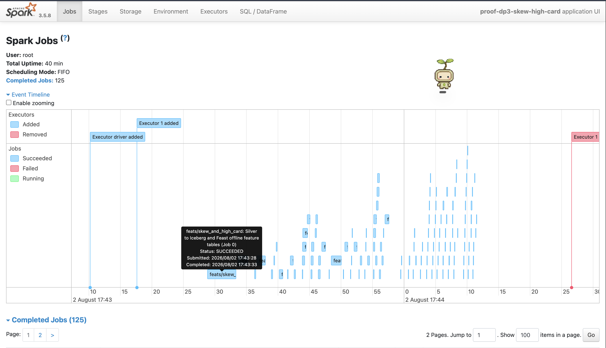

**Note:** the `proof-dp3-skew-high-card` application completed all `125` jobs successfully. The Job `0` tooltip shows the first scheduler job beginning at `17:43:28`; this identifies the start of the optimized compute span and confirms that the captured timeline belongs to the high-cardinality-handling branch.

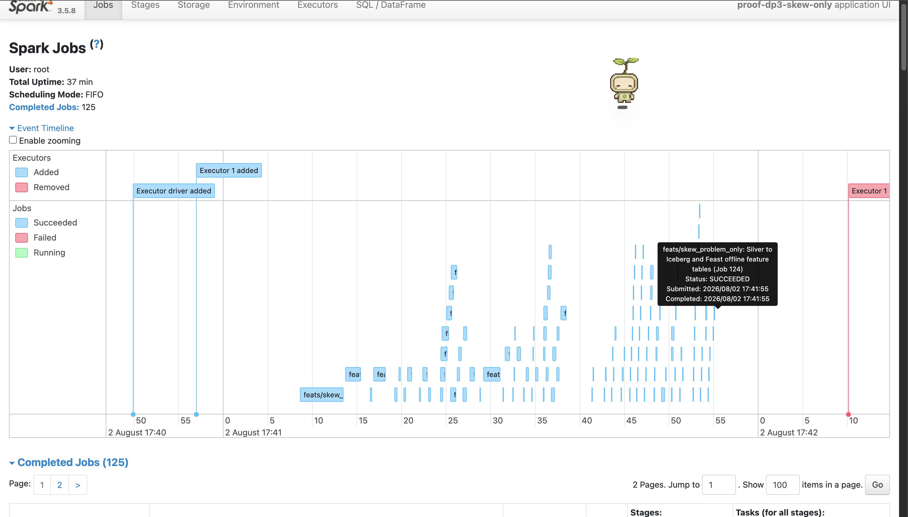

**Note:** the `proof-dp3-skew-only` application completed `125` jobs. Job `124`, the final scheduler job, completed at `17:41:55`. The Spark REST timestamps provide millisecond precision: first submission `17:41:08.608`, final completion `17:41:55.060`, giving an observed end-to-end compute span of `46.452 s`.

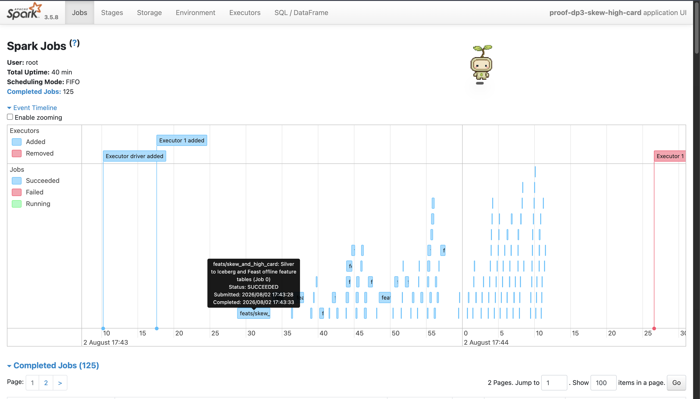

**Note:** Job `0` of `proof-dp3-skew-high-card` was submitted at `17:43:28` and completed at `17:43:33`. The corresponding REST submission timestamp used for the duration calculation is `17:43:28.779`.

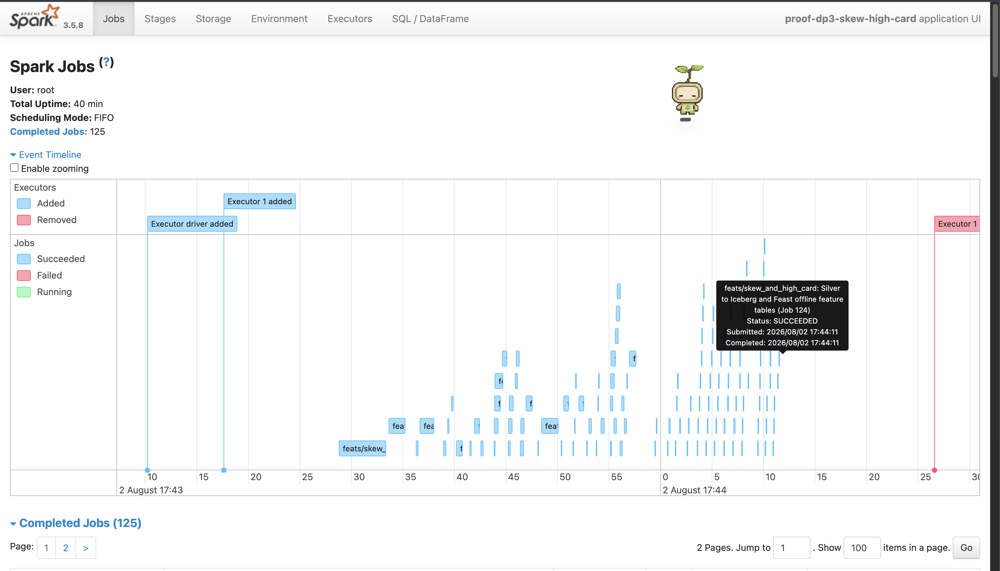

**Note:** Job `124` completed at `17:44:11`. The corresponding REST completion timestamp is `17:44:11.476`, giving an optimized end-to-end compute span of `42.697 s`.

| DP3 run | First job submission | Last job completion | Observed compute span |
|---|---:|---:|---:|
| Data-skew handling only; exact cardinality | `17:41:08.608` | `17:41:55.060` | **`46.452 s`** |
| Data-skew plus high-cardinality handling | `17:43:28.779` | `17:44:11.476` | **`42.697 s`** |

The optimized run was `3.755 s` faster end to end, an observed reduction of **`8.08%`**. The SQL executions whose plans contain `distinct_categories_7d` (`5`, `13`, `15`, and `19`) decreased in aggregate from `4.065 s` to `3.993 s`, a smaller reduction of `72 ms` or **`1.77%`**. SQL execution `5`, the primary `user_aggregate_features` materialization, changed from `1.980 s` to `2.008 s`; therefore the full end-to-end reduction must not be attributed solely to `approx_count_distinct`. This is a controlled single-run observation on a small input, while the stronger high-cardinality evidence is the physical-plan change from an unbounded collected array to bounded approximate aggregation state.

#### Schema Evolution

**Failure-proof capture command**

```bash
git show \
  501b8ef49719ad0bc9bd3fe95987308198f38ca2:infra/k8s/processing-baseline/spark-schema-evolution-fail-job.yaml \
  > /tmp/spark-schema-evolution-fail-job.yaml
kubectl apply -f /tmp/spark-schema-evolution-fail-job.yaml
kubectl wait --for=condition=failed job/spark-schema-evolution-fail-proof -n recsys-dataflow --timeout=5m
kubectl logs -n recsys-dataflow job/spark-schema-evolution-fail-proof
```

Capture these log lines:

```text
ValueError: unsupported behavior_events schema_version=3
Task 0 in stage 13.0 failed 1 times; aborting job
```

**Image proof: Spark UI counts breaking schema rows before normalization**

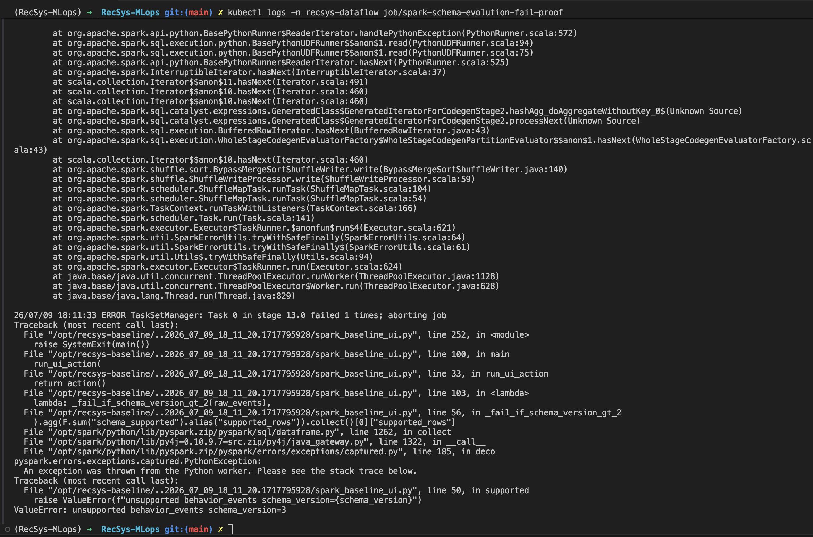

**Figure: Spark UI schema-evolution proof from `docs/pngs/schema_evolution_proof.png`.** This image should show the Spark SQL/DataFrame execution labelled `DP3 CHECK - count breaking schema_version rows before silver normalization`. The stable evidence is the execution description plus the DAG `Filter` metric showing rows where `schema_version > 2`. In the current proof run, this filter outputs `6,774` rows, meaning the lakehouse contains breaking schema v3 events before the batch job normalizes or exports data to the Feast PostgreSQL offline store.

**Note for capture:** do not rely on the numeric SQL execution id because Spark regenerates ids after every rerun. Use browser search for `DP3 CHECK - count breaking schema_version rows before silver normalization`, then capture the full Spark UI page with the `Filter` node and `number of output rows` visible.

**Figure: Spark schema-evolution failure proof.** Capture the `kubectl logs` output from `spark-schema-evolution-fail-proof`. The important evidence is `ValueError: unsupported behavior_events schema_version=3`, followed by Spark aborting the task. This shows the failure mode explicitly: if the batch contract only supports v1/v2 and a breaking v3 event arrives, the Spark task fails instead of silently writing bad data.

**What to point out in the screenshot:** the generator has three schema phases: v1 old rows before `2026-03-23`, v2 evolved rows from `2026-03-23`, and v3 breaking rows from `2026-03-27`. The normal baseline Spark job counts v3 rows in the UI, while the fail-proof job intentionally treats v3 as unsupported to demonstrate the runtime schema-evolution problem.

**Analysis:** historical rows before the schema cutover may not have the same evolved fields as newer rows, and future rows may introduce a breaking contract. The normal baseline Spark job preserves old valid rows by normalizing missing fields, but the separate fail-proof job proves why schema contracts matter: an incompatible `schema_version=3` breaks the Spark task before offline-store export.

Code reference:

- [e2e-1k.yaml](../../../configs/data-platform/generator/e2e-1k.yaml), [e2e-1k.yaml](../../../configs/data-platform/generator/e2e-1k.yaml): schema evolution dates and breaking version.
- [simulation.py (line 234)](../../../apps/data-platform/data-generator/src/offline/simulation.py#L234), [simulation.py (line 236)](../../../apps/data-platform/data-generator/src/offline/simulation.py#L236), [simulation.py (line 238)](../../../apps/data-platform/data-generator/src/offline/simulation.py#L238), [simulation.py (line 240)](../../../apps/data-platform/data-generator/src/offline/simulation.py#L240), [simulation.py (line 288)](../../../apps/data-platform/data-generator/src/offline/simulation.py#L288), [simulation.py (line 290)](../../../apps/data-platform/data-generator/src/offline/simulation.py#L290), [simulation.py (line 292)](../../../apps/data-platform/data-generator/src/offline/simulation.py#L292): v3/v1/v2 selection and version-dependent request-field population.
- [build_silver_tables.py (line 17)](../../../apps/data-platform/src/features/spark/build_silver_tables.py#L17), [build_silver_tables.py (line 28)](../../../apps/data-platform/src/features/spark/build_silver_tables.py#L28), [build_silver_tables.py (line 30)](../../../apps/data-platform/src/features/spark/build_silver_tables.py#L30), [build_silver_tables.py (line 41)](../../../apps/data-platform/src/features/spark/build_silver_tables.py#L41), [build_silver_tables.py (line 45)](../../../apps/data-platform/src/features/spark/build_silver_tables.py#L45): compatible-column normalization, schema-version gating, and event-ID deduplication.
- [spark-baseline-ui-job.yaml (line 55)](https://github.com/itsmekhoathekid/RecSys-MLops/blob/6cdcc35b31116f739fb4ee43b526bbc67a7ad686/infra/k8s/processing-baseline/spark-baseline-ui-job.yaml#L55), [spark-baseline-ui-job.yaml (line 125)](https://github.com/itsmekhoathekid/RecSys-MLops/blob/6cdcc35b31116f739fb4ee43b526bbc67a7ad686/infra/k8s/processing-baseline/spark-baseline-ui-job.yaml#L125), [spark-baseline-ui-job.yaml (line 130)](https://github.com/itsmekhoathekid/RecSys-MLops/blob/6cdcc35b31116f739fb4ee43b526bbc67a7ad686/infra/k8s/processing-baseline/spark-baseline-ui-job.yaml#L130): fail helper, breaking-row count, and optional fail-proof action.
- [spark-schema-evolution-fail-job.yaml (line 26)](https://github.com/itsmekhoathekid/RecSys-MLops/blob/501b8ef49719ad0bc9bd3fe95987308198f38ca2/infra/k8s/processing-baseline/spark-schema-evolution-fail-job.yaml#L26), [spark-schema-evolution-fail-job.yaml (line 47)](https://github.com/itsmekhoathekid/RecSys-MLops/blob/501b8ef49719ad0bc9bd3fe95987308198f38ca2/infra/k8s/processing-baseline/spark-schema-evolution-fail-job.yaml#L47): Spark submission and `--fail-on-breaking-schema` flag in the intentional failure manifest.

#### Duplicate Records, Events

Use the checked-in generator summary for source-side duplicate counts and the Spark UI job for the post-deduplication check:

```bash
PYTHONPATH=apps/data-platform/data-generator/src uv run python \
  apps/data-platform/data-generator/src/scripts/summarize_generation_quality.py \
  --config configs/data-platform/generator/e2e-1k.yaml \
  --lake-root data_platform/lake | \
  awk '/## Duplicate Rate Before And After Dedup/{flag=1} /^## Injected Vs Observed/{flag=0} flag'
```

**Image proof: duplicate events detected in generated data**

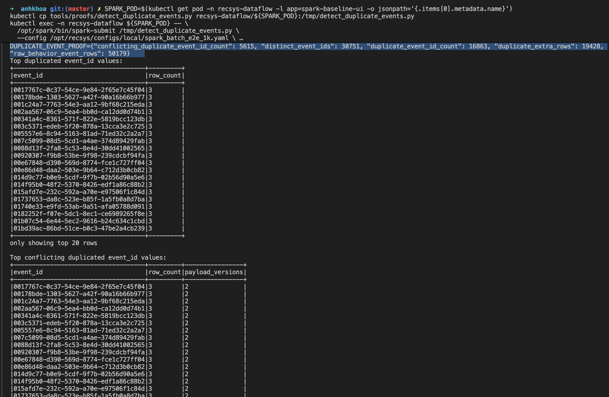

**Figure: Duplicate-event proof from `docs/pngs/duplicate_events_proof.png`.** The capture records raw row count, distinct event IDs, and exact duplicate rows from the generated input used by the Spark proof.

**Spark UI companion proof:** capture the Spark UI action labelled `DP3 CHECK - count supported rows removed by dropDuplicates(event_id)`. It subtracts the clean behavior-event count from the supported raw-event count, so it reports the rows removed by `.dropDuplicates(["event_id"])` without mixing in unsupported-schema rows.

**Analysis:** the generator injects exact duplicates. The Silver builder normalizes supported rows and calls `.dropDuplicates(["event_id"])` before offline-store export. Spark keeps one arbitrary row for each duplicate event ID; this implementation does not promise that the surviving row has the latest `ingestion_ts`. `silver_rejected_behavior_events` now contains unsupported-schema rows only, not the rows removed by deduplication.

Code reference:

- [e2e-1k.yaml](../../../configs/data-platform/generator/e2e-1k.yaml), [e2e-1k.yaml](../../../configs/data-platform/generator/e2e-1k.yaml): exact-duplicate rate.
- [exact_duplicate.py (line 13)](../../../apps/data-platform/data-generator/src/offline/problems/exact_duplicate.py#L13), [exact_duplicate.py (line 14)](../../../apps/data-platform/data-generator/src/offline/problems/exact_duplicate.py#L14): selects exact duplicate events using the configured rate.
- [problem_pipeline.py (line 43)](../../../apps/data-platform/data-generator/src/offline/problem_pipeline.py#L43), [problem_pipeline.py (line 44)](../../../apps/data-platform/data-generator/src/offline/problem_pipeline.py#L44): injects the selected rows into the offline output.
- [summarize_generation_quality.py (line 119)](../../../apps/data-platform/data-generator/src/scripts/summarize_generation_quality.py#L119), [summarize_generation_quality.py (line 122)](../../../apps/data-platform/data-generator/src/scripts/summarize_generation_quality.py#L122), [summarize_generation_quality.py (line 123)](../../../apps/data-platform/data-generator/src/scripts/summarize_generation_quality.py#L123), [summarize_generation_quality.py (line 126)](../../../apps/data-platform/data-generator/src/scripts/summarize_generation_quality.py#L126): raw-row, repeated-event-ID, and exact `(event_id, payload_hash)` duplicate calculations.
- [build_silver_tables.py (line 41)](../../../apps/data-platform/src/features/spark/build_silver_tables.py#L41), [build_silver_tables.py (line 44)](../../../apps/data-platform/src/features/spark/build_silver_tables.py#L44), [build_silver_tables.py (line 45)](../../../apps/data-platform/src/features/spark/build_silver_tables.py#L45), [build_silver_tables.py (line 46)](../../../apps/data-platform/src/features/spark/build_silver_tables.py#L46): quarantines unsupported schemas, gates supported rows, applies `.dropDuplicates(["event_id"])`, and returns the clean/rejected outputs.
- [spark-baseline-ui-job.yaml (line 150)](https://github.com/itsmekhoathekid/RecSys-MLops/blob/6cdcc35b31116f739fb4ee43b526bbc67a7ad686/infra/k8s/processing-baseline/spark-baseline-ui-job.yaml#L150), [spark-baseline-ui-job.yaml (line 152)](https://github.com/itsmekhoathekid/RecSys-MLops/blob/6cdcc35b31116f739fb4ee43b526bbc67a7ad686/infra/k8s/processing-baseline/spark-baseline-ui-job.yaml#L152), [spark-baseline-ui-job.yaml (line 153)](https://github.com/itsmekhoathekid/RecSys-MLops/blob/6cdcc35b31116f739fb4ee43b526bbc67a7ad686/infra/k8s/processing-baseline/spark-baseline-ui-job.yaml#L153): Spark UI action and input-minus-clean count for rows removed by event-ID deduplication.

### Develop Batch Processing Script To Handle Offline Problems

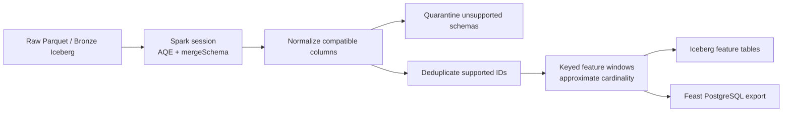
```mermaid
flowchart LR
    A["Raw Parquet / Bronze Iceberg"] --> B["Spark session<br/>AQE + mergeSchema"]
    B --> C["Normalize compatible columns"]
    C --> D["Quarantine unsupported schemas"]
    C --> E["Deduplicate supported IDs"]
    E --> F["Keyed feature windows<br/>approximate cardinality"]
    F --> G["Iceberg feature tables"]
    F --> H["Feast PostgreSQL export"]
```

Step-by-step problem handling:

1. **Skew:** [`spark_session()`](../../../apps/data-platform/src/features/spark/session.py#L15) enables AQE, partition coalescing, and advisory partition sizing so Spark can revise shuffle partitions at runtime. Reference: [Spark Adaptive Query Execution](https://spark.apache.org/docs/latest/sql-performance-tuning.html#adaptive-query-execution).
2. **Schema evolution:** DP1 reads partitioned Parquet with [`mergeSchema=true`](../../../apps/data-platform/src/features/spark/session.py#L58) and commits Bronze Iceberg at [batch_lakehouse_ingestion.py line 91](../../../apps/data-platform/src/ingest/batch_lakehouse_ingestion.py#L91). DP2 fills compatible V1 fields and splits unsupported V3+ rows in [`build_clean_behavior_events()`](../../../apps/data-platform/src/features/spark/build_silver_tables.py#L25). Reference: [Spark Parquet Schema Merging](https://spark.apache.org/docs/latest/sql-data-sources-parquet.html#schema-merging).
3. **Duplicate events:** supported behavior events use [`.dropDuplicates(["event_id"])`](../../../apps/data-platform/src/features/spark/build_silver_tables.py#L45), while impressions deduplicate by `impression_id` at [line 49](../../../apps/data-platform/src/features/spark/build_silver_tables.py#L49). Reference: [PySpark `dropDuplicates`](https://spark.apache.org/docs/latest/api/python/reference/pyspark.sql/api/pyspark.sql.DataFrame.dropDuplicates.html).
4. **High cardinality:** the seven-day per-user window uses [`approx_count_distinct(category_id, 0.05)`](../../../apps/data-platform/src/features/spark/build_user_aggregate_features.py#L36) instead of collecting every category ID. Reference: [PySpark `approx_count_distinct`](https://spark.apache.org/docs/latest/api/python/reference/pyspark.sql/api/pyspark.sql.functions.approx_count_distinct.html).
5. **Feature output:** [`_build_feature_outputs()`](../../../apps/data-platform/src/features/spark/dp3_offline_feature_entrypoint.py#L54) builds user, item, label, and training tables; [`run_dp3_offline_features()`](../../../apps/data-platform/src/features/spark/dp3_offline_feature_entrypoint.py#L159) writes Iceberg, optional Parquet/Feast PostgreSQL, and validates the result.

### View Spark UI To Show Problems Have Been Minimized

#### Reproducible Baseline/Production Comparison

The current reproducible comparison uses the checked-in baseline Kubernetes job and the production Spark session. The captured comparison artifact and UI screenshots below remain the numeric and visual proof from the earlier optimization run.

```bash
git show \
  6cdcc35b31116f739fb4ee43b526bbc67a7ad686:infra/k8s/processing-baseline/spark-baseline-ui-job.yaml \
  > /tmp/spark-baseline-ui-job.yaml
kubectl apply -f /tmp/spark-baseline-ui-job.yaml
kubectl -n recsys-dataflow wait --for=condition=complete job/spark-baseline-ui --timeout=20m
kubectl -n recsys-dataflow logs job/spark-baseline-ui | \
  grep -E 'SPARK_LAKEHOUSE_TO_OFFLINE_STORE_BASELINE|DP3 (HEAVY SQL|CHECK)'
```

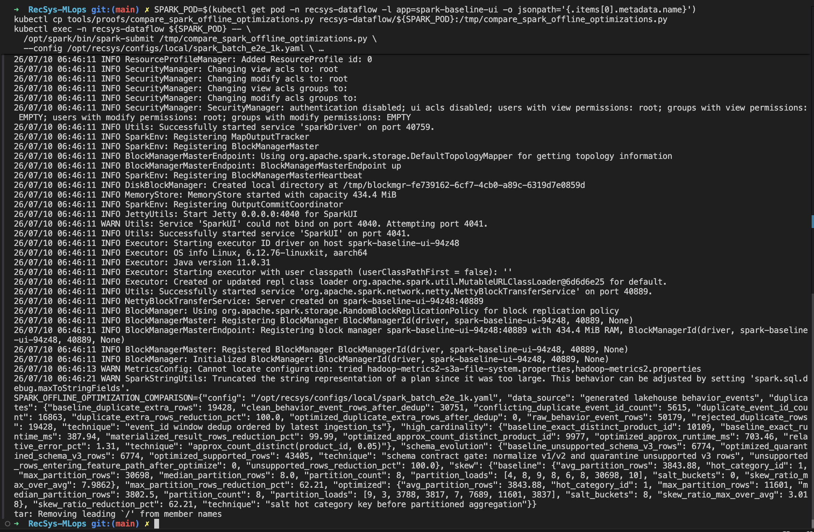

**Figure: Spark offline optimization comparison run.** The screenshot captures the comparison script running inside the Spark proof pod. The highlighted `SPARK_OFFLINE_OPTIMIZATION_COMPARISON={...}` line is the compact proof to pair with the Spark UI captures: it reports baseline and optimized values for skew, high cardinality, schema evolution, and duplicate events from the same local lakehouse input. For duplication, the captured run starts with `50,179` raw behavior-event rows, identifies `19,428` extra duplicate rows across `16,863` repeated event IDs (including `5,615` IDs with conflicting payloads), and produces `30,751` clean rows with `0` duplicate extras remaining, reported as a `100%` duplicate-extra-row reduction. The technique label embedded in this historical artifact refers to the earlier ordered-window implementation; the current production cleaner uses native Spark `.dropDuplicates(["event_id"])` and therefore guarantees one supported row per event ID but does not guarantee that the retained row has the latest `ingestion_ts`.

Current comparison report:

- [spark_offline_optimization_comparison.json (line 1)](spark_offline_optimization_comparison.json#L1): baseline vs optimized comparison output from the latest run.

**Result explanation from the artifact:** skew salting reduced max partition rows from `30,698` to `11,601`, so the hottest partition pressure dropped by `62.21%`. The partition skew ratio moved from `7.9862` to `3.018`, matching the more balanced Spark UI task distribution below. For high cardinality, exact `product_id` distinct count was `10,109`; the optimized `approx_count_distinct(product_id, 0.05)` estimate was `9,977`, only `1.31%` away from exact while avoiding a full exact distinct materialization for monitoring. Schema handling quarantined all `6,774` unsupported v3 rows before the feature path. Duplicate handling removed `19,428` extra duplicate rows, leaving `0` duplicate extras after dedup.

## Flink Job To Handle Streaming Data Problems

The streaming path uses PostgreSQL CDC to Kafka topic `cdc.behavior_events`, then two continuous Flink jobs process events into feature stores:

- Offline-store Flink job writes processed streaming features to the Feast PostgreSQL offline feature store.
- Online-store Flink job writes low-latency online features to Redis.

The captured baseline/optimized proof used two TaskManagers with one slot each and parallelism one so the screenshots compare the graphs under the same topology. The current deployment still starts each job at parallelism one, but may autoscale sustained production load after that historical comparison.

Code reference:

- [The online deployment](../../../infra/helm/recsys-streaming/templates/realtime-flink-consumer.yaml#L66) gives the Redis job its own Kafka consumer group.
- [The offline deployment](../../../infra/helm/recsys-streaming/templates/realtime-flink-consumer.yaml#L183) gives the PostgreSQL job a different Kafka consumer group.
- [source.py (line 132)](../../../apps/data-platform/src/features/flink/source.py#L132): builds the native `KafkaSource`.
- [realtime_stream_job.py (line 119)](../../../apps/data-platform/src/features/flink/realtime_stream_job.py#L119): connects reusable operators into the production event-time graph.
- [realtime_stream_job.py (line 89)](../../../apps/data-platform/src/features/flink/realtime_stream_job.py#L89): attaches the async Redis writer.
- [realtime_stream_job.py (line 100)](../../../apps/data-platform/src/features/flink/realtime_stream_job.py#L100): attaches the async PostgreSQL writer.

### View Flink UI To Show Baseline Problems

These screenshots are the **before-optimization baseline**, captured on 18 July 2026 from the GCP deployment built from branch `feats/unoptimized-processing-metrics` (commit `6f25ad7`). The online job uses Kafka consumer group `recsys-flink-baseline-online-store`; the equivalent offline job uses `recsys-flink-baseline-offline-store`. Both baseline jobs retain the same three late-event counters as the optimized build so that the two runs can be compared with the same definitions.

The baseline graph can be distinguished from the optimized graph by its manual `KEYED PROCESS, streaming-quality-window-metrics` operator. A clean-looking graph is not evidence of optimization: the runtime overlays and tabs below show that this graph reaches high backpressure and accumulates too-late events under the stress workload.

#### Bursty Traffic

The stress producer emits `40` events on a normal one-second tick and multiplies every fifth tick by eight, producing a `320`-event burst. The following captures show how the unoptimized job reacts.

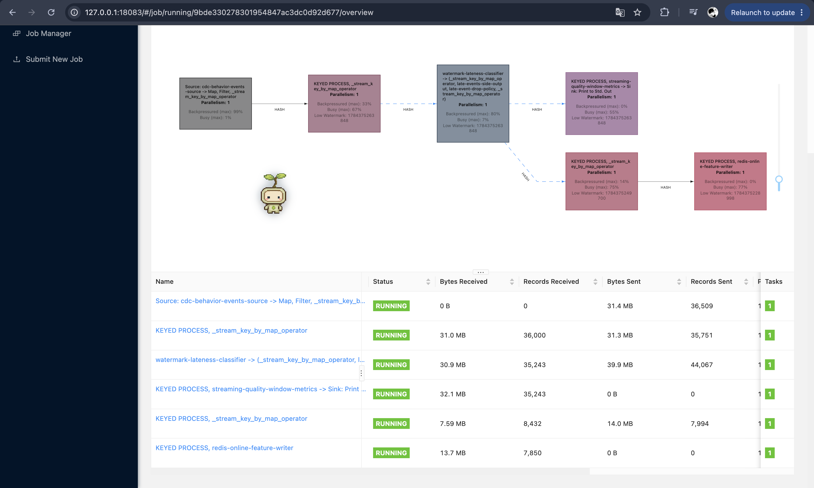

**Figure: Unoptimized Flink baseline overview under burst traffic.** The real CDC-to-Redis online job is `RUNNING`, but the graph overlay records severe pressure: the source reaches `Backpressured (max): 99%`, the `watermark-lateness-classifier` reaches `80%`, and the feature branch remains busy up to `77%`. The table also shows records continuing to move through every stage. This is evidence of a live but saturated baseline, not a stopped or failed job.

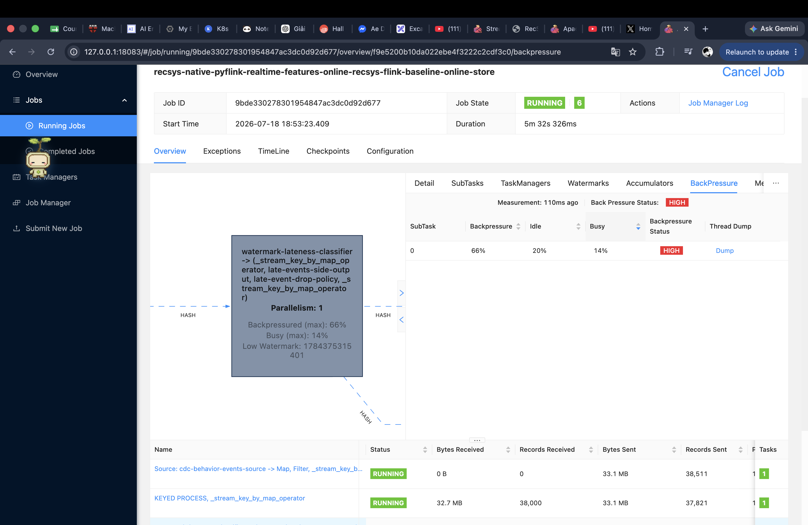

**Figure: Unoptimized Flink baseline reports `HIGH` backpressure.** On the selected `watermark-lateness-classifier` subtask, Flink reports `66%` backpressured, `20%` idle, and `14%` busy, with the overall status marked `HIGH`. The job is still `RUNNING`; therefore the red status is direct runtime evidence that the burst workload is propagating downstream pressure through the manual baseline graph.

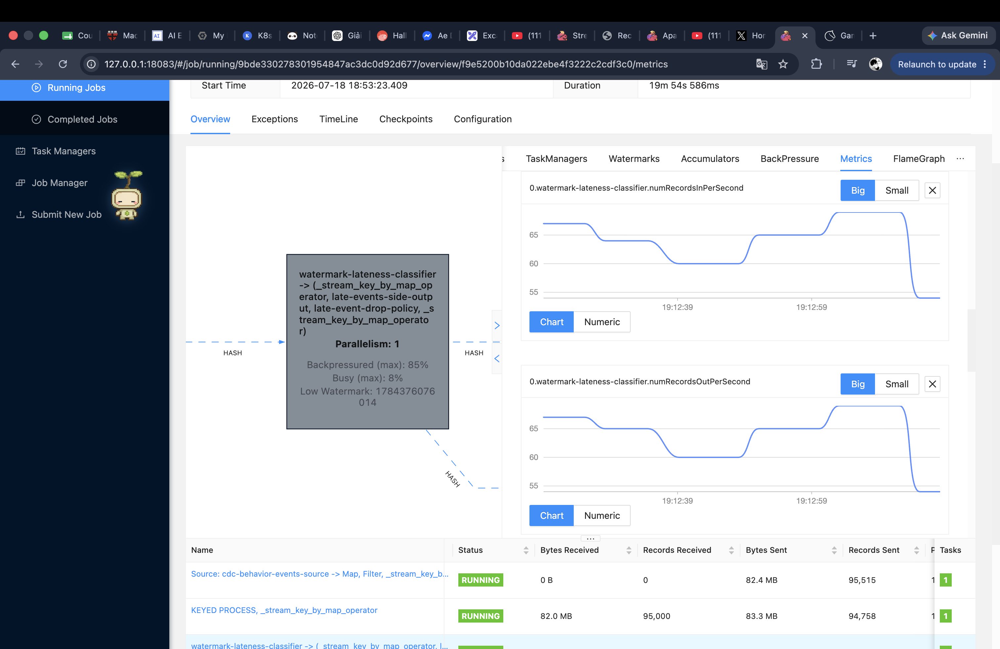

**Figure: Unoptimized Flink baseline input and output rates during burst traffic.** The `watermark-lateness-classifier` input and output rates move together through repeated plateaus of approximately `60-69 records/s`, then drop to about `54 records/s` near the end of the capture. Flink displays rolling rates rather than the producer's instantaneous `320`-event burst tick, so the important signal is the repeated rate change while the selected operator simultaneously records `Backpressured (max): 85%`. Input and output remaining close also confirms that the job is still making progress rather than silently stalling.


**Figure: Unoptimized Flink baseline backpressure time versus busy time.** `backPressuredTimeMsPerSecond` rises from roughly `817` to above `910 ms/s` and remains above `830 ms/s` across the visible interval. Meanwhile, `busyTimeMsPerSecond` falls from just over `100` to about `50-75 ms/s`. This inverse pattern shows that the subtask is spending most of each second blocked by downstream pressure rather than executing useful processing work; the graph overlay independently reports a maximum backpressure of `83%`.


**Figure: Unoptimized Flink baseline mailbox latency and input-buffer queue.** The Netty input queue repeatedly expands from roughly `2` buffers to `15`, drains to about `6`, and then fills to `15` again. At the same time, mailbox p95 latency remains near `370 ms` for most of the interval before recovering to about `100 ms`. The recurring queue fill/drain cycle is direct evidence that burst input is being buffered and processed unevenly rather than flowing at a stable rate.

**Analysis:** `RUNNING` only proves liveness. Taken together, the screenshots show the complete baseline symptom chain: the rolling input/output rate changes, the input queue repeatedly fills, mailbox latency stays elevated, and the operator spends more than `800 ms` of many one-second intervals backpressured. The later optimized capture must replay the same `40 -> 320` workload and reduce backpressure, queue occupancy, and mailbox latency while preserving comparable throughput before claiming improvement.

Code reference:

- [e2e-2k.yaml](../../../configs/data-platform/generator/e2e-2k.yaml): configures 40 normal events per producer tick.
- [e2e-2k.yaml](../../../configs/data-platform/generator/e2e-2k.yaml): triggers a burst every fifth tick.
- [e2e-2k.yaml](../../../configs/data-platform/generator/e2e-2k.yaml): multiplies burst ticks by eight.
- [burst_traffic.py (line 6)](../../../apps/data-platform/data-generator/src/streaming/problems/burst_traffic.py#L6): calculates the per-tick event count.
- [producer.py (line 39)](../../../apps/data-platform/data-generator/src/streaming/producer.py#L39): applies the result in the live loop.
- [flink-baseline-ui-job.yaml (line 100)](https://github.com/itsmekhoathekid/RecSys-MLops/blob/67d306934261eed5e1c8fe401eef6a099fae13fb/infra/k8s/processing-baseline/flink-baseline-ui-job.yaml#L100): identifies the baseline online consumer group used by these screenshots.

#### Late Arrival Problems

The same stress run marks `28%` of newly generated events as late and backdates their event timestamps by `45-180` minutes. The baseline classifier compares each event timestamp with the current Flink watermark and exposes three cumulative counters:

- `late_arrivals_total`: every event for which `event_timestamp <= current_watermark`.
- `accepted_late_events_total`: a late event still inside the configured allowed-lateness/cleanup boundary.
- `too_late_events_total`: a late event beyond that boundary, which must not update the live feature window.

For a single subtask sampled at the same instant, the expected invariant is `late_arrivals_total = accepted_late_events_total + too_late_events_total`.

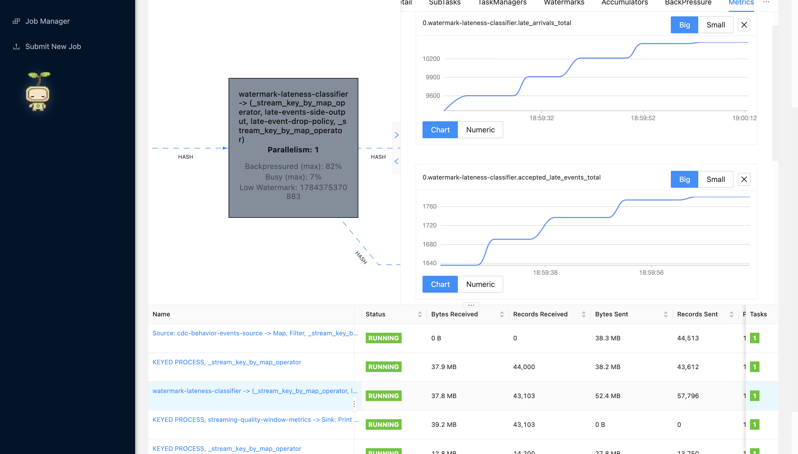

**Figure: Unoptimized Flink baseline late-arrival and accepted-late counters.** The Metrics tab on `watermark-lateness-classifier` shows both `late_arrivals_total` and `accepted_late_events_total` increasing in steps while records continue to enter the operator. Each step corresponds to another injected batch crossing the watermark; only the smaller accepted subset remains within allowed lateness. At the same time, the vertex overlay reaches `Backpressured (max): 82%`, linking the event-time problem proof to the pressured baseline run.

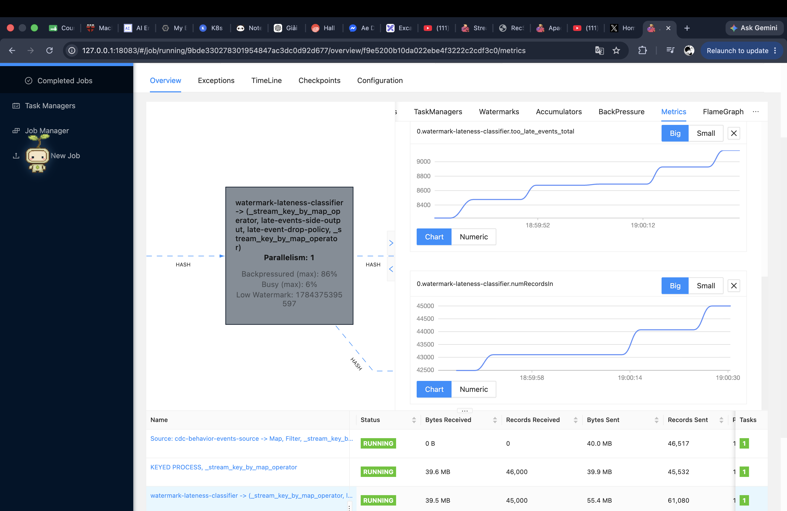

**Figure: Unoptimized Flink baseline too-late events versus operator input.** The upper chart shows `too_late_events_total` rising past `9,000`; the lower `numRecordsIn` chart rises to approximately `45,000`. Thus a substantial share of processed input is arriving beyond the cleanup boundary rather than contributing safely to the live feature state. The classifier's maximum backpressure also reaches `86%` in this capture.

**Analysis:** these are cumulative counter charts, so their staircase shape is expected and their absolute values include all events since this job attempt started. The two screenshots were taken at different times; endpoint values across them must not be added together. To verify the invariant exactly, switch all three counter cards to **Numeric** and record them at the same instant. The baseline proves the problem exists; improvement is demonstrated only by replaying the same workload against the optimized job and comparing ratios such as `too_late_events_total / numRecordsIn`, together with backpressure and throughput.

**How to reproduce the Flink UI proof:** open the baseline online job, select `watermark-lateness-classifier`, choose **BackPressure** for the pressure capture, then choose **Metrics** and add `late_arrivals_total`, `accepted_late_events_total`, `too_late_events_total`, and `numRecordsIn`. Use **Big** charts for the trend and **Numeric** for an exact before/after table.

Code reference:

- [e2e-2k.yaml](../../../configs/data-platform/generator/e2e-2k.yaml), [e2e-2k.yaml](../../../configs/data-platform/generator/e2e-2k.yaml): configures the 28% late-arrival rate and 45-180 minute delay range.
- [late_arrival.py (line 14)](../../../apps/data-platform/data-generator/src/streaming/problems/late_arrival.py#L14): samples and backdates a late event.
- [problem_pipeline.py (line 38)](../../../apps/data-platform/data-generator/src/streaming/problem_pipeline.py#L38): applies the late-arrival class to new events.
- [event_time.py (line 13)](../../../apps/data-platform/src/features/flink/event_time.py#L13): registers the three shared Flink counters through the operator `MetricGroup`.
- [event_time.py (line 31)](../../../apps/data-platform/src/features/flink/event_time.py#L31): increments and partitions late arrivals into accepted and too-late outcomes.
- [flink-baseline-ui-job.yaml (line 94)](https://github.com/itsmekhoathekid/RecSys-MLops/blob/67d306934261eed5e1c8fe401eef6a099fae13fb/infra/k8s/processing-baseline/flink-baseline-ui-job.yaml#L94): submits the baseline online job used for the UI comparison.

### Develop Stream Processing Script To Handle Streaming Problems

#### Stream Processing Flow

The two jobs start at parallelism one and consume continuously. Kafka retains a temporary backlog; bounded async sink capacity propagates backpressure, while the autoscaler increases operator parallelism and TaskManager capacity for sustained load.

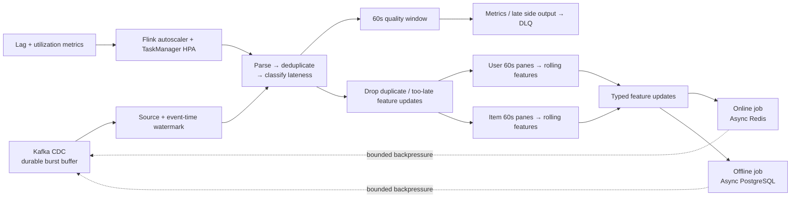
```mermaid
flowchart LR
    A["Kafka CDC<br/>durable burst buffer"] --> B["Source + event-time watermark"]
    B --> C["Parse → deduplicate<br/>→ classify lateness"]
    C --> Q["60s quality window"]
    Q --> M["Metrics / late side output → DLQ"]
    C --> P["Drop duplicate / too-late feature updates"]
    P --> U["User 60s panes → rolling features"]
    P --> I["Item 60s panes → rolling features"]
    U --> X["Typed feature updates"]
    I --> X
    X --> R["Online job<br/>Async Redis"]
    X --> O["Offline job<br/>Async PostgreSQL"]
    R -. bounded backpressure .-> A
    O -. bounded backpressure .-> A
    L["Lag + utilization metrics"] --> S["Flink autoscaler + TaskManager HPA"]
    S --> C
```

The production graph is composed directly from reusable classes rather than wrapper factories:

```python
raw_stream = env.from_source(
    build_kafka_source(args),
    build_watermark_strategy(args, EventTimestampAssigner()),
    "cdc-behavior-events-source",
)
parsed = raw_stream.map(ParseNormalizeEvent()).filter(KeepValidEvents())

deduped = (
    parsed
    .key_by(lambda event: str(event["event_id"]))
    .process(MarkDuplicateEvents(args))
)
marked = (
    deduped
    .key_by(lambda event: str(event["event_id"]))
    .process(MarkEventTimeStatus(args))
    .name("watermark-lateness-classifier")
)

quality_rows, late_events = build_quality_window_streams(marked, args)
feature_events = marked.filter(KeepFeatureEvents(args))
user_updates, item_updates = build_feature_update_streams(feature_events, args)

_attach_feature_sinks(
    env,
    args,
    feature_events=feature_events,
    user_updates=user_updates,
    item_updates=item_updates,
    quality_rows=quality_rows,
    late_events=late_events,
)
```

Reference: [the production graph composition in `realtime_stream_job.py`](../../../apps/data-platform/src/features/flink/realtime_stream_job.py#L119).

Step-by-step code reference:

1. [`build_kafka_source()`](../../../apps/data-platform/src/features/flink/source.py#L132), [`EventTimestampAssigner`](../../../apps/data-platform/src/features/flink/source.py#L71), and [`build_watermark_strategy()`](../../../apps/data-platform/src/features/flink/source.py#L155) establish continuous event-time input; [`ParseNormalizeEvent`](../../../apps/data-platform/src/features/flink/source.py#L65) unwraps and normalizes the Debezium record.
2. [`MarkDuplicateEvents`](../../../apps/data-platform/src/features/flink/operators/dedup.py#L9) and [`MarkEventTimeStatus`](../../../apps/data-platform/src/features/flink/operators/late_policy.py#L9) classify duplicate and late events before the graph fans out.
3. [`build_quality_window_streams()`](../../../apps/data-platform/src/features/flink/operators/quality.py#L73) detects burst, duplicate, and late behavior in a native 60-second event-time window.
4. [`build_feature_update_streams()`](../../../apps/data-platform/src/features/flink/feature_windows.py#L344) creates parallel user/item panes and rolling `30m/1h/24h/7d` features plus the last-50 user sequence.
5. Bounded [`AsyncDataStream.unordered_wait` for Redis](../../../apps/data-platform/src/features/flink/realtime_stream_job.py#L89) and [PostgreSQL](../../../apps/data-platform/src/features/flink/realtime_stream_job.py#L100) performs non-blocking external I/O; the [`AsyncTokenBucketRateLimiter`](../../../apps/data-platform/src/features/flink/sinks/rate_limit.py#L58) caps each sink subtask.
6. [Standalone autoscaler and TaskManager HPA](../../../infra/helm/recsys-streaming/templates/flink-autoscaler.yaml#L1) scale sustained load from the [initial parallelism of one](../../../infra/helm/recsys-streaming/values.yaml#L63).

| Streaming problem | Production code path | Result |
| --- | --- | --- |
| Duplicate replay | [`MarkDuplicateEvents`](../../../apps/data-platform/src/features/flink/operators/dedup.py#L9) + [`KeepFeatureEvents`](../../../apps/data-platform/src/features/flink/operators/late_policy.py#L34) | Marks repeats by `event_id` for quality metrics, then prevents them from changing features. |
| Out-of-order / late arrival | [Watermark strategy](../../../apps/data-platform/src/features/flink/source.py#L155) + [`event_time_status()`](../../../apps/data-platform/src/features/flink/event_time.py#L52) | Accepts bounded disorder, revises accepted-late panes, and prevents post-cleanup events from changing live features. |
| Bursty traffic / slow sinks | [Async Redis](../../../apps/data-platform/src/features/flink/sinks/redis_async.py#L13), [async PostgreSQL](../../../apps/data-platform/src/features/flink/sinks/postgres_async.py#L64), [token bucket](../../../apps/data-platform/src/features/flink/sinks/rate_limit.py#L58), and [autoscaler](../../../infra/helm/recsys-streaming/templates/flink-autoscaler.yaml#L1) | Keeps I/O concurrent and bounded, propagates backpressure to Kafka, and adds operator/worker capacity for sustained pressure. |
| Early/final/late window re-firing | [Pane revision replacement](../../../apps/data-platform/src/features/flink/feature_windows.py#L76) + [dirty-gated trigger](../../../apps/data-platform/src/features/flink/feature_windows.py#L204) | Replaces the same pane instead of adding it twice, so corrections do not double-count. |
| Failure and Kafka replay | [EXACTLY_ONCE checkpoint configuration](../../../apps/data-platform/src/features/flink/runtime.py#L22), [PostgreSQL upsert](../../../apps/data-platform/src/feature_store/postgres_offline_store.py#L262), and [Redis write-latest Lua](../../../apps/data-platform/src/feature_store/online_writer.py#L30) | Restores Kafka/state consistently and makes external side effects replay-safe. |
| Unbounded keyed state | [Seven-day pane pruning](../../../apps/data-platform/src/features/flink/feature_windows.py#L76), [state TTL](../../../apps/data-platform/src/features/flink/runtime.py#L6), and [last-50 sequence](../../../apps/data-platform/src/features/flink/features/user_sequence.py#L10) | Bounds rolling, deduplication, and sequence state growth. |

#### Bursty Traffic

The quality window detects the problem; async capacity, Kafka buffering, and autoscaling handle it:

1. [`NativeQualityWindowAggregate`](../../../apps/data-platform/src/features/flink/operators/quality.py#L10) increments constant-size counters and marks `is_bursty`; it does not buffer the full window or throttle traffic.
2. [`AsyncRedisFeatureWriter`](../../../apps/data-platform/src/features/flink/sinks/redis_async.py#L13) and [`AsyncPostgresFeastOfflineWriter`](../../../apps/data-platform/src/features/flink/sinks/postgres_async.py#L64) await real async clients, so one slow request does not block all records in the subtask.
3. The Redis and PostgreSQL branches use [`AsyncDataStream.unordered_wait`](../../../apps/data-platform/src/features/flink/realtime_stream_job.py#L89) with the PostgreSQL attachment at [line 100](../../../apps/data-platform/src/features/flink/realtime_stream_job.py#L100). Production bounds these operators at [`capacity=64` and a 120-second timeout](../../../infra/helm/recsys-streaming/values.yaml#L73). Full capacity backpressures Kafka; the [`timeout()` fallbacks](../../../apps/data-platform/src/features/flink/sinks/redis_async.py#L125) log the affected `event_id` instead of restarting the TaskManager. Reference: [Flink 2.2 Async I/O](https://nightlies.apache.org/flink/flink-docs-release-2.2/docs/dev/datastream/operators/asyncio/).
4. Jobs start at [`parallelism: 1`](../../../infra/helm/recsys-streaming/values.yaml#L63), and [`taskSlots: 1`](../../../infra/helm/recsys-streaming/values.yaml#L23) isolates online/offline jobs on separate TaskManagers. Flink Autoscaler 1.15 and the max-four TaskManager HPA are configured in [`flink-autoscaler.yaml`](../../../infra/helm/recsys-streaming/templates/flink-autoscaler.yaml#L1). Reference: [Flink Autoscaler 1.15](https://nightlies.apache.org/flink/flink-kubernetes-operator-docs-release-1.15/docs/custom-resource/autoscaler/).

The two scaling layers solve different parts of the burst: HPA creates TaskManager capacity, while Adaptive Scheduler plus the standalone autoscaler changes vertex parallelism. Extra TaskManagers alone do not reduce pressure when a rolling operator remains at parallelism one.

```yaml
# values.yaml: start small, but allow the rolling vertices to scale to the
# four-partition / four-TaskManager burst ceiling.
flink:
  scheduler: adaptive
realtimeFlinkConsumer:
  parallelism: "1"
flinkAutoscaler:
  scalingEnabled: true
  targetUtilization: "0.65"
  vertexMinParallelism: "1"
  vertexMaxParallelism: "4"
  taskManagerHpa:
    minReplicas: 2
    maxReplicas: 4
```

The chart renders `jobmanager.scheduler: adaptive` and declarative resource management in [the JobManager startup config](../../../infra/helm/recsys-streaming/templates/flink.yaml#L63). The standalone process renders the matching [vertex scaling bounds](../../../infra/helm/recsys-streaming/templates/flink-autoscaler.yaml#L33), so sustained pressure on `user/item-feature-rolling-horizons` can produce real subtasks instead of only idle TaskManager pods.

Autoscaling code path during sustained bursts:

1. The job begins at [operator parallelism one](../../../infra/helm/recsys-streaming/values.yaml#L63), so normal traffic does not reserve peak operator capacity.
2. The [standalone autoscaler control loop](../../../infra/helm/recsys-streaming/templates/flink-autoscaler.yaml#L33) samples Flink metrics using a three-minute window, targets `65%` utilization, and includes catch-up duration when backlog is present.
3. The [TaskManager HPA](../../../infra/helm/recsys-streaming/templates/flink-autoscaler.yaml#L57) independently targets `65%` CPU and scales worker capacity between `2` and `4` replicas, as configured in [values.yaml](../../../infra/helm/recsys-streaming/values.yaml#L92).
4. The JobManager starts Flink with the [Adaptive Scheduler](../../../infra/helm/recsys-streaming/templates/flink.yaml#L63), allowing available slots and autoscaler recommendations to be applied without changing the source code.

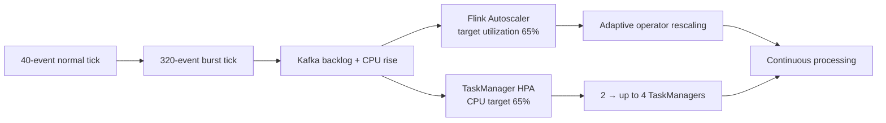
```mermaid
flowchart LR
    A["40-event normal tick"] --> B["320-event burst tick"]
    B --> C["Kafka backlog + CPU rise"]
    C --> D["Flink Autoscaler<br/>target utilization 65%"]
    C --> E["TaskManager HPA<br/>CPU target 65%"]
    D --> F["Adaptive operator rescaling"]
    E --> G["2 → up to 4 TaskManagers"]
    F --> H["Continuous processing"]
    G --> H
```

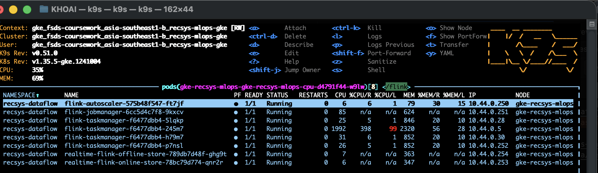

**Figure: scaled Flink worker capacity during burst traffic.** The capture shows the standalone `flink-autoscaler` pod, JobManager, both realtime submitters, and four `flink-taskmanager` pods all `Running`. One TaskManager reaches `1,992m` CPU (`99%` of its two-core limit and `398%` of its `500m` request), while the other workers remain available. Paired with the HPA configuration above, this is runtime evidence that the Flink worker tier reached its configured four-replica burst capacity. It proves TaskManager capacity scaling; operator-parallelism changes must be verified separately in the Flink job graph.

#### Duplicate Replay

The producer may replay the same `event_id` and payload. Flink keeps keyed `ValueState` for 24 hours, marks a repeated ID, and still sends the marked event to the quality branch so the duplicate rate remains observable. `KeepFeatureEvents` then removes the duplicate before user/item windows.

```python
deduped = parsed.key_by(lambda event: str(event["event_id"])).process(
    MarkDuplicateEvents(args)
)

marked = deduped.key_by(lambda event: str(event["event_id"])).process(
    MarkEventTimeStatus(args)
)
feature_events = marked.filter(KeepFeatureEvents(args))
```

The keyed deduplication state is backed by the production RocksDB configuration:

```yaml
# infra/helm/recsys-streaming/values.yaml
flink:
  checkpointStorageUri: s3a://recsys-lakehouse/flink-checkpoints
  stateBackend: rocksdb
  stateBackendIncremental: "true"
```

Code reference:

- [`MarkDuplicateEvents.open()`](../../../apps/data-platform/src/features/flink/operators/dedup.py#L13) creates TTL-backed `seen_event_id` state; [`process_element()`](../../../apps/data-platform/src/features/flink/operators/dedup.py#L23) marks the replay without hiding it from quality monitoring.
- [RocksDB Helm values](../../../infra/helm/recsys-streaming/values.yaml#L18) select `rocksdb`, incremental snapshots, and the MinIO checkpoint path; [JobManager `FLINK_PROPERTIES`](../../../infra/helm/recsys-streaming/templates/flink.yaml#L67) and [TaskManager `FLINK_PROPERTIES`](../../../infra/helm/recsys-streaming/templates/flink.yaml#L134) render that configuration as `state.backend.type`, `state.backend.incremental`, and `state.checkpoints.dir`.
- [`NativeQualityWindowAggregate.add()`](../../../apps/data-platform/src/features/flink/operators/quality.py#L23) counts `_is_duplicate` before feature filtering.
- [`KeepFeatureEvents.filter()`](../../../apps/data-platform/src/features/flink/operators/late_policy.py#L38) rejects the marked duplicate before user/item state changes.
- [The production dedup TTL](../../../infra/helm/recsys-data-config/values.yaml#L264) is 86,400 seconds. An ID replayed after that retention boundary is intentionally treated as new.
- Checkpoint restore protects the dedup state that was included in the latest completed checkpoint; Redis latest-write protection and PostgreSQL `source_event_id` upserts cover replays of external writes after a failure.

#### Late Arrival

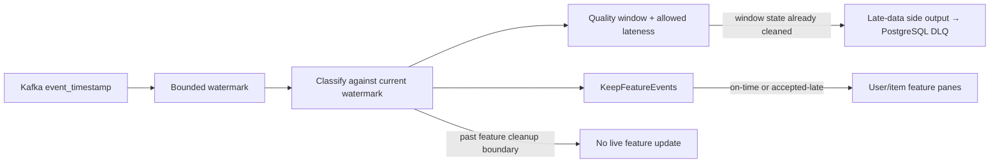
```mermaid
flowchart LR
    A["Kafka event_timestamp"] --> B["Bounded watermark"]
    B --> C["Classify against current watermark"]
    C --> Q["Quality window + allowed lateness"]
    Q -->|"window state already cleaned"| D["Late-data side output → PostgreSQL DLQ"]
    C --> F["KeepFeatureEvents"]
    F -->|"on-time or accepted-late"| W["User/item feature panes"]
    C -->|"past feature cleanup boundary"| X["No live feature update"]
```

Step-by-step code reference:

1. [`EventTimestampAssigner`](../../../apps/data-platform/src/features/flink/source.py#L71) reads `event_timestamp`; [`build_watermark_strategy()`](../../../apps/data-platform/src/features/flink/source.py#L155) bounds out-of-order delay, handles idle partitions, and optionally aligns partition watermarks.
2. [`event_time_status()`](../../../apps/data-platform/src/features/flink/event_time.py#L52) compares the event with the current watermark and feature-pane cleanup boundary; [`MarkEventTimeStatus`](../../../apps/data-platform/src/features/flink/operators/late_policy.py#L9) records accepted-late and too-late counters.
3. [`build_quality_window_streams()`](../../../apps/data-platform/src/features/flink/operators/quality.py#L73) applies `allowed_lateness` and routes records arriving after state cleanup to a native side output. The offline PostgreSQL job attaches that stream to [`AsyncPostgresLateEventDlqWriter`](../../../apps/data-platform/src/features/flink/realtime_stream_job.py#L46). Reference: [Flink 2.2 late data](https://nightlies.apache.org/flink/flink-docs-release-2.2/docs/dev/datastream/operators/windows/#getting-late-data-as-a-side-output).
4. [`KeepFeatureEvents`](../../../apps/data-platform/src/features/flink/operators/late_policy.py#L34) admits on-time and accepted-late records to [`build_feature_update_streams()`](../../../apps/data-platform/src/features/flink/feature_windows.py#L344), while [`AsyncPostgresLateEventDlqWriter`](../../../apps/data-platform/src/features/flink/sinks/postgres_async.py#L145) stores post-cleanup records for backfill without blocking the Python worker.
5. An accepted-late element causes [`EarlyAndEventTimeTrigger.on_element()`](../../../apps/data-platform/src/features/flink/feature_windows.py#L215) to fire the retained pane immediately; [`upsert_pane_revision()`](../../../apps/data-platform/src/features/flink/feature_windows.py#L76) replaces that pane and recomputes the rolling feature without double-counting.

#### Failure Recovery And Sink Replay

**Techniques used:** Flink EXACTLY_ONCE checkpoint mode for Kafka offsets and operator state, retained externalized checkpoints, one in-flight checkpoint, checkpoint timeout/failure tolerance, optional unaligned checkpoints, and idempotent external writes.

The production cluster uses RocksDB for live keyed state and incremental checkpoints in MinIO:

```yaml
state.backend.type: rocksdb
state.backend.incremental: true
execution.checkpointing.storage: filesystem
state.checkpoints.dir: s3a://recsys-lakehouse/flink-checkpoints
```

`seen_event_id` `ValueState`, rolling user/item `MapState`, window state, and timers are maintained by
RocksDB on the TaskManager. The local database is working state, while the MinIO checkpoint is the
durable recovery copy. After a TaskManager failure, Flink restores RocksDB state and Kafka source
positions from the latest completed checkpoint. Incremental mode uploads changed RocksDB SST files
instead of rewriting the complete state snapshot.

**Best-practice reference:** [Apache Flink 2.2 - Checkpointing](https://nightlies.apache.org/flink/flink-docs-release-2.2/docs/dev/datastream/fault-tolerance/checkpointing/). Flink checkpoints recover operator state and source positions with failure-free execution semantics. The production job enables `CheckpointingMode.EXACTLY_ONCE`, one concurrent checkpoint, retained externalized checkpoints, and optional unaligned checkpoints.

**Delivery-guarantee reference:** [Apache Flink - Exactly Once End-to-end](https://nightlies.apache.org/flink/flink-docs-stable/docs/learn-flink/fault_tolerance/#exactly-once-end-to-end). Kafka and Flink state recover exactly once; the async Redis/PostgreSQL writers remain external side effects and therefore use idempotent writes instead of a Flink two-phase commit.

PostgreSQL upserts by `source_event_id`, the DLQ ignores duplicate `(event_id, reason)`, and Redis uses an atomic Lua compare-and-set so an older replay cannot overwrite a newer feature payload.

Code reference:

- [runtime.py](../../../apps/data-platform/src/features/flink/runtime.py): configures `EXACTLY_ONCE`, checkpoint pause/timeout/concurrency/failure tolerance, retained externalized checkpoints, and optional unaligned checkpoints.
- [realtime_stream_job.py (line 173)](../../../apps/data-platform/src/features/flink/realtime_stream_job.py#L173): applies checkpoint configuration before building/executing the job.
- [Streaming values](../../../infra/helm/recsys-streaming/values.yaml#L18) select the MinIO checkpoint directory, RocksDB, and incremental snapshots.
- [flink.yaml](../../../infra/helm/recsys-streaming/templates/flink.yaml#L67) renders the state backend and checkpoint storage into JobManager `FLINK_PROPERTIES`; the [TaskManager block](../../../infra/helm/recsys-streaming/templates/flink.yaml#L134) applies the same runtime configuration to TaskManagers.
- [dedup.py (line 17)](../../../apps/data-platform/src/features/flink/operators/dedup.py#L17) creates the TTL-backed `ValueState` stored by RocksDB; [feature_windows.py (line 293)](../../../apps/data-platform/src/features/flink/feature_windows.py#L293) creates rolling user feature state and [line 323](../../../apps/data-platform/src/features/flink/feature_windows.py#L323) creates rolling item feature state.
- [row_mappers.py (line 111)](../../../apps/data-platform/src/features/flink/operators/row_mappers.py#L111): carries the source event id into user feature rows.
- [row_mappers.py (line 184)](../../../apps/data-platform/src/features/flink/operators/row_mappers.py#L184): carries the source event id into item feature rows.
- [postgres_offline_store.py (line 194)](../../../apps/data-platform/src/feature_store/postgres_offline_store.py#L194): creates the partial unique index on `source_event_id`.
- [postgres_offline_store.py (line 204)](../../../apps/data-platform/src/feature_store/postgres_offline_store.py#L204): creates the DLQ uniqueness constraint.
- [postgres_offline_store.py (line 280)](../../../apps/data-platform/src/feature_store/postgres_offline_store.py#L280): detects `source_event_id` in the async production path; [line 286](../../../apps/data-platform/src/feature_store/postgres_offline_store.py#L286) builds the replay-safe upsert.
- [postgres_offline_store.py (line 290)](../../../apps/data-platform/src/feature_store/postgres_offline_store.py#L290): ignores a replayed DLQ event by `(event_id, reason)`.
- [online_writer.py (line 35)](../../../apps/data-platform/src/feature_store/online_writer.py#L35): compares the stored and incoming `updated_at` values atomically in Redis Lua.
- [online_writer.py (line 39)](../../../apps/data-platform/src/feature_store/online_writer.py#L39): atomically writes the accepted latest payload with TTL.
- [online_writer.py (line 51)](../../../apps/data-platform/src/feature_store/online_writer.py#L51): executes the Lua compare-and-set through Redis.
- [Data-platform values](../../../infra/helm/recsys-data-config/values.yaml#L265) configure checkpoint minimum pause, timeout, tolerated failures, and unaligned checkpoints.

#### Production Runtime Routing

The deployed streaming layout is `Kafka CDC -> Flink -> PostgreSQL Feast offline store` and `Kafka CDC -> Flink -> Redis online store`. Iceberg remains part of the batch lakehouse, but it is not the production streaming offline-store sink.

Code reference:

- [Streaming values](../../../infra/helm/recsys-streaming/values.yaml#L76) select PostgreSQL as the realtime offline sink.
- [The online deployment](../../../infra/helm/recsys-streaming/templates/realtime-flink-consumer.yaml#L98) disables the offline branch and enables Redis writes.
- [The offline deployment](../../../infra/helm/recsys-streaming/templates/realtime-flink-consumer.yaml#L215) enables the offline branch, disables Redis writes, and passes the configured PostgreSQL sink selection.


### View Flink UI To Show Problems Have Been Minimized

#### Bursty Traffic

These captures show the deployed event-time window build (`flink-2.2-event-window-20260721-r3`), online job `d099cf2d82583c91d79cf311a6403862`, under the same `40 -> 320` burst pattern. The defensible optimization claim is lower classifier blocking and mailbox latency. The evidence does not show higher throughput or complete removal of every bottleneck.

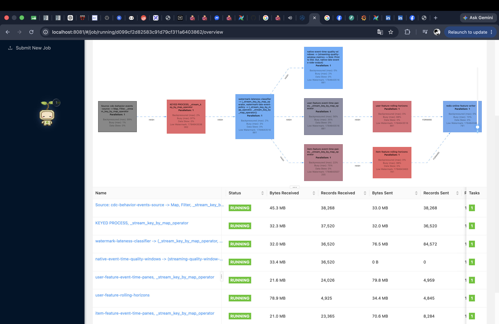

**Figure: r3 event-time window topology and residual bottlenecks.** All nine vertices are `RUNNING`; records pass through separate user/item 60-second panes, rolling horizons, and the async Redis writer. The source still reaches `99%` maximum backpressure, the user pane reaches `56%`, and rolling user/item operators are up to `88%/98%` busy. This image proves the new window topology and end-to-end continuity, but must not be used alone as optimization proof.

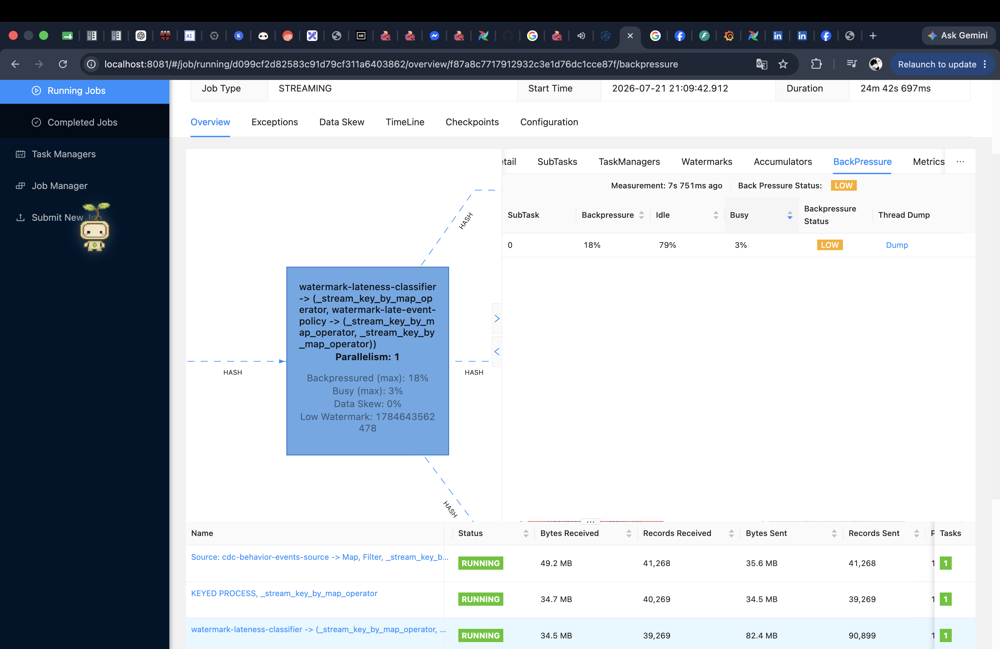

**Figure: classifier changes from HIGH to LOW backpressure.** r3 reports `18%` backpressure, `79%` idle, and `3%` busy. The baseline reports `66%`, `20%`, and `14%` with status `HIGH`; therefore classifier pressure falls by `48` percentage points and the status becomes `LOW`.

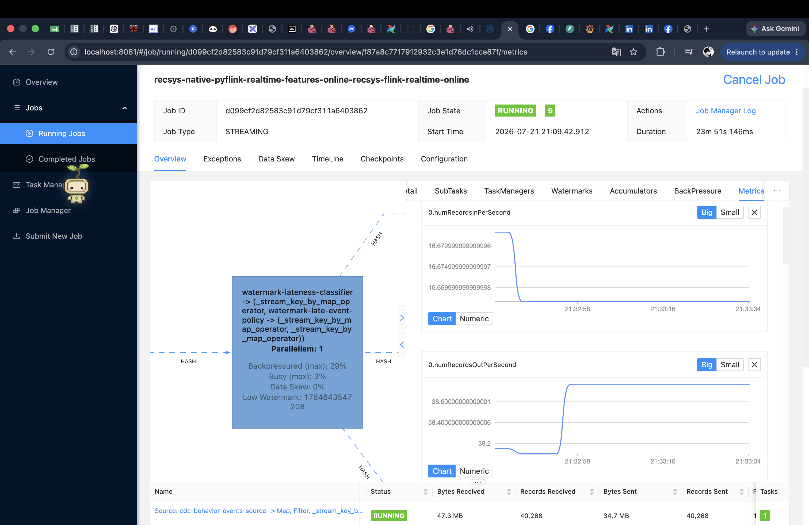

**Figure: r3 remains live, but this is not throughput-improvement proof.** Input holds near `16.67 records/s`; fan-out output rises from about `38.2` to `38.6 records/s`. Baseline input is approximately `54-69 records/s`, and the current output counts multiple downstream branches, so the two output series are not directly comparable. This capture proves continuous processing only.


**Figure: classifier spends much less time blocked.** r3 backpressure time is approximately `200-290 ms/s`, versus baseline `817-916 ms/s`, a reduction of roughly `64-78%`. Busy time remains about `20-36 ms/s`, while records continue moving. This is the strongest direct evidence of improved pressure handling.

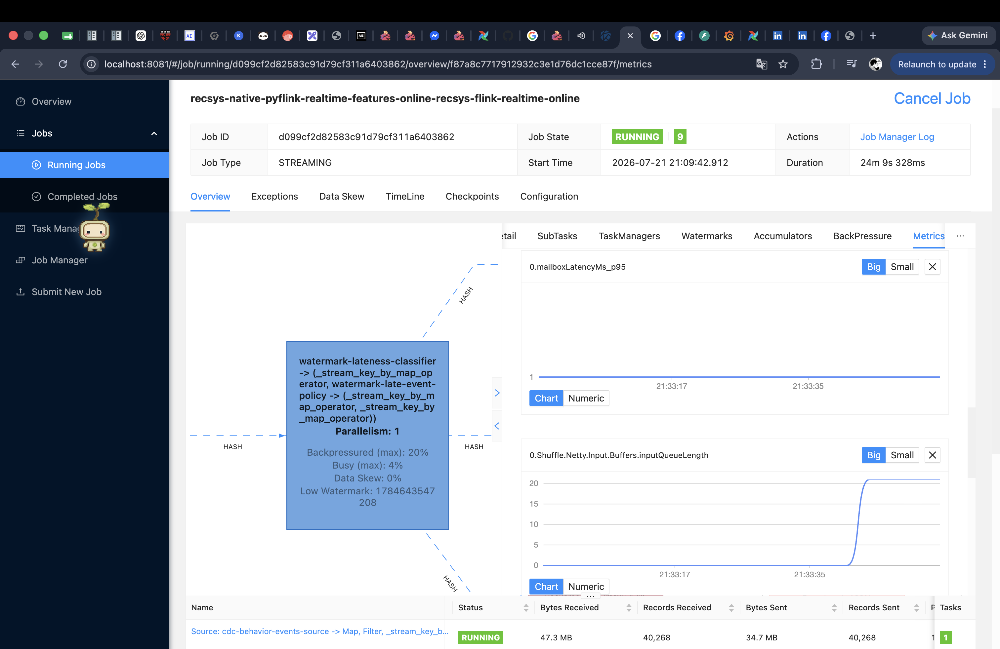

**Figure: mailbox responsiveness improves, but queue peak does not.** Mailbox p95 remains at `1 ms`, versus the baseline's sustained approximately `370 ms` (more than `99%` lower). The input queue, however, spikes from `0` to `21` buffers, above the baseline peak of `15`, before the later capture shows recovery to about `1`. This supports lower scheduling latency, not lower peak buffering.

**Analysis:** r3 clearly improves classifier backpressure status, blocked time, and mailbox latency while preserving continuous processing and adding real event-time feature windows. It does not prove higher throughput; the overview still exposes source/window pressure and the captured input-queue peak is worse than baseline. The correct claim is improved classifier responsiveness under bursts, not an end-to-end throughput increase.

#### Late Arrival


**Figure: r3 continues classifying accepted-late events.** `late_arrivals_total` and `accepted_late_events_total` rise together during the injected late-event burst, proving that the classifier continues to identify events that are late relative to the watermark but still inside the configured cleanup boundary. The counter is classification evidence; the event-time pane/revision path below is the implementation evidence that those eligible events are actually applied to feature state.

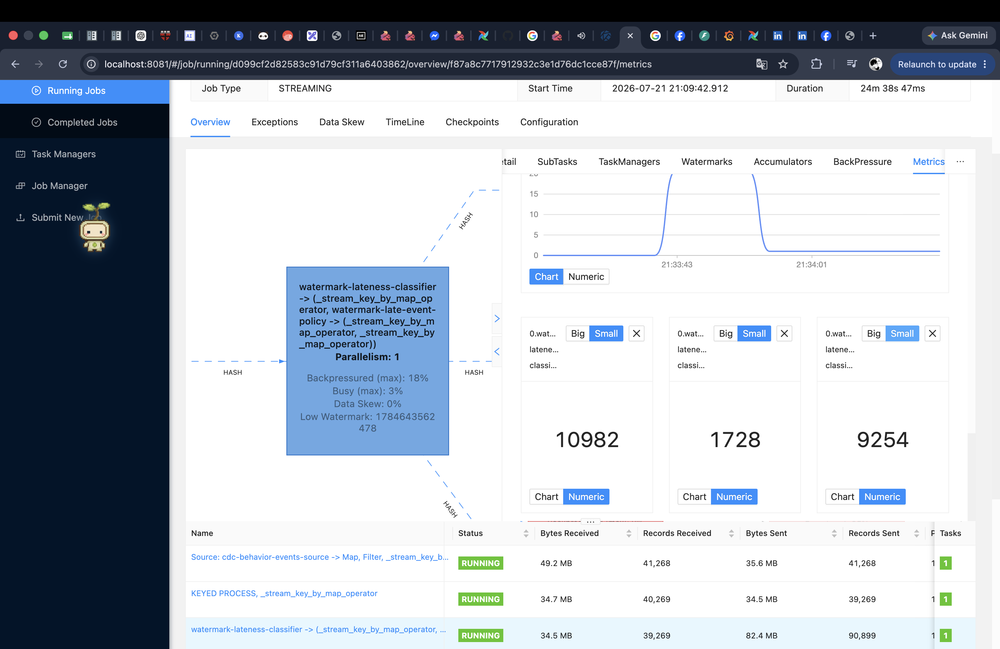

**Figure: the late-event invariant is exact.** The same-instant Numeric cards report `10,982` late arrivals, `1,728` accepted-late events, and `9,254` too-late events: `10,982 = 1,728 + 9,254`. Accepted-late share is about `15.7%`; the classifier table shows `39,269` records received, so the cumulative too-late/input ratio is about `23.6%`, versus roughly `20%` in the baseline capture. These images validate classification correctness, but do not prove that r3 reduces lateness.

> **Watermark/configuration comparison note:** do not claim that optimization increased the accepted-late ratio from these captures. The unoptimized baseline proof used a `15-minute` bounded-out-of-orderness delay and a `3,600-second` allowed-lateness boundary, while the optimized GCP proof used a `5-minute` delay with the same `3,600-second` GCP proof override. The current production base default is `5 minutes / 300 seconds`, but [`values-gcp.yaml`](../../../infra/helm/recsys-data-config/values-gcp.yaml#L92) overrides allowed lateness to `3,600` seconds for the controlled late-event workload. Because the baseline and optimized proof watermarks advance under different delays, their `accepted_late_events_total / late_arrivals_total` and `too_late_events_total / numRecordsIn` ratios are not causal before/after optimization metrics. The optimized Numeric capture gives an exact accepted-late share of `1,728 / 10,982 = 15.7%`; the baseline chart is only approximately `16-17%` and was not captured as same-instant Numeric cards. The defensible improvement is correct event-time pane revision plus lower classifier pressure/mailbox latency, not a higher accepted-late classification rate.

Configuration references:

- [Baseline proof manifest (line 110)](https://github.com/itsmekhoathekid/RecSys-MLops/blob/6f25ad7/infra/k8s/processing-baseline/flink-baseline-ui-job.yaml#L110): fixes the unoptimized proof watermark delay at `15` minutes.
- [Baseline GCP proof values (line 71)](https://github.com/itsmekhoathekid/RecSys-MLops/blob/6f25ad7/infra/helm/recsys-data-platform/values-gcp.yaml#L71): overrides allowed lateness to `3,600` seconds.
- [Current base streaming values (line 249)](../../../infra/helm/recsys-data-config/values.yaml#L249): define the production defaults of a `5-minute` watermark delay and `300-second` allowed lateness.
- [Current GCP proof override (line 92)](../../../infra/helm/recsys-data-config/values-gcp.yaml#L92): changes only allowed lateness to `3,600` seconds for the injected `45-180` minute late-event workload.


### Window Processing

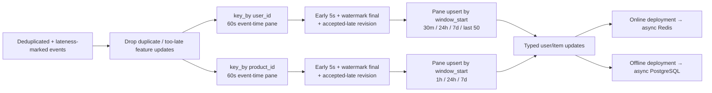
```mermaid
flowchart LR
    A["Deduplicated + lateness-marked events"] --> B["Drop duplicate / too-late feature updates"]
    B --> U["key_by user_id<br/>60s event-time pane"]
    B --> I["key_by product_id<br/>60s event-time pane"]
    U --> UT["Early 5s + watermark final<br/>+ accepted-late revision"]
    I --> IT["Early 5s + watermark final<br/>+ accepted-late revision"]
    UT --> UR["Pane upsert by window_start<br/>30m / 24h / 7d / last 50"]
    IT --> IR["Pane upsert by window_start<br/>1h / 24h / 7d"]
    UR --> X["Typed user/item updates"]
    IR --> X
    X --> R["Online deployment → async Redis"]
    X --> P["Offline deployment → async PostgreSQL"]
```

1. [`KeepFeatureEvents`](../../../apps/data-platform/src/features/flink/operators/late_policy.py) removes duplicates and, when `dropLateEvents=true`, events past `window_end + allowed_lateness`.
2. User and item branches independently key by entity and use 60-second `TumblingEventTimeWindows`. After a new element marks the pane dirty, the trigger emits once after five seconds; it does not reschedule itself for an unchanged pane. Watermark close emits the final pane, and an accepted-late element emits a correction immediately.
3. Each emission carries `window_start`, `window_end`, and `is_final`. Rolling `MapState` replaces revisions by `window_start`, ignores an identical revision, deduplicates by `event_id`, and prunes state beyond seven days; early/final/late emissions therefore do not double-count or flood the sinks.
4. The two deployments run the same feature graph: the online job enables async Redis only, while the offline job enables async PostgreSQL only.

```python
feature_events = marked.filter(KeepFeatureEvents(args))
user_panes = (
    feature_events.key_by(lambda event: int(event["user_id"]))
    .window(TumblingEventTimeWindows.of(Time.seconds(args.feature_window_seconds)))
    .allowed_lateness(args.allowed_lateness_seconds * 1000)
    .side_output_late_data(user_feature_late_tag)
    .trigger(
        EarlyAndEventTimeTrigger(
            args.feature_early_fire_seconds,
            "user-feature-early-fire-timer",
        )
    )
    .aggregate(
        FeaturePaneAggregate(),
        FeaturePaneWindowFunction("user"),
        accumulator_type=Types.PICKLED_BYTE_ARRAY(),
        output_type=Types.PICKLED_BYTE_ARRAY(),
    )
    .name("user-feature-event-time-panes")
)
user_updates = (
    user_panes.key_by(lambda pane: int(pane["entity_id"]))
    .process(
        UserRollingFeatureProcess(args),
        output_type=Types.PICKLED_BYTE_ARRAY(),
    )
    .name("user-feature-rolling-horizons")
)
# The parallel item branch uses product_id and ItemRollingFeatureProcess(args).
```

Code reference:

- [User/item feature-window graph](../../../apps/data-platform/src/features/flink/feature_windows.py#L344) and [sink routing](../../../apps/data-platform/src/features/flink/realtime_stream_job.py#L65)
- [Incremental pane accumulator and window metadata](../../../apps/data-platform/src/features/flink/feature_windows.py#L23)
- [Pane revision overwrite, event deduplication, and seven-day pruning](../../../apps/data-platform/src/features/flink/feature_windows.py#L76)
- [Identical revision guards](../../../apps/data-platform/src/features/flink/feature_windows.py#L117)
- [Dirty-gated early, final, and accepted-late trigger](../../../apps/data-platform/src/features/flink/feature_windows.py#L204)
- [Rolling keyed `MapState` processors](../../../apps/data-platform/src/features/flink/feature_windows.py#L285)
- [User 30m/24h/7d aggregates](../../../apps/data-platform/src/features/flink/features/user_aggregate.py), [last-50 sequence](../../../apps/data-platform/src/features/flink/features/user_sequence.py), and [item 1h/24h/7d aggregates](../../../apps/data-platform/src/features/flink/features/item.py)
- [Window/trigger Helm defaults](../../../infra/helm/recsys-data-config/values.yaml#L249) and [online/offline CLI wiring](../../../infra/helm/recsys-streaming/templates/realtime-flink-consumer.yaml#L90)

## Production Integration Proof

### Spark Batch Job Integrated Into Airflow Pipeline

Spark batch processing is integrated into the Airflow DAGs through native Spark-on-Kubernetes submission rather than a permanently running Spark cluster, a local Spark process, or a Spark Operator `SparkApplication` resource. The shared `spark_native_submit()` helper builds the same production `spark-submit` contract for the DP2 and DP3 Spark tasks. See [spark_utils.py](../../../apps/data-platform/src/orchestration/airflow/spark_utils.py) for the `KubernetesPodOperator` wrapper and shared submission helper.

#### Native Spark-On-Kubernetes Execution Flow

The integration uses the following reference-backed execution path:

| Step | Execution flow | Code reference |
|---:|---|---|
| 1 | The Airflow scheduler loads and schedules the rubric DAGs. | [airflow.yaml](../../../infra/helm/recsys-airflow/templates/airflow.yaml#L75) declares the scheduler Deployment and [starts `airflow scheduler`](../../../infra/helm/recsys-airflow/templates/airflow.yaml#L101). |
| 2 | `KubernetesPodOperator` creates a temporary Spark submission pod for the Airflow task. | [spark_utils.py](../../../apps/data-platform/src/orchestration/airflow/spark_utils.py#L113) constructs the operator and deletes the temporary pod after completion. |
| 3 | The submission pod runs `spark-submit` against the Kubernetes API. | [spark_utils.py](../../../apps/data-platform/src/orchestration/airflow/spark_utils.py#L132) invokes `spark-submit` and selects the in-cluster Kubernetes API master. |
| 4 | Kubernetes creates a separate Spark driver pod because submission uses cluster deploy mode. | [spark_utils.py](../../../apps/data-platform/src/orchestration/airflow/spark_utils.py#L153) sets cluster deploy mode, driver namespace, and Spark container image. |
| 5 | The driver requests, monitors, and removes executor pods according to the Spark allocation policy. | [spark_utils.py](../../../apps/data-platform/src/orchestration/airflow/spark_utils.py#L164) assigns the driver's Kubernetes service account and executor settings; [rbac.yaml](../../../infra/helm/recsys-airflow/templates/rbac.yaml#L7) permits pod lifecycle operations. |
| 6 | The submission pod waits until the driver application succeeds or fails. | [spark_utils.py](../../../apps/data-platform/src/orchestration/airflow/spark_utils.py#L161) enables completion waiting and reports application state every five seconds. |
| 7 | Airflow marks a Spark stage successful only after the application completes, then releases the next stage. | [recsys_dp2_bronze_to_silver_gold.py](../../../apps/data-platform/src/orchestration/airflow/dags/recsys_dp2_bronze_to_silver_gold.py) enforces DP2 `ingest -> optimize -> validate`; [recsys_dp3_offline_feature_table.py](../../../apps/data-platform/src/orchestration/airflow/dags/recsys_dp3_offline_feature_table.py) enforces DP3 `ingest -> validate`. |

The submission command therefore keeps the Airflow task attached to the real Spark application outcome instead of treating a successful submission request as job completion. The temporary submission pod, driver, and executors use the Spark image and run in namespace `recsys-dataflow`; driver and executor pods are placed on the `cpu-services` node pool by [spark_utils.py](../../../apps/data-platform/src/orchestration/airflow/spark_utils.py#L168). ConfigMap values, object-store settings, PostgreSQL settings, and Kubernetes Secrets are propagated from the `KubernetesPodOperator` environment into both the driver and executors.

#### How The Shared Spark Contract Is Applied To Airflow Pipelines

The GCP Helm values are rendered into `recsys-data-platform-config`. Each `KubernetesPodOperator` imports that ConfigMap and the platform Secret with `env_from`. The shared helper then converts the environment variables into `spark-submit --conf` settings. This creates one configuration path:

```text
values-gcp.yaml
  -> Helm ConfigMap
  -> KubernetesPodOperator submission pod environment
  -> spark_native_submit()
  -> Spark driver and executor configuration
```

Implementation reference: [values-gcp.yaml](../../../infra/helm/recsys-data-config/values-gcp.yaml#L29) defines the GCP Spark values; [configmap.yaml](../../../infra/helm/recsys-data-config/templates/configmap.yaml#L51) renders them as environment variables; [spark_utils.py](../../../apps/data-platform/src/orchestration/airflow/spark_utils.py) imports the ConfigMap and Secret and forwards runtime settings to the driver and executors.

Terraform bootstraps the split data-platform releases with their GCP values
files, then ignores runtime Helm mutations so Jenkins remains the release
operator. Jenkins resolves the release plan into independently owned deploy
units and injects immutable image digests before each atomic Helm upgrade. See
[`recsys_services.tf`](../../../infra/terraform/gcp/modules/kubernetes-platform/recsys_services.tf),
[`deploy-units.json`](../../../jenkins/config/deploy-units.json), and the
[generic Helm unit deployment](../../../jenkins/scripts/entrypoints/release_deploy_unit.sh#L121).

#### DP1: Generated Data To Bronze Iceberg

In DAG `recsys_dp1_raw_to_bronze`, `ingest_stage` generates the source Parquet fragments and loads them into governed Bronze Iceberg tables. Airflow then gates completion through physical-layout optimization and Bronze contract validation.

Implementation reference: [recsys_dp1_raw_to_bronze.py](../../../apps/data-platform/src/orchestration/airflow/dags/recsys_dp1_raw_to_bronze.py) builds ingestion and optimization and enforces `ingest_stage >> optimize_stage >> validate_stage`.


**Figure: DP1 batch processing in Airflow.** The successful run proves that Bronze ingestion, optimization, and validation completed in order.

#### DP2: Spark Bronze To Silver Processing

In DAG `recsys_dp2_bronze_to_silver_gold`, all three Airflow stages submit Spark applications. The `ingest_stage` reads the Bronze Iceberg tables produced by DP1, normalizes timestamps and compatible schema changes, rejects invalid behavior events, deduplicates supported events, builds order facts and product SCD data, and writes the curated datasets as `silver_*` Iceberg tables. `optimize_stage` then compacts and maintains the Silver physical layout. The following `validate_stage` reads every expected curated table with Spark and fails the DAG when a required table is empty or its contract fails.

Implementation reference: [recsys_dp2_bronze_to_silver_gold.py](../../../apps/data-platform/src/orchestration/airflow/dags/recsys_dp2_bronze_to_silver_gold.py) builds the ingest, validate, and optimize commands, declares the DAG, and enforces `ingest_stage >> optimize_stage >> validate_stage`; [dp2_silver_gold_entrypoint.py (line 15)](../../../apps/data-platform/src/features/spark/dp2_silver_gold_entrypoint.py#L15) and [line 29](../../../apps/data-platform/src/features/spark/dp2_silver_gold_entrypoint.py#L29) implement ingestion and validation.

The `silver_gold` suffix remains in the historical DAG and Python identifiers, but DP2 physically writes only the `silver_*` Iceberg layer.


**Figure: DP2 Spark integration in Airflow.** The successful Graph run proves that Spark ingestion, Silver optimization, and contract validation completed in the required order.

#### DP3: Spark Offline Feature Engineering

In DAG `recsys_dp3_offline_feature_table`, the `ingest_stage` submits the production Spark batch feature job. Spark builds the clean input frames, computes `user_sequence_features`, `user_aggregate_features`, `item_features`, ranking labels, and the BST training dataset, writes the feature outputs to the feature lakehouse namespace, and exports the Feast-facing tables to PostgreSQL. PostgreSQL is the configured Feast offline store; Apache Iceberg remains the upstream lakehouse and feature-storage layer.

Implementation reference: [recsys_dp3_offline_feature_table.py](../../../apps/data-platform/src/orchestration/airflow/dags/recsys_dp3_offline_feature_table.py) builds the DP3 Spark command and attaches it to the `ingest_stage`; [`run_dp3_offline_features()`](../../../apps/data-platform/src/features/spark/dp3_offline_feature_entrypoint.py#L159) reads Silver, computes and writes feature outputs, exports PostgreSQL tables, and validates the result.

The DP3 `validate_stage` does not perform feature engineering. It connects to PostgreSQL after Spark finishes and runs row-count checks against every expected offline-store table. Therefore, the count checks are completion validation only; the actual transformations and feature calculations happen in the preceding Spark `ingest_stage`.

Implementation reference: [recsys_dp3_offline_feature_table.py](../../../apps/data-platform/src/orchestration/airflow/dags/recsys_dp3_offline_feature_table.py) runs the non-Spark validation task after ingestion and enforces the ordering; [governance_contracts.py (line 148)](../../../apps/data-platform/src/validate/governance_contracts.py#L148) implements PostgreSQL offline-store validation.


**Figure: DP3 Spark integration in Airflow.** The Airflow Graph view shows `ingest_stage -> validate_stage` in DAG `recsys_dp3_offline_feature_table`. The successful Spark ingest node proves that feature computation and PostgreSQL export completed, while the successful validation node proves that the resulting Feast offline-store tables contain data.

#### Spark Resource Profile On GCP

The current GCP coursework profile enables Spark dynamic allocation with one
initial/minimum executor and a maximum of four executors. Shuffle tracking lets
Spark safely remove idle executors without requiring an external shuffle
service. When scheduler backlog persists, the application can request more
executor pods up to the configured maximum; idle executors are released after
the configured timeout. The values are defined in
[values-gcp.yaml](../../../infra/helm/recsys-data-config/values-gcp.yaml#L29),
rendered by
[configmap.yaml](../../../infra/helm/recsys-data-config/templates/configmap.yaml#L51),
and passed to each native Airflow Spark application by
[spark_utils.py](../../../apps/data-platform/src/orchestration/airflow/spark_utils.py#L173).

| Setting | GCP value | Behavior |
|---|---:|---|
| `spark.dynamicAllocation.enabled` | `true` | Enables application-level executor autoscaling. |
| `spark.dynamicAllocation.minExecutors` | `1` | Keeps at least one executor available while the Spark application is active. |
| `spark.dynamicAllocation.initialExecutors` | `1` | Starts each application with one executor. |
| `spark.dynamicAllocation.maxExecutors` | `4` | Allows Spark to scale out to at most four executor pods when work is backlogged. |
| `spark.dynamicAllocation.shuffleTracking.enabled` | `true` | Preserves shuffle dependencies while executors are dynamically removed, avoiding a required external shuffle service. |
| Driver | `1` core, `1g` heap, `512m` overhead | Fits the production-like proof workload on the coursework cluster. |
| Executor | `1` core, `1g` heap, `512m` overhead | Applies to each dynamically allocated executor pod. |
| `spark.sql.shuffle.partitions` | `16` | Provides enough independent shuffle tasks for multiple executors to process concurrently. |

Spark executor allocation and GKE node autoscaling are separate controls. The
Spark application now scales between one and four executor pods. If those pods
cannot be scheduled on existing nodes, the GKE Cluster Autoscaler can add a
node to the `cpu-services` pool. Dynamic allocation controls executor demand,
while node-pool autoscaling supplies the required cluster capacity. See
[gke.tf](../../../infra/terraform/gcp/modules/gke/main.tf#L97) and the node-pool bounds in
[variables.tf](../../../infra/terraform/gcp/variables.tf#L79).

Each rubric DAG uses `max_active_runs=1`, and its stage dependencies remain
sequential. Dynamic executor allocation changes only the parallel capacity
inside each Spark application; it does not create overlapping Airflow runs or
bypass optimization/validation ordering. See
[DP2](../../../apps/data-platform/src/orchestration/airflow/dags/recsys_dp2_bronze_to_silver_gold.py)
and
[DP3](../../../apps/data-platform/src/orchestration/airflow/dags/recsys_dp3_offline_feature_table.py).
