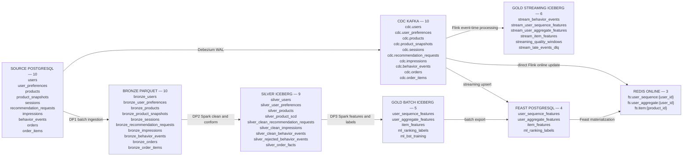
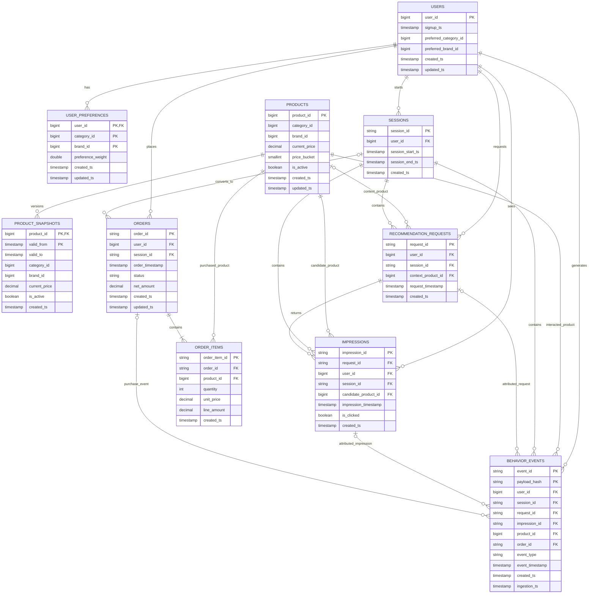
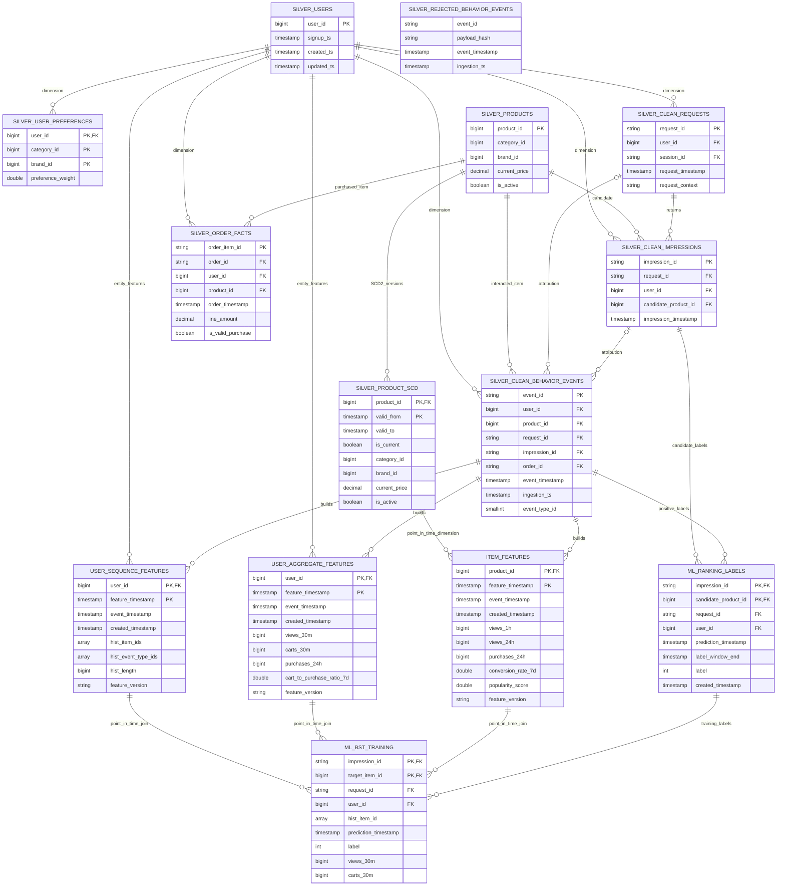
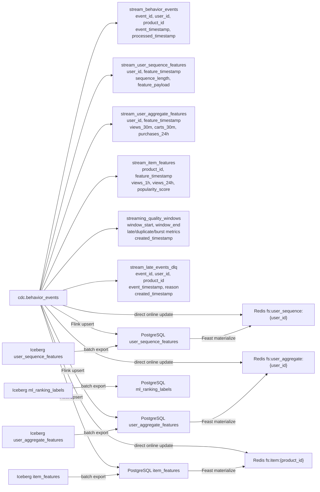

# Schema Design

This document is the schema-as-code view of the current RecSys data platform. It covers every persisted table and governed data entity across Source, CDC, Bronze, Silver, Gold/Feature, Feast offline, and Redis online zones.

The diagrams intentionally show keys, relationship columns, and important timestamps rather than repeating every descriptive attribute. The complete physical column definitions remain in these source-of-truth files:

- [schemas.py (line 11)](../../../apps/data-platform/data-generator/src/schemas.py#L11), [schemas.py (line 201)](../../../apps/data-platform/data-generator/src/schemas.py#L201): 10 Source/Bronze schemas and partition fields.
- [governance_schemas.py (line 21)](../../../apps/data-platform/src/metadata/governance_schemas.py#L21), [governance_schemas.py (line 307)](../../../apps/data-platform/src/metadata/governance_schemas.py#L307): Bronze audit columns, Silver/feature schemas, and PK metadata published to DataHub.
- Batch feature transformations and output columns: [build_user_sequence_features.py (line 1)](../../../apps/data-platform/src/features/spark/build_user_sequence_features.py#L1), [build_user_sequence_features.py (line 63)](../../../apps/data-platform/src/features/spark/build_user_sequence_features.py#L63), [build_user_aggregate_features.py (line 1)](../../../apps/data-platform/src/features/spark/build_user_aggregate_features.py#L1), [build_user_aggregate_features.py (line 41)](../../../apps/data-platform/src/features/spark/build_user_aggregate_features.py#L41), and [build_item_features.py (line 1)](../../../apps/data-platform/src/features/spark/build_item_features.py#L1), [build_item_features.py (line 69)](../../../apps/data-platform/src/features/spark/build_item_features.py#L69).
- [iceberg_feature_sink.py (line 10)](../../../apps/data-platform/src/features/flink/iceberg_feature_sink.py#L10), [iceberg_feature_sink.py (line 110)](../../../apps/data-platform/src/features/flink/iceberg_feature_sink.py#L110): 6 streaming Iceberg table DDLs and catalog setup.
- [postgres_offline_store.py (line 21)](../../../apps/data-platform/src/feature_store/postgres_offline_store.py#L21), [postgres_offline_store.py (line 167)](../../../apps/data-platform/src/feature_store/postgres_offline_store.py#L167), [postgres_offline_store.py (line 213)](../../../apps/data-platform/src/feature_store/postgres_offline_store.py#L213): PostgreSQL offline-store schemas and write helpers.
- [features.py (line 18)](../../../apps/data-platform/feature-store/feature_repo/features.py#L18), [features.py (line 22)](../../../apps/data-platform/feature-store/feature_repo/features.py#L22), [features.py (line 44)](../../../apps/data-platform/feature-store/feature_repo/features.py#L44), [features.py (line 112)](../../../apps/data-platform/feature-store/feature_repo/features.py#L112): Feast entities, PostgreSQL sources, FeatureViews, timestamps, and services.

## Complete Table Inventory

| Zone | Count | Current entities |
|---|---:|---|
| Source PostgreSQL | 10 | `users`, `user_preferences`, `products`, `product_snapshots`, `sessions`, `recommendation_requests`, `impressions`, `behavior_events`, `orders`, `order_items` |
| CDC Kafka | 10 | `cdc.users`, `cdc.user_preferences`, `cdc.products`, `cdc.product_snapshots`, `cdc.sessions`, `cdc.recommendation_requests`, `cdc.impressions`, `cdc.behavior_events`, `cdc.orders`, `cdc.order_items` |
| Bronze Parquet | 10 | `bronze_users`, `bronze_user_preferences`, `bronze_products`, `bronze_product_snapshots`, `bronze_sessions`, `bronze_recommendation_requests`, `bronze_impressions`, `bronze_behavior_events`, `bronze_orders`, `bronze_order_items` |
| Silver Iceberg | 9 | `silver_clean_behavior_events`, `silver_rejected_behavior_events`, `silver_clean_impressions`, `silver_clean_recommendation_requests`, `silver_order_facts`, `silver_product_scd`, `silver_users`, `silver_products`, `silver_user_preferences` |
| Gold batch Iceberg | 5 | `user_sequence_features`, `user_aggregate_features`, `item_features`, `ml_ranking_labels`, `ml_bst_training` |
| Gold streaming Iceberg | 6 | `stream_behavior_events`, `stream_user_sequence_features`, `stream_user_aggregate_features`, `stream_item_features`, `streaming_quality_windows`, `stream_late_events_dlq` |
| Feast PostgreSQL offline | 4 | `user_sequence_features`, `user_aggregate_features`, `item_features`, `ml_ranking_labels` |
| Redis online | 3 | `fs:user_sequence:{user_id}`, `fs:user_aggregate:{user_id}`, `fs:item:{product_id}` |

Total data entities shown below: 57. PostgreSQL and Redis feature entities are physical serving copies of the matching Gold feature outputs, not additional feature definitions.

## Naming Convention

| Logical role | Current convention | Examples |
|---|---|---|
| Source | Business table name | `users`, `behavior_events` |
| CDC | `cdc.<source_table>` | `cdc.behavior_events` |
| Bronze | `bronze_<source_table>` in DataHub; physical Parquet path uses `<namespace>/<table>` | `bronze_orders` |
| Silver dimension | `silver_<entity>` or `silver_<entity>_scd` | `silver_users`, `silver_product_scd` |
| Silver fact | `silver_<subject>_facts` | `silver_order_facts` |
| Silver clean/reject | `silver_clean_<subject>`, `silver_rejected_<subject>` | `silver_clean_behavior_events` |
| Gold features | `<entity>_<feature_family>_features` | `user_sequence_features`, `item_features` |
| ML artifacts | `ml_<purpose>` | `ml_ranking_labels`, `ml_bst_training` |
| Streaming | `stream_<subject>` or `streaming_<subject>` | `stream_item_features`, `streaming_quality_windows` |
| Online key | `fs:<feature_view>:<entity_key>` | `fs:user_aggregate:42` |

This is equivalent to the rubric's `dim_`, `fact_`, and `feat_` convention: the repository expresses the role with `silver_*_scd`, `silver_*_facts`, and `*_features` suffixes instead of a single prefix.

## All Zones Overview



## Source And Bronze ERD

Bronze preserves the same business columns and logical relationships as Source, then adds `source_run_id` and `lakehouse_ingestion_ts` to every table. PostgreSQL currently enforces primary keys; the FK lines below are logical data-contract relationships used by Spark joins and DataHub lineage.



## Silver, Dimension, Fact, And Gold Feature ERD

Iceberg does not enforce foreign keys. These lines document transformation lineage and join semantics. Composite `PK` labels are the logical uniqueness contracts published to DataHub.



### SCD2 dimension semantics

The physical Source and Silver columns are `valid_from` and `valid_to`. A `NULL valid_to` is the current-row flag. The ERD exposes `is_current` as the following deterministic derived field, matching the coursework terminology without claiming that Source PostgreSQL stores a third physical column:

```sql
SELECT
  product_id,
  valid_from,
  valid_to,
  valid_to IS NULL AS is_current,
  category_id,
  brand_id,
  current_price,
  price_bucket,
  is_active
FROM recsys.lakehouse.silver_product_scd;
```

Point-in-time usage:

```sql
SELECT f.*, d.category_id, d.brand_id, d.price_bucket
FROM fact_behavior_events AS f
JOIN dim_product_scd AS d
  ON f.product_id = d.product_id
 AND f.event_timestamp >= d.valid_from
 AND (f.event_timestamp < d.valid_to OR d.valid_to IS NULL);
```

## Feature Timestamp Contract

The three Feast FeatureViews satisfy the required two-time-column design. `feature_timestamp` is the point-in-time lookup field, `event_timestamp` preserves business event time, and `created_timestamp` supports deduplication when rows share the same event time.

| Feature table | Entity key | Event-time fields | Created field | Physical stores |
|---|---|---|---|---|
| `user_sequence_features` | `user_id` | `feature_timestamp`, `event_timestamp` | `created_timestamp` | Iceberg, PostgreSQL, Redis |
| `user_aggregate_features` | `user_id` | `feature_timestamp`, `event_timestamp` | `created_timestamp` | Iceberg, PostgreSQL, Redis |
| `item_features` | `product_id` | `feature_timestamp`, `event_timestamp` | `created_timestamp` | Iceberg, PostgreSQL, Redis |
| `ml_ranking_labels` | `impression_id`, `candidate_product_id` | `prediction_timestamp`, `positive_event_timestamp` | `created_timestamp` | Iceberg, PostgreSQL |
| `ml_bst_training` | `impression_id`, `target_item_id` | `prediction_timestamp`, `event_time` | Not applicable: immutable training artifact | Iceberg |

The streaming Iceberg projections use `feature_timestamp` as their event-time field. `streaming_quality_windows` and `stream_late_events_dlq` also persist `created_timestamp`; the compact streaming feature projections deliberately keep processing metadata inside `feature_payload`.

## Streaming And Serving Relationships



## Complete Transformation Lineage

| Output | Direct upstream table(s) | Relationship |
|---|---|---|
| Every `cdc.<table>` | Matching Source PostgreSQL `<table>` | Debezium after-image of the same primary-keyed entity. |
| Every `bronze_<table>` | Matching generated Source `<table>` | One-to-one raw schema plus `source_run_id` and `lakehouse_ingestion_ts`. |
| `silver_clean_behavior_events` | `bronze_behavior_events` | Normalize timestamps, derive `event_type_id`, and apply `.dropDuplicates(["event_id"])`. |
| `silver_rejected_behavior_events` | `bronze_behavior_events` | Quarantine rows with unsupported behavior-event schema versions. |
| `silver_clean_impressions` | `bronze_impressions` | Timestamp normalization and `impression_id` deduplication. |
| `silver_clean_recommendation_requests` | `bronze_recommendation_requests` | Timestamp normalization and `request_context` defaulting. |
| `silver_order_facts` | `bronze_orders`, `bronze_order_items` | Fact join on `order_id`; derives `is_valid_purchase`. |
| `silver_product_scd` | `bronze_product_snapshots`, fallback `bronze_products` | SCD2 dimension on `product_id`, `valid_from`, `valid_to`. |
| `silver_users` | `bronze_users` | Conformed user dimension. |
| `silver_products` | `bronze_products` | Conformed current-product dimension. |
| `silver_user_preferences` | `bronze_user_preferences` | Conformed bridge between users and category/brand preferences. |
| `user_sequence_features` | `silver_clean_behavior_events` | Bounded per-user event history. |
| `user_aggregate_features` | `silver_clean_behavior_events` | Per-user 30-minute, 24-hour, and 7-day windows. |
| `item_features` | `silver_clean_behavior_events`, `silver_product_scd` | Per-product windows enriched with point-in-time product attributes. |
| `ml_ranking_labels` | `silver_clean_impressions`, `silver_clean_behavior_events` | Impression candidates labeled by later cart/purchase events. |
| `ml_bst_training` | All three batch feature tables and `ml_ranking_labels` | Point-in-time feature joins at `prediction_timestamp`. |
| All six streaming Iceberg tables | `cdc.behavior_events` | Flink event-time processing, quality windows, and late-event routing. |
| Four PostgreSQL offline tables | Matching Iceberg batch table; three feature tables also receive streaming upserts | Feast historical retrieval and materialization source. |
| Three Redis online keys | Matching PostgreSQL FeatureView or direct Flink feature update | Latest entity features for low-latency serving. |
