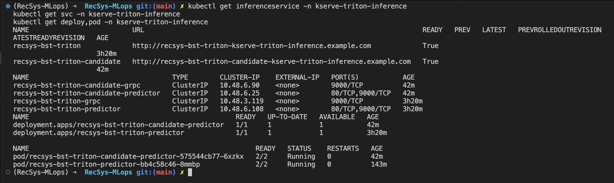
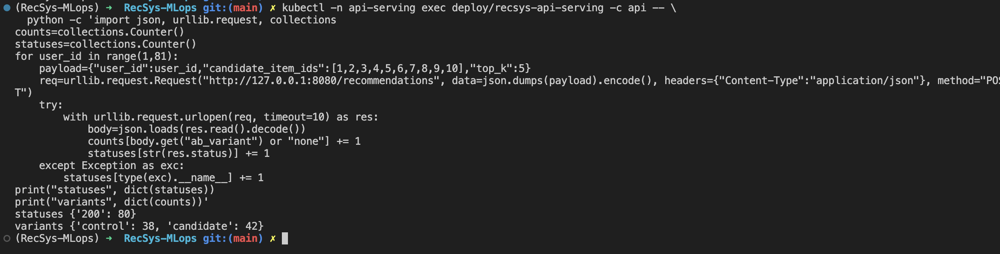
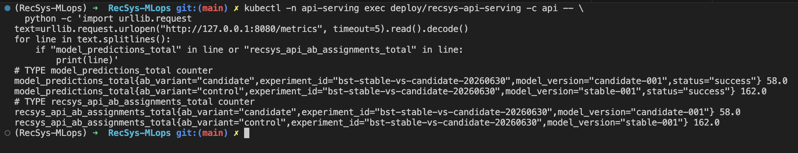
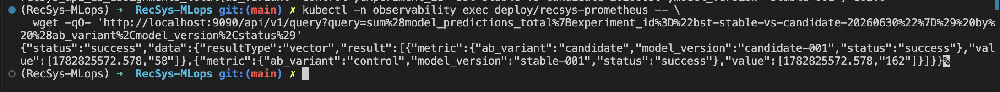
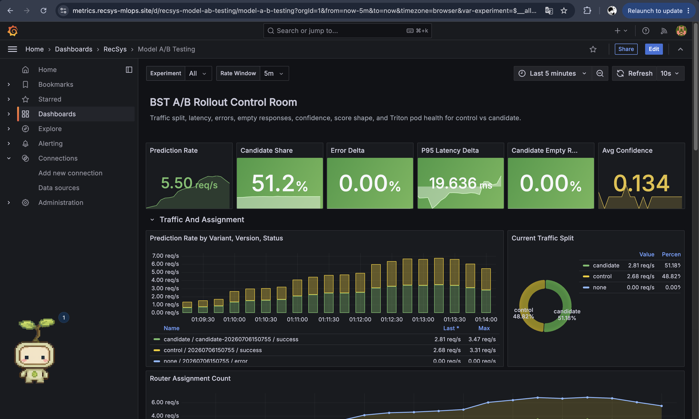
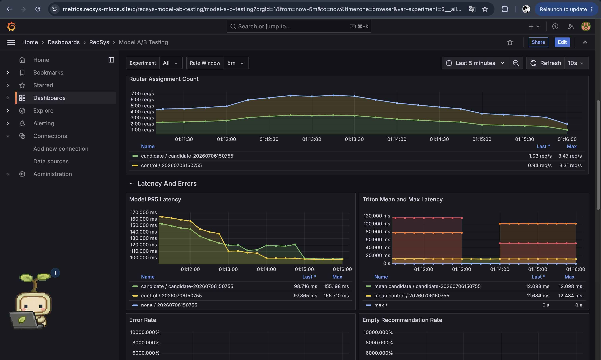
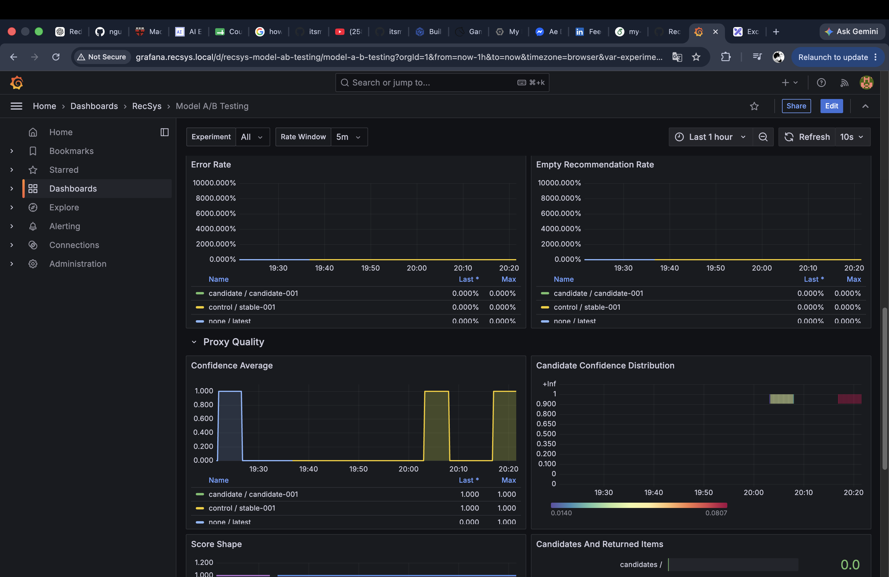
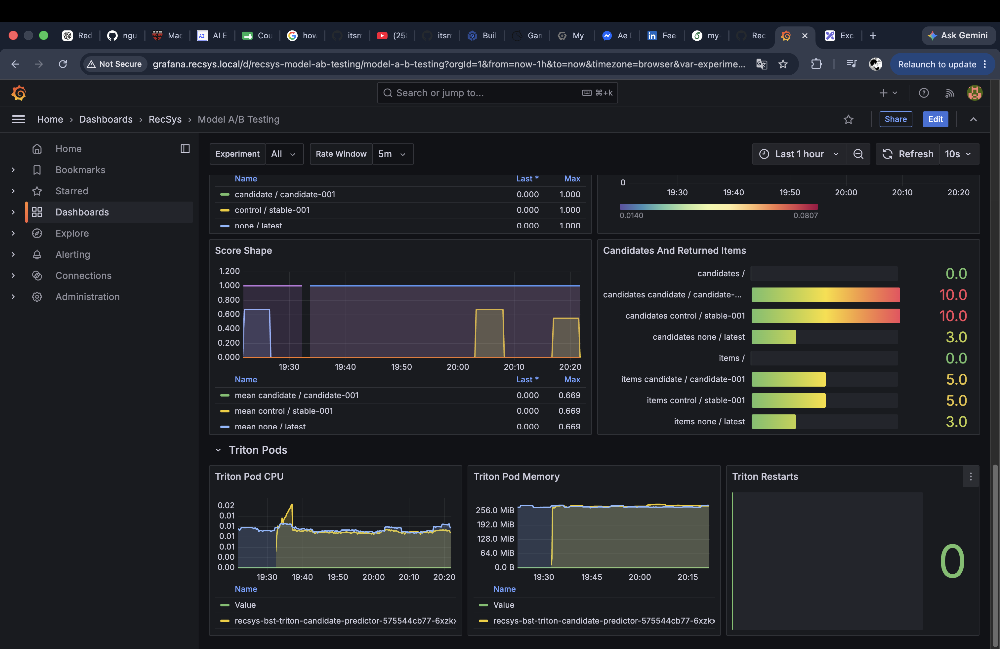

# A/B Testing Proof

This proof covers the final-coursework rubric item **A/B Testing** on GCP/GKE project `fsds-coursework`.

## Scope

| Rubric item | Implementation |
|---|---|
| Perform A/B traffic split for 2 versions of inference service | FastAPI uses `TritonABRouter` to route each user deterministically to control or candidate Triton/KServe gRPC service. |
| Deploy via CI/CD | Model CD renders the same Helm values used by Terraform/Jenkins; the GCP proof is applied through `helm_release.recsys_serving`. |
| Monitor 2 versions | Grafana dashboard `Model A/B Testing` monitors control vs candidate traffic, errors, latency, confidence, score shape, and Triton pod resources. |

Groundtruth assumption: we do not have online groundtruth labels in this proof, so the A/B dashboard uses proxy online metrics: HTTP success/error, empty recommendation rate, model latency, Triton latency, score shape, and confidence distribution.

## Implementation

Code references:

- [apps/api-serving/src/ab_testing.py](../../../apps/api-serving/src/ab_testing.py): `TritonABRouter` assigns users to `control` or `candidate` with a stable hash of `experiment_id:user_id`.
- [apps/api-serving/src/ranking.py](../../../apps/api-serving/src/ranking.py): recommendation flow selects a route, calls the selected ranker, and emits A/B labels.
- [apps/api-serving/src/observability.py](../../../apps/api-serving/src/observability.py): emits `model_predictions_total`, `model_prediction_latency_seconds`, and `model_prediction_confidence`.
- [infra/helm/recsys-serving/templates/inferenceservice.yaml](../../../infra/helm/recsys-serving/templates/inferenceservice.yaml): renders both control and candidate `InferenceService` resources.
- [infra/helm/recsys-serving/templates/api-configmap.yaml](../../../infra/helm/recsys-serving/templates/api-configmap.yaml): passes A/B config into the API pod.
- [infra/helm/recsys-observability/dashboards/model-ab-testing.json](../../../infra/helm/recsys-observability/dashboards/model-ab-testing.json): Grafana dashboard.

Current GCP values:

```text
AB_TEST_ENABLED=1
AB_EXPERIMENT_ID=bst-stable-vs-candidate-20260630
AB_CANDIDATE_WEIGHT_PERCENT=20
AB_CONTROL_MODEL_VERSION=stable-001
AB_CANDIDATE_MODEL_VERSION=candidate-001
AB_CONTROL_TRITON_URL=recsys-bst-triton-grpc.kserve-triton-inference.svc.cluster.local:9000
AB_CANDIDATE_TRITON_URL=recsys-bst-triton-candidate-grpc.kserve-triton-inference.svc.cluster.local:9000
```

## Current Full A/B Flow

The current implementation supports the full A/B lifecycle, but this proof document captures the traffic-split and monitoring state rather than a completed promotion run.

1. Produce model manifests.

   The training/promotion pipeline writes Triton model repository metadata into promotion manifests. In Model CD, the stable manifest is used as `control`, while a new manifest is passed as `candidate`.

2. Render serving values for the desired stage.

   [jenkins/scripts/model_cd.py](../../../jenkins/scripts/model_cd.py) accepts these stages:

   | Stage | Purpose | Resulting A/B state |
   |---|---|---|
   | `deploy` | Deploy the stable production model only. | A/B disabled, candidate weight `0`. |
   | `ab-start` | Start an experiment with control and candidate manifests. | A/B enabled if candidate exists and weight > 0. |
   | `ab-step` | Continue or increase/decrease candidate exposure. | A/B enabled with the requested candidate weight. |
   | `promote` | Make the candidate model the new stable serving model after gates pass. | Candidate becomes stable, A/B disabled, candidate weight `0`. |
   | `rollback` | Return to stable-only serving. | A/B disabled, candidate weight `0`. |

   The stage logic is implemented in `write_values()`: A/B is enabled only for `ab-start` and `ab-step` when a candidate manifest exists and `candidate_weight_percent > 0`. For `deploy`, `promote`, and `rollback`, the rendered values disable A/B routing.

3. Deploy two KServe/Triton inference services during A/B.

   [infra/helm/recsys-serving/templates/inferenceservice.yaml](../../../infra/helm/recsys-serving/templates/inferenceservice.yaml) always renders the control `InferenceService`. When A/B is enabled and `candidateStorageUri` is present, it also renders the candidate `InferenceService` with label `recsys.ai/ab-variant: candidate`.

4. Pass A/B config into the API pod.

   [infra/helm/recsys-serving/templates/api-configmap.yaml](../../../infra/helm/recsys-serving/templates/api-configmap.yaml) exposes the runtime config to FastAPI:

   ```text
   AB_TEST_ENABLED
   AB_EXPERIMENT_ID
   AB_CANDIDATE_WEIGHT_PERCENT
   AB_CONTROL_MODEL_VERSION
   AB_CANDIDATE_MODEL_VERSION
   AB_CONTROL_TRITON_URL
   AB_CANDIDATE_TRITON_URL
   ```

5. Route each recommendation request.

   [apps/api-serving/src/ab_testing.py](../../../apps/api-serving/src/ab_testing.py) builds one Triton ranker for `control` and one Triton ranker for `candidate`. `TritonABRouter.assign()` hashes `experiment_id:user_id` into a bucket from `0..99`; if the bucket is below `AB_CANDIDATE_WEIGHT_PERCENT`, the user is assigned to `candidate`, otherwise to `control`.

6. Return and monitor variant metadata.

   [apps/api-serving/src/ranking.py](../../../apps/api-serving/src/ranking.py) passes the selected route into the recommendation response, so each response includes `ab_variant`, `ab_experiment_id`, and `model_version`. The same labels are also attached to Prometheus metrics through [apps/api-serving/src/serving_utils.py](../../../apps/api-serving/src/serving_utils.py), which lets Grafana compare control and candidate request volume, errors, latency, confidence, and score shape.

7. Decide promote or rollback.

   [jenkins/scripts/model_cd.py](../../../jenkins/scripts/model_cd.py) implements promotion gates in `assert_promote_gates()`:

   - Promote is allowed when candidate error rate is not more than `0.02` above control error rate.
   - Promote is allowed when candidate p95 latency is not more than `1.5x` control p95 latency.
   - If either gate fails, `model_cd.py --stage promote` raises an error before updating the production manifest.

   If the candidate passes and `--apply` is used, `promote` copies the candidate Triton repository into the stable serving URI, uploads the new production manifest, then renders a stable-only deploy with A/B disabled. If the candidate fails or the operator chooses not to continue, `rollback` renders stable-only values and sets candidate weight back to `0`.

Current proof status: this document proves that `ab-start`-style serving is active on GCP because both `recsys-bst-triton` and `recsys-bst-triton-candidate` are ready, live requests split into `control` and `candidate`, and Prometheus/Grafana expose per-variant metrics. It does not claim that `model_cd.py --stage promote` has already been executed for this experiment.

## Two Inference Services

```bash
kubectl get inferenceservice -n kserve-triton-inference
kubectl get svc -n kserve-triton-inference
kubectl get deploy,pod -n kserve-triton-inference
```

Observed result:

```text
NAME                          READY
recsys-bst-triton             True
recsys-bst-triton-candidate   True

NAME                                    TYPE        PORT(S)
recsys-bst-triton-grpc                  ClusterIP   9000/TCP
recsys-bst-triton-candidate-grpc        ClusterIP   9000/TCP
recsys-bst-triton-predictor             ClusterIP   80/TCP,9000/TCP
recsys-bst-triton-candidate-predictor   ClusterIP   80/TCP,9000/TCP

deployment.apps/recsys-bst-triton-predictor             1/1
deployment.apps/recsys-bst-triton-candidate-predictor   1/1
pod/recsys-bst-triton-predictor-bb4c58c46-8mmbp              2/2 Running
pod/recsys-bst-triton-candidate-predictor-575544cb77-6xzkx   2/2 Running
```

### Image proof 



## Traffic Split Test

Run this from the workstation. It executes inside the API pod and calls the local API server, so it tests the real A/B router without depending on the public gateway or Docker local.

```bash
kubectl -n api-serving exec deploy/recsys-api-serving -c api -- \
  python -c 'import json, urllib.request, collections
counts=collections.Counter()
statuses=collections.Counter()
for user_id in range(1,81):
    payload={"user_id":user_id,"candidate_item_ids":[1,2,3,4,5,6,7,8,9,10],"top_k":5}
    req=urllib.request.Request("http://127.0.0.1:8080/recommendations", data=json.dumps(payload).encode(), headers={"Content-Type":"application/json"}, method="POST")
    try:
        with urllib.request.urlopen(req, timeout=10) as res:
            body=json.loads(res.read().decode())
            counts[body.get("ab_variant") or "none"] += 1
            statuses[str(res.status)] += 1
    except Exception as exc:
        statuses[type(exc).__name__] += 1
print("statuses", dict(statuses))
print("variants", dict(counts))'
```

Observed result:

```text
statuses {'200': 80}
variants {'control': 57, 'candidate': 23}
```

What this proves:

- `statuses {'200': 80}` means all 80 real in-cluster API calls succeeded.
- `variants {'control': 57, 'candidate': 23}` means the API routed some users to the stable model and some users to the candidate model.
- `control` is the current stable model path, configured as `AB_CONTROL_TRITON_URL` / `AB_CONTROL_MODEL_VERSION`.
- `candidate` is the newly deployed model path under test, configured as `AB_CANDIDATE_TRITON_URL` / `AB_CANDIDATE_MODEL_VERSION`.
- The split is sticky per user: the same `experiment_id:user_id` hashes to the same A/B bucket, so repeat calls for the same user stay on the same variant during the experiment.

The `ab_variant` value is not inferred from Kubernetes after the fact. It is an explicit response field emitted by the API:

- [apps/api-serving/src/api_schemas.py](../../../apps/api-serving/src/api_schemas.py): `RecommendationResponse` includes `ab_variant` and `ab_experiment_id`.
- [apps/api-serving/src/ab_testing.py](../../../apps/api-serving/src/ab_testing.py): `TritonABRouter.from_env()` creates a control Triton ranker with `ab_variant="control"` and a candidate Triton ranker with `ab_variant="candidate"`.
- [apps/api-serving/src/ab_testing.py](../../../apps/api-serving/src/ab_testing.py): `TritonABRouter.assign()` hashes `experiment_id:user_id` into a bucket and compares it with `AB_CANDIDATE_WEIGHT_PERCENT`.
- [apps/api-serving/src/ab_testing.py](../../../apps/api-serving/src/ab_testing.py): `TritonABRouter.route()` returns a `TritonRoute` carrying the selected `model_version`, `ab_variant`, and `ab_experiment_id`.
- [apps/api-serving/src/ranking.py](../../../apps/api-serving/src/ranking.py): `recommend()` passes the route metadata into `format_top_k()`, so the API response exposes whether that request used `control` or `candidate`.
- [apps/api-serving/src/serving_utils.py](../../../apps/api-serving/src/serving_utils.py): `ab_labels()` also attaches `ab_variant`, `model_version`, and `experiment_id` to Prometheus metrics.

With `AB_CANDIDATE_WEIGHT_PERCENT=20`, the expected long-run candidate share is about 20%. This short proof uses only user IDs `1..80`, so the observed 23/80 candidate assignments are deterministic for this exact range and can differ from exactly 20%. The key evidence is that both variants receive successful traffic and the response/metrics identify which model version served each request.

### Image proof to capture:




## Prometheus Proof

Raw API metrics:

```bash
kubectl -n api-serving exec deploy/recsys-api-serving -c api -- \
  python -c 'import urllib.request
text=urllib.request.urlopen("http://127.0.0.1:8080/metrics", timeout=5).read().decode()
for line in text.splitlines():
    if "model_predictions_total" in line or "recsys_api_ab_assignments_total" in line:
        print(line)'
```

Observed result:

```text
model_predictions_total{ab_variant="candidate",experiment_id="bst-stable-vs-candidate-20260630",model_version="candidate-001",status="success"} 23.0
model_predictions_total{ab_variant="control",experiment_id="bst-stable-vs-candidate-20260630",model_version="stable-001",status="success"} 57.0
recsys_api_ab_assignments_total{ab_variant="candidate",experiment_id="bst-stable-vs-candidate-20260630",model_version="candidate-001"} 23.0
recsys_api_ab_assignments_total{ab_variant="control",experiment_id="bst-stable-vs-candidate-20260630",model_version="stable-001"} 57.0
```
### Image proof 



Prometheus table query:

```bash
kubectl -n observability exec deploy/recsys-prometheus -- \
  wget -qO- 'http://localhost:9090/api/v1/query?query=sum%28model_predictions_total%7Bexperiment_id%3D%22bst-stable-vs-candidate-20260630%22%7D%29%20by%20%28ab_variant%2Cmodel_version%2Cstatus%29'
```

Observed data:

```text
candidate candidate-001 success 23
control   stable-001    success 57
```

Latency and confidence proxy metrics:

```text
mean latency candidate-001 = 0.0196s
mean latency stable-001    = 0.0177s
mean confidence candidate  = 1.0
mean confidence control    = 1.0
```

### Image proof 



## Grafana Dashboard

Dashboard: `Model A/B Testing`

URL through gateway:

```text
http://grafana.recsys.local/d/recsys-model-ab-testing/model-a-b-testing
```

Panels prepared for screenshots:

| Panel | Purpose |
|---|---|
| Prediction Rate | Request rate for the selected experiment. |
| Candidate Share | Actual candidate share observed by Prometheus. |
| Error Delta | Candidate error rate minus control error rate. |
| P95 Latency Delta | Candidate p95 latency minus control p95 latency. |
| Prediction Rate by Variant, Version, Status | Main table/time series for A/B result. |
| Current Traffic Split | Pie chart of control vs candidate. |
| Router Assignment Count | Confirms deterministic router assignment counts. |
| Model P95 Latency | Per-variant latency from `model_prediction_latency_seconds_bucket`. |
| Confidence Average / Distribution | Proxy quality without groundtruth. |
| Triton Pod CPU / Memory / Restarts | Runtime health for both inference services. |

### Image proof 








