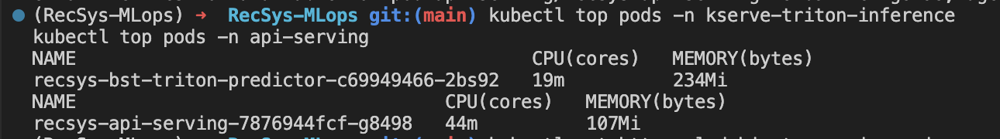

# Autoscale

## api-serving namespace (FastAPI)

### Config evidence

The main configuration is defined in this Helm values file:
[infra/helm/recsys-serving/values.yaml line 95](../../../infra/helm/recsys-serving/values.yaml#95)

The API serving autoscaling configuration is:

```yaml
autoscaling:
  http:
    api:
      enabled: true
      name: recsys-api-serving-http
      host: recsys-api-serving.local
      minReplicas: 1
      maxReplicas: 5
      requestRate:
        targetValue: 5
```

This renders a KEDA `HTTPScaledObject` from:
[infra/helm/recsys-serving/templates/api-http-scaledobject.yaml line 1](../../../infra/helm/recsys-serving/templates/api-http-scaledobject.yaml#1)

This means the FastAPI service scales by HTTP request rate. The target is 5 requests per second, with a minimum of 1 replica and a maximum of 5 replicas.

## Triton inference service (KServe)

### Config evidence

The Triton/KServe autoscaling configuration is defined in:
[infra/helm/recsys-serving/values.yaml line 130](../../../infra/helm/recsys-serving/values.yaml#130)

```yaml
autoscaling:
  kserveResource:
    enabled: true
    deploymentName: recsys-bst-triton-predictor
    minReplicas: 1
    maxReplicas: 3
    hpaName: recsys-bst-triton-predictor
    cpu:
      enabled: true
      metricType: Utilization
      value: "50"
```

This renders a KEDA `ScaledObject` from:
[infra/helm/recsys-serving/templates/kserve-resource-scaledobject.yaml line 1](../../../infra/helm/recsys-serving/templates/kserve-resource-scaledobject.yaml#1)

This means Triton scales by CPU utilization. The target is 50% CPU utilization, with a minimum of 1 replica and a maximum of 3 replicas.

## 2. Runtime object proof

The following commands show the actual autoscaling objects deployed in the cluster:

```bash
kubectl get httpscaledobject -n api-serving
kubectl get scaledobject -n kserve-triton-inference
kubectl get hpa -A
```


Then describe the objects for detailed configuration and runtime status:

```bash
kubectl describe httpscaledobject -n api-serving recsys-api-serving-http
kubectl describe scaledobject -n kserve-triton-inference recsys-bst-triton-resource
```

### Describe api-serving scale object


### Describe Triton scale object


## 3. Metrics proof

Because Triton scales by CPU utilization, the Kubernetes `metrics-server` must be working. These commands verify that CPU and memory metrics are available:

```bash
kubectl top pods -n kserve-triton-inference
kubectl top pods -n api-serving
```



If these commands return CPU and memory values, the resource metrics pipeline is available for the Triton HPA.

## 4. Visual scaling proof

### Load proof

#### Port forward first

```bash
kubectl -n keda port-forward svc/keda-add-ons-http-interceptor-proxy 18081:8080
```

This port-forward exposes the KEDA HTTP interceptor locally on port `18081`. Traffic must go through this interceptor for KEDA to count API request rate and scale the FastAPI deployment.

#### Test the curl

```bash
curl -i -X POST http://127.0.0.1:18081/recommendations \
  -H 'Host: recsys-api-serving.local' \
  -H 'Content-Type: application/json' \
  -d '{"user_id":50,"candidate_item_ids":[456,379,287,194,157],"top_k":3}'
```

This request validates that the interceptor can route traffic to the FastAPI service. The `Host` header is required because the `HTTPScaledObject` is configured for `recsys-api-serving.local`.

#### Run Locust stress test

The command below generates API traffic through the KEDA HTTP interceptor:

```bash
RECSYS_LOAD_TARGET=api \
RECSYS_HOST_HEADER=recsys-api-serving.local \
RECSYS_CANDIDATE_COUNT=50 \
RECSYS_TOP_K=10 \
uv run --with locust locust \
  -f tests/load/locustfile_serving.py \
  --host http://127.0.0.1:18081 \
  --headless \
  -u 20 \
  -r 5 \
  -t 2m \
  --only-summary
```

#### Explain the config of the running command above

- `RECSYS_LOAD_TARGET=api`: tells the Locust file to call the FastAPI `/recommendations` endpoint instead of Triton's direct HTTP inference endpoint.
- `RECSYS_HOST_HEADER=recsys-api-serving.local`: sends the host value expected by the KEDA `HTTPScaledObject`. Without this header, the interceptor may not match the API route correctly and KEDA may not count the request rate.
- `RECSYS_CANDIDATE_COUNT=50`: sends 50 candidate item IDs per recommendation request. A larger candidate count increases inference work because FastAPI sends a larger ranking payload to Triton.
- `RECSYS_TOP_K=10`: asks the service to return the top 10 ranked recommendations.
- `uv run --with locust locust`: runs Locust in the project environment while installing the `locust` package for this command.
- `-f tests/load/locustfile_serving.py`: points Locust to the project load-test file.
- `--host http://127.0.0.1:18081`: sends all requests to the local KEDA interceptor port-forward.
- `--headless`: runs Locust without the web UI.
- `-u 20`: runs 20 concurrent simulated users.
- `-r 5`: ramps users up at 5 users per second.
- `-t 2m`: keeps the test running for 2 minutes.
- `--only-summary`: prints only the final summary table.

Expected scaling behavior:

- FastAPI scales by KEDA HTTP request-rate metrics when traffic goes through `18081` with the correct `Host` header.
- Triton scales separately by CPU utilization because FastAPI calls Triton through gRPC.
- If the HPA desired replica count increases but pods remain `Pending`, the cluster does not have enough schedulable CPU or memory.

#### Before running Locust


#### Scaling api-serving up


#### Scaling Triton inference up


#### Fully scaled up


