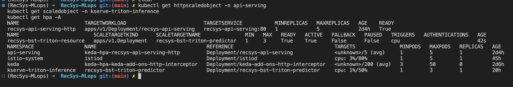
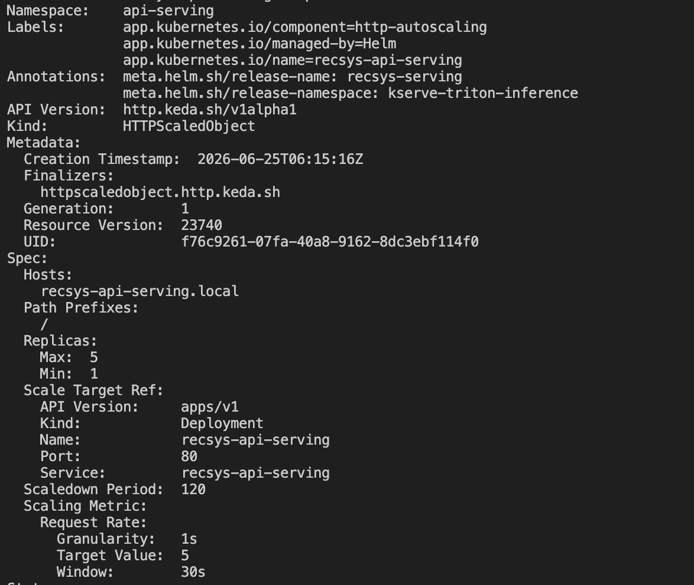
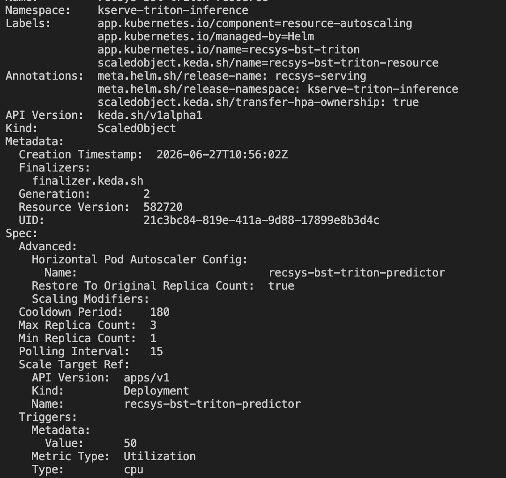

# Autoscale

## namespace api-serving (FastAPI)

### Config evidence

Xem chính ở Helm chart này:
[infra/helm/recsys-serving/values.yaml line 95](../../../infra/helm/recsys-serving/values.yaml#95)

API serving autoscale nằm ở:

```yaml
autoscaling:
  http:
    api:
      enabled: true
      name: recsys-api-serving-http
      host: recsys-api-serving.local
      minReplicas: 1
      maxReplicas: 5
      requestRate:
        targetValue: 5
```

Nó render ra KEDA `HTTPScaledObject` ở:
[infra/helm/recsys-serving/templates/api-http-scaledobject.yaml line 1](../../../infra/helm/recsys-serving/templates/api-http-scaledobject.yaml#1)

Tức là API scale theo request rate, target 5 req/s.

## Triton inference service (kserve)

### Config evidence 

Triton/KServe autoscale nằm ở:
[infra/helm/recsys-serving/values.yaml line 130](../../../infra/helm/recsys-serving/values.yaml#130)

```yaml
autoscaling:
  kserveResource:
    enabled: true
    deploymentName: recsys-bst-triton-predictor
    minReplicas: 1
    maxReplicas: 3
    hpaName: recsys-bst-triton-predictor
    cpu:
      enabled: true
      metricType: Utilization
      value: "50"
```

Nó render ra KEDA `ScaledObject` ở:
[infra/helm/recsys-serving/templates/kserve-resource-scaledobject.yaml line 1](../../../infra/helm/recsys-serving/templates/kserve-resource-scaledobject.yaml#1)

Tức là Triton scale theo CPU utilization, target 50%.

## 2. Runtime object proof

Show object đã deploy thật trong cluster:

```bash
kubectl get httpscaledobject -n api-serving
kubectl get scaledobject -n kserve-triton-inference
kubectl get hpa -A
```



Rồi describe:

```bash
kubectl describe httpscaledobject -n api-serving recsys-api-serving-http
kubectl describe scaledobject -n kserve-triton-inference recsys-bst-triton-resource
```

### Describe api-serving scale object



### Describe Triton scale object



## 3. Metrics proof

Vì Triton scale theo CPU, show `metrics-server` đang hoạt động:

```bash
kubectl top pods -n kserve-triton-inference
kubectl top pods -n api-serving
```

Nếu command này có CPU/RAM data là ổn.

## 4. Baseline proof trước load

Show ban đầu đang ít replica:

```bash
kubectl get deploy -n api-serving recsys-api-serving
kubectl get deploy -n kserve-triton-inference recsys-bst-triton-predictor
kubectl get hpa -A
```

Expected:

```text
api-serving: 1/1
triton predictor: 1/1
HPA target thấp hoặc 0
```

## 5. Load proof

Show Locust command và output:

```bash
RECSYS_LOAD_TARGET=api \
RECSYS_HOST_HEADER=recsys-api-serving.local \
RECSYS_CANDIDATE_COUNT=200 \
RECSYS_TOP_K=10 \
uv run --with locust locust \
  -f tests/load/locustfile_serving.py \
  --host http://127.0.0.1:18081 \
  --headless \
  -u 160 \
  -r 40 \
  -t 3m \
  --only-summary
```

Proof tốt nhất ở đây là:

```text
requests > 0
failures = 0
req/s cao hơn target 5 req/s
```
