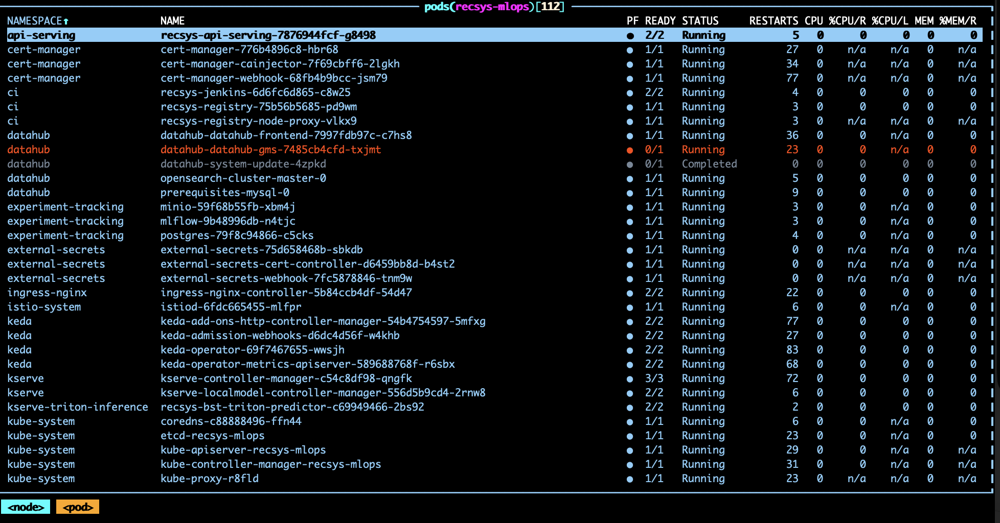
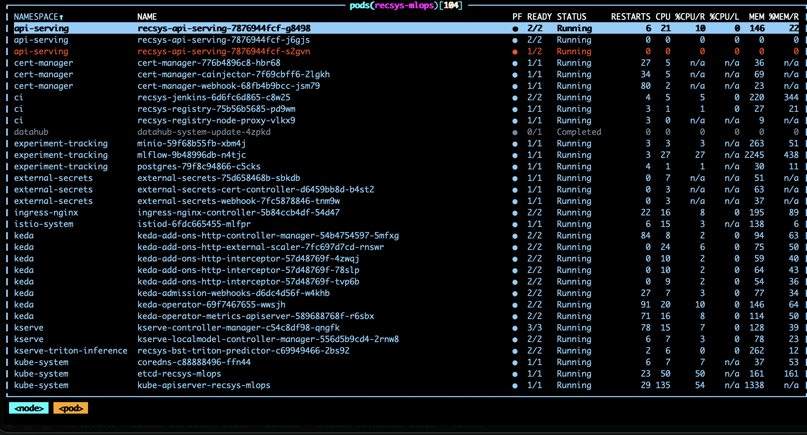
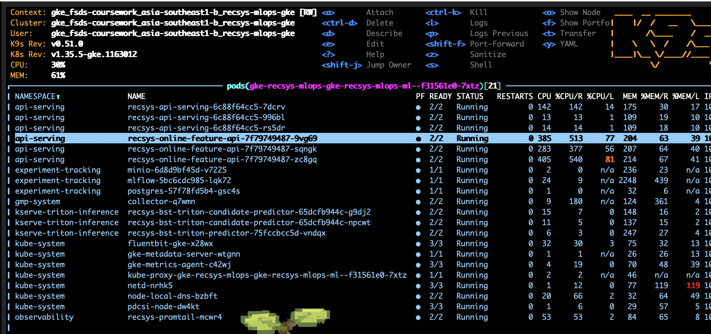
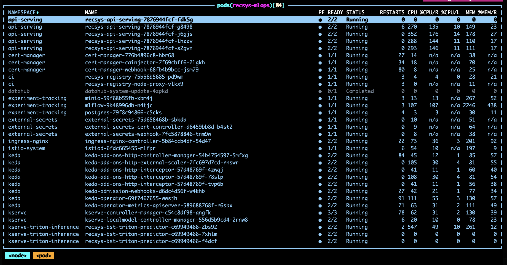
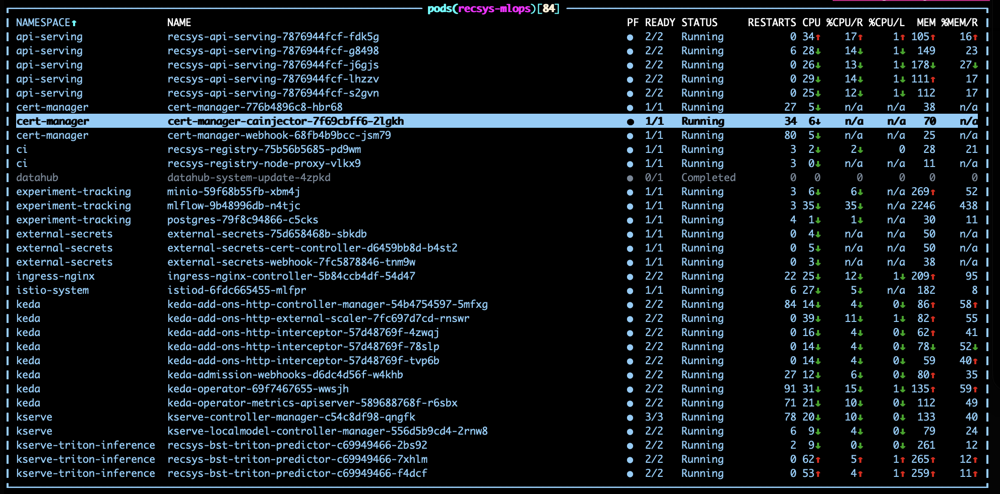

# Autoscaling Evidence

## Autoscaling Configuration Evidence

### Online Feature API Autoscaling

#### Code References

- [values-gcp-autoscale-proof.yaml (line 6)](../../../infra/helm/recsys-serving/values-gcp-autoscale-proof.yaml#L6), [values-gcp-autoscale-proof.yaml (line 45)](../../../infra/helm/recsys-serving/values-gcp-autoscale-proof.yaml#L45): enables API/feature autoscaling and defines replicas, request-rate, and latency thresholds.
- [fastapi-prometheus-scaledobjects.yaml (line 43)](../../../infra/helm/recsys-serving/templates/fastapi-prometheus-scaledobjects.yaml#L43), [fastapi-prometheus-scaledobjects.yaml (line 78)](../../../infra/helm/recsys-serving/templates/fastapi-prometheus-scaledobjects.yaml#L78): renders the online-feature KEDA `ScaledObject` and Prometheus triggers.

#### Configuration

```yaml
autoscaling:
  prometheus:
    featureApi:
      enabled: true
      name: recsys-online-feature-api-prometheus
      hpaName: recsys-online-feature-api
      serviceLabel: recsys-online-feature-api
      route: /online-features
      method: POST
      minReplicas: 1
      maxReplicas: 3
      requestRate:
        targetValue: "4"
        activationThreshold: "1"
        window: 1m
      latency:
        targetValue: "0.08"
        activationThreshold: "0.03"
        window: 1m
```

#### Scaling Behavior

`recsys-online-feature-api` scales from 1 to 3 pods. KEDA reads Prometheus metrics for `/online-features` and scales up when either request rate is above 4 req/s or average request latency is above 0.08 seconds over a 1-minute window. This service is expected to scale together with `recsys-api-serving` because every recommendation request fetches online Feast features before inference.

### Recommendation API Autoscaling

#### Code References

- [inference_api.py (line 75)](../../../apps/api-serving/src/inference_api.py#L75), [inference_api.py (line 123)](../../../apps/api-serving/src/inference_api.py#L123): async `/recommendations` workload measured by the scaler.
- [values-gcp-autoscale-proof.yaml (line 6)](../../../infra/helm/recsys-serving/values-gcp-autoscale-proof.yaml#L6), [values-gcp-autoscale-proof.yaml (line 29)](../../../infra/helm/recsys-serving/values-gcp-autoscale-proof.yaml#L29): API replica and threshold settings.
- [fastapi-prometheus-scaledobjects.yaml (line 1)](../../../infra/helm/recsys-serving/templates/fastapi-prometheus-scaledobjects.yaml#L1), [fastapi-prometheus-scaledobjects.yaml (line 39)](../../../infra/helm/recsys-serving/templates/fastapi-prometheus-scaledobjects.yaml#L39): API-serving KEDA object and Prometheus queries.

#### Configuration

```yaml
autoscaling:
  prometheus:
    api:
      enabled: true
      name: recsys-api-serving-prometheus
      hpaName: recsys-api-serving
      serviceLabel: recsys-api-serving
      route: /recommendations
      method: POST
      minReplicas: 1
      maxReplicas: 3
      requestRate:
        targetValue: "4"
        activationThreshold: "1"
        window: 1m
      latency:
        targetValue: "0.15"
        activationThreshold: "0.04"
        window: 1m
```

#### Scaling Behavior

`recsys-api-serving` scales from 1 to 3 pods. KEDA reads Prometheus metrics for `/recommendations` and scales up when either request rate is above 4 req/s or average request latency is above 0.15 seconds over a 1-minute window. This is the public serving entrypoint, so load starts here and then propagates to the online feature API and Triton inference.

### Triton Inference Autoscaling

#### Code References

- [values-gcp-autoscale-proof.yaml (line 47)](../../../infra/helm/recsys-serving/values-gcp-autoscale-proof.yaml#L47), [values-gcp-autoscale-proof.yaml (line 58)](../../../infra/helm/recsys-serving/values-gcp-autoscale-proof.yaml#L58): Triton/KServe replica, CPU, and proof resource settings.
- [kserve-resource-scaledobject.yaml (line 1)](../../../infra/helm/recsys-serving/templates/kserve-resource-scaledobject.yaml#L1), [kserve-resource-scaledobject.yaml (line 66)](../../../infra/helm/recsys-serving/templates/kserve-resource-scaledobject.yaml#L66): renders control/candidate Triton KEDA `ScaledObject` resources and CPU triggers.

#### Configuration

```yaml
autoscaling:
  kserveResource:
    enabled: true
    minReplicas: 1
    maxReplicas: 3
    pollingInterval: 15
    cooldownPeriod: 240
    cpu:
      enabled: true
      metricType: Utilization
      value: "15"
kserve:
  resources:
    requests:
      cpu: 100m
      memory: 768Mi
    limits:
      cpu: "2"
      memory: 4Gi
```

#### Scaling Behavior

`recsys-bst-triton-predictor` scales from 1 to 3 pods using CPU utilization. The proof target is 15% CPU utilization, and the request CPU is lowered to `100m` so the small coursework model can still demonstrate scale-up on the limited GKE node. Triton receives traffic indirectly from `recsys-api-serving` after the API builds the inference payload from online features.

## Load Test Evidence

### Locust Stress Test Command

Code references:

- [serving_autoscale_load_test.sh (line 1)](../../../infra/k8s/scripts/serving_autoscale_load_test.sh#L1), [serving_autoscale_load_test.sh (line 48)](../../../infra/k8s/scripts/serving_autoscale_load_test.sh#L48): selects the target, port-forwards the Service, prints autoscale state, runs Locust, and prints the post-load state.
- [locustfile_serving.py (line 21)](../../../tests/load/locustfile_serving.py#L21), [locustfile_serving.py (line 89)](../../../tests/load/locustfile_serving.py#L89): selects the load target and calls `/recommendations` or `/online-features`.
- [inference_api.py (line 75)](../../../apps/api-serving/src/inference_api.py#L75), [inference_api.py (line 119)](../../../apps/api-serving/src/inference_api.py#L119): recommendation serving calls the online-feature client and sends the feature payload through the Triton-backed ranking path.

Run one end-to-end recommendation API load test. This single command triggers the full serving path:

```text
Locust -> recsys-api-serving -> recsys-online-feature-api -> Triton inference
```

```bash
LOCUST_USERS=60 \
LOCUST_SPAWN_RATE=20 \
LOCUST_DURATION=3m \
RECSYS_LOAD_TARGET=api \
RECSYS_USER_ID=4 \
RECSYS_CANDIDATE_COUNT=200 \
RECSYS_TOP_K=10 \
make serving-autoscale-load-test
```

### Baseline Before Load

#### Screenshot Evidence



### Recommendation And Online Feature APIs Scaling Up

#### Screenshot Evidence





### Triton Inference Scaling Up

#### Screenshot Evidence



### Fully Scaled State

#### Screenshot Evidence


