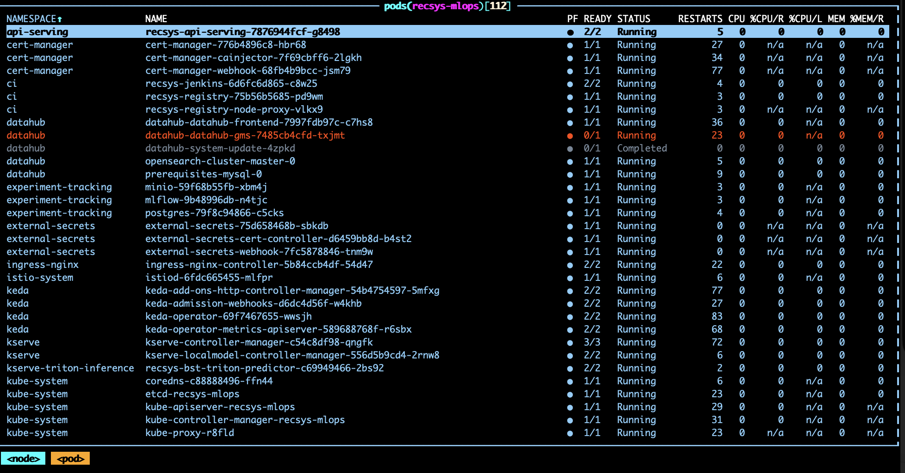
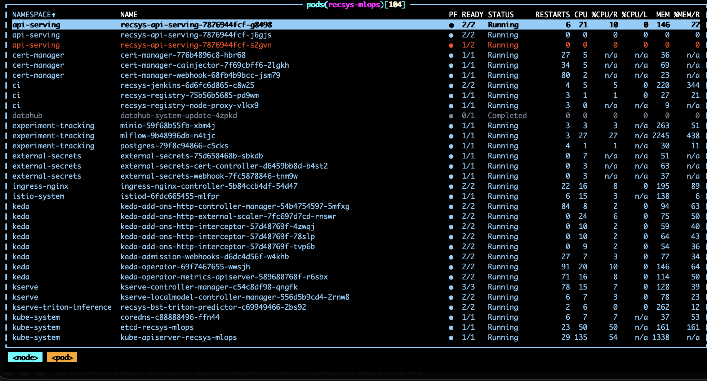
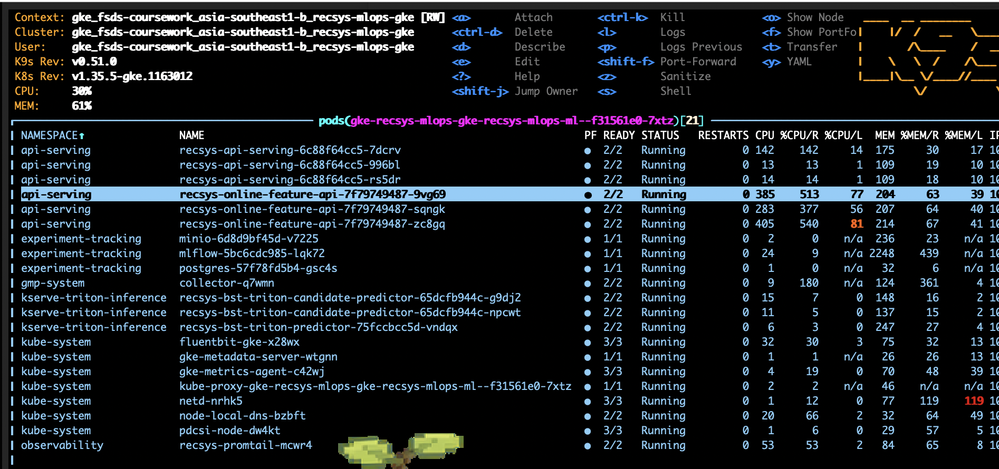
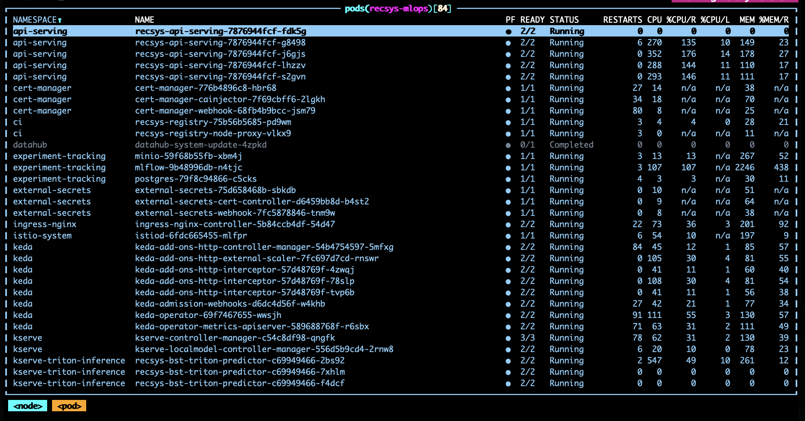
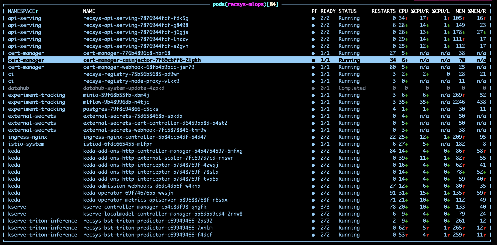

# Autoscaling Evidence

## Autoscaling Configuration Evidence

### End-To-End Autoscaling Flow


> **Detailed runtime note:**
>
> 1. Metrics are process-local first. Each Recommendation API pod records its own request counter and
>    latency histogram in memory, and its `/metrics` endpoint exposes only that pod's current snapshot.
>    The Online Feature API does the same with a different `service` label.
> 2. Prometheus is the collector and time-series store. It discovers the annotated pods, calls
>    `GET /metrics` every **15 seconds**, and stores the returned samples. Prometheus does not decide
>    how many replicas the application needs.
> 3. The **KEDA operator** runs the PromQL scaler queries. Every **10 seconds** it sends the
>    request-rate and latency expressions from the `ScaledObject` to the Prometheus HTTP API. KEDA
>    does not scrape application pods directly; it evaluates the data already collected by Prometheus.
> 4. Both API PromQL expressions use a **one-minute range window**. Request rate uses
>    `rate(recsys_api_requests_total[1m])`; average latency divides the one-minute rate of the latency
>    sum by the one-minute rate of its count. Because scraping is every 15 seconds, consecutive
>    10-second KEDA polls can legitimately observe the same newest Prometheus sample.
> 5. KEDA publishes each query result through the Kubernetes external-metrics API. The generated HPA
>    compares the observed value with its threshold and uses the largest replica recommendation from
>    the request-rate and latency triggers, bounded by `minReplicas=1` and `maxReplicas=3`.
> 6. A recommendation request exercises the complete serving chain: Recommendation API → Online
>    Feature API → Triton. The first two Deployments own separate Prometheus/KEDA/HPA loops, so one
>    service can scale without forcing the other to the same replica count.
> 7. Triton is intentionally different. Its KEDA `ScaledObject` uses Kubernetes CPU utilization rather
>    than PromQL. In the proof overlay the target is `15%` of a `100m` CPU request, with the same
>    `1–3` replica bounds. KServe is configured with `autoscalerClass=external`, leaving replica
>    ownership to the KEDA-generated HPA.
> 8. GKE Cluster Autoscaler is the final infrastructure loop. It does not inspect HTTP metrics or
>    PromQL. It adds a node only when HPA/KEDA has already requested more pods and Kubernetes cannot
>    schedule them on the existing node pool; it can later remove underused nodes within Terraform's
>    configured bounds.
> 9. Scaling is therefore not instantaneous. A scale-up must pass through metric emission, the next
>    Prometheus scrape, a KEDA poll, HPA reconciliation, pod scheduling, and readiness. The chart also
>    configures KEDA cooldowns of `120s` for the APIs and `240s` for Triton, but these must not be read
>    as guaranteed `3 → 1` delays: with `minReplicaCount=1`, non-zero downscaling is governed by the
>    generated HPA's behavior and reconciliation loop, while KEDA cooldown primarily governs the
>    inactive-trigger/scale-to-zero path.

Runtime/configuration reference:

- [API metric middleware and `/metrics`](../../../apps/api-serving/src/api_runtime.py#L18), [Prometheus 15-second scrape](../../../infra/helm/recsys-observability/templates/prometheus.yaml#L40), and [annotated-pod discovery](../../../infra/helm/recsys-observability/templates/prometheus.yaml#L94).
- [KEDA 10-second polling and shared cooldown](../../../infra/helm/recsys-serving/values-gcp-autoscale-proof.yaml#L6), [Recommendation API PromQL triggers](../../../infra/helm/recsys-serving/templates/fastapi-prometheus-scaledobjects.yaml#L25), and [Online Feature API triggers](../../../infra/helm/recsys-serving/templates/fastapi-prometheus-scaledobjects.yaml#L64).
- [Triton CPU proof values](../../../infra/helm/recsys-serving/values-gcp-autoscale-proof.yaml#L46), [resource `ScaledObject`](../../../infra/helm/recsys-serving/templates/kserve-resource-scaledobject.yaml#L13), and [KServe external-autoscaler handoff](../../../infra/helm/recsys-serving/templates/inferenceservice.yaml#L12).
- [GKE CPU node-pool autoscaling](../../../infra/terraform/gcp/gke.tf#L97) and [node bounds](../../../infra/terraform/gcp/variables.tf#L79).

Reference code:

- [inference_api.py (line 75)](../../../apps/api-serving/src/inference_api.py#L75): public `/recommendations` entrypoint.
- [api_runtime.py (line 18)](../../../apps/api-serving/src/api_runtime.py#L18), [observability.py (line 199)](../../../apps/api-serving/src/observability.py#L199): request middleware and metric recording.
- [api_runtime.py (line 65)](../../../apps/api-serving/src/api_runtime.py#L65): Prometheus text endpoint returned by `/metrics`.
- [prometheus.yaml (line 94)](../../../infra/helm/recsys-observability/templates/prometheus.yaml#L94): annotated-pod discovery and scraping.
- [fastapi-prometheus-scaledobjects.yaml (line 1)](../../../infra/helm/recsys-serving/templates/fastapi-prometheus-scaledobjects.yaml#L1): API and feature-API KEDA Prometheus scalers.
- [kserve-resource-scaledobject.yaml (line 1)](../../../infra/helm/recsys-serving/templates/kserve-resource-scaledobject.yaml#L1): Triton KEDA CPU scaler.
- [gke.tf (line 97)](../../../infra/terraform/gcp/gke.tf#L97): independent GKE node-pool autoscaling.

### How Values Become Runtime Autoscalers

Helm first loads the chart defaults from `values.yaml`, applies the coursework proof override, and
then renders the corresponding template. The proof configuration can be inspected without changing
the cluster:

```bash
helm template recsys-serving infra/helm/recsys-serving \
  -f infra/helm/recsys-serving/values-gcp-autoscale-proof.yaml
```

The same override must be supplied explicitly with `-f` during `helm upgrade` for the lower proof
thresholds to become active; otherwise the base `values.yaml` thresholds remain in effect.

| Autoscaling part | Base and proof values | Helm template / scale target | Note |
| --- | --- | --- | --- |
| Shared Prometheus/KEDA settings | [Base `values.yaml` (line 184)](../../../infra/helm/recsys-serving/values.yaml#L184), [proof override (line 6)](../../../infra/helm/recsys-serving/values-gcp-autoscale-proof.yaml#L6) | [`fastapi-prometheus-scaledobjects.yaml`](../../../infra/helm/recsys-serving/templates/fastapi-prometheus-scaledobjects.yaml), with the alternative HTTP scaler guarded by [`api-http-scaledobject.yaml` (line 1)](../../../infra/helm/recsys-serving/templates/api-http-scaledobject.yaml#L1) | The merged values select one API scaler path and provide the Prometheus address, polling interval, and cooldown. |
| Recommendation API | [Base API thresholds (line 190)](../../../infra/helm/recsys-serving/values.yaml#L190), [proof API thresholds (line 12)](../../../infra/helm/recsys-serving/values-gcp-autoscale-proof.yaml#L12) | [API `ScaledObject` template (line 2)](../../../infra/helm/recsys-serving/templates/fastapi-prometheus-scaledobjects.yaml#L2) targets the [API Deployment (line 9)](../../../infra/helm/recsys-serving/templates/api-deployment.yaml#L9) | Values define thresholds and replica bounds; the template converts them to KEDA triggers and an HPA target. |
| Online Feature API | [Base feature-API thresholds (line 207)](../../../infra/helm/recsys-serving/values.yaml#L207), [proof feature-API thresholds (line 29)](../../../infra/helm/recsys-serving/values-gcp-autoscale-proof.yaml#L29) | [Feature-API `ScaledObject` template (line 40)](../../../infra/helm/recsys-serving/templates/fastapi-prometheus-scaledobjects.yaml#L40) targets the [feature Deployment (line 11)](../../../infra/helm/recsys-serving/templates/feature-api-deployment.yaml#L11) | The Deployment omits a fixed `replicas` field while Prometheus autoscaling is enabled, avoiding ownership conflict with HPA. |
| Triton/KServe | [Base resource scaler (line 224)](../../../infra/helm/recsys-serving/values.yaml#L224), [proof CPU override (line 46)](../../../infra/helm/recsys-serving/values-gcp-autoscale-proof.yaml#L46) | [`kserve-resource-scaledobject.yaml` (line 1)](../../../infra/helm/recsys-serving/templates/kserve-resource-scaledobject.yaml#L1) targets the predictor Deployment created from [`inferenceservice.yaml` (line 12)](../../../infra/helm/recsys-serving/templates/inferenceservice.yaml#L12) | KServe delegates replica ownership to the external KEDA/HPA controller. CPU utilization is measured against the configured CPU request. |
| GKE node pool | [Node bounds in `variables.tf` (line 79)](../../../infra/terraform/gcp/variables.tf#L79) | [`gke.tf` node-pool autoscaling (line 97)](../../../infra/terraform/gcp/gke.tf#L97) | This layer is Terraform-managed rather than Helm-managed; it adds nodes only after application autoscalers create unschedulable pods. |

> **Evidence note:** `values.yaml` and Helm templates prove the intended and rendered configuration.
> They do not prove that scaling occurred. Runtime evidence must additionally show the live
> `ScaledObject`, generated HPA, replica transition, and workload pods during the same load window.

### Shared API Metric Emission

Every FastAPI request passes through the shared middleware. The middleware records request count and elapsed time even when the request fails.

```python
@app.middleware("http")
async def metrics_middleware(request, call_next):
    start = time.perf_counter()
    ...
    duration = time.perf_counter() - start
    observe_request(route, method, status_code, duration)
```

Reference code: [api_runtime.py (line 18)](../../../apps/api-serving/src/api_runtime.py#L18), [api_runtime.py (line 39)](../../../apps/api-serving/src/api_runtime.py#L39).

The emitted series include the `service`, `route`, and `method` labels required by the KEDA PromQL selectors.

```python
request_labels = {
    "service": SERVICE_NAME,
    "route": route,
    "method": method,
}
METRICS.inc("recsys_api_requests_total", labels={**request_labels, "status": str(status)})
METRICS.observe("recsys_api_request_duration_seconds", duration_seconds, request_labels)
```

Reference code: [observability.py (line 199)](../../../apps/api-serving/src/observability.py#L199), [test_serving.py (line 631)](../../../tests/unit/api_serving/test_serving.py#L631).

The API exposes the current process-local metric snapshot as Prometheus text.

```python
async def metrics() -> Response:
    return Response(
        metrics_text(),
        media_type="text/plain; version=0.0.4; charset=utf-8",
    )
```

Reference code: [api_runtime.py (line 65)](../../../apps/api-serving/src/api_runtime.py#L65), [inference_api.py (line 68)](../../../apps/api-serving/src/inference_api.py#L68).

### Prometheus Pod Scraping

The API Deployment marks every API pod as a Prometheus scrape target.

```yaml
annotations:
  prometheus.io/scrape: "true"
  prometheus.io/path: /metrics
  prometheus.io/port: "8080"
```

Reference code: [api-deployment.yaml (line 28)](../../../infra/helm/recsys-serving/templates/api-deployment.yaml#L28), [feature-api-deployment.yaml (line 29)](../../../infra/helm/recsys-serving/templates/feature-api-deployment.yaml#L29).

The repository's standalone Prometheus discovers those annotated pods and scrapes them every 15 seconds. The rendered `ServiceMonitor` is compatibility metadata; it is not the active scrape path for this standalone Prometheus deployment.

```yaml
global:
  scrape_interval: 15s
scrape_configs:
  - job_name: recsys-kubernetes-pods
    kubernetes_sd_configs:
      - role: pod
    relabel_configs:
      - source_labels: [__meta_kubernetes_pod_annotation_prometheus_io_scrape]
        action: keep
        regex: "true"
      - source_labels: [__meta_kubernetes_pod_annotation_prometheus_io_path]
        target_label: __metrics_path__
      - source_labels: [__address__, __meta_kubernetes_pod_annotation_prometheus_io_port]
        target_label: __address__
```

Reference code: [prometheus.yaml (line 40)](../../../infra/helm/recsys-observability/templates/prometheus.yaml#L40), [prometheus.yaml (line 94)](../../../infra/helm/recsys-observability/templates/prometheus.yaml#L94).

### Shared KEDA Prometheus Settings

```yaml
autoscaling:
  http:
    api:
      enabled: false
  prometheus:
    enabled: true
    serverAddress: http://recsys-prometheus.observability.svc.cluster.local:9090
    pollingInterval: 10
    cooldownPeriod: 120
    restoreToOriginalReplicaCount: true
```

Reference code: [values-gcp-autoscale-proof.yaml (line 1)](../../../infra/helm/recsys-serving/values-gcp-autoscale-proof.yaml#L1), [api-http-scaledobject.yaml (line 1)](../../../infra/helm/recsys-serving/templates/api-http-scaledobject.yaml#L1), [fastapi-prometheus-scaledobjects.yaml (line 1)](../../../infra/helm/recsys-serving/templates/fastapi-prometheus-scaledobjects.yaml#L1).

`http.api.enabled=false` disables the KEDA HTTP add-on scaler for the API. `prometheus.enabled=true` selects the KEDA Prometheus scaler, so only one autoscaler controls each API Deployment.

> **Values/template note:** [base values](../../../infra/helm/recsys-serving/values.yaml#L149)
> contain both HTTP and Prometheus options. The [proof values](../../../infra/helm/recsys-serving/values-gcp-autoscale-proof.yaml#L1)
> disable the API HTTP path, while the guard in
> [`api-http-scaledobject.yaml`](../../../infra/helm/recsys-serving/templates/api-http-scaledobject.yaml#L1)
> prevents that resource from rendering when the Prometheus API scaler owns the target.

### Recommendation API Autoscaling

#### Desired Configuration

```yaml
autoscaling:
  prometheus:
    api:
      enabled: true
      name: recsys-api-serving-prometheus
      hpaName: recsys-api-serving
      serviceLabel: recsys-api-serving
      route: /recommendations
      method: POST
      minReplicas: 1
      maxReplicas: 3
      requestRate:
        targetValue: "4"
        activationThreshold: "1"
        window: 1m
      latency:
        targetValue: "0.15"
        activationThreshold: "0.04"
        window: 1m
```

Reference code: [values-gcp-autoscale-proof.yaml (line 12)](../../../infra/helm/recsys-serving/values-gcp-autoscale-proof.yaml#L12), [fastapi-prometheus-scaledobjects.yaml (line 2)](../../../infra/helm/recsys-serving/templates/fastapi-prometheus-scaledobjects.yaml#L2).

#### Request-Rate PromQL Trigger

```promql
sum(
  rate(
    recsys_api_requests_total{
      service="recsys-api-serving",
      route="/recommendations",
      method="POST"
    }[1m]
  )
)
```

Reference code: [fastapi-prometheus-scaledobjects.yaml (line 25)](../../../infra/helm/recsys-serving/templates/fastapi-prometheus-scaledobjects.yaml#L25), [fastapi-prometheus-scaledobjects.yaml (line 31)](../../../infra/helm/recsys-serving/templates/fastapi-prometheus-scaledobjects.yaml#L31).

#### Average-Latency PromQL Trigger

```promql
sum(rate(recsys_api_request_duration_seconds_sum{
  service="recsys-api-serving",
  route="/recommendations",
  method="POST"
}[1m]))
/
clamp_min(
  sum(rate(recsys_api_request_duration_seconds_count{
    service="recsys-api-serving",
    route="/recommendations",
    method="POST"
  }[1m])),
  0.001
)
```

Reference code: [fastapi-prometheus-scaledobjects.yaml (line 32)](../../../infra/helm/recsys-serving/templates/fastapi-prometheus-scaledobjects.yaml#L32), [fastapi-prometheus-scaledobjects.yaml (line 38)](../../../infra/helm/recsys-serving/templates/fastapi-prometheus-scaledobjects.yaml#L38).

#### KEDA To HPA Target

```yaml
kind: ScaledObject
spec:
  scaleTargetRef:
    apiVersion: apps/v1
    kind: Deployment
    name: recsys-api-serving
  minReplicaCount: 1
  maxReplicaCount: 3
  horizontalPodAutoscalerConfig:
    name: recsys-api-serving
```

Reference code: [fastapi-prometheus-scaledobjects.yaml (line 3)](../../../infra/helm/recsys-serving/templates/fastapi-prometheus-scaledobjects.yaml#L3), [fastapi-prometheus-scaledobjects.yaml (line 12)](../../../infra/helm/recsys-serving/templates/fastapi-prometheus-scaledobjects.yaml#L12), [api-deployment.yaml (line 9)](../../../infra/helm/recsys-serving/templates/api-deployment.yaml#L9).

#### Scaling Behavior

`recsys-api-serving` scales from 1 to 3 pods. KEDA supplies two external metrics to the HPA; the HPA uses the larger replica recommendation. The proof targets are 4 requests per second and 0.15-second average latency over a 1-minute window.

> **Values/template note:** production defaults are `5` requests/s and `0.20s` latency in
> [`values.yaml`](../../../infra/helm/recsys-serving/values.yaml#L190). The coursework override lowers
> them to `4` and `0.15s` in
> [`values-gcp-autoscale-proof.yaml`](../../../infra/helm/recsys-serving/values-gcp-autoscale-proof.yaml#L12).
> [`fastapi-prometheus-scaledobjects.yaml`](../../../infra/helm/recsys-serving/templates/fastapi-prometheus-scaledobjects.yaml#L2)
> renders both PromQL triggers and targets the Deployment named by
> [`api.name`](../../../infra/helm/recsys-serving/values.yaml#L55).

### Online Feature API Autoscaling

#### Desired Configuration

```yaml
autoscaling:
  prometheus:
    featureApi:
      enabled: true
      name: recsys-online-feature-api-prometheus
      hpaName: recsys-online-feature-api
      serviceLabel: recsys-online-feature-api
      route: /online-features
      method: POST
      minReplicas: 1
      maxReplicas: 3
      requestRate:
        targetValue: "4"
        activationThreshold: "1"
        window: 1m
      latency:
        targetValue: "0.08"
        activationThreshold: "0.03"
        window: 1m
```

Reference code: [values-gcp-autoscale-proof.yaml (line 29)](../../../infra/helm/recsys-serving/values-gcp-autoscale-proof.yaml#L29), [fastapi-prometheus-scaledobjects.yaml (line 40)](../../../infra/helm/recsys-serving/templates/fastapi-prometheus-scaledobjects.yaml#L40).

#### Request-Rate PromQL Trigger

```promql
sum(
  rate(
    recsys_api_requests_total{
      service="recsys-online-feature-api",
      route="/online-features",
      method="POST"
    }[1m]
  )
)
```

Reference code: [fastapi-prometheus-scaledobjects.yaml (line 64)](../../../infra/helm/recsys-serving/templates/fastapi-prometheus-scaledobjects.yaml#L64), [fastapi-prometheus-scaledobjects.yaml (line 70)](../../../infra/helm/recsys-serving/templates/fastapi-prometheus-scaledobjects.yaml#L70).

#### Average-Latency PromQL Trigger

```promql
sum(rate(recsys_api_request_duration_seconds_sum{
  service="recsys-online-feature-api",
  route="/online-features",
  method="POST"
}[1m]))
/
clamp_min(
  sum(rate(recsys_api_request_duration_seconds_count{
    service="recsys-online-feature-api",
    route="/online-features",
    method="POST"
  }[1m])),
  0.001
)
```

Reference code: [fastapi-prometheus-scaledobjects.yaml (line 71)](../../../infra/helm/recsys-serving/templates/fastapi-prometheus-scaledobjects.yaml#L71), [fastapi-prometheus-scaledobjects.yaml (line 77)](../../../infra/helm/recsys-serving/templates/fastapi-prometheus-scaledobjects.yaml#L77).

#### KEDA To HPA Target

```yaml
kind: ScaledObject
spec:
  scaleTargetRef:
    apiVersion: apps/v1
    kind: Deployment
    name: recsys-online-feature-api
  minReplicaCount: 1
  maxReplicaCount: 3
  horizontalPodAutoscalerConfig:
    name: recsys-online-feature-api
```

Reference code: [fastapi-prometheus-scaledobjects.yaml (line 42)](../../../infra/helm/recsys-serving/templates/fastapi-prometheus-scaledobjects.yaml#L42), [fastapi-prometheus-scaledobjects.yaml (line 51)](../../../infra/helm/recsys-serving/templates/fastapi-prometheus-scaledobjects.yaml#L51), [feature-api-deployment.yaml (line 11)](../../../infra/helm/recsys-serving/templates/feature-api-deployment.yaml#L11).

#### Scaling Behavior

`recsys-online-feature-api` scales from 1 to 3 pods when either request rate exceeds 4 requests per second or average latency exceeds 0.08 seconds over the 1-minute query window. Recommendation traffic drives this scaler because every recommendation fetches online features before inference.

> **Values/template note:** production defaults are `5` requests/s and `0.12s` latency in
> [`values.yaml`](../../../infra/helm/recsys-serving/values.yaml#L207); the proof overlay changes them
> to `4` and `0.08s` in
> [`values-gcp-autoscale-proof.yaml`](../../../infra/helm/recsys-serving/values-gcp-autoscale-proof.yaml#L29).
> The feature branch of
> [`fastapi-prometheus-scaledobjects.yaml`](../../../infra/helm/recsys-serving/templates/fastapi-prometheus-scaledobjects.yaml#L40)
> renders the two triggers, while
> [`feature-api-deployment.yaml`](../../../infra/helm/recsys-serving/templates/feature-api-deployment.yaml#L11)
> leaves replica ownership to the generated HPA.

### Triton Inference Autoscaling

#### KServe External-Autoscaler Handoff

```yaml
metadata:
  annotations:
    serving.kserve.io/deploymentMode: RawDeployment
    serving.kserve.io/autoscalerClass: external
```

Reference code: [values.yaml (line 20)](../../../infra/helm/recsys-serving/values.yaml#L20), [inferenceservice.yaml (line 9)](../../../infra/helm/recsys-serving/templates/inferenceservice.yaml#L9), [inferenceservice.yaml (line 12)](../../../infra/helm/recsys-serving/templates/inferenceservice.yaml#L12).

`RawDeployment` uses a standard Kubernetes Deployment. `autoscalerClass=external` delegates replica ownership to the KEDA-created HPA instead of allowing KServe to compete for the same Deployment scale target.

#### Desired KEDA CPU Configuration

```yaml
autoscaling:
  kserveResource:
    enabled: true
    minReplicas: 1
    maxReplicas: 3
    pollingInterval: 15
    cooldownPeriod: 240
    cpu:
      enabled: true
      metricType: Utilization
      value: "15"
kserve:
  resources:
    requests:
      cpu: 100m
      memory: 768Mi
    limits:
      cpu: "2"
      memory: 4Gi
```

Reference code: [values-gcp-autoscale-proof.yaml (line 46)](../../../infra/helm/recsys-serving/values-gcp-autoscale-proof.yaml#L46), [values-gcp-autoscale-proof.yaml (line 56)](../../../infra/helm/recsys-serving/values-gcp-autoscale-proof.yaml#L56).

#### KEDA To Triton Deployment Target

```yaml
kind: ScaledObject
metadata:
  annotations:
    scaledobject.keda.sh/transfer-hpa-ownership: "true"
spec:
  scaleTargetRef:
    apiVersion: apps/v1
    kind: Deployment
    name: recsys-bst-triton-predictor
  minReplicaCount: 1
  maxReplicaCount: 3
  triggers:
    - type: cpu
      metricType: Utilization
      metadata:
        value: "15"
```

Reference code: [kserve-resource-scaledobject.yaml (line 1)](../../../infra/helm/recsys-serving/templates/kserve-resource-scaledobject.yaml#L1), [kserve-resource-scaledobject.yaml (line 7)](../../../infra/helm/recsys-serving/templates/kserve-resource-scaledobject.yaml#L7), [kserve-resource-scaledobject.yaml (line 13)](../../../infra/helm/recsys-serving/templates/kserve-resource-scaledobject.yaml#L13), [kserve-resource-scaledobject.yaml (line 26)](../../../infra/helm/recsys-serving/templates/kserve-resource-scaledobject.yaml#L26).

#### Scaling Behavior

`recsys-bst-triton-predictor` scales from 1 to 3 pods using Kubernetes CPU utilization rather than Prometheus request metrics. The proof CPU target is 15%, and the request is reduced to `100m` so the coursework-sized inference workload can demonstrate scale-up.

> **Values/template note:** the base chart uses a `50%` CPU target and `180s` cooldown in
> [`values.yaml`](../../../infra/helm/recsys-serving/values.yaml#L224). The proof overlay changes these
> to `15%` and `240s`, and reduces the predictor CPU request to `100m`, in
> [`values-gcp-autoscale-proof.yaml`](../../../infra/helm/recsys-serving/values-gcp-autoscale-proof.yaml#L46).
> [`kserve-resource-scaledobject.yaml`](../../../infra/helm/recsys-serving/templates/kserve-resource-scaledobject.yaml#L13)
> converts the merged values into the predictor Deployment target and CPU trigger. Because the metric
> type is `Utilization`, lowering the CPU request also lowers the absolute CPU usage needed to cross
> the proof threshold.

### GKE Node-Pool Autoscaling

Application autoscaling creates pods; it does not create nodes. If new pods remain Pending because the CPU pool has insufficient capacity, the GKE Cluster Autoscaler can add nodes within its configured bounds.

```hcl
resource "google_container_node_pool" "cpu" {
  node_count = var.cpu_min_nodes

  autoscaling {
    min_node_count = var.cpu_min_nodes
    max_node_count = var.cpu_max_nodes
  }
}
```

Reference code: [gke.tf (line 97)](../../../infra/terraform/gcp/gke.tf#L97), [gke.tf (line 105)](../../../infra/terraform/gcp/gke.tf#L105), [variables.tf (line 79)](../../../infra/terraform/gcp/variables.tf#L79), [variables.tf (line 85)](../../../infra/terraform/gcp/variables.tf#L85).

> **Infrastructure note:** this part has no `values.yaml` or Helm template. Application-level Helm
> autoscalers decide how many pods are needed; Terraform's GKE node-pool bounds decide whether the
> cluster may add nodes when those pods cannot be scheduled.

## Load Test Evidence

### Locust Stress Test Command

Run one end-to-end recommendation API load test. This single command triggers the full serving path:

```text
Locust -> recsys-api-serving -> recsys-online-feature-api -> Triton inference
```

```bash
LOCUST_USERS=60 \
LOCUST_SPAWN_RATE=20 \
LOCUST_DURATION=3m \
RECSYS_LOAD_TARGET=api \
RECSYS_USER_ID=4 \
RECSYS_CANDIDATE_COUNT=200 \
RECSYS_TOP_K=10 \
make serving-autoscale-load-test
```

Reference code:

- [`serving_autoscale_load_test.sh`](../../../ops/validation/serving_autoscale_load_test.sh): selects the target, port-forwards the Service, prints autoscale state, runs Locust, and prints the post-load state.
- [locustfile_serving.py (line 21)](../../../tests/load/locustfile_serving.py#L21), [locustfile_serving.py (line 89)](../../../tests/load/locustfile_serving.py#L89): selects the load target and calls `/recommendations` or `/online-features`.
- [inference_api.py (line 75)](../../../apps/api-serving/src/inference_api.py#L75), [inference_api.py (line 119)](../../../apps/api-serving/src/inference_api.py#L119): recommendation serving calls the online-feature client and sends the feature payload through the Triton-backed ranking path.

### Baseline Before Load

#### Screenshot Evidence



### Recommendation And Online Feature APIs Scaling Up

#### Screenshot Evidence





### Triton Inference Scaling Up

#### Screenshot Evidence



### Fully Scaled State

#### Screenshot Evidence


