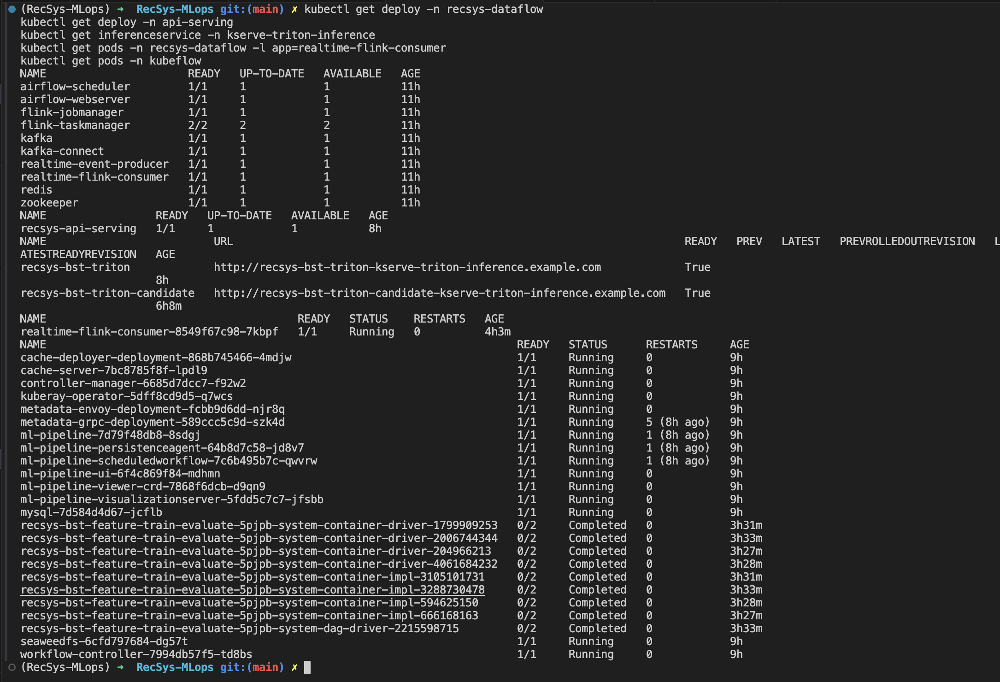

# CI/CD

CI/CD in this project means: run tests, build/version artifacts, and auto-deploy the changed component. Secrets are not stored in source code. Jenkins receives registry and Kubernetes access through credentials such as `REGISTRY_CREDENTIALS_ID` and `KUBECONFIG_CREDENTIALS_ID`.

Common Jenkins flow:

1. `Detect Changed Components`: maps changed files to CI/CD components.
2. `Component CI`: runs unit/contract tests and coverage checks.
3. `Build And Publish`: builds component images, pushes them to the configured registry, or records that the component consumes promoted model artifacts.
4. `Deploy Or Update`: updates Helm releases, KFP packages, KServe services, or Flink jobs.

Common code reference:

- [Jenkinsfile line 3](../../../Jenkinsfile#L3): declares all CI/CD components.
- [Jenkinsfile line 53](../../../Jenkinsfile#L53): defines build/deploy parameters and Jenkins credential IDs.
- [Jenkinsfile line 102](../../../Jenkinsfile#L102): runs `Component CI`.
- [Jenkinsfile line 127](../../../Jenkinsfile#L127): runs `Build And Publish`.
- [Jenkinsfile line 140](../../../Jenkinsfile#L140): runs `Deploy Or Update`.
- [jenkins/scripts/detect_changed_components.py line 244](../../../jenkins/scripts/detect_changed_components.py#L244): writes the selected component flags for Jenkins.
- [jenkins/README.md line 46](../../../jenkins/README.md#L46): documents that secrets are provided through Jenkins credentials.
- [infra/helm/recsys-ci/templates/jenkins.yaml line 137](../../../infra/helm/recsys-ci/templates/jenkins.yaml#L137): exposes the Jenkins service.
- [infra/helm/recsys-ci/templates/jenkins-secret.yaml line 10](../../../infra/helm/recsys-ci/templates/jenkins-secret.yaml#L10): stores Jenkins admin credentials in a Kubernetes Secret, not in source code.

## Jenkins UI Proof Capture

Use Jenkins UI as the primary CI/CD proof. A complete proof for each rubric row should show the same component passing these three stages:

1. `Component CI`: runs tests and coverage gates through `jenkins/scripts/component_ci.sh`.
2. `Component Build And Publish`: builds or versions the component artifact through `jenkins/scripts/component_build_publish.sh`.
3. `Component Deploy Or Update`: auto-deploys the component through `jenkins/scripts/component_deploy.sh`.

Open the Jenkins build page, then capture:

- Pipeline stage view with `Component CI`, `Component Build And Publish`, and `Component Deploy Or Update` green.
- Console log inside the relevant parallel branch, for example `FastAPI Web API`, `Training Pipeline`, `DP1 Raw To Bronze`, or `Stream Features To Online Store`.
- The last lines of the deploy stage showing `helm upgrade`, `kubectl rollout status`, `InferenceService` readiness, or the updated Flink/Airflow runtime.

Trigger model:

| Trigger source | What it proves | Notes |
|---|---|---|
| GitHub push or PR webhook into Jenkins | Automated CI/CD trigger | Jenkins runs `Detect Changed Components` and selects component flags from changed paths. |
| Manual Jenkins `Build Now` | Same pipeline proof when webhook is unavailable | Use this for screenshots if the reviewer needs logs for each component. |
| `FORCE_DEPLOY=true` | Deploy proof from a non-main branch | Normal auto-deploy is guarded to `main`; force deploy is only for proof runs. |

Path-based component selection:

| Changed path | CI/CD component triggered |
|---|---|
| `apps/api-serving/**` | `api` |
| `apps/ml-system/**` | `training`; `model_promotion.py` also triggers `kserve` |
| `apps/data-platform/src/features/spark/**` | `spark_batch`, `dp2`, `dp3` |
| `apps/data-platform/src/features/flink/**` | `stream_offline`, `stream_online` |
| `apps/data-platform/src/orchestration/airflow/dags/**` | data platform pipelines based on DAG name |
| `infra/helm/recsys-serving/**` | `api`, `kserve` |
| `infra/helm/recsys-data-platform/**` | materialize, DP1, DP2, DP3, stream jobs, drift |
| `infra/helm/recsys-observability/**` | `api`, `kserve`, `drift` |

## Rubric Log Checklist

Use this table while opening Jenkins logs. Each row corresponds to one rubric line in the screenshot.

| Rubric row | Component | Jenkins `Component CI` log | Jenkins `Component Build And Publish` log | Jenkins `Component Deploy Or Update` log |
|---|---|---|---|---|
| Materialize Pipeline | `materialize` | pytest and coverage for feature-store materialization | `recsys-dataflow-cli:<commit>` image manifest/push | Helm upgrade updates `images.dataflowCli` |
| Training Pipeline | `training` | ML-system tests and KFP compile | `recsys-mlops-training:<commit>` and Spark image manifest/push | KFP package/Ray runtime image refs updated |
| DP1 | `dp1` | data-generator, CDC, and ingestion tests | generator, dataflow CLI, Airflow, Kafka Connect image manifests/pushes | Helm upgrade updates DP1 runtime images |
| DP2 | `dp2` | Spark batch feature tests | Spark and Airflow image manifests/pushes | Helm upgrade updates Spark batch/Airflow images |
| DP3 | `dp3` | offline feature to training-table tests | Spark, dataflow CLI, and Airflow image manifests/pushes | Helm upgrade updates DP3 runtime images |
| Web API with FastAPI | `api` | FastAPI unit and contract tests | `recsys-api-serving:<commit>` image manifest/push | Helm upgrade plus `kubectl rollout status` for API |
| Inference Engine / KServe | `kserve` | KServe/model promotion tests | log says KServe consumes promoted Triton artifact | `model_cd.py` verifies manifest, applies serving values, waits for `InferenceService` |
| Real-time Drift Detection Web API | `drift` | drift metric and retrain-trigger tests | dataflow CLI image manifest/push | Helm upgrade updates drift runtime; Knative manifests applied when present |
| Job 1: Push stream feature to OFFLINE store | `stream_offline` | Flink offline sink tests | `recsys-flink:<commit>` image manifest/push | Helm upgrade updates realtime Flink consumer |
| Job 2: Push stream feature to ONLINE store | `stream_online` | Flink online sink and Redis writer tests | Flink and dataflow CLI image manifests/pushes | Helm upgrade updates realtime Flink consumer and online writer runtime |

Cluster verification after deploy:

```bash
kubectl get deploy -n recsys-dataflow
kubectl get deploy -n api-serving
kubectl get inferenceservice -n kserve-triton-inference
kubectl get pods -n recsys-dataflow -l app=realtime-flink-consumer
kubectl get pods -n kubeflow
```

Observed GKE runtime result:

```text
recsys-dataflow deployments:
airflow-scheduler, airflow-webserver, flink-jobmanager, flink-taskmanager,
kafka, kafka-connect, realtime-event-producer, realtime-flink-consumer,
redis, and zookeeper are READY 1/1.

api-serving deployments:
recsys-api-serving is READY 1/1.

kserve-triton-inference InferenceServices:
recsys-bst-triton is READY True.
recsys-bst-triton-candidate is READY True.

stream jobs:
realtime-flink-consumer is 1/1 Running.

kubeflow:
ml-pipeline, ml-pipeline-ui, workflow-controller, and kuberay-operator are Running.
```

Runtime image proof to capture:

```text
docs/pngs/cicd_gke_runtime_dataflow.png
docs/pngs/cicd_gke_runtime_api_kserve.png
docs/pngs/cicd_gke_runtime_kubeflow_stream.png
```

### Image proof



## CI/CD For Pipelines

### Materialize Pipeline

Code reference:

- [Jenkinsfile line 3](../../../Jenkinsfile#L3): defines the `materialize` CI/CD component.
- [jenkins/scripts/component_ci.sh line 94](../../../jenkins/scripts/component_ci.sh#L94): runs tests for feature-store materialization.
- [jenkins/scripts/component_build_publish.sh line 99](../../../jenkins/scripts/component_build_publish.sh#L99): builds the dataflow CLI image used by materialization.
- [jenkins/scripts/component_deploy.sh line 92](../../../jenkins/scripts/component_deploy.sh#L92): deploys the materialization runtime image to the data platform chart.
- [apps/data-platform/src/orchestration/airflow/dags/k8s_data_platform_dag.py line 205](../../../apps/data-platform/src/orchestration/airflow/dags/k8s_data_platform_dag.py#L205): Airflow task runs Feast `materialize-incremental`.

Jenkins staged proof:

**Test Stage - `Component CI / Materialize Pipeline`**

```bash
cd /Users/KHOAI/anhkhoa/RecSys-MLops

COVERAGE_MIN=90 bash jenkins/scripts/component_ci.sh materialize
```

Expected proof: feature-store materialization tests pass and coverage is above the configured threshold.

```text
Paste Jenkins test log excerpt here:
```

**Build Stage - `Component Build And Publish / Materialize Pipeline`**

```bash
IMAGE_TAG="$(git rev-parse --short=12 HEAD)" PUBLISH_IMAGES=1 bash jenkins/scripts/component_build_publish.sh materialize
```

Expected proof: `recsys-dataflow-cli:<commit>` is built, tagged, pushed, and recorded in `.ci-image-manifest/materialize.env`.

```text
Paste Jenkins build log excerpt here:
```

**Auto-Deploy Stage - `Component Deploy Or Update / Materialize Pipeline`**

```bash
IMAGE_TAG="$(git rev-parse --short=12 HEAD)" bash jenkins/scripts/component_deploy.sh materialize
```

Expected proof: Helm upgrade updates the data platform runtime image used by the materialization task.

```text
Paste Jenkins deploy log excerpt here:
```

Description of output when running command:

- The CI step should show feature-store tests passing.
- The build step should produce a commit-tagged dataflow CLI image.
- The deploy step should update the data platform chart so Airflow uses the image that contains the Feast incremental materialization code.

Image proof:


### Training Pipeline

Code reference:

- [Jenkinsfile line 4](../../../Jenkinsfile#L4): defines the `training` CI/CD component.
- [jenkins/scripts/component_ci.sh line 101](../../../jenkins/scripts/component_ci.sh#L101): runs ML-system tests and compiles KFP.
- [jenkins/scripts/component_build_publish.sh line 103](../../../jenkins/scripts/component_build_publish.sh#L103): builds the training and Spark images.
- [jenkins/scripts/component_deploy.sh line 55](../../../jenkins/scripts/component_deploy.sh#L55): compiles/deploys training references and Ray runtime.
- [apps/ml-system/src/kubeflow/pipelines/bst_training_pipeline.py line 213](../../../apps/ml-system/src/kubeflow/pipelines/bst_training_pipeline.py#L213): defines the KFP training pipeline.

Jenkins staged proof:

**Test Stage - `Component CI / Training Pipeline`**

```bash
cd /Users/KHOAI/anhkhoa/RecSys-MLops

COVERAGE_MIN=90 bash jenkins/scripts/component_ci.sh training
```

Expected proof: ML-system tests pass and the Kubeflow training pipeline compiles.

```text
Paste Jenkins test log excerpt here:
```

**Build Stage - `Component Build And Publish / Training Pipeline`**

```bash
IMAGE_TAG="$(git rev-parse --short=12 HEAD)" PUBLISH_IMAGES=1 bash jenkins/scripts/component_build_publish.sh training
```

Expected proof: `recsys-mlops-training:<commit>` and Spark runtime images are built, tagged, pushed, and recorded in `.ci-image-manifest/training.env`.

```text
Paste Jenkins build log excerpt here:
```

**Auto-Deploy Stage - `Component Deploy Or Update / Training Pipeline`**

```bash
IMAGE_TAG="$(git rev-parse --short=12 HEAD)" bash jenkins/scripts/component_deploy.sh training
```

Expected proof: KFP package and Ray/Kubeflow runtime references are updated to the built training image.

```text
Paste Jenkins deploy log excerpt here:
```

Description of output when running command:

- The CI step validates ML code and compiles `infra/kubeflow/compiled/bst_training_pipeline.yaml`.
- The build step creates commit-tagged training images.
- The deploy step updates Ray/KFP runtime references so the Kubeflow training pipeline uses the new image version.

Image proof:


### DP1 - Raw Data Generator, CDC, And Historical Ingest

Code reference:

- [Jenkinsfile line 6](../../../Jenkinsfile#L6): defines the `dp1` CI/CD component.
- [jenkins/scripts/component_ci.sh line 114](../../../jenkins/scripts/component_ci.sh#L114): runs data-generator and ingestion tests.
- [jenkins/scripts/component_build_publish.sh line 111](../../../jenkins/scripts/component_build_publish.sh#L111): builds generator, dataflow CLI, Airflow, and Kafka Connect images.
- [jenkins/scripts/component_deploy.sh line 98](../../../jenkins/scripts/component_deploy.sh#L98): deploys data platform images needed by DP1.

Jenkins staged proof:

**Test Stage - `Component CI / DP1 Raw To Bronze`**

```bash
cd /Users/KHOAI/anhkhoa/RecSys-MLops

COVERAGE_MIN=90 bash jenkins/scripts/component_ci.sh dp1
```

Expected proof: data-generator, source schema, CDC connector, and ingestion tests pass.

```text
Paste Jenkins test log excerpt here:
```

**Build Stage - `Component Build And Publish / DP1 Raw To Bronze`**

```bash
IMAGE_TAG="$(git rev-parse --short=12 HEAD)" PUBLISH_IMAGES=1 bash jenkins/scripts/component_build_publish.sh dp1
```

Expected proof: generator, dataflow CLI, Airflow, and Kafka Connect images are built/pushed and recorded in `.ci-image-manifest/dp1.env`.

```text
Paste Jenkins build log excerpt here:
```

**Auto-Deploy Stage - `Component Deploy Or Update / DP1 Raw To Bronze`**

```bash
IMAGE_TAG="$(git rev-parse --short=12 HEAD)" bash jenkins/scripts/component_deploy.sh dp1
```

Expected proof: Helm upgrade updates the DP1 runtime images in the data platform release.

```text
Paste Jenkins deploy log excerpt here:
```

Description of output when running command:

- The CI step validates raw data generation, source schema, CDC connector, and ingestion logic.
- The build step publishes the images used by generator, Airflow orchestration, Kafka Connect, and dataflow CLI.
- The deploy step updates the data platform release so DP1 can run from Jenkins/Airflow with the latest code.

Image proof:


### DP2 - Spark Batch Feature Materialization

Code reference:

- [Jenkinsfile line 7](../../../Jenkinsfile#L7): defines the `dp2` CI/CD component.
- [jenkins/scripts/component_ci.sh line 121](../../../jenkins/scripts/component_ci.sh#L121): runs Spark batch feature tests.
- [jenkins/scripts/component_build_publish.sh line 117](../../../jenkins/scripts/component_build_publish.sh#L117): builds Spark and Airflow images.
- [jenkins/scripts/component_deploy.sh line 95](../../../jenkins/scripts/component_deploy.sh#L95): deploys Spark batch and Airflow image updates.

Jenkins staged proof:

**Test Stage - `Component CI / DP2 Bronze To Silver Gold`**

```bash
cd /Users/KHOAI/anhkhoa/RecSys-MLops

COVERAGE_MIN=90 bash jenkins/scripts/component_ci.sh dp2
```

Expected proof: Spark batch feature tests pass.

```text
Paste Jenkins test log excerpt here:
```

**Build Stage - `Component Build And Publish / DP2 Bronze To Silver Gold`**

```bash
IMAGE_TAG="$(git rev-parse --short=12 HEAD)" PUBLISH_IMAGES=1 bash jenkins/scripts/component_build_publish.sh dp2
```

Expected proof: Spark and Airflow images are built/pushed and recorded in `.ci-image-manifest/dp2.env`.

```text
Paste Jenkins build log excerpt here:
```

**Auto-Deploy Stage - `Component Deploy Or Update / DP2 Bronze To Silver Gold`**

```bash
IMAGE_TAG="$(git rev-parse --short=12 HEAD)" bash jenkins/scripts/component_deploy.sh dp2
```

Expected proof: Helm upgrade updates Spark batch and Airflow runtime images.

```text
Paste Jenkins deploy log excerpt here:
```

Description of output when running command:

- The CI step checks Spark feature engineering logic.
- The build step publishes the Spark and Airflow images used by the batch feature pipeline.
- The deploy step updates the cluster so Airflow can launch the new Spark batch materialization code.

Image proof:


### DP3 - ML Training Dataset Preparation

Code reference:

- [Jenkinsfile line 8](../../../Jenkinsfile#L8): defines the `dp3` CI/CD component.
- [jenkins/scripts/component_ci.sh line 127](../../../jenkins/scripts/component_ci.sh#L127): runs training dataset preparation tests.
- [jenkins/scripts/component_build_publish.sh line 121](../../../jenkins/scripts/component_build_publish.sh#L121): builds Spark, dataflow CLI, and Airflow images.
- [jenkins/scripts/component_deploy.sh line 104](../../../jenkins/scripts/component_deploy.sh#L104): deploys images used by DP3.
- [apps/ml-system/src/cli/prepare_bst_training_data.py line 278](../../../apps/ml-system/src/cli/prepare_bst_training_data.py#L278): reads offline feature data for training preparation.

Jenkins staged proof:

**Test Stage - `Component CI / DP3 Offline Feature Table`**

```bash
cd /Users/KHOAI/anhkhoa/RecSys-MLops

COVERAGE_MIN=90 bash jenkins/scripts/component_ci.sh dp3
```

Expected proof: offline feature to training-table tests pass.

```text
Paste Jenkins test log excerpt here:
```

**Build Stage - `Component Build And Publish / DP3 Offline Feature Table`**

```bash
IMAGE_TAG="$(git rev-parse --short=12 HEAD)" PUBLISH_IMAGES=1 bash jenkins/scripts/component_build_publish.sh dp3
```

Expected proof: Spark, dataflow CLI, and Airflow images are built/pushed and recorded in `.ci-image-manifest/dp3.env`.

```text
Paste Jenkins build log excerpt here:
```

**Auto-Deploy Stage - `Component Deploy Or Update / DP3 Offline Feature Table`**

```bash
IMAGE_TAG="$(git rev-parse --short=12 HEAD)" bash jenkins/scripts/component_deploy.sh dp3
```

Expected proof: Helm upgrade updates DP3 preparation runtime images.

```text
Paste Jenkins deploy log excerpt here:
```

Description of output when running command:

- The CI step validates the code that converts offline feature tables into ML-ready training rows.
- The build step publishes the runtime images used by dataset preparation.
- The deploy step updates Airflow/Spark/dataflow runtimes so the training dataset pipeline uses the latest code.

Image proof:


## CI/CD For API

### Web API With FastAPI

Code reference:

- [Jenkinsfile line 9](../../../Jenkinsfile#L9): defines the `api` CI/CD component.
- [jenkins/scripts/component_ci.sh line 133](../../../jenkins/scripts/component_ci.sh#L133): runs FastAPI unit and contract tests.
- [jenkins/scripts/component_build_publish.sh line 126](../../../jenkins/scripts/component_build_publish.sh#L126): builds the FastAPI image.
- [jenkins/scripts/component_deploy.sh line 34](../../../jenkins/scripts/component_deploy.sh#L34): deploys the serving Helm chart.
- [infra/helm/recsys-serving/templates/api-deployment.yaml line 34](../../../infra/helm/recsys-serving/templates/api-deployment.yaml#L34): uses the deployed API image.
- [jenkins/post-deploy-e2e/Jenkinsfile line 16](../../../jenkins/post-deploy-e2e/Jenkinsfile#L16): runs post-deploy API verification.

Jenkins staged proof:

**Test Stage - `Component CI / FastAPI Web API`**

```bash
cd /Users/KHOAI/anhkhoa/RecSys-MLops

COVERAGE_MIN=90 bash jenkins/scripts/component_ci.sh api
```

Expected proof: FastAPI unit tests, serving contracts, and gateway contracts pass.

```text
Paste Jenkins test log excerpt here:
```

**Build Stage - `Component Build And Publish / FastAPI Web API`**

```bash
IMAGE_TAG="$(git rev-parse --short=12 HEAD)" PUBLISH_IMAGES=1 bash jenkins/scripts/component_build_publish.sh api
```

Expected proof: `recsys-api-serving:<commit>` image is built/pushed and recorded in `.ci-image-manifest/api.env`.

```text
Paste Jenkins build log excerpt here:
```

**Auto-Deploy Stage - `Component Deploy Or Update / FastAPI Web API`**

```bash
IMAGE_TAG="$(git rev-parse --short=12 HEAD)" bash jenkins/scripts/component_deploy.sh api
bash jenkins/scripts/post_deploy_e2e.sh
```

Expected proof: Helm upgrade finishes, `kubectl rollout status deployment/recsys-api-serving` succeeds, and post-deploy API checks pass.

```text
Paste Jenkins deploy log excerpt here:
```

Description of output when running command:

- The CI step should show FastAPI tests passing.
- The build step should create a commit-tagged API image.
- The deploy step should show Helm upgrade and `kubectl rollout status` for the API deployment.
- The post-deploy step should call `/health`, `/ready`, `/version`, `/recommendations`, and metrics endpoints.

Image proof:


### Inference Engine With KServe

Code reference:

- [Jenkinsfile line 10](../../../Jenkinsfile#L10): defines the `kserve` CI/CD component.
- [jenkins/scripts/component_ci.sh line 139](../../../jenkins/scripts/component_ci.sh#L139): runs inference/KServe tests.
- [jenkins/scripts/component_build_publish.sh line 129](../../../jenkins/scripts/component_build_publish.sh#L129): documents that KServe consumes promoted model artifacts instead of building an app image.
- [jenkins/scripts/component_deploy.sh line 72](../../../jenkins/scripts/component_deploy.sh#L72): deploys KServe through model CD.
- [jenkins/scripts/model_cd.py line 44](../../../jenkins/scripts/model_cd.py#L44): reads the model promotion manifest.
- [jenkins/scripts/model_cd.py line 52](../../../jenkins/scripts/model_cd.py#L52): verifies required Triton model repository files.
- [jenkins/scripts/model_cd.py line 148](../../../jenkins/scripts/model_cd.py#L148): writes Helm values for the promoted model.
- [jenkins/scripts/model_cd.py line 207](../../../jenkins/scripts/model_cd.py#L207): applies the KServe deployment and waits for readiness.
- [infra/helm/recsys-serving/templates/inferenceservice.yaml line 28](../../../infra/helm/recsys-serving/templates/inferenceservice.yaml#L28): deploys the Triton `InferenceService` from `storageUri`.

Jenkins staged proof:

**Test Stage - `Component CI / KServe Inference Engine`**

```bash
cd /Users/KHOAI/anhkhoa/RecSys-MLops

export PROMOTION_MANIFEST_URI="s3://recsys-model-store/promotions/bst/production.json"

COVERAGE_MIN=90 bash jenkins/scripts/component_ci.sh kserve
```

Expected proof: KServe/model promotion tests pass.

```text
Paste Jenkins test log excerpt here:
```

**Build Stage - `Component Build And Publish / KServe Inference Engine`**

```bash
IMAGE_TAG="$(git rev-parse --short=12 HEAD)" PUBLISH_IMAGES=1 bash jenkins/scripts/component_build_publish.sh kserve
```

Expected proof: build stage records that KServe consumes a promoted Triton model artifact instead of building a normal app image.

```text
Paste Jenkins build/artifact log excerpt here:
```

**Auto-Deploy Stage - `Component Deploy Or Update / KServe Inference Engine`**

```bash
IMAGE_TAG="$(git rev-parse --short=12 HEAD)" bash jenkins/scripts/component_deploy.sh kserve
```

Expected proof: `model_cd.py` reads the promotion manifest, verifies Triton repository files, applies serving values, and waits for `InferenceService` readiness.

```text
Paste Jenkins deploy log excerpt here:
```

Description of output when running command:

- The CI step validates KServe/inference integration.
- The build step records that KServe will consume a production model artifact instead of a normal application image.
- The deploy step reads the production promotion manifest, verifies the Triton model repository files, writes serving Helm values, upgrades KServe, and waits until the `InferenceService` is ready.

Image proof:


### Real-Time Drift Detection Web API

Code reference:

- [Jenkinsfile line 11](../../../Jenkinsfile#L11): defines the `drift` CI/CD component.
- [jenkins/scripts/component_ci.sh line 145](../../../jenkins/scripts/component_ci.sh#L145): runs drift detection tests.
- [jenkins/scripts/component_build_publish.sh line 132](../../../jenkins/scripts/component_build_publish.sh#L132): builds the dataflow CLI image used by drift detection.
- [jenkins/scripts/component_deploy.sh line 80](../../../jenkins/scripts/component_deploy.sh#L80): deploys drift runtime and applies Knative manifests when present.
- [apps/data-platform/src/validate/offline_feature_drift.py line 83](../../../apps/data-platform/src/validate/offline_feature_drift.py#L83): computes PSI drift metrics.
- [apps/data-platform/src/mlops/trigger_kubeflow_retrain.py line 95](../../../apps/data-platform/src/mlops/trigger_kubeflow_retrain.py#L95): triggers retraining when drift policy is breached.

Jenkins staged proof:

**Test Stage - `Component CI / Realtime Drift Detection`**

```bash
cd /Users/KHOAI/anhkhoa/RecSys-MLops

COVERAGE_MIN=90 bash jenkins/scripts/component_ci.sh drift
```

Expected proof: drift metric calculation and retrain-trigger tests pass.

```text
Paste Jenkins test log excerpt here:
```

**Build Stage - `Component Build And Publish / Realtime Drift Detection`**

```bash
IMAGE_TAG="$(git rev-parse --short=12 HEAD)" PUBLISH_IMAGES=1 bash jenkins/scripts/component_build_publish.sh drift
```

Expected proof: dataflow CLI image for drift runtime is built/pushed and recorded in `.ci-image-manifest/drift.env`.

```text
Paste Jenkins build log excerpt here:
```

**Auto-Deploy Stage - `Component Deploy Or Update / Realtime Drift Detection`**

```bash
IMAGE_TAG="$(git rev-parse --short=12 HEAD)" bash jenkins/scripts/component_deploy.sh drift
```

Expected proof: Helm upgrade updates drift-capable dataflow runtime and applies drift service manifests when present.

```text
Paste Jenkins deploy log excerpt here:
```

Description of output when running command:

- The CI step verifies drift metric calculation and retrain trigger logic.
- The build step publishes the dataflow runtime image used by the drift detection service/job.
- The deploy step updates the data platform drift runtime and applies the Knative/KServe eventing manifests if the drift service manifests are available.

Image proof:


## CI/CD For Jobs

### Job 1 - Push Stream Feature To Offline Store

Code reference:

- [Jenkinsfile line 12](../../../Jenkinsfile#L12): defines the `stream_offline` CI/CD component.
- [jenkins/scripts/component_ci.sh line 152](../../../jenkins/scripts/component_ci.sh#L152): runs streaming offline sink tests.
- [jenkins/scripts/component_build_publish.sh line 135](../../../jenkins/scripts/component_build_publish.sh#L135): builds the Flink image.
- [jenkins/scripts/component_deploy.sh line 110](../../../jenkins/scripts/component_deploy.sh#L110): deploys the Flink stream job image.
- [infra/helm/recsys-data-platform/templates/realtime-flink-consumer.yaml line 39](../../../infra/helm/recsys-data-platform/templates/realtime-flink-consumer.yaml#L39): enables the offline-store sink.
- [apps/data-platform/src/features/flink/realtime_stream_job.py line 526](../../../apps/data-platform/src/features/flink/realtime_stream_job.py#L526): builds offline feature rows.

Jenkins staged proof:

**Test Stage - `Component CI / Stream Features To Offline Store`**

```bash
cd /Users/KHOAI/anhkhoa/RecSys-MLops

COVERAGE_MIN=90 bash jenkins/scripts/component_ci.sh stream_offline
```

Expected proof: Flink offline sink tests pass.

```text
Paste Jenkins test log excerpt here:
```

**Build Stage - `Component Build And Publish / Stream Features To Offline Store`**

```bash
IMAGE_TAG="$(git rev-parse --short=12 HEAD)" PUBLISH_IMAGES=1 bash jenkins/scripts/component_build_publish.sh stream_offline
```

Expected proof: `recsys-flink:<commit>` image is built/pushed and recorded in `.ci-image-manifest/stream_offline.env`.

```text
Paste Jenkins build log excerpt here:
```

**Auto-Deploy Stage - `Component Deploy Or Update / Stream Features To Offline Store`**

```bash
IMAGE_TAG="$(git rev-parse --short=12 HEAD)" bash jenkins/scripts/component_deploy.sh stream_offline
```

Expected proof: Helm upgrade updates realtime Flink consumer image for the offline feature-store sink.

```text
Paste Jenkins deploy log excerpt here:
```

Description of output when running command:

- The CI step validates the streaming offline feature sink.
- The build step publishes the Flink image.
- The deploy step updates the realtime Flink consumer so streaming features are pushed into the Iceberg offline feature store.

Image proof:


### Job 2 - Push Stream Feature To Online Store

Code reference:

- [Jenkinsfile line 13](../../../Jenkinsfile#L13): defines the `stream_online` CI/CD component.
- [jenkins/scripts/component_ci.sh line 158](../../../jenkins/scripts/component_ci.sh#L158): runs streaming online sink tests.
- [jenkins/scripts/component_build_publish.sh line 138](../../../jenkins/scripts/component_build_publish.sh#L138): builds Flink and dataflow CLI images.
- [jenkins/scripts/component_deploy.sh line 113](../../../jenkins/scripts/component_deploy.sh#L113): deploys the Flink stream job and online writer runtime.
- [apps/data-platform/src/features/flink/realtime_stream_job.py line 483](../../../apps/data-platform/src/features/flink/realtime_stream_job.py#L483): writes online features to Redis.
- [apps/data-platform/src/features/flink/realtime_stream_job.py line 735](../../../apps/data-platform/src/features/flink/realtime_stream_job.py#L735): names the online sink `redis-online-feature-writer`.

Jenkins staged proof:

**Test Stage - `Component CI / Stream Features To Online Store`**

```bash
cd /Users/KHOAI/anhkhoa/RecSys-MLops

COVERAGE_MIN=90 bash jenkins/scripts/component_ci.sh stream_online
```

Expected proof: Flink online sink and Redis online writer tests pass.

```text
Paste Jenkins test log excerpt here:
```

**Build Stage - `Component Build And Publish / Stream Features To Online Store`**

```bash
IMAGE_TAG="$(git rev-parse --short=12 HEAD)" PUBLISH_IMAGES=1 bash jenkins/scripts/component_build_publish.sh stream_online
```

Expected proof: Flink and dataflow CLI images are built/pushed and recorded in `.ci-image-manifest/stream_online.env`.

```text
Paste Jenkins build log excerpt here:
```

**Auto-Deploy Stage - `Component Deploy Or Update / Stream Features To Online Store`**

```bash
IMAGE_TAG="$(git rev-parse --short=12 HEAD)" bash jenkins/scripts/component_deploy.sh stream_online
```

Expected proof: Helm upgrade updates realtime Flink consumer and online writer runtime for Redis feature serving.

```text
Paste Jenkins deploy log excerpt here:
```

Description of output when running command:

- The CI step validates the Redis online feature writer.
- The build step publishes Flink and dataflow runtime images.
- The deploy step updates the realtime Flink consumer so streaming features are pushed into the Redis online feature store.

Image proof:


## Proof Capture Checklist

- Jenkins pipeline screenshot: capture the build page with `Component CI`, `Build And Publish`, and `Deploy Or Update` green for each selected component.
- Jenkins console screenshot: capture test success, image tag, Helm upgrade, rollout status, or KServe readiness logs.
- Kubernetes verification screenshot when useful:

```bash
kubectl get pods -n ci
kubectl get deploy -n recsys-dataflow
kubectl get deploy -n api-serving
kubectl get inferenceservice -n kserve-triton-inference
kubectl get deploy realtime-flink-consumer -n recsys-dataflow
```
