# CI/CD

## CI/CD Strategy

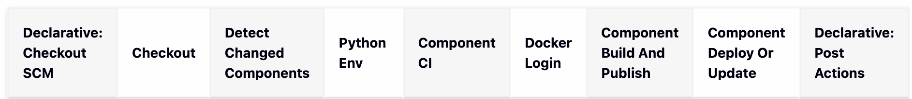

The project uses a **monorepo, path-based CI/CD strategy**. One shared
Jenkinsfile owns the CI/CD flow for the whole repository, but it does not rebuild
or redeploy every subsystem on every change. The `Detect Changed Components`
stage compares the current commit with the base ref, maps changed files to
component flags, and only enables the affected CI/CD branches. Manual proof jobs
use the same Jenkinsfile with `FORCE_COMPONENTS=<component>` so each pipeline can
be captured cleanly in Jenkins UI.

**Common Jenkins columns:** the proof view is organized around the same stages
for all component pipelines:

- `Checkout`: Jenkins checks out the monorepo and fetches remote refs so path
  detection can compare against `HEAD~1` or the PR target branch.
- `Detect Changed Components`: runs
  `jenkins/scripts/detect_changed_components.py`, writes `.ci-components.env`,
  sets `RUN_<COMPONENT>` flags, and prints `CHANGED_COMPONENTS`.
- `Python Env`: only runs when Python-backed components are enabled; it creates
  an isolated `uv` environment for tests and pipeline compilation.
- `Component CI`: runs the relevant unit, contract, and optional integration
  tests for each changed component.
- `Docker Login`: authenticates to GCP Artifact Registry with Jenkins
  credentials or the GKE node metadata token.
- `Component Build And Publish`: builds component images, tags them with the Git
  commit, pushes them to `asia-southeast1-docker.pkg.dev/fsds-coursework/recsys`,
  and writes `.ci-image-manifest/<component>.env`.
- `Component Deploy Or Update`: runs only for `main` or manual proof jobs with
  `FORCE_DEPLOY=true`; it applies Helm/Kubeflow/KServe updates, updates image
  references, waits for Kubernetes rollout/readiness, and verifies the running
  workload image.
- `Declarative: Post Actions`: archives reports and manifests such as JUnit
  XML, coverage output, `.ci-image-manifest`, and deployment artifacts.

**Path-based triggers:**

| Component | Triggered by changed paths |
| --- | --- |
| `materialize` | `apps/data-platform/src/feature_store/`, `apps/data-platform/src/local/`, data-platform metadata/config paths, `Dockerfile.dataflow-cli` |
| `training` | `apps/ml-system/`, `infra/kubeflow/`, `infra/helm/ray-cluster/`, `infra/helm/recsys-runtime/`, `infra/helm/mlflow-stack/`, `configs/local/bst*.yaml` |
| `dp1` | `apps/data-platform/data-generator/`, `apps/data-platform/src/ingest/`, `rubric_data_pipeline_dags.py`, `postgres_source.yaml`, `kafka_topics.yaml`, Kafka Connect/Debezium Docker paths |
| `dp2` | Spark feature code, lakehouse paths, `rubric_data_pipeline_dags.py`, `apps/data-platform/Dockerfile.spark`, `configs/local/spark_batch*.yaml` |
| `dp3` | Offline feature table and BST prep paths, `rubric_data_pipeline_dags.py`, Spark/dataflow runtime paths |
| `api` | `apps/api-serving/`, serving chart paths, API unit tests, gateway/serving contract tests |
| `kserve` | `infra/helm/recsys-serving/`, `jenkins/scripts/model_cd.py`, model promotion code/tests, serving contract tests |
| `stream_offline` | Flink feature code, lakehouse/offline sink paths, `apps/data-platform/Dockerfile.flink`, `flink_streaming.yaml` |
| `stream_online` | Flink feature code, online feature store paths, Redis online-store config, `apps/data-platform/Dockerfile.flink` |

**Image and deploy policy:** every component build proof is required to publish
to GCP Artifact Registry when `REQUIRE_GCP_ARTIFACT_REGISTRY=true`. Deploy steps
then pull those commit-tagged images from Artifact Registry, update the matching
Helm values or compiled pipeline templates, apply them to the GCP cluster, and
wait for rollout success. API and KServe components verify live Kubernetes
readiness; data-platform components update Airflow/Flink/Spark/dataflow image
references; training updates the training image/config/pipeline templates
without automatically starting Ray Tune or distributed training.

**Proof capture contract:** for each component pipeline, capture the Jenkins UI
stage, the image build/push evidence, the GCP Artifact Registry image tag, the
updated image/config reference, and the rollout/readiness success. The KServe
model-CD proof is the exception: it deploys the promoted Triton model repository
from the promotion manifest instead of building a new serving image.

## Code Reference

| Responsibility | Code reference |
| --- | --- |
| Pipeline stages, parallel branches, and deploy gate | [Jenkinsfile (line 1)](../../../Jenkinsfile#L1), [Jenkinsfile (line 336)](../../../Jenkinsfile#L336) |
| Path-to-component mapping | [detect_changed_components.py (line 86)](../../../jenkins/scripts/detect_changed_components.py#L86), [detect_changed_components.py (line 520)](../../../jenkins/scripts/detect_changed_components.py#L520) |
| Component tests and coverage | [component_ci.sh (line 1)](../../../jenkins/scripts/component_ci.sh#L1), [component_ci.sh (line 281)](../../../jenkins/scripts/component_ci.sh#L281) |
| Image build, tag, push, and manifest | [component_build_publish.sh (line 1)](../../../jenkins/scripts/component_build_publish.sh#L1), [component_build_publish.sh (line 292)](../../../jenkins/scripts/component_build_publish.sh#L292) |
| Helm/Kubernetes/Kubeflow deployment and readiness | [component_deploy.sh (line 1)](../../../jenkins/scripts/component_deploy.sh#L1), [component_deploy.sh (line 832)](../../../jenkins/scripts/component_deploy.sh#L832) |
| Promoted Triton model CD | [model_cd.py (line 129)](../../../jenkins/scripts/model_cd.py#L129), [model_cd.py (line 559)](../../../jenkins/scripts/model_cd.py#L559) |
| Jenkins jobs, webhook, and views | [jenkins-init-configmap.yaml (line 330)](../../../infra/helm/recsys-ci/templates/jenkins-init-configmap.yaml#L330), [jenkins-init-configmap.yaml (line 495)](../../../infra/helm/recsys-ci/templates/jenkins-init-configmap.yaml#L495) |


## CI/CD For Pipelines

### Main CI/CD Pipelines

**Jenkins job:** `RecSys-GitHub-CICD`

**Jenkins view:** `00 Main Auto Deploy`

**Strategy:** this is the main monorepo CI/CD entrypoint. GitHub push or merge
events trigger the Jenkins job through `/github-webhook/`. Jenkins checks out
the repository, detects changed paths, enables only affected component branches,
then runs CI, image build/push, and deploy/update for changed components on
`main`.

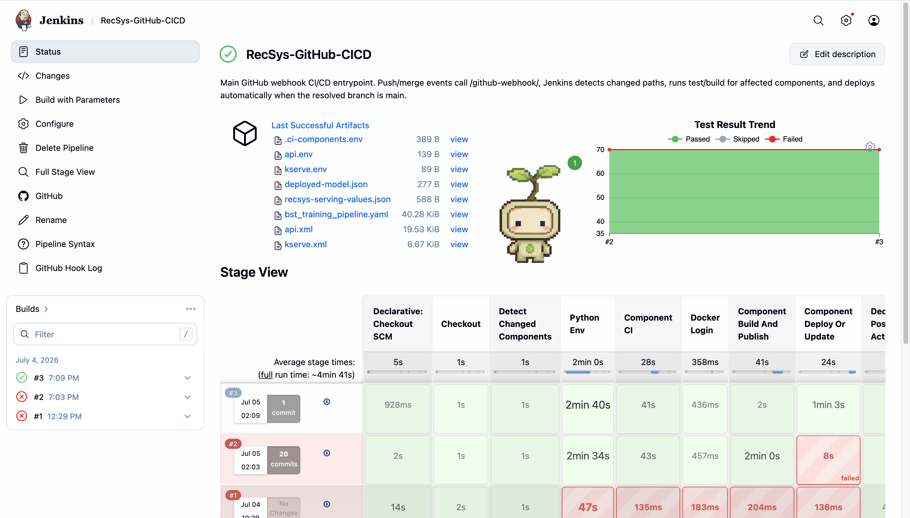

**Figure: Main CI/CD pipeline proof.** Capture the `00 Main Auto Deploy` view
showing the full shared stage layout for the monorepo pipeline.

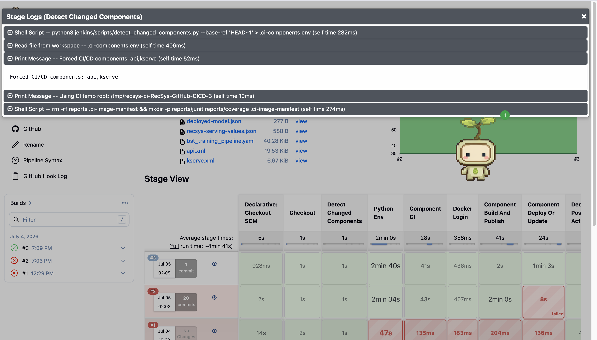

**Figure: Main CI/CD Detect Changed Components proof.** Capture the Jenkins
`Detect Changed Components` stage log showing `.ci-components.env`,
`CHANGED_COMPONENTS=<component list>`, and the generated `RUN_<COMPONENT>` flags.
This proves the main pipeline is path-based and does not deploy unrelated
components.

**Test/build/deploy flow:** the main job uses the same. component branches as the
manual proof jobs below. The difference is the trigger: manual component jobs set
`FORCE_COMPONENTS`, while the main job derives the enabled components from the
changed paths in Git.

**Test:** `Component CI` runs only the test branches enabled by
`CHANGED_COMPONENTS`.

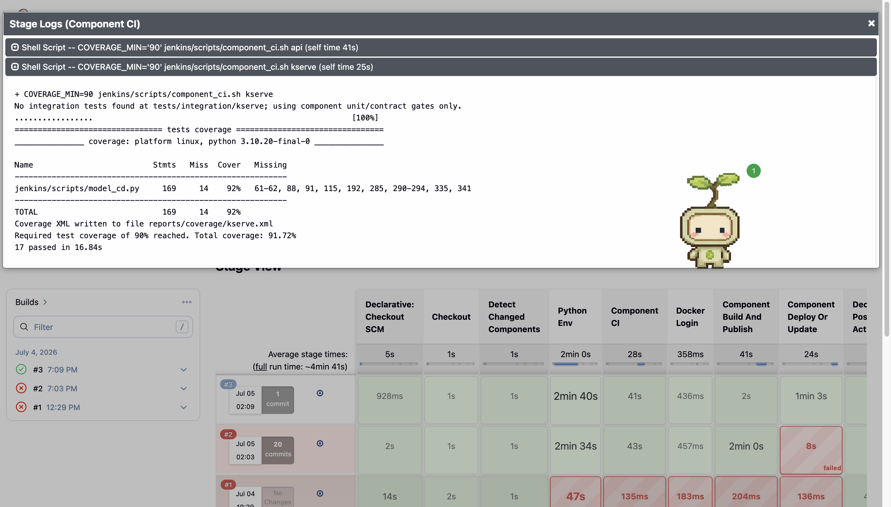

**Figure: Main CI/CD Test proof.** Capture Jenkins `Component CI` showing the
path-detected component test branches passing.

**Build:** `Component Build And Publish` builds the changed component images,
tags them with the Git commit, pushes them to GCP Artifact Registry, and writes
`.ci-image-manifest`.

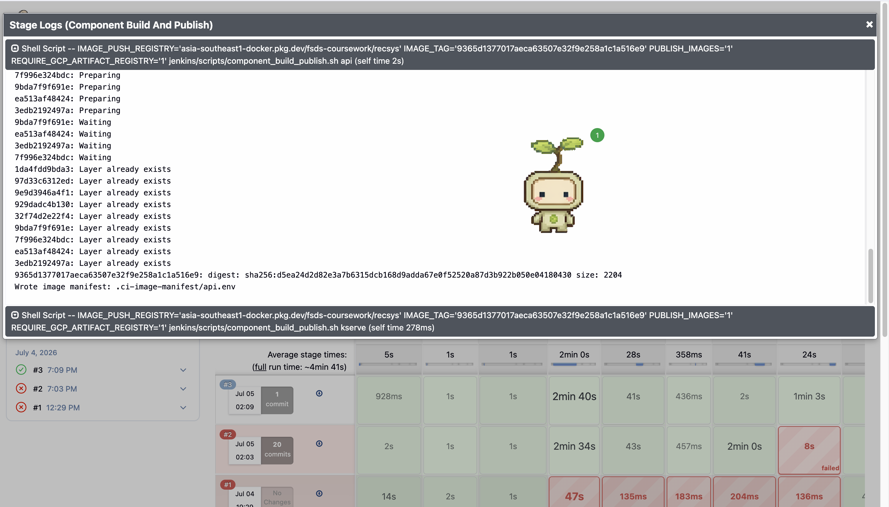

**Figure: Main CI/CD Build proof.** Capture Jenkins
`Component Build And Publish` showing Docker build/push output and the
commit-tagged image URI.

**Deploy:** `Component Deploy Or Update` runs on `main`, updates Helm/Kubeflow
or KServe image/config references, and waits for rollout/readiness.

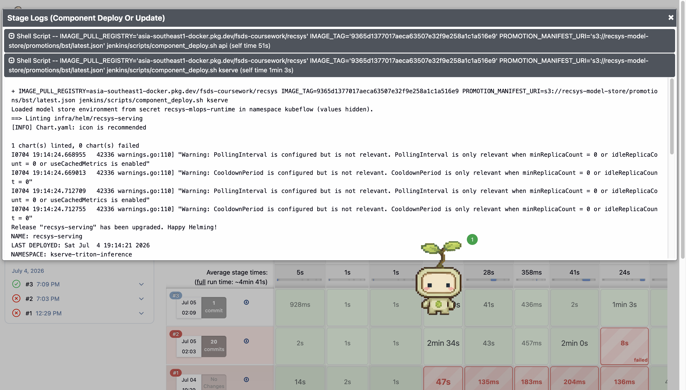

**Figure: Main CI/CD Deploy proof.** Capture Jenkins
`Component Deploy Or Update` showing the updated image/config reference and
successful rollout/readiness check.

### Materialize Pipeline

**Jenkins component:** `materialize`

**Jenkins UI label:** `Materialize Pipeline`

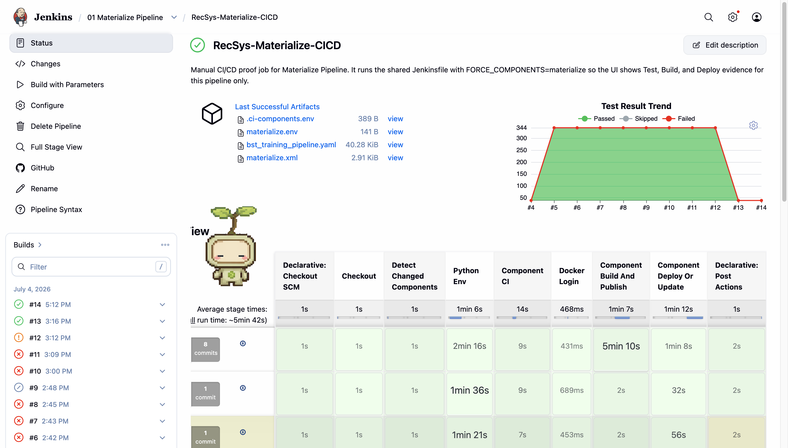

**Strategy:** run this CI/CD branch when materialization or Feast feature-store
paths change, especially `apps/data-platform/src/feature_store/`,
`apps/data-platform/src/local/`, feature-store repo/config files, data-platform
metadata code, or shared dataflow CLI Docker/runtime files.

**Test:** `component_ci.sh materialize` runs data-platform unit tests,
dataflow Docker contract tests, any matching integration suite that exists, and
coverage for `feature_store.online_writer` and `local.run_batch_features`.

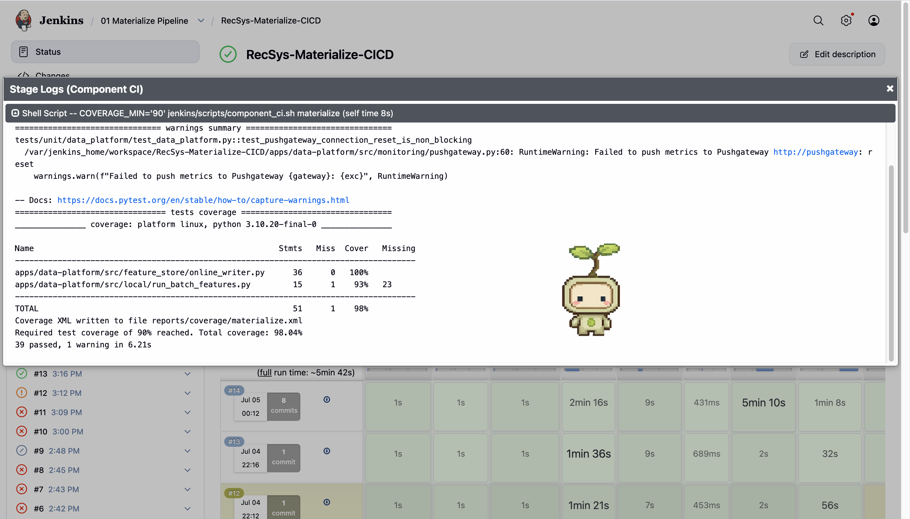

**Figure: Materialize Pipeline Test proof.** Capture Jenkins
`Component CI > Materialize Pipeline` with passing pytest and coverage output.

**Build:** `component_build_publish.sh materialize` builds and pushes
`recsys-dataflow-cli:<git_commit>`.

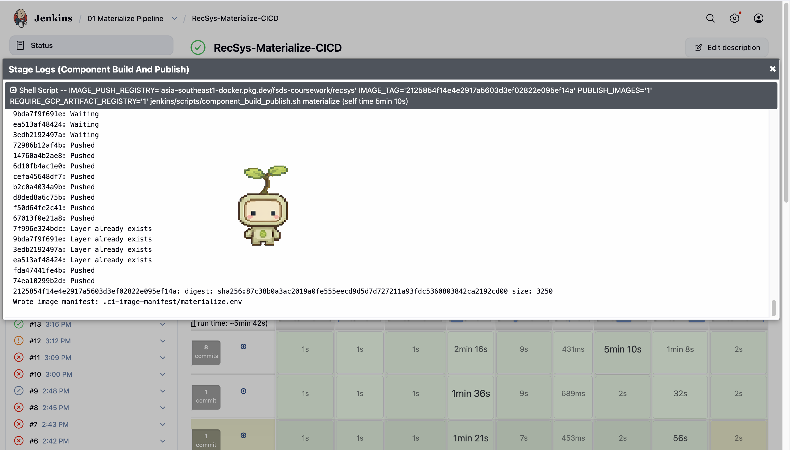

**Figure: Materialize Pipeline Build proof.** Capture Jenkins
`Component Build And Publish > Materialize Pipeline` with Docker build/push and
`.ci-image-manifest/materialize.env`.

**Deploy:** `component_deploy.sh materialize` runs Helm upgrade for
`recsys-data-platform` and updates `images.dataflowCli`.

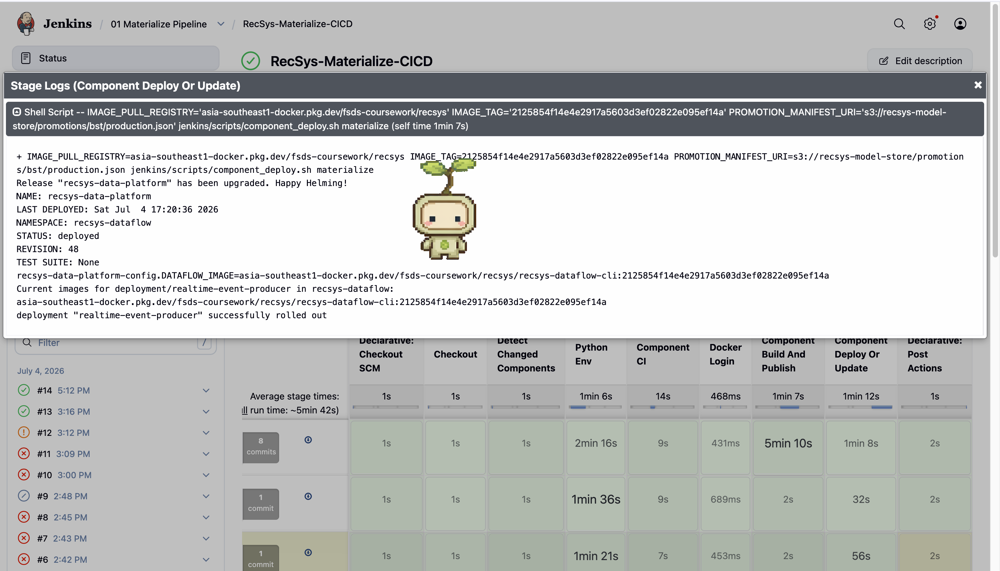

**Figure: Materialize Pipeline Deploy proof.** Capture Jenkins
`Component Deploy Or Update > Materialize Pipeline` with the Helm upgrade and
dataflow runtime image update.

### Training Pipeline

**Jenkins component:** `training`

**Jenkins UI label:** `Training Pipeline`

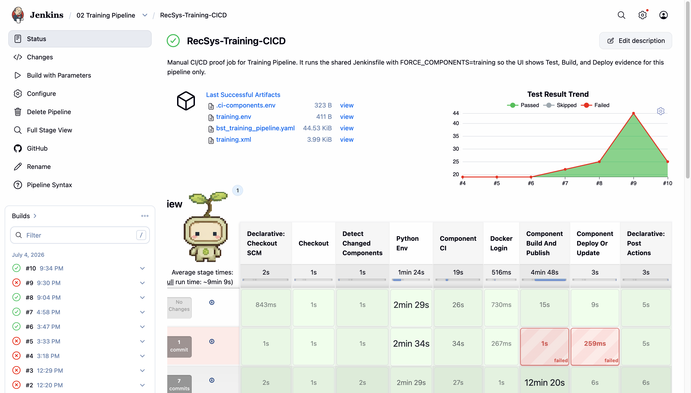

**Strategy:** run this CI/CD branch when ML training, Kubeflow pipeline, Ray
training, MLflow/runtime, BST config, or training image paths change, especially
`apps/ml-system/`, `infra/kubeflow/`, `infra/helm/ray-cluster/`,
`infra/helm/recsys-runtime/`, `infra/helm/mlflow-stack/`, and
`configs/local/bst.yaml`.

**Test:** `component_ci.sh training` runs ML-system tests, any matching
integration suite that exists, coverage for Kubeflow pipeline helpers, and
compiles the KFP package.

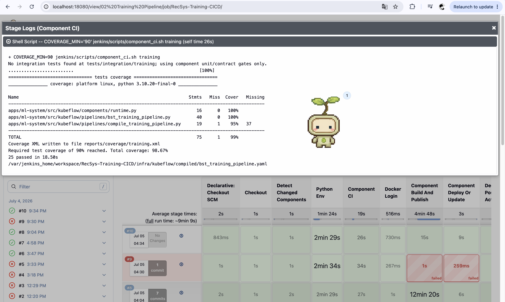

**Figure: Training Pipeline Test proof.** Capture Jenkins
`Component CI > Training Pipeline` showing `tests/unit/ml_system` and
`compile_training_pipeline.py` success.

**Build:** `component_build_publish.sh training` builds and pushes
`recsys-mlops-training:<git_commit>` and `recsys-mlops-spark:<git_commit>`.

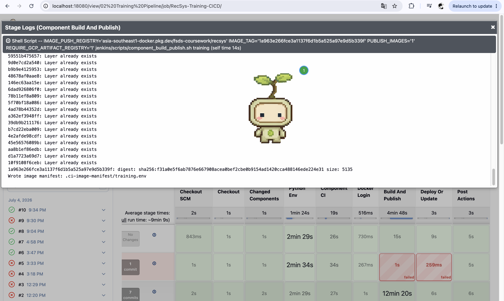

**Figure: Training Pipeline Build proof.** Capture Jenkins
`Component Build And Publish > Training Pipeline` with both training images
tagged by commit and pushed.

**Deploy:** `component_deploy.sh training` recompiles the KFP package with the
new image references and updates the Ray runtime chart `recsys-ray-cpu`.

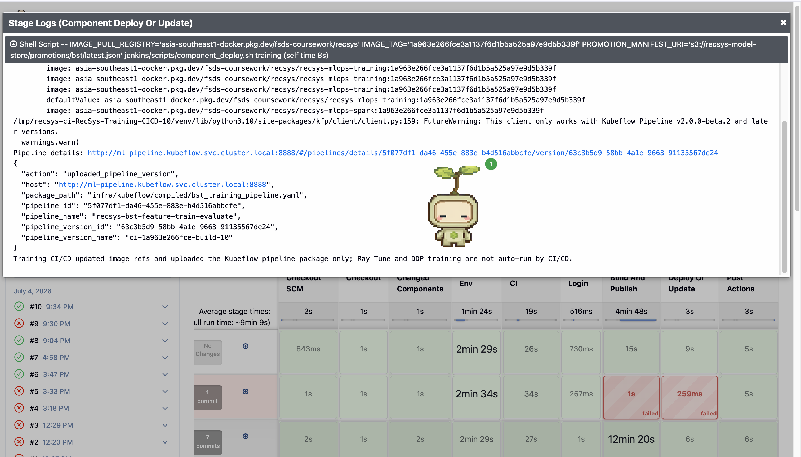

**Figure: Training Pipeline Deploy proof.** Capture Jenkins
`Component Deploy Or Update > Training Pipeline` showing updated
`RECSYS_PIPELINE_IMAGE`, `RECSYS_SPARK_IMAGE`, KFP compile, and Ray Helm update.

### Data Pipeline 1 - Source Data To Raw/Bronze

**Jenkins component:** `dp1`

**Jenkins UI label:** `DP1 Raw To Bronze`

**Strategy:** run this CI/CD branch when raw ingestion, synthetic data
generation, source Postgres/CDC, Kafka topic, Debezium, Kafka Connect, or raw
Airflow paths change, especially `apps/data-platform/data-generator/`,
`apps/data-platform/src/ingest/`, `rubric_data_pipeline_dags.py`,
`configs/local/data_generator*.yaml`, `configs/local/postgres_source.yaml`, and
`configs/local/kafka_topics.yaml`.

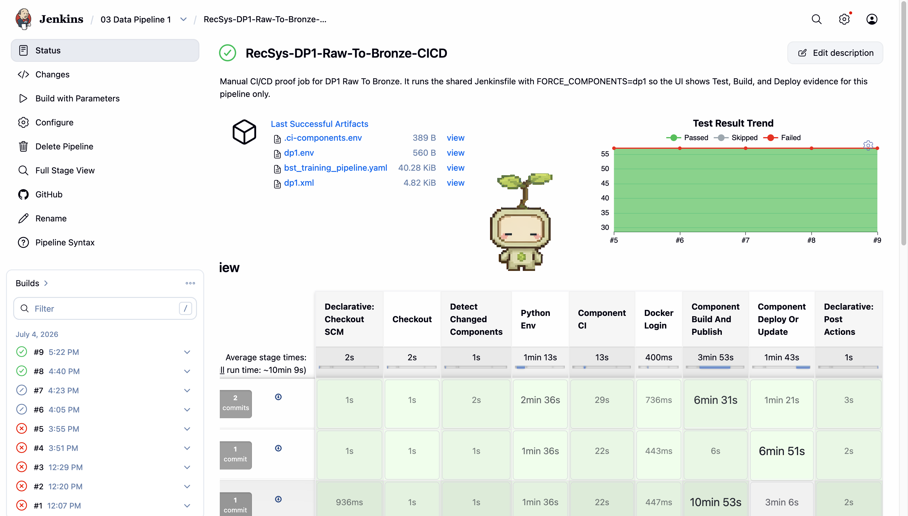

**Test:** `component_ci.sh dp1` runs data-generator unit tests, ingest tests,
data-platform tests, Docker/dataflow contract tests, any matching integration
suite that exists, and coverage for `ingest.debezium` and
`ingest.batch_lakehouse_ingestion`.

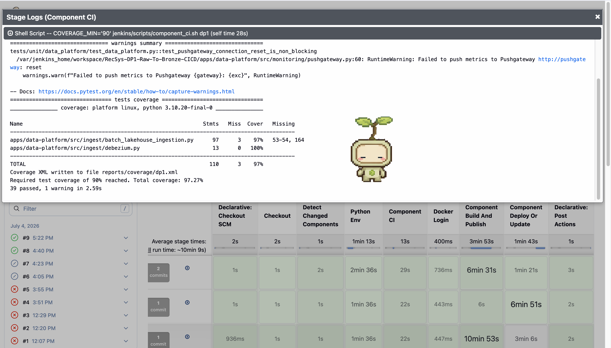

**Figure: DP1 Test proof.** Capture Jenkins `Component CI > DP1 Raw To Bronze`
showing generator/ingest tests and coverage.

**Build:** `component_build_publish.sh dp1` builds and pushes
`recsys-data-generator`, `recsys-dataflow-cli`, `recsys-airflow`, and
`recsys-kafka-connect`.

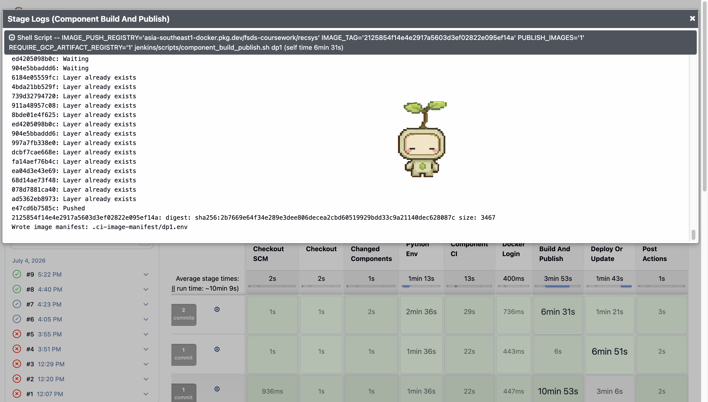

**Figure: DP1 Build proof.** Capture Jenkins
`Component Build And Publish > DP1 Raw To Bronze` with all DP1 images pushed.

**Deploy:** `component_deploy.sh dp1` upgrades `recsys-data-platform` and updates
the dataflow CLI, Airflow, and Kafka Connect images.

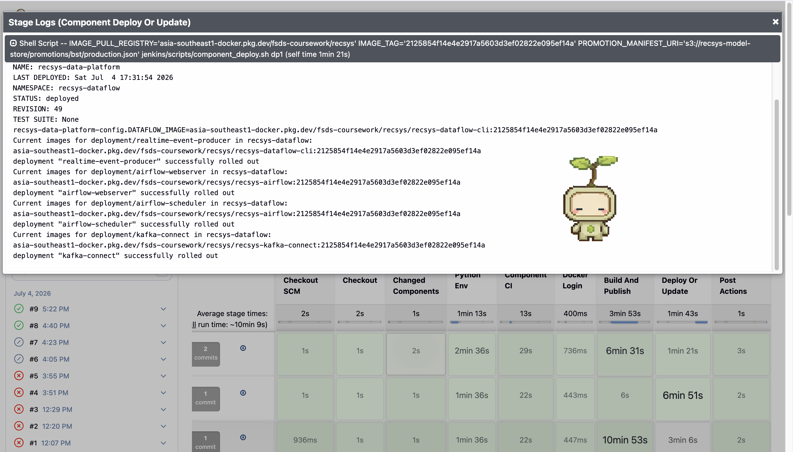

**Figure: DP1 Deploy proof.** Capture Jenkins
`Component Deploy Or Update > DP1 Raw To Bronze` showing the Helm upgrade for
source ingestion and CDC runtimes.

### Data Pipeline 2 - Bronze To Silver/Gold

**Jenkins component:** `dp2`

**Jenkins UI label:** `DP2 Bronze To Silver Gold`

**Strategy:** run this CI/CD branch when Spark silver/gold transforms, batch
feature DAGs, Spark batch config, lakehouse code, or Spark runtime image paths
change, especially `apps/data-platform/src/features/spark/`,
`rubric_data_pipeline_dags.py`, `apps/data-platform/src/lakehouse/`,
`apps/data-platform/Dockerfile.spark`, and `configs/local/spark_batch*.yaml`.

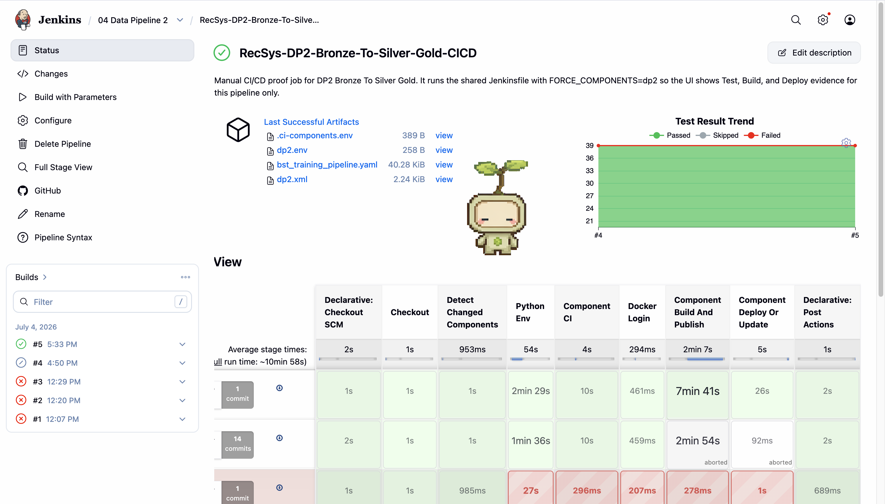

**Test:** `component_ci.sh dp2` runs data-platform tests, Docker/dataflow
contract tests, any matching integration suite that exists, and coverage for
`lakehouse.iceberg`.

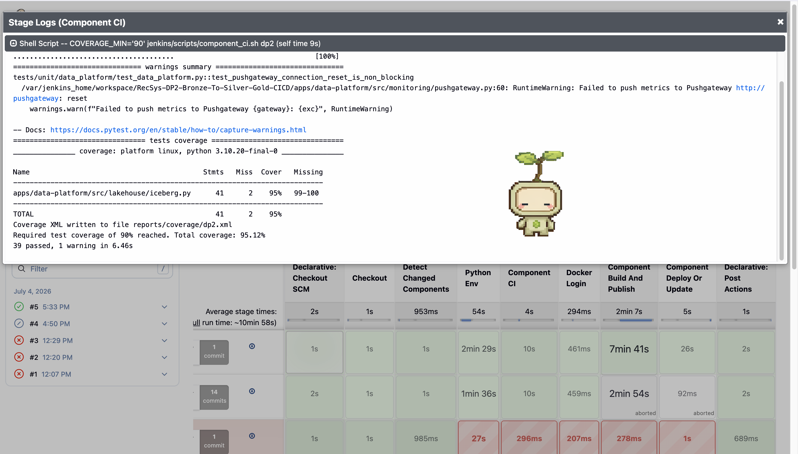

**Figure: DP2 Test proof.** Capture Jenkins
`Component CI > DP2 Bronze To Silver Gold` showing Spark/lakehouse tests and
coverage.

**Build:** `component_build_publish.sh dp2` builds and pushes `recsys-spark` and
`recsys-airflow`.

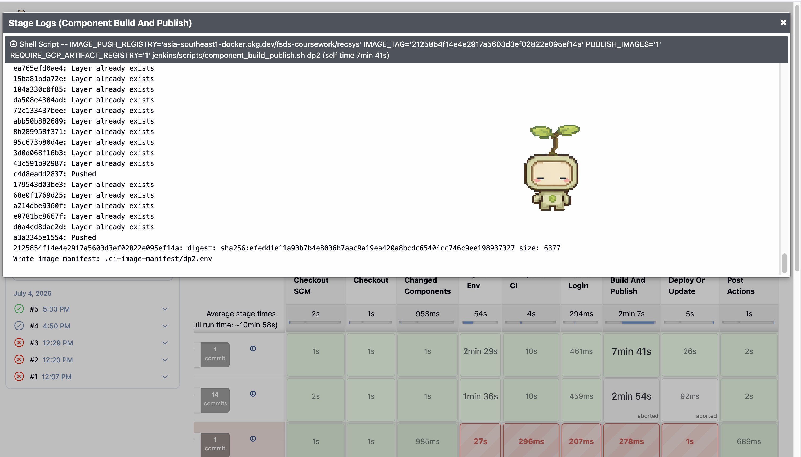

**Figure: DP2 Build proof.** Capture Jenkins
`Component Build And Publish > DP2 Bronze To Silver Gold` with Spark and Airflow
images pushed.

**Deploy:** `component_deploy.sh dp2` upgrades `recsys-data-platform` and updates
the Spark and Airflow images.

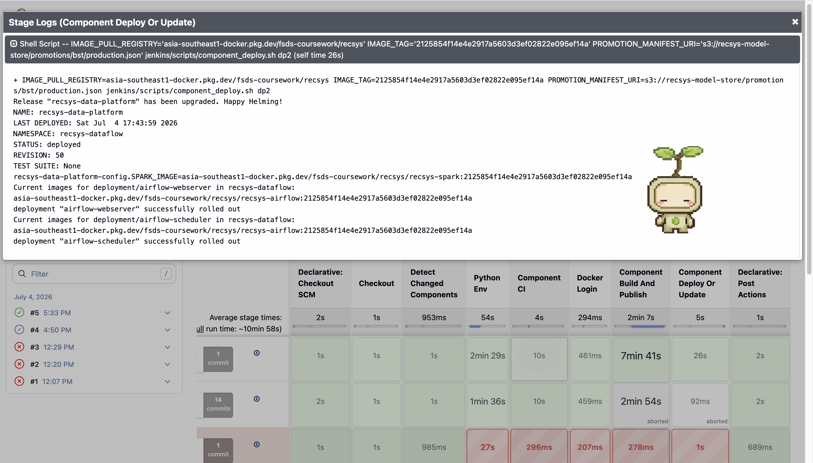

**Figure: DP2 Deploy proof.** Capture Jenkins
`Component Deploy Or Update > DP2 Bronze To Silver Gold` showing the Helm update
for batch transform runtimes.

### Data Pipeline 3 - Silver/Gold To Offline Feature Table

**Jenkins component:** `dp3`

**Jenkins UI label:** `DP3 Offline Feature Table`

**Strategy:** run this CI/CD branch when offline feature builders, training
table preparation, Feast/PostgreSQL offline-store export, DP3 Airflow DAG, or
offline feature table config changes, especially
`apps/data-platform/src/feature_store/`, `apps/data-platform/src/features/spark/`,
`apps/ml-system/src/cli/prepare_bst_training_data.py`,
`tests/unit/ml_system/test_prepare_bst_training_data.py`, and
`rubric_data_pipeline_dags.py`.

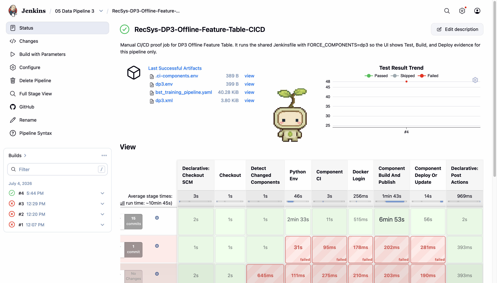

**Test:** `component_ci.sh dp3` runs data-platform tests, BST training-data prep
tests, Docker/dataflow contract tests, any matching integration suite that exists, and
coverage for `lakehouse.iceberg` and `feature_store.online_writer`.

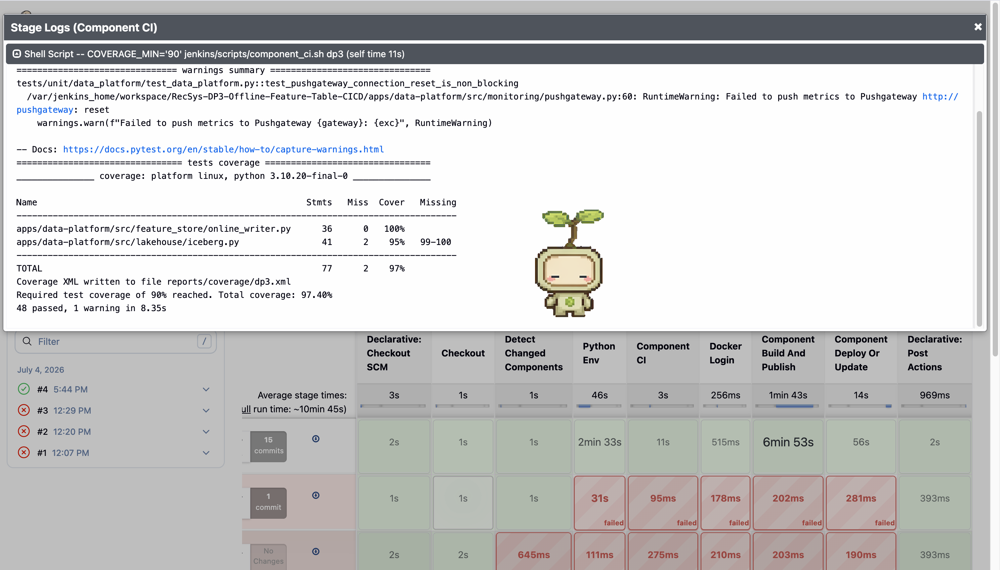

**Figure: DP3 Test proof.** Capture Jenkins
`Component CI > DP3 Offline Feature Table` showing offline feature table and BST
training-data tests.

**Build:** `component_build_publish.sh dp3` builds and pushes `recsys-spark`,
`recsys-dataflow-cli`, and `recsys-airflow`.

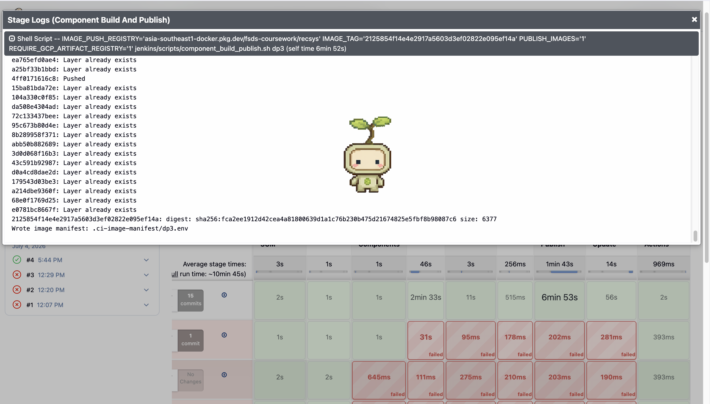

**Figure: DP3 Build proof.** Capture Jenkins
`Component Build And Publish > DP3 Offline Feature Table` with Spark, dataflow
CLI, and Airflow images pushed.

**Deploy:** `component_deploy.sh dp3` upgrades `recsys-data-platform` and updates
the Spark, dataflow CLI, and Airflow images.

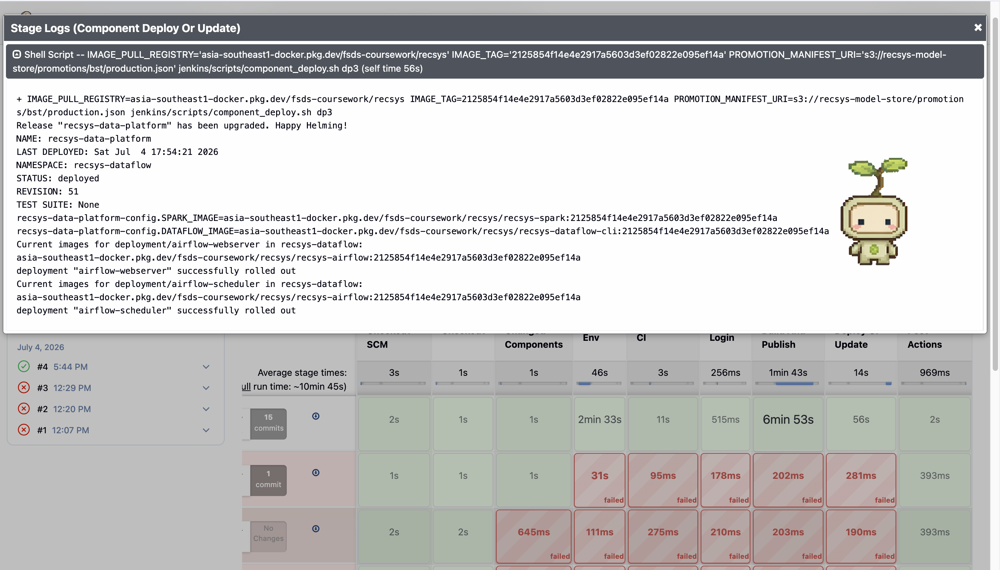

**Figure: DP3 Deploy proof.** Capture Jenkins
`Component Deploy Or Update > DP3 Offline Feature Table` showing the offline
feature table runtime update.

## CI/CD For APIs

### Triton Inference Engine

**Jenkins component:** `kserve`

**Jenkins UI label:** `KServe Inference Engine`

**Strategy:** run this CI/CD branch when Triton/KServe serving chart, model
promotion, model CD script, or serving contract paths change, especially
`infra/helm/recsys-serving/`, `apps/ml-system/src/registry/model_promotion.py`,
`jenkins/scripts/model_cd.py`, `tests/unit/ml_system/test_model_promotion.py`,
and `tests/contract/test_serving_contracts.py`.

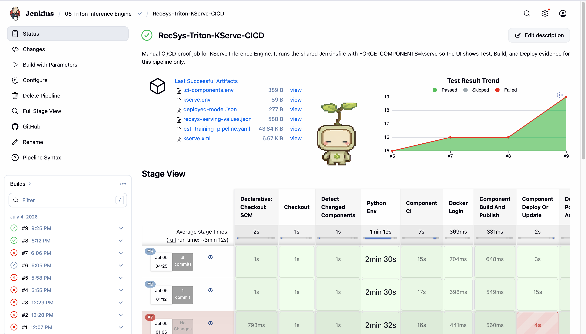

**Production deployment boundary:** this CI/CD branch validates the promoted
Triton manifest and serving chart when KServe-related code changes. It does not
own the automatic production model deploy after training. The production model
deploy is owned by the post-promotion Jenkins job `RecSys-KServe-Model-CD`,
documented below.

**Test:** `component_ci.sh kserve` runs model promotion tests, serving contract
tests, any matching integration suite that exists, and coverage for `model_cd`.

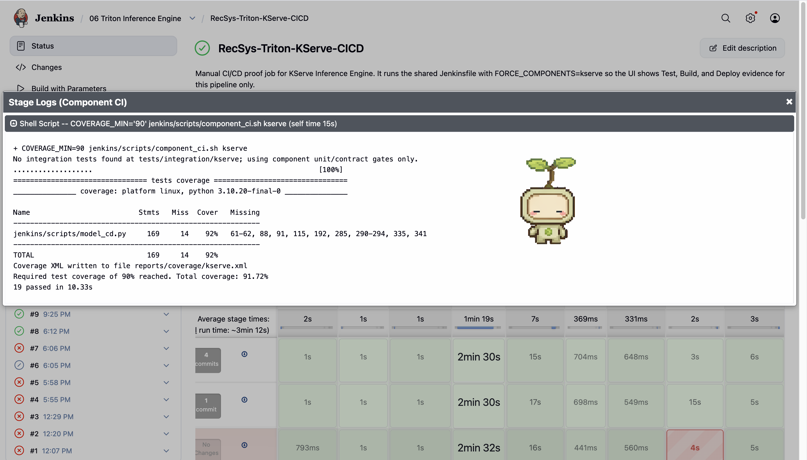

**Figure: Triton Inference Engine Test proof.** Capture Jenkins
`Component CI > KServe Inference Engine` showing promotion and serving contract
tests.

**Build:** `component_build_publish.sh kserve` does not build an API image. The
artifact is the promoted Triton model repository plus promotion manifest.

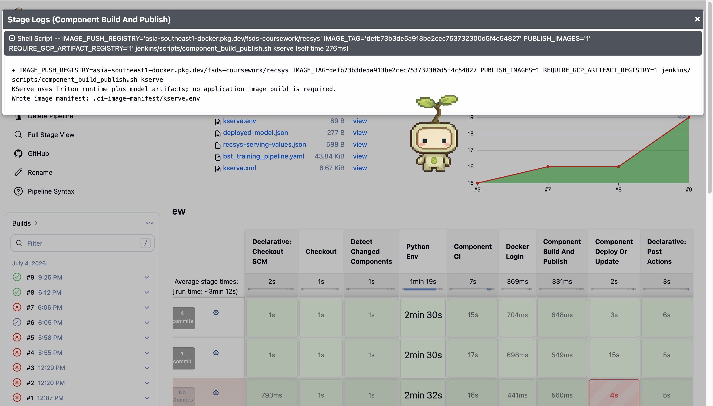

**Figure: Triton Inference Engine Build proof.** Capture Jenkins
`Component Build And Publish > KServe Inference Engine` showing that KServe uses
the Triton runtime and promoted model artifacts instead of a custom app image.

**Deploy:** `component_deploy.sh kserve` runs `model_cd.py`, validates the model
repository, applies `recsys-serving` Helm values, waits for
`recsys-bst-triton`, and enables KServe resource autoscaling after readiness.

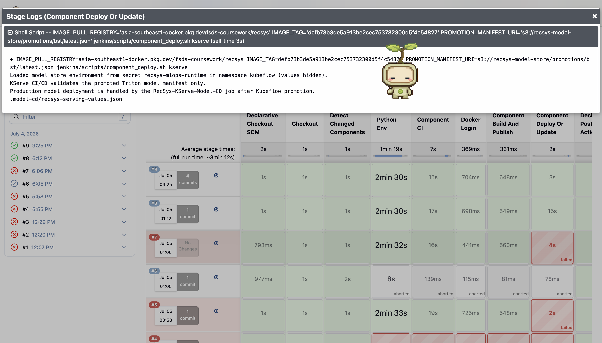

**Figure: Triton Inference Engine Deploy proof.** Capture Jenkins
`Component Deploy Or Update > KServe Inference Engine` showing the manifest URI,
KServe Helm upgrade, and `InferenceService` readiness.

### Post-Promotion KServe Model CD After Training Or Retraining

**Jenkins job:** `RecSys-KServe-Model-CD`

**Jenkins view:** `06A KServe Model CD`

**Trigger strategy:** this is not a path-based CI/CD branch. It is a post-model
promotion CD job. A normal Kubeflow training run or an observability-triggered
Kubeflow retraining run executes the same BST KFP pipeline. After
`promote-bst-model` writes a promotion manifest, the next KFP step
`Trigger KServe CD` checks the promotion score against
`kserve_cd_score_threshold` and triggers Jenkins only when the score passes.
The coursework proof threshold is `0.0`, so any promoted candidate with
`test_ndcg_at_10 >= 0.0` can deploy.

**End-to-end flow:**

```text
Kubeflow training/retraining pipeline
  -> Ray Tune
  -> Ray Train DDP
  -> evaluate-bst
  -> promote-bst-model
  -> Trigger KServe CD
  -> Jenkins RecSys-KServe-Model-CD
  -> jenkins/scripts/model_cd.py --apply
  -> Helm upgrade recsys-serving
  -> KServe/Triton rolling update
```

**Runtime inputs:** the KFP trigger passes `PROMOTION_MANIFEST_URI`,
`MODEL_VERSION`, `METRIC_NAME`, `METRIC_VALUE`, and `TRIGGER_SOURCE` to Jenkins.
The Jenkins job loads model-store credentials from the runtime secret, reads the
promotion manifest, verifies required Triton repository files, renders
`.model-cd/recsys-serving-values.json`, then applies the KServe/Triton serving
release.

**Code reference:**

- [bst_training_pipeline.py (line 246)](../../../apps/ml-system/src/kubeflow/pipelines/bst_training_pipeline.py#L246), [bst_training_pipeline.py (line 274)](../../../apps/ml-system/src/kubeflow/pipelines/bst_training_pipeline.py#L274): defines the `trigger_kserve_model_cd` KFP component.
- [bst_training_pipeline.py (line 280)](../../../apps/ml-system/src/kubeflow/pipelines/bst_training_pipeline.py#L280), [bst_training_pipeline.py (line 327)](../../../apps/ml-system/src/kubeflow/pipelines/bst_training_pipeline.py#L327): sets the default promotion score threshold to `0.0`.
- [bst_training_pipeline.py (line 442)](../../../apps/ml-system/src/kubeflow/pipelines/bst_training_pipeline.py#L442), [bst_training_pipeline.py (line 470)](../../../apps/ml-system/src/kubeflow/pipelines/bst_training_pipeline.py#L470): wires `Trigger KServe CD` after `promote-bst-model`.
- [trigger_kserve_cd.py (line 299)](../../../apps/ml-system/src/cli/trigger_kserve_cd.py#L299), [trigger_kserve_cd.py (line 382)](../../../apps/ml-system/src/cli/trigger_kserve_cd.py#L382): loads the promotion manifest, checks the metric gate, and triggers Jenkins.
- [trigger_kserve_cd.py (line 191)](../../../apps/ml-system/src/cli/trigger_kserve_cd.py#L191), [trigger_kserve_cd.py (line 268)](../../../apps/ml-system/src/cli/trigger_kserve_cd.py#L268): posts the Jenkins build parameters for `RecSys-KServe-Model-CD`.
- [KServeModelCD.Jenkinsfile (line 1)](../../../jenkins/KServeModelCD.Jenkinsfile#L1), [KServeModelCD.Jenkinsfile (line 137)](../../../jenkins/KServeModelCD.Jenkinsfile#L137): defines the dedicated post-promotion Jenkins CD job.
- [component_deploy.sh (line 516)](../../../jenkins/scripts/component_deploy.sh#L516), [component_deploy.sh (line 571)](../../../jenkins/scripts/component_deploy.sh#L571): runs the production KServe model CD path with `model_cd.py --apply`.
- [jenkins-init-configmap.yaml (line 373)](../../../infra/helm/recsys-ci/templates/jenkins-init-configmap.yaml#L373), [jenkins-init-configmap.yaml (line 495)](../../../infra/helm/recsys-ci/templates/jenkins-init-configmap.yaml#L495): seeds the Jenkins job and the `06A KServe Model CD` view.


**Proof to capture:** capture the Jenkins view `06A KServe Model CD` after a
Kubeflow training or retraining run. The proof should show `RecSys-KServe-Model-CD`
running after the Kubeflow promotion step, Jenkins parameters containing the
promotion manifest and metric, successful `.model-cd` artifacts
(`deployed-model.json`, `recsys-serving-values.json`), and the final KServe
rolling update success.

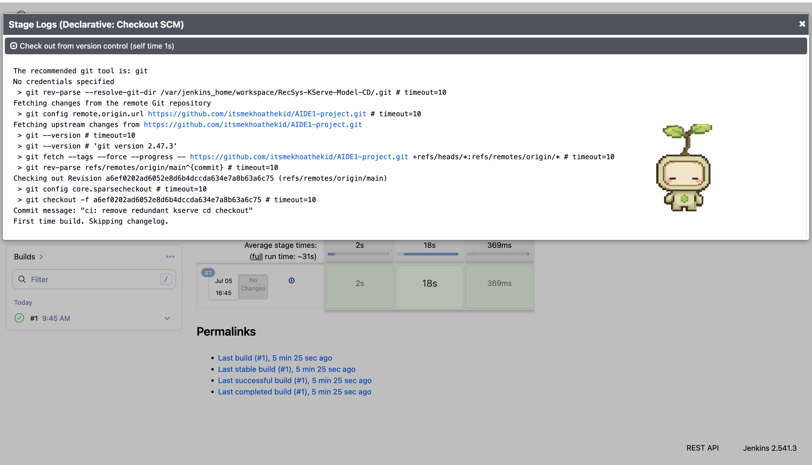

**Figure: KServe Model CD Declarative Checkout SCM proof.** Capture the Jenkins
stage log for `Declarative: Checkout SCM` showing Jenkins checking out commit
`a6ef020` from `main` and loading `jenkins/KServeModelCD.Jenkinsfile` from SCM.
This proves the post-promotion CD job runs from the version-controlled pipeline
definition after the redundant manual `Checkout` stage was removed.

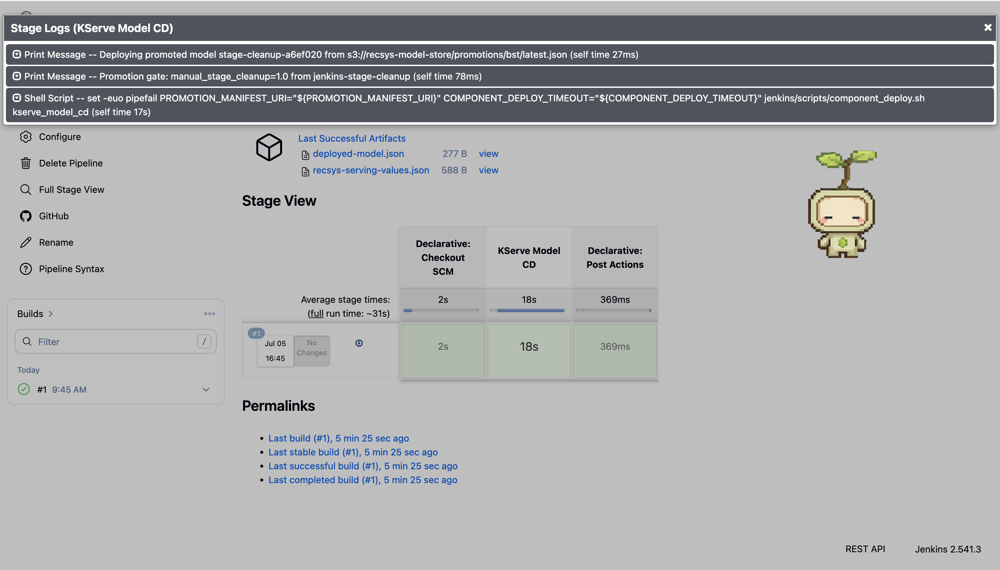

**Figure: KServe Model CD stage proof.** Capture the Jenkins stage log for
`KServe Model CD` showing the promoted model manifest, metric gate, Helm upgrade
of `recsys-serving`, `InferenceService` readiness, predictor rollout success,
and archived `.model-cd` artifacts.

### FastAPI For Online Features And Model Serving

**Jenkins component:** `api`

**Jenkins UI label:** `FastAPI Web API`

**Strategy:** run this CI/CD branch when API-serving source, ranking logic,
online feature client, A/B testing, API schemas, Triton client, serving chart, or
API tests change, especially `apps/api-serving/`,
`infra/helm/recsys-serving/`, `tests/unit/api_serving/`,
`tests/contract/test_serving_contracts.py`, and
`tests/contract/test_gateway_contracts.py`.

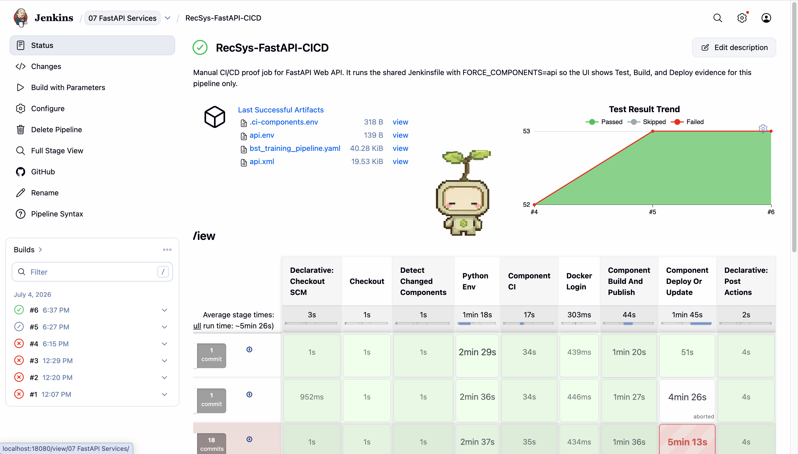

**Test:** `component_ci.sh api` runs API unit tests, serving contracts, gateway
contracts, any matching integration suite that exists, and coverage for the FastAPI,
online feature API, ranking, A/B, and Triton client modules.

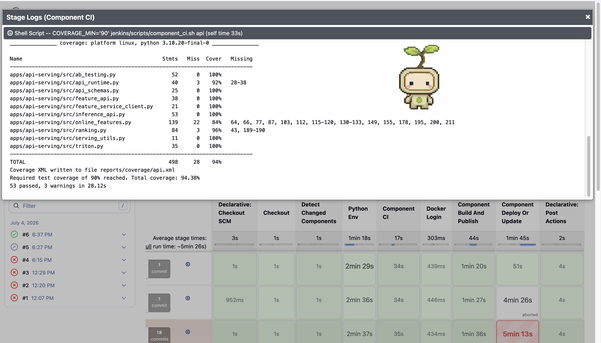

**Figure: FastAPI Test proof.** Capture Jenkins `Component CI > FastAPI Web API`
showing API unit/contract tests and coverage above the threshold.

**Build:** `component_build_publish.sh api` builds and pushes
`recsys-api-serving:<git_commit>`.

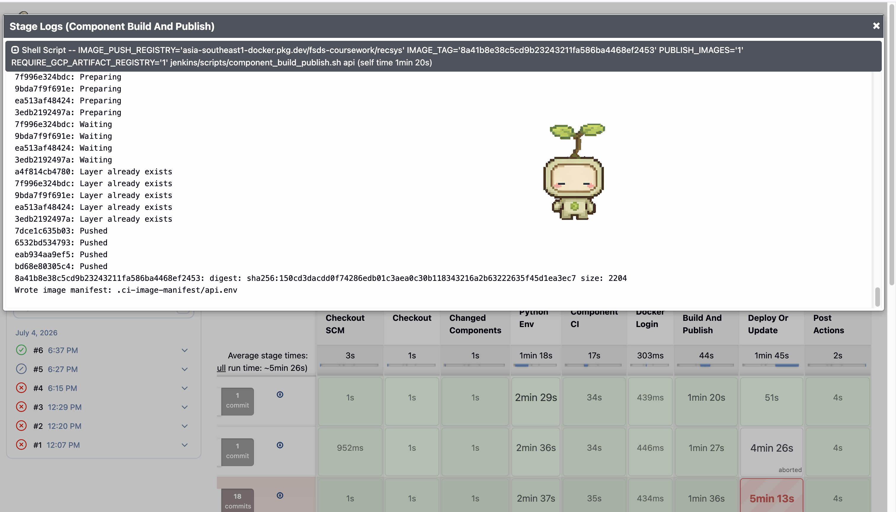

**Figure: FastAPI Build proof.** Capture Jenkins
`Component Build And Publish > FastAPI Web API` showing Docker build/push and
`.ci-image-manifest/api.env`.

**Deploy:** `component_deploy.sh api` upgrades `recsys-serving`, updates both
`api.image` and `featureApi.image`, then waits for
`recsys-api-serving` and `recsys-online-feature-api` rollouts.

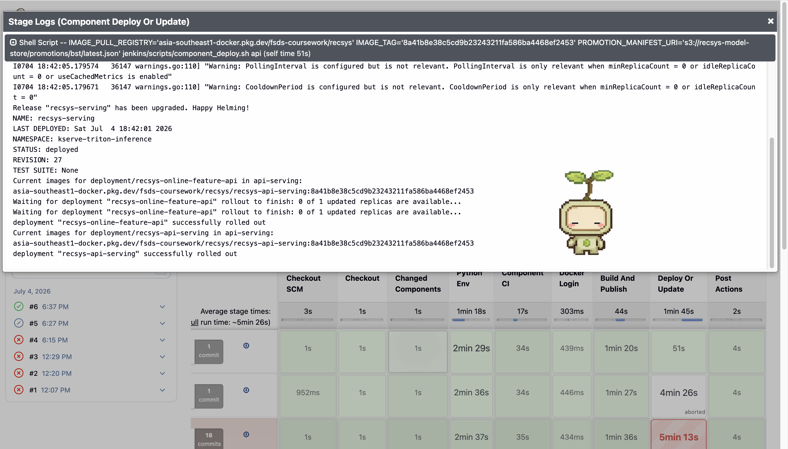

**Figure: FastAPI Deploy proof.** Capture Jenkins
`Component Deploy Or Update > FastAPI Web API` showing the Helm update and
rollout status for both FastAPI services.

## CI/CD For Jobs

### Job 1 - Push Stream Feature To OFFLINE Store

**Jenkins component:** `stream_offline`

**Jenkins UI label:** `Stream Features To Offline Store`

**Strategy:** run this CI/CD branch when Flink streaming jobs, Kafka realtime
processing code, offline feature sink logic, Flink Dockerfile, or streaming DAG
paths change, especially `apps/data-platform/src/features/flink/`,
`apps/data-platform/src/lakehouse/`, `apps/data-platform/Dockerfile.flink`,
`rubric_data_pipeline_dags.py`, and `configs/local/flink_streaming.yaml`.

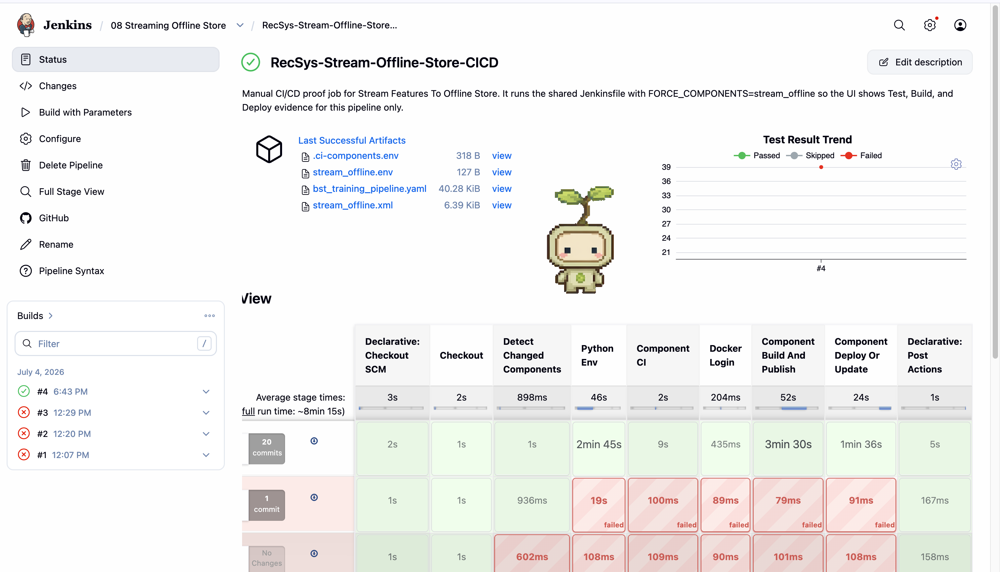

**Test:** `component_ci.sh stream_offline` runs data-platform tests,
Docker/dataflow contract tests, any matching integration suite that exists, and
coverage for the Flink job modules plus the offline sink/lakehouse code.

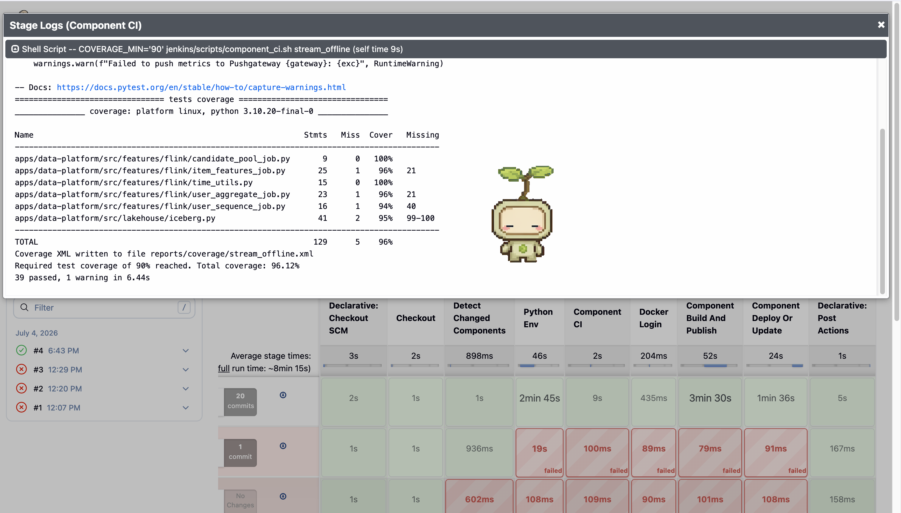

**Figure: Stream Offline Test proof.** Capture Jenkins
`Component CI > Stream Features To Offline Store` showing Flink/offline sink
tests and coverage.

**Build:** `component_build_publish.sh stream_offline` builds and pushes
`recsys-flink:<git_commit>`.

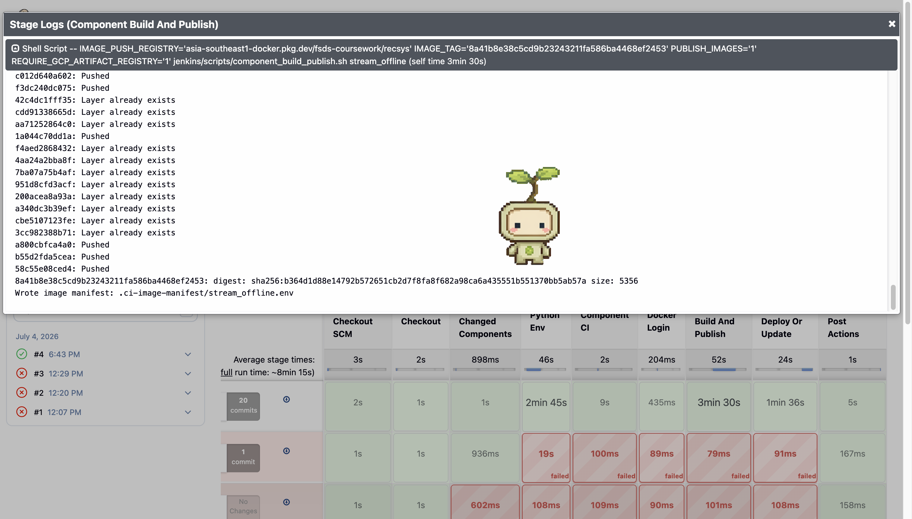

**Figure: Stream Offline Build proof.** Capture Jenkins
`Component Build And Publish > Stream Features To Offline Store` showing Flink
image build/push.

**Deploy:** `component_deploy.sh stream_offline` upgrades
`recsys-data-platform` and updates `images.flink`, which rolls the continuous
Flink offline-store job.

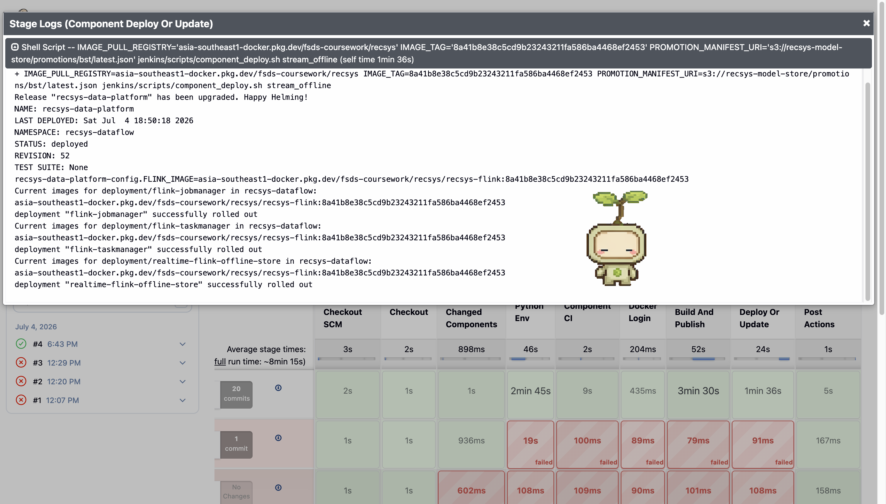

**Figure: Stream Offline Deploy proof.** Capture Jenkins
`Component Deploy Or Update > Stream Features To Offline Store` showing the Helm
upgrade for the continuous Kafka-to-offline-store Flink job.

### Job 2 - Push Stream Feature To ONLINE Store

**Jenkins component:** `stream_online`

**Jenkins UI label:** `Stream Features To Online Store`

**Strategy:** run this CI/CD branch when Flink streaming jobs, Redis online
writer logic, online feature sink code, realtime API interaction, Flink
Dockerfile, or Redis online-store config changes, especially
`apps/data-platform/src/features/flink/`,
`apps/data-platform/src/feature_store/online_writer.py`,
`apps/data-platform/Dockerfile.dataflow-cli`,
`apps/data-platform/Dockerfile.flink`, `configs/local/flink_streaming.yaml`, and
`configs/local/redis_online_store.yaml`.

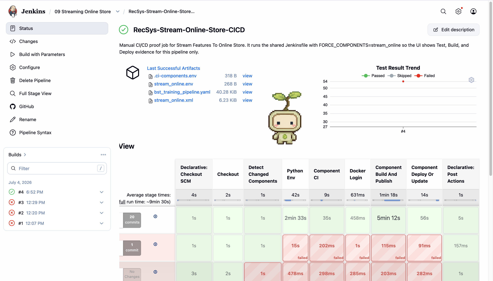

**Test:** `component_ci.sh stream_online` runs data-platform tests, selected API
serving tests, Docker/dataflow contract tests, any matching integration suite
that exists, and coverage for Flink job modules plus
`feature_store.online_writer`.

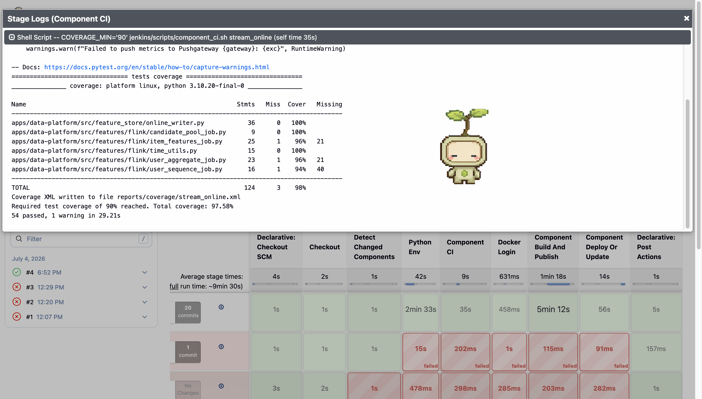

**Figure: Stream Online Test proof.** Capture Jenkins
`Component CI > Stream Features To Online Store` showing Flink/Redis online
writer tests and coverage.

**Build:** `component_build_publish.sh stream_online` builds and pushes
`recsys-flink:<git_commit>` and `recsys-dataflow-cli:<git_commit>`.

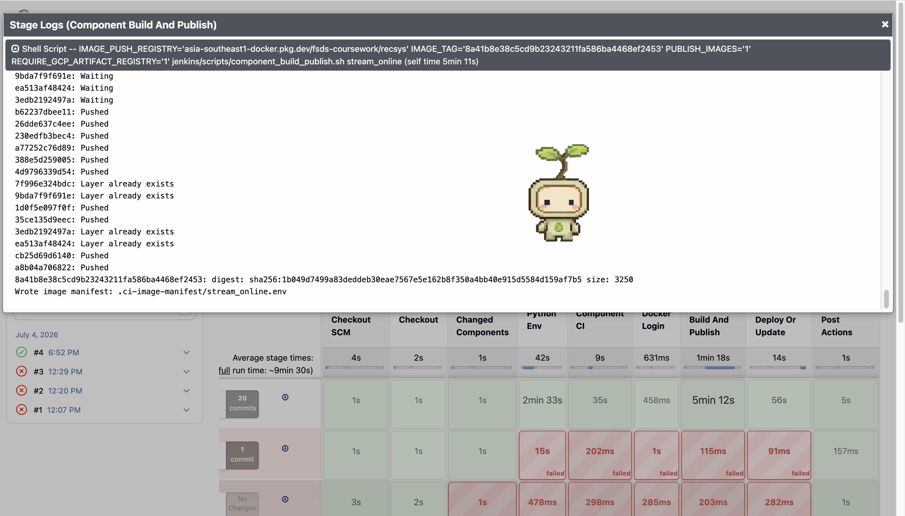

**Figure: Stream Online Build proof.** Capture Jenkins
`Component Build And Publish > Stream Features To Online Store` showing Flink
and dataflow CLI image build/push.

**Deploy:** `component_deploy.sh stream_online` upgrades
`recsys-data-platform`, updates `images.flink` and `images.dataflowCli`, and
rolls the continuous Flink online-store job and online writer runtime.

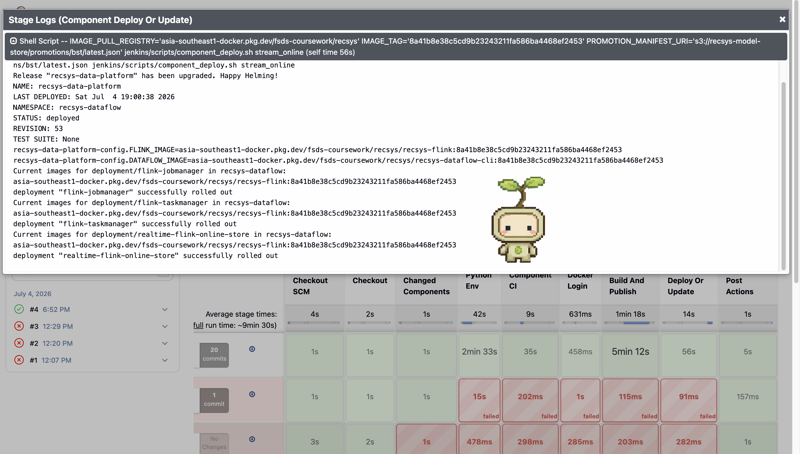

**Figure: Stream Online Deploy proof.** Capture Jenkins
`Component Deploy Or Update > Stream Features To Online Store` showing the Helm
upgrade for the continuous Kafka-to-Redis online-store Flink job.
