# CI/CD

## CI/CD Strategy

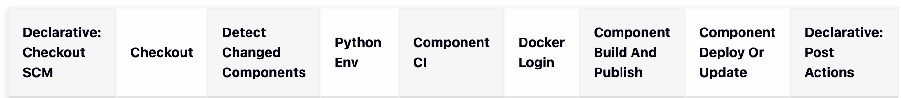

The project uses one **monorepo, path-based release pipeline**. The detector
turns one Git diff into one immutable release plan. Every later stage consumes
that same plan; it does not detect paths or rebuild the plan again. A root job is
queued while another root job is running, which prevents two releases from
sharing mutable workspace or tag state
([Jenkinsfile, lines 3-8](../../../Jenkinsfile#L3-L8)).

The Jenkins Stage View intentionally exposes the following nine columns:

```text
Declarative: Checkout SCM
→ Checkout
→ Detect Changed Components
→ Python Env
→ Component CI
→ Docker Login
→ Component Build And Publish
→ Component Deploy Or Update
→ Declarative: Post Actions
```

The columns are an orchestration view. A column can contain several internal
checkpoints, and a grey/skipped column means its `when` condition evaluated to
false. The authoritative component ownership, image ownership and deploy graph
are stored in
[`components.json`](../../../jenkins/config/components.json) and
[`deploy-units.json`](../../../jenkins/config/deploy-units.json), not hardcoded
as 13 separate build/deploy implementations.

## Jenkins Stage View Execution Contract

| # | Stage View column | Runs when | Main output/checkpoint |
| ---: | --- | --- | --- |
| 1 | `Declarative: Checkout SCM` | Every build | Jenkins-managed workspace at the requested SCM revision |
| 2 | `Checkout` | Every build | fetched refs, full `GIT_COMMIT`, loaded Groovy orchestration |
| 3 | `Detect Changed Components` | Every build | `.ci-components.env` and `.ci-release-plan.json` |
| 4 | `Python Env` | `RUN_PYTHON=true` | one locked `uv` environment per selected CI profile |
| 5 | `Component CI` | `RUN_CI_CONFIG=true` or `RUN_COMPONENT_CI=true` | JUnit, coverage and contract results |
| 6 | `Docker Login` | images must be built and `PUBLISH_IMAGES=true` | authenticated Artifact Registry session |
| 7 | `Component Build And Publish` | release plan contains images or artifacts | scans, immutable image manifest and compiled KFP YAML |
| 8 | `Component Deploy Or Update` | publish is enabled, deploy units exist, and build is `main` or forced | production preflight, deployed release graph and post-deploy verification |
| 9 | `Declarative: Post Actions` | Always, including failed builds | archived evidence and workspace/container cleanup |

### 1. `Declarative: Checkout SCM`

This first column is created by Jenkins Declarative Pipeline itself:

1. Jenkins allocates the `agent any` workspace.
2. Jenkins checks out the revision selected by the multibranch/SCM job.
3. Jenkins records the checkout metadata used by later Git commands.

There is deliberately no `skipDefaultCheckout(true)` option, so the implicit
checkout happens exactly once before the explicit stages. The explicit
`Checkout` stage below does **not** call `checkout scm` again
([pipeline declaration and options](../../../Jenkinsfile#L3-L25)).

### 2. `Checkout`

This column prepares Git metadata; it does not perform a second checkout:

1. Fetch remote branch refs with a 30-second timeout so PR target and previous
   commits can be resolved.
2. Read the exact 40-character commit with `git rev-parse HEAD`.
3. Load `jenkins/pipeline/component_pipeline.groovy`, which supplies the diff
   base resolver, parallel component CI runner, deploy graph runner and deploy
   gate.

Code:
[`Jenkinsfile`, lines 26-37](../../../Jenkinsfile#L26-L37) and
[`component_pipeline.groovy`, lines 11-34](../../../jenkins/pipeline/component_pipeline.groovy#L11-L34).
The base preference is PR target branch, previous commit, previous successful
commit, then `HEAD~1`.

### 3. `Detect Changed Components`

This is the single planning pass for the whole release:

1. Validate all Jenkins JSON configuration and catalog contracts.
2. Read the production GCP image registry.
3. Resolve the Git diff base and run the detector once.
4. Match changed paths against component rules and Dockerfile paths. An active
   path with no mapping fails closed; an unmapped deleted path is diagnostic
   only.
5. Resolve the internal image dependency closure in topological order.
6. Resolve build artifacts and deploy units from their image/artifact
   consumers.
7. Write `.ci-components.env` and `.ci-release-plan.json` version 2.
8. Import `RUN_<COMPONENT>`, `RUN_PYTHON`, `RUN_COMPONENT_CI`,
   `RUN_COMPONENT_BUILD`, `RUN_COMPONENT_DEPLOY` and diagnostic flags into the
   Jenkins environment.
9. Evaluate the production deploy gate and initialize build-scoped temporary
   directories.

`FORCE_COMPONENTS` follows the same path: the detector validates the tokens and
creates the plan directly; Groovy does not rebuild it.

#### Exact configuration-loading and environment hand-off

The detector does not discover components from folder names at runtime. Its
inputs and hand-off are explicit:

| Input | Where it is loaded | What it controls |
| --- | --- | --- |
| `jenkins/config/components.json` | `load_component_config()` reads from the fixed `jenkins/config` directory | global excludes, reusable path groups, `RUN_CI_CONFIG`, component names/flags/labels, `ciProfile`, path rules, images, artifacts and verification dependencies |
| `images/catalog.json` | `load_catalog()` inside the detector and release planner | Dockerfile ownership, internal image dependencies and topological image build order |
| `jenkins/config/deploy-units.json` | `load_deploy_config()` inside `create_release_plan()` | deploy-unit selection, image consumers, artifact consumers, chart/release/namespace and unit dependencies |
| `jenkins/config/gcp-production.json` | `configuration.py gcp imageRegistry` | approved GCP Artifact Registry used by build, push and deploy |

The exact data flow is:

1. `configuration.py validate` loads and validates the component, GCP, CI
   environment, image catalog and deploy-unit JSON contracts before diff
   detection starts.
2. `detector.py` calls `load_component_config()` and reads
   `components` plus `pathGroups`; each changed path is checked against
   `globalExcludes`, `ciConfiguration.changeDetection`, image ownership and
   every component's `changeDetection` rule.
3. For each selected component, the detector turns the configured `flag` into
   `true`, for example `dp2 -> RUN_DP2=true`. It separately derives the routing
   flags `RUN_PYTHON`, `RUN_COMPONENT_CI`, `RUN_COMPONENT_BUILD` and
   `RUN_COMPONENT_DEPLOY` from the completed release plan.
4. `render_jenkins_environment()` serializes both the flags and
   `CHANGED_COMPONENTS=<comma-separated component names>` to standard output.
   The Jenkins shell redirect writes that output to `.ci-components.env`.
5. Jenkins reads `.ci-components.env` line by line, splits each line on the
   first `=`, and calls `env.setProperty(key, value)`. This is the precise point
   at which `CHANGED_COMPONENTS` and all `RUN_*` values become Jenkins
   environment variables for later stages.

`CHANGED_COMPONENTS` and `RUN_*` have different jobs. `CHANGED_COMPONENTS` is
the compact list consumed by Python-environment preparation. Component CI
selection uses the individual `RUN_<COMPONENT>` flags. Build and deploy consume
the immutable `.ci-release-plan.json`; they do not recalculate the diff.

Reference code:
[`configuration root and JSON reader`](../../../jenkins/python/configuration.py#L12-L45),
[`component JSON loader and validation`](../../../jenkins/python/configuration.py#L135-L248),
[`full configuration validation command`](../../../jenkins/python/configuration.py#L358-L367),
[`detector config load and path matching`](../../../jenkins/python/change_detection/detector.py#L162-L240),
[`flag and release-plan derivation`](../../../jenkins/python/change_detection/detector.py#L241-L270),
[`CHANGED_COMPONENTS rendering`](../../../jenkins/python/change_detection/detector.py#L273-L290),
[`plan file write`](../../../jenkins/python/change_detection/detector.py#L293-L337), and
[`Jenkins environment import`](../../../Jenkinsfile#L42-L62).

Code:
[`Jenkinsfile`, lines 39-71](../../../Jenkinsfile#L39-L71),
[`detector.py`, lines 162-270](../../../jenkins/python/change_detection/detector.py#L162-L270),
[`detector.py`, lines 293-337](../../../jenkins/python/change_detection/detector.py#L293-L337), and
[`release_plan.py`, lines 174-250](../../../jenkins/python/release_plan.py#L174-L250).

The release-plan fields are:

```json
{
  "version": 2,
  "commit": "<40-character Git SHA>",
  "components": ["<selected CI component>"],
  "buildImages": ["<unique images in dependency order>"],
  "buildArtifacts": ["<generated non-image artifact>"],
  "deployUnits": ["<selected release units in dependency order>"]
}
```

The loader rejects an unknown image, a missing dependency, duplicate/incorrect
image order, or an unknown artifact
([release-plan validation](../../../jenkins/python/release_plan.py#L253-L304)).

### 4. `Python Env`

This column is skipped when no Python component was selected. Otherwise:

1. Query the selected components' `ciProfile` values.
2. Deduplicate profiles, so components sharing `data` or `ml` do not install
   the same environment repeatedly.
3. Create each environment below `${CI_TMP_ROOT}/envs/<profile>`.
4. Run `uv sync --frozen --group dev --no-install-project` against the profile's
   checked-in lock file and Python version.

Code:
[`Jenkinsfile`, lines 74-83](../../../Jenkinsfile#L74-L83) and
[`prepare_component_ci_envs.sh`, lines 6-32](../../../jenkins/scripts/entrypoints/prepare_component_ci_envs.sh#L6-L32).

#### How Jenkins chooses a CI profile

The selection is configuration-driven, not inferred from test paths:

1. `prepare_component_ci_envs.sh` reads the already-imported
   `CHANGED_COMPONENTS` value and passes it to
   `configuration.py ci-profiles --components ...`.
2. The CLI reloads `components.json`, finds each requested component and reads
   its `ciProfile` field.
3. It converts the requested profiles to a set, which deduplicates shared
   environments, then reloads `ci-environments.json` and prints one TSV row per
   required profile: `profile`, `projectPath`, `lockFile`, `pythonVersion`.
4. The shell loop creates `${CI_TMP_ROOT}/envs/<profile>` and executes the
   locked `uv sync` using that row. A later component branch asks
   `configuration.py component-profile <component>` for the same profile and
   fails if its prepared Python executable is absent.

Current profile mapping:

| CI profile | Components using it | Project and lock source |
| --- | --- | --- |
| `data` | `materialize`, `dp1`, `dp2`, `dp3`, `drift`, `stream_offline`, `stream_online` | `apps/data-platform/pyproject.toml` and `apps/data-platform/uv.lock` |
| `ml` | `training`, `kserve`, `rollout` | `apps/ml-system/pyproject.toml` and `apps/ml-system/uv.lock` |
| `serving` | `api` | `apps/api-serving/pyproject.toml` and `apps/api-serving/uv.lock` |
| `analytics` | `analytics` | `apps/analytics/pyproject.toml` and `apps/analytics/uv.lock` |
| `demo` | `demo_web` | `apps/demo-web/backend/pyproject.toml` and its `uv.lock` |

Reference code:
[`CHANGED_COMPONENTS consumption and locked environment sync`](../../../jenkins/scripts/entrypoints/prepare_component_ci_envs.sh#L6-L32),
[`ci-profiles resolution`](../../../jenkins/python/configuration.py#L372-L397),
[`component-profile lookup`](../../../jenkins/python/configuration.py#L398-L402),
[`CI environment JSON loader`](../../../jenkins/python/configuration.py#L306-L339),
[`profile specifications`](../../../jenkins/config/ci-environments.json#L1-L30), and
[`component ciProfile declarations`](../../../jenkins/config/components.json#L124-L520).

### 5. `Component CI`

This column contains two independent internal blocks.

#### `[CI] Contract checks`

This block runs only when Jenkins/config/catalog/Helm contract paths set
`RUN_CI_CONFIG=true`. It:

1. creates a small CI-config virtual environment;
2. runs `tests/unit/jenkins`;
3. compiles Jenkins Python and script sources;
4. checks every Jenkins/ops shell file with `bash -n`; and
5. lints and renders every Helm chart with its production/render values.

Code:
[`Jenkinsfile`, lines 85-123](../../../Jenkinsfile#L85-L123).

#### `[CI] Selected component branches`

This block runs only when at least one of the 13 components was selected. It:

1. reads component flags and labels from the validated configuration;
2. batches selected branches according to `COMPONENT_CI_MAX_PARALLEL`
   (valid range 1-13);
3. runs branches in a batch in parallel;
4. invokes `component_ci.sh <component>`;
5. selects that component's locked profile environment;
6. dispatches to the component-specific unit/contract/integration test
   function; and
7. checks the component migration policy after tests.

Code:
[`Jenkinsfile`, lines 124-137](../../../Jenkinsfile#L124-L137),
[`component_pipeline.groovy`, lines 36-59](../../../jenkins/pipeline/component_pipeline.groovy#L36-L59),
[`component_ci.sh`, lines 6-34](../../../jenkins/scripts/entrypoints/component_ci.sh#L6-L34), and
[`CI dispatcher`, lines 3-22](../../../jenkins/scripts/ci/dispatch.sh#L3-L22).

The precise component-loading boundary is worth distinguishing from Python
environment preparation. `runSelectedComponentCi()` calls
`configuration.py components-tsv`, which emits configured
`flag<TAB>name<TAB>label` rows. Groovy keeps only rows whose imported Jenkins
environment flag is `true`; it does **not** parse `CHANGED_COMPONENTS` here.
Each resulting parallel branch passes the component name to
`component_ci.sh`. That script reloads the component's `ciProfile`, activates
the prepared environment, then `dispatch.sh` maps the name to exactly one
`ci_<component>` function.

For the two serving branches specifically:

- `api` runs API-serving unit tests, serving and gateway contract tests, the
  optional `tests/integration/api` directory, and coverage over inference API,
  Feature API, feature client, ranking, Triton, A/B, shadow and shared serving
  modules.
- `kserve` runs model-promotion and serving-contract tests, the optional
  `tests/integration/kserve` directory, and coverage over model-CD CLI, config,
  Helm-release, manifest and promotion-gate modules.

Reference code:
[`components-tsv output`](../../../jenkins/python/configuration.py#L368-L371),
[`RUN_* filtering and parallel branch construction`](../../../jenkins/pipeline/component_pipeline.groovy#L36-L59),
[`per-branch profile activation`](../../../jenkins/scripts/entrypoints/component_ci.sh#L6-L29),
[`component dispatcher`](../../../jenkins/scripts/ci/dispatch.sh#L3-L22), and
[`API and KServe suites`](../../../jenkins/scripts/ci/serving.sh#L3-L20).

Important execution boundary:

- `materialize` CI tests Feast configuration against a temporary SQLite
  registry with `feast plan`, `feast apply` and registry verification. It does
  **not** trigger `recsys_feast_materialize`
  ([`ci_materialize`](../../../jenkins/scripts/ci/data.sh#L3-L30)).
- `training` CI runs ML tests, compiles a disposable KFP package with CI image
  references and validates the YAML. It does **not** create a Kubeflow run
  ([`ci_training`](../../../jenkins/scripts/ci/ml.sh#L3-L9),
  [`run_kfp_compile`](../../../jenkins/scripts/ci/runtime.sh#L78-L98)).

### 6. `Docker Login`

This column is skipped when the plan has no image/artifact build, or when
`PUBLISH_IMAGES=false`. Otherwise it:

1. verifies that the configured destination is the expected GCP Artifact
   Registry;
2. checks upload permission; and
3. performs one Docker login before the build loop.

Long builds refresh the token only when necessary, and a failed Artifact
Registry push refreshes once before one retry.

Code:
[`Jenkinsfile`, lines 140-154](../../../Jenkinsfile#L140-L154) and
[`engine.sh`, lines 63-94](../../../jenkins/scripts/build/engine.sh#L63-L94).

The registry value is loaded earlier by
`configuration.py gcp imageRegistry`, which reads the `imageRegistry` field in
`gcp-production.json`; Jenkins assigns it to both `IMAGE_PUSH_REGISTRY` and
`IMAGE_PULL_REGISTRY`. Login extracts the registry host, obtains an OAuth
access token from GCP metadata/Workload Identity or `gcloud`, then pipes it to
`docker login ... --username oauth2accesstoken --password-stdin`. The actual
push is not performed in this stage; it happens inside the next stage's image
loop.

Reference code:
[`registry config import`](../../../Jenkinsfile#L42-L47),
[`production registry value`](../../../jenkins/config/gcp-production.json#L1-L8),
[`GCP token and Docker login`](../../../jenkins/scripts/lib/registry.sh#L18-L44), and
[`upload-permission check`](../../../jenkins/scripts/lib/registry.sh#L107-L115).

### 7. `Component Build And Publish`

This single Stage View column contains both image production and artifact
packaging.

#### `[BUILD] Build, scan and publish catalog images`

1. Read the authoritative `buildImages` list from the release plan.
2. Iterate once in topological order. Shared images such as `recsys-spark` occur
   once even when several selected components consume them.
3. Resolve Dockerfile, context and internal-image build arguments from the
   15-image catalog.
4. Build the commit-scoped local image.
5. Scan it with Trivy and enforce its image policy.
6. If publishing is enabled, push it, resolve the immutable
   `registry/image@sha256:...` reference and record it in
   `.ci-image-manifest/release-plan.env`.
7. If `recsys-spark` was built, run the unified Spark image smoke test once.

Code:
[`release_build_publish.sh`, lines 17-42](../../../jenkins/scripts/entrypoints/release_build_publish.sh#L17-L42),
[`engine.sh`, lines 96-162](../../../jenkins/scripts/build/engine.sh#L96-L162),
[`image catalog`](../../../images/catalog.json), and
[`image manifest`, lines 7-48](../../../jenkins/scripts/lib/image_manifest.sh#L7-L48).

The push call chain is
`Jenkinsfile -> release_build_publish.sh -> build_scan_publish_image() ->
push_built_image() -> docker push`. The remote tag is
`${IMAGE_PUSH_REGISTRY}/<image>:${GIT_COMMIT}`. After the push, Jenkins extracts
or inspects the registry digest and records
`${IMAGE_PUSH_REGISTRY}/<image>@sha256:...`; deploy code prefers this immutable
manifest value over any tag.

Reference code:
[`build-stage arguments`](../../../Jenkinsfile#L156-L166),
[`release-plan image loop`](../../../jenkins/scripts/entrypoints/release_build_publish.sh#L17-L40),
[`catalog build, scan, push and digest record`](../../../jenkins/scripts/build/engine.sh#L96-L162), and
[`docker push with one auth-refresh retry`](../../../jenkins/scripts/build/engine.sh#L78-L94).

#### API image boundary: API and Feature API share one artifact

The `api` component declares only `recsys-api-serving`. Its catalog entry points
to one Dockerfile, which copies the complete `apps/api-serving/src` tree. The
same image digest is then assigned to two different Kubernetes Deployments:

- `recsys-api-serving` starts `inference_api:app`;
- `recsys-online-feature-api` starts `feature_api:app`.

Therefore the image is combined, but the runtime workloads are not: they have
separate Deployments, commands, configuration, probes and scaling. Releasing
either API source change rebuilds one artifact and the serving Helm upgrade
rolls both workloads to the same immutable digest.

Reference code:
[`api component image mapping`](../../../jenkins/config/components.json#L325-L357),
[`image catalog entry`](../../../images/catalog.json#L74-L77),
[`combined source copy and default command`](../../../images/serving/recsys-api-serving/Dockerfile#L25-L35),
[`API and Feature API values`](../../../infra/helm/recsys-serving/values.yaml#L55-L113), and
[`both digest assignments during deploy`](../../../jenkins/scripts/deploy/serving.sh#L3-L25).

#### `[PACKAGE] Compile Kubeflow package`

If `buildArtifacts` contains `kubeflow-bst`, Jenkins:

1. reads the immutable training and unified Spark references from the image
   manifest (commit tags are used only when publish is disabled);
2. compiles
   `pipelines/kubeflow/compiled/bst_training_pipeline.yaml`; and
3. validates that the expected images are embedded and that `:local` is absent.

Code:
[`Jenkinsfile`, lines 156-175](../../../Jenkinsfile#L156-L175),
[`release_package_artifacts.sh`, lines 13-41](../../../jenkins/scripts/entrypoints/release_package_artifacts.sh#L13-L41), and
[`kfp_package.sh`, lines 4-35](../../../jenkins/scripts/build/kfp_package.sh#L4-L35).

Compiling creates a pipeline **definition** only. This stage never submits a
Kubeflow experiment/run and never starts model training.

### 8. `Component Deploy Or Update`

This column runs only when all of these conditions are true:

- the plan contains deploy units;
- `PUBLISH_IMAGES=true`; and
- the checked-out revision is `main`, or `FORCE_DEPLOY=true`.

The gate is implemented in
[`shouldDeployRelease`](../../../jenkins/pipeline/component_pipeline.groovy#L85-L104).
The column then executes three internal checkpoints.

#### `[DEPLOY] Production preflight`

The global preflight runs once for the release. It rejects a non-main,
non-forced deploy, rejects unpublished images, validates GCP project/cluster,
registry, identity, CRDs, RBAC and image digests, and writes a commit-bound
preflight checkpoint.

Code:
[`release_deploy_preflight.sh`, lines 4-32](../../../jenkins/scripts/entrypoints/release_deploy_preflight.sh#L4-L32).

#### `[DEPLOY] Deploy release`

1. Convert `deployUnits` into dependency layers.
2. Run units in the same layer in parallel.
3. Acquire a Jenkins lock per `kind:namespace:release`.
4. Read each unit's context once.
5. Resolve its image value to an immutable digest.
6. For Helm units, run `helm upgrade --install` with `--atomic`,
   `--cleanup-on-fail`, `--wait` and `--wait-for-jobs`.
7. For `kubeflow-bst-package`, upload the YAML compiled in the previous stage and
   store `.ci-deploy/kfp-upload.json`.

Code:
[`component_pipeline.groovy`, lines 61-83](../../../jenkins/pipeline/component_pipeline.groovy#L61-L83),
[`release_plan.py`, lines 369-390](../../../jenkins/python/release_plan.py#L369-L390),
[`release_deploy_unit.sh`, lines 49-119](../../../jenkins/scripts/entrypoints/release_deploy_unit.sh#L49-L119),
[`Helm deploy`, lines 121-168](../../../jenkins/scripts/entrypoints/release_deploy_unit.sh#L121-L168), and
[`deploy dispatch`, lines 170-208](../../../jenkins/scripts/entrypoints/release_deploy_unit.sh#L170-L208).

##### How a detected component becomes a deploy unit

A detected component is **not** passed directly to `helm upgrade`. The release
planner selects a deploy unit when at least one of these is true:

1. the unit's `components` intersects the detected components;
2. the unit consumes an image in the selected component's image dependency
   closure;
3. the unit consumes a selected build artifact; or
4. a changed path is inside that unit's chart directory.

It then writes only the ordered unit names to `deployUnits`. At deploy time,
`plan-units` computes dependency depths. Groovy runs units in the same depth in
parallel, but a lock named `kind:namespace:release` prevents two builds from
mutating the same release concurrently.

For one directly selected component at a time, the current configuration
produces this deploy-unit plan (image dependencies and artifact consumers are
already expanded):

| Detected component | Current selected deploy units |
| --- | --- |
| `materialize` | `data-config`, `feature-store`, `feature-registry`, `airflow` |
| `training` | `mlflow`, `kubeflow-bst-package`, `data-config`, `airflow`, `rollout` |
| `dp1` | `kubeflow-bst-package`, `data-config`, `data-lakehouse`, `source-store`, `event-stream`, `kafka-connect`, `streaming`, `airflow` |
| `dp2` | `kubeflow-bst-package`, `data-config`, `airflow` |
| `dp3` | `kubeflow-bst-package`, `data-config`, `feature-store`, `feature-registry`, `airflow` |
| `api` | `serving` |
| `kserve` | `serving` |
| `rollout` | `kubeflow-bst-package`, `rollout` |
| `drift` | `data-config`, `airflow` |
| `stream_offline` | `data-config`, `streaming` |
| `stream_online` | `data-config`, `streaming` |
| `analytics` | `kubeflow-bst-package`, `data-config`, `airflow`, `analytics` |
| `demo_web` | `demo-web` |

The apparently broad DP plans are intentional consequences of image closure.
For example, changing DP2 rebuilds the unified Spark image; the KFP package,
data config and Airflow all consume that image, so they enter the same release
plan. If several components are selected together, the planner unions and
deduplicates their images, artifacts and deploy units before ordering them.

Reference code:
[`component image/artifact declarations`](../../../jenkins/config/components.json#L124-L520),
[`deploy-unit consumer graph`](../../../jenkins/config/deploy-units.json#L1-L298),
[`unit selection rules`](../../../jenkins/python/release_plan.py#L174-L250),
[`dependency layers and lock names`](../../../jenkins/python/release_plan.py#L369-L390), and
[`parallel layer execution with Jenkins locks`](../../../jenkins/pipeline/component_pipeline.groovy#L61-L83).

##### Exactly how each selected unit is upgraded

`release_deploy_unit.sh` first asks `release_plan.py deploy-context` for the
unit's `kind`, Helm release, namespace, chart, image-to-values mappings and all
selected components. This prevents shell code from independently rereading and
reinterpreting the JSON graph.

For generic Helm units, every configured image is resolved in this priority:

1. immutable digest from `.ci-image-manifest/release-plan.env` if built in this
   run;
2. current installed Helm value when the image was not rebuilt;
3. `${IMAGE_PULL_REGISTRY}/<image>:${GIT_COMMIT}` as a final fallback.

On GCP production, any remaining tag is resolved to `@sha256:` before Helm is
called. The script turns each `imageValues` entry into
`--set-string <values.path>=<digest>` and runs:

```text
helm upgrade --install <release> <chart>
  --namespace <namespace> --create-namespace
  --reset-values -f <chart>/values-gcp.yaml
  --atomic --cleanup-on-fail --wait --wait-for-jobs
```

The deploy dispatch is:

| Unit(s) | Upgrade/action implementation |
| --- | --- |
| `data-config`, `data-lakehouse`, `source-store`, `event-stream`, `feature-store`, `kafka-connect`, `streaming`, `airflow` | Generic `deploy_helm_unit()`: `values-gcp.yaml`, `--reset-values`, and digest overrides from each unit's `imageValues` map. |
| `mlflow` | `deploy_mlflow()`: atomic Helm upgrade with `--reuse-values`, immutable `recsys-mlflow`, production scheduling/resources, then workload rollout checks. |
| `analytics` | `deploy_analytics()`: atomic Helm upgrade with `--reuse-values`, immutable DBT and Superset images, secret mode, then Deployment/StatefulSet checks. |
| `serving` when `api` is selected | `deploy_api()`: atomic Helm upgrade of `recsys-serving` with `--reuse-values`; sets both `api.image` and `featureApi.image` to the same immutable `recsys-api-serving` digest, then waits for both Deployments. |
| `serving` when `kserve` is selected | `deploy_kserve()`: runs the model-CD CLI using the promotion manifest. It is selected by the same serving unit, but this branch is not a direct `helm upgrade` in `release_deploy_unit.sh`. If both `api` and `kserve` are selected, both branches run sequentially inside the locked serving unit. |
| `demo-web` | `deploy_demo_web()`: atomic Helm upgrade with `values-gcp.yaml`, immutable frontend/backend images, then Deployment, ExternalSecret, certificate and ingress checks. |
| `feature-registry` | Not Helm: starts a temporary pod from the immutable Feast image, executes `feast plan`, `feast apply` and registry verification, then removes the pod. |
| `kubeflow-bst-package` | Not Helm: uploads the compiled KFP YAML and records the returned pipeline/version metadata. |
| `rollout` | Not Helm: invokes the rollout-watcher Jenkins action. |

`--atomic` covers failures that occur during a Helm command. The later global
`[VERIFY] Verify release` block runs after all deploy units and is outside that
Helm transaction; a verification failure makes Jenkins fail but does not by
itself trigger Helm's automatic rollback.

Reference code:
[`deploy-context loading`](../../../jenkins/scripts/entrypoints/release_deploy_unit.sh#L42-L75),
[`preflight checkpoint and deploy-unit authorization`](../../../jenkins/scripts/entrypoints/release_deploy_unit.sh#L81-L89),
[`image resolution priority`](../../../jenkins/scripts/entrypoints/release_deploy_unit.sh#L91-L119),
[`generic Helm argument construction`](../../../jenkins/scripts/entrypoints/release_deploy_unit.sh#L121-L168),
[`unit dispatch`](../../../jenkins/scripts/entrypoints/release_deploy_unit.sh#L170-L208),
[`shared atomic Helm helper`](../../../jenkins/scripts/lib/helm.sh#L3-L18),
[`MLflow upgrade`](../../../jenkins/scripts/deploy/ml_platform.sh#L3-L23),
[`analytics upgrade`](../../../jenkins/scripts/deploy/analytics.sh#L3-L26),
[`API/KServe deploy split`](../../../jenkins/scripts/deploy/serving.sh#L3-L39),
[`demo upgrade`](../../../jenkins/scripts/deploy/demo.sh#L3-L16), and
[`Feast registry action`](../../../jenkins/scripts/deploy/feast.sh#L77-L98).

Uploading the KFP package creates/updates the pipeline package/version. It does
**not** create a workflow run
([`upload_kfp_package.sh`, lines 24-36](../../../jenkins/scripts/deploy/upload_kfp_package.sh#L24-L36)).

#### `[VERIFY] Verify release`

Only after the whole deploy graph completes, Jenkins verifies each selected
component once. Shared verifications are deduplicated. Verification checks
readiness, health, registration, image/package state and relevant APIs; it does
not rerun all component CI suites.

Code:
[`Jenkinsfile`, lines 177-197](../../../Jenkinsfile#L177-L197) and
[`release_verify.sh`, lines 34-49](../../../jenkins/scripts/entrypoints/release_verify.sh#L34-L49).

Production workload boundary:

- `materialize`, `dp1`, `dp2`, `dp3` and `drift` wait for Airflow and verify that
  the expected DAG is registered. They do **not** trigger the DAG
  ([data-platform verification](../../../jenkins/scripts/test/data_platform.sh#L3-L33),
  [drift verification](../../../jenkins/scripts/test/data_platform.sh#L80-L83)).
- `training` checks MLflow health and verifies that the exact uploaded KFP
  package/version exists. It does **not** submit a KFP run
  ([training verification](../../../jenkins/scripts/test/ml_platform.sh#L3-L34)).

Therefore normal CI/CD deploys code/configuration and checks the resulting
platform state, but leaves expensive/business workloads to Airflow schedules,
manual operations or a separately authorized workflow trigger.

### 9. `Declarative: Post Actions`

This column runs even if an earlier stage fails:

1. publish JUnit XML;
2. archive coverage, validation/GCP reports, compiled KFP YAML, detector output,
   release plan, image manifest, model-CD and demo evidence;
3. remove the build-scoped temporary Python/cache directory; and
4. run Docker garbage collection.

Code:
[`Jenkinsfile`, lines 200-212](../../../Jenkinsfile#L200-L212).

## Worked Example: `materialize` + `training`

For either a matching Git diff or
`FORCE_COMPONENTS=materialize,training`, the detector produces:

```text
RUN_MATERIALIZE=true
RUN_TRAINING=true
RUN_PYTHON=true
RUN_COMPONENT_CI=true
RUN_COMPONENT_BUILD=true
RUN_COMPONENT_DEPLOY=true
```

The stage flow is:

1. `Python Env` prepares the deduplicated `data` and `ml` profiles.
2. `Component CI` runs `Materialize Pipeline` and `Training Pipeline` branches
   in parallel when the parallel limit permits. Materialize tests a temporary
   Feast registry; training tests and validates a disposable KFP definition.
3. `Component Build And Publish` builds each image once in this order:
   `recsys-base-python`, `recsys-feature-store`, `recsys-drift-retrain`,
   `recsys-spark`, `recsys-airflow`, `recsys-mlops-training`, `recsys-mlflow`.
4. The same stage compiles the final `kubeflow-bst` package with
   `recsys-mlops-training@sha256:...` and `recsys-spark@sha256:...`.
5. If the deploy gate is open, deploy layers are:

```text
layer 0: mlflow | rollout
layer 1: kubeflow-bst-package
layer 2: data-config
layer 3: feature-store
layer 4: feature-registry | airflow
```

6. Verification checks the Feast DAG registration, MLflow health and uploaded
   KFP package/version. It does not trigger Feast materialization and does not
   create a Kubeflow workflow run.

The component-to-image/artifact source is
[`components.json`, lines 124-202](../../../jenkins/config/components.json#L124-L202).
The deploy consumer/dependency graph is
[`deploy-units.json`, lines 3-40](../../../jenkins/config/deploy-units.json#L3-L40),
[`deploy-units.json`, lines 93-147](../../../jenkins/config/deploy-units.json#L93-L147), and
[`deploy-units.json`, lines 173-232](../../../jenkins/config/deploy-units.json#L173-L232).

## Code Reference

| Responsibility | Authoritative code |
| --- | --- |
| Nine UI columns and their conditions | [`Jenkinsfile`](../../../Jenkinsfile) |
| Diff-base resolution, CI batching, deploy layers and gate | [`component_pipeline.groovy`](../../../jenkins/pipeline/component_pipeline.groovy) |
| Component/path/image/artifact ownership | [`components.json`](../../../jenkins/config/components.json) |
| Single-pass detector | [`detector.py`](../../../jenkins/python/change_detection/detector.py) |
| Immutable release plan | [`release_plan.py`](../../../jenkins/python/release_plan.py) |
| 15-image catalog | [`images/catalog.json`](../../../images/catalog.json) |
| Component CI entrypoint and dispatcher | [`component_ci.sh`](../../../jenkins/scripts/entrypoints/component_ci.sh), [`dispatch.sh`](../../../jenkins/scripts/ci/dispatch.sh) |
| Build, scan, publish and digest manifest | [`release_build_publish.sh`](../../../jenkins/scripts/entrypoints/release_build_publish.sh), [`engine.sh`](../../../jenkins/scripts/build/engine.sh) |
| KFP compile/validate | [`release_package_artifacts.sh`](../../../jenkins/scripts/entrypoints/release_package_artifacts.sh), [`kfp_package.sh`](../../../jenkins/scripts/build/kfp_package.sh) |
| Deploy-unit graph | [`deploy-units.json`](../../../jenkins/config/deploy-units.json) |
| Global production preflight | [`release_deploy_preflight.sh`](../../../jenkins/scripts/entrypoints/release_deploy_preflight.sh) |
| Helm/KFP/unit deployment | [`release_deploy_unit.sh`](../../../jenkins/scripts/entrypoints/release_deploy_unit.sh) |
| Post-deploy verification | [`release_verify.sh`](../../../jenkins/scripts/entrypoints/release_verify.sh), [`test/`](../../../jenkins/scripts/test/) |


## CI/CD For Pipelines

### Main CI/CD Pipelines

**Jenkins job:** `RecSys-GitHub-CICD`

**Jenkins view:** `00 Main Auto Deploy`

**Strategy:** this is the main monorepo CI/CD entrypoint. GitHub push or merge
events trigger the Jenkins job through `/github-webhook/`. Jenkins checks out
the repository, detects changed paths, enables only affected component branches,
then runs CI, image build/push, and deploy/update for changed components on
`main`.

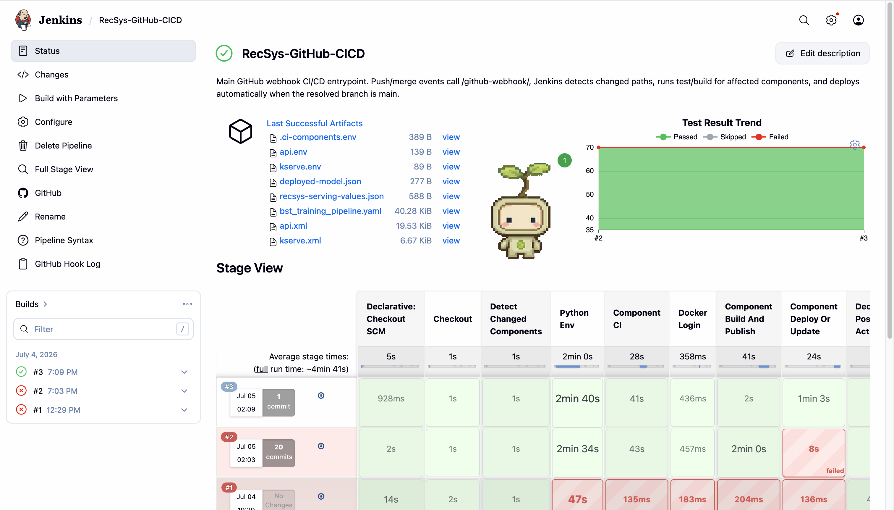

**Figure: Main CI/CD pipeline proof.** Capture the `00 Main Auto Deploy` view
showing the full shared stage layout for the monorepo pipeline.

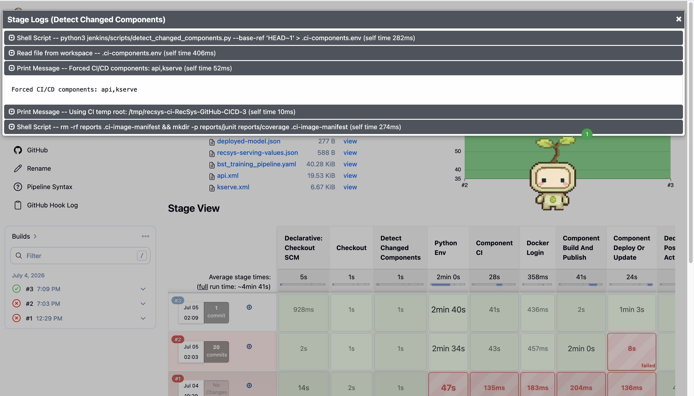

**Figure: Main CI/CD Detect Changed Components proof.** Capture the Jenkins
`Detect Changed Components` stage log showing `.ci-components.env`,
`CHANGED_COMPONENTS=<component list>`, and the generated `RUN_<COMPONENT>` flags.
This proves the main pipeline is path-based and does not deploy unrelated
components.

**Test/build/deploy flow:** the main job uses the same component branches as the
manual proof jobs below. The difference is the trigger: manual component jobs set
`FORCE_COMPONENTS`, while the main job derives the enabled components from the
changed paths in Git.

**Test:** `Component CI` runs only the test branches enabled by
`CHANGED_COMPONENTS`.

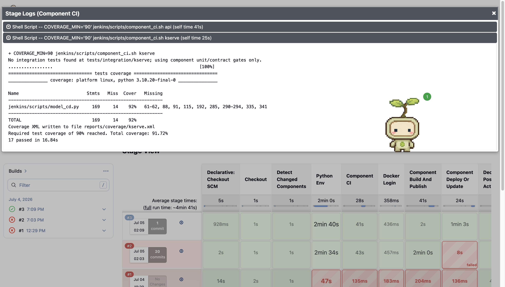

**Figure: Main CI/CD Test proof.** Capture Jenkins `Component CI` showing the
path-detected component test branches passing.

**Build:** `Component Build And Publish` consumes the release plan's unique,
topologically ordered `buildImages`. It builds and scans each image once, tags
and optionally pushes it, resolves immutable digests, writes
`.ci-image-manifest/release-plan.env`, and compiles selected non-image
artifacts.

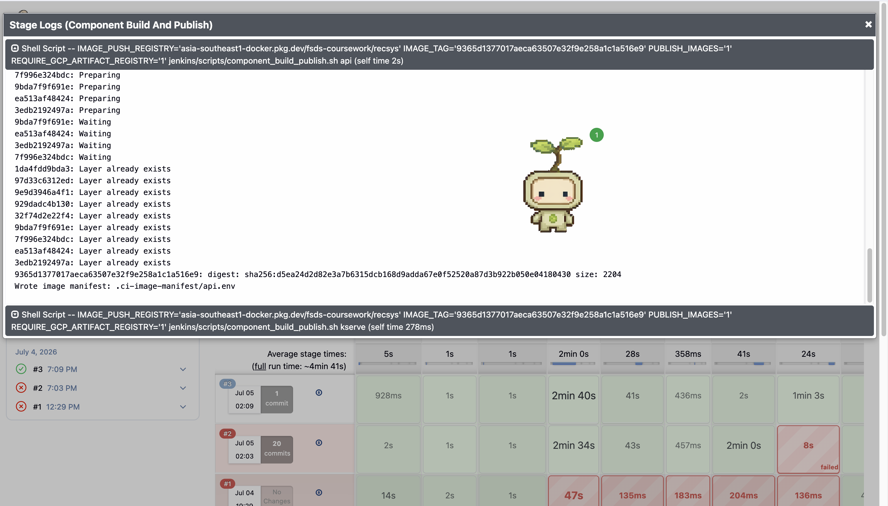

**Figure: Main CI/CD Build proof.** Capture Jenkins
`Component Build And Publish` showing Docker build/push output and the
commit-tagged image URI.

**Deploy:** `Component Deploy Or Update` runs only when the deploy gate is open.
It performs one production preflight, deploys selected units by dependency
layer with per-release Jenkins locks, then verifies selected components once.

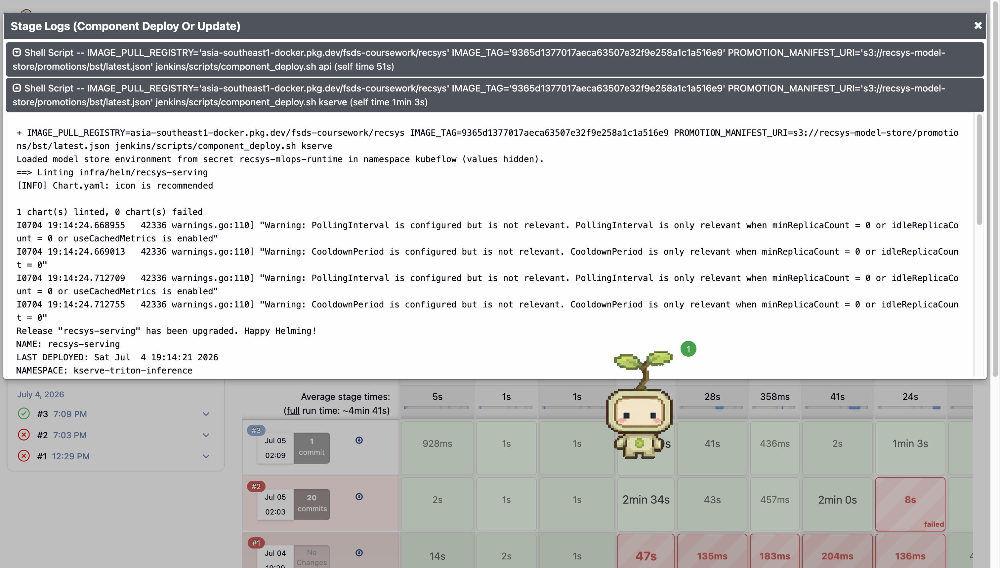

**Figure: Main CI/CD Deploy proof.** Capture Jenkins
`Component Deploy Or Update` showing the updated image/config reference and
successful rollout/readiness check.

### Materialize Pipeline

**Jenkins component:** `materialize`

**Jenkins UI label:** `Materialize Pipeline`

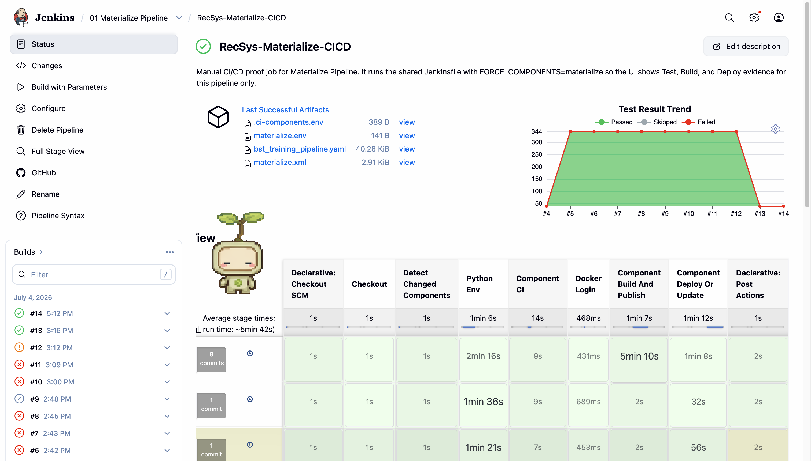

**Strategy:** select this branch from the authoritative `materialize`
`changeDetection` rules, including Feast repository, feature-store, metadata,
Airflow data-release and shared Spark utility paths
([component mapping](../../../jenkins/config/components.json#L126-L159)).

**Test:** `component_ci.sh materialize` runs data-platform, feature-store and
Docker contract tests, then creates a temporary SQLite Feast registry and runs
`feast plan`, `feast apply` and registry verification. This is a CI-local
configuration test; it does not trigger the production materialization DAG
([materialize CI](../../../jenkins/scripts/ci/data.sh#L3-L30)).

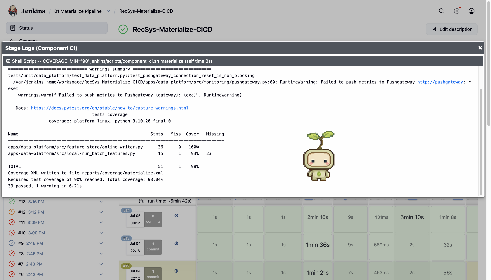

**Figure: Materialize Pipeline Test proof.** Capture Jenkins
`Component CI > Materialize Pipeline` with passing pytest and coverage output.

**Build:** the release plan requests `recsys-feature-store` and
`recsys-airflow`; the catalog adds `recsys-base-python` before its dependent.
Each resulting image is built, scanned and optionally pushed once.

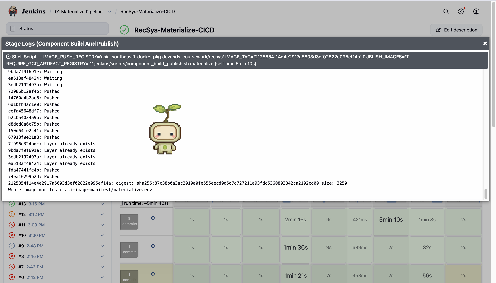

**Figure: Materialize Pipeline Build proof.** Capture Jenkins
`Component Build And Publish` with catalog build/scan/push markers and the
immutable references in `.ci-image-manifest/release-plan.env`.

**Deploy:** image consumers and component ownership select the required small
release units, including data config, feature-store runtime, Feast registry and
Airflow as applicable. Helm units receive digest-pinned image values; the Feast
registry is applied as a separate Kubernetes action
([deploy-unit mapping](../../../jenkins/config/deploy-units.json#L13-L40),
[`feature-store` and `feature-registry`](../../../jenkins/config/deploy-units.json#L93-L147),
[`airflow`](../../../jenkins/config/deploy-units.json#L173-L203)).

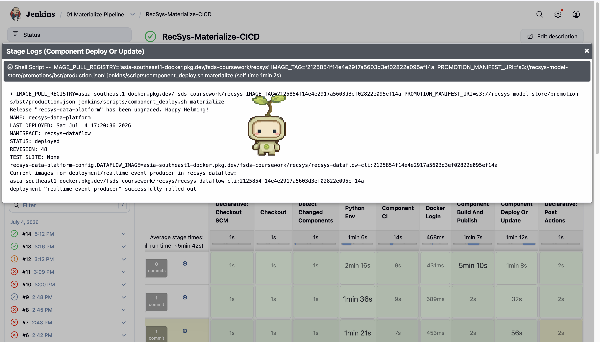

**Figure: Materialize Pipeline Deploy proof.** Capture Jenkins
`Component Deploy Or Update` with preflight, dependency-layer deployment and
the final check that `recsys_feast_materialize` is registered. Registration
verification does not trigger the DAG
([materialize verification](../../../jenkins/scripts/test/data_platform.sh#L14-L17)).

### Training Pipeline

**Jenkins component:** `training`

**Jenkins UI label:** `Training Pipeline`

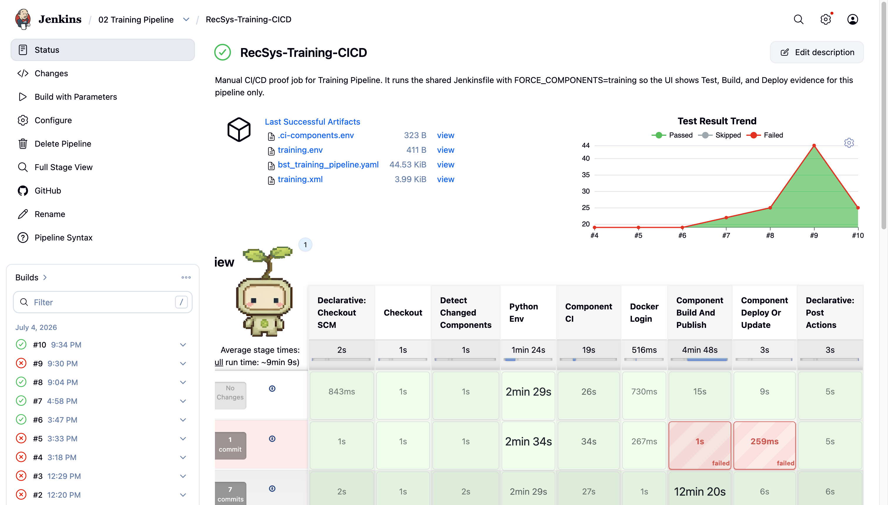

**Strategy:** run this branch when ML-system source/config, Kubeflow package,
Ray/runtime/MLflow Helm, notebooks, ML tests or the training CI/deploy helpers
change
([component mapping](../../../jenkins/config/components.json#L162-L201)).

**Test:** `component_ci.sh training` runs ML-system unit and available
integration tests with coverage. It compiles and validates a disposable KFP
definition using CI image references. It does not submit a KFP run
([training CI](../../../jenkins/scripts/ci/ml.sh#L3-L9),
[`run_kfp_compile`](../../../jenkins/scripts/ci/runtime.sh#L78-L98)).

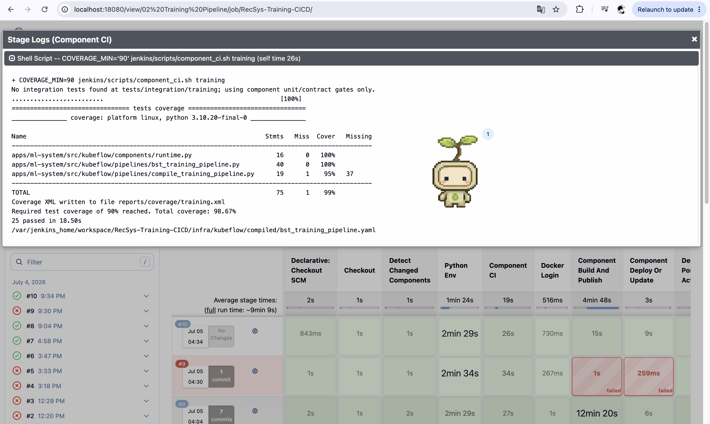

**Figure: Training Pipeline Test proof.** Capture Jenkins
`Component CI > Training Pipeline` showing `tests/unit/ml_system` and
`compile_training_pipeline.py` success.

**Build:** the plan requests `recsys-mlops-training`, the unified
`recsys-spark`, `recsys-mlflow` and `recsys-drift-retrain`; the catalog adds
`recsys-base-python`. Each image is built/scanned/pushed once. Jenkins then
compiles the final `kubeflow-bst` YAML with immutable training and Spark
digests.

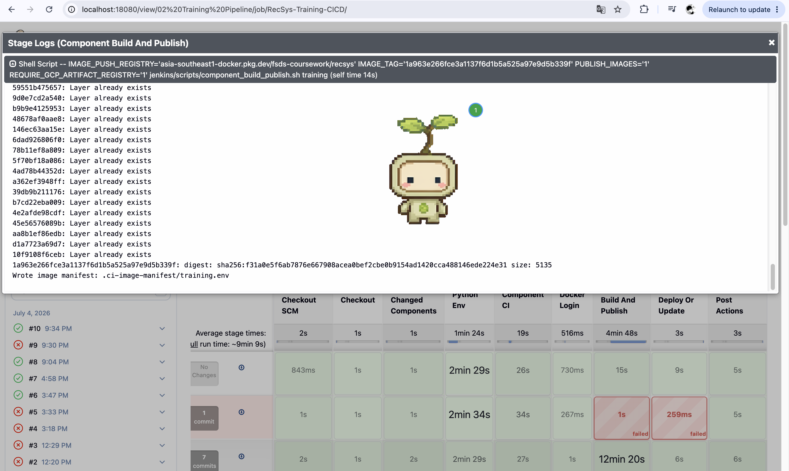

**Figure: Training Pipeline Build proof.** Capture Jenkins
`Component Build And Publish` with the image-order markers, scan policy result,
immutable digest manifest and final KFP compile/validation markers.

**Deploy:** Jenkins deploys the selected MLflow, Kubeflow package, data-config,
Airflow and rollout consumers according to the release graph. The previously
compiled YAML is uploaded; deploy does not compile it again and does not create
a workflow run
([KFP deploy unit](../../../jenkins/config/deploy-units.json#L205-L232),
[`upload_kfp_package.sh`](../../../jenkins/scripts/deploy/upload_kfp_package.sh#L24-L36)).

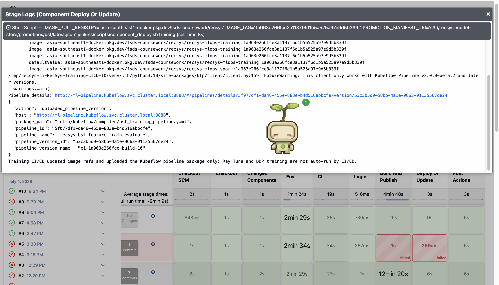

**Figure: Training Pipeline Deploy proof.** Capture Jenkins
`Component Deploy Or Update` showing KFP package upload, MLflow health and
verification that the uploaded pipeline/version exists
([training verification](../../../jenkins/scripts/test/ml_platform.sh#L3-L34)).

### Data Pipeline 1 - Source Data To Raw/Bronze

**Jenkins component:** `dp1`

**Jenkins UI label:** `DP1 Raw To Bronze`

**Strategy:** run this CI/CD branch when raw ingestion, synthetic data
generation, source Postgres/CDC, Kafka topic, Debezium, Kafka Connect, or raw
Airflow paths change. The authoritative rules include
`apps/data-platform/data-generator/`, `apps/data-platform/src/ingest/`, the
split data-lakehouse/source-store charts, the four
`configs/data-platform/generator/*.yaml` scenarios,
`configs/data-platform/spark/dp1.yaml`, and
`recsys_dp1_raw_to_bronze.py`
([component mapping](../../../jenkins/config/components.json)).

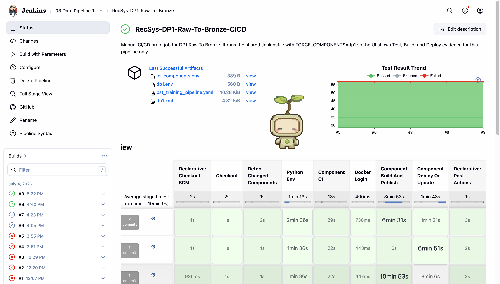

**Test:** `component_ci.sh dp1` runs data-generator unit tests, ingest tests,
data-platform tests, Docker/dataflow contract tests, any matching integration
suite that exists, and coverage for `ingest.debezium` and
`ingest.batch_lakehouse_ingestion`.

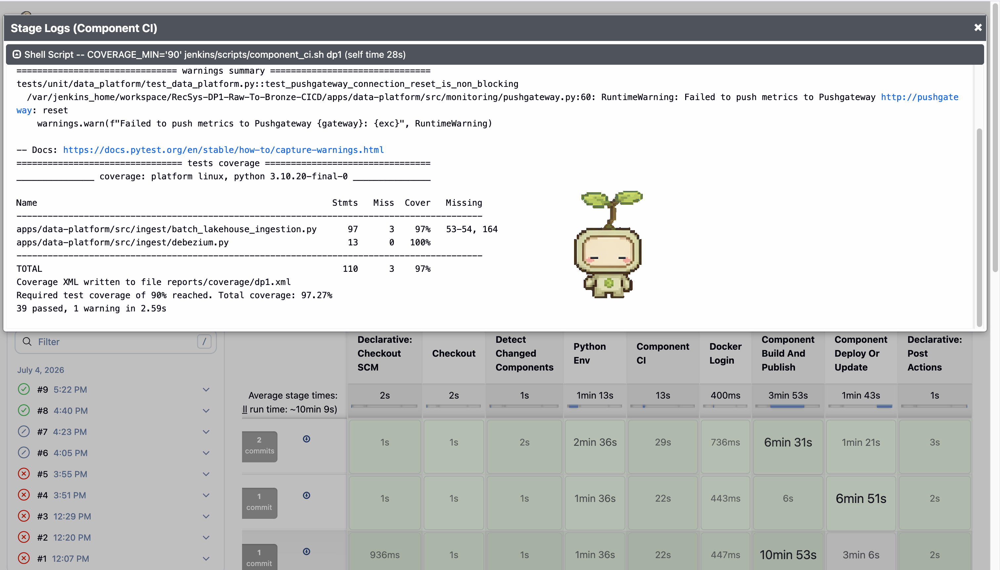

**Figure: DP1 Test proof.** Capture Jenkins `Component CI > DP1 Raw To Bronze`
showing generator/ingest tests and coverage.

**Build:** the release plan requests `recsys-spark`,
`recsys-data-ingestion`, `recsys-kafka-connect`, and `recsys-airflow`; the
catalog adds `recsys-base-python` before its dependent. Each image is built,
scanned, and optionally published once
([component mapping](../../../jenkins/config/components.json),
[build entrypoint](../../../jenkins/scripts/entrypoints/release_build_publish.sh)).

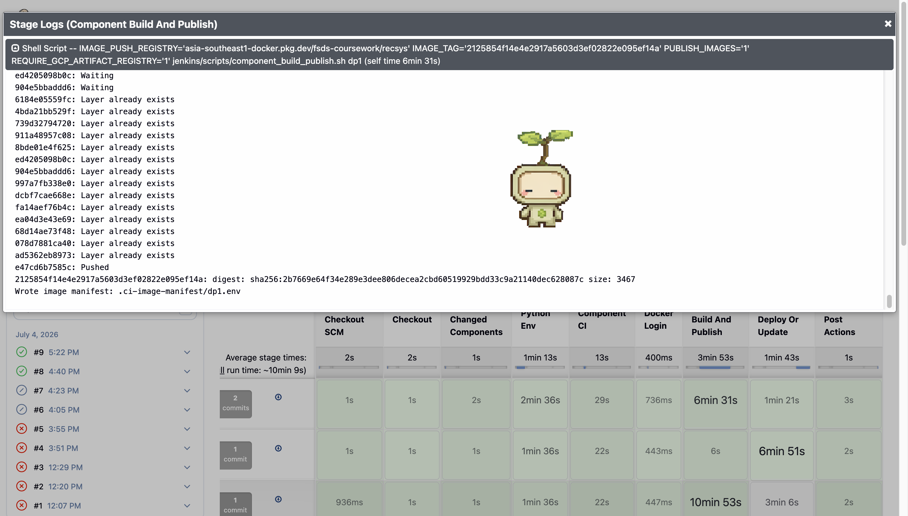

**Figure: DP1 Build proof.** Capture Jenkins
`Component Build And Publish` with the DP1 image order, scan result, and digest
manifest.

**Deploy:** the plan selects the split data-config, lakehouse, source-store,
event-stream, Kafka Connect, streaming, and Airflow units required by component
ownership and image consumers. Each Helm unit receives digest-pinned images and
is upgraded atomically in dependency order
([deploy-unit graph](../../../jenkins/config/deploy-units.json),
[deploy entrypoint](../../../jenkins/scripts/entrypoints/release_deploy_unit.sh)).

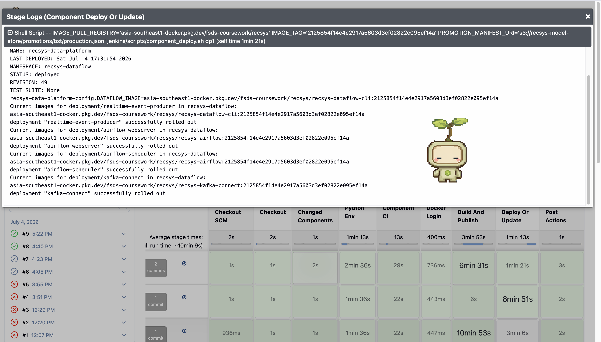

**Figure: DP1 Deploy proof.** Capture Jenkins
`Component Deploy Or Update > DP1 Raw To Bronze` showing the Helm upgrade for
source ingestion and CDC runtimes.

### Data Pipeline 2 - Bronze To Silver/Gold

**Jenkins component:** `dp2`

**Jenkins UI label:** `DP2 Bronze To Silver Gold`

**Strategy:** run this CI/CD branch when Spark silver/gold transforms, batch
feature DAGs, Spark batch config, lakehouse code, or Spark runtime image paths
change, especially `dp2_silver_gold_entrypoint.py`,
`build_silver_tables.py`, `recsys_dp2_bronze_to_silver_gold.py`,
`configs/data-platform/spark/dp2.yaml`, lakehouse/shared Spark utilities, and
their tests
([component mapping](../../../jenkins/config/components.json)).

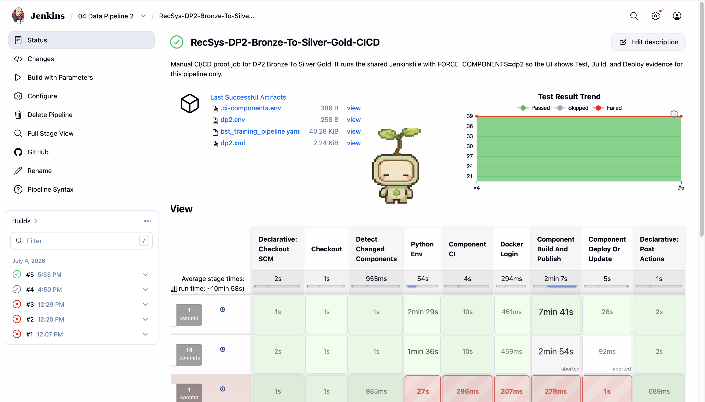

**Test:** `component_ci.sh dp2` runs data-platform tests, Docker/dataflow
contract tests, any matching integration suite that exists, and coverage for
`lakehouse.iceberg`.

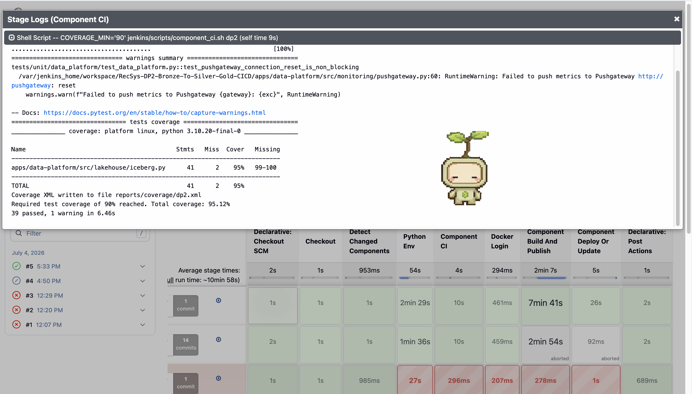

**Figure: DP2 Test proof.** Capture Jenkins
`Component CI > DP2 Bronze To Silver Gold` showing Spark/lakehouse tests and
coverage.

**Build:** the release plan requests `recsys-spark` and `recsys-airflow`. The
catalog/build engine builds, scans, and optionally publishes each once.

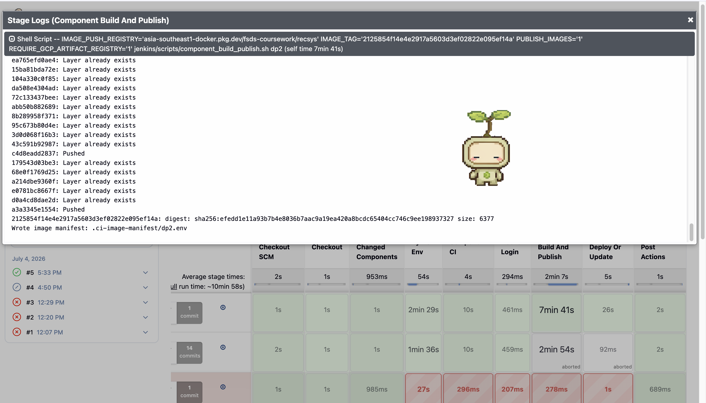

**Figure: DP2 Build proof.** Capture Jenkins
`Component Build And Publish > DP2 Bronze To Silver Gold` with Spark and Airflow
images pushed.

**Deploy:** image consumers select the independently owned data-config and
Airflow units as needed; Jenkins applies digest-pinned values with atomic Helm
upgrades and verifies only the DP2 registration/health contract.

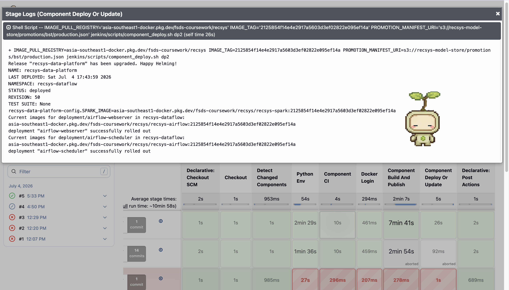

**Figure: DP2 Deploy proof.** Capture Jenkins
`Component Deploy Or Update > DP2 Bronze To Silver Gold` showing the Helm update
for batch transform runtimes.

### Data Pipeline 3 - Silver/Gold To Offline Feature Table

**Jenkins component:** `dp3`

**Jenkins UI label:** `DP3 Offline Feature Table`

**Strategy:** run this CI/CD branch when offline feature builders, training
table preparation, Feast/PostgreSQL offline-store export, DP3 Airflow DAG, or
offline feature table config changes, especially
`apps/data-platform/src/feature_store/`, `apps/data-platform/src/features/spark/`,
`apps/ml-system/src/cli/prepare_bst_training_data.py`,
`tests/unit/ml_system/test_prepare_bst_training_data.py`, and
`recsys_dp3_offline_feature_table.py`. Exact inclusions/exclusions live in
[`components.json`](../../../jenkins/config/components.json).

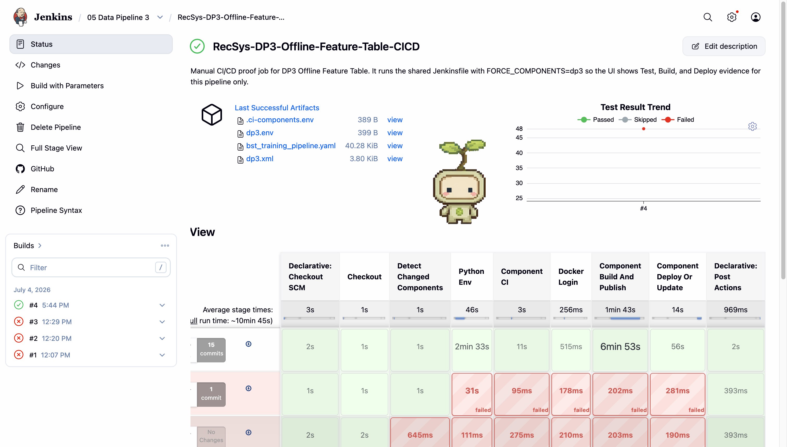

**Test:** `component_ci.sh dp3` runs data-platform tests, BST training-data prep
tests, Docker/dataflow contract tests, any matching integration suite that exists, and
coverage for `lakehouse.iceberg` and `feature_store.online_writer`.

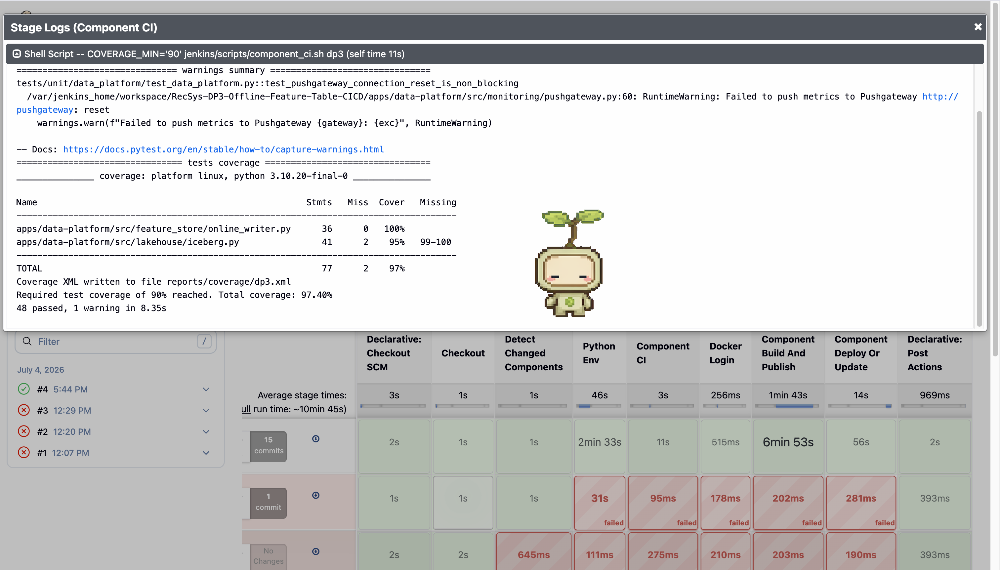

**Figure: DP3 Test proof.** Capture Jenkins
`Component CI > DP3 Offline Feature Table` showing offline feature table and BST
training-data tests.

**Build:** the release plan requests `recsys-spark`,
`recsys-feature-store`, and `recsys-airflow`; the catalog adds the shared
Python base where required. Every image is built/scanned/published once.

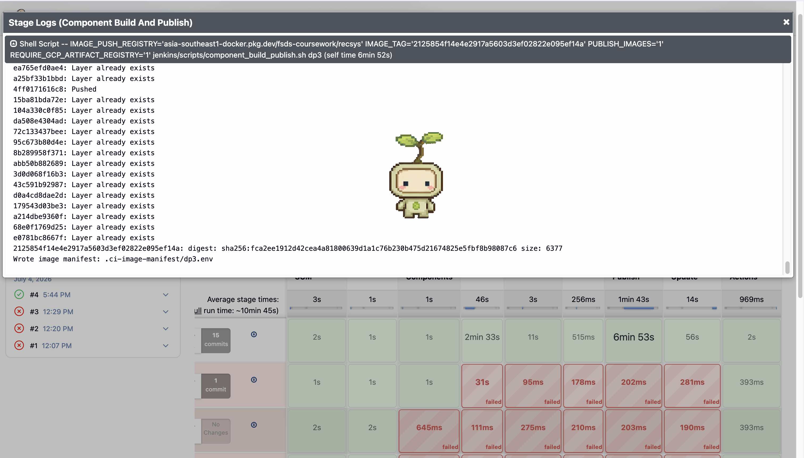

**Figure: DP3 Build proof.** Capture Jenkins
`Component Build And Publish` with Spark, feature-store, and Airflow image
digests.

**Deploy:** the release graph selects feature-store/data-config/Airflow
consumers as required, applies them in dependency layers, then verifies the DP3
DAG registration. Deployment verification does not start a production DP3 run.

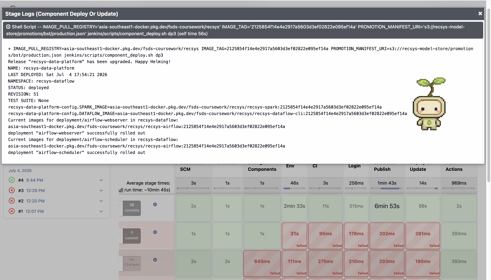

**Figure: DP3 Deploy proof.** Capture Jenkins
`Component Deploy Or Update > DP3 Offline Feature Table` showing the offline
feature table runtime update.

## CI/CD For APIs

### Triton Inference Engine

**Jenkins component:** `kserve`

**Jenkins UI label:** `KServe Inference Engine`

**Strategy:** run this CI/CD branch when Triton/KServe serving chart, model
promotion, model CD script, or serving contract paths change, especially
`infra/helm/recsys-serving/`, `apps/ml-system/src/registry/model_promotion.py`,
`jenkins/python/model_cd/cli.py`, `tests/unit/ml_system/test_model_promotion.py`,
and `tests/contract/test_serving_contracts.py`.

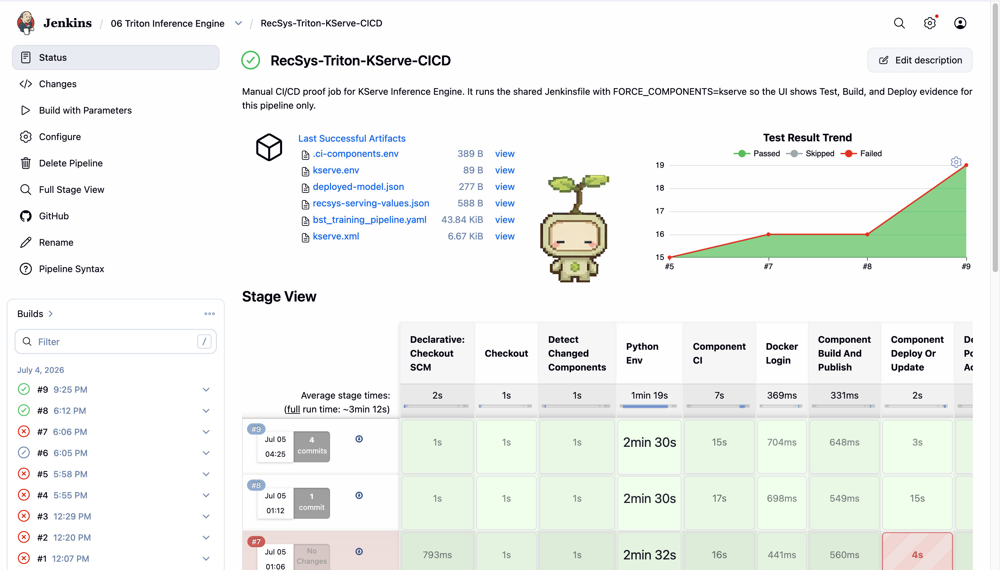

**Production deployment boundary:** this CI/CD branch validates the promoted
Triton manifest and serving chart when KServe-related code changes. It does not
own the automatic production model deploy after training. The production model
deploy is owned by the post-promotion Jenkins job `RecSys-KServe-Model-CD`,
documented below.

**Test:** `component_ci.sh kserve` runs model promotion tests, serving contract
tests, any matching integration suite that exists, and coverage for `model_cd`.

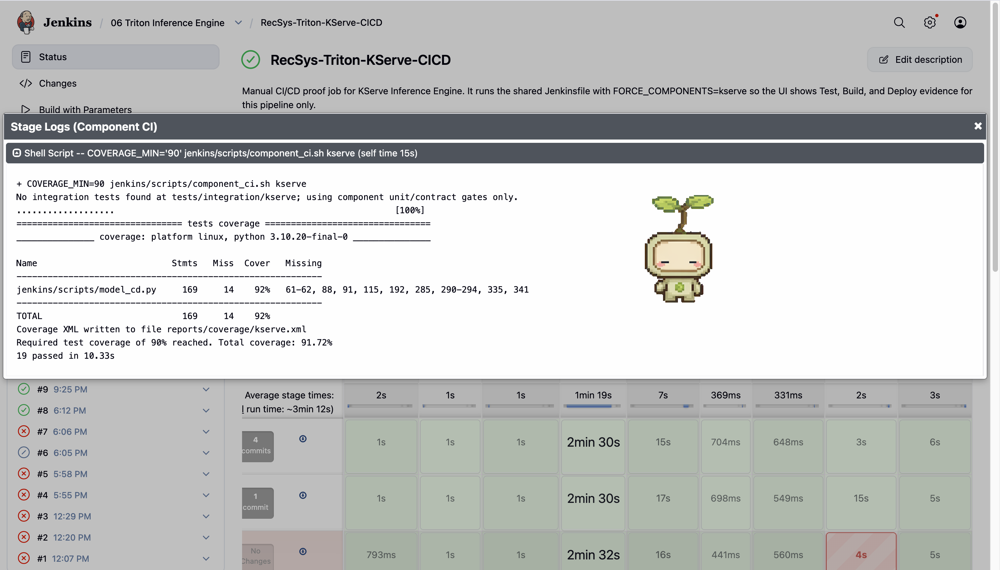

**Figure: Triton Inference Engine Test proof.** Capture Jenkins
`Component CI > KServe Inference Engine` showing promotion and serving contract
tests.

**Build:** `kserve` has no container-image or compiled-artifact build in the
path-based release plan. Its model repository and promotion manifest are
produced by the ML pipeline/model lifecycle, not by this component CI stage.

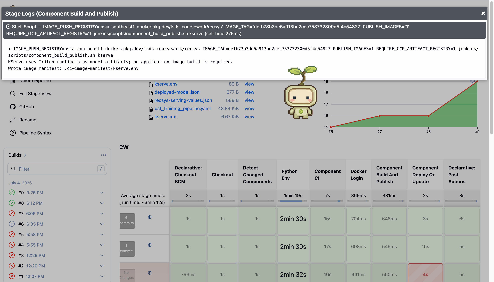

**Figure: Triton Inference Engine Build proof.** Capture Jenkins
`Component Build And Publish > KServe Inference Engine` showing that KServe uses
the Triton runtime and promoted model artifacts instead of a custom app image.

**Deploy:** the `serving` unit invokes the current model-CD module through
[`deploy_kserve()`](../../../jenkins/scripts/deploy/serving.sh#L28), validates
the model repository, renders the serving values, and verifies KServe/Triton
readiness
([deploy-unit mapping](../../../jenkins/config/deploy-units.json)).

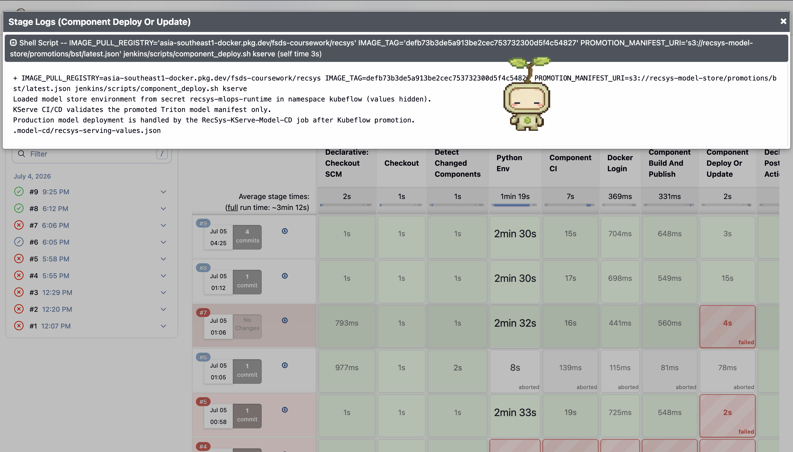

**Figure: Triton Inference Engine Deploy proof.** Capture Jenkins
`Component Deploy Or Update > KServe Inference Engine` showing the manifest URI,
KServe Helm upgrade, and `InferenceService` readiness.

### Post-Promotion KServe Model CD After Training Or Retraining

**Jenkins job:** `RecSys-KServe-Model-CD`

**Jenkins view:** `06A KServe Model CD`

**Trigger strategy:** this is not a path-based CI/CD branch. It is a post-model
promotion CD job. A normal Kubeflow training run or an observability-triggered
Kubeflow retraining run executes the same BST KFP pipeline. After
`promote-bst-model` writes a promotion manifest, the next KFP step
`Trigger KServe CD` checks the promotion score against
`kserve_cd_score_threshold` and triggers Jenkins only when the score passes.
The current default threshold is `0.05`, so a candidate must have
`test_ndcg_at_10 >= 0.05` before the handoff can proceed.

**End-to-end flow:**

```text
Kubeflow training/retraining pipeline
  -> Ray Tune
  -> Ray Train DDP
  -> evaluate-bst
  -> promote-bst-model
  -> Trigger KServe CD
  -> Jenkins RecSys-KServe-Model-CD
  -> jenkins/python/model_cd/cli.py --apply
  -> Helm upgrade recsys-serving
  -> KServe/Triton rolling update
```

**Runtime inputs:** the KFP trigger passes `PROMOTION_MANIFEST_URI`,
`MODEL_VERSION`, `METRIC_NAME`, `METRIC_VALUE`, and `TRIGGER_SOURCE` to Jenkins.
The Jenkins job loads model-store credentials from the runtime secret, reads the
promotion manifest, verifies required Triton repository files, renders
`.model-cd/recsys-serving-values.json`, then applies the KServe/Triton serving
release.

**Code reference:**

- [bst_training_pipeline.py (line 246)](../../../apps/ml-system/src/kubeflow/pipelines/bst_training_pipeline.py#L246), [bst_training_pipeline.py (line 274)](../../../apps/ml-system/src/kubeflow/pipelines/bst_training_pipeline.py#L274): defines the `trigger_kserve_model_cd` KFP component.
- [bst_training_pipeline.py (line 267)](../../../apps/ml-system/src/kubeflow/pipelines/bst_training_pipeline.py#L267), [bst_training_pipeline.py (line 284)](../../../apps/ml-system/src/kubeflow/pipelines/bst_training_pipeline.py#L284): sets the default promotion score threshold to `0.05`.
- [bst_training_pipeline.py (line 441)](../../../apps/ml-system/src/kubeflow/pipelines/bst_training_pipeline.py#L441), [bst_training_pipeline.py (line 469)](../../../apps/ml-system/src/kubeflow/pipelines/bst_training_pipeline.py#L469): wires the KServe CD handoff after `promote-bst-model`.
- [trigger_kserve_cd.py (line 299)](../../../apps/ml-system/src/cli/trigger_kserve_cd.py#L299), [trigger_kserve_cd.py (line 382)](../../../apps/ml-system/src/cli/trigger_kserve_cd.py#L382): loads the promotion manifest, checks the metric gate, and triggers Jenkins.
- [trigger_kserve_cd.py (line 191)](../../../apps/ml-system/src/cli/trigger_kserve_cd.py#L191), [trigger_kserve_cd.py (line 268)](../../../apps/ml-system/src/cli/trigger_kserve_cd.py#L268): posts the Jenkins build parameters for `RecSys-KServe-Model-CD`.
- [KServeModelCD.Jenkinsfile (line 1)](../../../jenkins/KServeModelCD.Jenkinsfile#L1), [KServeModelCD.Jenkinsfile (line 137)](../../../jenkins/KServeModelCD.Jenkinsfile#L137): defines the dedicated post-promotion Jenkins CD job.
- [model_cd_deploy.sh (line 1)](../../../jenkins/scripts/entrypoints/model_cd_deploy.sh#L1), [serving.sh (line 41)](../../../jenkins/scripts/deploy/serving.sh#L41): loads the production model-CD runtime and invokes `jenkins.python.model_cd.cli` with `--apply`.
- [jenkins-init-configmap.yaml (line 317)](../../../infra/helm/recsys-ci/templates/jenkins-init-configmap.yaml#L317), [jenkins-init-configmap.yaml (line 403)](../../../infra/helm/recsys-ci/templates/jenkins-init-configmap.yaml#L403): seeds the Jenkins job and the `06A KServe Model CD` view.


**Proof to capture:** capture the Jenkins view `06A KServe Model CD` after a
Kubeflow training or retraining run. The proof should show `RecSys-KServe-Model-CD`
running after the Kubeflow promotion step, Jenkins parameters containing the
promotion manifest and metric, successful `.model-cd` artifacts
(`deployed-model.json`, `recsys-serving-values.json`), and the final KServe
rolling update success.

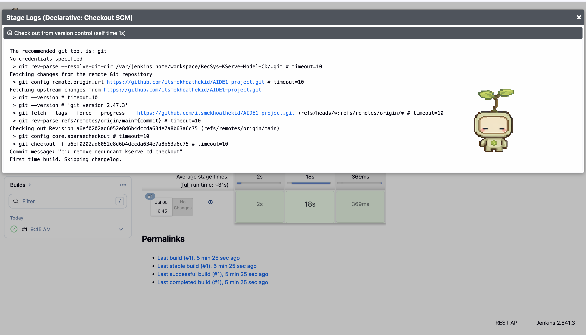

**Figure: KServe Model CD Declarative Checkout SCM proof.** Capture the Jenkins
stage log for `Declarative: Checkout SCM` showing Jenkins checking out commit
`a6ef020` from `main` and loading `jenkins/KServeModelCD.Jenkinsfile` from SCM.
This proves the post-promotion CD job runs from the version-controlled pipeline
definition after the redundant manual `Checkout` stage was removed.

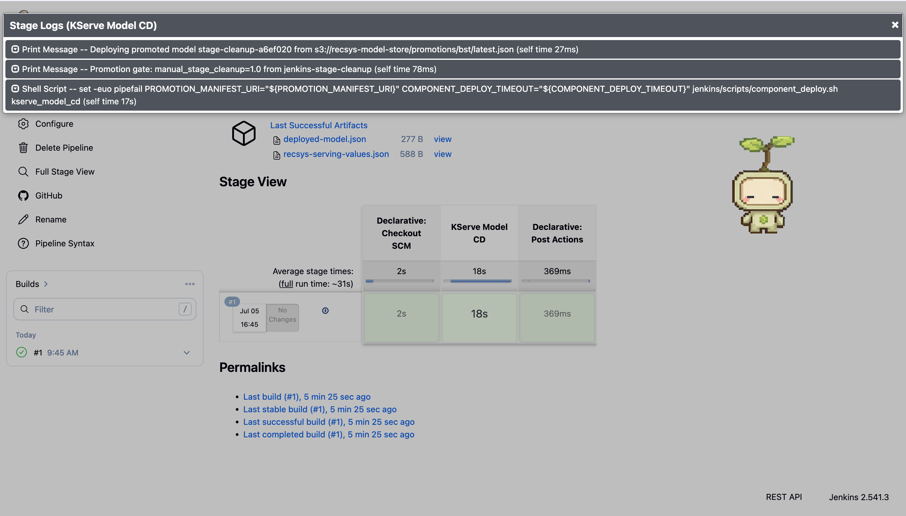

**Figure: KServe Model CD stage proof.** Capture the Jenkins stage log for
`KServe Model CD` showing the promoted model manifest, metric gate, Helm upgrade
of `recsys-serving`, `InferenceService` readiness, predictor rollout success,
and archived `.model-cd` artifacts.

### FastAPI For Online Features And Model Serving

**Jenkins component:** `api`

**Jenkins UI label:** `FastAPI Web API`

**Strategy:** run this CI/CD branch when API-serving source, ranking logic,
online feature client, A/B testing, API schemas, Triton client, serving chart, or
API tests change, especially `apps/api-serving/`,
`infra/helm/recsys-serving/`, `tests/unit/api_serving/`,
`tests/contract/test_serving_contracts.py`, and
`tests/contract/test_gateway_contracts.py`.

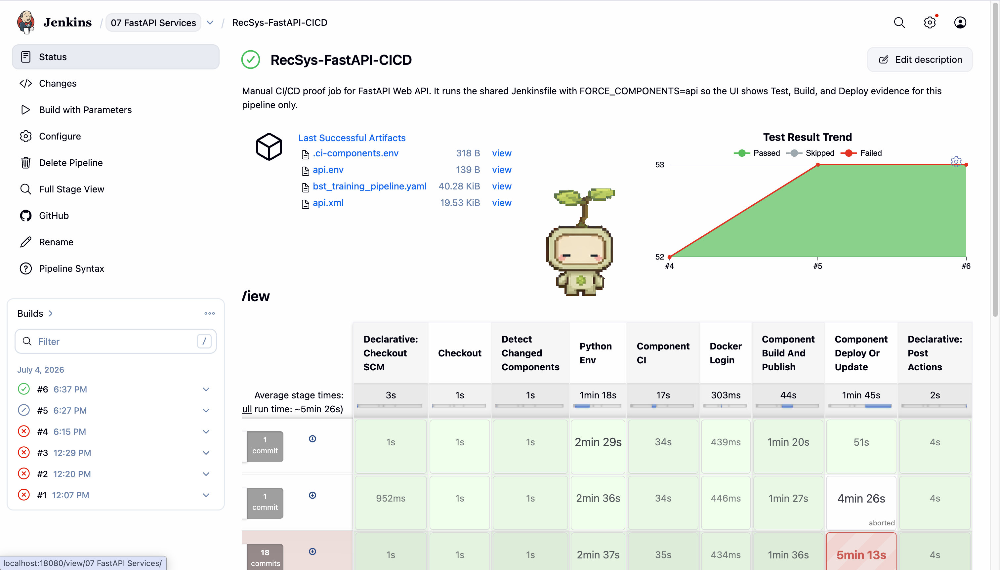

**Test:** `component_ci.sh api` runs API unit tests, serving contracts, gateway
contracts, any matching integration suite that exists, and coverage for the FastAPI,
online feature API, ranking, A/B, and Triton client modules.

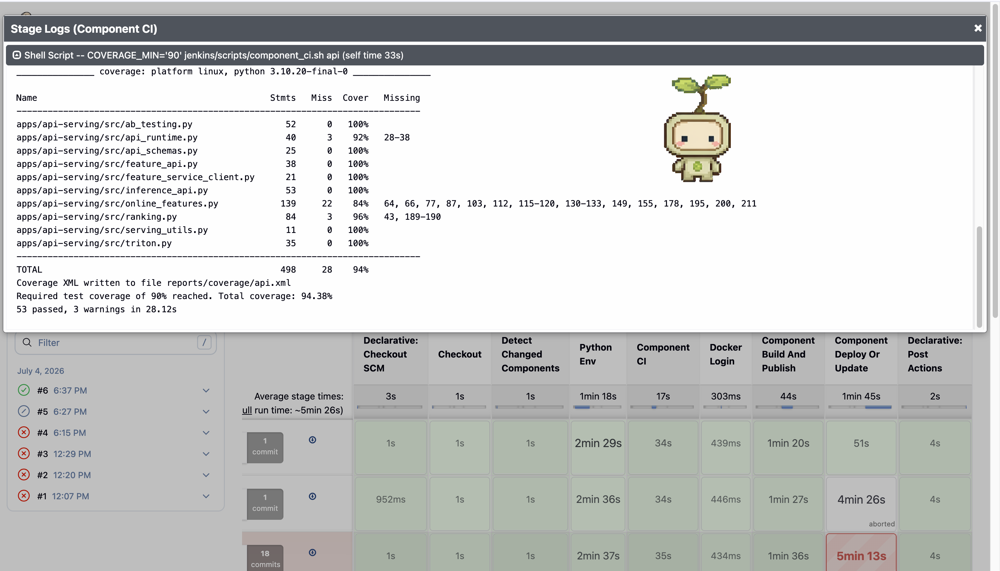

**Figure: FastAPI Test proof.** Capture Jenkins `Component CI > FastAPI Web API`
showing API unit/contract tests and coverage above the threshold.

**Build:** the release plan builds, scans, and optionally publishes
`recsys-api-serving:<git_commit>`, then resolves its immutable digest.

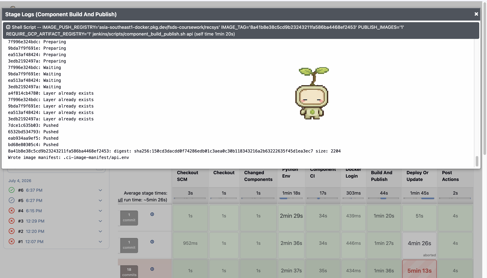

**Figure: FastAPI Build proof.** Capture Jenkins
`Component Build And Publish > FastAPI Web API` showing Docker build/push and
the release image manifest.

**Deploy:** the `serving` deploy unit calls
[`deploy_api()`](../../../jenkins/scripts/deploy/serving.sh#L3), upgrades
`recsys-serving` atomically, updates both `api.image` and
`featureApi.image` with the resolved digest, then waits for
`recsys-api-serving` and `recsys-online-feature-api` rollouts.

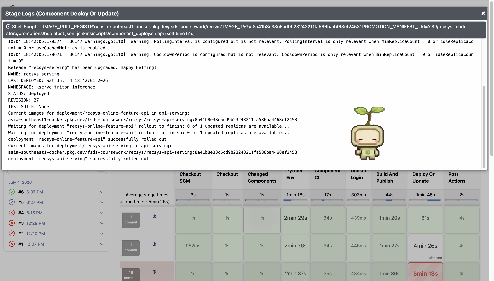

**Figure: FastAPI Deploy proof.** Capture Jenkins
`Component Deploy Or Update > FastAPI Web API` showing the Helm update and
rollout status for both FastAPI services.

## CI/CD For Jobs

### Job 1 - Push Stream Feature To OFFLINE Store

**Jenkins component:** `stream_offline`

**Jenkins UI label:** `Stream Features To Offline Store`

**Strategy:** run this CI/CD branch when Flink streaming jobs, Kafka realtime
processing code, offline feature sink logic, Flink Dockerfile, or streaming DAG
paths change, especially `apps/data-platform/src/features/flink/`,
`apps/data-platform/src/feature_store/`,
`apps/data-platform/flink-runtime-pom.xml`, shared lakehouse code, and the
split streaming/feature-store releases
([component mapping](../../../jenkins/config/components.json)).

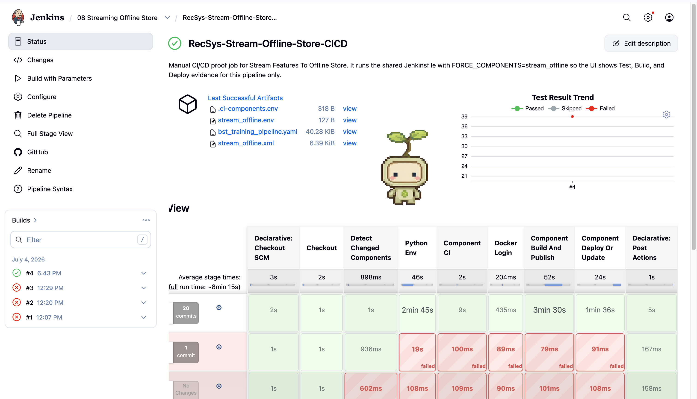

**Test:** `component_ci.sh stream_offline` runs data-platform tests,
Docker/dataflow contract tests, any matching integration suite that exists, and
coverage for the Flink job modules plus the offline sink/lakehouse code.

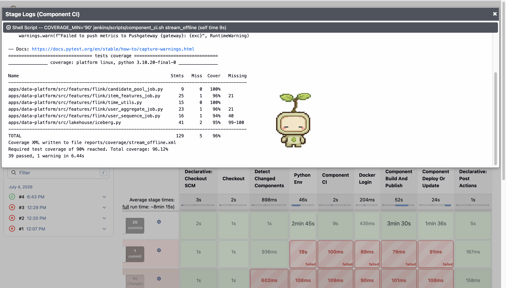

**Figure: Stream Offline Test proof.** Capture Jenkins
`Component CI > Stream Features To Offline Store` showing Flink/offline sink
tests and coverage.

**Build:** the release plan builds, scans, and optionally publishes
`recsys-flink:<git_commit>` once, then resolves its digest.

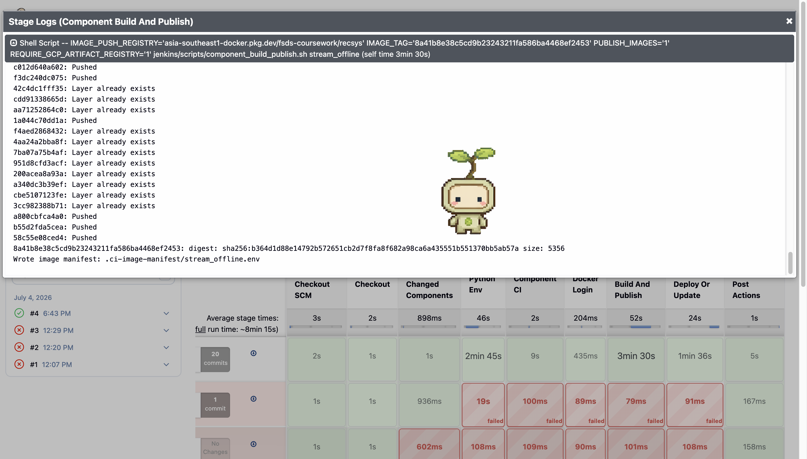

**Figure: Stream Offline Build proof.** Capture Jenkins
`Component Build And Publish > Stream Features To Offline Store` showing Flink
image build/push.

**Deploy:** the selected `streaming` unit upgrades
`recsys-streaming`, injects the `images.flink` digest, and rolls the continuous
offline and online Flink submitter workloads together because both jobs share
one image and one Helm release. Verification requires both jobs to be running
([stream verification](../../../jenkins/scripts/test/data_platform.sh#L52)).

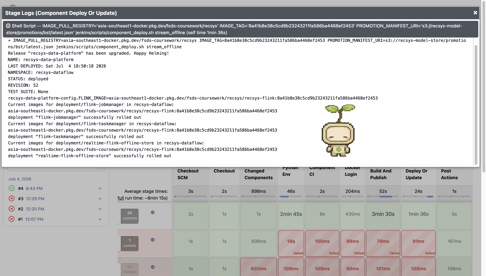

**Figure: Stream Offline Deploy proof.** Capture Jenkins
`Component Deploy Or Update > Stream Features To Offline Store` showing the Helm
upgrade for the continuous Kafka-to-offline-store Flink job.

### Job 2 - Push Stream Feature To ONLINE Store

**Jenkins component:** `stream_online`

**Jenkins UI label:** `Stream Features To Online Store`

**Strategy:** run this CI/CD branch when Flink streaming jobs, Redis online
writer logic, online feature sink code, realtime API interaction, Flink
Dockerfile, or Redis online-store config changes, especially
`apps/data-platform/src/features/flink/`,
`apps/data-platform/src/feature_store/online_writer.py`,
`apps/data-platform/flink-runtime-pom.xml`, and the shared
streaming/feature-store release groups
([component mapping](../../../jenkins/config/components.json)).

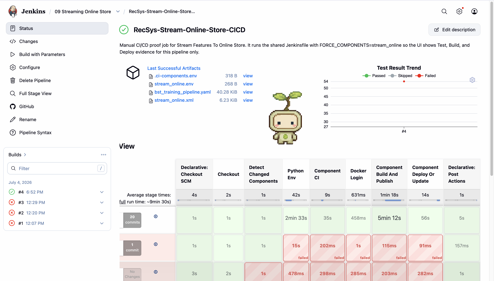

**Test:** `component_ci.sh stream_online` runs data-platform tests, selected API
serving tests, Docker/dataflow contract tests, any matching integration suite
that exists, and coverage for Flink job modules plus
`feature_store.online_writer`.

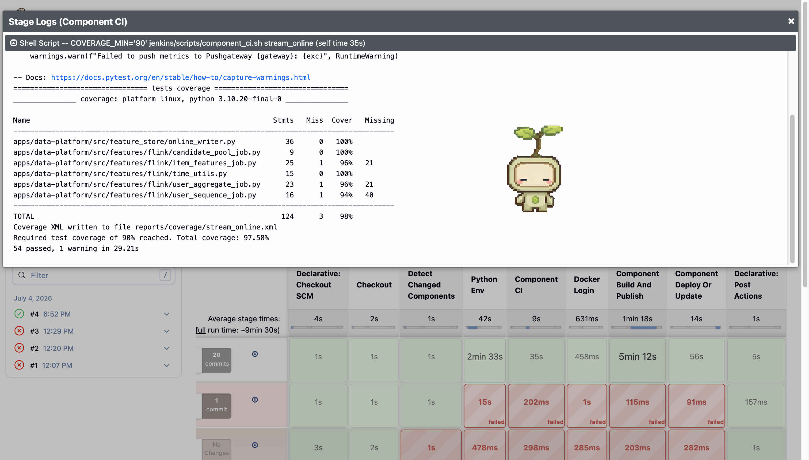

**Figure: Stream Online Test proof.** Capture Jenkins
`Component CI > Stream Features To Online Store` showing Flink/Redis online
writer tests and coverage.

**Build:** the release plan builds, scans, and optionally publishes only
`recsys-flink:<git_commit>`; the retired `recsys-dataflow-cli` image is not part
of the 15-image catalog.

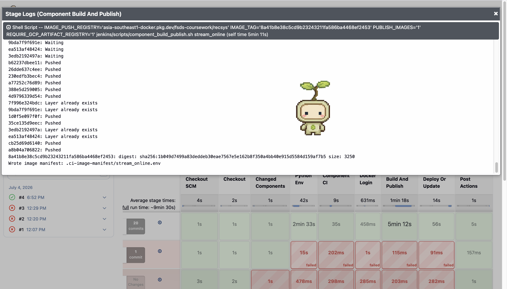

**Figure: Stream Online Build proof.** Capture Jenkins
`Component Build And Publish` showing the Flink image scan, publication, and
resolved digest.

**Deploy:** the same split `recsys-streaming` release receives the Flink digest
and rolls both continuous submitters. The component-specific verification
checks Debezium, two running Flink jobs, Redis, and Feast PostgreSQL health.

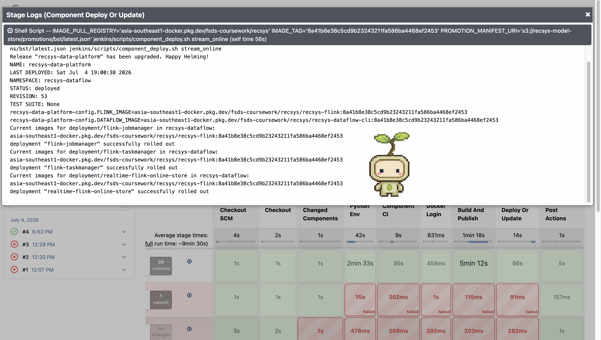

**Figure: Stream Online Deploy proof.** Capture Jenkins
`Component Deploy Or Update > Stream Features To Online Store` showing the Helm
upgrade for the continuous Kafka-to-Redis online-store Flink job.
