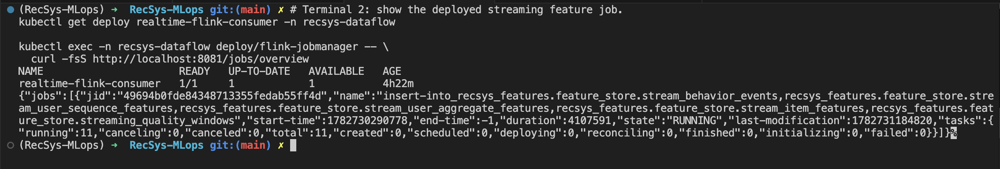
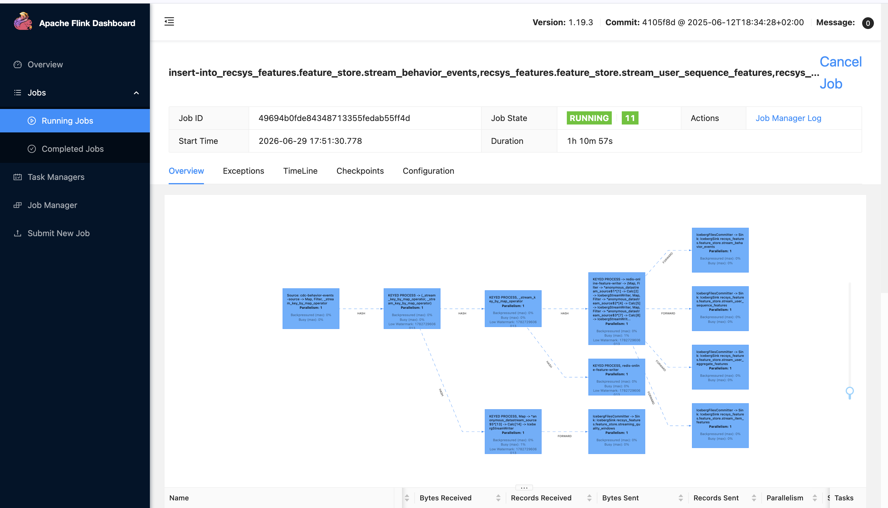
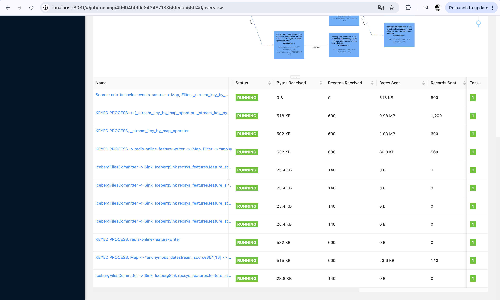
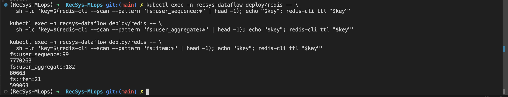

# Feature Store

## Data Pipeline And Incremental Materialize

Code reference:

- [apps/data-platform/src/orchestration/airflow/dags/k8s_data_platform_dag.py line 168](../../../apps/data-platform/src/orchestration/airflow/dags/k8s_data_platform_dag.py#168): generates historical raw files into the lake bucket.
- [apps/data-platform/src/orchestration/airflow/dags/k8s_data_platform_dag.py line 176](../../../apps/data-platform/src/orchestration/airflow/dags/k8s_data_platform_dag.py#176): ingests historical raw data into the lakehouse.
- [apps/data-platform/src/orchestration/airflow/dags/k8s_data_platform_dag.py line 196](../../../apps/data-platform/src/orchestration/airflow/dags/k8s_data_platform_dag.py#196): runs Spark batch materialization into the offline feature store.
- [apps/data-platform/src/orchestration/airflow/dags/k8s_data_platform_dag.py line 205](../../../apps/data-platform/src/orchestration/airflow/dags/k8s_data_platform_dag.py#205): runs Feast `materialize-incremental` after offline feature tables are written.
- [apps/data-platform/feature-store/feature_repo/feature_store.yaml line 1](../../../apps/data-platform/feature-store/feature_repo/feature_store.yaml#1): Feast project, offline store, and Redis online store configuration.
- [apps/data-platform/feature-store/feature_repo/features.py line 33](../../../apps/data-platform/feature-store/feature_repo/features.py#33): Feast `user_aggregate_features` FeatureView.
- [apps/data-platform/feature-store/feature_repo/features.py line 52](../../../apps/data-platform/feature-store/feature_repo/features.py#52): Feast `item_features` FeatureView.
- [apps/data-platform/src/orchestration/airflow/dags/k8s_data_platform_dag.py line 271](../../../apps/data-platform/src/orchestration/airflow/dags/k8s_data_platform_dag.py#271): defines `run_spark_batch_to_offline_store -> feast_materialize_incremental`.

Running command:

```bash
cd /Users/KHOAI/anhkhoa/RecSys-MLops

make cluster-data-setup

# Keep this terminal open for Airflow UI access.
kubectl port-forward -n recsys-dataflow svc/airflow-webserver 8080:8080
```

Open Airflow UI at `http://localhost:8080`, login with `admin/admin`

Description of output when running command:

- `make cluster-data-setup` starts the data platform stack, triggers `k8s_data_platform_dag`, waits for the DAG run, and verifies feature stores.
- Airflow Graph view demonstrates the pipeline stage order: platform initialization, historical batch ingestion, Spark offline feature materialization, Feast incremental materialization, realtime CDC load, Flink streaming feature-store sync, drift check, retrain trigger, and governance ingest.
- The important proof for this rubric is `run_spark_batch_to_offline_store -> feast_materialize_incremental`: Spark writes the latest feature tables to the offline store, then Feast runs `feast apply` and `feast materialize-incremental <end_datetime>`.
- This follows the Feast incremental materialize pattern: Feast uses the registry materialization state to infer the start time and only loads feature rows up to the requested end time into the Redis online store.

### Image proof of Airflow data pipelines overview


### Image proof of Incremental materialize data from offline to online store


## One Running Streaming Feature Store Job With Two Sink Paths On UI

Code reference:

- [infra/helm/recsys-data-platform/templates/realtime-flink-consumer.yaml line 19](../../../infra/helm/recsys-data-platform/templates/realtime-flink-consumer.yaml#19): deploys the streaming feature consumer job.
- [infra/helm/recsys-data-platform/templates/realtime-flink-consumer.yaml line 39](../../../infra/helm/recsys-data-platform/templates/realtime-flink-consumer.yaml#39): enables the offline feature-store sink for the streaming job.
- [apps/data-platform/src/features/flink/realtime_stream_job.py line 483](../../../apps/data-platform/src/features/flink/realtime_stream_job.py#483): Redis online feature writer.
- [apps/data-platform/src/features/flink/realtime_stream_job.py line 735](../../../apps/data-platform/src/features/flink/realtime_stream_job.py#735): names the online sink `redis-online-feature-writer`.
- [apps/data-platform/src/features/flink/realtime_stream_job.py line 779](../../../apps/data-platform/src/features/flink/realtime_stream_job.py#779): writes streaming behavior events to the Iceberg offline feature store.
- [apps/data-platform/src/features/flink/realtime_stream_job.py line 781](../../../apps/data-platform/src/features/flink/realtime_stream_job.py#781): writes streaming user sequence features to the Iceberg offline feature store.
- [apps/data-platform/src/features/flink/realtime_stream_job.py line 791](../../../apps/data-platform/src/features/flink/realtime_stream_job.py#791): writes streaming user aggregate features to the Iceberg offline feature store.
- [apps/data-platform/src/features/flink/realtime_stream_job.py line 801](../../../apps/data-platform/src/features/flink/realtime_stream_job.py#801): writes streaming item features to the Iceberg offline feature store.
- [apps/data-platform/src/features/flink/realtime_stream_job.py line 817](../../../apps/data-platform/src/features/flink/realtime_stream_job.py#817): writes streaming quality windows to the Iceberg offline feature store.

Running command:

```bash
cd /Users/KHOAI/anhkhoa/RecSys-MLops

# Terminal 1: keep open for Flink UI.
kubectl port-forward -n recsys-dataflow svc/flink-jobmanager 8081:8081

# Terminal 2: show the deployed streaming feature job and its Flink job id.
kubectl get deploy realtime-flink-consumer -n recsys-dataflow

kubectl exec -n recsys-dataflow deploy/flink-jobmanager -- \
  curl -fsS http://localhost:8081/jobs/overview
```

Open Flink UI at `http://localhost:8081/#/job/running/<job_id>/overview`, using the `jid` from `jobs/overview`.

Description of output when running command:

- This proof shows one deployed Flink streaming job that contains two feature-store sink paths.
- The offline-store sink path writes Iceberg tables: `stream_behavior_events`, `stream_user_sequence_features`, `stream_user_aggregate_features`, `stream_item_features`, and `streaming_quality_windows`.
- The online-store sink path is named `redis-online-feature-writer`: it writes fresh streaming feature keys to Redis.
- The Flink UI and `jobs/overview` output should show the single streaming feature-store job in `RUNNING` state, with both Redis and Iceberg operators visible in the same job graph.

### Image proof of CLI running job



### Image proof of one streaming job with two sink paths



### Image proof of Flink operator names



### Flink UI Name descriptions

| Name in Flink UI | Description |
| --- | --- |
| `Source: cdc-behavior-events-source -> Map, Filter, _stream_key_by_map_operator` | Reads CDC behavior events from Kafka, parses and normalizes the payload, filters invalid records, and keys the stream for downstream feature processing. |
| `KEYED PROCESS -> (_stream_key_by_map_operator, _stream_key_by_map_operator)` | Deduplicates events by `event_id` and fans out the validated stream into feature-building and quality-monitoring branches. |
| `KEYED PROCESS, _stream_key_by_map_operator` | Builds keyed user-level features from the deduplicated behavior stream, such as sequence and aggregate feature inputs. |
| `KEYED PROCESS -> redis-online-feature-writer -> ... IcebergStreamWriter` | Builds item-level features, writes fresh online features through the Redis writer path, and converts records into Iceberg table rows for offline storage. |
| `KEYED PROCESS, redis-online-feature-writer` | Online feature-store writer path; writes fresh streaming feature values to Redis for low-latency serving. |
| `IcebergFilesCommitter -> Sink: IcebergSink ...stream_behavior_events` | Offline feature-store sink for cleaned streaming behavior events. |
| `IcebergFilesCommitter -> Sink: IcebergSink ...stream_user_sequence_features` | Offline feature-store sink for user sequence features, including recent interaction history payloads. |
| `IcebergFilesCommitter -> Sink: IcebergSink ...stream_user_aggregate_features` | Offline feature-store sink for user rolling aggregate counters such as recent views, carts, and purchases. |
| `IcebergFilesCommitter -> Sink: IcebergSink ...stream_item_features` | Offline feature-store sink for item popularity and item-level rolling features. |
| `KEYED PROCESS, Map -> *anonymous_datastream_source$5* -> Calc -> IcebergStreamWriter` | Builds streaming quality-window rows, including event count, late-event count, duplicate count, max lateness, and burst flag. |
| `IcebergFilesCommitter -> Sink: IcebergSink ...streaming_quality_windows` | Offline feature-store sink for streaming quality monitoring windows. |


## Streaming Features Pushed To Offline Store

Code reference:

- [apps/data-platform/src/features/flink/iceberg_feature_sink.py line 8](../../../apps/data-platform/src/features/flink/iceberg_feature_sink.py#8): defines Iceberg offline streaming feature table DDLs.
- [apps/data-platform/src/features/flink/iceberg_feature_sink.py line 80](../../../apps/data-platform/src/features/flink/iceberg_feature_sink.py#80): configures the Iceberg feature catalog and creates feature tables.
- [apps/data-platform/src/features/flink/realtime_stream_job.py line 781](../../../apps/data-platform/src/features/flink/realtime_stream_job.py#781): writes `stream_user_sequence_features`.
- [apps/data-platform/src/features/flink/realtime_stream_job.py line 791](../../../apps/data-platform/src/features/flink/realtime_stream_job.py#791): writes `stream_user_aggregate_features`.
- [apps/data-platform/src/features/flink/realtime_stream_job.py line 801](../../../apps/data-platform/src/features/flink/realtime_stream_job.py#801): writes `stream_item_features`.
- [infra/k8s/scripts/data_platform_verify_feature_stores.sh line 121](../../../infra/k8s/scripts/data_platform_verify_feature_stores.sh#121): verifies offline feature table metadata and data files.

Running command:

```bash
cd /Users/KHOAI/anhkhoa/RecSys-MLops

make data-platform-verify-e2e
```

Description of output when running command:

- The verification job checks that the offline Iceberg feature store contains metadata files and Parquet data files.
- The checked offline streaming tables are `stream_behavior_events`, `stream_user_sequence_features`, `stream_user_aggregate_features`, `stream_item_features`, and `streaming_quality_windows`.
- The JSON output should show each table with `metadata_files > 0` and `data_files > 0`.

### Image proof 


## Streaming Features Pushed To Online Store

Code reference:

- [apps/data-platform/src/feature_store/online_writer.py line 30](../../../apps/data-platform/src/feature_store/online_writer.py#30): Redis online writer used by the streaming job.
- [apps/data-platform/src/features/flink/realtime_stream_job.py line 483](../../../apps/data-platform/src/features/flink/realtime_stream_job.py#483): Redis writer operator class.
- [apps/data-platform/src/features/flink/realtime_stream_job.py line 498](../../../apps/data-platform/src/features/flink/realtime_stream_job.py#498): writes user sequence, user aggregate, and item payloads to Redis.
- [apps/data-platform/src/features/flink/realtime_stream_job.py line 735](../../../apps/data-platform/src/features/flink/realtime_stream_job.py#735): names the Redis online sink `redis-online-feature-writer`.
- [infra/k8s/scripts/data_platform_verify_feature_stores.sh line 76](../../../infra/k8s/scripts/data_platform_verify_feature_stores.sh#76): waits until Redis online feature keys exist.
- [infra/k8s/scripts/data_platform_verify_feature_stores.sh line 180](../../../infra/k8s/scripts/data_platform_verify_feature_stores.sh#180): prints Redis online feature key verification.

Running command:

```bash
cd /Users/KHOAI/anhkhoa/RecSys-MLops

kubectl exec -n recsys-dataflow deploy/redis -- \
  sh -lc 'redis-cli --scan --pattern "fs:user_sequence:*" | head'

kubectl exec -n recsys-dataflow deploy/redis -- \
  sh -lc 'redis-cli --scan --pattern "fs:user_aggregate:*" | head'

kubectl exec -n recsys-dataflow deploy/redis -- \
  sh -lc 'redis-cli --scan --pattern "fs:item:*" | head'

make data-platform-verify-e2e
```

Description of output when running command:

- The Redis commands show online feature keys created by the streaming Flink job.
- `fs:user_sequence:*` proves streaming user sequence features were pushed into the online store.
- `fs:user_aggregate:*` proves streaming user aggregate features were pushed into the online store.
- `fs:item:*` proves streaming item features were pushed into the online store.
- `make data-platform-verify-e2e` prints `Redis online feature keys detected: ...` and `Streaming feature stores verified.` when the online feature store proof passes.

### Image proof 


## Feature Columns And TTL

Code reference:

- [apps/data-platform/src/features/spark/build_user_sequence_features.py line 6](../../../apps/data-platform/src/features/spark/build_user_sequence_features.py#6): defines user sequence feature columns.
- [apps/data-platform/src/features/spark/build_user_aggregate_features.py line 26](../../../apps/data-platform/src/features/spark/build_user_aggregate_features.py#26): defines user aggregate feature columns.
- [apps/data-platform/src/features/spark/build_item_features.py line 49](../../../apps/data-platform/src/features/spark/build_item_features.py#49): defines item feature columns.
- [apps/data-platform/src/features/spark/spark_batch_entrypoint.py line 65](../../../apps/data-platform/src/features/spark/spark_batch_entrypoint.py#65): writes batch feature tables to the offline feature store.
- [apps/data-platform/src/features/spark/spark_batch_entrypoint.py line 109](../../../apps/data-platform/src/features/spark/spark_batch_entrypoint.py#109): writes Feast parquet mirror for offline-to-online materialization.
- [apps/data-platform/feature-store/feature_repo/features.py line 36](../../../apps/data-platform/feature-store/feature_repo/features.py#36): Feast TTL for `user_aggregate_features`.
- [apps/data-platform/feature-store/feature_repo/features.py line 55](../../../apps/data-platform/feature-store/feature_repo/features.py#55): Feast TTL for `item_features`.
- [configs/local/redis_online_store.yaml line 14](../../../configs/local/redis_online_store.yaml#14): documents native Redis TTL values for streaming online writer.
- [apps/data-platform/src/features/flink/realtime_stream_job.py line 871](../../../apps/data-platform/src/features/flink/realtime_stream_job.py#871): default Flink state TTL.
- [apps/data-platform/src/features/flink/realtime_stream_job.py line 872](../../../apps/data-platform/src/features/flink/realtime_stream_job.py#872): default Flink dedup state TTL.

Running command:

```bash
cd /Users/KHOAI/anhkhoa/RecSys-MLops

kubectl exec -n recsys-dataflow deploy/redis -- \
  sh -lc 'key=$(redis-cli --scan --pattern "fs:user_sequence:*" | head -1); echo "$key"; redis-cli ttl "$key"'

kubectl exec -n recsys-dataflow deploy/redis -- \
  sh -lc 'key=$(redis-cli --scan --pattern "fs:user_aggregate:*" | head -1); echo "$key"; redis-cli ttl "$key"'

kubectl exec -n recsys-dataflow deploy/redis -- \
  sh -lc 'key=$(redis-cli --scan --pattern "fs:item:*" | head -1); echo "$key"; redis-cli ttl "$key"'
```

Description of output when running command:

- User sequence features contain historical arrays such as `hist_item_ids`, `hist_event_type_ids`, `hist_category_ids`, `hist_brand_ids`, `hist_price_bucket_ids`, timestamps, request ids, and impression ids. These support sequential recommendation models.
- User aggregate features contain short-window behavior counts such as `views_30m`, `carts_30m`, `purchases_24h`, category diversity, average viewed price, and cart-to-purchase ratio. These represent fresh user intent.
- Item features contain item metadata and popularity signals such as `category_id`, `brand_id`, `price_bucket`, `views_1h`, `views_24h`, `purchases_24h`, `conversion_rate_7d`, and `popularity_score`.
- Feast TTL values are `user_aggregate_features = 1 day` and `item_features = 7 days` in the FeatureView definitions used by `feast materialize-incremental`.
- Native Redis streaming TTL values are `user_sequence = 7,776,000` seconds (`90 days`), `user_aggregate = 86,400` seconds (`1 day`), and `item_features = 604,800` seconds (`7 days`).
- `user_sequence` uses `90 days` because sequence context should cover a longer user history.
- `user_aggregate` uses `1 day` because recent user intent changes quickly and stale counts should expire fast.
- `item_features` uses `7 days` because item popularity is more stable than user intent but should still refresh weekly.
- Flink state TTL is `7 days` to keep streaming state bounded, while dedup state TTL is `1 day` to catch near-term duplicate events without retaining ids forever.

### Image proof 



