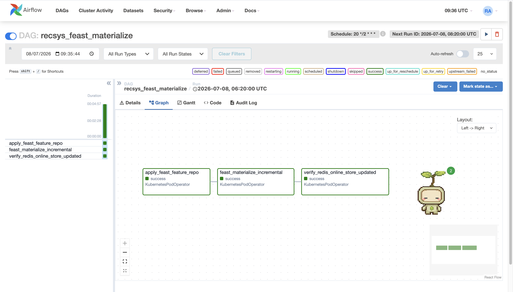
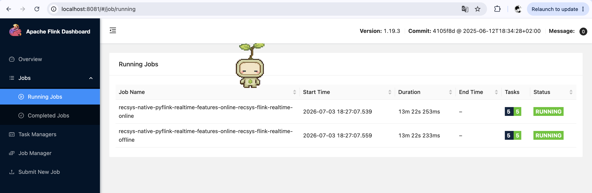
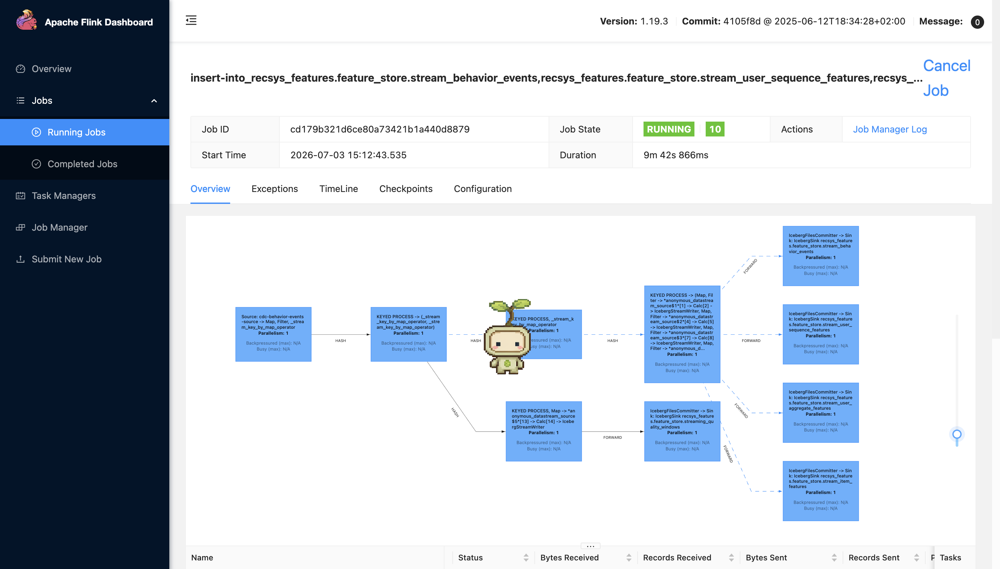
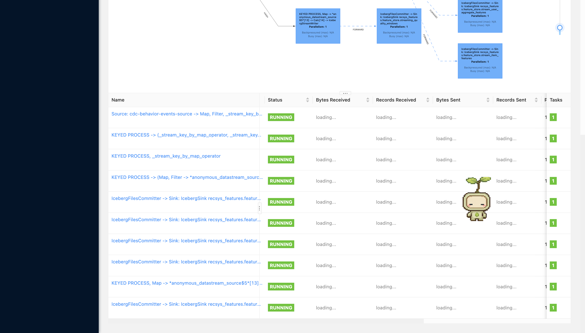
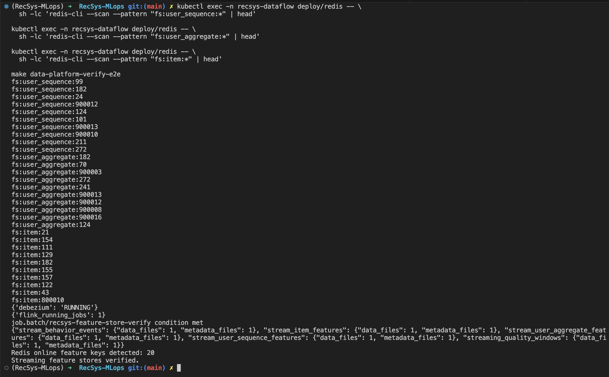
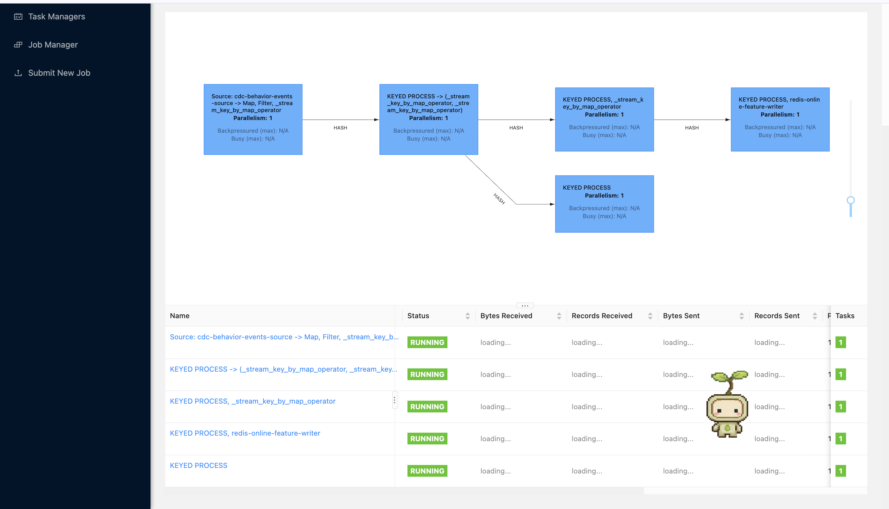

# Feature Store

The current Feast store is:

| Layer | Backing system | Role |
| --- | --- | --- |
| Feast offline store | Dedicated PostgreSQL service `feature-postgres.recsys-dataflow.svc.cluster.local`, database/schema `feature_store` | Native Feast point-in-time retrieval and `materialize-incremental` source. |
| Feast online store | Redis | Low-latency feature serving for API services and recommendation inference. |

Feast store paths:

```text
PostgreSQL Feast offline store -> Feast materialize-incremental -> Redis online store
Kafka CDC topic cdc.behavior_events -> Flink online-store job -> Redis online store
Kafka CDC topic cdc.behavior_events -> Flink offline-store job -> PostgreSQL Feast offline store
```

## Airflow Data Pipeline For Incremental Materialize Offline -> Online Store

### Code Reference

- [k8s_data_platform_dag.py](../../../apps/data-platform/src/orchestration/airflow/dags/k8s_data_platform_dag.py): defines the split Airflow DAGs. `recsys_batch_feature_pipeline` builds the PostgreSQL Feast offline store, while `recsys_feast_materialize` applies the Feast repo, runs Feast `materialize-incremental`, and verifies Redis online-store keys.
- [values.yaml](../../../infra/helm/recsys-data-platform/values.yaml): exposes the `recsys_feast_materialize` schedule through `airflow.feastMaterializeSchedule`.
- [configmap.yaml](../../../infra/helm/recsys-data-platform/templates/configmap.yaml): injects `FEAST_MATERIALIZE_DAG_SCHEDULE` into Airflow so the materialization DAG can run on its own cadence.
- [spark_batch_entrypoint.py](../../../apps/data-platform/src/features/spark/spark_batch_entrypoint.py): exports Feast-compatible feature and label tables into PostgreSQL through `feast_postgres_export`.
- [postgres_offline_store.py](../../../apps/data-platform/src/feature_store/postgres_offline_store.py): owns PostgreSQL DDL and row insertion for `user_sequence_features`, `user_aggregate_features`, `item_features`, and `ml_ranking_labels`.
- [feature_store.yaml](../../../apps/data-platform/feature-store/feature_repo/feature_store.yaml): configures Feast `offline_store.type: postgres` and Redis online store.
- [features.py](../../../apps/data-platform/feature-store/feature_repo/features.py): defines Feast `PostgreSQLSource` FeatureViews and FeatureService `bst_ranking_v1`.

### Image Proof Of Feast Incremental Materialize On Airflow Graph



**Note:** The `recsys_feast_materialize` DAG runs every 2 hours, at minute 20
(`20 */2 * * *`). The DAG focuses only on moving features from the PostgreSQL
Feast offline store into the Redis online store: `apply_feast_feature_repo` ->
`feast_materialize_incremental` -> `verify_redis_online_store_updated`. The
upstream offline-store refresh is handled by `recsys_batch_feature_pipeline`,
and drift/retrain checks are handled by the separate
`recsys_feature_drift_monitoring` DAG.

### Commands To Capture Proof

```bash
kubectl get pods -n recsys-dataflow

kubectl exec -n recsys-dataflow deploy/airflow-webserver -- \
  airflow dags details recsys_feast_materialize

kubectl exec -n recsys-dataflow deploy/airflow-webserver -- \
  airflow dags list-runs -d recsys_feast_materialize

kubectl exec -n recsys-dataflow deploy/airflow-webserver -- \
  airflow tasks states-for-dag-run recsys_feast_materialize <run_id>

kubectl exec -n recsys-dataflow deploy/feature-postgres -- \
  psql -U feast -d feature_store -c '
    SELECT table_schema, table_name
    FROM information_schema.tables
    WHERE table_schema = '\''feature_store'\''
    ORDER BY table_name;
  '
```

Expected proof: Airflow shows the dedicated `recsys_feast_materialize` DAG with
`apply_feast_feature_repo`, `feast_materialize_incremental`, and
`verify_redis_online_store_updated` all successful. PostgreSQL has the Feast
offline feature tables in schema `feature_store`, and the materialize DAG
verifies that Redis online-store keys exist after incremental materialization.

## Two Flink Streaming Jobs Running

Both streaming jobs run continuously and listen to Kafka topic `cdc.behavior_events`, produced by Debezium CDC from source Postgres table `public.behavior_events`.

- `realtime-flink-online-store` uses consumer group `recsys-flink-realtime-online`, runs with `--continuous`, and writes online features to Redis.
- `realtime-flink-offline-store` uses consumer group `recsys-flink-realtime-offline`, runs with `--continuous`, and writes Feast offline feature rows to PostgreSQL.

The jobs intentionally use separate consumer groups so both jobs receive the full event stream instead of competing for partitions. Useful runtime config:

- Kafka topic: `realtimeFlinkConsumer.topic: cdc.behavior_events`
- Base group: `realtimeFlinkConsumer.groupId: recsys-flink-realtime`
- Offline sink: `realtimeFlinkConsumer.offlineStoreSink: postgres`
- Checkpoint interval: `30` seconds
- Watermark delay: `60` minutes
- Feature state TTL: `604800` seconds
- Dedup state TTL: `86400` seconds
- PostgreSQL Feast target: `FEAST_POSTGRES_HOST=feature-postgres.recsys-dataflow.svc.cluster.local`, `FEAST_POSTGRES_DB=feature_store`, `FEAST_POSTGRES_SCHEMA=feature_store`, `FEAST_POSTGRES_SSLMODE=disable`
- Stability tuning after proof run: `KAFKA_FETCH_MAX_BYTES=1048576`, `KAFKA_MAX_PARTITION_FETCH_BYTES=262144`, `KAFKA_MAX_POLL_RECORDS=100`, plus TaskManager memory `process=2560m`, `task.heap=1024m`, `managed=256m`. This avoids Java heap OOM from large Kafka fetch buffers while both continuous jobs share the TaskManager.

| Job | Kafka topic | Consumer group | Continuous mode | Sink |
| --- | --- | --- | --- | --- |
| `realtime-flink-online-store` | `cdc.behavior_events` | `recsys-flink-realtime-online` | `--continuous` | Redis keys `fs:user_sequence:*`, `fs:user_aggregate:*`, `fs:item:*` |
| `realtime-flink-offline-store` | `cdc.behavior_events` | `recsys-flink-realtime-offline` | `--continuous` | PostgreSQL tables `feature_store.user_sequence_features`, `user_aggregate_features`, `item_features` |

### Image Proof Of Flink UI Job Running



### Commands To Capture Proof

```bash
kubectl get deploy -n recsys-dataflow realtime-flink-online-store realtime-flink-offline-store

kubectl exec -n recsys-dataflow deploy/flink-jobmanager -- \
  curl -fsS http://localhost:8081/jobs/overview

kubectl get pods -n recsys-dataflow -l app=flink-taskmanager \
  -o custom-columns=NAME:.metadata.name,READY:.status.containerStatuses[0].ready,RESTARTS:.status.containerStatuses[0].restartCount
```

Expected proof: both submitter deployments are ready, Flink has two `RUNNING` jobs, and TaskManager restart count is stable.

## Flink Streaming Job To Offline Store

### Code Reference

- [realtime-flink-consumer.yaml](../../../infra/helm/recsys-data-platform/templates/realtime-flink-consumer.yaml): deploys `realtime-flink-offline-store`, disables online writes, and passes `--offline-store-sink "$OFFLINE_STORE_SINK"` plus `--feast-postgres-*`.
- [realtime_stream_job.py](../../../apps/data-platform/src/features/flink/realtime_stream_job.py): `build_postgres_feast_rows(...)` maps CDC feature payloads to Feast PostgreSQL table schemas.
- [realtime_stream_job.py](../../../apps/data-platform/src/features/flink/realtime_stream_job.py): `PostgresFeastOfflineWriter` creates/writes PostgreSQL Feast offline feature tables.
- [features.py](../../../apps/data-platform/feature-store/feature_repo/features.py): Feast FeatureViews read those tables with `PostgreSQLSource`.

### Commands To Capture Proof

```bash
kubectl logs -n recsys-dataflow deploy/realtime-flink-offline-store --tail=80

kubectl logs -n recsys-dataflow deploy/flink-taskmanager --tail=160 | \
  grep -E 'postgres-feast-offline-feature-writer|postgres_feast_offline_written'

kubectl exec -n recsys-dataflow deploy/feature-postgres -- \
  psql -U feast -d feature_store -c '
    SELECT '\''user_sequence_features'\'' AS table_name, count(*) FROM feature_store.user_sequence_features
    UNION ALL
    SELECT '\''user_aggregate_features'\'', count(*) FROM feature_store.user_aggregate_features
    UNION ALL
    SELECT '\''item_features'\'', count(*) FROM feature_store.item_features
    ORDER BY table_name;
  '
```

Expected proof: logs show PostgreSQL offline writer activity and PostgreSQL row counts are non-zero.

### Image Proof Of Streaming Features In Offline Store





## Flink Streaming Job To Online Store

### Code Reference

- [realtime-flink-consumer.yaml](../../../infra/helm/recsys-data-platform/templates/realtime-flink-consumer.yaml): deploys `realtime-flink-online-store`, disables offline writes, and submits the online PyFlink job.
- [online_writer.py](../../../apps/data-platform/src/feature_store/online_writer.py): defines Redis key templates and writes `fs:user_sequence:{user_id}`, `fs:user_aggregate:{user_id}`, and `fs:item:{product_id}` with expiry.
- [realtime_stream_job.py](../../../apps/data-platform/src/features/flink/realtime_stream_job.py): pushes built feature payloads into Redis and names the operator `redis-online-feature-writer`.

### Commands To Capture Proof

```bash
kubectl exec -n recsys-dataflow deploy/redis -- \
  sh -lc 'redis-cli --scan --pattern "fs:user_sequence:*" | head'

kubectl exec -n recsys-dataflow deploy/redis -- \
  sh -lc 'redis-cli --scan --pattern "fs:user_aggregate:*" | head'

kubectl exec -n recsys-dataflow deploy/redis -- \
  sh -lc 'redis-cli --scan --pattern "fs:item:*" | head'
```

Expected proof: each command prints at least one Redis online feature key created by the continuous online-store Flink job.

### Image Proof Of Streaming Features In Online Store





## TTL Definition & Reasons

### Code Reference

- [features.py](../../../apps/data-platform/feature-store/feature_repo/features.py): Feast FeatureView TTLs.
- [redis_online_store.yaml](../../../configs/local/redis_online_store.yaml): Redis online TTL notes.
- [realtime_stream_job.py](../../../apps/data-platform/src/features/flink/realtime_stream_job.py): Redis TTLs plus Flink feature/dedup state TTL.
- [values.yaml](../../../infra/helm/recsys-data-platform/values.yaml): runtime TTL values for deployed streaming jobs.

### TTL For Each Feature Table & Reason Why

| Feature table / store key | Main columns | Offline / Feast TTL | Online Redis TTL | Reason |
| --- | --- | ---: | ---: | --- |
| `user_sequence_features` / `fs:user_sequence:{user_id}` | user history arrays and `hist_length` | `1 day` | `90 days` | Feast historical joins need short event-time freshness; Redis keeps longer sequence context for serving inactive users. |
| `user_aggregate_features` / `fs:user_aggregate:{user_id}` | recent views/carts/purchases and ratios | `1 day` | `1 day` | User intent changes quickly, so stale aggregate counters should expire fast. |
| `item_features` / `fs:item:{product_id}` | item metadata, popularity, and conversion signals | `7 days` | `7 days` | Item metadata and popularity drift over days, so a week balances continuity and freshness. |
| PostgreSQL Feast offline stream rows | same Feast feature columns as Spark batch export | FeatureView TTLs above | not applicable | The offline streaming job keeps the Feast offline store fresh for historical retrieval and later materialization. PostgreSQL retention is an operational DB policy; Feast TTL controls point-in-time validity. |
| Flink keyed feature state | per-user sequence, per-user aggregate, per-item state, dedup IDs | not applicable | not applicable | Feature state TTL is `7 days` to bound state size while preserving rolling history. Dedup TTL is `1 day` for replay and late-arrival protection. |
