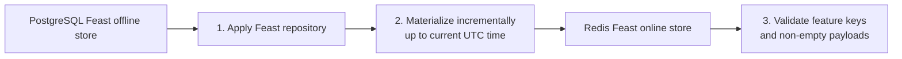
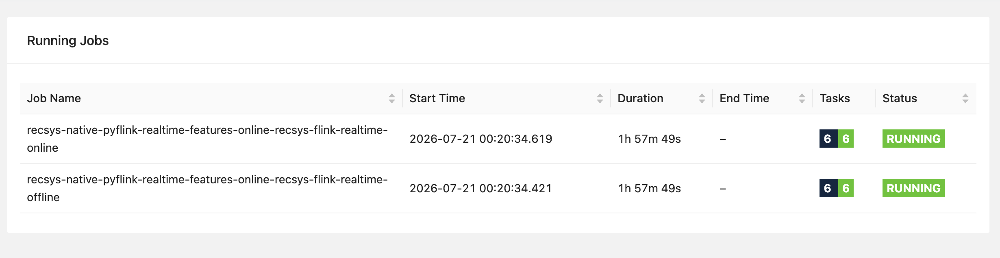
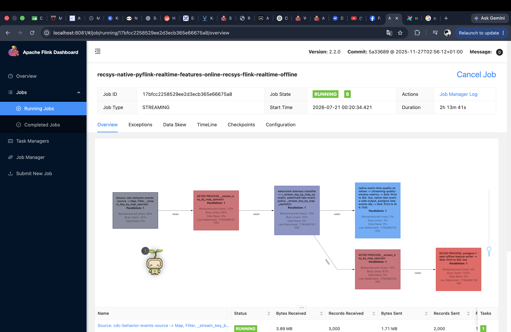
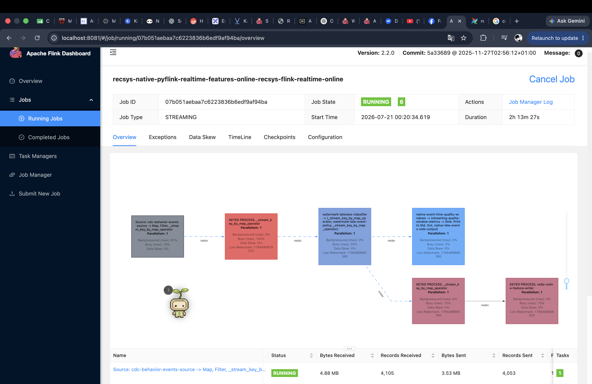

# Feature Store

The current Feast store is:

| Layer | Backing system | Role |
| --- | --- | --- |
| Feast offline store | Dedicated PostgreSQL service `feature-postgres.recsys-dataflow.svc.cluster.local`, database/schema `feature_store` | Native Feast point-in-time retrieval and `materialize-incremental` source. |
| Feast online store | Redis | Low-latency feature serving for API services and recommendation inference. |

Feast store paths:

```text
PostgreSQL Feast offline store -> Feast materialize-incremental -> Redis online store
Kafka CDC topic cdc.behavior_events -> Flink online-store job -> Redis online store
Kafka CDC topic cdc.behavior_events -> Flink offline-store job -> PostgreSQL Feast offline store
```

## Airflow Data Pipeline For Incremental Materialize Offline -> Online Store

The referenced Airflow object is the dedicated `recsys_feast_materialize` DAG,
not the removed `k8s_data_platform_dag` DAG ID. Its source module retains the
historical filename, but the deployed DAG contains only the materialization
stages shown below.



### Materialize DAG Reference Code

```python
with DAG(
    dag_id="recsys_feast_materialize",
    start_date=datetime(2026, 1, 1),
    schedule=env_schedule("FEAST_MATERIALIZE_DAG_SCHEDULE", "20 */2 * * *"),
    catchup=False,
    max_active_runs=1,
    tags=["recsys", "feast", "materialize", "online-store"],
) as recsys_feast_materialize:
    apply_feature_repo = pod_task(
        "apply_feast_feature_repo", DATAFLOW_IMAGE, APPLY_FEAST_FEATURE_REPO_COMMAND
    )
    materialize_incremental = pod_task(
        "feast_materialize_incremental",
        DATAFLOW_IMAGE,
        FEAST_MATERIALIZE_INCREMENTAL_COMMAND,
    )
    validate_online_store = pod_task(
        "verify_redis_online_store_updated",
        DATAFLOW_IMAGE,
        VERIFY_REDIS_ONLINE_STORE_COMMAND,
    )

    apply_feature_repo >> materialize_incremental >> validate_online_store
```

Source: [`recsys_feast_materialize` DAG definition](../../../apps/data-platform/src/orchestration/airflow/dags/k8s_data_platform_dag.py#L153) and [ordered dependencies](../../../apps/data-platform/src/orchestration/airflow/dags/k8s_data_platform_dag.py#L175).

### DAG Stages

| Stage | Task and command | Result | Code reference |
| ---: | --- | --- | --- |
| 1 | `apply_feast_feature_repo`: `apply_feature_repo(".")` | Loads the PostgreSQL sources, Redis online-store config, entities, FeatureViews, and `bst_ranking_v1` into the Feast registry before materialization. | [task definition](../../../apps/data-platform/src/orchestration/airflow/dags/k8s_data_platform_dag.py#L161), [task command](../../../apps/data-platform/src/orchestration/airflow/dags/k8s_data_platform_dag.py#L84), [registry apply implementation](../../../apps/data-platform/src/feature_store/feast_registry.py#L29), [store config](../../../apps/data-platform/feature-store/feature_repo/feature_store.yaml#L8), [FeatureViews](../../../apps/data-platform/feature-store/feature_repo/features.py#L44), [`bst_ranking_v1`](../../../apps/data-platform/feature-store/feature_repo/features.py#L112) |
| 2 | `feast_materialize_incremental`: `feast materialize-incremental $(date -u +%Y-%m-%dT%H:%M:%S)` | Reads feature rows newer than the previous materialization boundary from PostgreSQL and writes the latest values to Redis up to the current UTC time. | [task definition](../../../apps/data-platform/src/orchestration/airflow/dags/k8s_data_platform_dag.py#L164), [task command](../../../apps/data-platform/src/orchestration/airflow/dags/k8s_data_platform_dag.py#L90), [PostgreSQL source tables](../../../apps/data-platform/feature-store/feature_repo/features.py#L22), [Redis online store](../../../apps/data-platform/feature-store/feature_repo/feature_store.yaml#L18) |
| 3 | `verify_redis_online_store_updated`: `python -m validate.governance_contracts streaming-redis` | Fails the DAG unless Redis contains non-empty user-sequence, user-aggregate, and item-feature keys. | [task definition](../../../apps/data-platform/src/orchestration/airflow/dags/k8s_data_platform_dag.py#L169), [task command](../../../apps/data-platform/src/orchestration/airflow/dags/k8s_data_platform_dag.py#L96), [Redis key and payload checks](../../../apps/data-platform/src/validate/governance_contracts.py#L219) |

Every stage uses the shared [`KubernetesPodOperator` factory](../../../apps/data-platform/src/orchestration/airflow/dags/k8s_data_platform_dag.py#L55), imports the platform ConfigMap and Secret, streams logs, and deletes its temporary pod after completion. The DAG schedule is configured by [`feastMaterializeSchedule`](../../../infra/helm/recsys-data-platform/values.yaml#L224) and rendered as [`FEAST_MATERIALIZE_DAG_SCHEDULE`](../../../infra/helm/recsys-data-platform/templates/configmap.yaml#L43).

### Image Proof Of Feast Incremental Materialize On Airflow Graph


**Note:** The `recsys_feast_materialize` DAG runs every 2 hours, at minute 20
(`20 */2 * * *`). The DAG focuses only on moving features from the PostgreSQL
Feast offline store into the Redis online store: `apply_feast_feature_repo` ->
`feast_materialize_incremental` -> `verify_redis_online_store_updated`. The
upstream batch refresh is handled by
[`recsys_dp3_offline_feature_table`](../../../apps/data-platform/src/orchestration/airflow/dags/rubric_data_pipeline_dags.py#L274),
while the Flink offline-store job writes continuous updates. Drift/retrain
checks are handled by the separate
`recsys_feature_drift_monitoring` DAG.

### Commands To Capture Proof

```bash
kubectl get pods -n recsys-dataflow

kubectl exec -n recsys-dataflow deploy/airflow-webserver -- \
  airflow dags details recsys_feast_materialize

kubectl exec -n recsys-dataflow deploy/airflow-webserver -- \
  airflow dags list-runs -d recsys_feast_materialize

kubectl exec -n recsys-dataflow deploy/airflow-webserver -- \
  airflow tasks states-for-dag-run recsys_feast_materialize <run_id>

kubectl exec -n recsys-dataflow deploy/feature-postgres -- \
  psql -U feast -d feature_store -c '
    SELECT table_schema, table_name
    FROM information_schema.tables
    WHERE table_schema = '\''feature_store'\''
    ORDER BY table_name;
  '
```

Expected proof: Airflow shows the dedicated `recsys_feast_materialize` DAG with
`apply_feast_feature_repo`, `feast_materialize_incremental`, and
`verify_redis_online_store_updated` all successful. PostgreSQL has the Feast
offline feature tables in schema `feature_store`, and the materialize DAG
verifies that Redis online-store keys exist after incremental materialization.

## Two Flink Streaming Jobs Running

Both streaming jobs run continuously and listen to Kafka topic `cdc.behavior_events`, produced by Debezium CDC from source Postgres table `public.behavior_events`.

- `realtime-flink-online-store` uses consumer group `recsys-flink-realtime-online`, runs with `--continuous`, and writes online features to Redis.
- `realtime-flink-offline-store` uses consumer group `recsys-flink-realtime-offline`, runs with `--continuous`, and writes Feast offline feature rows to PostgreSQL.

The jobs intentionally use separate consumer groups so both jobs receive the full event stream instead of competing for partitions. Useful runtime config:

- Kafka topic: `realtimeFlinkConsumer.topic: cdc.behavior_events`
- Base group: `realtimeFlinkConsumer.groupId: recsys-flink-realtime`
- Offline sink: `realtimeFlinkConsumer.offlineStoreSink: postgres`
- Checkpoint interval: `30` seconds
- Watermark delay: `60` minutes
- Feature state TTL: `604800` seconds
- Dedup state TTL: `86400` seconds
- PostgreSQL Feast target: `FEAST_POSTGRES_HOST=feature-postgres.recsys-dataflow.svc.cluster.local`, `FEAST_POSTGRES_DB=feature_store`, `FEAST_POSTGRES_SCHEMA=feature_store`, `FEAST_POSTGRES_SSLMODE=disable`
- Stability tuning after proof run: `KAFKA_FETCH_MAX_BYTES=1048576`, `KAFKA_MAX_PARTITION_FETCH_BYTES=262144`, `KAFKA_MAX_POLL_RECORDS=100`, plus TaskManager memory `process=2560m`, `task.heap=1024m`, `managed=256m`. This avoids Java heap OOM from large Kafka fetch buffers while both continuous jobs share the TaskManager.

| Job | Kafka topic | Consumer group | Continuous mode | Sink |
| --- | --- | --- | --- | --- |
| `realtime-flink-online-store` | `cdc.behavior_events` | `recsys-flink-realtime-online` | `--continuous` | Redis keys `fs:user_sequence:*`, `fs:user_aggregate:*`, `fs:item:*` |
| `realtime-flink-offline-store` | `cdc.behavior_events` | `recsys-flink-realtime-offline` | `--continuous` | PostgreSQL tables `feature_store.user_sequence_features`, `user_aggregate_features`, `item_features` |

### Image Proof Of Flink UI Job Running



**Figure: both continuous feature-store jobs are healthy.** Flink reports the online and offline jobs as `RUNNING`, with all six tasks running in each job.

### Commands To Capture Proof

```bash
kubectl get deploy -n recsys-dataflow realtime-flink-online-store realtime-flink-offline-store

kubectl exec -n recsys-dataflow deploy/flink-jobmanager -- \
  curl -fsS http://localhost:8081/jobs/overview

kubectl get pods -n recsys-dataflow -l app=flink-taskmanager \
  -o custom-columns=NAME:.metadata.name,READY:.status.containerStatuses[0].ready,RESTARTS:.status.containerStatuses[0].restartCount
```

Expected proof: both submitter deployments are ready, Flink has two `RUNNING` jobs, and TaskManager restart count is stable.

## Flink Streaming Job To Offline Store

### Code Reference

- [realtime-flink-consumer.yaml (line 88)](../../../infra/helm/recsys-data-platform/templates/realtime-flink-consumer.yaml#L88), [realtime-flink-consumer.yaml (line 176)](../../../infra/helm/recsys-data-platform/templates/realtime-flink-consumer.yaml#L176): offline-store Flink deployment and sink arguments.
- [realtime_stream_job.py (line 223)](../../../apps/data-platform/src/features/flink/realtime_stream_job.py#L223), [line 296](../../../apps/data-platform/src/features/flink/realtime_stream_job.py#L296), [line 1045](../../../apps/data-platform/src/features/flink/realtime_stream_job.py#L1045), and [line 1102](../../../apps/data-platform/src/features/flink/realtime_stream_job.py#L1102): typed user/item PostgreSQL rows, event-time feature windows, and async offline-store sink attachment.
- [features.py (line 22)](../../../apps/data-platform/feature-store/feature_repo/features.py#L22), [features.py (line 110)](../../../apps/data-platform/feature-store/feature_repo/features.py#L110): `PostgreSQLSource` FeatureViews over the written tables.

### Commands To Capture Proof

```bash
kubectl logs -n recsys-dataflow deploy/realtime-flink-offline-store --tail=80

kubectl logs -n recsys-dataflow deploy/flink-taskmanager --tail=160 | \
  grep -E 'postgres-feast-offline-feature-writer|postgres_feast_offline_written'

kubectl exec -n recsys-dataflow deploy/feature-postgres -- \
  psql -U feast -d feature_store -c '
    SELECT '\''user_sequence_features'\'' AS table_name, count(*) FROM feature_store.user_sequence_features
    UNION ALL
    SELECT '\''user_aggregate_features'\'', count(*) FROM feature_store.user_aggregate_features
    UNION ALL
    SELECT '\''item_features'\'', count(*) FROM feature_store.item_features
    ORDER BY table_name;
  '
```

Expected proof: logs show PostgreSQL offline writer activity and PostgreSQL row counts are non-zero.

### Image Proof Of Streaming Features In Offline Store



**Figure: offline-store streaming path.** The running graph consumes `cdc.behavior_events`, performs event-time quality and feature processing, then reaches `postgres-feast-offline-feature-writer` to update Feast-compatible PostgreSQL tables.

## Flink Streaming Job To Online Store

### Code Reference

- [realtime-flink-consumer.yaml (line 1)](../../../infra/helm/recsys-data-platform/templates/realtime-flink-consumer.yaml#L1), [realtime-flink-consumer.yaml (line 84)](../../../infra/helm/recsys-data-platform/templates/realtime-flink-consumer.yaml#L84): online-store Flink deployment.
- [online_writer.py (line 16)](../../../apps/data-platform/src/feature_store/online_writer.py#L16), [online_writer.py (line 48)](../../../apps/data-platform/src/feature_store/online_writer.py#L48), [realtime_stream_job.py (line 644)](../../../apps/data-platform/src/features/flink/realtime_stream_job.py#L644), [realtime_stream_job.py (line 684)](../../../apps/data-platform/src/features/flink/realtime_stream_job.py#L684), [realtime_stream_job.py (line 1071)](../../../apps/data-platform/src/features/flink/realtime_stream_job.py#L1071), [realtime_stream_job.py (line 1075)](../../../apps/data-platform/src/features/flink/realtime_stream_job.py#L1075): Redis serialization, keys, TTLs, and the online writer operator.

### Commands To Capture Proof

```bash
kubectl exec -n recsys-dataflow deploy/redis -- \
  sh -lc 'redis-cli --scan --pattern "fs:user_sequence:*" | head'

kubectl exec -n recsys-dataflow deploy/redis -- \
  sh -lc 'redis-cli --scan --pattern "fs:user_aggregate:*" | head'

kubectl exec -n recsys-dataflow deploy/redis -- \
  sh -lc 'redis-cli --scan --pattern "fs:item:*" | head'
```

Expected proof: each command prints at least one Redis online feature key created by the continuous online-store Flink job.

### Image Proof Of Streaming Features In Online Store



**Figure: online-store streaming path.** The running graph consumes `cdc.behavior_events`, performs event-time quality and feature processing, then reaches `redis-online-feature-writer` for low-latency Redis serving.

## TTL Definition & Reasons

### Code Reference

- [features.py (line 44)](../../../apps/data-platform/feature-store/feature_repo/features.py#L44), [features.py (line 106)](../../../apps/data-platform/feature-store/feature_repo/features.py#L106): Feast FeatureView TTLs.
- [realtime_stream_job.py (line 155)](../../../apps/data-platform/src/features/flink/realtime_stream_job.py#L155), [realtime_stream_job.py (line 156)](../../../apps/data-platform/src/features/flink/realtime_stream_job.py#L156), [realtime_stream_job.py (line 157)](../../../apps/data-platform/src/features/flink/realtime_stream_job.py#L157): Redis TTLs for sequence, aggregate, and item features.
- [realtime_stream_job.py (line 472)](../../../apps/data-platform/src/features/flink/realtime_stream_job.py#L472), [realtime_stream_job.py (line 486)](../../../apps/data-platform/src/features/flink/realtime_stream_job.py#L486), [realtime_stream_job.py (line 502)](../../../apps/data-platform/src/features/flink/realtime_stream_job.py#L502), [realtime_stream_job.py (line 506)](../../../apps/data-platform/src/features/flink/realtime_stream_job.py#L506), [realtime_stream_job.py (line 536)](../../../apps/data-platform/src/features/flink/realtime_stream_job.py#L536): applies TTL to bounded-limit, deduplication, user-sequence, user-aggregate, and item keyed state.
- [runtime_config.py (line 13)](../../../apps/data-platform/src/features/flink/runtime_config.py#L13), [runtime_config.py (line 18)](../../../apps/data-platform/src/features/flink/runtime_config.py#L18): builds and enables native Flink `StateTtlConfig`.
- [redis_online_store.yaml (line 14)](../../../configs/local/redis_online_store.yaml#L14): configurable Redis TTL values.
- [values.yaml (line 211)](../../../infra/helm/recsys-data-platform/values.yaml#L211), [values.yaml (line 222)](../../../infra/helm/recsys-data-platform/values.yaml#L222): deployed watermark and state-TTL values.

### TTL For Each Feature Table & Reason Why

| Feature table / store key | Main columns | Offline / Feast TTL | Online Redis TTL | Reason |
| --- | --- | ---: | ---: | --- |
| `user_sequence_features` / `fs:user_sequence:{user_id}` | user history arrays and `hist_length` | `1 day` | `90 days` | Feast historical joins need short event-time freshness; Redis keeps longer sequence context for serving inactive users. |
| `user_aggregate_features` / `fs:user_aggregate:{user_id}` | recent views/carts/purchases and ratios | `1 day` | `1 day` | User intent changes quickly, so stale aggregate counters should expire fast. |
| `item_features` / `fs:item:{product_id}` | item metadata, popularity, and conversion signals | `7 days` | `7 days` | Item metadata and popularity drift over days, so a week balances continuity and freshness. |
| PostgreSQL Feast offline stream rows | same Feast feature columns as Spark batch export | FeatureView TTLs above | not applicable | The offline streaming job keeps the Feast offline store fresh for historical retrieval and later materialization. PostgreSQL retention is an operational DB policy; Feast TTL controls point-in-time validity. |
| Flink keyed feature state | per-user sequence, per-user aggregate, per-item state, dedup IDs | not applicable | not applicable | Feature state TTL is `7 days` to bound state size while preserving rolling history. Dedup TTL is `1 day` for replay and late-arrival protection. |
