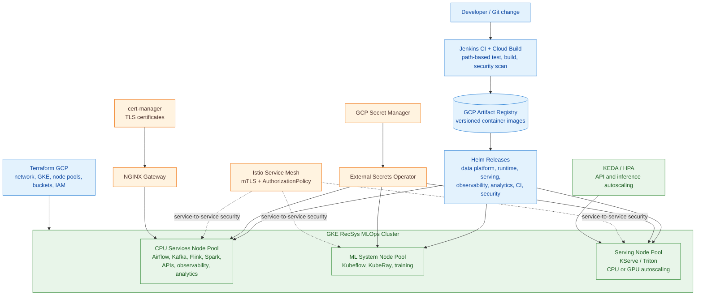

# High-Level System Design — Full Data & ML Platform

This document presents the repository-wide architecture from source data and
data-platform processing to feature serving, model training, controlled model
rollout, online inference, analytics, governance, and observability.

## 1. End-to-End Platform

```mermaid
flowchart LR
  %% ===== Data platform and feature store =====
  subgraph DP["Data Platform & Feature Store"]
    direction TB
    Generator["Historical + Realtime<br/>Data Generator"]
    SourceDB[("Operational PostgreSQL")]
    Raw[("Raw Data / MinIO")]
    Debezium["Debezium CDC"]
    Kafka["Kafka"]
    BronzeLake[("Iceberg Bronze Tables")]
    Spark["Spark Batch<br/>Feature Engineering"]
    SilverGoldLake[("Iceberg Silver / Gold Tables")]
    Flink["Flink Realtime<br/>Feature Engineering"]
    Airflow["Airflow Orchestration"]
    DataChecks["Data Quality + Pipeline Health<br/>failures, freshness, contracts, lag"]
    DataHub["DataHub Governance<br/>Catalog + Lineage"]

    Generator --> Raw --> BronzeLake --> Spark --> SilverGoldLake
    Generator --> SourceDB --> Debezium --> Kafka --> Flink
    Airflow -.-> Spark
    Airflow -.-> Flink
    Airflow -.-> DataChecks
    Spark -.-> DataChecks
    Flink -.-> DataChecks
    Kafka -.-> DataChecks
    BronzeLake -.-> DataHub
    SilverGoldLake -.-> DataHub
    Kafka -.-> DataHub

    subgraph FP["Feast Feature Store"]
      direction TB
      Offline[("Feast Offline Store<br/>PostgreSQL")]
      Materialize["Feast Materialization"]
      Online[("Feast Online Store<br/>Redis")]

      Offline --> Materialize --> Online
    end

    Spark --> Offline
    Flink --> Offline
    Flink --> Online
    Airflow -.-> Materialize
  end

  %% ===== Analytics platform =====
  subgraph AP["Analytics Platform"]
    direction TB
    SilverSync["Silver Sync<br/>Iceberg Silver → Analytics Staging"]
    Analytics["Trino + dbt<br/>Gold marts"]
    Superset["Superset BI"]
    AnalyticsStakeholder["Analytics Stakeholders<br/>Business / Product / ML"]

    SilverSync --> Analytics --> Superset --> AnalyticsStakeholder
  end

  SilverGoldLake -->|read curated Silver tables| SilverSync
  Airflow -.-> SilverSync

  %% ===== ML platform =====
  subgraph ML["ML Training Platform"]
    direction TB
    Drift["Feature Drift Monitoring"]
    KFP["Kubeflow Pipeline<br/>prepare → train → evaluate"]
    Ray["KubeRay<br/>Ray Tune + Distributed Training"]
    Evaluate["Model Evaluation<br/>& Promotion Gate"]

    Drift -->|retrain trigger| KFP
    KFP --> Ray --> Evaluate
  end

  Offline --> Drift
  Offline -->|historical training features| KFP
  Airflow -.-> Drift

  %% ===== Tracking, artifacts and model delivery =====
  subgraph MR["Experiment Tracking & Model Registry"]
    direction TB
    MLflow["MLflow"]
    TrackingDB[("PostgreSQL<br/>metadata + registry")]
    Artifacts[("MinIO<br/>checkpoints + artifacts")]
    ModelStore[("Versioned Triton<br/>Model Repository")]

    MLflow --> TrackingDB
    MLflow --> Artifacts
  end

  Ray --> MLflow
  Evaluate --> MLflow
  Evaluate --> ModelStore

  subgraph CD["Controlled Model CD"]
    direction TB
    CandidateSelect["Select MLflow Candidate<br/>candidate=test"]
    ModelCD["Jenkins Model CD"]
    ShadowDeploy["Shadow Deployment<br/>candidate gets async traffic copy<br/>user response stays on control"]
    ShadowGate{"Candidate ready and<br/>shadow healthy?"}
    Progressive["Progressive A/B<br/>10% → 25% → 50%<br/>wait for samples at each stage"]
    RolloutGate{"Online gates pass?<br/>sample count, errors, p95 latency"}
    PromoteModel["Promote Candidate<br/>update latest + champion alias"]
    Fallback["Automatic Fallback<br/>candidate weight = 0<br/>keep old champion"]
    Cleanup["Delete Temporary<br/>Candidate Triton"]

    CandidateSelect --> ModelCD --> ShadowDeploy --> ShadowGate
    ShadowGate -->|pass| Progressive --> RolloutGate
    ShadowGate -->|fail| Fallback
    RolloutGate -->|hold: need more samples| Progressive
    RolloutGate -->|pass at 50%| PromoteModel
    RolloutGate -->|regression| Fallback
    PromoteModel --> Cleanup
    Fallback --> Cleanup
  end
  ModelStore --> ModelCD
  MLflow -.->|candidate and champion aliases| CandidateSelect

  %% ===== Online serving =====
  subgraph OS["Online Serving"]
    direction TB
    Gateway["NGINX HTTPS Gateway"]
    API["Recommendation FastAPI"]
    FeatureAPI["Online Feature FastAPI"]
    Router["Stable / A-B / Shadow Router"]
    StableServing["Stable KServe + Triton"]
    CandidateServing["Candidate KServe + Triton"]
    RankTopK["Candidate Scoring + Top-K"]
    TopK["Top-K Recommendations"]

    API --> FeatureAPI
    FeatureAPI --> API
    API --> Router
    Router -->|control| StableServing
    Router -->|candidate| CandidateServing
    Router -.->|shadow copy| CandidateServing
    StableServing --> RankTopK
    CandidateServing --> RankTopK
    RankTopK --> TopK
  end

  FeatureAPI -->|read via Feast SDK| Online
  Online -->|user, item and candidate features| FeatureAPI
  ShadowDeploy -.->|deploy candidate at 0% response traffic| CandidateServing
  Progressive -->|set candidate weight 10 / 25 / 50| Router
  PromoteModel -->|replace stable champion| StableServing
  Fallback -->|set candidate weight to 0| Router
  Cleanup -.->|remove temporary candidate| CandidateServing

  subgraph UX["User / Client"]
    direction TB
    EndUser["End User"]
    WebUI["React Recommendation Web UI"]
    DemoAPI["Demo Web FastAPI"]

    WebUI --> DemoAPI
  end
  EndUser -->|HTTPS| Gateway
  Gateway -->|serve web application| WebUI
  DemoAPI -->|request recommendations| API
  TopK -->|recommendation response| DemoAPI
  DemoAPI -->|return recommendations| WebUI
  WebUI -->|render recommendations| EndUser
  DemoAPI -->|write views, carts, purchases,<br/>requests and impressions| SourceDB
  DemoAPI -->|poll realtime feature status| FeatureAPI

  %% ===== Cross-cutting platform capabilities =====
  subgraph OBS["Observability"]
    direction TB
    Pushgateway["PushGateway + Exporters"]
    Prometheus["Prometheus Metrics"]
    Logs["Promtail + Loki Logs"]
    OTel["OpenTelemetry<br/>OTLP Traces"]
    Tempo["Tempo Trace Backend"]
    Grafana["Grafana Dashboards"]
    Alerts["Grafana Alerts<br/>data quality, job failures,<br/>stream lag and service health"]

    Pushgateway --> Prometheus --> Grafana --> Alerts
    Logs --> Grafana
    OTel --> Tempo --> Grafana
  end
  DataChecks -.-> Pushgateway
  Airflow -.-> Prometheus
  Airflow -.-> Logs
  Spark -.-> Logs
  Flink -.-> Logs
  KFP -.-> Prometheus
  ModelCD -.-> Prometheus
  API -.-> Prometheus
  API -.-> Logs
  API -.-> OTel
  DemoAPI -.-> Prometheus
  DemoAPI -.-> Logs
  DemoAPI -.-> OTel
  StableServing -.-> Prometheus
  CandidateServing -.-> Prometheus

  subgraph DELIVERY["Platform Delivery"]
    direction TB
    Dev["Developer + Git"]
    Tests["Unit + Integration Tests"]
    Coverage{"Coverage > 90%?"}
    CIFail["Fail CI"]
    Build["Build Versioned Docker Images<br/>Jenkins + Cloud Build"]
    Registry[("GCP Artifact Registry")]
    AppCD["Application CD<br/>helm upgrade --install"]
    Platform["Infrastructure: Terraform<br/>GKE, security, secrets, autoscaling"]

    Dev --> Tests --> Coverage
    Coverage -->|pass| Build --> Registry
    Coverage -->|fail| CIFail
    Registry -->|pull versioned images| AppCD
  end
  AppCD -->|upgrade data platform| Airflow
  AppCD -->|upgrade analytics| Superset
  AppCD -->|upgrade ML runtime| KFP
  AppCD -->|upgrade API serving| API
  AppCD -->|helm upgrade demo web| DemoAPI
  AppCD -->|helm upgrade React UI| WebUI
  AppCD -->|helm upgrade stable serving| StableServing
  AppCD -->|helm upgrade candidate serving| CandidateServing
  AppCD -->|upgrade observability| Grafana
  Platform -.-> Airflow
  Platform -.-> KFP
  Platform -.-> API
  Platform -.-> DemoAPI
  Platform -.-> WebUI
  Platform -.-> StableServing
  Platform -.-> CandidateServing

  classDef data fill:#e3f2fd,stroke:#1976d2,color:#0d47a1;
  classDef store fill:#e8f5e9,stroke:#388e3c,color:#1b5e20;
  classDef ml fill:#f3e5f5,stroke:#7b1fa2,color:#4a148c;
  classDef serve fill:#fce4ec,stroke:#c2185b,color:#880e4f;
  classDef ops fill:#fff3e0,stroke:#ef6c00,color:#4e342e;

  class Generator,SourceDB,Raw,Debezium,Kafka,BronzeLake,Spark,SilverGoldLake,Flink,Airflow,DataChecks,DataHub,SilverSync,Analytics,Superset,AnalyticsStakeholder data;
  class Offline,Materialize,Online,TrackingDB,Artifacts,ModelStore,Registry store;
  class Drift,KFP,Ray,Evaluate,MLflow,CandidateSelect,ModelCD,ShadowDeploy,ShadowGate,Progressive,RolloutGate,PromoteModel,Fallback,Cleanup ml;
  class EndUser,WebUI,DemoAPI,Gateway,API,FeatureAPI,Router,StableServing,CandidateServing,RankTopK,TopK serve;
  class Pushgateway,Prometheus,Logs,OTel,Tempo,Grafana,Alerts,Dev,Tests,Coverage,CIFail,Build,AppCD,Platform ops;
```

### Detailed End-to-End Reference

Use this diagram when the individual batch, streaming, training, rollout, and
observability paths need to be explained in more detail.

```mermaid
flowchart LR
  %% =========================
  %% Sources and feedback
  %% =========================
  subgraph S0["1. Data Sources & Feedback"]
    direction TB
    User["End User"]
    WebUIRef["React Recommendation Web UI"]
    DemoAPIRef["Demo Web FastAPI"]
    Generator["Historical + Realtime Data Generator"]
    SourceDB[("Operational PostgreSQL<br/>users, products, sessions,<br/>requests, impressions, events, orders")]
    RawFiles["Historical raw files<br/>run manifest + table files"]

    User --> WebUIRef --> DemoAPIRef
    DemoAPIRef -- "write web events, requests and impressions" --> SourceDB
    Generator --> SourceDB
    Generator --> RawFiles
  end

  %% =========================
  %% Orchestration and ingestion
  %% =========================
  subgraph S1["2. Data Platform — Ingestion & Orchestration"]
    direction TB
    Airflow["Apache Airflow<br/>KubernetesPodOperator DAGs"]
    Debezium["Kafka Connect + Debezium<br/>PostgreSQL WAL / CDC"]
    Kafka[("Kafka CDC Topics<br/>cdc.*")]
    RawLake[("MinIO / S3 Raw Zone")]

    Airflow -. "initialize, schedule, validate" .-> Debezium
    Airflow -. "orchestrate batch path" .-> RawLake
    Debezium --> Kafka
    RawFiles --> RawLake
    SourceDB -- "WAL logical replication" --> Debezium
  end

  %% =========================
  %% Batch and stream processing
  %% =========================
  subgraph S2["3. Lakehouse & Feature Engineering"]
    direction TB

    subgraph Batch["Batch Path"]
      direction TB
      BatchIngest["Batch Ingestion"]
      Bronze[("Iceberg Bronze<br/>recsys.lakehouse")]
      SparkDP2["Native PySpark<br/>clean, deduplicate, transform"]
      SilverGold[("Iceberg Silver / Gold<br/>clean and curated tables")]
      SparkFeatures["PySpark Feature Jobs<br/>user sequence + aggregates<br/>item features + ranking labels<br/>BST training table"]
      FeatureAudit[("Iceberg Feature / Audit Tables<br/>versioned lakehouse storage")]

      BatchIngest --> Bronze --> SparkDP2 --> SilverGold --> SparkFeatures
      SparkFeatures --> FeatureAudit
    end

    subgraph Stream["Realtime CDC Path"]
      direction TB
      Flink["Two Continuous PyFlink Jobs<br/>state, watermark, dedup, TTL"]
      StreamOnline["Online feature writer"]
      StreamOffline["Offline feature writer"]
      CandidatePool["Realtime candidate pool"]

      Flink --> StreamOnline
      Flink --> StreamOffline
      Flink --> CandidatePool
    end

    DataQuality["Data Quality & Contracts<br/>schema, counts, uniqueness,<br/>freshness, rejected records"]
    LakeOptimize["Lakehouse Maintenance<br/>compaction / snapshot retention"]

    Airflow -. "DP1 / DP2 / DP3" .-> BatchIngest
    Airflow -. "submit + monitor" .-> Flink
    RawLake --> BatchIngest
    Kafka --> Flink
    Bronze -.-> DataQuality
    SilverGold -.-> DataQuality
    Airflow -.-> LakeOptimize
    LakeOptimize -.-> Bronze
    LakeOptimize -.-> SilverGold
  end

  %% =========================
  %% Feature platform
  %% =========================
  subgraph S3["4. Feature Platform — Feast"]
    direction TB
    FeastRepo["Feast Registry / Feature Repo<br/>FeatureViews + bst_ranking_v1"]
    OfflineFS[("PostgreSQL Feast Offline Store<br/>feature_store schema")]
    Materialize["Feast materialize-incremental"]
    OnlineFS[("Redis Online Store<br/>features + candidate IDs")]

    FeastRepo -. "definitions" .-> OfflineFS
    FeastRepo -. "definitions" .-> OnlineFS
    OfflineFS --> Materialize --> OnlineFS
  end

  SparkFeatures -- "batch feature export" --> OfflineFS
  StreamOffline --> OfflineFS
  StreamOnline --> OnlineFS
  CandidatePool --> OnlineFS
  Airflow -. "scheduled materialization" .-> Materialize

  %% =========================
  %% Analytics and governance
  %% =========================
  subgraph S4["5. Analytics & Governance"]
    direction TB
    AnalyticsSync["Daily Analytics Sync"]
    AnalyticsCatalog[("Analytics JDBC Iceberg Catalog<br/>staging snapshot")]
    Trino["Trino Query Engine"]
    dbt["dbt<br/>staging → intermediate → core / recsys marts"]
    Superset["Apache Superset<br/>RecSys Business Pulse"]
    AnalyticsStakeholder["Business / ML Stakeholders"]
    Governance["DataHub<br/>catalog, ownership, contracts, lineage"]

    AnalyticsSync --> AnalyticsCatalog --> Trino --> dbt --> Superset --> AnalyticsStakeholder
  end
  SilverGold --> AnalyticsSync
  Airflow -. "recsys_analytics_daily" .-> AnalyticsSync
  Airflow -. "publish runtime lineage" .-> Governance
  Kafka -. "datasets / lineage" .-> Governance
  Bronze -. "datasets / lineage" .-> Governance
  SilverGold -. "datasets / lineage" .-> Governance
  OfflineFS -. "feature lineage" .-> Governance

  %% =========================
  %% ML workflow
  %% =========================
  subgraph S5["6. ML System — Train, Evaluate & Register"]
    direction TB
    Drift["Offline Feature Drift<br/>PSI vs reference baseline"]
    RetrainDecision{"Drift threshold exceeded?"}
    KFP["Kubeflow Pipeline<br/>BST feature-train-evaluate"]
    PITJoin["Prepare Training Data<br/>Feast point-in-time historical join"]
    Dataset[("Versioned Dataset on Shared PVC<br/>train / validation / test JSONL<br/>dataset metadata")]
    RayTune["KubeRay RayJob<br/>Ray Tune HPO"]
    RayDDP["KubeRay RayJob<br/>Ray Train + PyTorch DDP"]
    BST["BST Recommender<br/>checkpoint + best config"]
    Evaluate["Offline Evaluation<br/>NDCG@K, MAP@K, HR@K, MRR"]
    OfflineGate{"Offline quality gate passed?"}
    Promote["Model Promotion Builder<br/>ONNX / Triton repository + manifest"]

    Drift --> RetrainDecision
    RetrainDecision -- "yes" --> KFP
    KFP --> PITJoin --> Dataset --> RayTune --> RayDDP --> BST --> Evaluate --> OfflineGate
    OfflineGate -- "yes" --> Promote
    OfflineGate -- "no" --> Reject["Reject candidate<br/>production unchanged"]
  end
  OfflineFS --> Drift
  OfflineFS -- "labels + historical features" --> PITJoin
  FeastRepo -. "FeatureService contract" .-> PITJoin
  Airflow -. "daily drift DAG / retrain trigger" .-> Drift

  subgraph S6["7. Experiment Tracking & Model Registry"]
    direction TB
    MLflow["MLflow Tracking + Model Registry"]
    MLflowDB[("MLflow / Registry PostgreSQL")]
    ArtifactStore[("MinIO Model Store<br/>run artifacts + checkpoints")]
    VersionedModel[("Immutable Triton Model Repository<br/>promotions/bst/version.json")]

    MLflow --> MLflowDB
    MLflow --> ArtifactStore
  end
  RayTune -- "params + trial metrics" --> MLflow
  RayDDP -- "metrics + checkpoint lineage" --> MLflow
  BST --> ArtifactStore
  Promote --> MLflow
  Promote --> VersionedModel

  %% =========================
  %% Controlled model delivery
  %% =========================
  subgraph S7["8. Model CD — Champion / Candidate Lifecycle"]
    direction TB
    ChampionCheck{"Champion already exists?"}
    Bootstrap["Cold-start bootstrap"]
    AwaitCandidate["Register candidate<br/>await candidate=test alias"]
    Watcher["MLflow Candidate Watcher"]
    JenkinsCD["Jenkins KServe Model CD"]
    Shadow["Shadow rollout<br/>candidate receives async copy<br/>API response remains control"]
    ShadowGate{"Candidate Ready and<br/>shadow healthy?"}
    Progressive["Progressive A/B<br/>10% → 25% → 50%<br/>wait for samples per stage"]
    OnlineGate{"Enough samples and<br/>error / p95 latency gates pass?"}
    Champion["Promote new champion<br/>publish latest.json<br/>update MLflow aliases"]
    Rollback["Automatic fallback<br/>candidate weight = 0<br/>keep current champion"]
    CandidateCleanup["Delete temporary<br/>candidate Triton service"]

    ChampionCheck -- "no" --> Bootstrap --> JenkinsCD
    ChampionCheck -- "yes" --> AwaitCandidate --> Watcher --> JenkinsCD
    JenkinsCD --> Shadow --> ShadowGate
    ShadowGate -- "pass" --> Progressive --> OnlineGate
    ShadowGate -- "fail" --> Rollback
    OnlineGate -- "hold: wait for samples" --> Progressive
    OnlineGate -- "pass at 50%" --> Champion
    OnlineGate -- "regression" --> Rollback
    Champion --> CandidateCleanup
    Rollback --> CandidateCleanup
  end
  Promote --> ChampionCheck
  MLflow -. "aliases + version tags" .-> Watcher
  VersionedModel --> JenkinsCD

  %% =========================
  %% Online serving
  %% =========================
  subgraph S8["9. Online Recommendation Serving"]
    direction TB
    Gateway["NGINX Ingress / HTTPS Gateway<br/>rate limit + Basic Auth"]
    RecommendationAPI["FastAPI Recommendation API<br/>POST /recommendations"]
    FeatureAPI["FastAPI Online Feature API<br/>GET/POST /online-features"]
    ABRouter["Sticky A/B Router<br/>control / candidate / shadow"]
    StableTriton["KServe InferenceService<br/>Stable Triton gRPC"]
    CandidateTriton["KServe InferenceService<br/>Candidate Triton gRPC"]
    Rank["Score candidates + Top-K ranking"]
    Response["Recommendation response<br/>items + model version + experiment variant"]

    RecommendationAPI --> FeatureAPI
    FeatureAPI --> RecommendationAPI
    RecommendationAPI --> ABRouter
    ABRouter -- "control" --> StableTriton
    ABRouter -- "candidate / shadow" --> CandidateTriton
    StableTriton --> Rank
    CandidateTriton --> Rank
    Rank --> Response
  end
  User -- "HTTPS" --> Gateway
  Gateway -- "serve React UI" --> WebUIRef
  DemoAPIRef -- "request recommendations" --> RecommendationAPI
  DemoAPIRef -. "poll feature status" .-> FeatureAPI
  FeatureAPI -- "Feast get_online_features" --> OnlineFS
  OnlineFS -- "user, item and candidate features" --> FeatureAPI
  Champion --> StableTriton
  Rollback --> StableTriton
  CandidateCleanup -. "delete candidate service" .-> CandidateTriton
  JenkinsCD -. "deploy / update" .-> StableTriton
  JenkinsCD -. "temporary candidate" .-> CandidateTriton
  Response --> DemoAPIRef --> WebUIRef --> User

  %% =========================
  %% Observability feedback loop
  %% =========================
  subgraph S9["10. Observability & Operational Feedback"]
    direction TB
    Pushgateway["Prometheus PushGateway<br/>batch + drift + retrain metrics"]
    Prometheus["Prometheus<br/>API, model, pipeline, K8s metrics"]
    Promtail["Promtail"]
    Loki["Loki Logs"]
    OTel["OpenTelemetry"]
    Tempo["Tempo Traces"]
    Grafana["Grafana Dashboards + Alerts<br/>data pipeline, drift, serving, A/B, compute"]

    Pushgateway --> Prometheus --> Grafana
    Promtail --> Loki --> Grafana
    OTel --> Tempo --> Grafana
  end
  Airflow -. "task / quality metrics" .-> Pushgateway
  Drift -. "PSI + retrain status" .-> Pushgateway
  RecommendationAPI -. "request, latency, inference, A/B metrics" .-> Prometheus
  DemoAPIRef -. "web API metrics" .-> Prometheus
  DemoAPIRef -. "structured logs" .-> Promtail
  DemoAPIRef -. "distributed traces" .-> OTel
  FeatureAPI -. "feature lookup metrics" .-> Prometheus
  StableTriton -. "runtime metrics" .-> Prometheus
  CandidateTriton -. "runtime metrics" .-> Prometheus
  RecommendationAPI -. "structured logs" .-> Promtail
  FeatureAPI -. "structured logs" .-> Promtail
  RecommendationAPI -. "distributed traces" .-> OTel
  FeatureAPI -. "distributed traces" .-> OTel
  Grafana -. "online rollout evidence" .-> OnlineGate

  classDef source fill:#fff3e0,stroke:#ef6c00,color:#4e342e;
  classDef data fill:#e3f2fd,stroke:#1976d2,color:#0d47a1;
  classDef store fill:#e8f5e9,stroke:#388e3c,color:#1b5e20;
  classDef ml fill:#f3e5f5,stroke:#7b1fa2,color:#4a148c;
  classDef serving fill:#fce4ec,stroke:#c2185b,color:#880e4f;
  classDef observe fill:#ede7f6,stroke:#5e35b1,color:#311b92;
  classDef decision fill:#fffde7,stroke:#f9a825,color:#5d4037;

  class User,Generator,SourceDB,RawFiles source;
  class Airflow,Debezium,Kafka,RawLake,BatchIngest,Bronze,SparkDP2,SilverGold,SparkFeatures,FeatureAudit,Flink,StreamOnline,StreamOffline,CandidatePool,DataQuality,LakeOptimize,AnalyticsSync,Trino,dbt,Superset,AnalyticsStakeholder data;
  class FeastRepo,OfflineFS,Materialize,OnlineFS,AnalyticsCatalog,MLflowDB,ArtifactStore,VersionedModel store;
  class Drift,KFP,PITJoin,Dataset,RayTune,RayDDP,BST,Evaluate,Promote,MLflow,Watcher,JenkinsCD,Shadow,Progressive,Champion,Rollback,CandidateCleanup ml;
  class WebUIRef,DemoAPIRef,Gateway,RecommendationAPI,FeatureAPI,ABRouter,StableTriton,CandidateTriton,Rank,Response serving;
  class Pushgateway,Prometheus,Promtail,Loki,OTel,Tempo,Grafana,Governance observe;
  class RetrainDecision,OfflineGate,ChampionCheck,ShadowGate,OnlineGate decision;
```

## 2. Serving Pipeline High-Level Architecture

The serving pipeline retrieves fresh online features, routes traffic to the
appropriate model version, ranks candidates, and returns Top-K recommendations.

```mermaid
flowchart LR
  subgraph UX2["User / Client"]
    direction TB
    EndUser2["End User"]
    WebUI2["React Recommendation Web UI"]
    DemoAPI2["Demo Web FastAPI"]
    WebUI2 --> DemoAPI2
  end

  subgraph API2["API Serving"]
    direction TB
    Gateway2["NGINX HTTPS Gateway"]
    RecAPI2["Recommendation FastAPI"]
    FeatureAPI2["Online Feature FastAPI"]
    Router2{"Stable / A-B / Shadow Router"}

    RecAPI2 --> FeatureAPI2 --> RecAPI2
    RecAPI2 --> Router2
  end

  subgraph FS2["Online Feature Store"]
    direction TB
    Redis2[("Feast Online Store / Redis<br/>user, item and candidate features")]
  end

  FeatureAPI2 -->|Feast SDK get_online_features| Redis2
  Redis2 -->|online features| FeatureAPI2

  subgraph FB2["Realtime Web Feedback"]
    direction TB
    SourcePostgres2[("Source PostgreSQL")]
    CDC2["Debezium → Kafka → Flink"]
    SourcePostgres2 --> CDC2
  end
  DemoAPI2 -->|write views, carts, purchases,<br/>requests and impressions| SourcePostgres2
  CDC2 -->|update online features| Redis2
  DemoAPI2 -->|poll feature update status| FeatureAPI2

  subgraph MS2["Model Serving"]
    direction TB
    Stable2["Stable KServe + Triton"]
    Candidate2["Candidate KServe + Triton"]
    Scores2["Candidate Scores"]
    TopK2["Top-K Ranking"]
    Response2["Recommendation Response<br/>items + model + experiment metadata"]

    Stable2 --> Scores2
    Candidate2 --> Scores2
    Scores2 --> TopK2 --> Response2
  end

  Router2 -->|control| Stable2
  Router2 -->|candidate| Candidate2
  Router2 -.->|shadow copy| Candidate2

  EndUser2 -->|HTTPS| Gateway2
  Gateway2 -->|serve React UI| WebUI2
  DemoAPI2 -->|request recommendations| RecAPI2
  Response2 -->|recommendations| DemoAPI2
  DemoAPI2 -->|return response| WebUI2
  WebUI2 -->|render recommendations| EndUser2

  subgraph MD2["Model Delivery"]
    direction TB
    ModelStore2[("Versioned Model Store")]
    ModelCD2["Jenkins Model CD<br/>shadow, A/B, promote, fallback"]
    ModelStore2 --> ModelCD2
  end
  ModelCD2 -.-> Stable2
  ModelCD2 -.-> Candidate2

  subgraph OBS2["Serving Observability"]
    direction TB
    Prometheus2["Prometheus Metrics"]
    Loki2["Promtail + Loki Logs"]
    OTel2["OpenTelemetry OTLP"]
    Tempo2["Tempo Traces"]
    Grafana2["Grafana Dashboards"]

    Prometheus2 --> Grafana2
    Loki2 --> Grafana2
    OTel2 --> Tempo2 --> Grafana2
  end
  RecAPI2 -.-> Prometheus2
  RecAPI2 -.-> Loki2
  RecAPI2 -.-> OTel2
  DemoAPI2 -.-> Prometheus2
  DemoAPI2 -.-> Loki2
  DemoAPI2 -.-> OTel2
  FeatureAPI2 -.-> Prometheus2
  FeatureAPI2 -.-> Loki2
  FeatureAPI2 -.-> OTel2
  Stable2 -.-> Prometheus2
  Candidate2 -.-> Prometheus2

  classDef edge fill:#fff3e0,stroke:#ef6c00,color:#4e342e;
  classDef service fill:#e3f2fd,stroke:#1976d2,color:#0d47a1;
  classDef store fill:#e8f5e9,stroke:#388e3c,color:#1b5e20;
  classDef model fill:#f3e5f5,stroke:#7b1fa2,color:#4a148c;
  classDef result fill:#fce4ec,stroke:#c2185b,color:#880e4f;

  class EndUser2,WebUI2,Gateway2 edge;
  class DemoAPI2,RecAPI2,FeatureAPI2,ModelCD2 service;
  class Redis2,SourcePostgres2,ModelStore2 store;
  class Router2,Stable2,Candidate2 model;
  class CDC2,Scores2,TopK2,Response2,Prometheus2,Loki2,OTel2,Tempo2,Grafana2 result;
```

## 3. BST Model Architecture

The BST model learns a user-interest representation from behavior history and
combines it with each candidate item to produce a relevance score.

```mermaid
flowchart LR
  History["User Behavior History<br/>items, events, context"]
  Candidate["Candidate Item<br/>item attributes"]

  History --> Embeddings["Shared Feature Embeddings"]
  Candidate --> Embeddings
  Embeddings --> Sequence["Behavior + Candidate Sequence<br/>with Positional Information"]
  Sequence --> Transformer["Lightweight Transformer<br/>Attention + Feed-Forward"]
  Transformer --> UserInterest["Contextual User–Item Representation"]
  UserInterest --> MLP["Prediction MLP"]
  MLP --> Score["Candidate Relevance Score"]

  Score -.-> Training["Training<br/>binary relevance objective"]
  Score -.-> Serving["Serving<br/>rank candidates and return Top-K"]

  classDef input fill:#fff3e0,stroke:#ef6c00,color:#4e342e;
  classDef representation fill:#e8f5e9,stroke:#388e3c,color:#1b5e20;
  classDef model fill:#f3e5f5,stroke:#7b1fa2,color:#4a148c;
  classDef output fill:#fce4ec,stroke:#c2185b,color:#880e4f;

  class History,Candidate input;
  class Embeddings,Sequence,UserInterest representation;
  class Transformer,MLP model;
  class Score,Training,Serving output;
```

## 4. Infrastructure, Security, And Delivery Control Plane

## Reading The Diagram

- Solid arrows represent primary data, artifact, request, or deployment flow.
- Dashed arrows represent orchestration, metadata, telemetry, security, or
  control-plane relationships.
- The historical/realtime generator emulates the upstream operational system
  for this coursework. User feedback re-enters the platform through the source
  PostgreSQL and CDC/batch ingestion boundary.
- PostgreSQL is the Feast offline store of record. Iceberg/MinIO provides raw,
  bronze, silver/gold, feature-audit, analytics, and versioned artifact storage.
- A successful training run produces a deployable candidate; it does not
  automatically replace an existing champion. The candidate must pass shadow,
  progressive A/B, and online operational gates before promotion.

## Main Repository Mapping

| Architecture area | Primary repository locations |
| --- | --- |
| Data generation and source simulation | [`apps/data-platform/data-generator/`](../../../apps/data-platform/data-generator/) |
| Ingestion, CDC, Spark, Flink, Feast, data quality | [`apps/data-platform/`](../../../apps/data-platform/) |
| Analytics, dbt, Trino-facing models, Superset bootstrap | [`apps/analytics/`](../../../apps/analytics/) |
| Kubeflow, KubeRay, BST training, evaluation, promotion | [`apps/ml-system/`](../../../apps/ml-system/) |
| Online feature and recommendation APIs | [`apps/api-serving/`](../../../apps/api-serving/) |
| React recommendation UI and event-writing demo API | [`apps/demo-web/`](../../../apps/demo-web/) |
| Helm, Terraform, Kubernetes, Cloud Build | [`infra/`](../../../infra/) |
| Jenkins CI/CD and controlled model rollout | [`Jenkinsfile`](../../../Jenkinsfile), [`jenkins/`](../../../jenkins/) |
| Unit, contract, integration, E2E, and load verification | [`tests/`](../../../tests/) |
