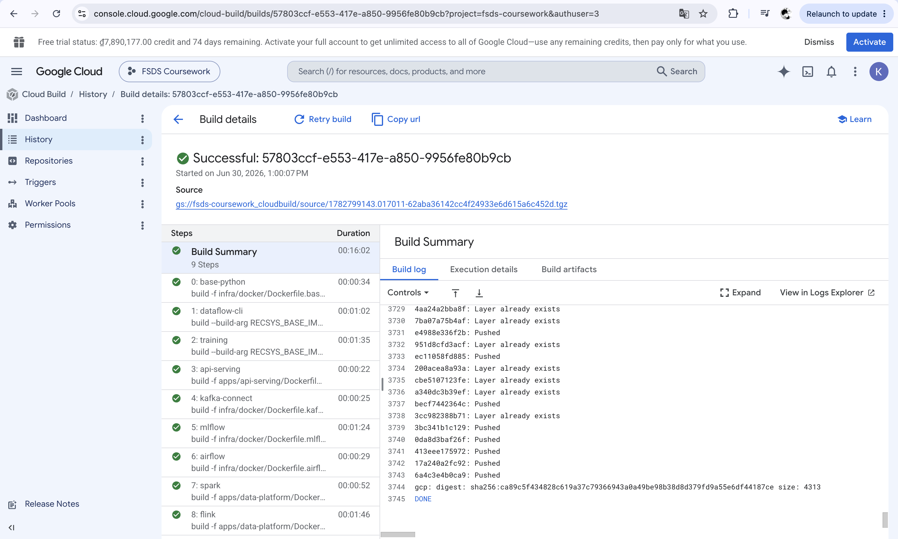
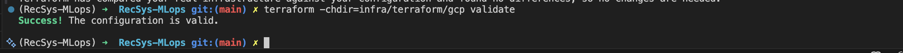
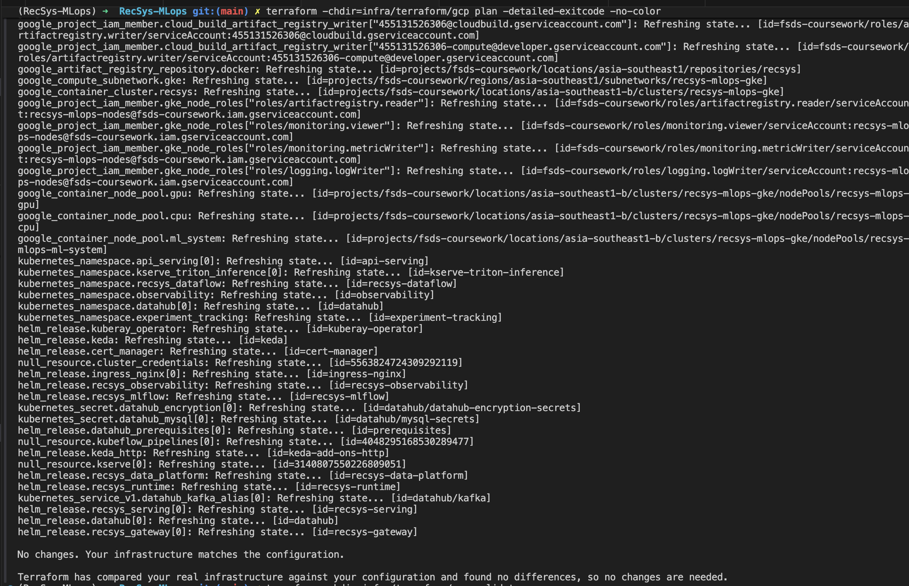
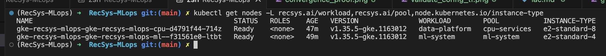
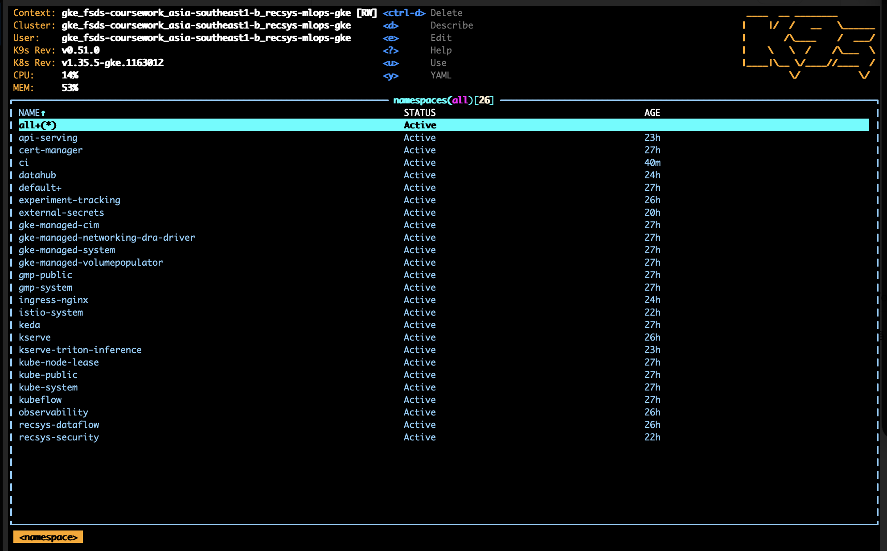
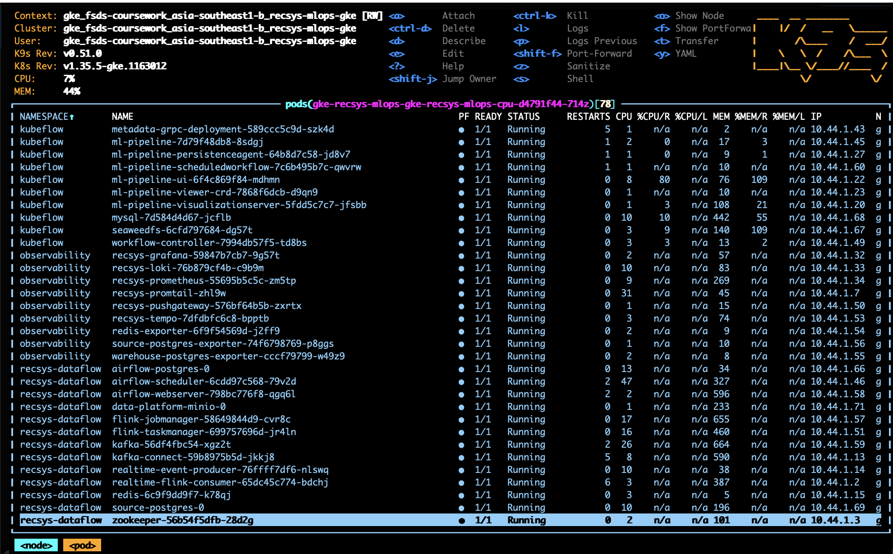
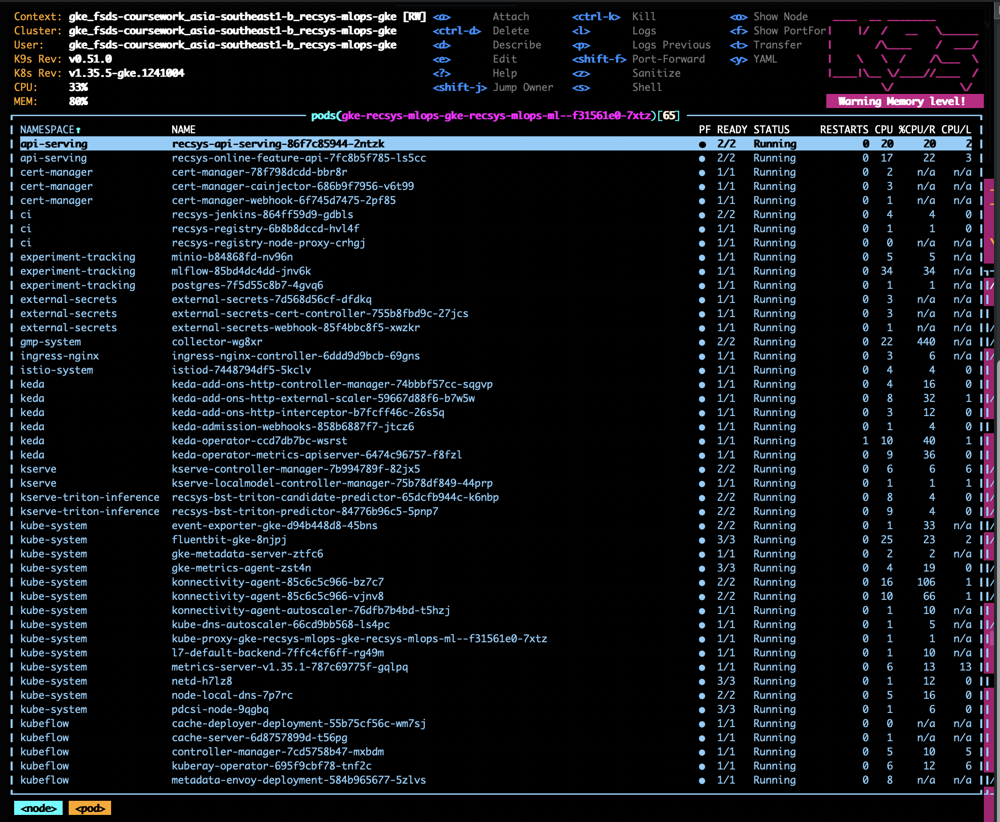
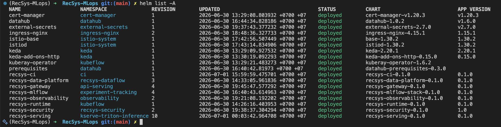

# Infrastructure As Code Proof: RecSys MLOps On GCP

This document records the final Infrastructure as Code setup deployed to Google Cloud for the coursework project.

## Target Project

- GCP project: `fsds-coursework`
- Project number: `455131526306`
- Region: `asia-southeast1`
- Zone: `asia-southeast1-b`
- GKE cluster: `recsys-mlops-gke`
- Artifact Registry: `asia-southeast1-docker.pkg.dev/fsds-coursework/recsys`

## IaC Layout

The IaC is split by cloud resource and application service boundary:

```text
infra/
  cloudbuild/
    recsys-images.yaml          # Cloud Build image pipeline, no local Docker dependency
  helm/
    datahub-local/              # DataHub values for GKE deployment
    mlflow-stack/               # MLflow, MinIO model store, Postgres
    recsys-ci/                  # Jenkins CI controller and in-cluster registry
    recsys-data-platform/       # Kafka, Redis, MinIO, Flink, Airflow, Postgres
    recsys-gateway/             # Ingress for API serving
    recsys-observability/       # Prometheus, Grafana, Loki, Tempo, exporters
    recsys-runtime/             # Kubeflow/KFP runtime resources
    recsys-security/            # Istio mTLS and service-to-service authorization policies
    recsys-serving/             # KServe, Triton, FastAPI serving
  terraform/gcp/
    apis.tf                     # Required Google APIs
    cloudbuild.tf               # Cloud Build IAM
    datahub.tf                  # DataHub secrets, Kafka alias, Helm releases
    gke.tf                      # GKE cluster and node pools
    locals.tf                   # image paths, node placement, Helm overrides
    namespaces.tf               # Kubernetes namespaces
    network.tf                  # VPC and subnet
    registry_storage.tf         # Artifact Registry and GCS buckets
    recsys_services.tf          # Helm releases for the RecSys stack
    variables.tf                # deployment toggles and node sizing
```

Terraform provisions the cloud resources, installs required controllers, creates namespaces, and deploys local Helm charts. This makes the setup reproducible from IaC instead of relying on manual Kubernetes setup.

## Cloud Build Image Proof

Images were built on GCP Cloud Build, not local Docker.

```bash
gcloud builds submit \
  --config infra/cloudbuild/recsys-images.yaml \
  --project fsds-coursework
```

Observed build:

```text
id: 57803ccf-e553-417e-a850-9956fe80b9cb
status: SUCCESS
startTime: 2026-06-30T06:00:07.928564650Z
finishTime: 2026-06-30T06:16:09.428610Z
logUrl: https://console.cloud.google.com/cloud-build/builds/57803ccf-e553-417e-a850-9956fe80b9cb?project=455131526306
```

Images pushed with tag `gcp`:

```text
recsys-base-python:gcp      sha256:d16b1f10d013ff9a92ec3f2a2ed4bc9cf062fb378916c84dcbfe8eda69098033
recsys-dataflow-cli:gcp     sha256:b4773a4da53632965a5c6d2e8b7567c1c2da55a6d9d0ca8774fa7531bef2720d
recsys-mlops-training:gcp   sha256:f411e3a3e8255d07d32445d568f741d1c1e1e461f63a88a9a871dc3b12a823d9
recsys-api-serving:gcp      sha256:897999283cf5918f3cf5f421e481b77c4e76fa348ee209369c438f5531b8ded0
recsys-kafka-connect:gcp    sha256:46b24a01b916f561e5e7ea28a750391e380e558fc1fe3272b088bff5e60dfe14
recsys-mlflow:gcp           sha256:fe22a1575c28c42e987e1587e67c6607cbe064da5a91064a822ab9a08c117510
recsys-airflow:gcp          sha256:d1b02369c910f478b4e1ee8e08a12dee07f3be54f9fd3d4634339fde90e262f7
recsys-spark:gcp            sha256:98c30e2c9562b7150e530782ebf53a302d3b6bc99dab90d555abcfb253608b60
recsys-flink:gcp            sha256:ca89c5f434828c619a37c79366943a0a49be98b38d8d379fd9a55e6df44187ce
```

### Image Proof




## Terraform Proof

Terraform was applied from `infra/terraform/gcp` against project `fsds-coursework`.

Validation:

```bash
terraform -chdir=infra/terraform/gcp validate
```

Observed result:

```text
Success! The configuration is valid.
```

### Image proof



Final convergence check:

```bash
terraform -chdir=infra/terraform/gcp plan -detailed-exitcode -no-color
```

Observed result:

```text
No changes. Your infrastructure matches the configuration.

Terraform has compared your real infrastructure against your configuration
and found no differences, so no changes are needed.
```

### Image proof 



## GKE Node Split

The cluster is intentionally split into two active node pools:

```bash
kubectl get nodes -L recsys.ai/workload,recsys.ai/pool,node.kubernetes.io/instance-type
```

Observed result:

```text
NAME                                                  STATUS   VERSION               WORKLOAD        POOL           INSTANCE-TYPE
gke-recsys-mlops-gke-recsys-mlops-cpu-d4791f44-714z   Ready    v1.35.5-gke.1163012   data-platform   cpu-services   e2-standard-8
gke-recsys-mlops-gke-recsys-mlops-ml--f31561e0-ltbt   Ready    v1.35.5-gke.1163012   ml-system       ml-system      e2-standard-4
```

Node meaning:

| Node pool | Node role | What runs there | Why it matters |
| --- | --- | --- | --- |
| `cpu-services` | Data platform, platform controllers, and observability | DataHub, Kafka, Kafka Connect, Redis, Flink, Airflow, source Postgres, data-platform MinIO, Kubeflow Pipelines, KServe controllers, KEDA, cert-manager, ingress-nginx, Prometheus, Grafana, Loki, Tempo, exporters | This node proves the data platform and monitoring/control plane are running on GKE compute. |
| `ml-system` | ML runtime and serving | MLflow, MLflow MinIO model store, MLflow Postgres, FastAPI API serving, KServe/Triton predictor | This tainted node isolates model-serving and experiment-tracking workloads from the heavier data platform services. |

The `ml-system` node pool has a taint:

```text
recsys.ai/workload=ml-system:NoSchedule
```

Only workloads with the matching toleration and node selector are scheduled there. This is why API serving, MLflow, MinIO model store, Postgres, and Triton are placed on the ML node.

Some Kubernetes and GKE DaemonSet pods run on both nodes, such as logging, metrics, networking, DNS, storage, and metadata agents. That is expected for per-node system services.

### Image Proof



### All Services's Namespace up and running on GCP



Namespace meaning:

| Namespace | Purpose | Main workloads/services |
| --- | --- | --- |
| `api-serving` | Public/API serving layer for online feature lookup and recommendation inference orchestration. Istio injection is enabled here. | FastAPI `recsys-online-feature-api`, FastAPI `recsys-api-serving`, RecSys API ingress/gateway resources, KEDA HTTP autoscaling target. |
| `kserve-triton-inference` | Model inference runtime layer. Istio injection is enabled here. | KServe `InferenceService`, Triton predictor pod, Triton HTTP/gRPC services, MinIO model-store service account/secret. |
| `experiment-tracking` | ML experiment tracking and model registry/storage layer. Istio injection is enabled here. | MLflow, MLflow MinIO model store, MLflow Postgres, model-store bucket initialization job. |
| `recsys-dataflow` | Data platform and feature pipeline runtime. Istio injection is enabled here. | Kafka, Zookeeper, Kafka Connect, Redis online store, Flink, Airflow, source Postgres, data-platform MinIO, realtime producer/consumer. |
| `datahub` | Metadata governance and lineage layer. | DataHub frontend, DataHub GMS, OpenSearch, MySQL prerequisites, `kafka` ExternalName alias to the data platform Kafka service. |
| `ci` | CI/CD execution layer for coursework proof runs. | Jenkins controller, Docker-in-Docker sidecar, in-cluster Docker registry, registry node proxy, Jenkins home PVC, registry PVC. |
| `observability` | Metrics, logs, traces, and ML/data monitoring layer. Istio injection is enabled here. | Prometheus, Grafana, Loki, Tempo, Promtail, PushGateway, Redis/Postgres exporters. |
| `kubeflow` | ML workflow orchestration layer. | Kubeflow Pipelines API/UI/controllers, workflow controller, KubeRay operator, metadata services, MySQL, SeaweedFS. |
| `istio-system` | Service mesh control plane. | `istiod`, Istio base CRDs/webhooks, sidecar injection and mTLS control plane. |
| `recsys-security` | RecSys security policy release namespace. | Helm release that installs Istio `PeerAuthentication` and `AuthorizationPolicy` resources for service-to-service authorization. |
| `ingress-nginx` | External HTTP/HTTPS entrypoint. | NGINX ingress controller LoadBalancer with external IP `34.21.171.234`. |
| `keda` | Event-driven autoscaling layer. | KEDA operator, KEDA HTTP add-on controller/interceptor/scaler. |
| `cert-manager` | Certificate and webhook support layer. | cert-manager controller, cainjector, and webhook used by platform controllers such as KServe. |
| `kserve` | KServe controller namespace. | KServe controller manager and local model controller. Sidecar injection is disabled for the controller namespace to keep control-plane webhooks stable. |
| `gmp-system` / `gmp-public` | Google Managed Prometheus system namespaces. | GKE/GMP collectors and operator-managed monitoring components. |
| `kube-system` and other `gke-managed-*` namespaces | GKE-managed cluster system namespaces. | DNS, networking, CSI storage, metadata server, logging/metrics agents, node system DaemonSets. |

### Node cpu-services 



### Node ml-system



## Helm Release Proof

```bash
helm list -A
```

Observed deployed releases:

```text
cert-manager          cert-manager             deployed
datahub               datahub                  deployed
ingress-nginx         ingress-nginx            deployed
keda                  keda                     deployed
keda-add-ons-http     keda                     deployed
istio-base            istio-system             deployed
istiod                istio-system             deployed
kuberay-operator      kubeflow                 deployed
prerequisites         datahub                  deployed
recsys-data-platform  recsys-dataflow          deployed
recsys-gateway        api-serving              deployed
recsys-mlflow         experiment-tracking      deployed
recsys-observability  observability            deployed
recsys-runtime        kubeflow                 deployed
recsys-security       recsys-security          deployed
recsys-serving        kserve-triton-inference  deployed
```

This proves the full coursework MLOps stack is installed through Terraform-managed Helm releases, including DataHub, data platform, observability, runtime, gateway, service mesh, API serving, and KServe/Triton.

### Image Proof




