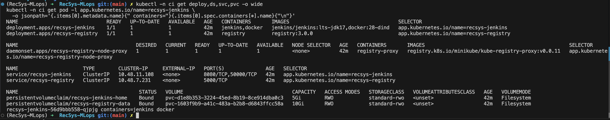
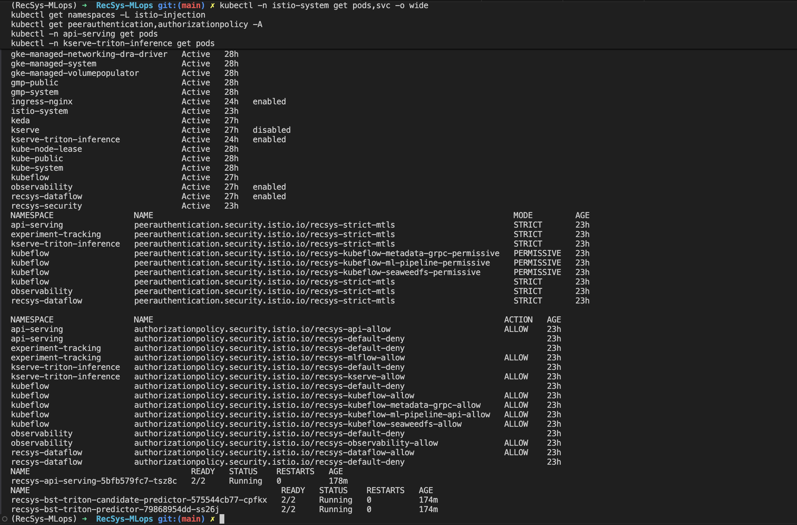
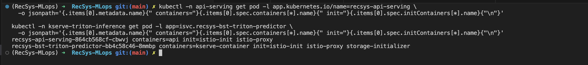
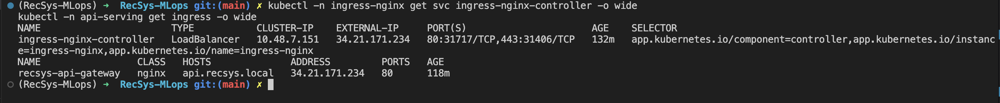
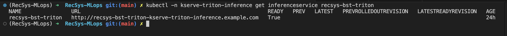
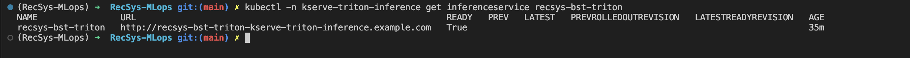

# Infrastructure As Code Proof: RecSys MLOps On GCP

This document records the final Infrastructure as Code setup deployed to Google Cloud for the coursework project.

## Target Project

- GCP project: `fsds-coursework`
- Project number: `455131526306`
- Region: `asia-southeast1`
- Zone: `asia-southeast1-b`
- GKE cluster: `recsys-mlops-gke`
- Artifact Registry: `asia-southeast1-docker.pkg.dev/fsds-coursework/recsys`

## IaC Layout

The IaC is split by cloud resource and application service boundary:

```text
infra/
  cloudbuild/
    recsys-images.yaml          # Cloud Build image pipeline, no local Docker dependency
  helm/
    datahub-local/              # DataHub values for GKE deployment
    mlflow-stack/               # MLflow, MinIO model store, Postgres
    recsys-ci/                  # Jenkins CI controller and in-cluster registry
    recsys-data-platform/       # Kafka, Redis, MinIO, Flink, Airflow, Postgres
    recsys-gateway/             # Ingress for API serving
    recsys-observability/       # Prometheus, Grafana, Loki, Tempo, exporters
    recsys-runtime/             # Kubeflow/KFP runtime resources
    recsys-security/            # Istio mTLS and service-to-service authorization policies
    recsys-serving/             # KServe, Triton, FastAPI serving
  terraform/gcp/
    apis.tf                     # Required Google APIs
    cloudbuild.tf               # Cloud Build IAM
    datahub.tf                  # DataHub secrets, Kafka alias, Helm releases
    gke.tf                      # GKE cluster and node pools
    locals.tf                   # image paths, node placement, Helm overrides
    namespaces.tf               # Kubernetes namespaces
    network.tf                  # VPC and subnet
    registry_storage.tf         # Artifact Registry and GCS buckets
    recsys_services.tf          # Helm releases for the RecSys stack
    variables.tf                # deployment toggles and node sizing
```

Terraform provisions the cloud resources, installs required controllers, creates namespaces, and deploys local Helm charts. This makes the setup reproducible from IaC instead of relying on manual Kubernetes setup.

## Cloud Build Image Proof

Images were built on GCP Cloud Build, not local Docker.

```bash
gcloud builds submit \
  --config infra/cloudbuild/recsys-images.yaml \
  --project fsds-coursework
```

Observed build:

```text
id: 57803ccf-e553-417e-a850-9956fe80b9cb
status: SUCCESS
startTime: 2026-06-30T06:00:07.928564650Z
finishTime: 2026-06-30T06:16:09.428610Z
logUrl: https://console.cloud.google.com/cloud-build/builds/57803ccf-e553-417e-a850-9956fe80b9cb?project=455131526306
```

Images pushed with tag `gcp`:

```text
recsys-base-python:gcp      sha256:d16b1f10d013ff9a92ec3f2a2ed4bc9cf062fb378916c84dcbfe8eda69098033
recsys-dataflow-cli:gcp     sha256:b4773a4da53632965a5c6d2e8b7567c1c2da55a6d9d0ca8774fa7531bef2720d
recsys-mlops-training:gcp   sha256:f411e3a3e8255d07d32445d568f741d1c1e1e461f63a88a9a871dc3b12a823d9
recsys-api-serving:gcp      sha256:897999283cf5918f3cf5f421e481b77c4e76fa348ee209369c438f5531b8ded0
recsys-kafka-connect:gcp    sha256:46b24a01b916f561e5e7ea28a750391e380e558fc1fe3272b088bff5e60dfe14
recsys-mlflow:gcp           sha256:fe22a1575c28c42e987e1587e67c6607cbe064da5a91064a822ab9a08c117510
recsys-airflow:gcp          sha256:d1b02369c910f478b4e1ee8e08a12dee07f3be54f9fd3d4634339fde90e262f7
recsys-spark:gcp            sha256:98c30e2c9562b7150e530782ebf53a302d3b6bc99dab90d555abcfb253608b60
recsys-flink:gcp            sha256:ca89c5f434828c619a37c79366943a0a49be98b38d8d379fd9a55e6df44187ce
```

### Image Proof


## Terraform Proof

Terraform was applied from `infra/terraform/gcp` against project `fsds-coursework`.

Validation:

```bash
terraform -chdir=infra/terraform/gcp validate
```

Observed result:

```text
Success! The configuration is valid.
```

### Image proof


Final convergence check:

```bash
terraform -chdir=infra/terraform/gcp plan -detailed-exitcode -no-color
```

Observed result:

```text
No changes. Your infrastructure matches the configuration.

Terraform has compared your real infrastructure against your configuration
and found no differences, so no changes are needed.
```

### Image proof 


## GKE Node Split

The cluster is intentionally split into two active node pools:

```bash
kubectl get nodes -L recsys.ai/workload,recsys.ai/pool,node.kubernetes.io/instance-type
```

Observed result:

```text
NAME                                                  STATUS   VERSION               WORKLOAD        POOL           INSTANCE-TYPE
gke-recsys-mlops-gke-recsys-mlops-cpu-d4791f44-714z   Ready    v1.35.5-gke.1163012   data-platform   cpu-services   e2-standard-8
gke-recsys-mlops-gke-recsys-mlops-ml--f31561e0-ltbt   Ready    v1.35.5-gke.1163012   ml-system       ml-system      e2-standard-4
```

Node meaning:

| Node pool | Node role | What runs there | Why it matters |
| --- | --- | --- | --- |
| `cpu-services` | Data platform, platform controllers, and observability | DataHub, Kafka, Kafka Connect, Redis, Flink, Airflow, source Postgres, data-platform MinIO, Kubeflow Pipelines, KServe controllers, KEDA, cert-manager, ingress-nginx, Prometheus, Grafana, Loki, Tempo, exporters | This node proves the data platform and monitoring/control plane are running on GKE compute. |
| `ml-system` | ML runtime and serving | MLflow, MLflow MinIO model store, MLflow Postgres, FastAPI API serving, KServe/Triton predictor | This tainted node isolates model-serving and experiment-tracking workloads from the heavier data platform services. |

The `ml-system` node pool has a taint:

```text
recsys.ai/workload=ml-system:NoSchedule
```

Only workloads with the matching toleration and node selector are scheduled there. This is why API serving, MLflow, MinIO model store, Postgres, and Triton are placed on the ML node.

Some Kubernetes and GKE DaemonSet pods run on both nodes, such as logging, metrics, networking, DNS, storage, and metadata agents. That is expected for per-node system services.

### Image Proof


### All Services's Namespace up and running on GCP


Namespace meaning:

| Namespace | Purpose | Main workloads/services |
| --- | --- | --- |
| `api-serving` | Public/API serving layer for online feature lookup and recommendation inference orchestration. Istio injection is enabled here. | FastAPI `recsys-online-feature-api`, FastAPI `recsys-api-serving`, RecSys API ingress/gateway resources, KEDA HTTP autoscaling target. |
| `kserve-triton-inference` | Model inference runtime layer. Istio injection is enabled here. | KServe `InferenceService`, Triton predictor pod, Triton HTTP/gRPC services, MinIO model-store service account/secret. |
| `experiment-tracking` | ML experiment tracking and model registry/storage layer. Istio injection is enabled here. | MLflow, MLflow MinIO model store, MLflow Postgres, model-store bucket initialization job. |
| `recsys-dataflow` | Data platform and feature pipeline runtime. Istio injection is enabled here. | Kafka, Zookeeper, Kafka Connect, Redis online store, Flink, Airflow, source Postgres, data-platform MinIO, realtime producer/consumer. |
| `datahub` | Metadata governance and lineage layer. | DataHub frontend, DataHub GMS, OpenSearch, MySQL prerequisites, `kafka` ExternalName alias to the data platform Kafka service. |
| `ci` | CI/CD execution layer for coursework proof runs. | Jenkins controller, Docker-in-Docker sidecar, in-cluster Docker registry, registry node proxy, Jenkins home PVC, registry PVC. |
| `observability` | Metrics, logs, traces, and ML/data monitoring layer. Istio injection is enabled here. | Prometheus, Grafana, Loki, Tempo, Promtail, PushGateway, Redis/Postgres exporters. |
| `kubeflow` | ML workflow orchestration layer. | Kubeflow Pipelines API/UI/controllers, workflow controller, KubeRay operator, metadata services, MySQL, SeaweedFS. |
| `istio-system` | Service mesh control plane. | `istiod`, Istio base CRDs/webhooks, sidecar injection and mTLS control plane. |
| `recsys-security` | RecSys security policy release namespace. | Helm release that installs Istio `PeerAuthentication` and `AuthorizationPolicy` resources for service-to-service authorization. |
| `ingress-nginx` | External HTTP/HTTPS entrypoint. | NGINX ingress controller LoadBalancer with external IP `34.21.171.234`. |
| `keda` | Event-driven autoscaling layer. | KEDA operator, KEDA HTTP add-on controller/interceptor/scaler. |
| `cert-manager` | Certificate and webhook support layer. | cert-manager controller, cainjector, and webhook used by platform controllers such as KServe. |
| `kserve` | KServe controller namespace. | KServe controller manager and local model controller. Sidecar injection is disabled for the controller namespace to keep control-plane webhooks stable. |
| `gmp-system` / `gmp-public` | Google Managed Prometheus system namespaces. | GKE/GMP collectors and operator-managed monitoring components. |
| `kube-system` and other `gke-managed-*` namespaces | GKE-managed cluster system namespaces. | DNS, networking, CSI storage, metadata server, logging/metrics agents, node system DaemonSets. |

### Node cpu-services 


### Node ml-system


## Helm Release Proof

```bash
helm list -A
```

Observed deployed releases:

```text
cert-manager          cert-manager             deployed
datahub               datahub                  deployed
ingress-nginx         ingress-nginx            deployed
keda                  keda                     deployed
keda-add-ons-http     keda                     deployed
istio-base            istio-system             deployed
istiod                istio-system             deployed
kuberay-operator      kubeflow                 deployed
prerequisites         datahub                  deployed
recsys-data-platform  recsys-dataflow          deployed
recsys-gateway        api-serving              deployed
recsys-mlflow         experiment-tracking      deployed
recsys-observability  observability            deployed
recsys-runtime        kubeflow                 deployed
recsys-security       recsys-security          deployed
recsys-serving        kserve-triton-inference  deployed
```

This proves the full coursework MLOps stack is installed through Terraform-managed Helm releases, including DataHub, data platform, observability, runtime, gateway, service mesh, API serving, and KServe/Triton.

### Image Proof


## Jenkins CI/CD Component Proof

Jenkins is documented as the CI/CD component of the IaC stack. The chart lives in
`infra/helm/recsys-ci` and installs:

| Component | Kubernetes object | Purpose |
|---|---|---|
| Jenkins controller | `deployment/recsys-jenkins` | Runs the `Jenkinsfile` pipeline: detect changed components, test, build, and deploy. |
| Docker-in-Docker sidecar | container `docker` inside the Jenkins pod | Builds component images inside the cluster instead of relying on local Docker. |
| In-cluster registry | `deployment/recsys-registry`, `service/recsys-registry` | Stores images built by Jenkins proof runs. |
| Registry node proxy | `daemonset/recsys-registry-node-proxy` | Exposes the registry on each node so kubelet can pull proof-run images. |
| Jenkins PVC | `pvc/recsys-jenkins-home` | Persists Jenkins jobs, credentials metadata, and build history. |
| Registry PVC | `pvc/recsys-registry-data` | Persists pushed proof-run images. |

Install/upgrade command:

```bash
helm upgrade --install recsys-ci infra/helm/recsys-ci \
  --namespace ci \
  --create-namespace \
  --values infra/helm/recsys-ci/values-gke.yaml \
  --wait
```

Runtime proof commands:

```bash
kubectl -n ci get deploy,ds,svc,pvc -o wide
kubectl -n ci get pod -l app.kubernetes.io/name=recsys-jenkins \
  -o jsonpath='{.items[0].metadata.name}{" containers="}{.items[0].spec.containers[*].name}{"\n"}'
```

Expected result:

```text
deployment.apps/recsys-jenkins         READY 1/1
deployment.apps/recsys-registry        READY 1/1
daemonset.apps/recsys-registry-node-proxy
service/recsys-jenkins                 ClusterIP 8080/TCP,50000/TCP
service/recsys-registry                ClusterIP 5000/TCP
persistentvolumeclaim/recsys-jenkins-home
persistentvolumeclaim/recsys-registry-data

recsys-jenkins-... containers=jenkins docker
```

This proves the coursework CI/CD system is also reproducible from Helm IaC. The
pipeline-level proof for `test -> build -> deploy` is documented separately in
[ci_cd.md](ci_cd.md).

### Image Proof



## Service Mesh Proof

Istio and the RecSys security chart are deployed by Terraform:

```bash
kubectl -n istio-system get pods,svc -o wide
kubectl get namespaces -L istio-injection
kubectl get peerauthentication,authorizationpolicy -A
kubectl -n api-serving get pods
kubectl -n kserve-triton-inference get pods
```

Observed result:

```text
pod/istiod-6fdc665455-tpbvd   1/1 Running
service/istiod                ClusterIP   15010/TCP,15012/TCP,443/TCP,15014/TCP

api-serving                 istio-injection=enabled
experiment-tracking         istio-injection=enabled
kserve-triton-inference     istio-injection=enabled
observability               istio-injection=enabled
recsys-dataflow             istio-injection=enabled

api-serving                 recsys-strict-mtls                         STRICT
experiment-tracking         recsys-strict-mtls                         STRICT
kserve-triton-inference     recsys-strict-mtls                         STRICT
kubeflow                    recsys-strict-mtls                         STRICT
observability               recsys-strict-mtls                         STRICT
recsys-dataflow             recsys-strict-mtls                         STRICT

api-serving                 recsys-api-allow                           ALLOW
experiment-tracking         recsys-mlflow-allow                        ALLOW
kserve-triton-inference     recsys-kserve-allow                        ALLOW
kubeflow                    recsys-kubeflow-allow                      ALLOW
observability               recsys-observability-allow                 ALLOW
recsys-dataflow             recsys-dataflow-allow                      ALLOW

recsys-api-serving-864cb568cf-cbwvj                  2/2 Running
recsys-bst-triton-predictor-bb4c58c46-8mmbp          2/2 Running
```

### Image proof



Sidecar container proof:

```bash
kubectl -n api-serving get pod -l app.kubernetes.io/name=recsys-api-serving \
  -o jsonpath='{.items[0].metadata.name}{" containers="}{.items[0].spec.containers[*].name}{" init="}{.items[0].spec.initContainers[*].name}{"\n"}'

kubectl -n kserve-triton-inference get pod -l app=isvc.recsys-bst-triton-predictor \
  -o jsonpath='{.items[0].metadata.name}{" containers="}{.items[0].spec.containers[*].name}{" init="}{.items[0].spec.initContainers[*].name}{"\n"}'
```

Observed result:

```text
recsys-api-serving-864cb568cf-cbwvj containers=api init=istio-init istio-proxy
recsys-bst-triton-predictor-bb4c58c46-8mmbp containers=kserve-container init=istio-init istio-proxy storage-initializer
```

### Image proof



The service mesh proof covers the final-coursework security rubric item: service-to-service authorization is defined with Istio `PeerAuthentication` and `AuthorizationPolicy`, and API serving plus Triton predictor pods are running with Istio sidecars. Centralized secret management is handled by External Secrets Operator and `ClusterSecretStore/recsys-central-secrets`; see [security.md](security.md) for the dedicated proof.


## Service Placement Proof

Observed service placement from `kubectl get pods -A -o wide`:

| Namespace | Service group | Status | Node |
| --- | --- | --- | --- |
| `ci` | Jenkins controller, Docker sidecar, in-cluster registry, registry node proxy | `Running`, PVCs `Bound` | `cpu-services` |
| `datahub` | DataHub frontend, DataHub GMS, OpenSearch, MySQL | `Running`, init job `Completed` | `cpu-services` |
| `recsys-dataflow` | Kafka, Kafka Connect, Redis, Flink, Airflow, MinIO, source Postgres, Zookeeper | `Running` | `cpu-services` |
| `observability` | Grafana, Loki, Prometheus, Tempo, Pushgateway, exporters, Promtail | `Running` | `cpu-services` |
| `kubeflow` | Kubeflow Pipelines, workflow controller, KubeRay operator, metadata services | `Running` | `cpu-services` |
| `api-serving` | `recsys-online-feature-api` and `recsys-api-serving` with Istio sidecars | `2/2 Running` per pod | `ml-system` |
| `experiment-tracking` | MLflow, MinIO model store, Postgres | `Running`, bucket init job `Completed` | `ml-system` |
| `kserve-triton-inference` | `recsys-bst-triton` control and `recsys-bst-triton-candidate` Triton predictors with Istio sidecars | `2/2 Running` | `ml-system` |

Gateway and ingress proof:

```bash
kubectl -n ingress-nginx get svc ingress-nginx-controller -o wide
kubectl -n api-serving get ingress -o wide
```

Observed result:

```text
ingress-nginx-controller   LoadBalancer   34.21.171.234   80:31717/TCP,443:31406/TCP
recsys-api-gateway         nginx          api.recsys.local 34.21.171.234   80, 443
```

### Image proof



## DataHub Proof

```bash
kubectl -n datahub get svc,pods -o wide
```

Observed result:

```text
pod/datahub-datahub-frontend   1/1 Running
pod/datahub-datahub-gms        1/1 Running
pod/datahub-system-update      Completed
pod/opensearch-cluster-master  1/1 Running
pod/prerequisites-mysql        1/1 Running

service/datahub-datahub-frontend  ClusterIP  9002/TCP
service/datahub-datahub-gms       ClusterIP  8080/TCP
service/kafka                     ExternalName kafka.recsys-dataflow.svc.cluster.local
```

DataHub is connected to the data platform Kafka through an `ExternalName` service alias in the `datahub` namespace.

### Image proof 


## API Serving And Triton Proof

KServe/Triton readiness:

```bash
kubectl -n kserve-triton-inference get inferenceservice recsys-bst-triton
```

Observed result:

```text
NAME                URL                                                            READY
recsys-bst-triton   http://recsys-bst-triton-kserve-triton-inference.example.com   True
```

### Image proof



Triton model load proof:

```text
Model        Version   Status
bst_ensemble 1         READY

Started GRPCInferenceService at 0.0.0.0:9000
Started HTTPService at 0.0.0.0:8080
```
### Image proof 



End-to-end API proof:

Online feature API proof:

```bash
kubectl -n api-serving exec deploy/recsys-online-feature-api -c api -- \
  python -c 'import json, urllib.request; data=json.dumps({"user_id":1,"candidate_item_ids":[101,202,303],"top_k":3}).encode(); req=urllib.request.Request("http://127.0.0.1:8080/online-features", data=data, headers={"Content-Type":"application/json"}, method="POST"); print(urllib.request.urlopen(req, timeout=10).read().decode())'
```

This proves the split online feature API can pull Feast online features from Redis. In this project, BigQuery is the Feast core offline store and Redis is the Feast online store.

Recommendation API proof:

```bash
kubectl -n api-serving exec deploy/recsys-api-serving -c api -- \
  python -c 'import json, urllib.request; data=json.dumps({"user_id":1,"candidate_item_ids":[101,202,303],"top_k":3}).encode(); req=urllib.request.Request("http://127.0.0.1:8080/recommendations", data=data, headers={"Content-Type":"application/json"}, method="POST"); print(urllib.request.urlopen(req, timeout=20).read().decode())'
```

Observed response:

```json
{
  "user_id": 1,
  "model_version": "stable-001",
  "ab_variant": "control",
  "ab_experiment_id": "bst-stable-vs-candidate-20260630",
  "items": [
    {"item_id": 101, "score": 1.0010099411010742},
    {"item_id": 202, "score": 0.6686866283416748},
    {"item_id": 303, "score": 0.3363633155822754}
  ]
}
```

This proves the deployed recommendation API can call `recsys-online-feature-api` for online features and then call the Triton inference service successfully inside GKE.

### Image proof


## Rubric Runtime Coverage

The runtime checklist below is based on the workbook sheets `rubic (mini-coursework)` and `rubic final-coursework (final -` in `docs/xlsx/Coursework Tracking (Public).xlsx`.

| Rubric area | Deployable component | Runtime proof |
| --- | --- | --- |
| Mini-coursework data generation and source systems | Source Postgres, data-platform MinIO | `recsys-dataflow/source-postgres-0` and `recsys-dataflow/data-platform-minio-0` are `Running`. |
| Mini-coursework batch processing | Airflow, Spark image/runtime config, data pipeline DAGs | `airflow-webserver`, `airflow-scheduler`, and `airflow-postgres` are `Running`; Spark image was built by Cloud Build. |
| Mini-coursework streaming processing | Kafka, Zookeeper, Flink JobManager/TaskManager, realtime producer/consumer | All `recsys-dataflow` Kafka/Flink/realtime pods are `1/1 Running`. |
| Mini-coursework governance | DataHub frontend/GMS, OpenSearch, MySQL, Kafka alias | DataHub pods are `Running`; `service/kafka` is an `ExternalName` to `kafka.recsys-dataflow.svc.cluster.local`. |
| Final-coursework CI/CD runner | Jenkins and in-cluster registry | `recsys-jenkins` and `recsys-registry` run in namespace `ci`; Jenkins executes the `Jenkinsfile` test/build/deploy stages. |
| Final-coursework Web API kéo dữ liệu | FastAPI `recsys-online-feature-api` | Online feature API pod is `2/2 Running` with Istio sidecar; `/online-features` pulls Feast online features from Redis by `user_id`/candidate ids. |
| Final-coursework Web API model prediction | FastAPI `recsys-api-serving` recommendation API | Recommendation API pod is `2/2 Running` with Istio sidecar; `/recommendations` calls `recsys-online-feature-api`, sends payload to Triton, and returns ranked items. |
| Final-coursework Web API drift detection | FastAPI drift/recommendation API path | This rubric item maps to the real-time API path plus drift observability; the service exposes health/readiness endpoints and emits metrics/traces for online recommendation traffic. |
| Final-coursework inference engine | KServe InferenceService and Triton predictor | Triton pod is `2/2 Running` with Istio sidecar; `recsys-bst-triton` is `READY=True`; Triton logs show `bst_ensemble` model `READY`. |
| Final-coursework feature store and drift telemetry | Redis, Airflow materialize/drift DAG runtime, PushGateway/Grafana metrics path | Redis, Airflow, PushGateway, Prometheus, and Grafana are `Running`; these support the recommendation API with online features, drift metrics, dashboards, and retrain-trigger pipeline logic. |
| Final-coursework ML pipeline | Kubeflow Pipelines and KubeRay operator | Kubeflow pipeline API/UI/controllers and `kuberay-operator` are `Running`. |
| Final-coursework model registry/versioning | MLflow, MLflow MinIO, MLflow Postgres | `mlflow`, `minio`, and `postgres` in `experiment-tracking` are `Running`; model-store bucket init job is `Completed`. |
| Final-coursework CI/CD | Cloud Build image pipeline | Cloud Build build `57803ccf-e553-417e-a850-9956fe80b9cb` is `SUCCESS`; images are pushed to Artifact Registry. |
| Final-coursework autoscale | KEDA HTTPScaledObject and HPA | `httpscaledobject/recsys-api-serving-http` is `READY=True`; HPA targets `recsys-api-serving`. |
| Final-coursework gateway | ingress-nginx and RecSys API ingress | `ingress-nginx-controller` has LoadBalancer IP `34.21.171.234`; `recsys-api-gateway` routes `api.recsys.local`. |
| Final-coursework observability | Prometheus, Grafana, Loki, Tempo, Promtail, exporters | All observability pods are `1/1 Running`. |
| Final-coursework IaC | Terraform GCP modules and Helm releases | `terraform validate` succeeds and `terraform plan -detailed-exitcode` reports `No changes`. |
| Final-coursework security | Istio service mesh and RecSys authorization policies | `istiod` is `Running`; strict mTLS and allow policies are applied across API, MLflow, KServe, Kubeflow, observability, and dataflow namespaces. |

## Limitation

GPU nodes and the GPU Ray job are still disabled because the current GCP billing account rejects non-TPU accelerators on the free tier:

```text
Your billing account is currently in the free tier where non-TPU accelerators are not available.
Please upgrade to a paid billing account...
```

The deployed serving path therefore uses a CPU Triton profile:

```hcl
deploy_serving = true
deploy_gateway = true
deploy_datahub = true
deploy_ray_job = false
gpu_min_nodes  = 0
gpu_max_nodes  = 0
```

After billing is upgraded, the GPU path can be enabled by increasing the GPU node pool and re-enabling the Ray job in `terraform.tfvars`, then rerunning:

```bash
terraform -chdir=infra/terraform/gcp apply
```
