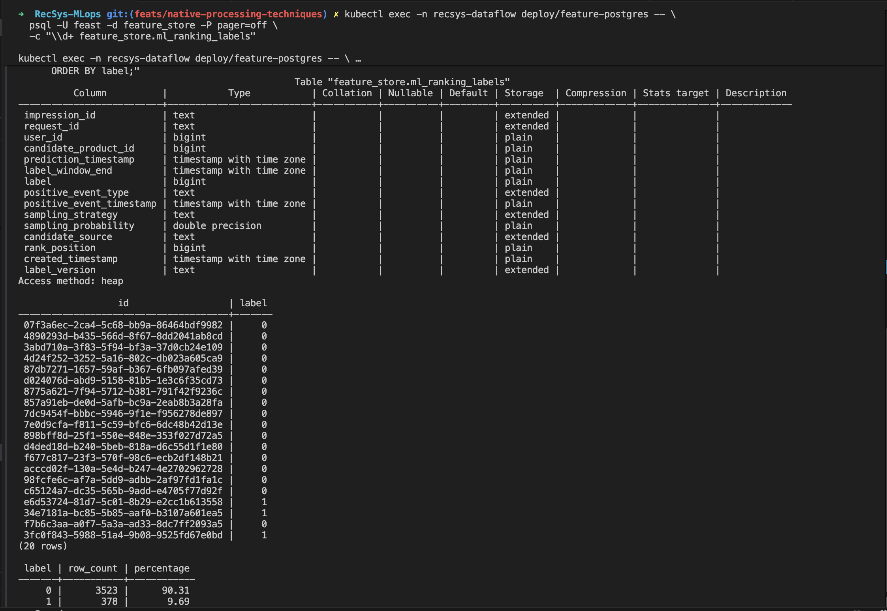

# Improve the data generator

## Simulate Data drift

This is an offline historical-generator scenario. It simulates a gradual increase in user purchase frequency, such as a seasonal sale, checkout improvement, or long-running promotion. The drift changes only the `cart -> purchase` probability; it does not directly change user/product cardinality or the view/cart probabilities.

```mermaid
flowchart LR
    A["data_generator_drift.yaml<br/>enabled + dates + multiplier"] --> B["CLI generate<br/>load_config"]
    B --> C["HistoricalDataPipeline"]
    C --> D["RecsysSimulation"]
    D --> E["DriftController<br/>phase + factor by simulated date"]
    E --> F["BehaviorContext"]
    F --> G["Purchase probability<br/>base probability × drift factor"]
    G --> H["Behavior events + orders<br/>drift metadata"]
    H --> I["Parquet historical dataset"]
    I --> J["DriftReporter<br/>daily features + PSI"]
    J --> K["Health metrics + drift alerts"]
```



### Implementation and trigger

1. [`data_generator_drift.yaml`](../../../configs/local/data_generator_drift.yaml#L27) enables `user_purchase_frequency` drift, defines `drift_start_date=2025-07-30`, selects gradual mode, raises the purchase-probability multiplier to `1.50`, and uses a 30-day ramp. The baseline is `2025-06-30..2025-07-29`.
2. [`cli.py`](../../../apps/data-platform/data-generator/src/cli.py#L31) loads that configuration. The `generate` subcommand starts [`HistoricalDataPipeline.run()`](../../../apps/data-platform/data-generator/src/cli.py#L33).
3. [`HistoricalDataPipeline`](../../../apps/data-platform/data-generator/src/offline/historical_pipeline.py#L25) constructs `RecsysSimulation` and generates the complete 150-day historical dataset in one run.
4. [`DriftController.get_factor()`](../../../apps/data-platform/data-generator/src/drift/controller.py#L16) returns `1.0` before the drift date. In gradual mode it linearly ramps from `1.0` to `1.50` over 30 simulated days; [`get_phase()`](../../../apps/data-platform/data-generator/src/drift/controller.py#L31) labels each timestamp as `pre_drift`, `baseline`, or `post_drift`.
5. [`RecsysSimulation`](../../../apps/data-platform/data-generator/src/offline/simulation.py#L308) puts the date-specific factor into `BehaviorContext`. [`BehaviorProbabilityModel.p_purchase()`](../../../apps/data-platform/data-generator/src/behavior.py#L56) multiplies only the purchase-after-cart probability by that factor, capped at `0.95`.
6. Generated behavior events and orders retain `drift_enabled`, `drift_scenario`, `drift_phase`, and `drift_factor` at [simulation.py lines 452-455](../../../apps/data-platform/data-generator/src/offline/simulation.py#L452) and [lines 500-503](../../../apps/data-platform/data-generator/src/offline/simulation.py#L500).
7. When drift is enabled, [`HistoricalDataPipeline`](../../../apps/data-platform/data-generator/src/offline/historical_pipeline.py#L65) invokes `DriftReporter`. It builds daily features, compares them with the configured baseline using PSI, and emits alerts when PSI crosses `0.15` after the drift start date at [reporting.py lines 142-159](../../../apps/data-platform/data-generator/src/drift/reporting.py#L142).

The effective trigger is therefore:

```text
drift.enabled = true
AND simulated event date >= drift_start_date
```

There is no separate cron or wall-clock trigger. The generator samples timestamps across the configured history, so one command creates pre-drift, baseline, ramp-up, and post-drift records. With the checked-in scenario, the factor evolves as follows:

| Simulated date | Phase | Purchase drift factor |
| --- | --- | ---: |
| Before `2025-07-30` | Pre-drift/baseline | `1.00` |
| `2025-07-30` | Ramp starts | `1.00` |
| `2025-08-14` | Mid-ramp | `1.25` |
| From `2025-08-29` | Full post-drift | `1.50` |

For a regular non-campaign purchase path with base probability `0.30`, the controlled change is approximately `0.30 -> 0.375 -> 0.45`. Existing product-price, user-segment, and campaign factors still apply before the drift factor.

### Generated evidence

After generation, the drift reporter writes:

```text
reports/user_daily_features.parquet
reports/drift_validation_report.csv
monitoring/agg_feature_health_daily.parquet
monitoring/feature_drift_alerts.parquet
```

Code reference:

- [data_generator_drift.yaml (line 27)](../../../configs/local/data_generator_drift.yaml#L27), [data_generator_drift.yaml (line 35)](../../../configs/local/data_generator_drift.yaml#L35): enables drift and defines the baseline/post-drift boundary.
- [controller.py (line 8)](../../../apps/data-platform/data-generator/src/drift/controller.py#L8), [controller.py (line 48)](../../../apps/data-platform/data-generator/src/drift/controller.py#L48), [reporting.py (line 71)](../../../apps/data-platform/data-generator/src/drift/reporting.py#L71), [reporting.py (line 197)](../../../apps/data-platform/data-generator/src/drift/reporting.py#L197): drift phase/factor, artifacts, health metrics, and alerts.
- [summarize_drift_label_merge.py (line 75)](../../../apps/data-platform/data-generator/src/scripts/summarize_drift_label_merge.py#L75), [summarize_drift_label_merge.py (line 206)](../../../apps/data-platform/data-generator/src/scripts/summarize_drift_label_merge.py#L206): configuration and drift-health proof tables.

Running command:

```bash
cd /Users/KHOAI/anhkhoa/RecSys-MLops

UV_CACHE_DIR=.uv-cache PYTHONPATH=apps/data-platform/data-generator/src uv run python apps/data-platform/data-generator/src/cli.py generate \
  --config configs/local/data_generator_drift.yaml

UV_CACHE_DIR=.uv-cache PYTHONPATH=apps/data-platform/data-generator/src uv run python apps/data-platform/data-generator/src/scripts/summarize_drift_label_merge.py \
  --config configs/local/data_generator_drift.yaml \
  | awk '
      /^## Generator Configuration/ {show=1}
      /^## Label Table/ {show=0}
      show {print}
    '
```

The first command triggers drift generation. The summary command does not generate or mutate data; it only reads the completed run and prints the drift-related proof tables.

Description of output when running command:

- The generator command creates run `drift_50k_seed42` with `1,000` users, `500` products, `150` history days, and `50,000` target behavior events.
- The filtered summary output shows only the drift-related proof tables.
- `Generator Configuration` has `14` configuration rows, including run id, seed, history window, drift scenario, drift start date, drift mode, multiplier, ramp-up days, and PSI threshold.
- `Drift Health Sample` has `5` rows for key dates: baseline start, baseline end, drift start, ramp-up end, and history end.
- The drift health table illustrates `feature_name`, `mean`, `psi_vs_baseline`, `drift_status`, and `drift_factor` for `f_user_purchase_count_90d`.

Image proof:


## PostgreSQL ML Ranking Label Table

The production label table is `feature_store.ml_ranking_labels`. Its training key-label projection is `impression_id AS id, label`, while the complete table retains the entity, prediction time, label window, positive-event evidence, sampling metadata, and version needed for reproducible point-in-time training.

`label=1` means the same user performed a `cart` or `purchase` on the candidate product after its impression and within the configured 24-hour window; otherwise `label=0`.

### Table schema

The PostgreSQL writer generates this equivalent schema from `TABLE_SCHEMAS["ml_ranking_labels"]`:

```sql
CREATE TABLE feature_store.ml_ranking_labels (
    impression_id              TEXT,
    request_id                 TEXT,
    user_id                    BIGINT,
    candidate_product_id       BIGINT,
    prediction_timestamp       TIMESTAMPTZ,
    label_window_end           TIMESTAMPTZ,
    label                      BIGINT,
    positive_event_type        TEXT,
    positive_event_timestamp   TIMESTAMPTZ,
    sampling_strategy          TEXT,
    sampling_probability       DOUBLE PRECISION,
    candidate_source           TEXT,
    rank_position              BIGINT,
    created_timestamp          TIMESTAMPTZ,
    label_version              TEXT
);
```

Schema reference: [`postgres_offline_store.py`](../../../apps/data-platform/src/feature_store/postgres_offline_store.py#L79) defines all columns and types; [`ensure_offline_store_tables()`](../../../apps/data-platform/src/feature_store/postgres_offline_store.py#L167) creates the schema/table and adds missing columns safely.

### Label creation and PostgreSQL export

```python
# Build one label row per impression candidate.
labels = build_ranking_labels(
    silver["clean_impressions"],
    silver["clean_behavior_events"],
    label_window_hours=features["label_window_hours"],  # 24 hours
)

# Export the generated label DataFrame to the Feast PostgreSQL offline store.
OFFLINE_STORE_TABLES = FEATURE_TABLES + ("ml_ranking_labels",)
ensure_offline_store_tables(conn, config.schema, OFFLINE_STORE_TABLES)
for table_name in OFFLINE_STORE_TABLES:
    frame = outputs[catalog.feature_table(table_name)].toPandas()
    insert_offline_rows(conn, config.schema, table_name, frame.to_dict("records"))
```

Code reference:

- [`build_ranking_labels.py`](../../../apps/data-platform/src/features/spark/build_ranking_labels.py#L6) joins impressions to later `cart`/`purchase` events in the 24-hour label window and emits `label` at [line 56](../../../apps/data-platform/src/features/spark/build_ranking_labels.py#L56).
- [`spark_batch_entrypoint.py`](../../../apps/data-platform/src/features/spark/spark_batch_entrypoint.py#L64) builds `ml_ranking_labels`; its PostgreSQL export loop creates and inserts every offline-store table at [line 102](../../../apps/data-platform/src/features/spark/spark_batch_entrypoint.py#L102).
- [`spark_batch.yaml`](../../../configs/local/spark_batch.yaml#L18) enables PostgreSQL export to database/schema `feature_store`, and [line 29](../../../configs/local/spark_batch.yaml#L29) configures the 24-hour label window.

### PostgreSQL proof command

Run these commands after the batch data-platform DAG has exported the tables. They print the physical schema, a two-column `id,label` sample, and the label distribution for one screenshot:

```bash
kubectl exec -n recsys-dataflow deploy/feature-postgres -- \
  psql -U feast -d feature_store -P pager=off \
  -c "\\d+ feature_store.ml_ranking_labels"

kubectl exec -n recsys-dataflow deploy/feature-postgres -- \
  psql -U feast -d feature_store -P pager=off \
  -c "SELECT impression_id AS id, label
      FROM feature_store.ml_ranking_labels
      ORDER BY prediction_timestamp DESC
      LIMIT 20;"

kubectl exec -n recsys-dataflow deploy/feature-postgres -- \
  psql -U feast -d feature_store -P pager=off \
  -c "SELECT label, COUNT(*) AS row_count,
             ROUND(100.0 * COUNT(*) / SUM(COUNT(*)) OVER (), 2) AS percentage
      FROM feature_store.ml_ranking_labels
      GROUP BY label
      ORDER BY label;"
```

Expected proof: PostgreSQL shows the 15-column table, non-empty `impression_id,label` rows, and counts for labels `0` and `1`.

### Image proof



**PostgreSQL ranking-label proof.** The capture confirms the physical 15-column `feature_store.ml_ranking_labels` schema and a non-empty `impression_id AS id, label` projection containing both classes. The current batch contains `3,901` candidates: `3,523` negative labels (`90.31%`) and `378` positive labels (`9.69%`), making the ranking dataset's class imbalance explicit.
