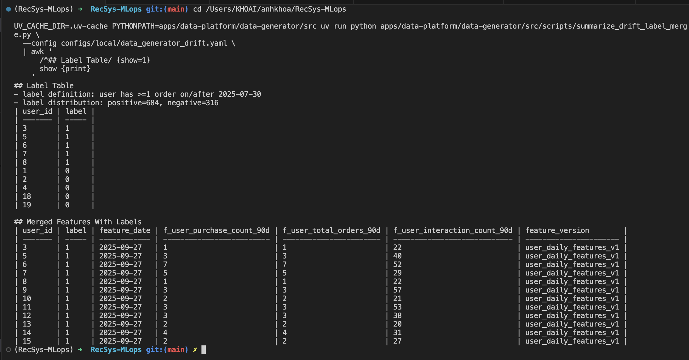

# Improve the data generator

## Simulate Data drift

Code reference:

- [`data_generator_drift.yaml`](../../../configs/local/data_generator_drift.yaml): enables drift and defines the baseline/post-drift boundary.
- [`controller.py`](../../../apps/data-platform/data-generator/src/drift/controller.py), [`reporting.py`](../../../apps/data-platform/data-generator/src/drift/reporting.py): drift phase/factor, artifacts, health metrics, and alerts.
- [`summarize_drift_label_merge.py`](../../../apps/data-platform/data-generator/src/scripts/summarize_drift_label_merge.py): configuration and drift-health proof tables.

Running command:

```bash
cd /Users/KHOAI/anhkhoa/RecSys-MLops

UV_CACHE_DIR=.uv-cache PYTHONPATH=apps/data-platform/data-generator/src uv run python apps/data-platform/data-generator/src/cli.py generate \
  --config configs/local/data_generator_drift.yaml

UV_CACHE_DIR=.uv-cache PYTHONPATH=apps/data-platform/data-generator/src uv run python apps/data-platform/data-generator/src/scripts/summarize_drift_label_merge.py \
  --config configs/local/data_generator_drift.yaml \
  | awk '
      /^## Generator Configuration/ {show=1}
      /^## Label Table/ {show=0}
      show {print}
    '
```

Description of output when running command:

- The generator command creates run `drift_50k_seed42` with `1,000` users, `500` products, `150` history days, and `50,000` target behavior events.
- The filtered summary output shows only the drift-related proof tables.
- `Generator Configuration` has `14` configuration rows, including run id, seed, history window, drift scenario, drift start date, drift mode, multiplier, ramp-up days, and PSI threshold.
- `Drift Health Sample` has `5` rows for key dates: baseline start, baseline end, drift start, ramp-up end, and history end.
- The drift health table illustrates `feature_name`, `mean`, `psi_vs_baseline`, `drift_status`, and `drift_factor` for `f_user_purchase_count_90d`.

Image proof:


## Table with 2 columns : id and label

Code reference:

- [`summarize_drift_label_merge.py`](../../../apps/data-platform/data-generator/src/scripts/summarize_drift_label_merge.py): builds `user_id,label`, joins labels to features, and prints both proof tables.

Running command:

```bash
cd /Users/KHOAI/anhkhoa/RecSys-MLops

UV_CACHE_DIR=.uv-cache PYTHONPATH=apps/data-platform/data-generator/src uv run python apps/data-platform/data-generator/src/scripts/summarize_drift_label_merge.py \
  --config configs/local/data_generator_drift.yaml \
  | awk '
      /^## Label Table/ {show=1}
      show {print}
    '
```

Description of output when running command:

- Run this command after the drift dataset has been generated by the previous section.
- The filtered summary output shows only the label-related proof tables.
- The script builds the full label set for all `1,000` users, then prints a `Label Table` sample with `10` rows: `5` positive labels and `5` negative labels.
- The label proof also prints the label definition and distribution, for example `positive=684` and `negative=316` in the current generated run.
- `Merged Features With Labels` has `12` sample rows from the latest feature date, showing `user_id`, `label`, `feature_date`, user feature columns, and `feature_version`.
- The merged table illustrates that the two-column label table can be joined back to the feature table by `user_id` for training data preparation.

Image proof:


