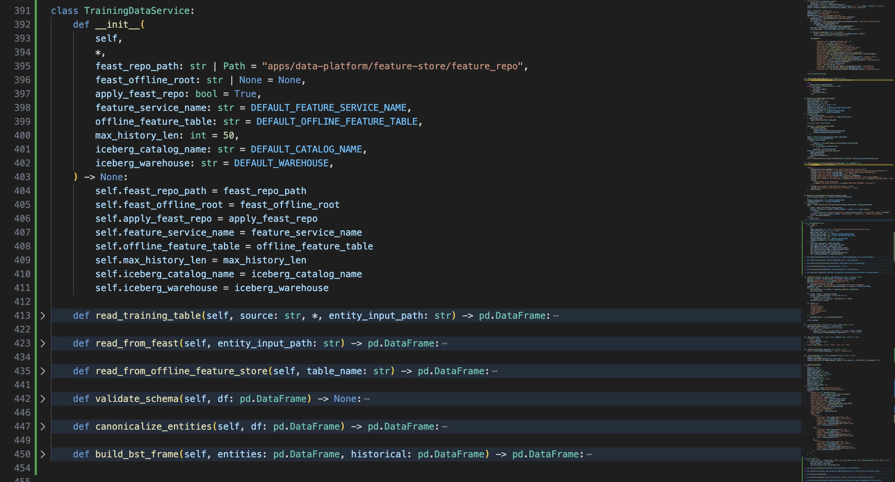
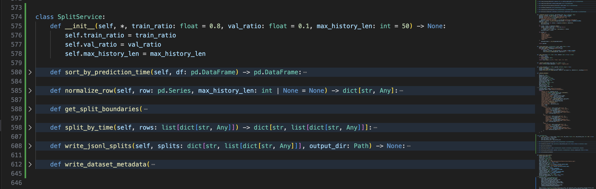
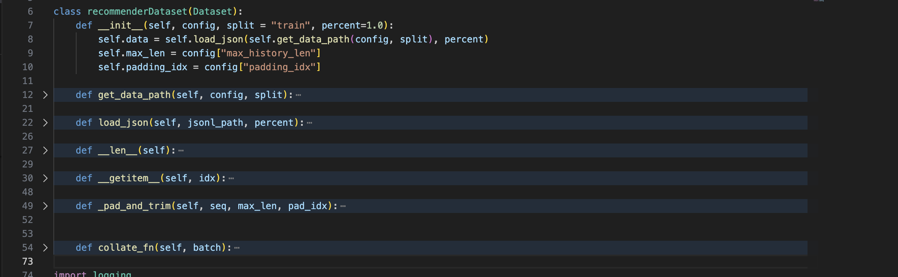
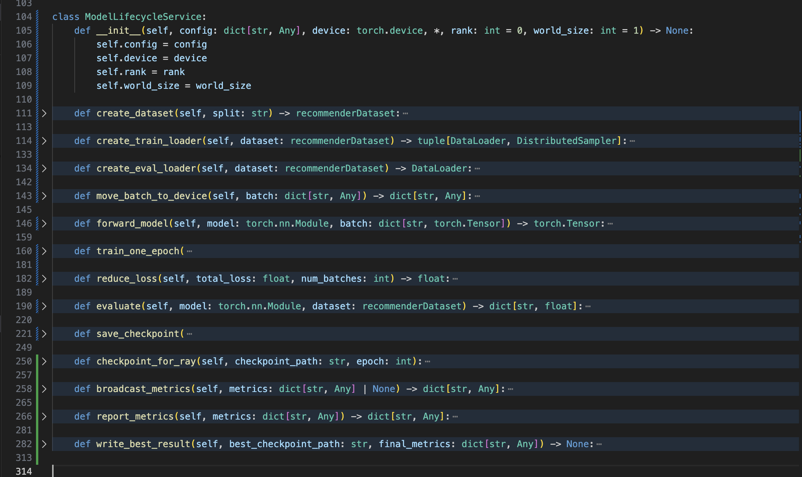
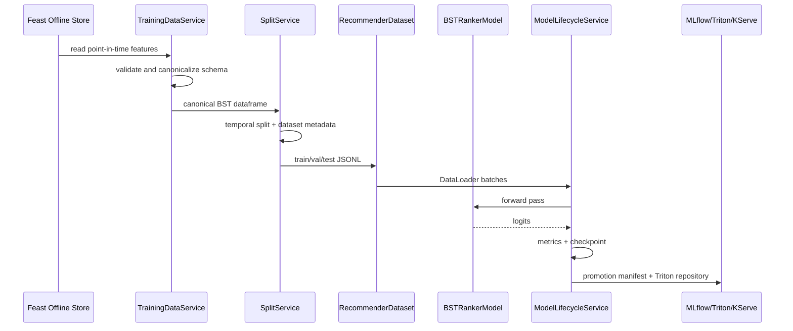

# Low-Level ML Design

This document covers the final-coursework rubric item **Low-level ML Design: propose 5 key classes that represent the main ML focus of the system**.

The proposed classes below are presentation-level design abstractions. They map directly to the current implementation files, but they name the responsibilities in a way that is easier to explain in a design review.

## Main Focus

The ML system focus is:

1. Load point-in-time training data from the Feast offline feature store.
2. Validate and normalize the model schema.
3. Create train/validation/test splits with dataset-version metadata.
4. Feed fixed-shape tensors into the BST recommender model.
5. Train, evaluate, checkpoint, and promote the model to Triton/KServe.


## 1. `TrainingDataService`

**Purpose:** read the BST training table from the offline feature store and convert it into the canonical model dataframe.

This class is the boundary between feature engineering and ML training. Its job is to guarantee that the downstream model sees one stable schema, regardless of whether the data is loaded through Feast native historical retrieval or directly from the PostgreSQL-backed Feast offline feature store.

### Proposed Interface

```python
class TrainingDataService:
    def read_training_table(self, source: str) -> pd.DataFrame: ...
    def read_from_feast(self, entity_input_path: str) -> pd.DataFrame: ...
    def read_from_offline_feature_store(self, table_name: str) -> pd.DataFrame: ...
    def validate_schema(self, df: pd.DataFrame) -> None: ...
    def canonicalize_entities(self, df: pd.DataFrame) -> pd.DataFrame: ...
    def build_bst_frame(self, entities: pd.DataFrame, historical: pd.DataFrame) -> pd.DataFrame: ...
```

### Current Implementation Mapping

| Responsibility | Code reference |
|---|---|
| Required BST model columns | [apps/ml-system/src/cli/prepare_bst_training_data.py line 30](../../../apps/ml-system/src/cli/prepare_bst_training_data.py#L30) |
| Canonical entity dataframe | [apps/ml-system/src/cli/prepare_bst_training_data.py line 117](../../../apps/ml-system/src/cli/prepare_bst_training_data.py#L117) |
| Read PostgreSQL offline table | [apps/ml-system/src/cli/prepare_bst_training_data.py line 149](../../../apps/ml-system/src/cli/prepare_bst_training_data.py#L149) |
| Read generic feature table source | [apps/ml-system/src/cli/prepare_bst_training_data.py line 218](../../../apps/ml-system/src/cli/prepare_bst_training_data.py#L218) |
| Convert Feast historical features to BST frame | [apps/ml-system/src/cli/prepare_bst_training_data.py line 242](../../../apps/ml-system/src/cli/prepare_bst_training_data.py#L242) |
| Build table from Feast native historical retrieval | [apps/ml-system/src/cli/prepare_bst_training_data.py line 310](../../../apps/ml-system/src/cli/prepare_bst_training_data.py#L310) |
| Build table from offline feature store | [apps/ml-system/src/cli/prepare_bst_training_data.py line 373](../../../apps/ml-system/src/cli/prepare_bst_training_data.py#L373) |

### Design Notes

- `read_training_table()` hides source-specific IO details.
- `validate_schema()` protects the model from silent feature-contract drift.
- `canonicalize_entities()` normalizes `user_id`, candidate item id, timestamp, and label before point-in-time retrieval.
- `build_bst_frame()` creates the final columns used by the model: history sequence, target item features, event time, and label.

### Image Proof



**Figure: TrainingDataService proof.** Capture the code around `MODEL_COLUMNS`, `_canonical_entity_frame()`, `build_bst_training_table_from_feast()`, and `build_bst_training_table_from_offline_feature_store()`. This proves the ML pipeline has a clear data-ingestion boundary before splitting and training.

## 2. `SplitService`

**Purpose:** sort the training dataframe by event time, produce train/validation/test splits, write JSONL files, and write dataset-version metadata.

This class is important because the recommender is sequence/time based. Random splitting could leak future behavior into training. The split service makes temporal splitting explicit and records the version metadata used later by MLflow and Hudi data-versioning proof.

### Proposed Interface

```python
class SplitService:
    def sort_by_prediction_time(self, df: pd.DataFrame) -> pd.DataFrame: ...
    def normalize_row(self, row: pd.Series, max_history_len: int) -> dict: ...
    def get_split_boundaries(self, row_count: int, train_ratio: float, val_ratio: float) -> dict: ...
    def split_by_time(self, rows: list[dict]) -> tuple[list[dict], list[dict], list[dict]]: ...
    def write_jsonl_splits(self, splits: dict[str, list[dict]], output_dir: Path) -> None: ...
    def write_dataset_metadata(self, splits: dict[str, list[dict]], output_dir: Path) -> dict: ...
```

### Current Implementation Mapping

| Responsibility | Code reference |
|---|---|
| Normalize one dataframe row into model JSONL schema | [apps/ml-system/src/cli/prepare_bst_training_data.py line 391](../../../apps/ml-system/src/cli/prepare_bst_training_data.py#L391) |
| Write JSONL split files | [apps/ml-system/src/cli/prepare_bst_training_data.py line 422](../../../apps/ml-system/src/cli/prepare_bst_training_data.py#L422) |
| Build dataset metadata payload | [apps/ml-system/src/cli/prepare_bst_training_data.py line 448](../../../apps/ml-system/src/cli/prepare_bst_training_data.py#L448) |
| Main split preparation flow | [apps/ml-system/src/cli/prepare_bst_training_data.py line 509](../../../apps/ml-system/src/cli/prepare_bst_training_data.py#L509) |
| Temporal sort before split | [apps/ml-system/src/cli/prepare_bst_training_data.py line 553](../../../apps/ml-system/src/cli/prepare_bst_training_data.py#L553) |
| Train/validation/test boundary computation | [apps/ml-system/src/cli/prepare_bst_training_data.py line 559](../../../apps/ml-system/src/cli/prepare_bst_training_data.py#L559) |
| Hudi/local dataset-version metadata write | [apps/ml-system/src/cli/prepare_bst_training_data.py line 572](../../../apps/ml-system/src/cli/prepare_bst_training_data.py#L572) |

### Design Notes

- Split strategy is **temporal**, not random.
- `normalize_row()` truncates history to `max_history_len` and converts fields to the exact JSONL schema expected by PyTorch.
- Dataset metadata stores `dataset_run_id`, `schema_hash`, split counts, split paths, and Hudi commit metadata for dataset versioning proof.
- This class is the right place to enforce no-leakage rules and reproducible dataset versions.

### Image Proof



**Figure: SplitService proof.** Capture `prepare_bst_jsonl_splits()`, especially the temporal sort, split boundary calculation, JSONL write, and dataset metadata write. This proves the model training data is split and versioned in a controlled service, not manually separated.

## 3. `RecommenderDataset`

**Purpose:** adapt split JSONL files into fixed-shape PyTorch tensors for model training and evaluation.

This class is the PyTorch dataset adapter. It separates file format concerns from model/trainer code. The trainer only sees tensors; it does not need to know how JSONL rows are loaded, padded, trimmed, or collated.

### Proposed Interface

```python
class RecommenderDataset(Dataset):
    def get_data_path(self, config: dict, split: str) -> str: ...
    def load_json(self, jsonl_path: str, percent: float) -> list[dict]: ...
    def __len__(self) -> int: ...
    def __getitem__(self, idx: int) -> dict: ...
    def pad_and_trim(self, seq: list[int], max_len: int, pad_idx: int) -> Tensor: ...
    def collate_fn(self, batch: list[dict]) -> dict[str, Tensor]: ...
```

### Current Implementation Mapping

| Responsibility | Code reference |
|---|---|
| Dataset class | [apps/ml-system/src/models/dataset.py line 6](../../../apps/ml-system/src/models/dataset.py#L6) |
| Resolve split path | [apps/ml-system/src/models/dataset.py line 12](../../../apps/ml-system/src/models/dataset.py#L12) |
| Load JSONL rows | [apps/ml-system/src/models/dataset.py line 22](../../../apps/ml-system/src/models/dataset.py#L22) |
| Return one training example | [apps/ml-system/src/models/dataset.py line 30](../../../apps/ml-system/src/models/dataset.py#L30) |
| Pad and trim sequence features | [apps/ml-system/src/models/dataset.py line 49](../../../apps/ml-system/src/models/dataset.py#L49) |
| Collate batch tensors | [apps/ml-system/src/models/dataset.py line 54](../../../apps/ml-system/src/models/dataset.py#L54) |

### Design Notes

- Keeps the most recent sequence events by trimming from the left.
- Pads histories to fixed length so the transformer receives stable tensor shapes.
- Converts scalar and sequence fields into `torch.Tensor` batches.
- Supports `percent` so Ray Tune/DDP proof runs can use tiny datasets for fast coursework capture.

### Image Proof



**Figure: RecommenderDataset proof.** Capture `recommenderDataset`, `_pad_and_trim()`, and `collate_fn()`. This proves JSONL training data is converted into model-ready tensors through a dedicated dataset adapter.

## 4. `BSTRankerModel`

**Purpose:** score candidate items using the Behavioral Sequence Transformer architecture.

This class is the low-level neural ranking model. It combines user history embeddings, target item embeddings, positional encoding, transformer attention, and an MLP scoring head.

### Proposed Interface

```python
class BSTRankerModel(nn.Module):
    def embed_history(self, history_features: dict[str, Tensor]) -> dict[str, Tensor]: ...
    def embed_target(self, target_features: dict[str, Tensor]) -> dict[str, Tensor]: ...
    def build_history_stack(self, hist_embeds: dict[str, Tensor]) -> Tensor: ...
    def build_target_context(self, target_embeds: dict[str, Tensor]) -> Tensor: ...
    def forward(self, batch: dict[str, Tensor]) -> Tensor: ...
```

### Current Implementation Mapping

| Responsibility | Code reference |
|---|---|
| `BST` model class | [apps/ml-system/src/models/model.py line 886](../../../apps/ml-system/src/models/model.py#L886) |
| Entity embedding modules | [apps/ml-system/src/models/model.py line 893](../../../apps/ml-system/src/models/model.py#L893) |
| Transformer layer composition | [apps/ml-system/src/models/model.py line 924](../../../apps/ml-system/src/models/model.py#L924) |
| Positional encoding | [apps/ml-system/src/models/model.py line 936](../../../apps/ml-system/src/models/model.py#L936) |
| MLP scoring head | [apps/ml-system/src/models/model.py line 938](../../../apps/ml-system/src/models/model.py#L938) |
| Embed history fields | [apps/ml-system/src/models/model.py line 954](../../../apps/ml-system/src/models/model.py#L954) |
| Embed target item fields | [apps/ml-system/src/models/model.py line 972](../../../apps/ml-system/src/models/model.py#L972) |

### Design Notes

- This is a **composite neural module**: embeddings, transformer, positional encoding, and MLP are separate pieces.
- History and target item features are embedded separately, then joined for ranking.
- The model produces logits; post-processing converts logits into recommendation scores.
- Keeping the model as one module makes ONNX/Triton export easier during promotion.

### Image Proof


**Figure: BSTRankerModel proof.** Capture the `BST.__init__()` block and the `_embed_history()` / `_embed_target()` helpers. This proves the model is a composed BST ranker with explicit feature embedding blocks.

## 5. `ModelLifecycleService`

**Purpose:** own the model lifecycle after data is ready: train, evaluate, checkpoint, export, register, and promote.

This class combines the two lifecycle concerns that matter most in the coursework proof: training/evaluation and deployment handoff. In the current implementation, this responsibility is split across `Trainer`, `training/train.py`, and `model_promotion.py`; the proposed class names the end-to-end lifecycle clearly.

### Proposed Interface

```python
class ModelLifecycleService:
    def create_dataloader(self, dataset: RecommenderDataset, shuffle: bool) -> DataLoader: ...
    def train_one_epoch(self, train_loader: DataLoader) -> dict[str, float]: ...
    def evaluate(self, eval_loader: DataLoader) -> dict[str, float]: ...
    def save_checkpoint(self, epoch: int, score: float) -> Path: ...
    def export_to_triton_repository(self, checkpoint_path: Path) -> Path: ...
    def build_promotion_manifest(self, model_version: str, metric: dict) -> dict: ...
    def promote_best_model(self, ray_result_path: Path) -> dict: ...
```

### Current Implementation Mapping

| Responsibility | Code reference |
|---|---|
| Trainer class | [apps/ml-system/src/models/trainer.py line 58](../../../apps/ml-system/src/models/trainer.py#L58) |
| Create DataLoader | [apps/ml-system/src/models/trainer.py line 79](../../../apps/ml-system/src/models/trainer.py#L79) |
| Shared forward pass | [apps/ml-system/src/models/trainer.py line 97](../../../apps/ml-system/src/models/trainer.py#L97) |
| Training epoch | [apps/ml-system/src/models/trainer.py line 129](../../../apps/ml-system/src/models/trainer.py#L129) |
| Evaluation epoch | [apps/ml-system/src/models/trainer.py line 175](../../../apps/ml-system/src/models/trainer.py#L175) |
| Ranking metrics | [apps/ml-system/src/models/trainer.py line 217](../../../apps/ml-system/src/models/trainer.py#L217) |
| Checkpoint save | [apps/ml-system/src/models/trainer.py line 111](../../../apps/ml-system/src/models/trainer.py#L111) |
| End-to-end training loop | [apps/ml-system/src/training/train.py line 73](../../../apps/ml-system/src/training/train.py#L73) |
| Build Triton repository | [apps/ml-system/src/registry/model_promotion.py line 405](../../../apps/ml-system/src/registry/model_promotion.py#L405) |
| Build promotion manifest | [apps/ml-system/src/registry/model_promotion.py line 471](../../../apps/ml-system/src/registry/model_promotion.py#L471) |
| Register MLflow model version | [apps/ml-system/src/registry/model_promotion.py line 511](../../../apps/ml-system/src/registry/model_promotion.py#L511) |
| Promote best model | [apps/ml-system/src/registry/model_promotion.py line 559](../../../apps/ml-system/src/registry/model_promotion.py#L559) |

### Design Notes

- `Trainer.train()` and `Trainer.evaluate()` share the same template: move batch, forward pass, loss/score collection, grouped ranking metrics.
- `run_training()` creates train/validation datasets, loops epochs, logs metrics to MLflow, and stores the best checkpoint.
- `promote_best_model()` turns the winning checkpoint into a Triton model repository and promotion manifest.
- The promotion manifest is the contract used by the post-training KServe CD flow.

### Image Proof



**Figure: ModelLifecycleService proof.** Capture `Trainer.train()`, `Trainer.evaluate()`, `run_training()`, and `promote_best_model()`. This proves the system has a coherent lifecycle from training metrics to deployable Triton/KServe artifact.

## End-To-End Interaction



## Screenshot Checklist

Use these screenshots to satisfy the rubric item **"Propose 5 key classes to present our main focus"**:

| Screenshot file | What to capture |
|---|---|
| `docs/pngs/low_level_training_data_service.png` | `prepare_bst_training_data.py` around `MODEL_COLUMNS`, `_canonical_entity_frame()`, `build_bst_training_table_from_feast()`, and `build_bst_training_table_from_offline_feature_store()`. |
| `docs/pngs/low_level_split_service.png` | `prepare_bst_jsonl_splits()` showing temporal sort, split boundaries, JSONL write, and dataset metadata. |
| `docs/pngs/low_level_recommender_dataset.png` | `recommenderDataset`, `_pad_and_trim()`, and `collate_fn()`. |
| `docs/pngs/low_level_bst_ranker_model.png` | `BST.__init__()`, `_embed_history()`, and `_embed_target()`. |
| `docs/pngs/low_level_model_lifecycle_service.png` | `Trainer.train()`, `Trainer.evaluate()`, `run_training()`, and `promote_best_model()`. |
| `docs/pngs/low_level_ml_design_classes.png` | Optional overview screenshot showing all five proposed classes or this document section in Markdown preview. |
