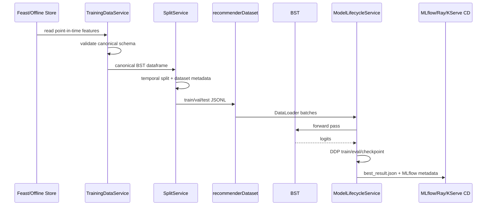

# Low-Level ML Design

This document covers the final-coursework rubric item **Low-level ML Design: propose 5 key classes that represent the main ML focus of the system**.

The classes below are now implemented or directly mapped to implementation code. The ML flow is centered on preparing point-in-time BST training data, splitting it without temporal leakage, adapting it into tensors, training the BST ranker with distributed Ray Train DDP, and writing the lifecycle result consumed by MLflow/model CD.

## Main Focus

1. Load BST training features from Feast/offline feature store sources.
2. Validate the canonical training schema.
3. Create temporal train/validation/test splits with dataset-version metadata.
4. Feed fixed-shape tensors into the `BST` recommender model.
5. Train, evaluate, checkpoint, and publish the best distributed-training result.


## 1. `TrainingDataService`

**Purpose:** read the BST training table from Feast or the offline feature store and guarantee the canonical model dataframe schema.

This class is the boundary between feature engineering and ML training. The downstream split and training code no longer needs to know whether data came from Feast historical retrieval or the Iceberg/PostgreSQL-backed offline feature store.

### Interface

```python
class TrainingDataService:
    def read_training_table(self, source: str, *, entity_input_path: str) -> pd.DataFrame: ...
    def read_from_feast(self, entity_input_path: str) -> pd.DataFrame: ...
    def read_from_offline_feature_store(self, table_name: str) -> pd.DataFrame: ...
    def validate_schema(self, df: pd.DataFrame) -> None: ...
    def canonicalize_entities(self, df: pd.DataFrame) -> pd.DataFrame: ...
    def build_bst_frame(self, entities: pd.DataFrame, historical: pd.DataFrame) -> pd.DataFrame: ...
```

### Implementation Mapping

| Responsibility | Code reference |
|---|---|
| Required BST model columns | [prepare_bst_training_data.py (line 43)](../../../apps/ml-system/src/cli/prepare_bst_training_data.py#L43), [prepare_bst_training_data.py (line 70)](../../../apps/ml-system/src/cli/prepare_bst_training_data.py#L70) |
| Canonical entity dataframe | [prepare_bst_training_data.py (line 111)](../../../apps/ml-system/src/cli/prepare_bst_training_data.py#L111), [prepare_bst_training_data.py (line 137)](../../../apps/ml-system/src/cli/prepare_bst_training_data.py#L137) |
| Convert Feast historical features to BST frame | [prepare_bst_training_data.py (line 244)](../../../apps/ml-system/src/cli/prepare_bst_training_data.py#L244), [prepare_bst_training_data.py (line 297)](../../../apps/ml-system/src/cli/prepare_bst_training_data.py#L297) |
| Feast historical training table loader | [prepare_bst_training_data.py (line 299)](../../../apps/ml-system/src/cli/prepare_bst_training_data.py#L299), [prepare_bst_training_data.py (line 352)](../../../apps/ml-system/src/cli/prepare_bst_training_data.py#L352) |
| Offline feature store training table loader | [prepare_bst_training_data.py (line 354)](../../../apps/ml-system/src/cli/prepare_bst_training_data.py#L354), [prepare_bst_training_data.py (line 391)](../../../apps/ml-system/src/cli/prepare_bst_training_data.py#L391) |
| `TrainingDataService` implementation | [prepare_bst_training_data.py (line 393)](../../../apps/ml-system/src/cli/prepare_bst_training_data.py#L393), [prepare_bst_training_data.py (line 456)](../../../apps/ml-system/src/cli/prepare_bst_training_data.py#L456) |
| Flow uses `TrainingDataService` | [prepare_bst_training_data.py (line 654)](../../../apps/ml-system/src/cli/prepare_bst_training_data.py#L654), [prepare_bst_training_data.py (line 713)](../../../apps/ml-system/src/cli/prepare_bst_training_data.py#L713) |

### Design Notes

- `read_training_table()` hides source-specific IO details.
- `validate_schema()` protects the model from silent feature-contract drift.
- `canonicalize_entities()` normalizes user, candidate item, timestamp, and label fields before point-in-time retrieval.
- `build_bst_frame()` creates the final columns used by the model: history sequence, target item features, event time, and label.

### Reference Image


**Figure: TrainingDataService low-level proof.** Capture `MODEL_COLUMNS`, `TrainingDataService.read_training_table()`, `read_from_feast()`, `read_from_offline_feature_store()`, `validate_schema()`, and the call site where `prepare_bst_jsonl_splits()` creates `TrainingDataService`.

## 2. `SplitService`

**Purpose:** sort the training dataframe by prediction time, produce train/validation/test splits, write JSONL files, and write dataset-version metadata.

This class is important because BST is sequence/time based. Random splitting can leak future behavior into training. `SplitService` makes the temporal split explicit and records dataset versioning details for MLflow and Hudi/Iceberg proof.

### Interface

```python
class SplitService:
    def sort_by_prediction_time(self, df: pd.DataFrame) -> pd.DataFrame: ...
    def normalize_row(self, row: pd.Series, max_history_len: int | None = None) -> dict: ...
    def get_split_boundaries(self, row_count: int, train_ratio: float | None = None, val_ratio: float | None = None) -> dict: ...
    def split_by_time(self, rows: list[dict]) -> dict[str, list[dict]]: ...
    def write_jsonl_splits(self, splits: dict[str, list[dict]], output_dir: Path) -> None: ...
    def write_dataset_metadata(self, ...) -> dict: ...
```

### Implementation Mapping

| Responsibility | Code reference |
|---|---|
| Normalize one dataframe row into model JSONL schema | [prepare_bst_training_data.py (line 458)](../../../apps/ml-system/src/cli/prepare_bst_training_data.py#L458), [prepare_bst_training_data.py (line 487)](../../../apps/ml-system/src/cli/prepare_bst_training_data.py#L487) |
| Dataset metadata payload | [prepare_bst_training_data.py (line 520)](../../../apps/ml-system/src/cli/prepare_bst_training_data.py#L520), [prepare_bst_training_data.py (line 579)](../../../apps/ml-system/src/cli/prepare_bst_training_data.py#L579) |
| `SplitService` implementation | [prepare_bst_training_data.py (line 581)](../../../apps/ml-system/src/cli/prepare_bst_training_data.py#L581), [prepare_bst_training_data.py (line 652)](../../../apps/ml-system/src/cli/prepare_bst_training_data.py#L652) |
| Flow uses temporal sort and split service | [prepare_bst_training_data.py (line 654)](../../../apps/ml-system/src/cli/prepare_bst_training_data.py#L654), [prepare_bst_training_data.py (line 758)](../../../apps/ml-system/src/cli/prepare_bst_training_data.py#L758) |

### Design Notes

- Split strategy is **temporal**, not random.
- `normalize_row()` truncates history to `max_history_len` and converts fields to the exact JSONL schema expected by PyTorch.
- Dataset metadata stores `dataset_run_id`, `schema_hash`, split counts, split paths, and Hudi/local version metadata.
- This class is the guardrail for reproducible dataset versions and no-leakage training.

### Reference Image


**Figure: SplitService low-level proof.** Capture `SplitService.sort_by_prediction_time()`, `normalize_row()`, `get_split_boundaries()`, `split_by_time()`, `write_jsonl_splits()`, `write_dataset_metadata()`, and the `prepare_bst_jsonl_splits()` lines that call those methods.

## 3. `recommenderDataset`

**Purpose:** adapt split JSONL files into fixed-shape PyTorch tensors for model training and evaluation.

This class separates file format concerns from model/lifecycle code. `ModelLifecycleService` sees PyTorch batches; it does not need to know how JSONL rows are loaded, padded, trimmed, or collated.

### Interface

```python
class recommenderDataset(Dataset):
    def get_data_path(self, config: dict, split: str) -> str: ...
    def load_json(self, jsonl_path: str, percent: float) -> list[dict]: ...
    def __len__(self) -> int: ...
    def __getitem__(self, idx: int) -> dict: ...
    def _pad_and_trim(self, seq: list[int], max_len: int, pad_idx: int) -> Tensor: ...
    def collate_fn(self, batch: list[dict]) -> dict[str, Tensor]: ...
```

### Implementation Mapping

| Responsibility | Code reference |
|---|---|
| Dataset class | [dataset.py (line 8)](../../../apps/ml-system/src/models/dataset.py#L8), [dataset.py (line 73)](../../../apps/ml-system/src/models/dataset.py#L73) |
| Resolve split path | [dataset.py (line 14)](../../../apps/ml-system/src/models/dataset.py#L14), [dataset.py (line 22)](../../../apps/ml-system/src/models/dataset.py#L22) |
| Load JSONL rows | [dataset.py (line 24)](../../../apps/ml-system/src/models/dataset.py#L24), [dataset.py (line 27)](../../../apps/ml-system/src/models/dataset.py#L27) |
| Return one training example | [dataset.py (line 32)](../../../apps/ml-system/src/models/dataset.py#L32), [dataset.py (line 51)](../../../apps/ml-system/src/models/dataset.py#L51) |
| Pad and trim sequence features | [dataset.py (line 53)](../../../apps/ml-system/src/models/dataset.py#L53), [dataset.py (line 56)](../../../apps/ml-system/src/models/dataset.py#L56) |
| Collate batch tensors | [dataset.py (line 58)](../../../apps/ml-system/src/models/dataset.py#L58), [dataset.py (line 73)](../../../apps/ml-system/src/models/dataset.py#L73) |

### Design Notes

- Keeps the most recent sequence events by trimming from the left.
- Pads histories to fixed length so the transformer receives stable tensor shapes.
- Converts scalar and sequence fields into `torch.Tensor` batches.
- Supports `percent` so Ray Tune/DDP proof runs can use tiny datasets for fast coursework captures.

### Reference Image


**Figure: recommenderDataset low-level proof.** Capture `get_data_path()`, `load_json()`, `__getitem__()`, `_pad_and_trim()`, and `collate_fn()`. This proves JSONL split rows become fixed-shape tensors before the model lifecycle sees them.

## 4. `BST`

**Purpose:** score candidate items using the Behavioral Sequence Transformer architecture.

This class is the low-level neural ranking model. It combines user history embeddings, target item embeddings, positional encoding, transformer attention, and an MLP scoring head. The design name is intentionally `BST`, matching the implemented class and the model artifact name.

### Interface

```python
class BST(nn.Module):
    def _embed_history(self, hist_item_id, hist_event_type, hist_category, hist_brand, hist_price_bucket, hist_time) -> dict: ...
    def _embed_target(self, target_item_id, target_category, target_brand, target_price_bucket) -> dict: ...
    def _build_target_concat(self, target_embeds: dict) -> Tensor: ...
    def _build_history_stack(self, hist_embeds: dict) -> Tensor: ...
    def forward(self, hist_item_id, hist_event_type, hist_category, hist_brand, hist_price_bucket, hist_time, target_item_id, target_category, target_brand, target_price_bucket) -> Tensor: ...
```

### Implementation Mapping

| Responsibility | Code reference |
|---|---|
| `BST` model class | [model.py (line 886)](../../../apps/ml-system/src/models/model.py#L886), [model.py (line 1075)](../../../apps/ml-system/src/models/model.py#L1075) |
| Entity embedding modules | [model.py (line 887)](../../../apps/ml-system/src/models/model.py#L887), [model.py (line 925)](../../../apps/ml-system/src/models/model.py#L925) |
| Transformer layer composition | [model.py (line 926)](../../../apps/ml-system/src/models/model.py#L926), [model.py (line 937)](../../../apps/ml-system/src/models/model.py#L937) |
| Positional encoding and MLP scoring head | [model.py (line 856)](../../../apps/ml-system/src/models/model.py#L856), [model.py (line 884)](../../../apps/ml-system/src/models/model.py#L884) and [model.py (line 938)](../../../apps/ml-system/src/models/model.py#L938), [model.py (line 949)](../../../apps/ml-system/src/models/model.py#L949) |
| Embed history fields | [model.py (line 954)](../../../apps/ml-system/src/models/model.py#L954), [model.py (line 970)](../../../apps/ml-system/src/models/model.py#L970) |
| Embed target item fields | [model.py (line 972)](../../../apps/ml-system/src/models/model.py#L972), [model.py (line 997)](../../../apps/ml-system/src/models/model.py#L997) |
| Forward pass | [model.py (line 1034)](../../../apps/ml-system/src/models/model.py#L1034), [model.py (line 1075)](../../../apps/ml-system/src/models/model.py#L1075) |

### Design Notes

- This is a **composite neural module**: embeddings, transformer, positional encoding, and MLP are separate pieces.
- History and target item features are embedded separately, then joined for ranking.
- The model produces logits; post-processing converts logits into recommendation scores.
- Keeping the model as `BST` keeps ONNX/Triton export and checkpoint naming aligned with the deployed artifact.

### Reference Image


**Figure: BST low-level proof.** Capture `BST.__init__()`, entity embedding layers, transformer/positional encoding setup, `_embed_history()`, `_embed_target()`, and `forward()`. This proves the ranker is the `BST` class, not a renamed `BSTRankerModel`.

## 5. `ModelLifecycleService`

**Purpose:** own the distributed model lifecycle after data is ready: create datasets/loaders, train one epoch, evaluate, checkpoint, report Ray Train metrics, and write the best-result artifact consumed by MLflow/model CD.

This class now lives in the DDP training entrypoint, because the final coursework proof is the Ray Train `DistributedDataParallel` run. It replaces the old scattered helper-function lifecycle inside `ray_distributed_train_bst.py`.

### Interface

```python
class ModelLifecycleService:
    def create_dataset(self, split: str) -> recommenderDataset: ...
    def create_train_loader(self, dataset: recommenderDataset) -> tuple[DataLoader, DistributedSampler]: ...
    def create_eval_loader(self, dataset: recommenderDataset) -> DataLoader: ...
    def train_one_epoch(self, model: nn.Module, train_loader: DataLoader, optimizer: Optimizer, loss_fn: nn.Module) -> float: ...
    def evaluate(self, model: nn.Module, dataset: recommenderDataset) -> dict[str, float]: ...
    def save_checkpoint(self, model: nn.Module, optimizer: Optimizer, scheduler: ReduceLROnPlateau, epoch: int, best_score: float) -> str: ...
    def checkpoint_for_ray(self, checkpoint_path: str, epoch: int) -> Checkpoint: ...
    def broadcast_metrics(self, metrics: dict | None) -> dict: ...
    def report_metrics(self, metrics: dict) -> dict: ...
    def write_best_result(self, best_checkpoint_path: str, final_metrics: dict) -> None: ...
```

### Implementation Mapping

| Responsibility | Code reference |
|---|---|
| `ModelLifecycleService` class | [ray_distributed_train_bst.py (line 104)](../../../apps/ml-system/src/training/ray_distributed_train_bst.py#L104), [ray_distributed_train_bst.py (line 314)](../../../apps/ml-system/src/training/ray_distributed_train_bst.py#L314) |
| Dataset and distributed loader creation | [ray_distributed_train_bst.py (line 111)](../../../apps/ml-system/src/training/ray_distributed_train_bst.py#L111), [ray_distributed_train_bst.py (line 141)](../../../apps/ml-system/src/training/ray_distributed_train_bst.py#L141) |
| Shared batch move and BST forward pass | [ray_distributed_train_bst.py (line 143)](../../../apps/ml-system/src/training/ray_distributed_train_bst.py#L143), [ray_distributed_train_bst.py (line 158)](../../../apps/ml-system/src/training/ray_distributed_train_bst.py#L158) |
| DDP training epoch and loss reduce | [ray_distributed_train_bst.py (line 160)](../../../apps/ml-system/src/training/ray_distributed_train_bst.py#L160), [ray_distributed_train_bst.py (line 188)](../../../apps/ml-system/src/training/ray_distributed_train_bst.py#L188) |
| Rank-0 validation metrics | [ray_distributed_train_bst.py (line 190)](../../../apps/ml-system/src/training/ray_distributed_train_bst.py#L190), [ray_distributed_train_bst.py (line 220)](../../../apps/ml-system/src/training/ray_distributed_train_bst.py#L220) |
| Checkpoint save and Ray checkpoint export | [ray_distributed_train_bst.py (line 222)](../../../apps/ml-system/src/training/ray_distributed_train_bst.py#L222), [ray_distributed_train_bst.py (line 257)](../../../apps/ml-system/src/training/ray_distributed_train_bst.py#L257) |
| Broadcast and Ray Train report metrics | [ray_distributed_train_bst.py (line 259)](../../../apps/ml-system/src/training/ray_distributed_train_bst.py#L259), [ray_distributed_train_bst.py (line 281)](../../../apps/ml-system/src/training/ray_distributed_train_bst.py#L281) |
| MLflow/best-result lifecycle output | [ray_distributed_train_bst.py (line 283)](../../../apps/ml-system/src/training/ray_distributed_train_bst.py#L283), [ray_distributed_train_bst.py (line 314)](../../../apps/ml-system/src/training/ray_distributed_train_bst.py#L314) |
| `train_loop_per_worker()` uses the service | [ray_distributed_train_bst.py (line 316)](../../../apps/ml-system/src/training/ray_distributed_train_bst.py#L316), [ray_distributed_train_bst.py (line 368)](../../../apps/ml-system/src/training/ray_distributed_train_bst.py#L368) |

### Design Notes

- DDP-specific concerns stay explicit: `DistributedSampler`, `loss.backward()` gradient sync, `all_reduce`, and rank-0 evaluation/checkpointing.
- `report_metrics()` emits proof fields: `world_size`, `rank`, `ddp_gradient_sync`, and `distributed_sampler`.
- `write_best_result()` writes the artifact contract consumed by downstream model promotion and KServe CD.
- The worker loop now reads like orchestration: create service, train/evaluate/checkpoint, report.

### Reference Image


**Figure: ModelLifecycleService low-level proof.** Capture `ModelLifecycleService`, `train_loop_per_worker()` instantiating it, and `TorchTrainer(train_loop_per_worker=...)`. This proves Ray Train DDP uses the lifecycle service for dataset creation, DDP loaders, training, evaluation, checkpointing, metric reporting, and best-result output.

## End-To-End Interaction



## Screenshot Checklist

Optional screenshots to satisfy the rubric item **"Propose 5 key classes to present our main focus"**:

| Screenshot file | What to capture |
|---|---|
| `docs/pngs/low_level_training_data_service.png` | `TrainingDataService`, `MODEL_COLUMNS`, `_canonical_entity_frame()`, and the Feast/offline-store read methods. |
| `docs/pngs/low_level_split_service.png` | `SplitService`, temporal sort, split boundaries, JSONL write, and dataset metadata write. |
| `docs/pngs/low_level_recommender_dataset.png` | `recommenderDataset`, `_pad_and_trim()`, and `collate_fn()`. |
| `docs/pngs/low_level_bst_ranker_model.png` | `BST.__init__()`, `_embed_history()`, `_embed_target()`, and `forward()`. |
| `docs/pngs/low_level_model_lifecycle_service.png` | `ModelLifecycleService` plus `train_loop_per_worker()` using it. |
