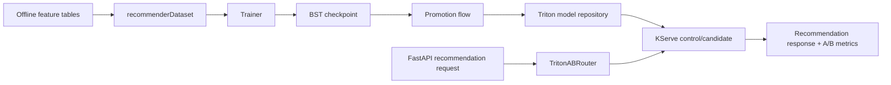

# Low-Level ML Design

This document covers the final-coursework rubric item **Low-level ML Design: document 5 key classes**.

## 1. `recommenderDataset`

Code: [apps/ml-system/src/models/dataset.py](../../../apps/ml-system/src/models/dataset.py)

Purpose: adapts JSONL ranking data into PyTorch `Dataset` batches.

Key methods:

| Method | Responsibility |
|---|---|
| `__init__(config, split, percent)` | Loads the configured train/val/test JSONL split and stores padding config. |
| `get_data_path(config, split)` | Maps logical split name to a concrete path. |
| `load_json(jsonl_path, percent)` | Reads JSONL rows and optionally samples a percentage. |
| `__getitem__(idx)` | Returns one training row with history, target item, timestamp, and label. |
| `_pad_and_trim(seq, max_len, pad_idx)` | Keeps the most recent history and left-pads to fixed length. |
| `collate_fn(batch)` | Converts a list of examples into tensor batches used by the trainer. |

Design note: this is the data adapter between offline feature engineering output and PyTorch training.

## 2. `Trainer`

Code: [apps/ml-system/src/models/trainer.py](../../../apps/ml-system/src/models/trainer.py)

Purpose: owns the BST training/evaluation lifecycle.

Key methods:

| Method | Responsibility |
|---|---|
| `__init__(config)` | Reads training/model args, initializes model, optimizer, scheduler, logger, loss, and device. |
| `get_data_loader(dataset, shuffle)` | Creates a DataLoader using the dataset's `collate_fn`. |
| `_move_batch_to_device(batch)` | Moves tensors to the active Torch device. |
| `_forward_batch(batch)` | Calls the BST model with the expected tensor fields. |
| `train(train_loader)` | Runs one training epoch, backprop, and collects ranking metrics. |
| `evaluate(val_loader)` | Runs evaluation without gradient updates. |
| `_compute_metrics(labels, probs, group_keys)` | Computes AUC plus grouped ranking metrics: GAUC, hitrate@k, NDCG@k, MRR@k. |
| `save_model(epoch, best_score)` | Saves model/optimizer/scheduler/config checkpoint. |

Design note: the class uses a template-method-like structure where `train` and `evaluate` share forward pass, batch movement, and metric computation.

## 3. `BST`

Code: [apps/ml-system/src/models/model.py](../../../apps/ml-system/src/models/model.py)

Purpose: Behavioral Sequence Transformer ranker for candidate-item scoring.

Key methods / blocks:

| Method or block | Responsibility |
|---|---|
| `__init__(model_args)` | Builds item/category/brand/price/time/event embeddings, light transformer, positional encoding, and MLP head. |
| `concat(features)` | Shared tensor concatenation helper. |
| `_embed_history(...)` | Embeds user behavior sequence fields. |
| `_embed_target(...)` | Embeds candidate target item fields. |
| `_build_target_concat(target_embeds)` | Projects target features into the same representation space used for ranking. |
| `_build_history_stack(hist_embeds)` | Builds sequence tensor from historical item/event/context embeddings. |
| `forward(...)` | Combines history and target, runs transformer attention, and emits ranking logits. |

Design note: `BST` is a composite PyTorch module. The model composes embedding tables, positional encoding, sequence attention/transformer, and MLP scoring head.

## 4. `PromotionResult` and Promotion Flow

Code: [apps/ml-system/src/registry/model_promotion.py](../../../apps/ml-system/src/registry/model_promotion.py)

Purpose: converts the best training checkpoint into a versioned Triton model repository and promotion manifest.

Key pieces:

| Function/class | Responsibility |
|---|---|
| `PromotionResult` | Immutable result object with model version, local repo, Triton URI, manifest URI, and manifest payload. |
| `export_onnx(config, checkpoint_path, target_path)` | Exports trained BST checkpoint to ONNX. |
| `write_triton_configs(repository, max_history_len)` | Writes Triton `config.pbtxt` files for preprocess, ranker, postprocess, and ensemble models. |
| `write_python_backend_models(repository)` | Writes Triton Python backend preprocess/postprocess code. |
| `build_triton_repository(...)` | Builds the full model repository directory. |
| `build_manifest(...)` | Creates model metadata used by serving and registry. |
| `promote_best_model(...)` | Orchestrates export, upload, manifest write, MLflow registry, and internal registry update. |

Design note: this is a builder/promotion pipeline. It keeps artifact generation, storage location, model metadata, and registry update consistent for serving.

## 5. `TritonABRouter`

Code: [apps/api-serving/src/ab_testing.py](../../../apps/api-serving/src/ab_testing.py)

Purpose: routes recommendation requests between two Triton inference services.

Key methods:

| Method | Responsibility |
|---|---|
| `from_env()` | Builds control and candidate `TritonRanker` clients from environment variables. |
| `assign(user_id)` | Deterministically assigns user to `control` or `candidate` by hashing `experiment_id:user_id`. |
| `route(user_id)` | Returns a `TritonRoute` containing ranker, model version, A/B variant, and experiment id. |
| `select_triton_route(ranker, user_id, model_version)` | Keeps ranking code compatible with either plain ranker or A/B router. |

Design note: this is the strategy/router pattern. The recommendation flow does not need to know whether it is calling the stable model or the candidate model; it receives a route and emits consistent labels for monitoring.

## End-to-End Interaction



What to capture:

```text
docs/pngs/low_level_ml_design_classes.png
```

