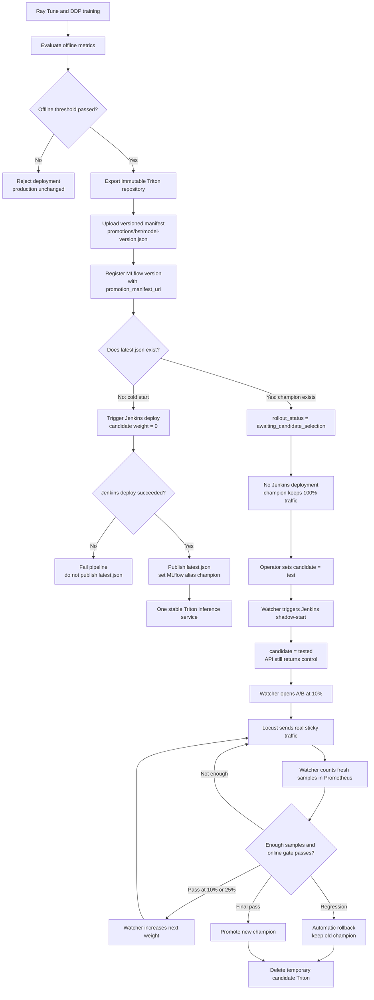
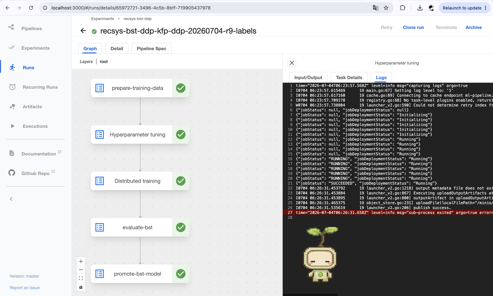
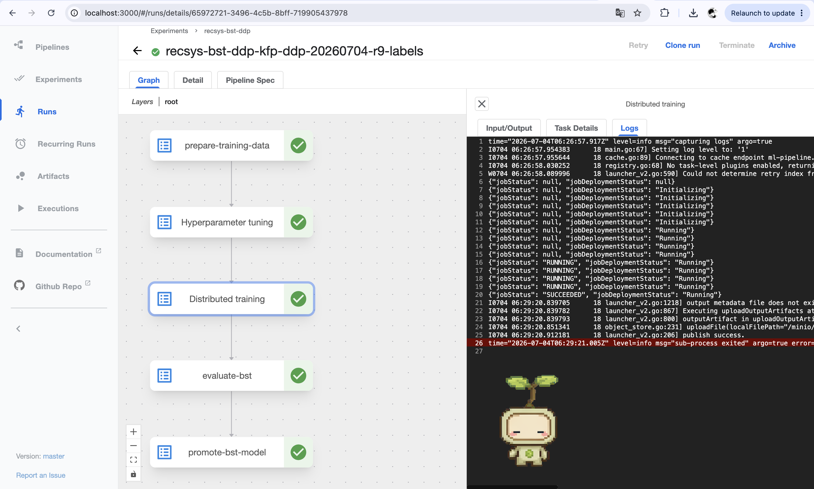
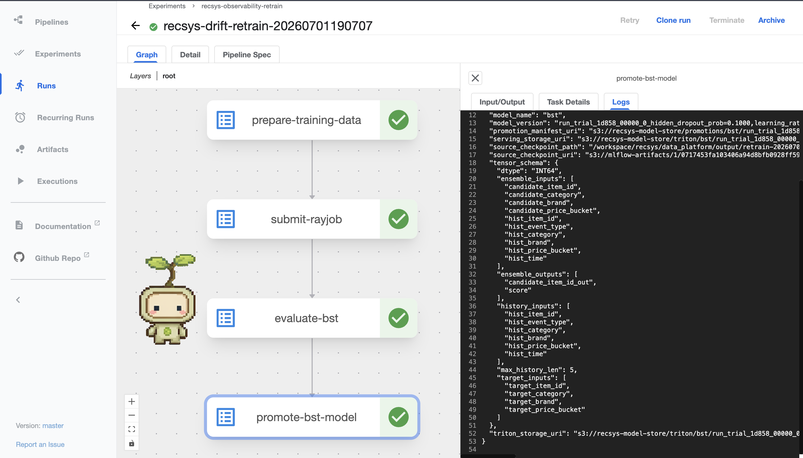
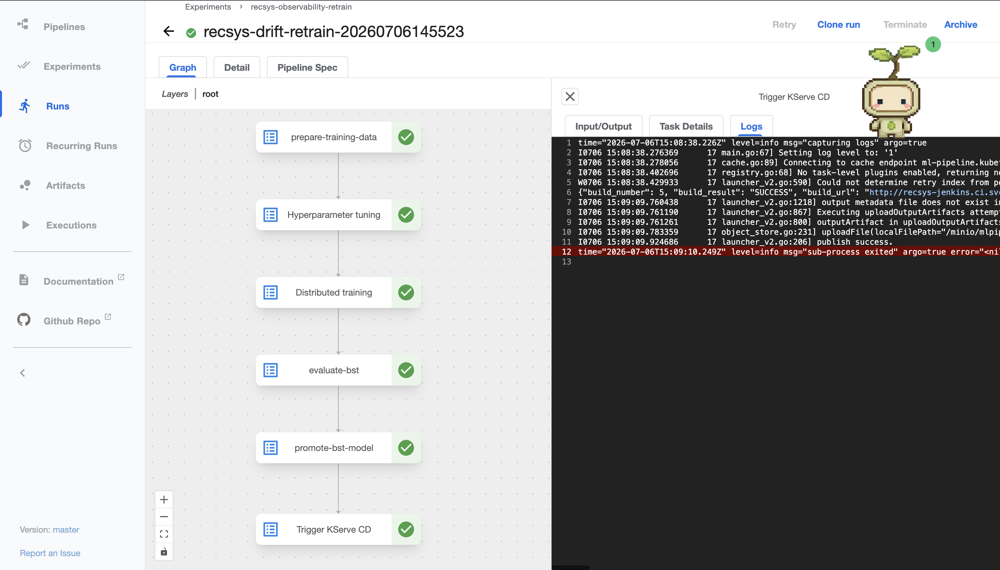
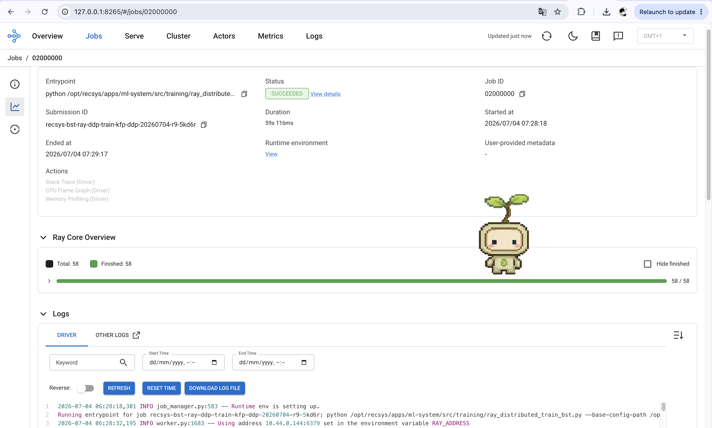
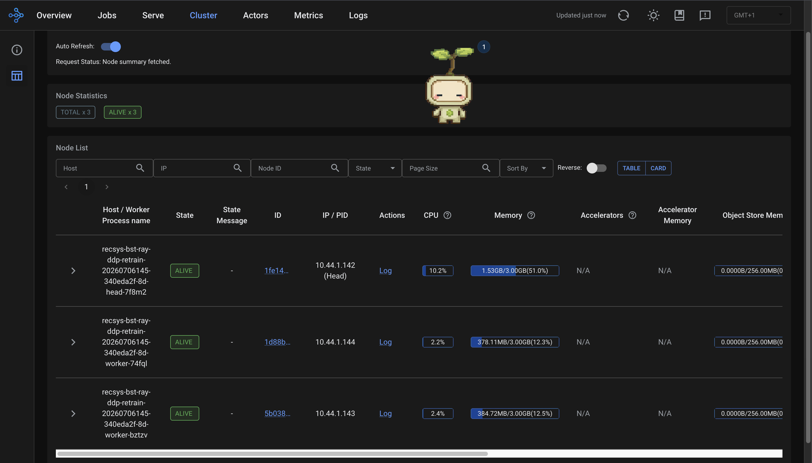
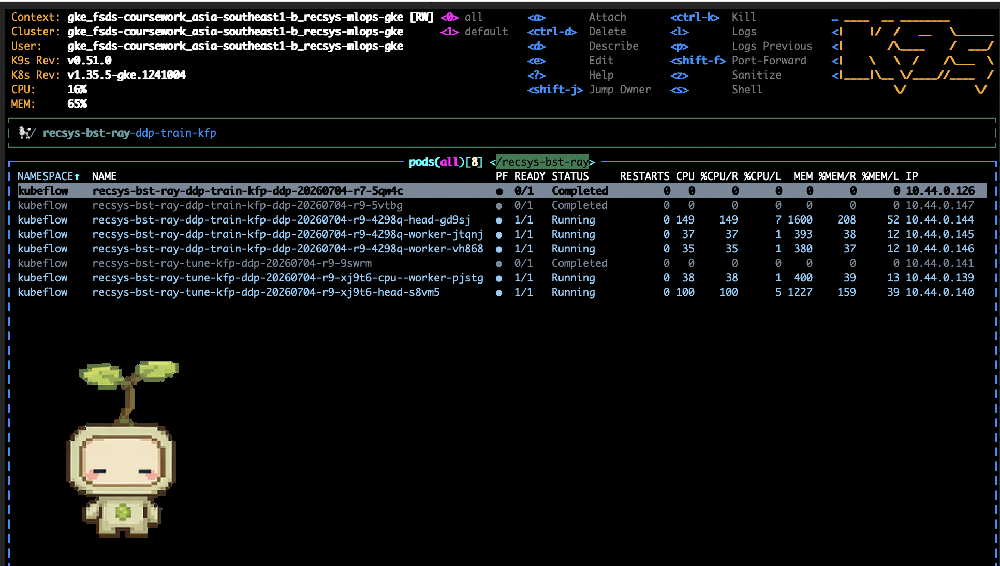

# ML Pipelines

## Training Pipeline

### Tech stacks

- **Kubeflow Pipelines (KFP):** orchestrates the ML workflow as containerized steps.
- **Feast PostgreSQL offline store:** `prepare-training-data` reads entity/label rows from `feature_store.ml_ranking_labels`, then uses Feast native `FeatureStore.get_historical_features(...)` with FeatureService `bst_ranking_v1`.
- **Feast Redis online store:** online serving stays separate from the training pipeline; the training path uses point-in-time historical retrieval from PostgreSQL.
- **Spark submit image:** runs the data-prep CLI inside the KFP step. Feast's core offline store for this coursework scope is PostgreSQL; extra Spark packages in the image are not part of the Feast store.
- **PyTorch BST model:** trains the existing `BST` recommender model using `recommenderDataset` and `Trainer`.
- **KubeRay RayJob + Ray Tune:** the first Ray step runs small, fast hyperparameter tuning trials (`1` epoch, `1%` training data by default) and writes `tune_result.json`.
- **KubeRay RayJob + Ray Train DDP:** the second Ray step consumes the best tune config and runs real distributed PyTorch training (`DistributedDataParallel`) with small defaults (`1` epoch, `2%` training data, `2` workers) so proof runs quickly.
- **MLflow + MinIO + Postgres model registry:** stores metrics, checkpoints, artifacts, model registry versions, and promoted model metadata.
- **Triton-compatible promotion:** exports the best BST checkpoint into an immutable Triton serving layout, uploads a versioned promotion manifest, and records that manifest URI on the MLflow model version.
- **Champion-aware deployment handoff:** automatically bootstraps the first valid model, but never deploys a later retrained model until an operator explicitly sets `candidate=test` in MLflow.

Notebook-to-pipeline mapping:

| Notebook step | Pipeline step | What it does |
| --- | --- | --- |
| Load labels and historical features through Feast | `prepare-training-data` | Reads PostgreSQL entity/label rows from `feature_store.ml_ranking_labels`, retrieves point-in-time features through Feast `bst_ranking_v1`, and prepares BST rows. |
| Split train/validation/test data | `prepare-training-data` | Writes `train.jsonl`, `val.jsonl`, `test.jsonl`, and dataset metadata under the configured split output directory. |
| Tune hyperparameters | `Hyperparameter tuning` (`submit-rayjob`, `job_mode=tune`) | Submits KubeRay `RayJob` `recsys-bst-ray-tune`, then runs small Ray Tune trials and writes `tune_result.json`. |
| Distributed train model | `Distributed training` (`submit-rayjob-2`, `job_mode=distributed-train`) | Submits KubeRay `RayJob` `recsys-bst-ray-ddp-train`, then runs Ray Train `TorchTrainer` with PyTorch DDP, rank-aware data sharding, gradient synchronization, checkpointing, and Ray reporting. |
| Evaluate model | `evaluate-bst` | Evaluates the best Ray result on the test split and logs evaluation metrics. |
| Save/promote model | `promote-bst-model` | Exports the best checkpoint, writes Triton serving files, updates model metadata, and writes the promotion manifest. |
| Decide deployment handoff | `Bootstrap Or Await Candidate` | Checks the offline metric and `latest.json`. With no champion, it bootstraps the first model through Jenkins. With an existing champion, it leaves the new registry version undeployed until `candidate=test`. |

### Post-training deployment lifecycle

The important boundary is that successful training creates a **deployable
candidate artifact**, not an automatic production replacement. The only
automatic direct deployment is the cold-start bootstrap when
`s3://recsys-model-store/promotions/bst/latest.json` does not exist. Once a
champion exists, the Kubeflow run finishes with
`reason=champion_exists_waiting_for_candidate_tag`; it does not call Jenkins.

`candidate=test` starts shadow deployment, not A/B traffic. After shadow
deployment succeeds, the watcher changes the tag to `candidate=tested`. The
watcher then opens 10% automatically. Locust supplies real sticky traffic, but
does not issue rollout commands. At each stage the watcher waits until
Prometheus reports at least 100 fresh samples for both variants, asks Jenkins
to evaluate the online gate, then automatically advances 10% → 25% → 50% →
champion. `hold` keeps the current weight and waits for another fresh batch; a
failed gate rolls back automatically. Both terminal paths remove the temporary
candidate Triton service.

Newly promoted MLflow versions always carry `promotion_manifest_uri`. For a
legacy version created before this contract existed, the watcher quarantines a
missing URI as `candidate=invalid` and `rollout_status=manifest_missing`
instead of retrying forever. The operator can repair it deterministically with
`model_rollout_demo.sh mark <registry-version> <versioned-manifest-uri>`.

### Code reference

| Pipeline concern | Code reference |
| --- | --- |
| KFP components and dependency graph | [`bst_training_pipeline.py`](../../../apps/ml-system/src/kubeflow/pipelines/bst_training_pipeline.py) |
| Feast historical retrieval and temporal splits | [`prepare_bst_training_data.py`](../../../apps/ml-system/src/cli/prepare_bst_training_data.py) |
| KubeRay `RayJob` construction | [`submit_ray_job.py`](../../../apps/ml-system/src/cli/submit_ray_job.py) |
| Hyperparameter tuning | [`ray_tune_train_bst.py`](../../../apps/ml-system/src/training/ray_tune_train_bst.py) |
| Ray Train DDP lifecycle | [`ray_distributed_train_bst.py`](../../../apps/ml-system/src/training/ray_distributed_train_bst.py) |
| Evaluation and immutable Triton promotion | [`evaluate_bst.py`](../../../apps/ml-system/src/cli/evaluate_bst.py), [`model_promotion.py`](../../../apps/ml-system/src/registry/model_promotion.py) |
| Champion-aware handoff and rollout watcher | [`trigger_kserve_cd.py`](../../../apps/ml-system/src/cli/trigger_kserve_cd.py), [`model_rollout_controller.py`](../../../apps/ml-system/src/cli/model_rollout_controller.py) |
| Compilation, submission, and runtime mounts | [`compile_training_pipeline.py`](../../../apps/ml-system/src/kubeflow/pipelines/compile_training_pipeline.py), [`submit_pipeline_run.py`](../../../apps/ml-system/src/kubeflow/submit_pipeline_run.py), [`runtime.py`](../../../apps/ml-system/src/kubeflow/components/runtime.py) |
| Jenkins model rollout state machine | [`KServeModelCD.Jenkinsfile`](../../../jenkins/KServeModelCD.Jenkinsfile) |
| Progressive rollout changed-component CI/CD | [`detect_changed_components.py`](../../../jenkins/scripts/detect_changed_components.py), [`Jenkinsfile`](../../../Jenkinsfile), [`component_ci.sh`](../../../jenkins/scripts/component_ci.sh), [`component_build_publish.sh`](../../../jenkins/scripts/component_build_publish.sh), [`component_deploy.sh`](../../../jenkins/scripts/component_deploy.sh) |

### Compiled pipeline defaults

| Parameter | Current value |
| --- | --- |
| Pipeline name | `recsys-bst-feature-train-evaluate` |
| Entity input path | `postgresql://feature-postgres.recsys-dataflow.svc.cluster.local:5432/feature_store/feature_store.ml_ranking_labels` |
| Feature service | `bst_ranking_v1` |
| Split output | `/workspace/recsys/data_platform/output/ml/bst_split` |
| Dataset metadata | `/workspace/recsys/data_platform/output/ml/bst_split/dataset_version_meta.json` |
| Ray tune job name | `recsys-bst-ray-tune` |
| Ray DDP train job name | `recsys-bst-ray-ddp-train` |
| Ray namespace | `kubeflow` |
| Ray output | `/workspace/recsys/data_platform/output/ml/ray` |
| Ray tune output | `/workspace/recsys/data_platform/output/ml/ray/tune_result.json` |
| Ray final DDP output | `/workspace/recsys/data_platform/output/ml/ray/best_result.json` |
| Tune defaults | `training_percent=0.01`, `num_epochs=1`, `max_trials=2`, `parallel_trials=1` |
| DDP defaults | `distributed_training_percent=0.02`, `distributed_num_epochs=1`, `distributed_num_workers=2` |
| Evaluation metrics | `/workspace/recsys/data_platform/output/ml/eval_metrics.json` |
| Promotion manifest | `/workspace/recsys/data_platform/output/ml/serving/promotion_manifest.json` |
| Promotion metric | `test_ndcg_at_10` |
| KServe CD threshold | `0.0` |
| Stable champion manifest | `s3://recsys-model-store/promotions/bst/latest.json` |
| Versioned candidate manifest | `s3://recsys-model-store/promotions/bst/<model-version>.json` |
| Cold-start Jenkins job | `RecSys-KServe-Model-CD`, `ROLLOUT_STAGE=deploy` |
| Rollout handoff status | `/workspace/recsys/data_platform/output/ml/serving/kserve_cd_status.json` |

### Description

- `prepare-training-data` proves historical feature retrieval: it reads labels from PostgreSQL `feature_store.ml_ranking_labels`, calls Feast FeatureService `bst_ranking_v1`, then writes BST JSONL splits and dataset metadata.
- `Hyperparameter tuning` is the Kubeflow UI display name for internal task `submit-rayjob` with `job_mode=tune`: it creates KubeRay `RayJob` `recsys-bst-ray-tune`, runs small Ray Tune trials, and writes `/workspace/recsys/data_platform/output/ml/ray/tune_result.json`.
- `Distributed training` is the Kubeflow UI display name for internal task `submit-rayjob-2` with `job_mode=distributed-train`: it creates KubeRay `RayJob` `recsys-bst-ray-ddp-train`, consumes `tune_result.json`, and writes the final DDP result to `/workspace/recsys/data_platform/output/ml/ray/best_result.json`.
- The DDP training step is the real distributed training proof: `TorchTrainer` creates multiple workers, PyTorch DDP syncs gradients during `loss.backward()`, `DistributedSampler` shards data by rank, rank 0 saves the checkpoint, and all workers call Ray Train report with synced metrics.
- Both RayJobs should end with `jobStatus: SUCCEEDED`.
- `evaluate-bst` writes metrics to `/workspace/recsys/data_platform/output/ml/eval_metrics.json`.
- `promote-bst-model` writes `/workspace/recsys/data_platform/output/ml/serving/promotion_manifest.json`, uploads the matching versioned manifest to MinIO, and stores its URI on the new MLflow registry version.
- `Bootstrap Or Await Candidate` is the post-training decision step. When no stable manifest exists, it waits for a successful Jenkins deployment before publishing `latest.json` and assigning the MLflow `champion` alias. When a champion exists, it writes `rollout_status=awaiting_candidate_selection` and exits without calling Jenkins.
- A later model remains only a deployable registry candidate until an operator sets `candidate=test`. The watcher owns shadow deployment and the complete Prometheus-sample-driven 10% → 25% → 50% → terminal lifecycle; Locust only supplies request traffic.

### Image proof of Kubeflow pipeline preparing training data log

**Figure: Kubeflow `prepare-training-data` proof.** The log shows the first ML pipeline stage reading label/entity rows from PostgreSQL Feast offline store, calling Feast native historical retrieval with `bst_ranking_v1`, and writing the BST train/validation/test JSONL splits plus dataset metadata. This is the proof that training data is prepared from the feature store before Ray training starts.

### Image proof of Kubeflow pipeline submit Ray Tune and DDP RayJob logs

**Figure: Kubeflow `Hyperparameter tuning` proof.** The log shows Kubeflow submitting the first KubeRay `RayJob`, `recsys-bst-ray-tune`, in `job_mode=tune`. This stage runs small Ray Tune trials, selects the best hyperparameter config, writes `tune_result.json`, and passes that config into the later DDP training stage.

**Figure: Kubeflow `Distributed training` proof.** The log shows Kubeflow submitting the second KubeRay `RayJob`, `recsys-bst-ray-ddp-train`, in `job_mode=distributed-train`. This stage consumes the Ray Tune output, launches Ray Train with PyTorch DDP workers, and only succeeds after distributed training, checkpoint reporting, and result export complete.

### Image proof of Kubeflow pipeline model evaluation log

**Figure: Kubeflow `evaluate-bst` proof.** The log shows the best DDP checkpoint being evaluated on the held-out test split. The important proof points are the test metrics, such as loss, AUC, hit-rate, MRR, and NDCG, because these metrics become the promotion input.

### Image proof of Kubeflow pipeline model promotion

**Figure: Kubeflow `promote-bst-model` proof.** The log shows the selected DDP checkpoint being exported into the Triton model repository layout, registered with MLflow/model metadata, uploaded to the model store, and recorded in `promotion_manifest.json`. The manifest is the handoff artifact for model deployment.

**Figure: Kubeflow `Bootstrap Or Await Candidate` proof.** For a normal retraining run, capture `triggered=false`, `reason=champion_exists_waiting_for_candidate_tag`, the MLflow registry version, and the versioned `promotion_manifest_uri`; no Jenkins build should appear. For a clean cold-start run, capture `reason=initial_champion_bootstrap`, the successful Jenkins build number, the published `stable_manifest_uri`, and the MLflow champion version. These two outcomes prove that the first model is bootstrapped automatically while later models require explicit candidate selection.

Pipeline proof comments:

- `recsys-bst-ray-tune` is the first KubeRay `RayJob`; it runs fast Ray Tune trials only.
- `recsys-bst-ray-ddp-train` is the second KubeRay `RayJob`; it runs final distributed DDP training with the tuned config.
- `recsys-bst-ray-tune-<suffix>` is the Ray cluster created for that RayJob.
- `recsys-bst-ray-tune-<suffix>-head-...` is the Ray head pod. It coordinates the cluster, receives the Ray job submission, and schedules Ray Tune training tasks.
- `recsys-bst-ray-ddp-train-<suffix>-cpu-or-gpu-workers-worker-...` is the worker pod set used by Ray Train; each worker maps to a DDP rank.
- `recsys-bst-ray-tune-...` and `recsys-bst-ray-ddp-train-...` submitter pods run the Ray job entrypoints and wait for each RayJob status.
- Seeing the Ray head pod, worker pods, and submitter pod running together proves that the tune and DDP training stages execute through KubeRay rather than a single local process.

### Image proof of Ray Dashboard DDP distributed training

**Figure: Ray Dashboard DDP job proof.** This screenshot shows the distributed training Ray job rather than the tuning job. The proof points are the DDP entrypoint `ray_distributed_train_bst.py`, the Ray/KubeRay job status, and worker logs that mention the training worker group, `DistributedDataParallel`, `world_size=2`, separate ranks, `distributed_sampler=True`, and `ddp_gradient_sync=True`.

**Figure: Ray Dashboard DDP cluster proof.** This screenshot shows the Ray cluster resources used by distributed training. The expected evidence is one Ray head plus two Ray worker nodes, matching the configured DDP worker count and proving that final training runs across multiple Ray workers instead of one local process.

**Figure: k9s Ray Tune and DDP pod proof.** This screenshot shows the Kubernetes pod-level proof for both Ray stages. The `recsys-bst-ray-tune-...` pods belong to the hyperparameter tuning RayJob, while the `recsys-bst-ray-ddp-train-...` pods belong to the final distributed training RayJob. The DDP proof is the separate Ray head, multiple Ray worker pods, and completed submitter pod for `recsys-bst-ray-ddp-train`, which confirms Kubeflow launched a real multi-worker KubeRay training job.
