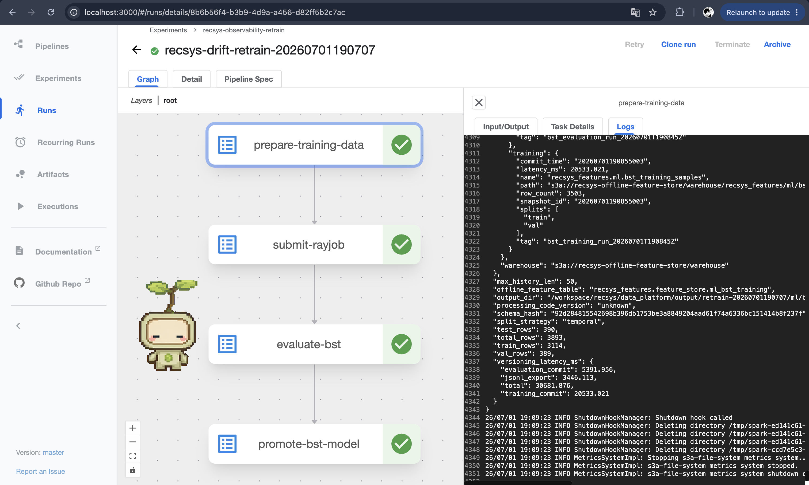
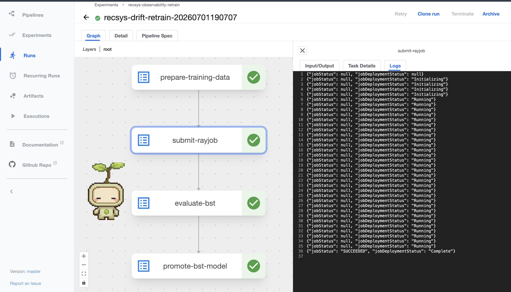
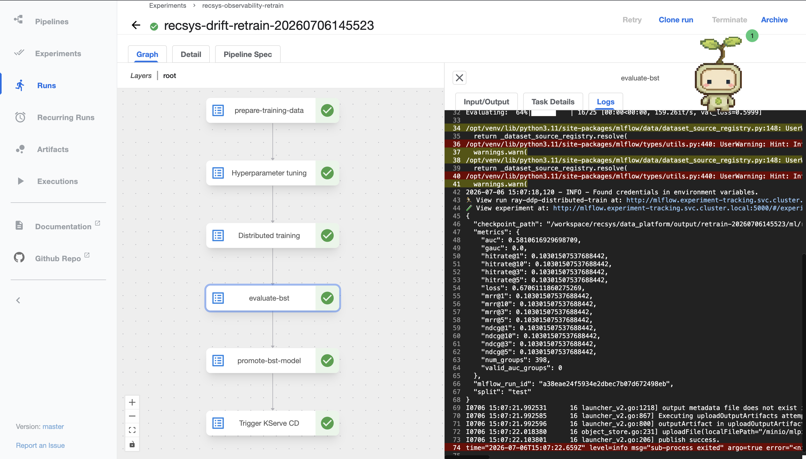
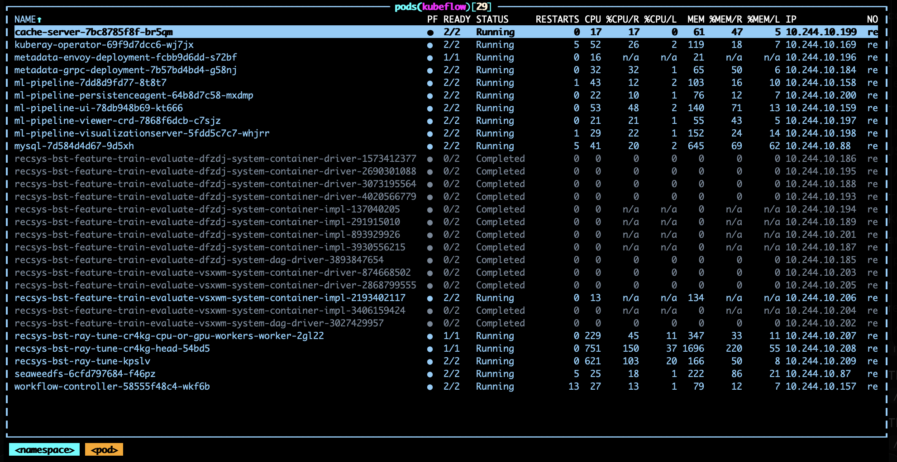
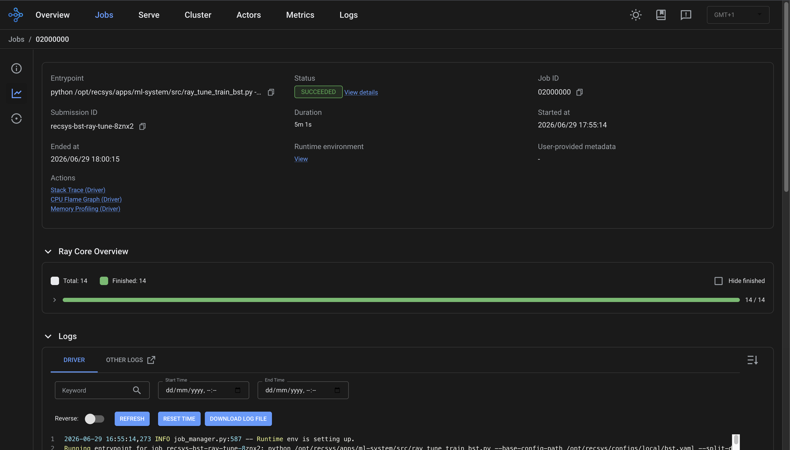

# ML Pipelines

## Training Pipeline

### Tech stacks 

- **Kubeflow Pipelines (KFP):** orchestrates the end-to-end training workflow as a containerized pipeline package.
- **Spark + Iceberg/Hudi + MinIO offline store:** produces authoritative offline feature tables in Apache Iceberg and dataset-version metadata in Hudi.
- **Feast historical feature retrieval:** `prepare-training-data` reads entity/label rows from Iceberg and then calls Feast `get_historical_features` with FeatureService `bst_ranking_v1`. Feast reads the Iceberg-exported offline views from `s3://recsys-offline-feature-store/feast/offline`.
- **PyTorch BST model:** trains the existing `BST` recommender model with the existing `recommenderDataset` and `Trainer` code.
- **KubeRay RayJob + Ray Tune:** replaces the notebook train step with distributed training/tuning. The KFP train component submits a RayJob with Ray head/worker pods and can run multiple trials in parallel.
- **MLflow + MinIO + Postgres model registry:** stores training metrics, model checkpoints/artifacts, and promoted model metadata.

Notebook-to-pipeline mapping:

| Notebook step | Pipeline step | What it does |
| --- | --- | --- |
| Load data from offline store through Feast and merge labels | `prepare-training-data` | Reads entity/label rows from Iceberg, pulls historical features through Feast FeatureService `bst_ranking_v1`, and prepares training rows. |
| Split train/validation data | `prepare-training-data` | Writes `train.jsonl`, `val.jsonl`, `test.jsonl`, and dataset metadata. |
| Train model | `submit-rayjob` | Runs distributed BST training/tuning through KubeRay/Ray Tune. |
| Evaluate model | `evaluate-bst` | Evaluates the best Ray result on the test split. |
| Save/promote model | `promote-bst-model` | Saves the best checkpoint/artifact and writes the promotion manifest. |

### Code reference

- [apps/ml-system/src/kubeflow/pipelines/bst_training_pipeline.py line 213](../../../apps/ml-system/src/kubeflow/pipelines/bst_training_pipeline.py#L213): defines the KFP pipeline `recsys_bst_pipeline`.
- [apps/ml-system/src/kubeflow/pipelines/bst_training_pipeline.py line 43](../../../apps/ml-system/src/kubeflow/pipelines/bst_training_pipeline.py#L43): `prepare_training_data` component passes `--feature-source feast`, `--entity-input-path`, `--feast-repo-path`, and `--feast-offline-root`.
- [apps/ml-system/src/kubeflow/pipelines/bst_training_pipeline.py line 90](../../../apps/ml-system/src/kubeflow/pipelines/bst_training_pipeline.py#L90): `submit_rayjob` component submits distributed training.
- [apps/ml-system/src/cli/prepare_bst_training_data.py line 237](../../../apps/ml-system/src/cli/prepare_bst_training_data.py#L237): builds BST rows through Feast `FeatureStore.get_historical_features`.
- [apps/ml-system/src/cli/prepare_bst_training_data.py line 414](../../../apps/ml-system/src/cli/prepare_bst_training_data.py#L414): writes BST JSONL train/validation/test splits and dataset metadata.
- [apps/ml-system/src/cli/submit_ray_job.py line 93](../../../apps/ml-system/src/cli/submit_ray_job.py#L93): builds the KubeRay `RayJob` with Ray head and worker pods.
- [apps/ml-system/src/training/ray_tune_train_bst.py line 126](../../../apps/ml-system/src/training/ray_tune_train_bst.py#L126): runs each Ray Tune BST training trial.
- [apps/ml-system/src/training/train.py line 73](../../../apps/ml-system/src/training/train.py#L73): shared training entrypoint used by each trial.
- [apps/ml-system/src/models/dataset.py line 6](../../../apps/ml-system/src/models/dataset.py#L6): existing `recommenderDataset` class.
- [apps/ml-system/src/models/model.py line 886](../../../apps/ml-system/src/models/model.py#L886): existing `BST` model.
- [apps/ml-system/src/models/trainer.py line 58](../../../apps/ml-system/src/models/trainer.py#L58): existing `Trainer` class.
- [apps/ml-system/src/kubeflow/pipelines/compile_training_pipeline.py line 26](../../../apps/ml-system/src/kubeflow/pipelines/compile_training_pipeline.py#L26): compiles the pipeline to `infra/kubeflow/compiled/bst_training_pipeline.yaml`.
- [apps/ml-system/src/kubeflow/submit_pipeline_run.py line 116](../../../apps/ml-system/src/kubeflow/submit_pipeline_run.py#L116): submits and waits for the KFP run.
- [apps/ml-system/src/kubeflow/components/runtime.py line 37](../../../apps/ml-system/src/kubeflow/components/runtime.py#L37): mounts the shared PVC and runtime secret into each KFP task.

### Running command to trigger KFP (feature engineering + training)

Terminal 1 - compile and expose the KFP API. Use local port `8890` to avoid colliding with other services that may already use `8888`.

```bash
cd /Users/KHOAI/anhkhoa/RecSys-MLops

make mlops-compile-kfp

kubectl port-forward -n kubeflow svc/ml-pipeline 8890:8888
```

Terminal 2 - submit the training pipeline run.

```bash
cd /Users/KHOAI/anhkhoa/RecSys-MLops

RUN_ID="manual-bst-distributed-$(date +%Y%m%d%H%M%S)"
cat > /tmp/recsys_kfp_bst_args.json <<JSON
{
  "pipeline_run_id": "${RUN_ID}",
  "entity_input_path": "recsys_features.feature_store.ml_ranking_labels",
  "feast_repo_path": "/opt/recsys/apps/data-platform/feature-store/feature_repo",
  "feast_offline_root": "s3://recsys-offline-feature-store/feast/offline",
  "feature_service_name": "bst_ranking_v1",
  "split_output_dir": "/workspace/recsys/data_platform/output/ml/bst_split",
  "ray_output_dir": "/workspace/recsys/data_platform/output/ml/ray",
  "ray_best_result_path": "/workspace/recsys/data_platform/output/ml/ray/best_result.json",
  "ray_status_path": "/workspace/recsys/data_platform/output/ml/ray/rayjob_status.json",
  "training_percent": 1.0,
  "num_epochs": 10,
  "max_trials": 2,
  "parallel_trials": 2,
  "cpus_per_trial": 1.0,
  "worker_replicas": 2,
  "head_ray_num_cpus": "0",
  "use_gpu": false
}
JSON

PYTHONPATH=apps/ml-system/src:apps/data-platform/src \
  uv run python apps/ml-system/src/kubeflow/submit_pipeline_run.py \
    --host http://127.0.0.1:8890 \
    --package-path infra/kubeflow/compiled/bst_training_pipeline.yaml \
    --experiment-name recsys-bst-ranking \
    --run-name "${RUN_ID}" \
    --arguments-json /tmp/recsys_kfp_bst_args.json \
    --timeout-seconds 7200 \
    --poll-seconds 30
```

The command prints the KFP `run_id` and state transitions such as `PENDING`, `RUNNING`, and `SUCCEEDED`.

### View Kubeflow Pipeline UI and logs

Terminal 3 - expose the KFP UI. Use local port `8085` so it does not collide with Airflow or other local UIs.

```bash
cd /Users/KHOAI/anhkhoa/RecSys-MLops

kubectl get pods -n kubeflow -l app=ml-pipeline-ui
kubectl port-forward -n kubeflow svc/ml-pipeline-ui 8085:80
```

Open the UI:

```text
http://localhost:8085
```

Where to view the run:

- Go to **Experiments**.
- Open experiment `recsys-bst-ranking`.
- Open the run named `manual-bst-distributed-<timestamp>`.
- In the **Graph** tab, click a pipeline step such as `prepare-training-data`, `submit-rayjob`, `evaluate-bst`, or `promote-bst-model`.
- In the right-side panel, open the **Logs** tab to view logs like the screenshot proof.

Best screenshots to capture:

- KFP run graph showing `prepare-training-data -> submit-rayjob -> evaluate-bst -> promote-bst-model`.
- `submit-rayjob` logs or details showing the RayJob/distributed training step.
- `evaluate-bst` logs showing evaluation metrics.

Optional commands to show distributed training proof:

```bash
kubectl get rayjob -n kubeflow recsys-bst-ray-tune -o wide

kubectl get pods -n kubeflow \
  -l ray.io/cluster \
  -o custom-columns=NAME:.metadata.name,NODE_TYPE:.metadata.labels.ray\\.io/node-type,PHASE:.status.phase,NODE:.spec.nodeName

RAY_HEAD_SVC="$(kubectl get svc -n kubeflow -o name | grep 'recsys-bst-ray-tune.*head-svc' | head -n 1)"
kubectl port-forward -n kubeflow "${RAY_HEAD_SVC}" 8265:8265
```

### Troubleshooting UI/log access

If the UI port-forward exits immediately, first check whether the UI pod is healthy:

```bash
kubectl get pods -n kubeflow -l app=ml-pipeline-ui
kubectl describe pod -n kubeflow -l app=ml-pipeline-ui | tail -120
```

The UI can only be opened when `ml-pipeline-ui` is `2/2 Running`. If it is `CrashLoopBackOff`, `Init:0/2`, or `Pending`, wait for the current heavy pipeline step to finish or cancel that run, then restart the UI deployment:

```bash
kubectl rollout restart deployment -n kubeflow ml-pipeline-ui
kubectl rollout status deployment -n kubeflow ml-pipeline-ui --timeout=180s
```

If local ports are already occupied, check and either reuse the existing port-forward or choose another local port:

```bash
lsof -nP -iTCP:8890 -sTCP:LISTEN
lsof -nP -iTCP:8085 -sTCP:LISTEN
```

If the UI is not available but proof is needed immediately, use CLI logs:

```bash
kubectl get pods -n kubeflow | grep recsys-bst-feature-train-evaluate

kubectl logs -n kubeflow <pipeline-pod-name> --all-containers --tail=200
```

Cancel a stuck KFP run:

```bash
PYTHONPATH=apps/ml-system/src:apps/data-platform/src uv run python - <<'PY'
import kfp

client = kfp.Client(host="http://127.0.0.1:8890")
client.terminate_run(run_id="<run_id>")
PY
```

### Description 

- `make mlops-compile-kfp` prints the compiled package path: `infra/kubeflow/compiled/bst_training_pipeline.yaml`.
- `kubectl port-forward -n kubeflow svc/ml-pipeline 8890:8888` exposes the KFP API for `submit_pipeline_run.py`.
- `submit_pipeline_run.py --host http://127.0.0.1:8890` prints the submitted KFP `run_id`, then state transitions while it waits for completion.
- In the KFP UI at `http://localhost:8085`, the run should show these successful stages: `prepare-training-data -> submit-rayjob -> evaluate-bst -> promote-bst-model`.
- The `prepare-training-data` stage proves feature engineering: it reads `recsys_features.feature_store.ml_bst_training`, writes BST JSONL splits, and writes dataset metadata under `/workspace/recsys/data_platform/output/ml/bst_split`.
- The `submit-rayjob` stage proves distributed training: it creates a KubeRay `RayJob` named `recsys-bst-ray-tune` with one Ray head pod and `worker_replicas=2` worker pods, then runs Ray Tune with `parallel_trials=2` and `num_epochs=10`.
- The RayJob status should end with `jobStatus: SUCCEEDED`; the best result is written to `/workspace/recsys/data_platform/output/ml/ray/best_result.json`.
- The evaluation stage writes metrics to `/workspace/recsys/data_platform/output/ml/eval_metrics.json`.
- The promotion stage writes the serving/promotion manifest to `/workspace/recsys/data_platform/output/ml/serving/promotion_manifest.json`.

### Image proof of Kubeflow pipeline preparing training data log



### Image proof of Kubeflow pipeline submit RayJob log



### Image proof of Kubeflow pipeline model evaluation log



### Image proof of distributed Ray cluster training



Comments:

- `recsys-bst-ray-tune` is the KubeRay `RayJob` submitted by the Kubeflow `submit-rayjob` step. This is the distributed training job, not a local notebook run.
- `recsys-bst-ray-tune-<suffix>` is the Ray cluster created for that RayJob.
- `recsys-bst-ray-tune-<suffix>-head-...` is the Ray head pod. It coordinates the cluster, receives the Ray job submission, and schedules Ray Tune training tasks.
- `recsys-bst-ray-tune-<suffix>-cpu-or-gpu-workers-worker-...` is the Ray worker pod. It joins the Ray cluster and executes training tasks/trials assigned by the head pod.
- `recsys-bst-ray-tune-...` submitter pod runs the Ray job entrypoint and waits for the distributed RayJob status.
- Seeing the Ray head pod, worker pod, and submitter pod running together proves that training is executed through a distributed Ray cluster instead of a single local process.

### Image proof of RayJob successful run


