# Novel MLOps Rollout Ideas

This document records the runnable lifecycle and proof plan for two connected
MLOps runtime features plus their production CI/CD integration:

1. **Shadow Deployment Before A/B**: the candidate receives asynchronous
   shadow inference, while every user response still comes from the champion.
2. **Champion/Challenger Automatic Rollback**: Prometheus gates compare the
   candidate with the control; a regression automatically restores
   champion-only traffic.
3. **Progressive Rollout CI/CD**: source changes are detected as the dedicated
   `rollout` component, tested, built, published, and deployed automatically by
   the main Jenkins pipeline.

The workflow uses MLflow as the model registry, a watcher pod as the trigger,
Jenkins as the rollout executor, KServe/Triton as the inference runtime,
FastAPI as the shadow/A/B router, and Prometheus/Grafana as the decision and
evidence layer.

The complete shadow → 10% → 25% → 50% → promote/rollback lifecycle is now
covered by CI/CD. It is no longer only a demo script or a manually synchronized
Jenkins workspace.

## End-To-End Lifecycle

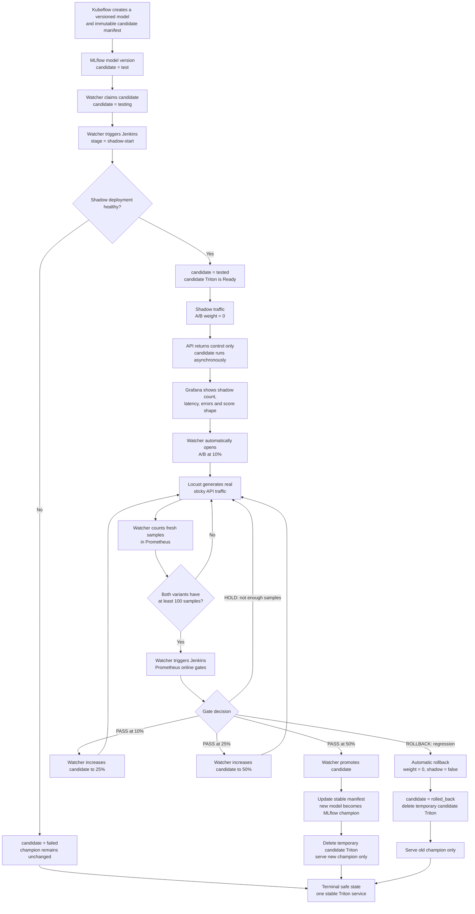

### Workflow Explanation

1. Kubeflow registers a model version and writes a versioned promotion
   manifest. The operator selects that exact registry version by setting its
   MLflow tag to `candidate=test`.
2. The `recsys-model-rollout-watcher` polls MLflow. It changes the tag to
   `testing`, assigns the MLflow `candidate` alias, and triggers the Jenkins
   `RecSys-KServe-Model-CD` job with `ROLLOUT_STAGE=shadow-start`.
3. Jenkins deploys a temporary candidate KServe/Triton `InferenceService`.
   FastAPI keeps `AB_CANDIDATE_WEIGHT_PERCENT=0`, returns the control result to
   the user, and calls the candidate asynchronously for telemetry only.
4. After a successful shadow deployment, the watcher records
   `candidate=tested` and automatically opens A/B at 10%. The watcher owns the
   complete online lifecycle: 10%, 25%, 50%, and final promotion.
5. Locust only generates real requests with varying user IDs so sticky routing
   produces samples for both variants. For every weight, the watcher queries
   `model_predictions_total` in Prometheus for the same `experiment_id` and
   stage start time. It does not call Jenkins until both control and candidate
   have at least 100 fresh samples. Jenkins then evaluates:

   - `hold` when either variant has fewer than 100 samples;
   - `rollback` when candidate error rate is more than `0.02` above control,
     candidate p95 latency is more than `1.5x` control, or its confidence proxy
     is below `0.95x` control;
   - `promote` when the current gate passes. At 10% and 25%, the watcher
     advances automatically. After the 50% gate, it promotes automatically.

6. `hold` keeps the current weight and resets the stage sample window; the
   watcher waits for another fresh sample batch while Locust continues. A
   failed gate invokes the Jenkins rollback stage in the same build. A
   successful final promotion replaces the stable model. Both terminal paths
   disable A/B and shadow routing, set candidate weight to zero, and remove the
   temporary candidate inference service. Therefore the old Triton candidate
   is not kept after the experiment.

### CI/CD Integration - Implemented

The main `RecSys-GitHub-CICD` flow treats this feature as the changed component
`rollout`. Changes to the watcher controller, Model-CD executor, watcher Helm
resource, serving/observability contracts, or rollout load test set
`RUN_ROLLOUT=true` and execute one production path:

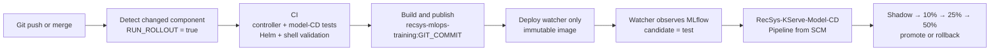

`RecSys-Progressive-Rollout-CICD` is the manual proof job for the same shared
pipeline; it does not duplicate deployment logic. The runtime
`RecSys-KServe-Model-CD` job checks out the current main revision for every
stage, so progressive rollout no longer depends on a copied
`RECSYS_CI_WORKSPACE`. During component CD, the idempotent Jenkins seed updates
both jobs through the authenticated Jenkins script endpoint without restarting
the controller that is executing the deployment.

| CI/CD responsibility | Implemented behavior |
|---|---|
| Change detection | Controller, Model-CD, watcher Helm, serving/observability, and rollout load-test changes set `RUN_ROLLOUT=true`. |
| Continuous integration | Runs rollout controller tests, Model-CD serving contracts, Helm lint/template validation, and shell syntax checks. |
| Build and publish | Builds `recsys-mlops-training` and publishes an immutable image tagged with `GIT_COMMIT`. |
| Continuous deployment | Applies the new image to `deployment/recsys-model-rollout-watcher` and waits until the rollout is Ready. |
| Jenkins job reconciliation | Creates or updates `RecSys-Progressive-Rollout-CICD` and the SCM-backed `RecSys-KServe-Model-CD` without restarting Jenkins. |
| Runtime model delivery | The watcher triggers SCM-backed Jenkins stages for shadow, 10%, 25%, 50%, evaluation, promotion, or rollback. |

Therefore the two runtime ideas in this document have both layers of
automation: software CI/CD maintains the rollout controller itself, while
model CD executes the lifecycle for each MLflow candidate.

### MLflow Tag State Machine

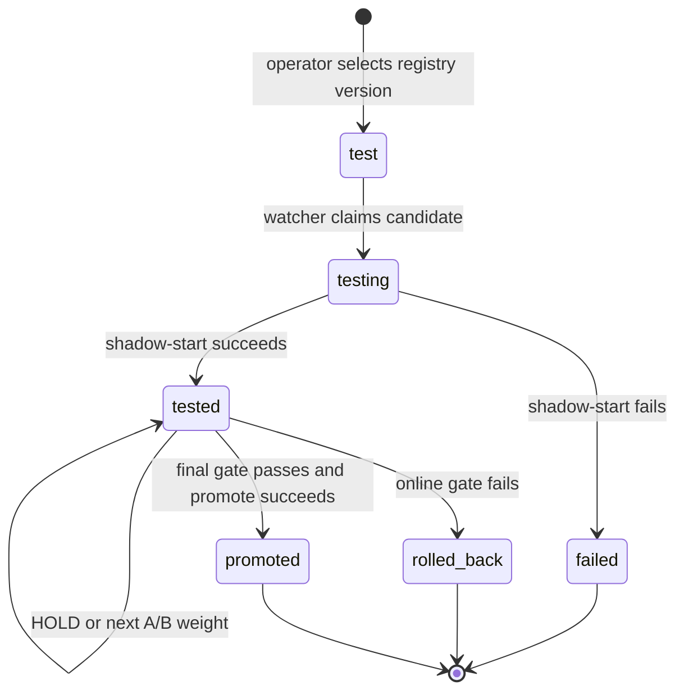

`registry version` is the numeric MLflow model-registry version used by the
CLI. `model_version` is the immutable serving version stored in its tags and
manifest. `rollout_experiment_id` links MLflow, API metrics, Prometheus,
Grafana, and Jenkins evidence for one rollout.

## Implementation References

| Responsibility | Implementation |
|---|---|
| Watch MLflow and drive lifecycle tags | [`model_rollout_controller.py`](../../../apps/ml-system/src/cli/model_rollout_controller.py) |
| Progressive rollout demo commands | [`model_rollout_demo.sh`](../../../jenkins/scripts/model_rollout_demo.sh) |
| Jenkins rollout stages and gates | [`KServeModelCD.Jenkinsfile`](../../../jenkins/KServeModelCD.Jenkinsfile), [`model_cd.py`](../../../jenkins/scripts/model_cd.py) |
| Champion-only verification | [`verify_champion_only.sh`](../../../jenkins/scripts/verify_champion_only.sh) |
| Watcher deployment | [`model-rollout-watcher.yaml`](../../../infra/helm/recsys-ci/templates/model-rollout-watcher.yaml) |
| Changed-component CI/CD | [`detect_changed_components.py`](../../../jenkins/scripts/detect_changed_components.py), [`Jenkinsfile`](../../../Jenkinsfile), [`component_ci.sh`](../../../jenkins/scripts/component_ci.sh), [`component_build_publish.sh`](../../../jenkins/scripts/component_build_publish.sh), [`component_deploy.sh`](../../../jenkins/scripts/component_deploy.sh) |
| Shadow/A/B serving | [`shadow.py`](../../../apps/api-serving/src/shadow.py), [`ab_testing.py`](../../../apps/api-serving/src/ab_testing.py) |
| KServe/Triton resources | [`inferenceservice.yaml`](../../../infra/helm/recsys-serving/templates/inferenceservice.yaml) |
| Grafana dashboard | [`model-ab-testing.json`](../../../infra/helm/recsys-observability/dashboards/model-ab-testing.json) |

## Proof Environment

The proof uses MLflow registry Version 14 as the candidate, Jenkins build 21
for shadow deployment, and Grafana experiment `bst-20260707085530`. The three
proof UIs are:

- MLflow: `http://localhost:5000`
- Jenkins job: `http://localhost:8080/job/RecSys-KServe-Model-CD/`
- Grafana dashboard:
  `http://localhost:3000/d/recsys-model-ab-testing`

Grafana screenshots use **Last 15 minutes**, **5s refresh**, and the exact
experiment filter `bst-20260707085530`; evidence from older experiment IDs is
not mixed into this proof.

## Evidence Sequence

The following figures are ordered by lifecycle transition so the proof reads
like the runtime sequence rather than a command-by-command runbook.

### W01 - Clean Champion-Only Baseline

The baseline contains one Ready `recsys-bst-triton` service. A/B, shadow, and
candidate weight are all zero before candidate selection.

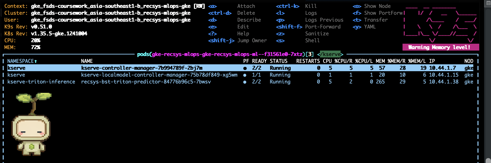

**Figure W01.** Champion-only baseline before selecting a new candidate.

### W02 - Select The Candidate In MLflow

The MLflow UI shows the selected registry version with `candidate=test` and a
versioned `promotion_manifest_uri`. This tag is the automatic watcher trigger.

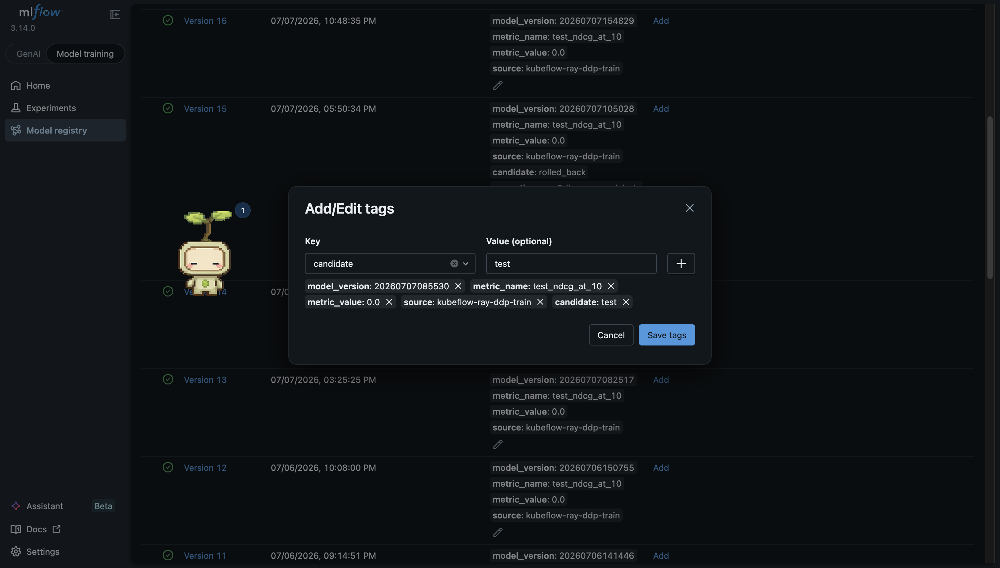

**Figure W02.** A specific MLflow registry version is selected for rollout.

### W03 - Watcher Claims And Triggers Jenkins

Identity of the captured proof run:

```text
MLflow registry version: 14
Model version: 20260707085530
Experiment ID: bst-20260707085530
Candidate manifest: s3://recsys-model-store/promotions/bst/20260707085530.json
Shadow Jenkins build: 21
```

The watcher audit output records the Jenkins build number plus final status
`candidate=tested` and `rollout_status=shadow_ready`. The transient
`candidate=testing` state may be too fast for the MLflow UI, so the watcher log
and build number are the durable proof of the claim.

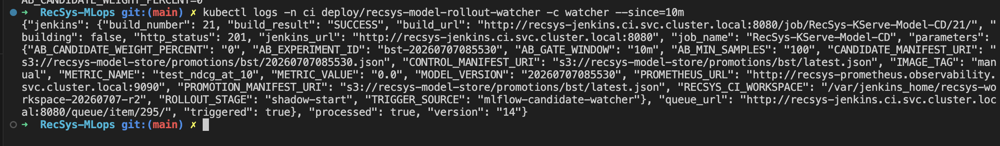

**Figure W03-A.** The watcher audit output ties MLflow Version 14 to Jenkins
build 21, `ROLLOUT_STAGE=shadow-start`, candidate manifest
`20260707085530.json`, and experiment `bst-20260707085530`. The successful
result proves the trigger came from `mlflow-candidate-watcher` rather than a
manual Jenkins build.

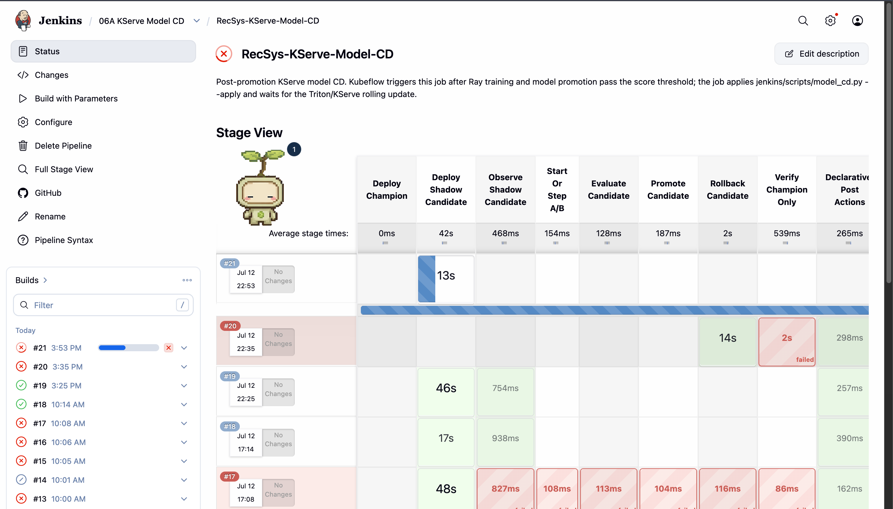

**Figure W03-B.** Jenkins build 21 appears automatically and starts the
`Deploy Shadow Candidate` stage. This is the UI-level evidence for the watcher
to Jenkins transition.

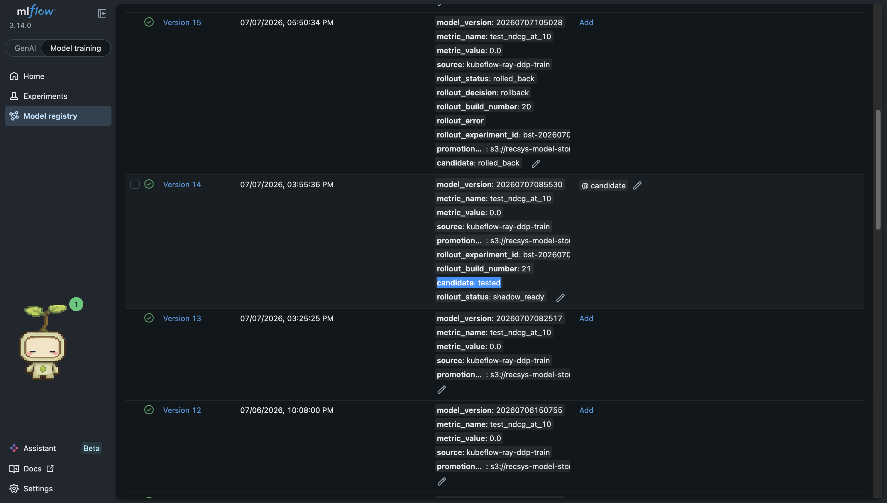

**Figure W03-C.** MLflow Version 14 is the selected candidate and carries the
`@candidate` alias, `candidate=tested`, `rollout_status=shadow_ready`, and
`rollout_build_number=21`. Version 15 above it belongs to an earlier rollback
branch; keeping both records demonstrates that MLflow retains rollout history
instead of overwriting failed experiments.

### W04 - Jenkins Shadow Deployment Succeeds

In Jenkins, open the build number reported by W03 and capture the stage view or
console containing `Deploy Shadow Candidate` and `Observe Shadow Candidate`.

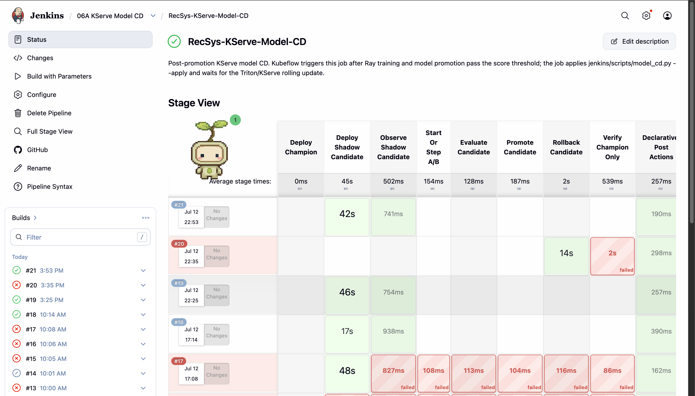

**Figure W04.** Jenkins build 21 completes both `Deploy Shadow Candidate` and
`Observe Shadow Candidate` successfully. A/B, evaluation, promotion, and
rollback stages remain skipped because this build performs shadow deployment
only.

### W05 - Candidate Triton Exists But User Weight Is Zero

Both stable and candidate `InferenceService` objects are Ready, while
`AB_TEST_ENABLED=0`, `AB_SHADOW_ENABLED=1`, and candidate weight is `0`.

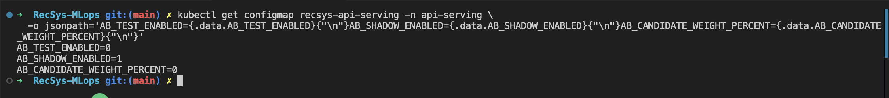

**Figure W05-A.** Runtime configuration is exactly `0/1/0`: A/B routing is
disabled, shadow inference is enabled, and no user traffic is assigned to the
candidate.

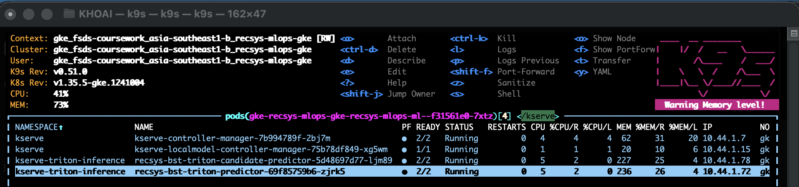

**Figure W05-B.** K9s shows one control predictor and one candidate predictor
running simultaneously. Combined with Figure W05-A, this proves the candidate
is live only as a shadow backend.

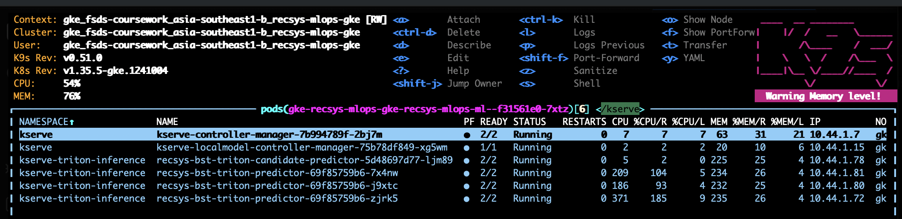

**Figure W05-C.** K9s confirms that the candidate predictor and the stable
predictor are simultaneously Ready. The three stable predictor rows are
autoscaled replicas of one control `InferenceService`, not three different
models. Figure W05-A supplies the routing context proving candidate weight is
still zero at this point.

## One-Command Locust Run For Autonomous Progressive Rollout

The watcher is already running in Kubernetes and owns every rollout
transition. The only command needed for W08-W13 generates real API traffic.
Open Grafana dashboard `Model A/B Testing`, select experiment
`bst-20260707085530`, then run:

```bash
bash jenkins/scripts/autonomous_rollout_locust.sh
```

```text
Defaults: 10 concurrent users, 2 users started per second, and a 45-minute
safety timeout. The script discovers the active MLflow registry version,
continues traffic across API restarts at 10%, 25%, and 50%, and stops Locust
as soon as the rollout reaches `champion` or `rolled_back`.
The former `15m 10 2` syntax remains accepted, but its fixed duration is
replaced by the terminal-state monitor so traffic cannot stop between stages.
```

Do not run separate `ab`, `evaluate`, or `promote` commands. Locust does not
change rollout configuration; it only supplies traffic. The watcher observes
Prometheus and owns every transition:

```text
10% → wait until candidate >= 100 and control >= 100 → evaluate
    → PASS: 25% → wait for a fresh sample batch → evaluate
    → PASS: 50% → wait for a fresh sample batch → evaluate
    → PASS: automatic promote

HOLD     → keep weight and wait for another fresh sample batch
ROLLBACK → restore the old champion and stop immediately
```

`processed=false` with `decision=WAIT`, `healthy=true` is not a failed gate.
Each weight change restarts the API so the next stage begins with a new metric
series. `phase=warming_up_after_stage_transition` or
`waiting_for_traffic_or_first_prometheus_scrape` is expected until Prometheus
has two scrapes. `collecting_prometheus_samples` then reports the current
percentage toward the 100/100 requirement. The finalized controller uses the
elapsed duration of each stage as `AB_GATE_WINDOW`, so later decisions do not
reuse earlier comparison windows. The captured build 26 still shows the
previous fixed `10m` setting; build 28 demonstrates the corrected stage-local
window of `494s` used by the final implementation.

Verified proof run for MLflow registry Version 14:

| Transition | Jenkins build | Fresh Prometheus samples |
| --- | ---: | ---: |
| Evaluate 10% | 24 | candidate 111 / control 1071 |
| Increase to 25% | 25 | new stage window |
| Evaluate 25% | 26 | candidate 130 / control 469 |
| Increase to 50% | 27 | new stage window |
| Evaluate 50% | 28 | candidate 193 / control 168; gate window 494s |
| Promote champion | 29 | terminal cleanup `0/0/0` |

### W08 - Automatic A/B At 10 Percent

Grafana shows both variants while Locust is running and candidate share is
close to the configured 10% target.

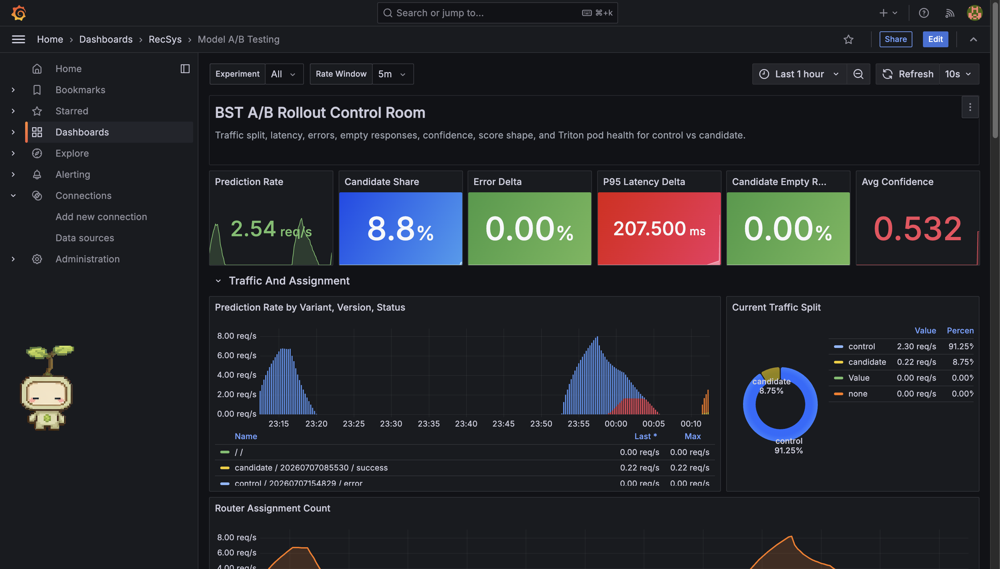

**Figure W08-A.** The control-room overview reports candidate share `8.8%`
and the traffic-split panel reports `8.75%`, which is consistent with sticky
hash assignment around a 10% target over a rolling five-minute rate window.
Both candidate `20260707085530` and control `20260707154829` have successful
prediction series. The dashboard dropdown was captured as `All`; the legend
identifies the exact candidate and control versions used by this rollout.

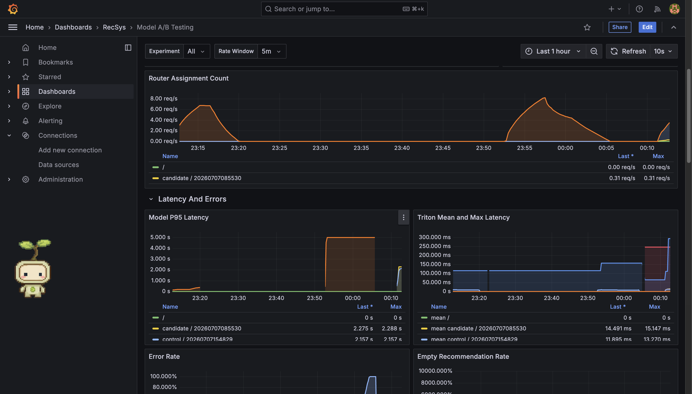

**Figure W08-B.** Router assignment count is non-zero for the candidate, and
the latency panels compare both versions. Candidate mean Triton latency is
about `14.5ms` versus control `11.9ms`; the model p95 values remain close
enough for the configured ratio gate. The red dashboard card is a visual
threshold, not itself a rollback decision—the Jenkins Prometheus gate owns the
decision.

### W09 - Automatic 10 Percent Gate

Jenkins `Evaluate Candidate` output is paired with Grafana error, latency,
sample, and quality-proxy panels. Watcher actions `evaluate_10` and the logged
`samples` object prove Prometheus reached the required counts before Jenkins
was triggered. `gate_passed_10` advances automatically; `hold_10` waits for a
fresh sample batch; `rolled_back` ends the rollout.

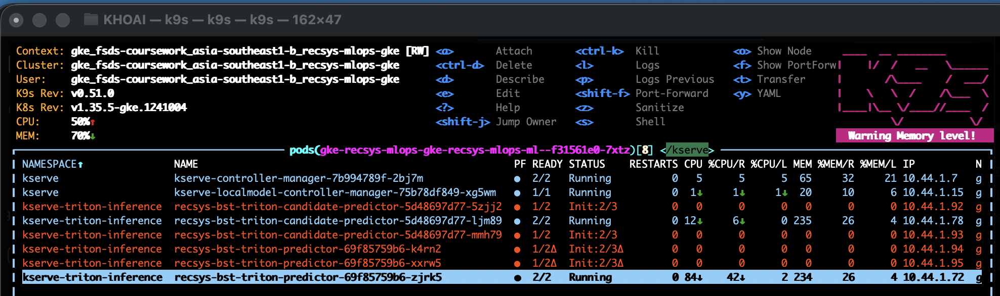

**Figure W09-A.** K9s captures KEDA/Kubernetes creating additional control and
candidate predictor replicas during Locust load. Existing predictors remain
Ready while new replicas pass their init containers.

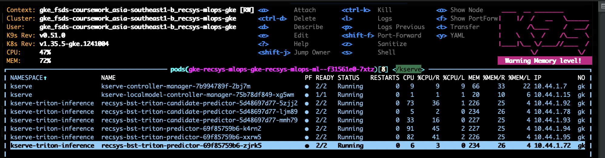

**Figure W09-B.** The new control and candidate replicas reach `2/2 Running`.
This proves sample collection continued on healthy Triton backends under load;
Prometheus evidence, rather than a manual decision, then allowed the watcher
to progress from 10% to 25%.

### W10 - Automatic A/B At 25 Percent

When the 10% gate passes, watcher action `increase_ab_25` and Grafana show
candidate share moving toward 25% without another CLI command.

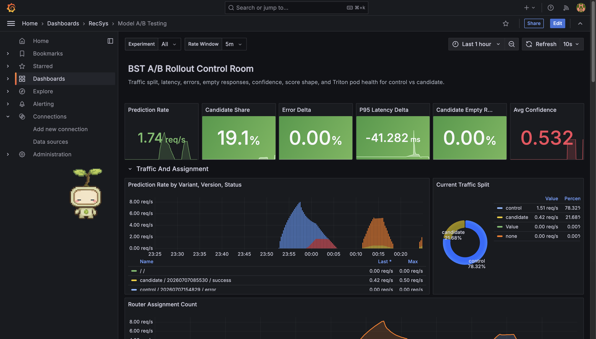

**Figure W10-A.** The rolling dashboard reports candidate share between
`19.1%` and `21.68%` while the configured stage is 25%. A short rolling window,
sticky assignment, deployment gaps, and finite traffic explain why the
instantaneous rate does not equal the configured weight exactly. Error delta
and candidate empty-response rate are both `0%`; candidate latency delta is
negative in this capture.

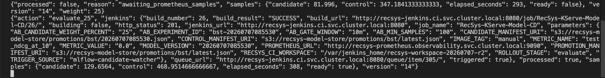

**Figure W10-B.** The watcher first records an incomplete batch at candidate
`81.996` and control `347.184`, then triggers `evaluate_25` only after the
fresh stage counts reach candidate `129.6564` and control `468.9515`. Jenkins
build 26 finishes `SUCCESS`, proving the 25% transition is automatic and
sample-gated.

### W11 - Automatic A/B At 50 Percent

After the 25% gate passes, watcher action `increase_ab_50` and the final
Grafana window show the 50% traffic split, error delta, p95 latency delta,
confidence proxy, and gate output.

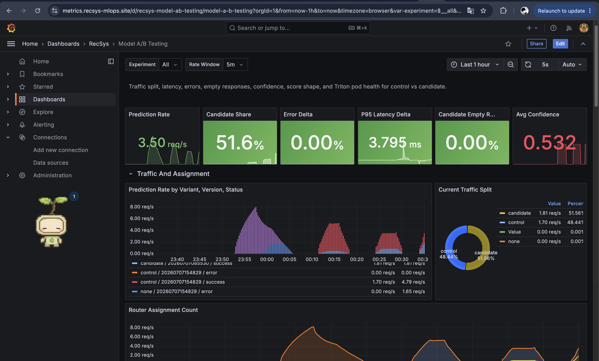

**Figure W11-A.** Candidate share reaches `51.6%`, closely matching the 50%
target. Error delta and candidate empty-response rate remain `0%`, while p95
latency delta is only `3.795ms`. The traffic graph and donut show both variants
receiving successful requests in the final guarded stage.

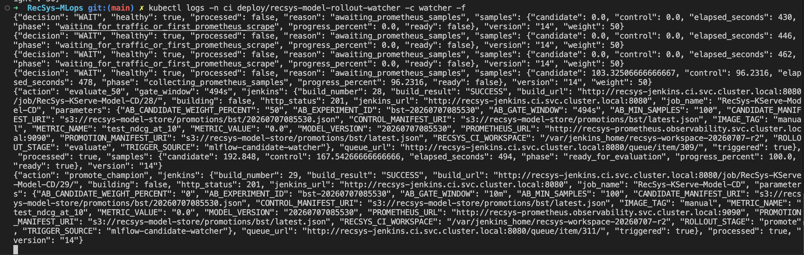

**Figure W11-B.** Watcher r4 labels the pre-gate state as `decision=WAIT` and
`healthy=true`, then records `phase=ready_for_evaluation`, candidate `192.848`,
control `167.543`, and the stage-local gate window `494s`. Jenkins build 28
succeeds, immediately followed by `promote_champion` and successful build 29.

### W12-R - Automatic Rollback Branch

If any gate detects regression, the watcher/Jenkins lifecycle invokes
rollback. The captured Version 14 run followed the successful promotion
branch, so no rollback screenshot is claimed for this sequence. MLflow
Version 15 in Figure W03-C retains `rollout_decision=rollback`,
`rollout_status=rolled_back`, and build 20 as historical registry evidence.
A separate controlled-regression run is required if live Grafana and Jenkins
rollback screenshots are needed.

### W12-P - Automatic Promotion Branch

If the final 50% gate passes, the watcher invokes promotion automatically.
The proof combines Jenkins `Promote Candidate`, MLflow `candidate=promoted`,
the new `champion` alias, and the old champion under alias `previous`.

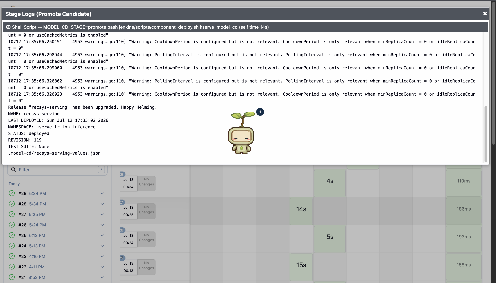

**Figure W12-P1.** Jenkins build 29 runs `MODEL_CD_STAGE=promote`, upgrades
Helm release `recsys-serving` to revision 119, and finishes the Promote
Candidate stage successfully. The build list also shows the complete green
sequence from build 24 through build 29. No manual promotion command was used.

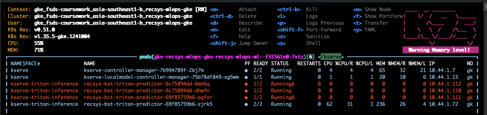

**Figure W12-P2.** Immediately after promotion, K9s no longer lists any
`recsys-bst-triton-candidate-predictor`. New stable predictor replicas are
starting while the existing champion replica continues serving, demonstrating
rolling cleanup without retaining the temporary candidate service.

### W13 - Terminal Cleanup: Exactly One Triton Inference Service

The terminal proof shows one stable Triton `InferenceService`, rollout flags
`0/0/0`, no candidate predictor, and API responses labelled only as control.

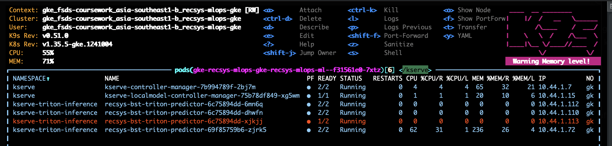

**Figure W13-A.** The stable predictor rollout is settling after promotion;
all visible inference pods use the stable `recsys-bst-triton-predictor` name
and no candidate predictor exists.

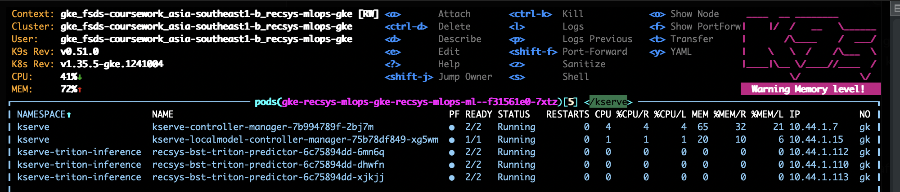

**Figure W13-B.** Final K9s capture shows only Ready replicas of the stable
predictor Deployment. Multiple rows are autoscaled replicas of one champion
`InferenceService`, not multiple Triton models. Terminal verification also
recorded rollout flags `0/0/0` and ten out of ten API responses labelled
`control`; after promotion, `control` refers to model `20260707085530`.
