# Novel MLOps Rollout Ideas

This document records the runnable lifecycle and proof plan for two connected
MLOps runtime features plus their production CI/CD integration:

1. **Shadow Deployment Before A/B**: the candidate receives asynchronous
   shadow inference, while every user response still comes from the champion.
2. **Champion/Challenger Automatic Rollback**: Prometheus gates compare the
   candidate with the control; a regression automatically restores
   champion-only traffic.
3. **Progressive Rollout CI/CD**: source changes are detected as the dedicated
   `rollout` component, tested, built, published, and deployed automatically by
   the main Jenkins pipeline.

The workflow uses MLflow as the model registry, a watcher pod as the trigger,
Jenkins as the rollout executor, KServe/Triton as the inference runtime,
FastAPI as the shadow/A/B router, and Prometheus/Grafana as the decision and
evidence layer.

The complete shadow → 10% → 25% → 50% → promote/rollback lifecycle is now
covered by CI/CD. It is no longer only a demo script or a manually synchronized
Jenkins workspace.

## End-To-End Lifecycle

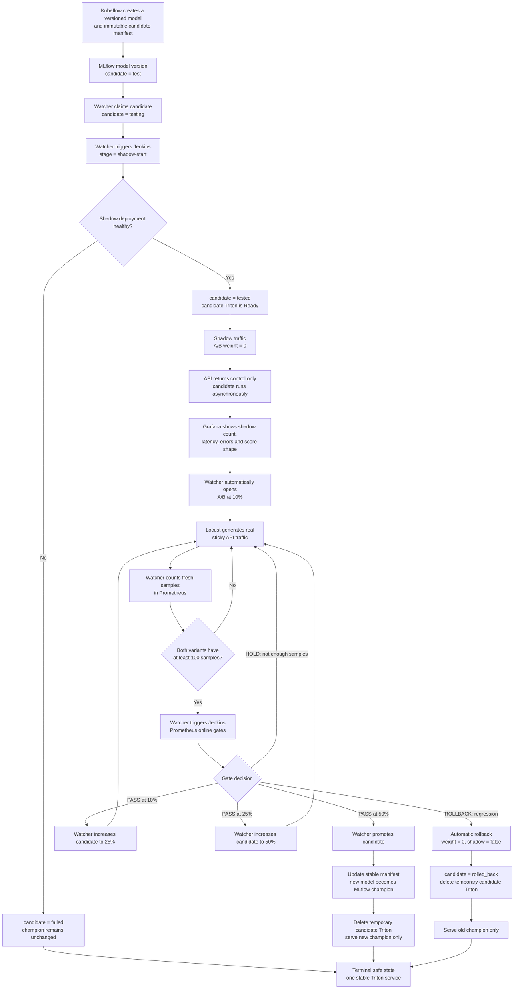
```mermaid
flowchart TD
  A["Kubeflow creates a versioned model<br/>and immutable candidate manifest"] --> B["MLflow model version<br/>candidate = test"]
  B --> C["Watcher claims candidate<br/>candidate = testing"]
  C --> D["Watcher triggers Jenkins<br/>stage = shadow-start"]
  D --> E{"Shadow deployment healthy?"}

  E -->|"No"| F["candidate = failed<br/>champion remains unchanged"]
  E -->|"Yes"| G["candidate = tested<br/>candidate Triton is Ready"]
  G --> H["Shadow traffic<br/>A/B weight = 0"]
  H --> I["API returns control only<br/>candidate runs asynchronously"]
  I --> J["Grafana shows shadow count,<br/>latency, errors and score shape"]

  J --> K["Watcher automatically opens<br/>A/B at 10%"]
  K --> L["Locust generates real<br/>sticky API traffic"]
  L --> M["Watcher counts fresh samples<br/>in Prometheus"]
  M --> X{"Both variants have<br/>at least 100 samples?"}
  X -->|"No"| L
  X -->|"Yes"| Y["Watcher triggers Jenkins<br/>Prometheus online gates"]
  Y --> N{"Gate decision"}

  N -->|"HOLD: not enough samples"| L
  N -->|"ROLLBACK: regression"| R["Automatic rollback<br/>weight = 0, shadow = false"]
  N -->|"PASS at 10%"| O["Watcher increases candidate to 25%"]
  O --> L
  N -->|"PASS at 25%"| P["Watcher increases candidate to 50%"]
  P --> L
  N -->|"PASS at 50%"| Q["Watcher promotes candidate"]

  Q --> S["Update stable manifest<br/>new model becomes MLflow champion"]
  S --> T["Delete temporary candidate Triton<br/>serve new champion only"]
  R --> U["candidate = rolled_back<br/>delete temporary candidate Triton"]
  U --> V["Serve old champion only"]

  F --> W["Terminal safe state<br/>one stable Triton service"]
  T --> W
  V --> W
```

### Workflow Explanation

The implementation has two cooperating control loops:

- the rollout watcher decides **when** to start shadow, open or increase A/B,
  evaluate a stage, promote, or stop; and
- Jenkins Model CD validates and applies the requested state to the shared
  `recsys-serving` Helm release, KServe/Triton, and the FastAPI router.

The following steps trace one candidate through the complete runtime path.

#### Step 1 — Kubeflow produces an immutable candidate

The model-promotion component converts the selected checkpoint into a versioned
Triton repository, builds a manifest containing the model version, metric,
tensor schema, versioned `triton_storage_uri`, and
`promotion_manifest_uri`, then uploads the repository and manifest. It also
creates a new MLflow model-registry version and copies the immutable model and
manifest identifiers into its tags. At this point the stable `latest` model has
not been changed.

**State after this step:** one versioned candidate repository and one MLflow
registry version exist; the current champion remains live.

**Code reference:** [`build_manifest()`](../../../apps/ml-system/src/registry/model_promotion.py#L471), [`register_mlflow_model_version()`](../../../apps/ml-system/src/registry/model_promotion.py#L511), and [`promote_best_model()`](../../../apps/ml-system/src/registry/model_promotion.py#L563).

#### Step 2 — The candidate is handed to the rollout watcher

After the offline score threshold passes, the Kubeflow handoff checks whether a
stable promotion manifest already exists. For an existing production champion,
it does not deploy the candidate directly. Instead, it idempotently sets the
new MLflow version to `candidate=test` and `rollout_status=pending`. This is the
normal progressive-rollout trigger. The controller's `mark` command provides
the same state transition for an explicitly selected version. Only a cold-start
with no stable manifest uses the separate direct `ROLLOUT_STAGE=deploy` path.

**State after this step:** MLflow is the durable queue; `candidate=test` means
the version is ready for the watcher to claim.

**Code reference:** [`queue_registry_candidate()`](../../../apps/ml-system/src/cli/trigger_kserve_cd.py#L145), [existing-champion handoff](../../../apps/ml-system/src/cli/trigger_kserve_cd.py#L329), and [manual-equivalent `mark` transition](../../../apps/ml-system/src/cli/model_rollout_controller.py#L560).

#### Step 3 — The watcher claims exactly one pending version

On each poll, the watcher searches MLflow for `candidate=test`, chooses the
newest registry version, verifies that its `promotion_manifest_uri` exists in
the tags, changes the candidate state to `testing`, sets
`rollout_status=shadow_deploying`, and assigns the MLflow `candidate` alias. If
the manifest tag is missing, the version becomes `invalid`; if shadow Jenkins
execution fails, the alias is removed and the version becomes `failed` with
`rollout_status=shadow_failed`.

**State after this step:** only the claimed MLflow version owns the `candidate`
alias and is eligible to enter online serving.

**Code reference:** [`pending_candidates()`](../../../apps/ml-system/src/cli/model_rollout_controller.py#L116), [`process_candidate()`](../../../apps/ml-system/src/cli/model_rollout_controller.py#L318), and [`watch_once()`](../../../apps/ml-system/src/cli/model_rollout_controller.py#L505).

#### Step 4 — The watcher creates one correlated Jenkins request

The watcher derives a stable `AB_EXPERIMENT_ID` from the immutable model
version and sends Jenkins the stable manifest, control manifest, candidate
manifest, experiment ID, requested weight, Prometheus endpoint, gate window,
minimum sample count, and `TRIGGER_SOURCE=mlflow-candidate-watcher`. It calls
the Jenkins `buildWithParameters` endpoint, waits for the queued item to become
a build, waits for `SUCCESS`, and stores the resulting experiment ID and build
number back on the MLflow version.

**State after this step:** MLflow, Jenkins, API metrics, Prometheus, and Grafana
can all be joined by the same experiment ID and Jenkins build number.

**Code reference:** [`rollout_params()`](../../../apps/ml-system/src/cli/model_rollout_controller.py#L188), [`trigger_stage()`](../../../apps/ml-system/src/cli/model_rollout_controller.py#L217), and [`trigger_jenkins_cd()`](../../../apps/ml-system/src/cli/trigger_kserve_cd.py#L221).

#### Step 5 — Jenkins deploys the candidate in shadow mode

For `ROLLOUT_STAGE=shadow-start`, only the Jenkins `Deploy Shadow Candidate`
and `Observe Shadow Candidate` stages run. A release-scoped Jenkins lock
serializes mutations to `recsys-serving`. Model CD reads both manifests and
renders a state with the stable model as control, the versioned model as
candidate, A/B disabled, candidate user weight `0`, and shadow enabled. The
candidate KServe `InferenceService` is rendered only because a candidate URI
and shadow mode are present. Helm applies the values and waits for both stable
and candidate KServe/Triton predictors to become Ready.

**Runtime state:** `AB_TEST_ENABLED=0`, `AB_SHADOW_ENABLED=1`,
`AB_CANDIDATE_WEIGHT_PERCENT=0`; both Triton services exist, but user responses
still come only from control.

**Code reference:** [Jenkins shadow stages](../../../jenkins/KServeModelCD.Jenkinsfile#L55), [`stage_manifests()`](../../../jenkins/python/model_cd/cli.py#L25), [`write_values()` shadow/A/B state](../../../jenkins/python/model_cd/config.py#L17), [candidate `InferenceService` condition](../../../infra/helm/recsys-serving/templates/inferenceservice.yaml#L43), and [Helm plus KServe readiness waits](../../../jenkins/python/model_cd/helm_release.py#L24).

#### Step 6 — FastAPI mirrors inference without affecting the response

The Helm-generated ConfigMap exposes the control/candidate endpoints, model
versions, experiment ID, shadow flag, queue limit, concurrency limit, and
timeout to the API. Because A/B is disabled, the synchronous route remains
control. The router separately returns a `shadow_candidate` route, and the
recommendation handler submits the already-built Triton payload to a bounded
asynchronous `ShadowRunner`. Queue overflow, timeout, or candidate errors are
recorded as shadow telemetry and never replace or block the control response.

**Runtime state:** the user receives the champion result; the candidate only
produces shadow count, latency, error/timeout, queue-depth, and score-shape
metrics.

**Code reference:** [API rollout ConfigMap](../../../infra/helm/recsys-serving/templates/api-configmap.yaml#L14), [`TritonABRouter.shadow_route()`](../../../apps/api-serving/src/ab_testing.py#L109), [request-to-shadow submission](../../../apps/api-serving/src/inference_api.py#L75), and [`ShadowRunner`](../../../apps/api-serving/src/shadow.py#L13).

#### Step 7 — Successful shadow automatically opens A/B at 10%

When the shadow Jenkins build succeeds, the watcher changes the MLflow version
to `candidate=tested` and `rollout_status=shadow_ready`. On the next poll,
`reconcile_progressive_candidate()` sees `shadow_ready` and triggers
`ROLLOUT_STAGE=ab-start` at the first configured progressive weight, `10` by
default. After Jenkins succeeds, the watcher records `rollout_status=ab_10`,
the stage start timestamp, weight, pending decision, and zeroed sample counters.
Jenkins applies A/B enabled, shadow disabled, and candidate weight `10`.

**Runtime state:** the experiment moves from `0/1/0` shadow configuration to
`1/0/10` A/B configuration.

**Code reference:** [default `10,25,50` rollout configuration](../../../apps/ml-system/src/cli/model_rollout_controller.py#L33), [post-Jenkins MLflow state updates](../../../apps/ml-system/src/cli/model_rollout_controller.py#L248), [automatic `shadow_ready` transition](../../../apps/ml-system/src/cli/model_rollout_controller.py#L405), [Jenkins A/B stage](../../../jenkins/KServeModelCD.Jenkinsfile#L81), and [A/B Helm values](../../../jenkins/python/model_cd/config.py#L48).

#### Step 8 — Sticky routing creates comparable control and candidate cohorts

For each request, FastAPI hashes `experiment_id:user_id` with SHA-256 and maps
the result to a bucket from `0` to `99`. A bucket lower than the candidate
weight routes to candidate; every other bucket routes to control. The same user
therefore remains on the same variant for one experiment, while increasing the
weight from 10 to 25 to 50 expands the candidate cohort without reshuffling the
existing assignments. The response and metrics carry `ab_variant`, model
version, and experiment ID.

**Runtime state:** real user responses now come from both variants, but routing
is deterministic and traceable.

**Code reference:** [sticky bucket and assignment](../../../apps/api-serving/src/ab_testing.py#L91), [control/candidate route construction](../../../apps/api-serving/src/ab_testing.py#L121), and [recommendation route selection](../../../apps/api-serving/src/inference_api.py#L75).

#### Step 9 — Every A/B response emits gate metrics

The API increments `model_predictions_total` with model version, response
status, A/B variant, and experiment ID. It also records
`model_prediction_latency_seconds` and, when a score exists,
`model_prediction_confidence`. Locust only supplies requests with varied user
IDs; it does not change rollout state. Prometheus scraping turns those API
metrics into the sample, error-rate, p95-latency, and confidence-proxy inputs
used by the gate.

**State after this step:** Prometheus has variant-specific online observations
for the exact experiment; shadow telemetry is evidence for shadow safety, while
promotion gates use the live A/B prediction metrics.

**Code reference:** [request observation](../../../apps/api-serving/src/inference_api.py#L107) and [`observe_model_prediction()`](../../../apps/api-serving/src/observability.py#L227).

#### Step 10 — The watcher waits for a fresh sample window

For every weight, the watcher measures from `rollout_stage_started_at`, first
allows the configured warm-up period, and then queries the increase in
`model_predictions_total` for the same experiment and elapsed window. Both
candidate and control must independently reach `AB_MIN_SAMPLES`, default `100`.
Until then it updates MLflow sample counters and returns healthy
`decision=WAIT`; no evaluate Jenkins build is triggered. A new weight or a
`hold` decision starts a fresh sample window so observations are not reused
across gates.

**State while waiting:** A/B weight stays unchanged and production continues
serving normally.

**Code reference:** [`stage_sample_counts()`](../../../apps/ml-system/src/cli/model_rollout_controller.py#L361) and [sample-window reconciliation](../../../apps/ml-system/src/cli/model_rollout_controller.py#L427).

#### Step 11 — Jenkins evaluates the current online gate

Once both variants are ready, the watcher triggers `ROLLOUT_STAGE=evaluate`
with a gate window equal to the current stage's observed duration. Jenkins runs
Model CD with `MODEL_CD_APPLY=0`, so evaluation does not mutate Helm state. The
CLI queries Prometheus and writes `.model-cd/ab-decision.json`. The gate returns:

- `hold` if either variant is below the minimum sample count;
- `rollback` if candidate error rate exceeds control by more than `0.02`,
  candidate p95 latency exceeds `1.5x` control, or candidate confidence proxy
  falls below `0.95x` control; or
- `promote` when the **current weight's gate** passes.

At 10% and 25%, `promote` means “this stage passed”; it does not yet mean that
the candidate becomes champion.

**Code reference:** [watcher evaluate trigger](../../../apps/ml-system/src/cli/model_rollout_controller.py#L461), [Jenkins decision-only evaluation](../../../jenkins/KServeModelCD.Jenkinsfile#L91), [CLI decision artifact](../../../jenkins/python/model_cd/cli.py#L67), and [`evaluate_candidate_gates()`](../../../jenkins/python/model_cd/promotion_gates.py#L27).

#### Step 12 — The gate result selects HOLD, ROLLBACK, or the next weight

The watcher reads the final `hold|promote|rollback` value from the completed
Jenkins console and persists it in MLflow.

- **HOLD:** keep the current weight, set `rollout_status=hold_<weight>`, reset
  the timestamp and counters, and wait for another fresh batch.
- **ROLLBACK:** Jenkins detects the rollback decision artifact in the same
  evaluate build, enters `Rollback Candidate`, forces weight `0`, and
  forward-deploys champion-only values. The watcher removes the candidate alias
  and records `candidate=rolled_back`, `rollout_status=rolled_back`.
- **PASS at 10% or 25%:** record `gate_passed_<weight>`; on the next poll,
  trigger `ab-step` with the next configured weight and reset the sample window.
- **PASS at 50%:** there is no next weight, so the watcher triggers the explicit
  `promote` stage.

**Code reference:** [Jenkins decision extraction and MLflow transitions](../../../apps/ml-system/src/cli/model_rollout_controller.py#L258), [Jenkins automatic rollback branch](../../../jenkins/KServeModelCD.Jenkinsfile#L117), and [next-weight/final-promotion selection](../../../apps/ml-system/src/cli/model_rollout_controller.py#L479).

#### Step 13 — Final promotion replaces the stable model safely

The explicit Jenkins `Promote Candidate` stage re-runs the online gates before
mutation. Model CD copies the versioned candidate repository to the stable
serving URI, updates the stable promotion manifest, and deploys the new model as
the stable KServe service. It temporarily retains the already-Ready candidate
during the stable/API cutover to avoid a DNS or readiness gap, then performs a
second champion-only deploy that removes the temporary candidate. Finally, the
watcher moves the former champion to MLflow alias `previous`, assigns
`champion` to the promoted version, removes the `candidate` alias, and records
`candidate=promoted`, `rollout_status=champion`.

**Terminal state:** A/B disabled, shadow disabled, weight `0`, one stable Triton
service, and the new model serving all users.

**Code reference:** [Jenkins promotion stage](../../../jenkins/KServeModelCD.Jenkinsfile#L108), [gate recheck and stable-manifest update](../../../jenkins/python/model_cd/cli.py#L87), [two-phase candidate retention and cleanup](../../../jenkins/python/model_cd/cli.py#L111), and [MLflow alias promotion](../../../apps/ml-system/src/cli/model_rollout_controller.py#L303).

#### Step 14 — Both terminal branches prove champion-only serving

After promotion or rollback, Jenkins runs `Verify Champion Only`. The script
asserts candidate weight `0` and shadow `0`, waits for the API rollout, sends 40
recommendation requests with different user IDs, rejects any candidate response,
and verifies that every response reports the configured control/champion model
version. Jenkins always archives `.model-cd/*`, including the rendered values,
gate decision, and deployed-model record.

**Terminal-state difference:** rollback keeps the old champion; promotion makes
the candidate the new champion. Both remove live candidate routing and the
temporary candidate `InferenceService`.

**Code reference:** [Jenkins terminal verification](../../../jenkins/KServeModelCD.Jenkinsfile#L132), [`champion_only.sh`](../../../jenkins/scripts/test/champion_only.sh#L1), and [Model CD artifact archival](../../../jenkins/KServeModelCD.Jenkinsfile#L146).

| Phase | A/B enabled | Shadow enabled | Candidate weight | Candidate Triton | User-visible model |
|---|---:|---:|---:|---|---|
| Champion baseline | `0` | `0` | `0` | absent | old champion |
| Shadow | `0` | `1` | `0` | Ready | old champion only |
| Progressive A/B | `1` | `0` | `10 → 25 → 50` | Ready | sticky control/candidate cohort |
| Rollback terminal | `0` | `0` | `0` | removed | old champion only |
| Promotion terminal | `0` | `0` | `0` | removed after cutover | new champion only |

### CI/CD Integration - Implemented

The main `RecSys-GitHub-CICD` flow treats this feature as the changed component
`rollout`. Changes to the watcher controller, Model-CD executor, watcher Helm
resource, serving/observability contracts, or rollout load test set
`RUN_ROLLOUT=true` and execute one production path:

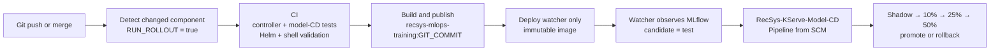
```mermaid
flowchart LR
  A["Git push or merge"] --> B["Detect changed component<br/>RUN_ROLLOUT = true"]
  B --> C["CI<br/>controller + model-CD tests<br/>Helm + shell validation"]
  C --> D["Build and publish<br/>recsys-mlops-training:GIT_COMMIT"]
  D --> E["Deploy watcher only<br/>immutable image"]
  E --> F["Watcher observes MLflow<br/>candidate = test"]
  F --> G["RecSys-KServe-Model-CD<br/>Pipeline from SCM"]
  G --> H["Shadow → 10% → 25% → 50%<br/>promote or rollback"]
```

`RecSys-Progressive-Rollout-CICD` is the manual proof job for the same shared
pipeline; it does not duplicate deployment logic. The runtime
`RecSys-KServe-Model-CD` job checks out the current main revision for every
stage, so progressive rollout no longer depends on a copied
`RECSYS_CI_WORKSPACE`. During component CD, the idempotent Jenkins seed updates
both jobs through the authenticated Jenkins script endpoint without restarting
the controller that is executing the deployment.

| CI/CD responsibility | Implemented behavior |
|---|---|
| Change detection | Controller, Model-CD, watcher Helm, serving/observability, and rollout load-test changes set `RUN_ROLLOUT=true`. |
| Continuous integration | Runs rollout controller tests, Model-CD serving contracts, Helm lint/template validation, and shell syntax checks. |
| Build and publish | Builds `recsys-mlops-training` and publishes an immutable image tagged with `GIT_COMMIT`. |
| Continuous deployment | Applies the new image to `deployment/recsys-model-rollout-watcher` and waits until the rollout is Ready. |
| Jenkins job reconciliation | Creates or updates `RecSys-Progressive-Rollout-CICD` and the SCM-backed `RecSys-KServe-Model-CD` without restarting Jenkins. |
| Runtime model delivery | The watcher triggers SCM-backed Jenkins stages for shadow, 10%, 25%, 50%, evaluation, promotion, or rollback. |

Therefore the two runtime ideas in this document have both layers of
automation: software CI/CD maintains the rollout controller itself, while
model CD executes the lifecycle for each MLflow candidate.

### MLflow Tag State Machine

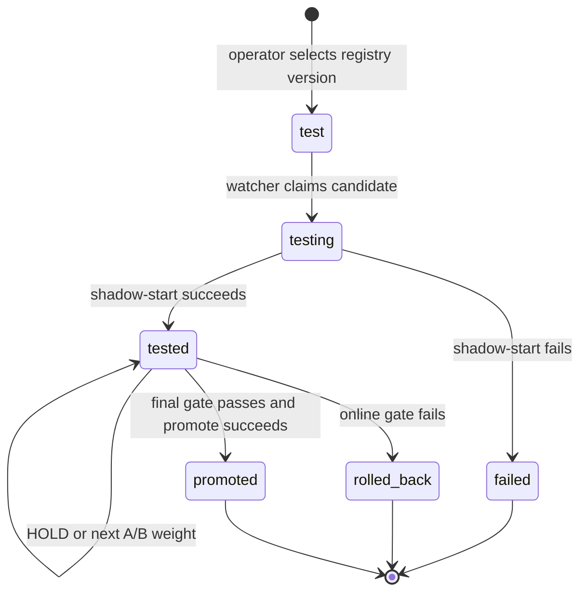
```mermaid
stateDiagram-v2
  [*] --> test: operator selects registry version
  test --> testing: watcher claims candidate
  testing --> tested: shadow-start succeeds
  testing --> failed: shadow-start fails
  tested --> tested: HOLD or next A/B weight
  tested --> rolled_back: online gate fails
  tested --> promoted: final gate passes and promote succeeds
  failed --> [*]
  rolled_back --> [*]
  promoted --> [*]
```

`registry version` is the numeric MLflow model-registry version used by the
CLI. `model_version` is the immutable serving version stored in its tags and
manifest. `rollout_experiment_id` links MLflow, API metrics, Prometheus,
Grafana, and Jenkins evidence for one rollout.

## Implementation References

| Responsibility | Implementation |
|---|---|
| Watch MLflow and drive lifecycle tags | [model_rollout_controller.py (line 112)](../../../apps/ml-system/src/cli/model_rollout_controller.py#L112), [model_rollout_controller.py (line 550)](../../../apps/ml-system/src/cli/model_rollout_controller.py#L550) |
| Jenkins rollout stages and gates | [`KServeModelCD.Jenkinsfile`](../../../jenkins/KServeModelCD.Jenkinsfile), [model-CD CLI](../../../jenkins/python/model_cd/cli.py), and [online promotion gates](../../../jenkins/python/model_cd/promotion_gates.py) |
| Champion-only verification | [verify_champion_only.sh (line 1)](../../../jenkins/scripts/test/champion_only.sh#L1), [verify_champion_only.sh (line 39)](../../../jenkins/scripts/test/champion_only.sh#L39) |
| Watcher deployment | [model-rollout-watcher.yaml (line 1)](../../../infra/helm/recsys-ci/templates/model-rollout-watcher.yaml#L1), [model-rollout-watcher.yaml (line 89)](../../../infra/helm/recsys-ci/templates/model-rollout-watcher.yaml#L89) |
| Changed-component CI/CD | [`components.json`](../../../jenkins/config/components.json), [`detector.py`](../../../jenkins/python/change_detection/detector.py), [`release_plan.py`](../../../jenkins/python/release_plan.py), [`Jenkinsfile`](../../../Jenkinsfile), [`component_ci.sh`](../../../jenkins/scripts/entrypoints/component_ci.sh), [`release_build_publish.sh`](../../../jenkins/scripts/entrypoints/release_build_publish.sh), and [`release_deploy_unit.sh`](../../../jenkins/scripts/entrypoints/release_deploy_unit.sh) |
| Shadow/A/B serving | [shadow.py (line 13)](../../../apps/api-serving/src/shadow.py#L13), [shadow.py (line 89)](../../../apps/api-serving/src/shadow.py#L89), [ab_testing.py (line 20)](../../../apps/api-serving/src/ab_testing.py#L20), [ab_testing.py (line 151)](../../../apps/api-serving/src/ab_testing.py#L151) |
| KServe/Triton resources | [inferenceservice.yaml (line 1)](../../../infra/helm/recsys-serving/templates/inferenceservice.yaml#L1), [inferenceservice.yaml (line 78)](../../../infra/helm/recsys-serving/templates/inferenceservice.yaml#L78) |
| Grafana dashboard | [model-ab-testing.json (line 1)](../../../infra/helm/recsys-observability/dashboards/model-ab-testing.json#L1), [model-ab-testing.json (line 824)](../../../infra/helm/recsys-observability/dashboards/model-ab-testing.json#L824) |

## Proof Environment

The proof uses MLflow registry Version 14 as the candidate, Jenkins build 21
for shadow deployment, and Grafana experiment `bst-20260707085530`. The three
proof UIs are:

- MLflow: `http://localhost:5000`
- Jenkins job: `http://localhost:8080/job/RecSys-KServe-Model-CD/`
- Grafana dashboard:
  `http://localhost:3000/d/recsys-model-ab-testing`

Grafana screenshots use **Last 15 minutes**, **5s refresh**, and the exact
experiment filter `bst-20260707085530`; evidence from older experiment IDs is
not mixed into this proof.

## Evidence Sequence

The following figures are ordered by lifecycle transition so the proof reads
like the runtime sequence rather than a command-by-command runbook.

### W01 - Clean Champion-Only Baseline

The baseline contains one Ready `recsys-bst-triton` service. A/B, shadow, and
candidate weight are all zero before candidate selection.

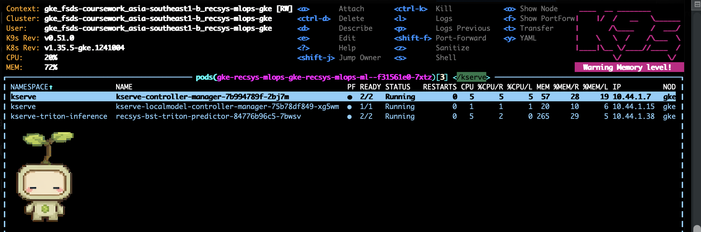

**Figure W01.** Champion-only baseline before selecting a new candidate.

### W02 - Select The Candidate In MLflow

The MLflow UI shows the selected registry version with `candidate=test` and a
versioned `promotion_manifest_uri`. This tag is the automatic watcher trigger.

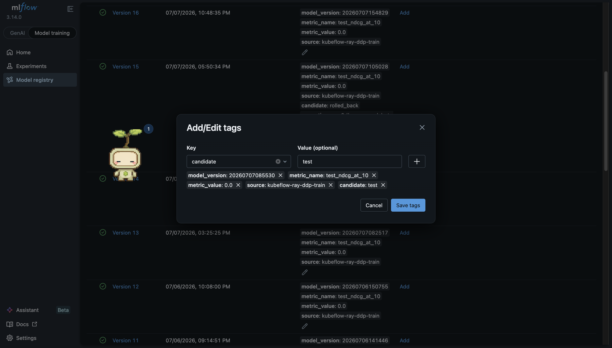

**Figure W02.** A specific MLflow registry version is selected for rollout.

### W03 - Watcher Claims And Triggers Jenkins

Identity of the captured proof run:

```text
MLflow registry version: 14
Model version: 20260707085530
Experiment ID: bst-20260707085530
Candidate manifest: s3://recsys-model-store/promotions/bst/20260707085530.json
Shadow Jenkins build: 21
```

The watcher audit output records the Jenkins build number plus final status
`candidate=tested` and `rollout_status=shadow_ready`. The transient
`candidate=testing` state may be too fast for the MLflow UI, so the watcher log
and build number are the durable proof of the claim.

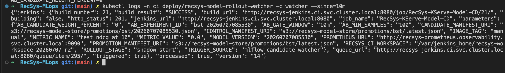

**Figure W03-A.** The watcher audit output ties MLflow Version 14 to Jenkins
build 21, `ROLLOUT_STAGE=shadow-start`, candidate manifest
`20260707085530.json`, and experiment `bst-20260707085530`. The successful
result proves the trigger came from `mlflow-candidate-watcher` rather than a
manual Jenkins build.

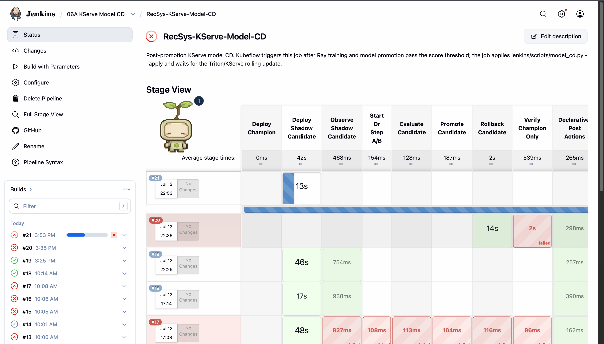

**Figure W03-B.** Jenkins build 21 appears automatically and starts the
`Deploy Shadow Candidate` stage. This is the UI-level evidence for the watcher
to Jenkins transition.

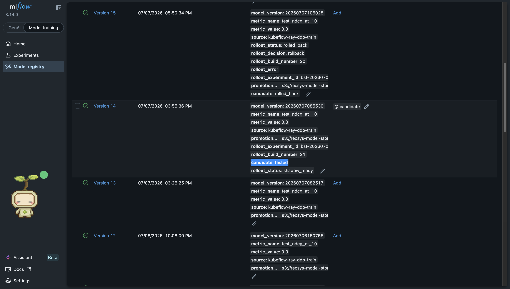

**Figure W03-C.** MLflow Version 14 is the selected candidate and carries the
`@candidate` alias, `candidate=tested`, `rollout_status=shadow_ready`, and
`rollout_build_number=21`. Version 15 above it belongs to an earlier rollback
branch; keeping both records demonstrates that MLflow retains rollout history
instead of overwriting failed experiments.

### W04 - Jenkins Shadow Deployment Succeeds

In Jenkins, open the build number reported by W03 and capture the stage view or
console containing `Deploy Shadow Candidate` and `Observe Shadow Candidate`.

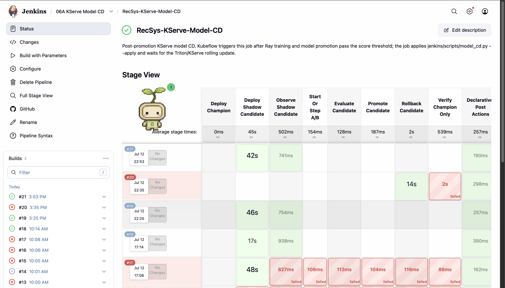

**Figure W04.** Jenkins build 21 completes both `Deploy Shadow Candidate` and
`Observe Shadow Candidate` successfully. A/B, evaluation, promotion, and
rollback stages remain skipped because this build performs shadow deployment
only.

### W05 - Candidate Triton Exists But User Weight Is Zero

Both stable and candidate `InferenceService` objects are Ready, while
`AB_TEST_ENABLED=0`, `AB_SHADOW_ENABLED=1`, and candidate weight is `0`.

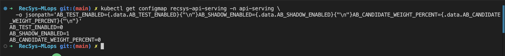

**Figure W05-A.** Runtime configuration is exactly `0/1/0`: A/B routing is
disabled, shadow inference is enabled, and no user traffic is assigned to the
candidate.

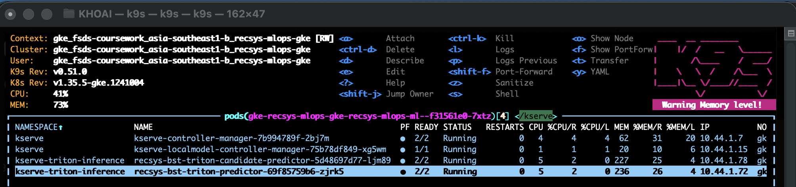

**Figure W05-B.** K9s shows one control predictor and one candidate predictor
running simultaneously. Combined with Figure W05-A, this proves the candidate
is live only as a shadow backend.

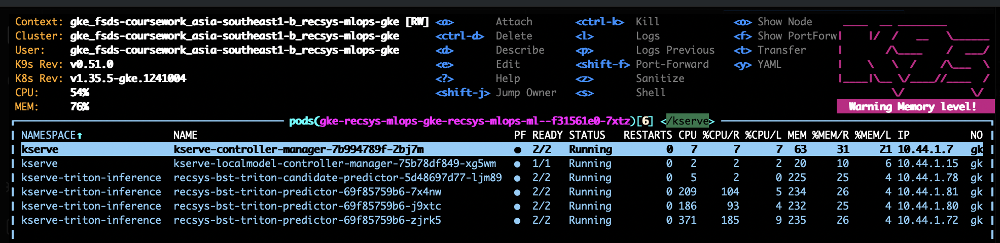

**Figure W05-C.** K9s confirms that the candidate predictor and the stable
predictor are simultaneously Ready. The three stable predictor rows are
autoscaled replicas of one control `InferenceService`, not three different
models. Figure W05-A supplies the routing context proving candidate weight is
still zero at this point.

## One-Command Locust Run For Autonomous Progressive Rollout

The watcher is already running in Kubernetes and owns every rollout
transition. The only command needed for W08-W13 generates real API traffic.
Open Grafana dashboard `Model A/B Testing`, select experiment
`bst-20260707085530`, then run:

```bash
```

```text
Defaults: 10 concurrent users, 2 users started per second, and a 45-minute
safety timeout. The script discovers the active MLflow registry version,
continues traffic across API restarts at 10%, 25%, and 50%, and stops Locust
as soon as the rollout reaches `champion` or `rolled_back`.
The former `15m 10 2` syntax remains accepted, but its fixed duration is
replaced by the terminal-state monitor so traffic cannot stop between stages.
```

Do not run separate `ab`, `evaluate`, or `promote` commands. Locust does not
change rollout configuration; it only supplies traffic. The watcher observes
Prometheus and owns every transition:

```text
10% → wait until candidate >= 100 and control >= 100 → evaluate
    → PASS: 25% → wait for a fresh sample batch → evaluate
    → PASS: 50% → wait for a fresh sample batch → evaluate
    → PASS: automatic promote

HOLD     → keep weight and wait for another fresh sample batch
ROLLBACK → restore the old champion and stop immediately
```

`processed=false` with `decision=WAIT`, `healthy=true` is not a failed gate.
Each weight change restarts the API so the next stage begins with a new metric
series. `phase=warming_up_after_stage_transition` or
`waiting_for_traffic_or_first_prometheus_scrape` is expected until Prometheus
has two scrapes. `collecting_prometheus_samples` then reports the current
percentage toward the 100/100 requirement. The finalized controller uses the
elapsed duration of each stage as `AB_GATE_WINDOW`, so later decisions do not
reuse earlier comparison windows. The captured build 26 still shows the
previous fixed `10m` setting; build 28 demonstrates the corrected stage-local
window of `494s` used by the final implementation.

Verified proof run for MLflow registry Version 14:

| Transition | Jenkins build | Fresh Prometheus samples |
| --- | ---: | ---: |
| Evaluate 10% | 24 | candidate 111 / control 1071 |
| Increase to 25% | 25 | new stage window |
| Evaluate 25% | 26 | candidate 130 / control 469 |
| Increase to 50% | 27 | new stage window |
| Evaluate 50% | 28 | candidate 193 / control 168; gate window 494s |
| Promote champion | 29 | terminal cleanup `0/0/0` |

### W08 - Automatic A/B At 10 Percent

Grafana shows both variants while Locust is running and candidate share is
close to the configured 10% target.

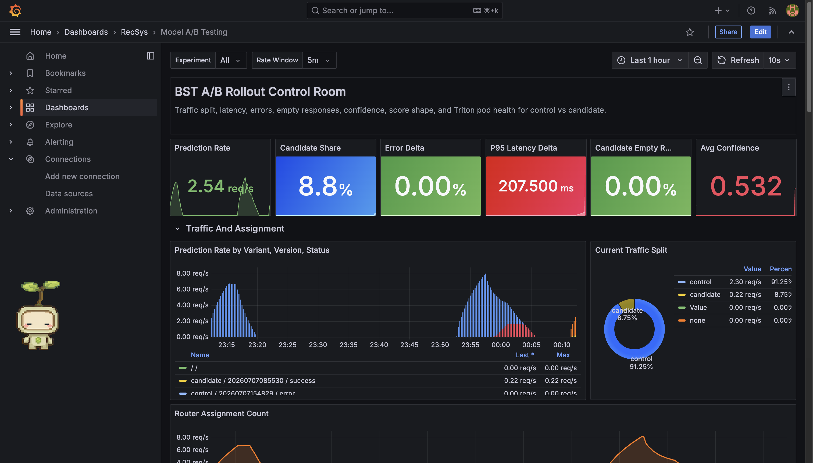

**Figure W08-A.** The control-room overview reports candidate share `8.8%`
and the traffic-split panel reports `8.75%`, which is consistent with sticky
hash assignment around a 10% target over a rolling five-minute rate window.
Both candidate `20260707085530` and control `20260707154829` have successful
prediction series. The dashboard dropdown was captured as `All`; the legend
identifies the exact candidate and control versions used by this rollout.

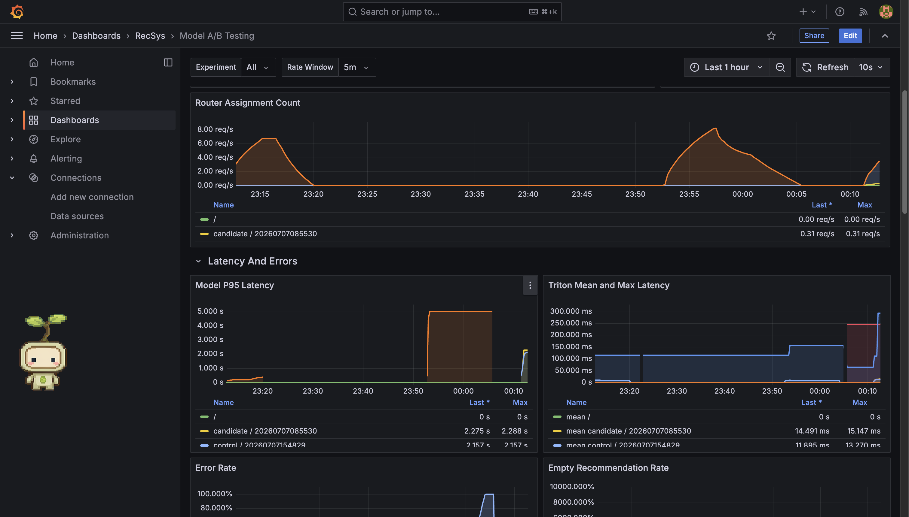

**Figure W08-B.** Router assignment count is non-zero for the candidate, and
the latency panels compare both versions. Candidate mean Triton latency is
about `14.5ms` versus control `11.9ms`; the model p95 values remain close
enough for the configured ratio gate. The red dashboard card is a visual
threshold, not itself a rollback decision—the Jenkins Prometheus gate owns the
decision.

### W09 - Automatic 10 Percent Gate

Jenkins `Evaluate Candidate` output is paired with Grafana error, latency,
sample, and quality-proxy panels. Watcher actions `evaluate_10` and the logged
`samples` object prove Prometheus reached the required counts before Jenkins
was triggered. `gate_passed_10` advances automatically; `hold_10` waits for a
fresh sample batch; `rolled_back` ends the rollout.

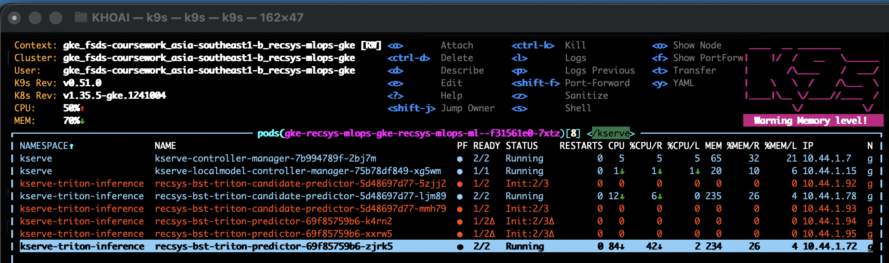

**Figure W09-A.** K9s captures KEDA/Kubernetes creating additional control and
candidate predictor replicas during Locust load. Existing predictors remain
Ready while new replicas pass their init containers.

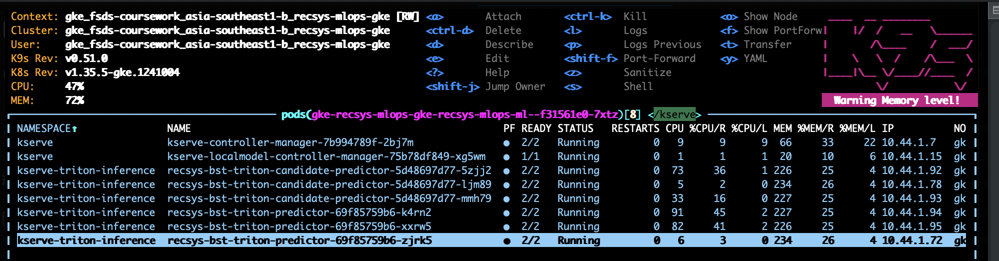

**Figure W09-B.** The new control and candidate replicas reach `2/2 Running`.
This proves sample collection continued on healthy Triton backends under load;
Prometheus evidence, rather than a manual decision, then allowed the watcher
to progress from 10% to 25%.

### W10 - Automatic A/B At 25 Percent

When the 10% gate passes, watcher action `increase_ab_25` and Grafana show
candidate share moving toward 25% without another CLI command.

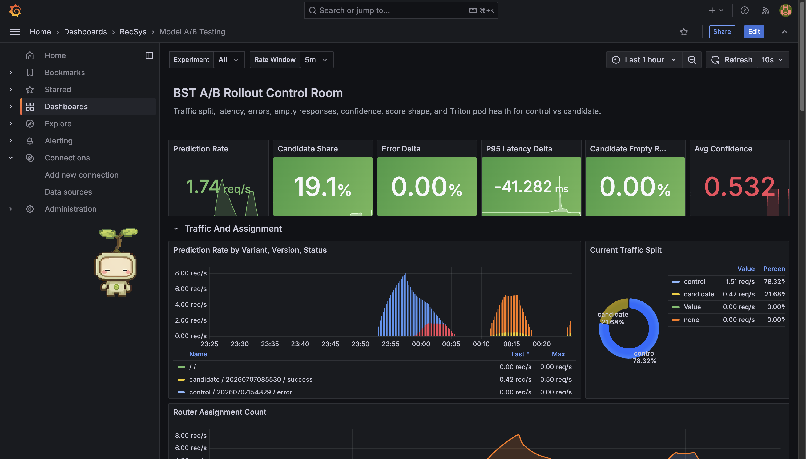

**Figure W10-A.** The rolling dashboard reports candidate share between
`19.1%` and `21.68%` while the configured stage is 25%. A short rolling window,
sticky assignment, deployment gaps, and finite traffic explain why the
instantaneous rate does not equal the configured weight exactly. Error delta
and candidate empty-response rate are both `0%`; candidate latency delta is
negative in this capture.

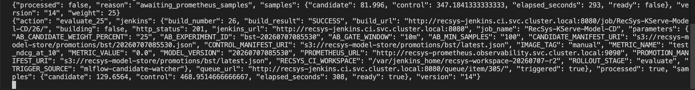

**Figure W10-B.** The watcher first records an incomplete batch at candidate
`81.996` and control `347.184`, then triggers `evaluate_25` only after the
fresh stage counts reach candidate `129.6564` and control `468.9515`. Jenkins
build 26 finishes `SUCCESS`, proving the 25% transition is automatic and
sample-gated.

### W11 - Automatic A/B At 50 Percent

After the 25% gate passes, watcher action `increase_ab_50` and the final
Grafana window show the 50% traffic split, error delta, p95 latency delta,
confidence proxy, and gate output.

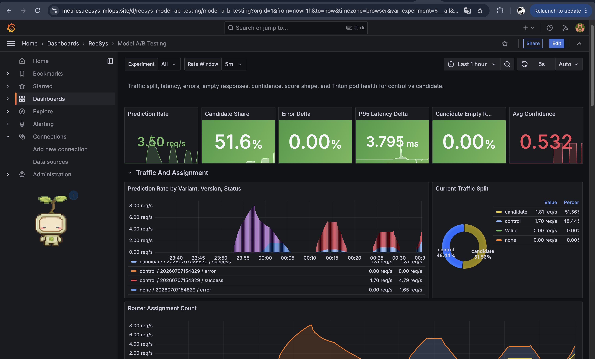

**Figure W11-A.** Candidate share reaches `51.6%`, closely matching the 50%
target. Error delta and candidate empty-response rate remain `0%`, while p95
latency delta is only `3.795ms`. The traffic graph and donut show both variants
receiving successful requests in the final guarded stage.

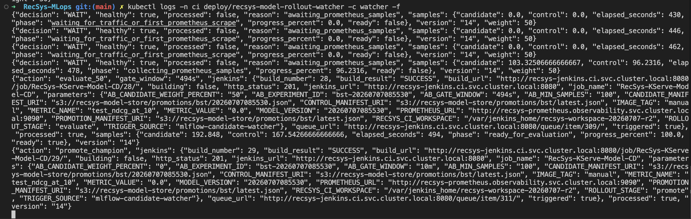

**Figure W11-B.** Watcher r4 labels the pre-gate state as `decision=WAIT` and
`healthy=true`, then records `phase=ready_for_evaluation`, candidate `192.848`,
control `167.543`, and the stage-local gate window `494s`. Jenkins build 28
succeeds, immediately followed by `promote_champion` and successful build 29.

### W12-R - Automatic Rollback Branch

If any gate detects regression, the watcher/Jenkins lifecycle invokes
rollback. The captured Version 14 run followed the successful promotion
branch, so no rollback screenshot is claimed for this sequence. MLflow
Version 15 in Figure W03-C retains `rollout_decision=rollback`,
`rollout_status=rolled_back`, and build 20 as historical registry evidence.
A separate controlled-regression run is required if live Grafana and Jenkins
rollback screenshots are needed.

### W12-P - Automatic Promotion Branch

If the final 50% gate passes, the watcher invokes promotion automatically.
The proof combines Jenkins `Promote Candidate`, MLflow `candidate=promoted`,
the new `champion` alias, and the old champion under alias `previous`.

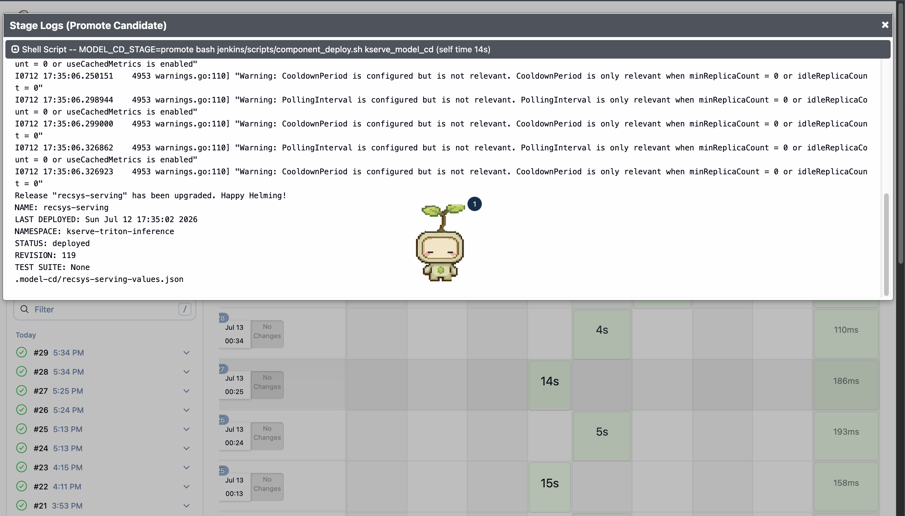

**Figure W12-P1.** Jenkins build 29 runs `MODEL_CD_STAGE=promote`, upgrades
Helm release `recsys-serving` to revision 119, and finishes the Promote
Candidate stage successfully. The build list also shows the complete green
sequence from build 24 through build 29. No manual promotion command was used.

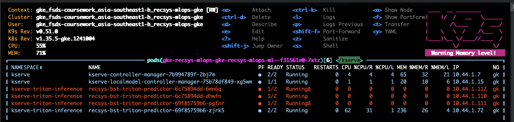

**Figure W12-P2.** Immediately after promotion, K9s no longer lists any
`recsys-bst-triton-candidate-predictor`. New stable predictor replicas are
starting while the existing champion replica continues serving, demonstrating
rolling cleanup without retaining the temporary candidate service.

### W13 - Terminal Cleanup: Exactly One Triton Inference Service

The terminal proof shows one stable Triton `InferenceService`, rollout flags
`0/0/0`, no candidate predictor, and API responses labelled only as control.

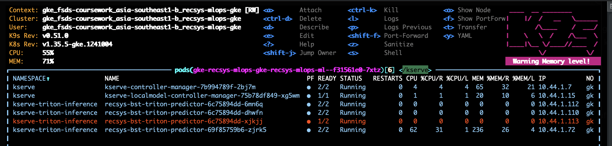

**Figure W13-A.** The stable predictor rollout is settling after promotion;
all visible inference pods use the stable `recsys-bst-triton-predictor` name
and no candidate predictor exists.

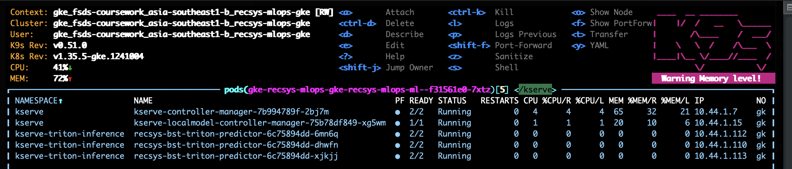

**Figure W13-B.** Final K9s capture shows only Ready replicas of the stable
predictor Deployment. Multiple rows are autoscaled replicas of one champion
`InferenceService`, not multiple Triton models. Terminal verification also
recorded rollout flags `0/0/0` and ten out of ten API responses labelled
`control`; after promotion, `control` refers to model `20260707085530`.
