# Observability Proof

This proof covers the final-coursework observability scope for the RecSys MLOps
platform on GCP project `fsds-coursework` and GKE cluster
`recsys-mlops-gke`.

The evidence is organized around the rubric areas:

- Web API metrics for request rate, request count, failures, latency, and model predictions.
- Computing telemetry for CPU, memory, network, pod health, and exporter health.
- Centralized logs through Loki and Grafana.
- Distributed traces through OpenTelemetry, Tempo, and Grafana.
- ML telemetry for feature drift, PushGateway metrics, retrain triggering, Kubeflow workflow proof, and RayJob proof.

## Code References

| Focus | Code reference |
| --- | --- |
| API metrics and tracing hooks | [api_runtime.py (line 14)](../../../apps/api-serving/src/api_runtime.py#L14), [api_runtime.py (line 52)](../../../apps/api-serving/src/api_runtime.py#L52), [observability.py (line 129)](../../../apps/api-serving/src/observability.py#L129), [observability.py (line 253)](../../../apps/api-serving/src/observability.py#L253) |
| Prometheus, Grafana, PushGateway, Loki, Tempo, and Promtail | [prometheus.yaml (line 1)](../../../infra/helm/recsys-observability/templates/prometheus.yaml#L1), [prometheus.yaml (line 285)](../../../infra/helm/recsys-observability/templates/prometheus.yaml#L285), [grafana.yaml (line 1)](../../../infra/helm/recsys-observability/templates/grafana.yaml#L1), [grafana.yaml (line 134)](../../../infra/helm/recsys-observability/templates/grafana.yaml#L134), [loki-tempo-promtail.yaml (line 1)](../../../infra/helm/recsys-observability/templates/loki-tempo-promtail.yaml#L1), [loki-tempo-promtail.yaml (line 233)](../../../infra/helm/recsys-observability/templates/loki-tempo-promtail.yaml#L233), [pushgateway.yaml (line 1)](../../../infra/helm/recsys-observability/templates/pushgateway.yaml#L1), [pushgateway.yaml (line 34)](../../../infra/helm/recsys-observability/templates/pushgateway.yaml#L34) |
| Version-controlled dashboards | [model-ab-testing.json (line 1)](../../../infra/helm/recsys-observability/dashboards/model-ab-testing.json#L1), [model-ab-testing.json (line 824)](../../../infra/helm/recsys-observability/dashboards/model-ab-testing.json#L824) |
| Offline feature drift | [offline_feature_drift.py (line 270)](../../../apps/data-platform/src/validate/offline_feature_drift.py#L270), [offline_feature_drift.py (line 469)](../../../apps/data-platform/src/validate/offline_feature_drift.py#L469) |
| Drift metrics and retrain orchestration | [pushgateway.py](../../../apps/data-platform/src/monitoring/pushgateway.py), [offline_feature_drift.py](../../../apps/data-platform/src/validate/offline_feature_drift.py), [trigger_kubeflow_retrain.py](../../../apps/data-platform/src/mlops/trigger_kubeflow_retrain.py) |
| Kubeflow retrain trigger | [trigger_kubeflow_retrain.py (line 117)](../../../apps/data-platform/src/mlops/trigger_kubeflow_retrain.py#L117), [trigger_kubeflow_retrain.py (line 164)](../../../apps/data-platform/src/mlops/trigger_kubeflow_retrain.py#L164) |

## 0. Observability Stack And Access

The observability namespace contains the monitoring stack used across the data
platform, APIs, ML workflows, and model serving runtime. Grafana is the visual
entrypoint; Prometheus stores metrics; Loki stores logs; Tempo stores traces;
PushGateway receives short-lived batch, drift, and retrain metrics.

Main observability services:

| Service | Purpose |
| --- | --- |
| `recsys-grafana` | Grafana dashboards for web API, compute, logs, traces, drift, retrain, serving, A/B testing, and governance. |
| `recsys-prometheus` | Prometheus scrape and query backend for Kubernetes, API, data platform, ML, and PushGateway metrics. |
| `recsys-loki` | Centralized log backend for Kubernetes pod logs. |
| `recsys-tempo` | Trace backend for OpenTelemetry traces from API serving. |
| `recsys-pushgateway` | Short-lived metric bridge for Airflow, drift, governance, retrain, and proof jobs. |
| `recsys-promtail` | Log shipper DaemonSet that tails Kubernetes pod logs and sends them to Loki. |
| Redis/Postgres exporters | Export Redis/Postgres health and runtime metrics into Prometheus. |

Dashboard access is through the NGINX/GCP LoadBalancer gateway and the RecSys
Grafana folder.

### Image Proof

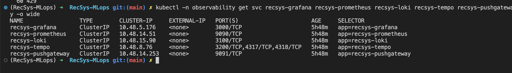

**Figure: Observability services proof.** This screenshot proves that the core
observability services are installed in the `observability` namespace and expose
the expected internal Kubernetes services for Grafana, Prometheus, Loki, Tempo,
and PushGateway.

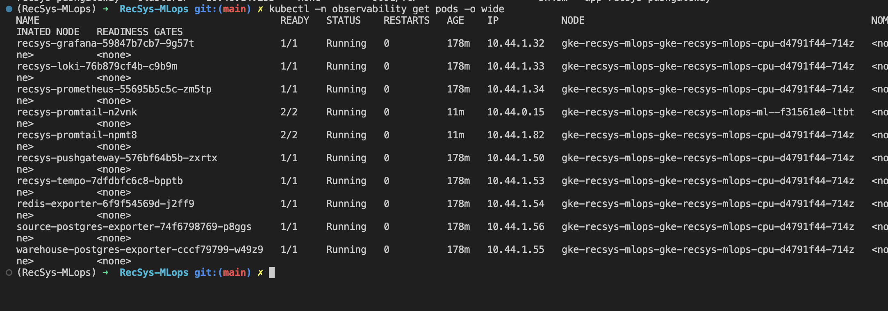

**Figure: Observability pods proof.** This screenshot proves that the
observability runtime pods are running, including Grafana, Prometheus, Loki,
Tempo, PushGateway, Promtail, and exporters.

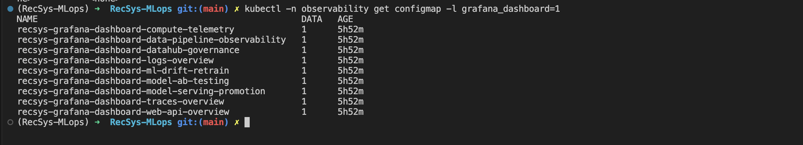

**Figure: Grafana dashboard provisioning proof.** This screenshot proves that
the dashboards are provisioned as Kubernetes ConfigMaps, so Grafana dashboards
are deployed through Helm/IaC instead of being created manually in the UI.

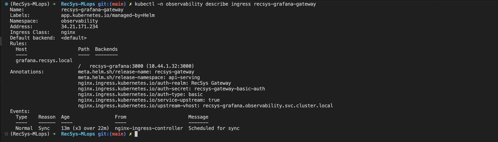

**Figure: Grafana gateway proof.** This screenshot proves that Grafana is
reachable through the gateway path used for UI-based observability proof
capture.

## 1. Web API Metrics

Both FastAPI serving services expose Prometheus metrics. Prometheus scrapes
`recsys-online-feature-api` for online feature lookup traffic and
`recsys-api-serving` for recommendation/Triton traffic.

Grafana visualizes:

| Metric | Meaning |
| --- | --- |
| `recsys_api_requests_total` | Request count by route, method, and status. |
| `recsys_api_failures_total` | Failed API request count. |
| `recsys_api_request_duration_seconds` | API latency distribution. |
| `recsys_feature_api_client_request_duration_seconds` | Recommendation API client latency when it calls the online feature API. |
| `recsys_api_recommendation_duration_seconds` | Recommendation ranking latency. |
| `recsys_api_triton_inference_duration_seconds` | Triton model inference latency. |
| `model_predictions_total` | Model prediction count by model version, status, and A/B variant. |
| `recsys_api_candidate_count` | Candidate item count per recommendation request. |

### Image Proof

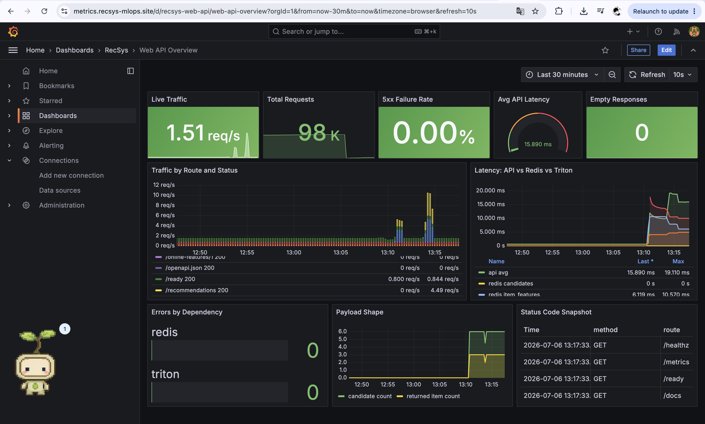

**Figure: Web API metrics proof.** This dashboard shows API traffic telemetry
for the recommendation and online-feature services, including request rate,
request count, failure count, latency, candidate count, and model prediction
activity.

## 2. Computing Telemetry Data: Metrics

Prometheus scrapes Kubernetes and container telemetry. Grafana visualizes
compute metrics for API serving, data platform, Kubeflow, DataHub, experiment
tracking, KServe/Triton, and observability workloads.

Typical dashboard panels:

| Panel | Metric family |
| --- | --- |
| CPU by namespace/pod | `container_cpu_usage_seconds_total` |
| Memory by namespace/pod | `container_memory_working_set_bytes` |
| Network receive/transmit | `container_network_receive_bytes_total`, `container_network_transmit_bytes_total` |
| Pod/container availability | `container_last_seen` and Kubernetes pod/container series |
| Exporter health | Redis/Postgres exporter scrape metrics |

### Image Proof

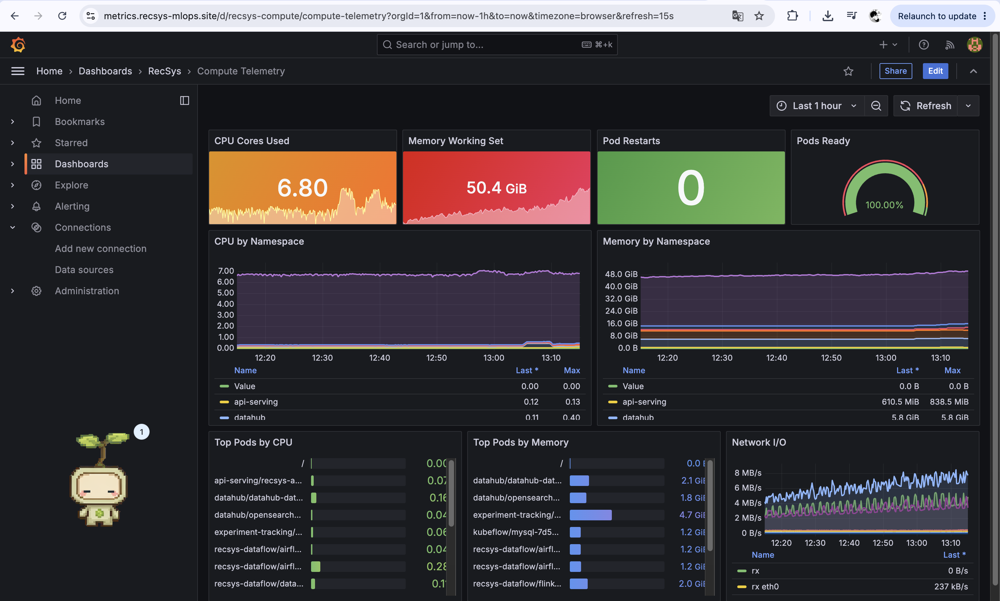

**Figure: Compute telemetry proof.** This dashboard proves that Prometheus and
Grafana are collecting infrastructure telemetry across namespaces, including
CPU, memory, network, pod health, and exporter health.

## 3. Computing Telemetry Data: Logs

Promtail runs as a DaemonSet, tails Kubernetes pod logs, and ships them to Loki.
Grafana uses Loki as the log datasource for centralized log search.

The log dashboard is used to inspect API logs, pipeline logs, service errors,
and request-level JSON logs from the serving layer.

### Image Proof

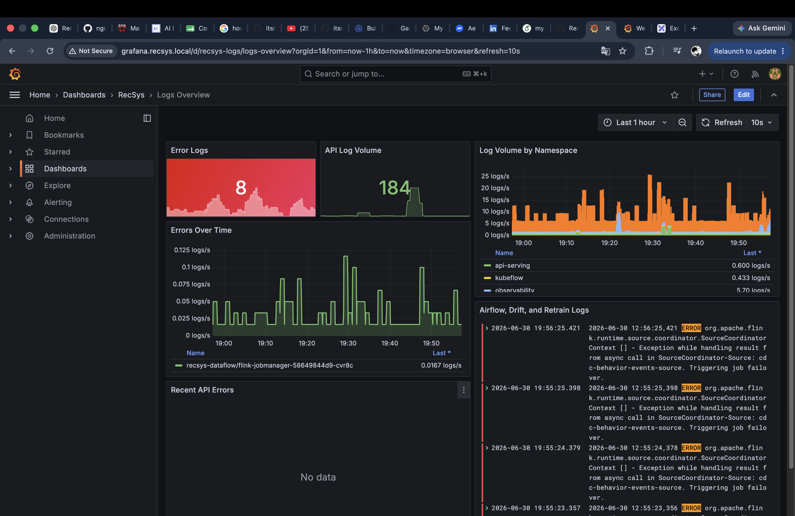

**Figure: Logs overview proof.** This dashboard proves that Kubernetes pod logs
are captured centrally in Loki and can be searched from Grafana by namespace,
service, route, status, and log content.

## 4. Computing Telemetry Data: Traces

FastAPI is instrumented with OpenTelemetry. Traces are exported to Tempo, and
Grafana uses Tempo as the trace datasource.

The trace dashboard links request context from API logs to Tempo trace context,
making it possible to inspect request flow through the recommendation service,
online feature service, and Triton inference calls.

### Image Proof

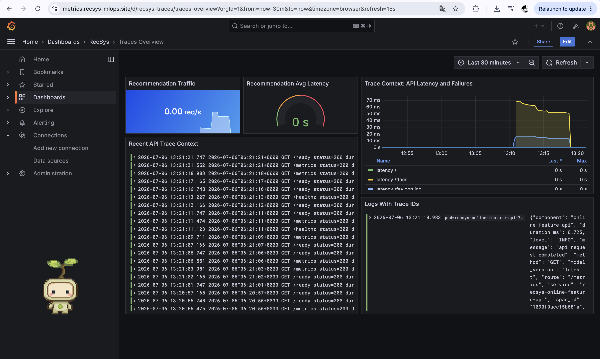

**Figure: Traces overview proof.** This dashboard proves that trace context from
`recsys-api-serving` is available in Grafana, so API requests can be inspected
through the tracing/log correlation view instead of only through raw logs.

## 5. ML-Related Telemetry Data: Airflow Drift Pipeline

There is no production groundtruth label stream in this coursework demo, so the
ML monitoring path focuses on feature drift. Airflow pulls current offline
feature-store data, compares it with a reference baseline using PSI, writes a
drift report with `groundtruth_available=false`, and pushes metrics to
PushGateway. Prometheus scrapes PushGateway and Grafana visualizes the drift
state.

Airflow drift flow:

`run_spark_batch_to_offline_store` -> `feast_materialize_incremental` ->
`offline_feature_drift` -> `trigger_kubeflow_retrain`

Telemetry flow:

`Airflow offline_feature_drift task` -> `validate.offline_feature_drift` ->
`PushGateway` -> `Prometheus` -> `Grafana ML Drift & Retrain dashboard`

Metrics pushed:

| Metric | Meaning |
| --- | --- |
| `recsys_ml_feature_drift_psi` | PSI score per feature. |
| `recsys_ml_feature_drift_passed` | `1` if feature passed, `0` if drifted. |
| `recsys_ml_feature_drift_reference_rows` | Baseline/reference row count. |
| `recsys_ml_feature_drift_current_rows` | Current offline feature-store row count. |
| `recsys_ml_feature_drift_run_timestamp_seconds` | Drift run timestamp. |

### Image Proof

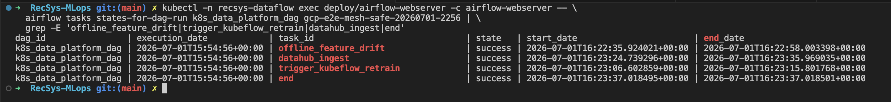

**Figure: Airflow drift pipeline proof.** This screenshot proves that the
Airflow drift path is part of the data platform DAG and runs after offline
feature generation/materialization, before the retrain trigger step.

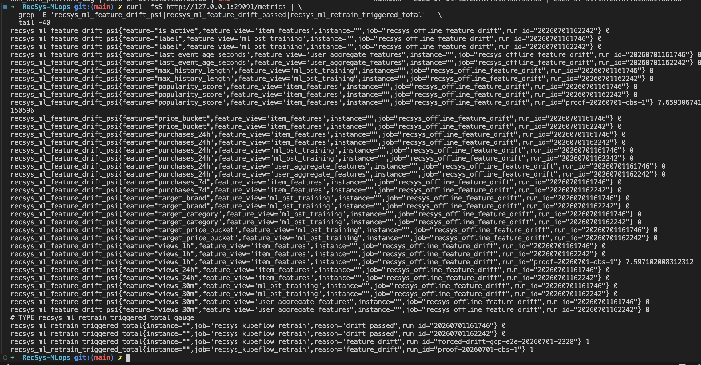

**Figure: PushGateway drift metrics proof.** This screenshot proves that the
Airflow drift task publishes feature-drift metrics into PushGateway, which acts
as the bridge between short-lived batch tasks and Prometheus scraping.

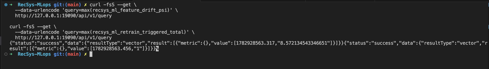

**Figure: Prometheus drift query proof.** This screenshot proves that Prometheus
can query the drift metrics scraped from PushGateway, including PSI and pass/fail
signals for monitored feature tables.

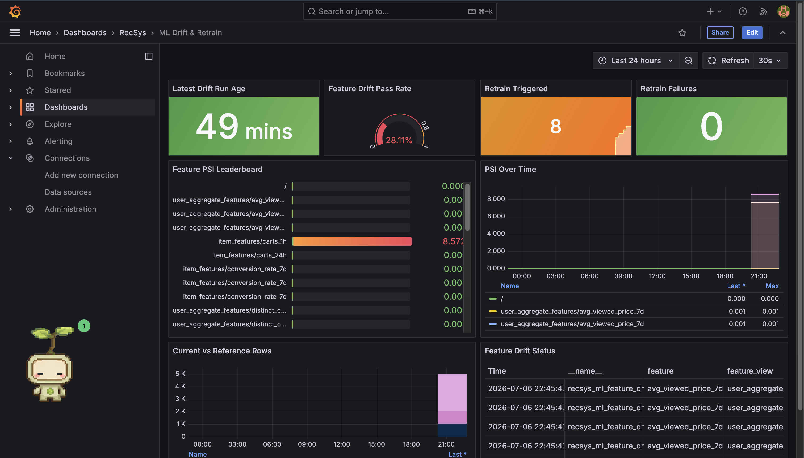

**Figure: Grafana ML drift dashboard proof.** This dashboard proves that drift
metrics are visualized for reviewers, including drift scores, pass/fail state,
baseline/current row counts, and retrain-related telemetry.

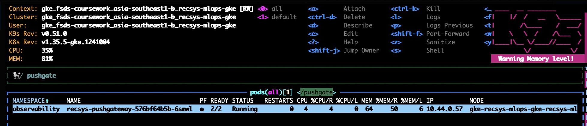

**Figure: K9s PushGateway pod proof.** This screenshot proves that the
PushGateway runtime pod is running in the observability namespace and is
available to receive drift/retrain metrics from Airflow and smoke jobs.

## 6. ML-Related Telemetry Data: Trigger Retrain By Kubeflow API

When `offline_feature_drift` reports `passed=false`, the next Airflow task
`trigger_kubeflow_retrain` calls Kubeflow Pipelines API. The retrain trigger
also pushes trigger/failure counters to PushGateway.

Retrain telemetry flow:

`Airflow trigger_kubeflow_retrain task` -> `mlops.trigger_kubeflow_retrain` ->
`Kubeflow Pipelines API` -> `Argo Workflow` -> `KubeRay RayJob` ->
`PushGateway retrain metrics` -> `Prometheus` ->
`Grafana ML Drift & Retrain dashboard`

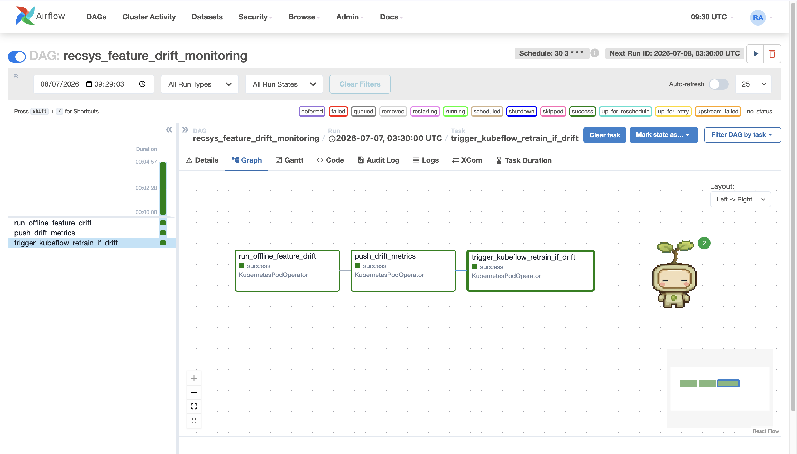

**Note:** The platform also has a dedicated Airflow DAG for offline-store drift
monitoring. The `recsys_feature_drift_monitoring` DAG runs daily at 03:30
(`30 3 * * *`). This DAG triggers the offline feature-store drift check first,
pushes drift telemetry, and then runs the retrain trigger only when the drift
report indicates that monitored features have drifted. In the split DAG layout,
this is represented by the sequence `run_offline_feature_drift` ->
`push_drift_metrics` -> `trigger_kubeflow_retrain_if_drift`.
The deployed definition is [k8s_data_platform_dag.py](../../../apps/data-platform/src/orchestration/airflow/dags/k8s_data_platform_dag.py).

Metrics pushed:

| Metric | Meaning |
| --- | --- |
| `recsys_ml_retrain_triggered_total` | `1` when retrain is triggered by drift. |
| `recsys_ml_retrain_trigger_failed_total` | `1` when retrain trigger fails. |

### Image Proof

### Image Proof

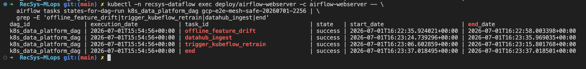

**Figure: Airflow retrain trigger proof.** This screenshot proves that the
Airflow DAG contains and executes the retrain trigger after the feature-drift
task, making retraining part of the automated ML monitoring flow.

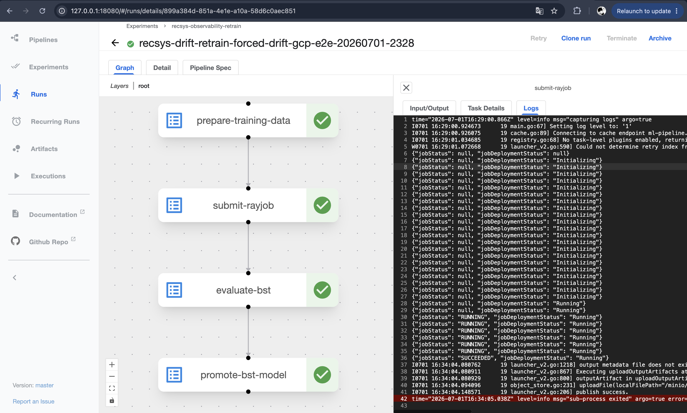

**Figure: Kubeflow retrain workflow proof.** This screenshot proves that the
drift-triggered retrain request reaches Kubeflow Pipelines and creates a
training workflow that can be inspected in the Kubeflow UI.

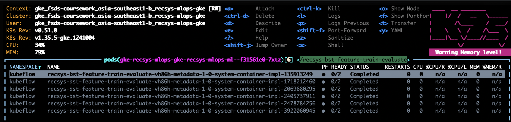

**Figure: Kubeflow workflow pod proof.** This screenshot proves that the
Kubeflow retraining workflow creates Kubernetes pods for the training pipeline
steps, not just a dashboard-only run record.

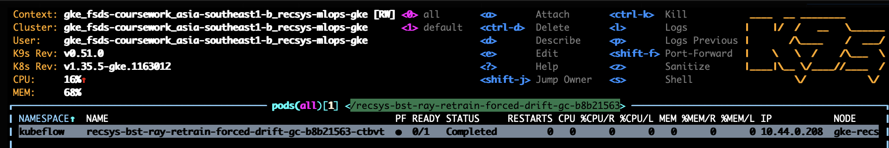

**Figure: KubeRay retrain RayJob proof.** This screenshot proves that the
Kubeflow retraining pipeline launches a KubeRay RayJob for model training, so
the retrain flow reaches the distributed training runtime.

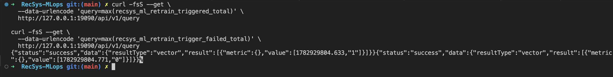

**Figure: Prometheus retrain metric proof.** This screenshot proves that retrain
trigger/failure counters are exported into Prometheus after the Airflow drift
pipeline calls Kubeflow API, allowing Grafana to show whether drift led to a
retraining workflow and whether the trigger succeeded.
