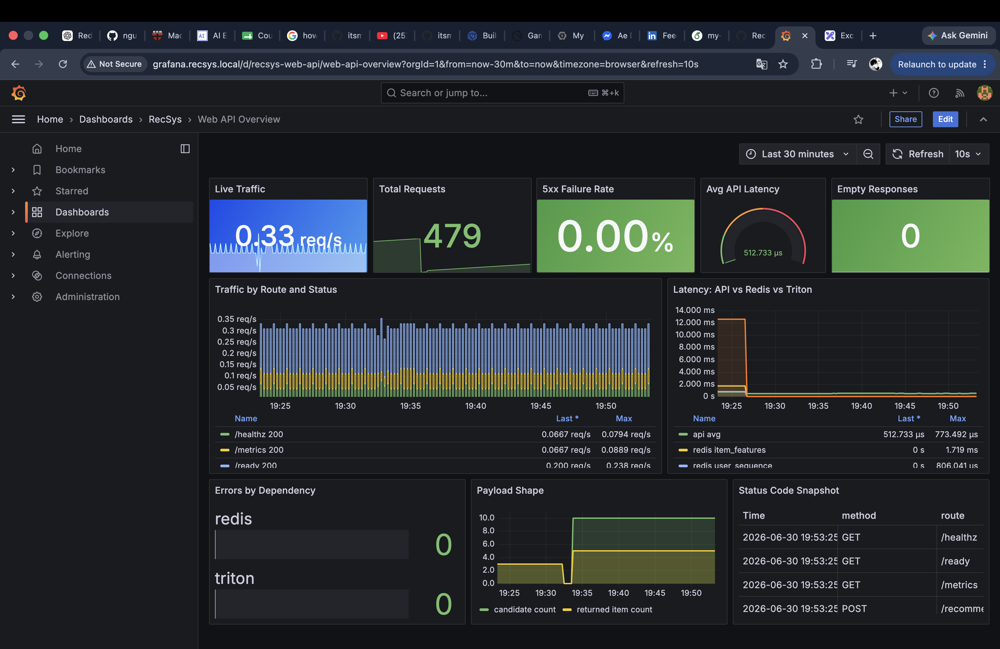
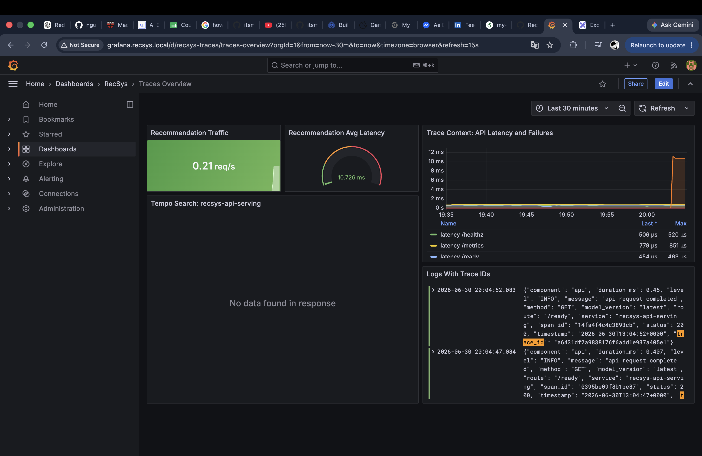

# Observability Proof

This proof follows the final-coursework rubric order exactly:

```text
Observability
  Web API metrics
    Web API monitoring metrics such as req/s, num. of reqs, num. of failures, etc.
  Computing telemetry data
    Collect and visualize metrics with Prometheus + Grafana
    Similar proof for logs
    Similar proof for traces
  ML-related telemetry data
    Airflow data drift pipeline pulls offline feature-store data, compares with reference data, and updates Grafana via PushGateway
    Trigger retrain by calling Kubeflow API at the end of the Airflow drift pipeline
```

Project: `fsds-coursework` on GKE cluster `recsys-mlops-gke`.

## 0. Observability Stack And Access

The observability stack runs in namespace `observability`:

```bash
kubectl -n observability get svc recsys-grafana recsys-prometheus recsys-loki recsys-tempo recsys-pushgateway -o wide
kubectl -n observability get pods -o wide
kubectl -n observability get configmap -l grafana_dashboard=1
```

Observed services:

```text
recsys-grafana       ClusterIP   3000/TCP
recsys-prometheus    ClusterIP   9090/TCP
recsys-loki          ClusterIP   3100/TCP
recsys-tempo         ClusterIP   3200/TCP,4317/TCP,4318/TCP
recsys-pushgateway   ClusterIP   9091/TCP
```

Observed pods:

```text
recsys-grafana        Running
recsys-prometheus     Running
recsys-loki           Running
recsys-tempo          Running
recsys-pushgateway    Running
recsys-promtail       Running
redis-exporter        Running
postgres-exporters    Running
```

Grafana access through the GCP LoadBalancer gateway:

```bash
GATEWAY_IP="$(kubectl -n ingress-nginx get svc ingress-nginx-controller \
  -o jsonpath='{.status.loadBalancer.ingress[0].ip}')"

sudo sh -c "printf '%s %s\n' '${GATEWAY_IP}' 'grafana.recsys.local logs.recsys.local traces.recsys.local api.recsys.local' >> /etc/hosts"
```

```text
Grafana URL:        http://grafana.recsys.local
Grafana login:      admin / admin
Grafana folder:     RecSys
```

Dashboard URLs:

```text
http://grafana.recsys.local/d/recsys-web-api/web-api-overview
http://grafana.recsys.local/d/recsys-compute/compute-telemetry
http://grafana.recsys.local/d/recsys-logs/logs-overview
http://grafana.recsys.local/d/recsys-traces/traces-overview
http://grafana.recsys.local/d/recsys-ml-drift/ml-drift-retrain
```

### Code References

- [infra/helm/recsys-observability/templates/grafana.yaml](../../../infra/helm/recsys-observability/templates/grafana.yaml): provisions Grafana, datasources, and dashboard ConfigMaps.
- [infra/helm/recsys-observability/templates/prometheus.yaml](../../../infra/helm/recsys-observability/templates/prometheus.yaml): provisions Prometheus scrape config and alert rules.
- [infra/helm/recsys-observability/templates/loki-tempo-promtail.yaml](../../../infra/helm/recsys-observability/templates/loki-tempo-promtail.yaml): provisions Loki, Tempo, and Promtail.
- [infra/helm/recsys-observability/templates/pushgateway.yaml](../../../infra/helm/recsys-observability/templates/pushgateway.yaml): provisions PushGateway.

### Image Proof


## 1. Web API Metrics

### Requirement

```text
Web API monitoring metrics such as req/s, num. of reqs, num. of failures, etc.
```

### Implementation

Both FastAPI serving services expose `/metrics`. Prometheus scrapes
`recsys-online-feature-api` for online feature lookup traffic and
`recsys-api-serving` for recommendation/Triton traffic. Grafana visualizes:

| Metric | Meaning |
|---|---|
| `recsys_api_requests_total` | Number of requests by route, method, and status. |
| `recsys_api_failures_total` | Number of failed API requests. |
| `recsys_api_request_duration_seconds` | Request latency. |
| `recsys_feature_api_client_request_duration_seconds` | Async client latency from recommendation API to online feature API. |
| `recsys_api_recommendation_duration_seconds` | Recommendation ranking latency. |
| `recsys_api_triton_inference_duration_seconds` | Triton call latency. |
| `model_predictions_total` | Model prediction count by model version, status, and A/B variant. |
| `recsys_api_candidate_count` | Candidate item count per recommendation request. |

### Code References

- [apps/api-serving/src/feature_api.py](../../../apps/api-serving/src/feature_api.py): exposes `/healthz`, `/ready`, `/metrics`, and `/online-features`.
- [apps/api-serving/src/inference_api.py](../../../apps/api-serving/src/inference_api.py): exposes `/healthz`, `/ready`, `/metrics`, and `/recommendations`.
- [apps/api-serving/src/feature_service_client.py](../../../apps/api-serving/src/feature_service_client.py): emits async client latency for recommendation API calls to the online feature API.
- [apps/api-serving/src/observability.py](../../../apps/api-serving/src/observability.py): defines API request, failure, latency, Redis, Triton, and model prediction metrics.
- [apps/api-serving/src/ranking.py](../../../apps/api-serving/src/ranking.py): emits recommendation duration, candidate count, score, empty recommendation, and item-count metrics.
- [apps/api-serving/src/ab_testing.py](../../../apps/api-serving/src/ab_testing.py): emits A/B assignment metrics.
- [infra/helm/recsys-observability/dashboards/web-api-overview.json](../../../infra/helm/recsys-observability/dashboards/web-api-overview.json): Grafana Web API dashboard.

### Proof Commands

Generate API traffic:

```bash
set -a
source .env
set +a

curl -s -u "${GATEWAY_USER}:${GATEWAY_PASSWORD}" \
  -H 'Host: api.recsys.local' \
  -H 'Content-Type: application/json' \
  -X POST "http://${GATEWAY_IP}/recommendations" \
  -d '{"user_id":1,"candidate_item_ids":[101,202,303],"top_k":3}'
```

Query Prometheus:

```bash
kubectl -n observability exec deploy/recsys-prometheus -- \
  wget -qO- 'http://localhost:9090/api/v1/query?query=sum%28recsys_api_requests_total%29%20by%20%28route%2Cmethod%2Cstatus%29'

kubectl -n observability exec deploy/recsys-prometheus -- \
  wget -qO- 'http://localhost:9090/api/v1/query?query=sum%28model_predictions_total%29'
```

### Observed Proof

```text
GET  /healthz          200
GET  /ready            200
GET  /metrics          200
POST /recommendations  200

model_predictions_total > 0
```

### Image Proof



## 2. Computing Telemetry Data: Metrics

### Requirement

```text
Collect và visualize metrics với Prometheus + Grafana.
Computing telemetry data such as CPU, RAM, disk, network, pod health, etc.
```

### Implementation

Prometheus scrapes Kubernetes and container telemetry. Grafana visualizes
compute metrics for API serving, data platform, Kubeflow, DataHub, experiment
tracking, KServe/Triton, and observability workloads.

Typical dashboard panels:

| Panel | Metric family |
|---|---|
| CPU by namespace/pod | `container_cpu_usage_seconds_total` |
| Memory by namespace/pod | `container_memory_working_set_bytes` |
| Network receive/transmit | `container_network_receive_bytes_total`, `container_network_transmit_bytes_total` |
| Pod/container availability | `container_last_seen`, Kubernetes pod/container series |
| Exporter health | Redis/Postgres exporter scrape metrics |

### Code References

- [infra/helm/recsys-observability/templates/prometheus.yaml](../../../infra/helm/recsys-observability/templates/prometheus.yaml): Prometheus Kubernetes scrape configuration.
- [infra/helm/recsys-observability/templates/exporters.yaml](../../../infra/helm/recsys-observability/templates/exporters.yaml): Redis and Postgres exporters.
- [infra/helm/recsys-observability/dashboards/compute-telemetry.json](../../../infra/helm/recsys-observability/dashboards/compute-telemetry.json): Grafana compute telemetry dashboard.

### Proof Commands

```bash
kubectl -n observability exec deploy/recsys-prometheus -- \
  wget -qO- 'http://localhost:9090/api/v1/query?query=sum%28rate%28container_cpu_usage_seconds_total%5B5m%5D%29%29%20by%20%28namespace%29'

kubectl -n observability exec deploy/recsys-prometheus -- \
  wget -qO- 'http://localhost:9090/api/v1/query?query=sum%28container_memory_working_set_bytes%29%20by%20%28namespace%29'
```

### Observed Proof

```text
CPU/memory telemetry is visible for:
api-serving
recsys-dataflow
kubeflow
datahub
experiment-tracking
kserve-triton-inference
observability
```

### Image Proof


## 3. Computing Telemetry Data: Logs

### Requirement

```text
Tương tự cho logs.
Capture màn hình thể hiện logs đã được capture và có thể coi trên dashboard.
```

### Implementation

Promtail runs as a DaemonSet, tails Kubernetes pod logs, and ships them to Loki.
Grafana uses Loki as a datasource for centralized log search.

### Code References

- [infra/helm/recsys-observability/templates/loki-tempo-promtail.yaml](../../../infra/helm/recsys-observability/templates/loki-tempo-promtail.yaml): Loki, Promtail DaemonSet, and log shipping config.
- [infra/helm/recsys-observability/templates/grafana.yaml](../../../infra/helm/recsys-observability/templates/grafana.yaml): Grafana Loki datasource.
- [infra/helm/recsys-observability/dashboards/logs-overview.json](../../../infra/helm/recsys-observability/dashboards/logs-overview.json): logs dashboard.
- [apps/api-serving/src/observability.py](../../../apps/api-serving/src/observability.py): JSON request logs with service and route context.

### Proof Commands

```bash
kubectl -n observability exec deploy/recsys-loki -- \
  wget -qO- 'http://localhost:3100/loki/api/v1/query?query=sum%28count_over_time%28%7Bnamespace%3D%22api-serving%22%7D%20%7C%3D%20%22recommendations%22%5B10m%5D%29%29'
```

### Observed Proof

```text
API-serving log lines in last 10m: 498
/recommendations log lines in last 10m: 120
```

### Image Proof


## 4. Computing Telemetry Data: Traces

### Requirement

```text
Tương tự cho traces.
Capture màn hình thể hiện traces đã được capture và có thể coi trên dashboard.
```

### Implementation

FastAPI is instrumented with OpenTelemetry. Traces are exported to Tempo, and
Grafana uses Tempo as a datasource to search request traces.

### Code References

- [apps/api-serving/src/observability.py](../../../apps/api-serving/src/observability.py): configures OpenTelemetry tracing and trace-aware JSON logging.
- [apps/api-serving/src/main.py](../../../apps/api-serving/src/main.py): FastAPI routes that produce traces.
- [infra/helm/recsys-observability/templates/loki-tempo-promtail.yaml](../../../infra/helm/recsys-observability/templates/loki-tempo-promtail.yaml): Tempo deployment and OTLP ports.
- [infra/helm/recsys-observability/templates/grafana.yaml](../../../infra/helm/recsys-observability/templates/grafana.yaml): Grafana Tempo datasource.
- [infra/helm/recsys-observability/dashboards/traces-overview.json](../../../infra/helm/recsys-observability/dashboards/traces-overview.json): traces dashboard.

### Proof Commands

```bash
kubectl -n observability exec deploy/recsys-tempo -- \
  wget -qO- 'http://localhost:3200/api/search?tags=service.name%3Drecsys-api-serving&limit=5'
```

### Observed Proof

```text
rootServiceName=recsys-api-serving
rootTraceName=GET /ready, GET /healthz, GET /metrics
```

### Image Proof



## 5. ML-Related Telemetry Data: Airflow Drift Pipeline

### Requirement

```text
Airflow data drift pipeline periodically pulls data from offline feature store
and compares with groundtruth and updates Grafana dashboard via PushGateway.

Assumption: we do not have production groundtruth labels in this coursework demo.
```

### Implementation

There is no production groundtruth label stream in this demo, so the drift
pipeline monitors **feature drift**. Airflow pulls current offline feature-store
data and compares it with a reference baseline using PSI. It writes a drift
report with `groundtruth_available=false`, then pushes metrics to PushGateway.
Prometheus scrapes PushGateway and Grafana visualizes the result.

Airflow DAG order:

```text
run_spark_batch_to_offline_store
  -> feast_materialize_incremental
  -> offline_feature_drift
  -> trigger_kubeflow_retrain
```

Telemetry path:

```text
Airflow offline_feature_drift task
  -> validate.offline_feature_drift
  -> PushGateway
  -> Prometheus
  -> Grafana ML Drift & Retrain dashboard
```

Metrics pushed:

| Metric | Meaning |
|---|---|
| `recsys_ml_feature_drift_psi` | PSI score per feature. |
| `recsys_ml_feature_drift_passed` | `1` if feature passed, `0` if drifted. |
| `recsys_ml_feature_drift_reference_rows` | Baseline/reference row count. |
| `recsys_ml_feature_drift_current_rows` | Current offline feature-store row count. |
| `recsys_ml_feature_drift_run_timestamp_seconds` | Drift run timestamp. |

### Code References

- [apps/data-platform/src/orchestration/airflow/dags/k8s_data_platform_dag.py](../../../apps/data-platform/src/orchestration/airflow/dags/k8s_data_platform_dag.py): defines `offline_feature_drift >> trigger_kubeflow_retrain`.
- [apps/data-platform/src/validate/offline_feature_drift.py](../../../apps/data-platform/src/validate/offline_feature_drift.py): computes PSI, writes `groundtruth_available=false`, and pushes drift metrics.
- [apps/data-platform/src/monitoring/pushgateway.py](../../../apps/data-platform/src/monitoring/pushgateway.py): renders and pushes Prometheus metrics to PushGateway.
- [infra/helm/recsys-data-platform/values.yaml](../../../infra/helm/recsys-data-platform/values.yaml): configures drift baseline path, threshold, PushGateway URL, KFP endpoint, and retrain flag.
- [infra/helm/recsys-observability/dashboards/ml-drift-retrain.json](../../../infra/helm/recsys-observability/dashboards/ml-drift-retrain.json): Grafana dashboard for drift and retrain telemetry.

### Proof Commands

Airflow task proof:

```bash
kubectl -n recsys-dataflow exec deploy/airflow-webserver -c airflow-webserver -- \
  airflow tasks states-for-dag-run k8s_data_platform_dag gcp-e2e-mesh-safe-20260701-2256 | \
  grep -E 'offline_feature_drift|trigger_kubeflow_retrain|datahub_ingest|end'
```


PushGateway drift metrics proof:

```bash
# terminal 1
kubectl -n observability port-forward svc/recsys-pushgateway 29091:9091

# terminal 2
curl -fsS http://127.0.0.1:29091/metrics | \
  grep -E 'recsys_ml_feature_drift_psi|recsys_ml_feature_drift_passed' | tail
```


Prometheus drift query proof:

```bash
# terminal 1
kubectl -n observability port-forward svc/recsys-prometheus 19090:9090

# terminal 2
curl -fsS --get \
  --data-urlencode 'query=max(recsys_ml_feature_drift_psi)' \
  http://127.0.0.1:19090/api/v1/query
```


Grafana ML drift dashboard proof:

```bash
# terminal 1
kubectl -n observability port-forward svc/recsys-grafana 13000:3000

# terminal 2
open http://127.0.0.1:13000/d/ml-drift-retrain/ml-drift-retrain
```


K9s PushGateway pod proof:

```bash
# terminal 1
k9s -n observability

# inside K9s:
:pods
/pushgateway
```


### Observed Proof

```text
GCP E2E DAG run id: gcp-e2e-mesh-safe-20260701-2256
offline_feature_drift         success
trigger_kubeflow_retrain      success
datahub_ingest                success

latest GCP drift run id: 20260701162242
groundtruth_available: false
threshold: 0.15
passed: true
reason: drift_passed

forced drift proof run id: forced-drift-gcp-e2e-20260701-2328
forced failed feature: user_aggregate_features.avg_viewed_price_7d
forced drift trigger result: triggered=true
forced drift KFP run id: 899a384d-851a-4e1e-a10a-58d6c0aec851

synthetic metric proof run_id: proof-20260701-obs-1
groundtruth_available: false
threshold: 0.15
passed: false

item_features.carts_1h           PSI 8.572134543346651
item_features.popularity_score   PSI 7.659306741150596
item_features.views_1h           PSI 7.597102008312312

max(recsys_ml_feature_drift_psi) = 8.572134543346651
```

Synthetic PushGateway samples:

```text
recsys_ml_feature_drift_current_rows{run_id="proof-20260701-obs-1"} 120
recsys_ml_feature_drift_reference_rows{run_id="proof-20260701-obs-1"} 120
recsys_ml_feature_drift_passed{feature="carts_1h",run_id="proof-20260701-obs-1"} 0
recsys_ml_feature_drift_passed{feature="popularity_score",run_id="proof-20260701-obs-1"} 0
recsys_ml_feature_drift_passed{feature="views_1h",run_id="proof-20260701-obs-1"} 0
recsys_ml_feature_drift_psi{feature="carts_1h",run_id="proof-20260701-obs-1"} 8.572134543346651
recsys_ml_feature_drift_psi{feature="popularity_score",run_id="proof-20260701-obs-1"} 7.659306741150596
recsys_ml_feature_drift_psi{feature="views_1h",run_id="proof-20260701-obs-1"} 7.597102008312312
```

Synthetic Prometheus query:

```text
max(recsys_ml_feature_drift_psi) = 8.572134543346651
```

K9s capture notes:

| K9s view | Pod | Meaning |
|---|---|---|
| `:pods`, namespace `observability`, filter `pushgateway` | `recsys-pushgateway-576bf64b5b-bhtxn` | Stores short-lived drift and retrain metrics pushed by Airflow/smoke jobs until Prometheus scrapes them. |
| `:pods`, namespace `observability`, filter `prometheus` | `recsys-prometheus-...` | Scrapes PushGateway and serves PromQL data for the Grafana ML drift dashboard. |
| `:pods`, namespace `observability`, filter `grafana` | `recsys-grafana-...` | Visualizes the ML drift and retrain metrics. |

## 6. ML-Related Telemetry Data: Trigger Retrain By Kubeflow API

### Requirement

```text
Trigger retrain by calling Kubeflow API.
This can be implemented as one step at the end of the Airflow data drift pipeline.
```

### Implementation

When `offline_feature_drift` reports `passed=false`, the next Airflow task
`trigger_kubeflow_retrain` calls Kubeflow Pipelines API. The retrain trigger also
pushes trigger/failure counters to PushGateway.

Retrain path:

```text
Airflow trigger_kubeflow_retrain task
  -> mlops.trigger_kubeflow_retrain
  -> Kubeflow Pipelines API
  -> Argo Workflow
  -> KubeRay RayJob
  -> PushGateway retrain metrics
  -> Prometheus
  -> Grafana ML Drift & Retrain dashboard
```

Metrics pushed:

| Metric | Meaning |
|---|---|
| `recsys_ml_retrain_triggered_total` | `1` when retrain is triggered by drift. |
| `recsys_ml_retrain_trigger_failed_total` | `1` when retrain trigger fails. |

### Code References

- [apps/data-platform/src/orchestration/airflow/dags/k8s_data_platform_dag.py](../../../apps/data-platform/src/orchestration/airflow/dags/k8s_data_platform_dag.py): defines `trigger_kubeflow_retrain`.
- [apps/data-platform/src/mlops/trigger_kubeflow_retrain.py](../../../apps/data-platform/src/mlops/trigger_kubeflow_retrain.py): calls KFP API and pushes retrain metrics.
- [apps/data-platform/src/mlops/retrain_smoke.py](../../../apps/data-platform/src/mlops/retrain_smoke.py): smoke flow that generates drift and triggers KFP retrain.
- [apps/ml-system/src/kubeflow/pipelines/bst_training_pipeline.py](../../../apps/ml-system/src/kubeflow/pipelines/bst_training_pipeline.py): Kubeflow retraining pipeline.
- [apps/ml-system/src/cli/submit_ray_job.py](../../../apps/ml-system/src/cli/submit_ray_job.py): submits the RayJob used by the KFP training pipeline.
- [infra/helm/recsys-observability/dashboards/ml-drift-retrain.json](../../../infra/helm/recsys-observability/dashboards/ml-drift-retrain.json): dashboard panels for retrain metrics.

### Proof Commands

Airflow proof:

```bash
kubectl -n recsys-dataflow exec deploy/airflow-webserver -c airflow-webserver -- \
  airflow tasks states-for-dag-run k8s_data_platform_dag gcp-e2e-mesh-safe-20260701-2256 | \
  grep -E 'offline_feature_drift|trigger_kubeflow_retrain|datahub_ingest|end'
```


Kubeflow workflow proof:

```bash
kubectl get workflows -n kubeflow \
  -l pipeline/runid=899a384d-851a-4e1e-a10a-58d6c0aec851 \
  -o wide

kubectl get workflow -n kubeflow recsys-bst-feature-train-evaluate-tldr5 \
  -o jsonpath='workflow={.metadata.name}{"\n"}phase={.status.phase}{"\n"}progress={.status.progress}{"\n"}kfp_run_id={.metadata.labels.pipeline/runid}{"\n"}'

# optional UI proof, terminal 1
kubectl -n kubeflow port-forward svc/ml-pipeline-ui 18080:80

# optional UI proof, terminal 2
open 'http://127.0.0.1:18080/#/runs/details/899a384d-851a-4e1e-a10a-58d6c0aec851'
```


K9s Kubeflow workflow pods proof:

```bash
# terminal check
kubectl get pods -n kubeflow \
  -l workflows.argoproj.io/workflow=recsys-bst-feature-train-evaluate-tldr5 \
  -o custom-columns='NAME:.metadata.name,READY:.status.containerStatuses[*].ready,STATUS:.status.phase,NODE:.spec.nodeName' \
  --sort-by=.metadata.creationTimestamp

# terminal 1
k9s -n kubeflow

# inside K9s:
:pods
/tldr5
```


K9s Kubeflow RayJob proof:

```bash
# terminal check
kubectl get rayjob -n kubeflow recsys-bst-ray-retrain-forced-drift-gc-b8b21563 \
  -o custom-columns='NAME:.metadata.name,JOB_STATUS:.status.jobStatus,DEPLOYMENT_STATUS:.status.jobDeploymentStatus,START:.status.startTime,END:.status.endTime'

# terminal 1
k9s -n kubeflow

# inside K9s:
:rayjobs
/recsys-bst-ray-retrain-forced-drift-gc-b8b21563
```


Prometheus retrain metric proof:

```bash
# terminal 1
kubectl -n observability port-forward svc/recsys-prometheus 19090:9090

# terminal 2
curl -fsS --get \
  --data-urlencode 'query=max(recsys_ml_retrain_triggered_total)' \
  http://127.0.0.1:19090/api/v1/query

curl -fsS --get \
  --data-urlencode 'query=max(recsys_ml_retrain_trigger_failed_total)' \
  http://127.0.0.1:19090/api/v1/query
```


### Observed Proof

```text
latest live drift run id: forced-drift-gcp-e2e-20260701-2328
latest live KFP run id: 899a384d-851a-4e1e-a10a-58d6c0aec851
latest live workflow: recsys-bst-feature-train-evaluate-tldr5
latest live workflow phase: Succeeded
latest live RayJob: recsys-bst-ray-retrain-forced-drift-gc-b8b21563
latest live RayJob status: Complete:SUCCEEDED
latest live MLflow run id: e51b3c207937448fa6374058a5a76a3a
retrain reason: feature_drift

recsys_ml_retrain_triggered_total{reason="feature_drift"} = 1
recsys_ml_retrain_trigger_failed_total{reason="feature_drift"} = 0
```

Latest live KFP pod status for capture:

```text
workflow: recsys-bst-feature-train-evaluate-tldr5
KFP run id: 899a384d-851a-4e1e-a10a-58d6c0aec851

recsys-bst-feature-train-evaluate-tldr5-system-dag-driver-1432312265         Completed
recsys-bst-feature-train-evaluate-tldr5-system-container-driver-2786224434   Completed
recsys-bst-feature-train-evaluate-tldr5-system-container-impl-1463361628     Completed
recsys-bst-feature-train-evaluate-tldr5-system-container-driver-1244262183   Completed
recsys-bst-feature-train-evaluate-tldr5-system-container-impl-2885319689     Completed
recsys-bst-feature-train-evaluate-tldr5-system-container-driver-206173514    Completed
recsys-bst-feature-train-evaluate-tldr5-system-container-impl-2882747940     Completed
recsys-bst-feature-train-evaluate-tldr5-system-container-driver-618244239    Completed
recsys-bst-feature-train-evaluate-tldr5-system-container-impl-1441267841     Completed
```

Latest live Prometheus retrain metric:

```text
max(recsys_ml_retrain_triggered_total) = 1
max(recsys_ml_retrain_trigger_failed_total) = 0
```


