# Observability Proof

This proof covers the final-coursework observability scope for the RecSys MLOps
platform on GCP project `recsys-mlops` and GKE cluster
`recsys-mlops-gke`.

The evidence is organized around the rubric areas:

- Web API metrics for request rate, request count, failures, latency, and model predictions.
- Computing telemetry for CPU, memory, network, pod health, and exporter health.
- Centralized logs through Loki and Grafana.
- Distributed traces through OpenTelemetry, Tempo, and Grafana.
- ML telemetry for feature drift, PushGateway metrics, retrain triggering, Kubeflow workflow proof, and RayJob proof.

## Code References

| Focus | Code reference |
| --- | --- |
| API metrics and tracing hooks | [api_runtime.py (line 14)](../../../apps/api-serving/src/api_runtime.py#L14), [api_runtime.py (line 52)](../../../apps/api-serving/src/api_runtime.py#L52), [observability.py (line 129)](../../../apps/api-serving/src/observability.py#L129), [observability.py (line 254)](../../../apps/api-serving/src/observability.py#L254) |
| Prometheus, Grafana, PushGateway, Loki, Tempo, and Promtail | [prometheus.yaml (line 1)](../../../infra/helm/recsys-observability/templates/prometheus.yaml#L1), [prometheus.yaml (line 285)](../../../infra/helm/recsys-observability/templates/prometheus.yaml#L285), [grafana.yaml (line 1)](../../../infra/helm/recsys-observability/templates/grafana.yaml#L1), [grafana.yaml (line 134)](../../../infra/helm/recsys-observability/templates/grafana.yaml#L134), [loki-tempo-promtail.yaml (line 1)](../../../infra/helm/recsys-observability/templates/loki-tempo-promtail.yaml#L1), [loki-tempo-promtail.yaml (line 233)](../../../infra/helm/recsys-observability/templates/loki-tempo-promtail.yaml#L233), [pushgateway.yaml (line 1)](../../../infra/helm/recsys-observability/templates/pushgateway.yaml#L1), [pushgateway.yaml (line 34)](../../../infra/helm/recsys-observability/templates/pushgateway.yaml#L34) |
| Version-controlled dashboards | [model-ab-testing.json (line 1)](../../../infra/helm/recsys-observability/dashboards/model-ab-testing.json#L1), [model-ab-testing.json (line 824)](../../../infra/helm/recsys-observability/dashboards/model-ab-testing.json#L824) |
| Offline feature drift | [offline_feature_drift.py (line 83)](../../../apps/data-platform/src/validate/offline_feature_drift.py#L83), [offline_feature_drift.py (line 377)](../../../apps/data-platform/src/validate/offline_feature_drift.py#L377), [offline_feature_drift.py (line 444)](../../../apps/data-platform/src/validate/offline_feature_drift.py#L444) |
| Drift metrics and retrain orchestration | [pushgateway.py (line 12)](../../../apps/data-platform/src/monitoring/pushgateway.py#L12), [pushgateway.py (line 55)](../../../apps/data-platform/src/monitoring/pushgateway.py#L55), [recsys_feature_drift_monitoring.py](../../../apps/data-platform/src/orchestration/airflow/dags/recsys_feature_drift_monitoring.py) |
| Kubeflow retrain trigger | [trigger_kubeflow_retrain.py (line 81)](../../../apps/data-platform/src/mlops/trigger_kubeflow_retrain.py#L81), [trigger_kubeflow_retrain.py (line 126)](../../../apps/data-platform/src/mlops/trigger_kubeflow_retrain.py#L126), [trigger_kubeflow_retrain.py (line 148)](../../../apps/data-platform/src/mlops/trigger_kubeflow_retrain.py#L148) |

## 0. Observability Stack And Access

The observability namespace contains the monitoring stack used across the data
platform, APIs, ML workflows, and model serving runtime. Grafana is the visual
entrypoint; Prometheus stores metrics; Loki stores logs; Tempo stores traces;
PushGateway receives short-lived batch, drift, and retrain metrics.

Main observability services:

| Service | Purpose |
| --- | --- |
| `recsys-grafana` | Grafana dashboards for web API, compute, logs, traces, drift, retrain, serving, A/B testing, and governance. |
| `recsys-prometheus` | Prometheus scrape and query backend for Kubernetes, API, data platform, ML, and PushGateway metrics. |
| `recsys-loki` | Centralized log backend for Kubernetes pod logs. |
| `recsys-tempo` | Trace backend for OpenTelemetry traces from API serving. |
| `recsys-pushgateway` | Short-lived metric bridge for Airflow, drift, governance, retrain, and proof jobs. |
| `recsys-promtail` | Log shipper DaemonSet that tails Kubernetes pod logs and sends them to Loki. |
| Redis/Postgres exporters | Export Redis/Postgres health and runtime metrics into Prometheus. |

### 0.1 End-To-End Collection Flow

The platform uses three metric collection patterns. Long-running application
pods expose an HTTP `/metrics` endpoint and are pulled by Prometheus. Kubernetes
runtime telemetry is pulled from kubelet and cAdvisor through the Kubernetes API
server. Short-lived jobs cannot reliably be scraped while they are alive, so
they push their final samples to PushGateway; Prometheus then scrapes the stored
PushGateway snapshot.

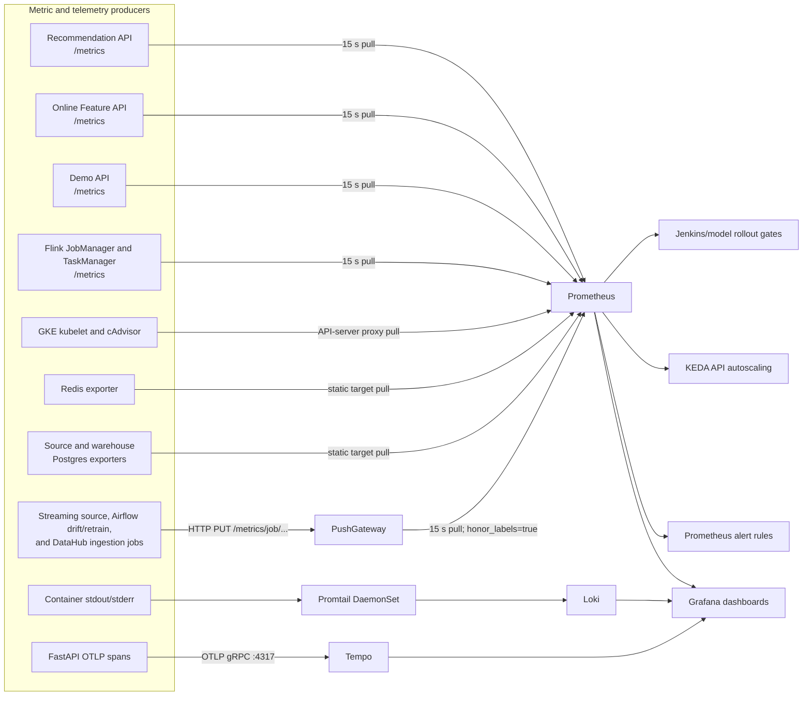
```mermaid
flowchart LR
    subgraph Producers["Metric and telemetry producers"]
        API["Recommendation API<br/>/metrics"]
        Feature["Online Feature API<br/>/metrics"]
        Demo["Demo API<br/>/metrics"]
        Flink["Flink JobManager and TaskManager<br/>/metrics"]
        Nodes["GKE kubelet and cAdvisor"]
        Redis["Redis exporter"]
        Postgres["Source and warehouse<br/>Postgres exporters"]
        Batch["Streaming source, Airflow drift/retrain,<br/>and DataHub ingestion jobs"]
        Logs["Container stdout/stderr"]
        Spans["FastAPI OTLP spans"]
    end

    Batch -->|"HTTP PUT /metrics/job/..."| Push["PushGateway"]
    API -->|"15 s pull"| Prom["Prometheus"]
    Feature -->|"15 s pull"| Prom
    Demo -->|"15 s pull"| Prom
    Flink -->|"15 s pull"| Prom
    Nodes -->|"API-server proxy pull"| Prom
    Redis -->|"static target pull"| Prom
    Postgres -->|"static target pull"| Prom
    Push -->|"15 s pull; honor_labels=true"| Prom

    Prom --> Grafana["Grafana dashboards"]
    Prom --> Rules["Prometheus alert rules"]
    Prom --> KEDA["KEDA API autoscaling"]
    Prom --> Rollout["Jenkins/model rollout gates"]

    Logs --> Promtail["Promtail DaemonSet"] --> Loki["Loki"] --> Grafana
    Spans -->|"OTLP gRPC :4317"| Tempo["Tempo"] --> Grafana
```

The concrete Prometheus behavior is defined in
[prometheus.yaml](../../../infra/helm/recsys-observability/templates/prometheus.yaml):

1. The global scrape interval and rule evaluation interval are both 15 seconds.
2. `recsys-kubernetes-pods` discovers pods only in `api-serving`,
   `recsys-dataflow`, `kserve-triton-inference`, `experiment-tracking`, and
   `kubeflow`. It keeps only pods annotated with
   `prometheus.io/scrape: "true"`, then derives the metrics path and port from
   the pod annotations. The resulting series receive `namespace` and `pod`
   labels.
3. `kubernetes-cadvisor` and `kubernetes-kubelet` discover every GKE node and
   access node metrics through `kubernetes.default.svc:443`. This is the source
   of cluster-wide container CPU, memory, network, start-time, and last-seen
   series.
4. Redis, source Postgres, warehouse Postgres, and PushGateway are explicit
   static targets. `honor_labels: true` on the PushGateway job preserves the
   producer's `job` and grouping labels instead of replacing them with the
   Prometheus scrape-job label.
5. API services are intentionally scraped once per annotated pod. The custom
   `recsys-prometheus` deployment does not discover `ServiceMonitor` objects;
   service-level scraping in addition to pod scraping would duplicate counters.

### 0.2 Metric Flow By Platform Component

| Component | Producer and collection path | Main metrics | Consumers |
| --- | --- | --- | --- |
| Recommendation API | FastAPI middleware and ranking/Triton hooks update an in-process metrics store. The pod exposes Prometheus text at `/metrics`; pod annotations provide path and port to `recsys-kubernetes-pods`. | `recsys_api_requests_total`, `recsys_api_failures_total`, `recsys_api_request_duration_seconds`, Redis/Triton duration and error series, recommendation size/score series, `model_predictions_total`, model latency/confidence histograms, A/B and shadow metrics. | Web API, Model Serving Promotion, Model A/B Testing, and Traces Overview dashboards; API alerts; KEDA; rollout promotion gates. |
| Online Feature API | The same FastAPI middleware records route/status/latency, while Feast/Redis access records empty-feature and Redis operation telemetry. `/metrics` is scraped from each annotated pod. | Shared `recsys_api_*` families distinguished by `service="recsys-online-feature-api"`; `recsys_api_empty_feature_total`. | Web API and Model Serving Promotion dashboards; feature-API KEDA ScaledObject. |
| Demo API | `prometheus_client` counters and histograms are exposed at `/metrics`. The GCP chart annotates backend pods in `api-serving`; its `PodMonitoring` also supports Google Managed Prometheus, but the in-repo Prometheus uses the annotations. | `recsys_demo_api_requests_total`, `recsys_demo_api_request_duration_seconds`. | Available for direct PromQL; not currently used by a version-controlled Grafana panel. |
| Flink streaming runtime | The Flink Prometheus reporter binds the configured metrics port on JobManager and TaskManager. Both pod templates carry scrape annotations. | Flink task/job/operator metrics, including `flink_taskmanager_job_task_numRecordsOutPerSecond`. | Data Pipeline Observability dashboard, especially source throughput. |
| Synthetic/live event source | The long-running producer periodically sends a `PUT` to PushGateway job `recsys_streaming_source_live`, grouped by `pipeline_role="online"` and Kafka source topic. Prometheus scrapes the latest stored values. | `recsys_streaming_events_total`, late/duplicate totals, last-event timestamp, maximum lateness, burst-window flag. | Data Pipeline Observability rate, quality, and freshness panels. |
| Redis | `redis-exporter` connects to the feature-store Redis service and exposes port `9121`; Prometheus uses a static target. | `redis_commands_processed_total`, `redis_connected_clients`, exporter health series. | Data Pipeline Observability and compute/exporter checks. |
| Source and warehouse Postgres | Two `postgres-exporter` deployments obtain credentials from `recsys-data-platform-secret`, connect to their respective databases, and expose port `9187`; Prometheus scrapes both static targets. | Standard `pg_*` exporter families and target `up`. | Direct PromQL and exporter health checks; the current dashboards do not provide detailed Postgres panels. |
| GKE workloads | Prometheus reads kubelet/cAdvisor endpoints through the API server; applications do not need a metrics library for this path. | `container_cpu_usage_seconds_total`, `container_memory_working_set_bytes`, network RX/TX, container start and last-seen series. | Compute Telemetry dashboard and the compute sections of A/B and DataHub dashboards. |
| Offline feature drift | The Airflow pod calculates PSI and pushes to job `recsys_offline_feature_drift`, grouped by `run_id`; the following DAG task pushes report availability to `recsys_offline_feature_drift_report`. | PSI/pass state, reference/current row counts, run/report timestamps. | ML Drift and Retrain dashboard, Data Pipeline dashboard, `RecSysFeatureDriftDetected` rule, and the retrain decision task. |
| Kubeflow retrain trigger | After evaluating the drift report, the trigger task pushes one result snapshot to job `recsys_kubeflow_retrain`, grouped by drift `run_id`. | `recsys_ml_retrain_triggered_total`, `recsys_ml_retrain_trigger_failed_total` with a reason label. Despite the `_total` suffix these are emitted as gauges with value 0 or 1 per grouped run. | ML Drift and Retrain dashboard. Kubeflow and Ray execution status itself is proved through their APIs/UI and pod state, not a dedicated custom Prometheus metric family. |
| DataHub static catalog sync | The Jenkins one-shot catalog command pushes a summary to job `recsys_datahub_governance`. | Sync success/timestamp plus dataset, lineage-edge, and Data Product counts/presence. | DataHub Governance dashboard. |
| Model rollout and Jenkins CD | These components are metric consumers. The rollout watcher and Jenkins promotion gate call Prometheus `/api/v1/query` for candidate/control sample count, error rate, p95 latency, and confidence proxy. | Reads `model_predictions_total`, `model_prediction_latency_seconds_*`, and `model_prediction_confidence_*`. | Decides hold, promote, or rollback; the same series feed A/B alert rules and dashboards. |

The application metrics implementation is in
[observability.py](../../../apps/api-serving/src/observability.py), the pod
discovery annotations are in
[api-deployment.yaml](../../../infra/helm/recsys-serving/templates/api-deployment.yaml)
and
[feature-api-deployment.yaml](../../../infra/helm/recsys-serving/templates/feature-api-deployment.yaml),
and the generic batch push transport is in
[pushgateway.py](../../../apps/data-platform/src/monitoring/pushgateway.py).

### 0.3 Prometheus Consumers And Control Loops

Prometheus is not only a Grafana datasource. Two production control loops query
the same stored time series:

- The FastAPI KEDA ScaledObjects query one-minute request rate and average
  latency for each `service`, `route`, and `method`. The recommendation API and
  feature API scale independently within their configured replica bounds. See
  [fastapi-prometheus-scaledobjects.yaml](../../../infra/helm/recsys-serving/templates/fastapi-prometheus-scaledobjects.yaml).
- The rollout watcher waits for enough candidate and control predictions, while
  Jenkins evaluates candidate error delta, p95 latency ratio, and confidence
  ratio. Missing samples cause a hold instead of an automatic promotion. See
  [model_rollout_controller.py](../../../apps/ml-system/src/cli/model_rollout_controller.py)
  and
  [promotion_gates.py](../../../jenkins/python/model_cd/promotion_gates.py).

Prometheus evaluates seven in-repo alert rules: API failure, feature drift,
data-quality failure, and four candidate-model regression/missing-traffic
conditions. The chart currently installs no Alertmanager and defines no Slack,
email, or PagerDuty receiver. Consequently, these rules produce Prometheus
alert state for UI/query inspection but do not send external notifications.

### 0.4 Storage, Restart Semantics, And Current Coverage Boundaries

- Prometheus is configured for seven-day retention, but the current GCP values
  leave `persistence.prometheus.enabled=false`, so its TSDB uses `emptyDir` and
  is lost when the Prometheus pod is replaced. API metric counters also live in
  process memory and restart from zero when an API pod restarts.
- PushGateway retains the latest series for each job/grouping-key combination.
  Producers use `PUT`, so rerunning the same grouping replaces its payload; the
  helper currently does not delete obsolete grouping keys. Dashboards that need
  the latest drift run join against PushGateway's `push_time_seconds`.
- Tempo stores traces on its container filesystem under `/tmp/tempo/traces` and
  compacts them with a 24-hour retention setting. Loki uses its image's local
  configuration. Neither backend has a PVC in the current template, so logs and
  traces are also restart-ephemeral.
- Grafana dashboards and datasource definitions are durable because Helm
  provisions them from version-controlled ConfigMaps. Grafana itself does not
  need a persistent UI database for these provisioned dashboards.
- Pod-metric and Promtail scopes omit the `analytics`, `ci`, and `datahub`
  namespaces. For example, Trino carries scrape annotations in `analytics`, but
  `recsys-kubernetes-pods` never discovers that namespace; Jenkins logs are not
  shipped by the current Promtail configuration. cAdvisor still provides basic
  cluster-wide container resource series for those pods.
- The Data Pipeline dashboard queries `recsys_data_quality_metric`, and the
  rules query `recsys_data_quality_passed`, but no production emitter for those
  metric names exists in the current repository. Those panels/rules remain
  `NO DATA` until a data-quality job publishes the contract to PushGateway or
  exposes it through a scraped endpoint.
- There is no `kube-state-metrics` deployment. Compute views therefore use
  kubelet/cAdvisor container series rather than the richer desired-vs-ready
  Kubernetes object metrics normally provided by kube-state-metrics.

Dashboard access is through the NGINX/GCP LoadBalancer gateway and the RecSys
Grafana folder. Public DNS, TLS, Basic Auth, rate limiting, host/path routing,
and the NGINX-to-Istio service flow are documented in
[Routing & Gateway](routing_gateway.md#setup-and-configuration-flow).

### Image Proof

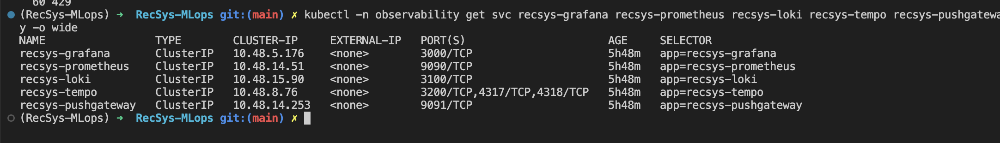

**Figure: Observability services proof.** This screenshot proves that the core
observability services are installed in the `observability` namespace and expose
the expected internal Kubernetes services for Grafana, Prometheus, Loki, Tempo,
and PushGateway.

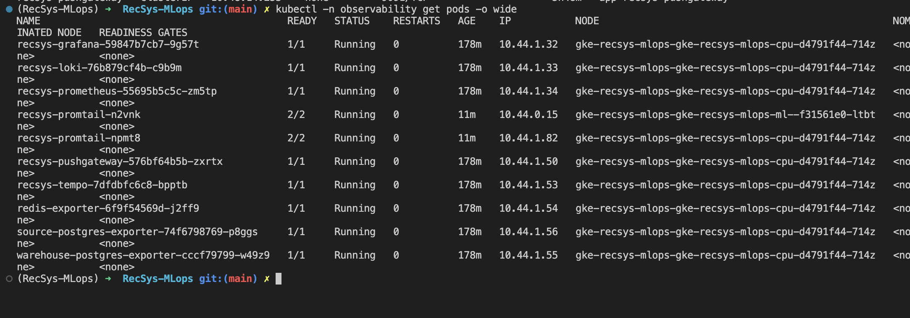

**Figure: Observability pods proof.** This screenshot proves that the
observability runtime pods are running, including Grafana, Prometheus, Loki,
Tempo, PushGateway, Promtail, and exporters.

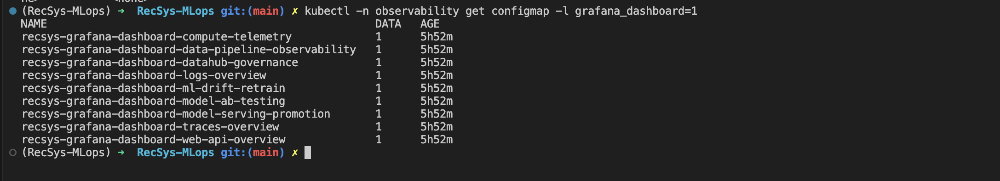

**Figure: Grafana dashboard provisioning proof.** This screenshot proves that
the dashboards are provisioned as Kubernetes ConfigMaps, so Grafana dashboards
are deployed through Helm/IaC instead of being created manually in the UI.

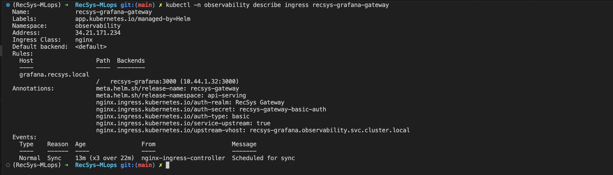

**Figure: Grafana gateway proof.** This screenshot proves that Grafana is
reachable through the gateway path used for UI-based observability proof
capture.

## 1. Web API Metrics

Both FastAPI serving services expose Prometheus metrics. Prometheus scrapes
`recsys-online-feature-api` for online feature lookup traffic and
`recsys-api-serving` for recommendation/Triton traffic.

Grafana visualizes:

| Metric | Meaning |
| --- | --- |
| `recsys_api_requests_total` | Request count by route, method, and status. |
| `recsys_api_failures_total` | Failed API request count. |
| `recsys_api_request_duration_seconds` | API latency distribution. |
| `recsys_feature_api_client_request_duration_seconds` | Recommendation API client latency when it calls the online feature API. |
| `recsys_api_recommendation_duration_seconds` | Recommendation ranking latency. |
| `recsys_api_triton_inference_duration_seconds` | Triton model inference latency. |
| `model_predictions_total` | Model prediction count by model version, status, and A/B variant. |
| `recsys_api_candidate_count` | Candidate item count per recommendation request. |

### Image Proof

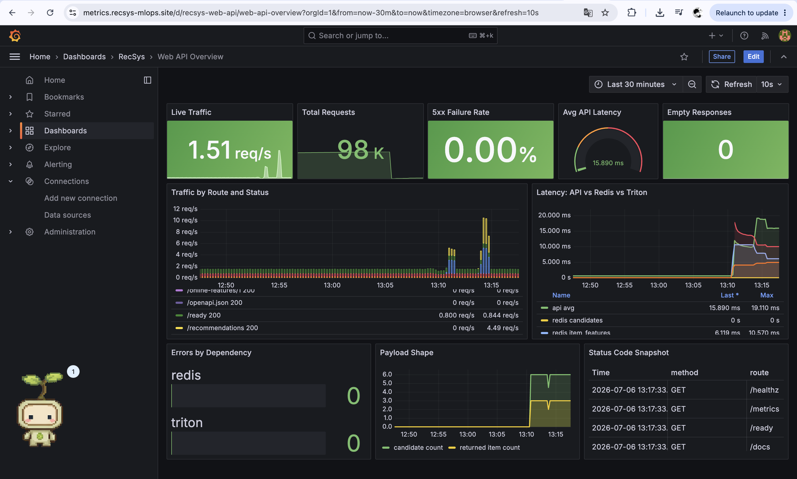

**Figure: Web API metrics proof.** This dashboard shows API traffic telemetry
for the recommendation and online-feature services, including request rate,
request count, failure count, latency, candidate count, and model prediction
activity.

## 2. Computing Telemetry Data: Metrics

Prometheus scrapes Kubernetes and container telemetry. Grafana visualizes
compute metrics for API serving, data platform, Kubeflow, DataHub, experiment
tracking, KServe/Triton, and observability workloads.

Typical dashboard panels:

| Panel | Metric family |
| --- | --- |
| CPU by namespace/pod | `container_cpu_usage_seconds_total` |
| Memory by namespace/pod | `container_memory_working_set_bytes` |
| Network receive/transmit | `container_network_receive_bytes_total`, `container_network_transmit_bytes_total` |
| Pod/container availability | `container_last_seen` and Kubernetes pod/container series |
| Exporter health | Redis/Postgres exporter scrape metrics |

### Image Proof

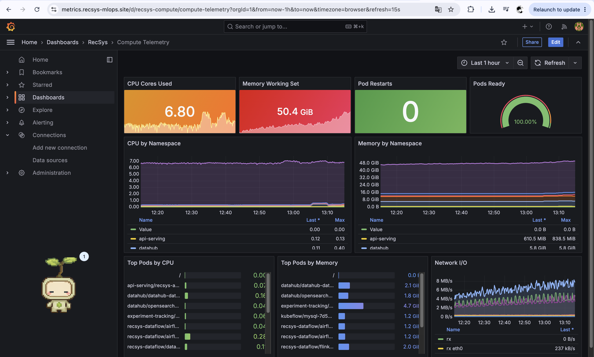

**Figure: Compute telemetry proof.** This dashboard proves that Prometheus and
Grafana are collecting infrastructure telemetry across namespaces, including
CPU, memory, network, pod health, and exporter health.

## 3. Computing Telemetry Data: Logs

Promtail runs as a DaemonSet, tails Kubernetes pod logs, and ships them to Loki.
Grafana uses Loki as the log datasource for centralized log search.

The log dashboard is used to inspect API logs, pipeline logs, service errors,
and request-level JSON logs from the serving layer.

### Image Proof

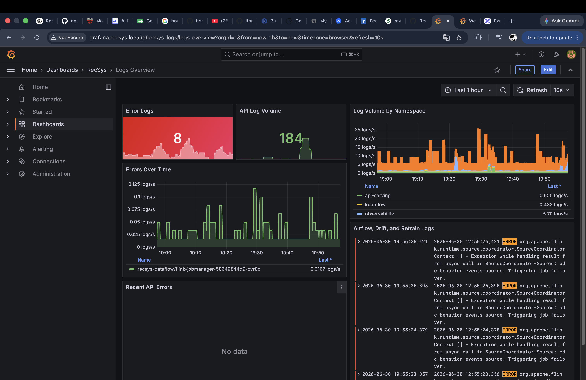

**Figure: Logs overview proof.** This dashboard proves that Kubernetes pod logs
are captured centrally in Loki and can be searched from Grafana by namespace,
service, route, status, and log content.

## 4. Computing Telemetry Data: Traces

FastAPI is instrumented with OpenTelemetry. Traces are exported to Tempo, and
Grafana uses Tempo as the trace datasource.

The trace dashboard links request context from API logs to Tempo trace context,
making it possible to inspect request flow through the recommendation service,
online feature service, and Triton inference calls.

### Image Proof

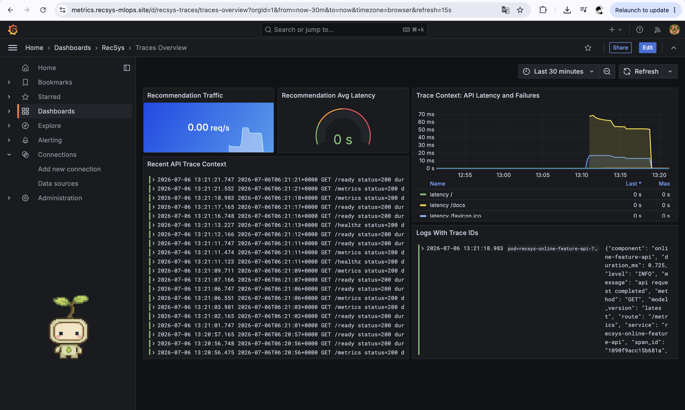

**Figure: Traces overview proof.** This dashboard proves that trace context from
`recsys-api-serving` is available in Grafana, so API requests can be inspected
through the tracing/log correlation view instead of only through raw logs.

## 5. ML-Related Telemetry Data: Airflow Drift Pipeline

There is no production groundtruth label stream in this coursework demo, so the
monitor detects **feature/data drift**, not concept drift. The decision signal is
the custom per-feature PSI calculation; Evidently is retained as a diagnostic
report and does not determine the retrain gate.

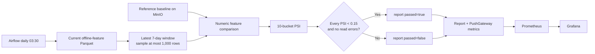
```mermaid
flowchart LR
    Airflow["Airflow daily 03:30"] --> Current["Current offline-feature Parquet"]
    Current --> Window["Latest 7-day window<br/>sample at most 1,000 rows"]
    Baseline["Reference baseline on MinIO"] --> Compare["Numeric feature comparison"]
    Window --> Compare
    Compare --> PSI["10-bucket PSI"]
    PSI --> Gate{"Every PSI < 0.15<br/>and no read errors?"}
    Gate -->|Yes| Pass["report passed=true"]
    Gate -->|No| Fail["report passed=false"]
    Pass --> Push["Report + PushGateway metrics"]
    Fail --> Push
    Push --> Prometheus --> Grafana
```

Key logic:

1. The Airflow DAG runs `run_offline_feature_drift -> push_drift_metrics -> trigger_kubeflow_retrain_if_drift` at `30 3 * * *`. See the [DAG commands and task dependencies](../../../apps/data-platform/src/orchestration/airflow/dags/recsys_feature_drift_monitoring.py).
2. The monitor reads `user_aggregate_features`, `item_features`, and `ml_bst_training` from the offline feature root. It keeps the latest seven days relative to the table's maximum timestamp and samples at most 1,000 rows with seed 42. See [monitored tables](../../../apps/data-platform/src/validate/offline_feature_drift.py#L21), [current-window sampling](../../../apps/data-platform/src/validate/offline_feature_drift.py#L249), and [current data-config defaults](../../../infra/helm/recsys-data-config/values.yaml#L241).
3. If a table has no reference baseline and bootstrap is enabled, its current sample is persisted as the initial baseline and that table passes the bootstrap run without a drift comparison. See [baseline bootstrap](../../../apps/data-platform/src/validate/offline_feature_drift.py#L416).
4. Only numeric/bool columns shared by current and baseline are checked; identifiers such as `user_id`, `product_id`, and all `*_id` columns are excluded. See [numeric feature selection](../../../apps/data-platform/src/validate/offline_feature_drift.py#L223).
5. Baseline quantiles define up to ten histogram buckets. For every feature, PSI is `sum((actual_pct - expected_pct) * log(actual_pct / expected_pct))`; `1e-4` prevents zero divisions. See [PSI implementation](../../../apps/data-platform/src/validate/offline_feature_drift.py#L83).
6. A feature passes only when `PSI < threshold`; the default threshold is `0.15`, so `PSI == 0.15` fails. The whole run passes only when there are no table errors and every measured feature passes. See [feature gate](../../../apps/data-platform/src/validate/offline_feature_drift.py#L270), [run gate/report](../../../apps/data-platform/src/validate/offline_feature_drift.py#L444), and [threshold CLI/config](../../../apps/data-platform/src/validate/offline_feature_drift.py#L471).

Reference code:

```python
current = sample_current_frame(
    current_full,
    current_days=current_days,
    sample_rows=sample_rows,
    random_state=random_state,
)
reference = _read_parquet_frame(reference_uri)
results.extend(analyze_feature_table(reference, current, table_name, threshold))

score = calculate_psi(
    _numeric_values(reference, feature),
    _numeric_values(current, feature),
)
passed = score < threshold
```

Source: [table analysis loop](../../../apps/data-platform/src/validate/offline_feature_drift.py#L404) and [per-feature PSI decision](../../../apps/data-platform/src/validate/offline_feature_drift.py#L270).

The report stores `groundtruth_available=false`, per-feature PSI/pass state,
baseline/current row counts, Evidently diagnostics, bootstrap state and read
errors. It is written to MinIO and the short-lived Airflow task pushes the
following metrics through PushGateway. See [report and metric publication](../../../apps/data-platform/src/validate/offline_feature_drift.py#L444).

Metrics pushed:

| Metric | Meaning |
| --- | --- |
| `recsys_ml_feature_drift_psi` | PSI score per feature. |
| `recsys_ml_feature_drift_passed` | `1` if feature passed, `0` if drifted. |
| `recsys_ml_feature_drift_reference_rows` | Baseline/reference row count. |
| `recsys_ml_feature_drift_current_rows` | Current offline feature-store row count. |
| `recsys_ml_feature_drift_run_timestamp_seconds` | Drift run timestamp. |

### Image Proof

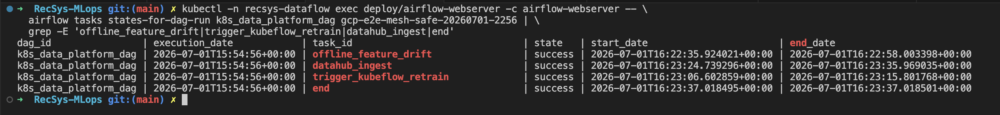

**Figure: Airflow drift pipeline proof.** This screenshot proves that the
Airflow drift path is part of the data platform DAG and runs after offline
feature generation/materialization, before the retrain trigger step.

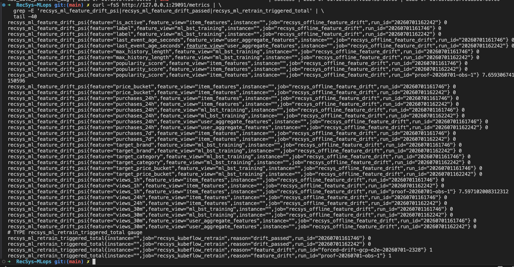

**Figure: PushGateway drift metrics proof.** This screenshot proves that the
Airflow drift task publishes feature-drift metrics into PushGateway, which acts
as the bridge between short-lived batch tasks and Prometheus scraping.

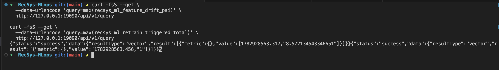

**Figure: Prometheus drift query proof.** This screenshot proves that Prometheus
can query the drift metrics scraped from PushGateway, including PSI and pass/fail
signals for monitored feature tables.

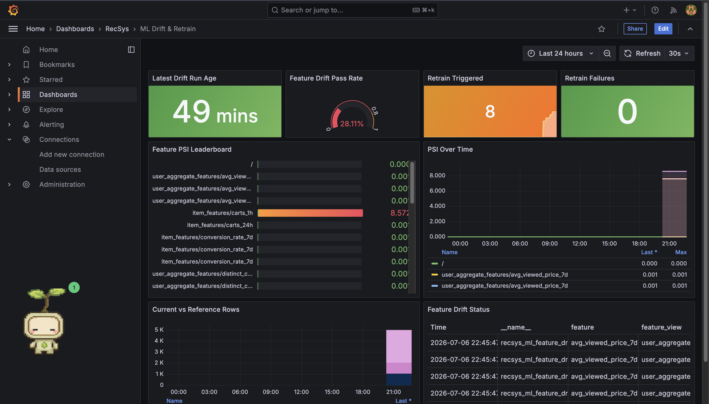

**Figure: Grafana ML drift dashboard proof.** This dashboard proves that drift
metrics are visualized for reviewers, including drift scores, pass/fail state,
baseline/current row counts, and retrain-related telemetry.

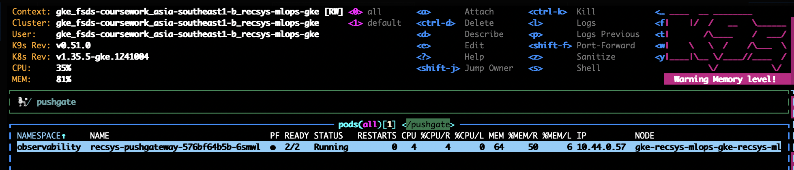

**Figure: K9s PushGateway pod proof.** This screenshot proves that the
PushGateway runtime pod is running in the observability namespace and is
available to receive drift/retrain metrics from Airflow and smoke jobs.

## 6. ML-Related Telemetry Data: Trigger Retrain By Kubeflow API

The retrain task does not call the Python `recsys_bst_pipeline()` function at
runtime. CI/CD first compiles that DSL function into
`bst_training_pipeline.yaml`; the trigger submits this package plus run-specific
arguments to the Kubeflow Pipelines API.

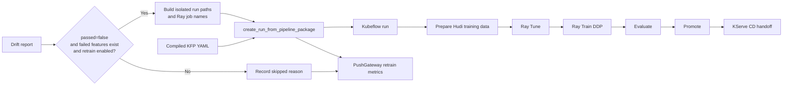
```mermaid
flowchart LR
    Report["Drift report"] --> Decision{"passed=false<br/>and failed features exist<br/>and retrain enabled?"}
    Decision -->|No| Skip["Record skipped reason"]
    Decision -->|Yes| Args["Build isolated run paths<br/>and Ray job names"]
    YAML["Compiled KFP YAML"] --> Submit["create_run_from_pipeline_package"]
    Args --> Submit
    Submit --> KFP["Kubeflow run"]
    KFP --> Prepare["Prepare Hudi training data"]
    Prepare --> Tune["Ray Tune"] --> DDP["Ray Train DDP"]
    DDP --> Evaluate --> Promote --> CD["KServe CD handoff"]
    Skip --> Metrics["PushGateway retrain metrics"]
    Submit --> Metrics
```

Key logic:

1. `trigger_retrain()` reads the report and builds the failed-feature list. A passed report, or a report with no failed feature entries, returns `drift_passed`; `RETRAIN_ON_DRIFT=false` returns `retrain_disabled`. Read errors without a failed feature entry therefore do not trigger retraining. See [failed-feature extraction](../../../apps/data-platform/src/mlops/trigger_kubeflow_retrain.py#L42) and [retrain gate](../../../apps/data-platform/src/mlops/trigger_kubeflow_retrain.py#L126).
2. For an eligible drift run, the trigger creates isolated output, Hudi-manifest, Ray Tune, Ray DDP, evaluation and promotion paths. Defaults use one tuning trial and two DDP workers. Explicit `--pipeline-arg key=value` values override these defaults. See [default arguments](../../../apps/data-platform/src/mlops/trigger_kubeflow_retrain.py#L81), [argument parsing](../../../apps/data-platform/src/mlops/trigger_kubeflow_retrain.py#L50), and [argument merge](../../../apps/data-platform/src/mlops/trigger_kubeflow_retrain.py#L146).
3. The trigger creates/reuses the Kubeflow experiment, resolves the uploaded
   pipeline by name, optionally selects the deployed version ID, and calls
   `run_pipeline` with those arguments. The compiled YAML is a Jenkins build
   artifact uploaded by the KFP deploy unit; runtime retraining does not read a
   committed YAML file. See [KFP run submission](../../../apps/data-platform/src/mlops/trigger_kubeflow_retrain.py#L148),
   [DSL compilation](../../../apps/ml-system/src/kubeflow/pipelines/compile_training_pipeline.py#L25),
   [package gate](../../../jenkins/scripts/build/kfp_package.sh), and
   [upload action](../../../jenkins/scripts/deploy/upload_kfp_package.sh).
4. Success records the KFP run ID; exceptions are captured in `RetrainResult.error`. Both outcomes publish trigger/failure counters for Prometheus and Grafana. See [result/error handling](../../../apps/data-platform/src/mlops/trigger_kubeflow_retrain.py#L159) and [retrain metrics](../../../apps/data-platform/src/mlops/trigger_kubeflow_retrain.py#L117).

Reference code:

```python
failures = failed_features(report)
if report.get("passed", False) or not failures:
    result = RetrainResult(run_id, False, None, "drift_passed", failed_features=failures)
    push_retrain_metric(result, pushgateway_url)
    return result
if not retrain_on_drift:
    result = RetrainResult(run_id, False, None, "retrain_disabled", failed_features=failures)
    push_retrain_metric(result, pushgateway_url)
    return result

arguments = default_pipeline_arguments(run_id)
arguments.update(pipeline_arguments or {})

client = kfp.Client(host=endpoint)
experiment = client.create_experiment(name=experiment_name)
run = client.create_run_from_pipeline_package(
    pipeline_file=pipeline_package_path,
    arguments=arguments,
    experiment_id=experiment.experiment_id,
    run_name=kfp_run_name(run_id),
)
```

Source: [trigger_retrain()](../../../apps/data-platform/src/mlops/trigger_kubeflow_retrain.py#L126).

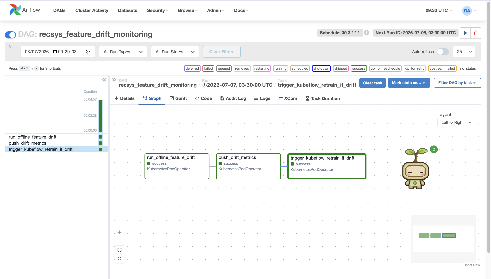

**Figure: Scheduled drift-to-retrain DAG.** The
`recsys_feature_drift_monitoring` DAG always executes the trigger task after the
drift and metric tasks; the gate inside `trigger_retrain()` decides whether a
Kubeflow run is submitted or recorded as skipped.

Metrics pushed:

| Metric | Meaning |
| --- | --- |
| `recsys_ml_retrain_triggered_total` | `1` when retrain is triggered by drift. |
| `recsys_ml_retrain_trigger_failed_total` | `1` when retrain trigger fails. |

### Image Proof


**Figure: Drift and retrain telemetry dashboard.** Grafana correlates per-feature
PSI/pass state with retrain trigger and failure counters.

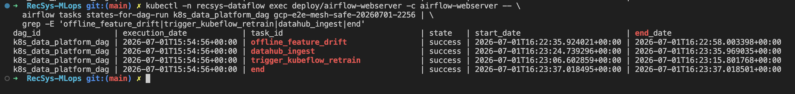

**Figure: Airflow retrain trigger proof.** This screenshot proves that the
Airflow DAG contains and executes the retrain trigger after the feature-drift
task, making retraining part of the automated ML monitoring flow.

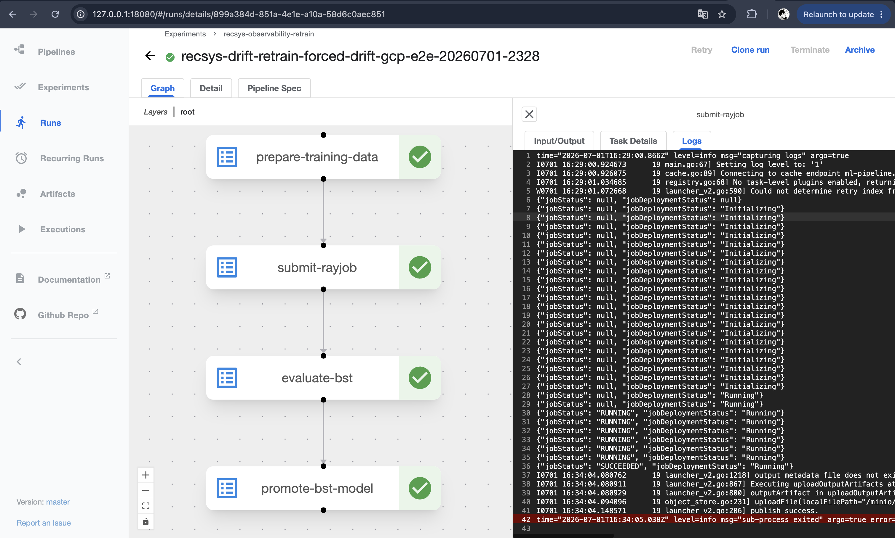

**Figure: Kubeflow retrain workflow proof.** This screenshot proves that the
drift-triggered retrain request reaches Kubeflow Pipelines and creates a
training workflow that can be inspected in the Kubeflow UI.

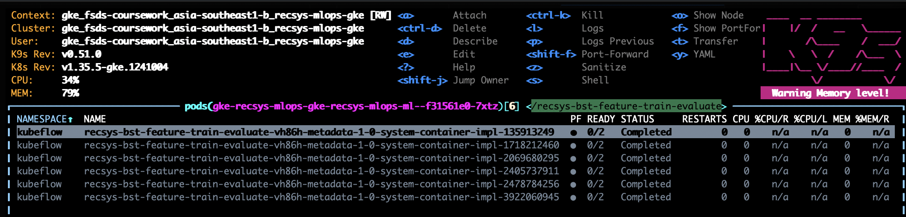

**Figure: Kubeflow workflow pod proof.** This screenshot proves that the
Kubeflow retraining workflow creates Kubernetes pods for the training pipeline
steps, not just a dashboard-only run record.

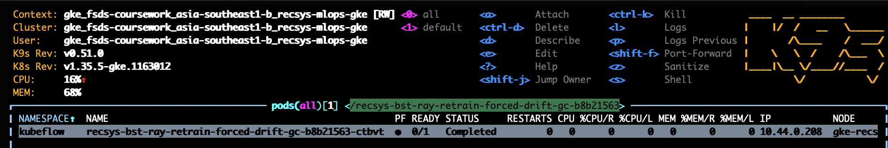

**Figure: KubeRay retrain RayJob proof.** This screenshot proves that the
Kubeflow retraining pipeline launches a KubeRay RayJob for model training, so
the retrain flow reaches the distributed training runtime.

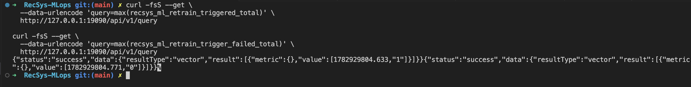

**Figure: Prometheus retrain metric proof.** This screenshot proves that retrain
trigger/failure counters are exported into Prometheus after the Airflow drift
pipeline calls Kubeflow API, allowing Grafana to show whether drift led to a
retraining workflow and whether the trigger succeeded.
