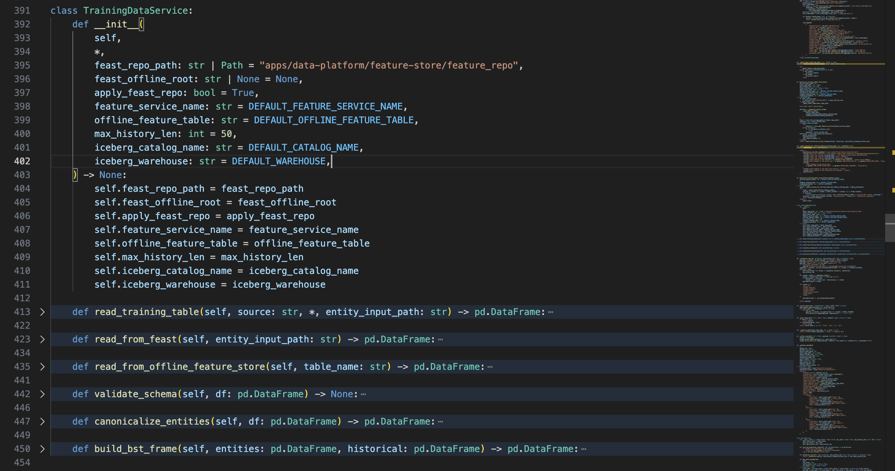
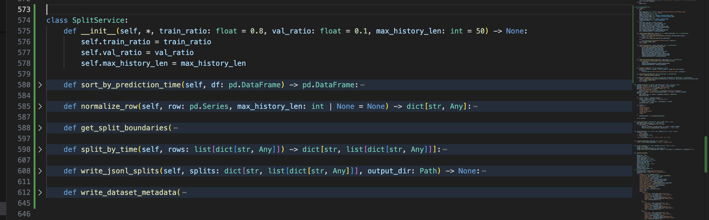
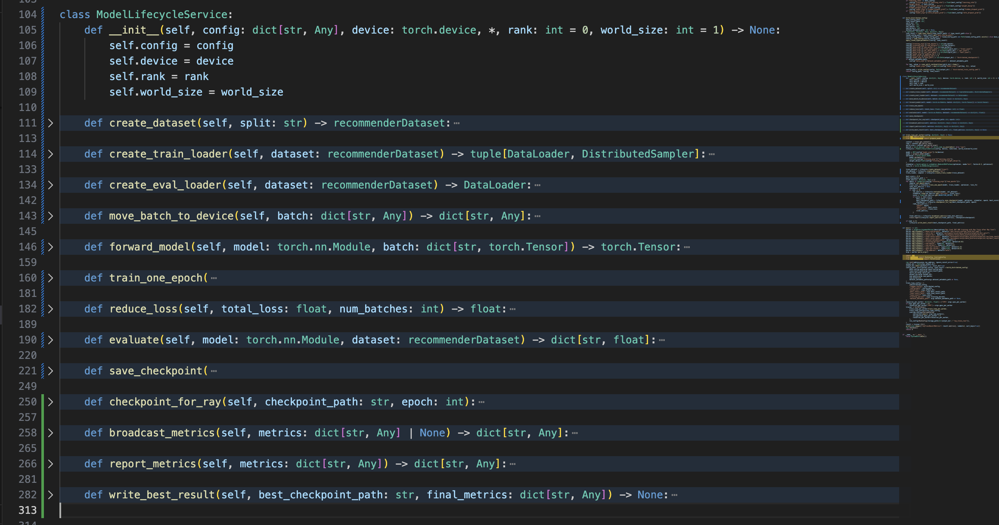
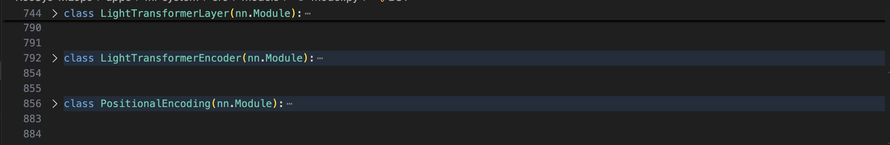
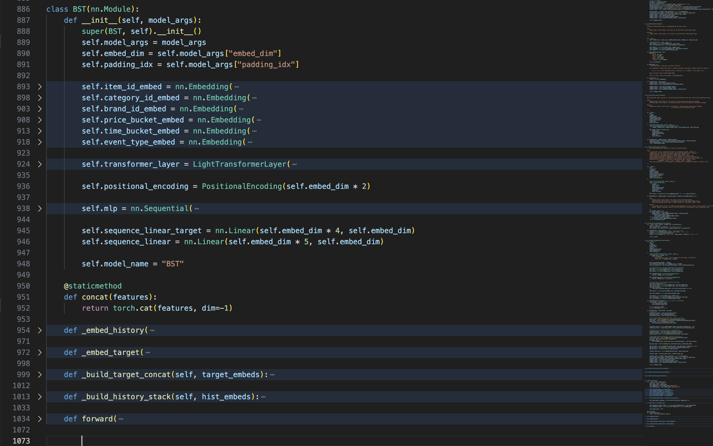

# Repository Design Proof

This proof covers the final-coursework rubric item **Repository Design: clean code, clean repo, and demonstrated design pattern usage**.

## Rubric Mapping

| Rubric requirement | Repository evidence |
|---|---|
| Clean repo | Source code is split by bounded context: API serving, data platform, ML system, infrastructure, tests, and submission docs. |
| Clean code | Runtime logic is decomposed into schema, routing, feature access, ranking, observability, orchestration, model training, and promotion modules. |
| Design pattern usage | The codebase uses Strategy/Router, Adapter/Gateway, Protocol/Dependency Injection, Service Layer/Facade, Template Method/Lifecycle Service, Composite, Builder/Manifest, and Pipeline/Chain patterns. |
| Proof to capture | Screenshots of folder layout, tests, and code snippets where the design patterns are implemented. |

## Clean Repository Layout

The repository is organized around deployable and testable service boundaries instead of one large application folder.

```text
apps/
  api-serving/                 FastAPI recommendation API, online feature API, A/B router, Triton client
  data-platform/               Airflow, Spark, Flink, Feast feature store, ingestion, validation
  ml-system/                   BST model, Kubeflow pipeline, Ray Tune/DDP training, MLflow, promotion
infra/
  helm/                        Helm charts for serving, data platform, observability, security, gateway, CI
  terraform/gcp/               GCP/GKE infrastructure as code
  kubeflow/                    Compiled Kubeflow pipeline packages
jenkins/
  scripts/                     Shared path-based CI/CD scripts
tests/
  unit/                        Fast isolated tests by component
  contract/                    Manifest/chart/pipeline contract tests
  integration/                 Cross-service integration tests
  e2e/                         Live system verification tests
  load/                        Locust load-test scenarios
docs/
  submission/                  Rubric proof documents
  pngs/                        UI and terminal proof screenshots
```

The GCP Terraform layout follows the same separation of concerns.

| Terraform file | Responsibility |
|---|---|
| `apis.tf` | Required GCP APIs. |
| `network.tf` | VPC, subnet, secondary IP ranges. |
| `gke.tf` | GKE cluster and node pools. |
| `registry_storage.tf` | Artifact Registry and model/data storage buckets. |
| `cloudbuild.tf` | Cloud Build permissions and build integration. |
| `namespaces.tf` | Kubernetes namespaces and mesh injection labels. |
| `dependencies.tf` | Shared operators: cert-manager, KEDA, KServe, Istio, External Secrets. |
| `recsys_services.tf` | RecSys Helm releases. |
| `secret_management.tf` | Central source secrets for External Secrets Operator. |

### Code Reference

- [README.md](../../../README.md): top-level repository structure and navigation.
- [gke.tf (line 1)](../../../infra/terraform/gcp/gke.tf#L1), [gke.tf (line 245)](../../../infra/terraform/gcp/gke.tf#L245): GKE cluster and node-pool infrastructure boundary.
- [api-deployment.yaml (line 1)](../../../infra/helm/recsys-serving/templates/api-deployment.yaml#L1), [api-deployment.yaml (line 85)](../../../infra/helm/recsys-serving/templates/api-deployment.yaml#L85): API serving deployment boundary.
- [airflow.yaml (line 1)](../../../infra/helm/recsys-data-platform/templates/airflow.yaml#L1), [airflow.yaml (line 138)](../../../infra/helm/recsys-data-platform/templates/airflow.yaml#L138): data platform orchestration boundary.
- [istio-authorization.yaml (line 1)](../../../infra/helm/recsys-security/templates/istio-authorization.yaml#L1), [istio-authorization.yaml (line 235)](../../../infra/helm/recsys-security/templates/istio-authorization.yaml#L235): security policy boundary.

### Image Proof

**Capture command**

```bash
find apps infra/helm infra/terraform/gcp jenkins tests docs/submission -maxdepth 2 -type d | sort | sed -n '1,140p'
```


**Figure: Clean repository folder boundary proof.** This screenshot should show the high-level source tree split by ownership boundary. The important proof is that API serving, data platform, ML system, infrastructure, CI/CD, tests, and submission docs are separate directories instead of mixed together.

## Clean Code Boundaries

The code keeps each runtime responsibility in a focused module:

| Boundary | Main files | Responsibility |
|---|---|---|
| API schema | [api_schemas.py (line 8)](../../../apps/api-serving/src/api_schemas.py#L8), [api_schemas.py (line 37)](../../../apps/api-serving/src/api_schemas.py#L37) | Pydantic request/response contracts. |
| A/B routing | [ab_testing.py (line 13)](../../../apps/api-serving/src/ab_testing.py#L13), [ab_testing.py (line 151)](../../../apps/api-serving/src/ab_testing.py#L151) | Control/candidate routing and experiment labels. |
| Feature access | [online_features.py (line 124)](../../../apps/api-serving/src/online_features.py#L124), [online_features.py (line 253)](../../../apps/api-serving/src/online_features.py#L253) | Feast/Redis online feature access behind one client. |
| Ranking orchestration | [ranking.py (line 80)](../../../apps/api-serving/src/ranking.py#L80), [ranking.py (line 219)](../../../apps/api-serving/src/ranking.py#L219) | Recommendation flow: pull features, route ranker, build payload, format response. |
| Triton gateway | [triton.py (line 13)](../../../apps/api-serving/src/triton.py#L13), [triton.py (line 52)](../../../apps/api-serving/src/triton.py#L52) | Triton gRPC inference client. |
| Training data service | [prepare_bst_training_data.py (line 393)](../../../apps/ml-system/src/cli/prepare_bst_training_data.py#L393), [prepare_bst_training_data.py (line 456)](../../../apps/ml-system/src/cli/prepare_bst_training_data.py#L456) | Feast/offline-store training table loading, schema validation, and canonical BST dataframe construction. |
| Temporal split service | [prepare_bst_training_data.py (line 581)](../../../apps/ml-system/src/cli/prepare_bst_training_data.py#L581), [prepare_bst_training_data.py (line 652)](../../../apps/ml-system/src/cli/prepare_bst_training_data.py#L652) | Time-ordered train/validation/test split creation, JSONL writing, and dataset-version metadata. |
| Ray Tune training loop | [trainer.py (line 58)](../../../apps/ml-system/src/models/trainer.py#L58), [trainer.py (line 295)](../../../apps/ml-system/src/models/trainer.py#L295) | Single-node BST trial training/evaluation lifecycle used by Ray Tune. |
| Ray DDP lifecycle | [ray_distributed_train_bst.py (line 104)](../../../apps/ml-system/src/training/ray_distributed_train_bst.py#L104), [ray_distributed_train_bst.py (line 368)](../../../apps/ml-system/src/training/ray_distributed_train_bst.py#L368) | Distributed BST training lifecycle for Ray Train DDP workers. |
| Model promotion | [model_promotion.py (line 405)](../../../apps/ml-system/src/registry/model_promotion.py#L405), [model_promotion.py (line 666)](../../../apps/ml-system/src/registry/model_promotion.py#L666) | Export, register, upload, and manifest generation. |
| Data generation pipeline | [historical_pipeline.py (line 21)](../../../apps/data-platform/data-generator/src/offline/historical_pipeline.py#L21), [historical_pipeline.py (line 137)](../../../apps/data-platform/data-generator/src/offline/historical_pipeline.py#L137) | Simulation, problem injection, validation, sink writing, manifest output. |

## Design Patterns In Code

### Pattern 1: Strategy / Router For A/B Inference

**Intent:** choose one of several interchangeable model-serving strategies at runtime without changing the recommendation flow.

**External reference:** [Strategy pattern](https://en.wikipedia.org/wiki/Strategy_pattern).

**Implementation:** `TritonABRouter` owns the control/candidate route selection. `recommend()` only asks `select_triton_route()` for the route, then calls the selected ranker. The routing decision is isolated from payload building and response formatting.

| Code reference | What to point out in the screenshot |
|---|---|
| [ab_testing.py (line 20)](../../../apps/api-serving/src/ab_testing.py#L20), [ab_testing.py (line 89)](../../../apps/api-serving/src/ab_testing.py#L89) | `TritonABRouter` encapsulates A/B routing state. |
| [ab_testing.py (line 91)](../../../apps/api-serving/src/ab_testing.py#L91), [ab_testing.py (line 107)](../../../apps/api-serving/src/ab_testing.py#L107) | `assign()` maps a user deterministically to control/candidate. |
| [ab_testing.py (line 121)](../../../apps/api-serving/src/ab_testing.py#L121), [ab_testing.py (line 141)](../../../apps/api-serving/src/ab_testing.py#L141) | `route()` returns a `TritonRoute` with ranker, variant, experiment, and model version. |
| [ranking.py (line 122)](../../../apps/api-serving/src/ranking.py#L122), [ranking.py (line 150)](../../../apps/api-serving/src/ranking.py#L150) | `recommend()` delegates model choice to `select_triton_route()`. |


**Figure: Strategy/Router design pattern proof.** Capture `TritonABRouter.assign()`, `TritonABRouter.route()`, and the `recommend()` call to `select_triton_route()`. This proves model routing is a replaceable strategy instead of hard-coded `if candidate then call service B` logic inside the ranking flow.

### Pattern 2: Adapter / Gateway For Online Feature Store Access

**Intent:** hide storage-specific details behind a small domain client so API code does not depend directly on Redis/Feast calls everywhere.

**External reference:** [Adapter pattern](https://en.wikipedia.org/wiki/Adapter_pattern).

**Implementation:** `FeatureClient` adapts Feast online retrieval and Redis configuration into domain methods such as `user_sequence()` and `item_features_batch()`. The ranking flow depends on feature operations, not low-level storage commands.

| Code reference | What to point out in the screenshot |
|---|---|
| [online_features.py (line 124)](../../../apps/api-serving/src/online_features.py#L124), [online_features.py (line 253)](../../../apps/api-serving/src/online_features.py#L253) | `FeatureClient` is the adapter boundary. |
| [online_features.py (line 150)](../../../apps/api-serving/src/online_features.py#L150), [online_features.py (line 179)](../../../apps/api-serving/src/online_features.py#L179) | Lazy construction of Feast `FeatureStore`. |
| [online_features.py (line 181)](../../../apps/api-serving/src/online_features.py#L181), [online_features.py (line 207)](../../../apps/api-serving/src/online_features.py#L207) | Domain method for user sequence features. |
| [online_features.py (line 209)](../../../apps/api-serving/src/online_features.py#L209), [online_features.py (line 236)](../../../apps/api-serving/src/online_features.py#L236) | Domain method for batch item features. |


**Figure: Adapter/Gateway design pattern proof.** Capture `FeatureClient` and one of its domain methods. This proves Redis/Feast details are localized in one gateway class while the serving code consumes a clean feature API.

### Pattern 3: Protocol + Dependency Injection For Ranker Substitution

**Intent:** allow production Triton ranker and test/deterministic rankers to share the same interface.

**External references:** [Python Protocol / structural subtyping](https://docs.python.org/3/library/typing.html#typing.Protocol), [PEP 544: Protocols](https://peps.python.org/pep-0544/), and [Dependency Injection](https://en.wikipedia.org/wiki/Dependency_injection).

**Implementation:** `RankerProtocol` defines the expected `score()` method. `TritonRanker` implements that protocol for production, and tests can inject fake rankers without starting Triton.

| Code reference | What to point out in the screenshot |
|---|---|
| [triton.py (line 13)](../../../apps/api-serving/src/triton.py#L13), [triton.py (line 16)](../../../apps/api-serving/src/triton.py#L16) | `RankerProtocol` defines the ranker interface. |
| [triton.py (line 18)](../../../apps/api-serving/src/triton.py#L18), [triton.py (line 52)](../../../apps/api-serving/src/triton.py#L52) | `TritonRanker` implements production gRPC inference. |
| [ranking.py (line 122)](../../../apps/api-serving/src/ranking.py#L122), [ranking.py (line 150)](../../../apps/api-serving/src/ranking.py#L150) | `recommend()` receives a `RankerProtocol` or `TritonABRouter` dependency. |
| [test_split_services.py (line 15)](../../../tests/unit/api_serving/test_split_services.py#L15), [test_split_services.py (line 55)](../../../tests/unit/api_serving/test_split_services.py#L55) | Unit tests inject deterministic rankers. |


**Figure: Protocol/Dependency Injection design pattern proof.** Capture `RankerProtocol`, `TritonRanker`, and a fake/deterministic test ranker. This proves the ranking flow is testable because the model-serving dependency can be replaced.

### Pattern 4: Service Layer / Facade For ML Training Data Preparation

**Intent:** keep feature-source access, schema validation, temporal splitting, and dataset-version writing behind focused service boundaries.

**External reference:** [Facade pattern](https://en.wikipedia.org/wiki/Facade_pattern).

**Implementation:** `TrainingDataService` hides Feast and offline feature store loading behind one training-table API. `SplitService` hides temporal sorting, row normalization, JSONL split writing, and dataset metadata writing. The KFP `prepare-training-data` component calls the data-prep flow, but the flow delegates source-specific IO and split policy to these classes.

| Code reference | What to point out in the screenshot |
|---|---|
| [prepare_bst_training_data.py (line 393)](../../../apps/ml-system/src/cli/prepare_bst_training_data.py#L393), [prepare_bst_training_data.py (line 456)](../../../apps/ml-system/src/cli/prepare_bst_training_data.py#L456) | `TrainingDataService` class with `read_training_table()`, Feast loading, offline-store loading, schema validation, and canonical frame building. |
| [prepare_bst_training_data.py (line 581)](../../../apps/ml-system/src/cli/prepare_bst_training_data.py#L581), [prepare_bst_training_data.py (line 652)](../../../apps/ml-system/src/cli/prepare_bst_training_data.py#L652) | `SplitService` class with temporal sort, row normalization, split boundaries, JSONL output, and dataset metadata. |
| [prepare_bst_training_data.py (line 654)](../../../apps/ml-system/src/cli/prepare_bst_training_data.py#L654), [prepare_bst_training_data.py (line 758)](../../../apps/ml-system/src/cli/prepare_bst_training_data.py#L758) | `prepare_bst_jsonl_splits()` wires both services into the actual pipeline flow. |
| [test_prepare_bst_training_data.py (line 63)](../../../tests/unit/ml_system/test_prepare_bst_training_data.py#L63), [test_prepare_bst_training_data.py (line 135)](../../../tests/unit/ml_system/test_prepare_bst_training_data.py#L135) | Unit tests prove the service boundary validates schema and creates temporal splits. |



**Figure: TrainingDataService facade proof.** Capture `TrainingDataService` and the call site in `prepare_bst_jsonl_splits()`. This proves the ML pipeline no longer spreads Feast/offline-store loading and schema validation across unrelated helper code.



**Figure: SplitService temporal split proof.** Capture `SplitService.split_by_time()`, `write_jsonl_splits()`, and `write_dataset_metadata()`. This proves the no-leakage temporal split and dataset-version metadata are a named service boundary.

### Pattern 5: Template Method / Lifecycle Service For BST Training

**Intent:** keep training and evaluation flow consistent while reusing shared batch movement, forward pass, and metric computation.

**External reference:** [Template method pattern](https://en.wikipedia.org/wiki/Template_method_pattern).

**Implementation:** Ray Tune still uses the single-node `Trainer` path through `run_training()`, while the final distributed proof uses `ModelLifecycleService` inside `train_loop_per_worker()`. Both paths keep the same high-level lifecycle shape: create dataset/loader, move batches to the device, call the BST forward pass, compute loss and ranking metrics, save the best checkpoint, and publish metrics. `ModelLifecycleService` adds the distributed concerns: `DistributedSampler`, DDP metric reduction, rank-0 checkpointing, metric broadcast, Ray Train reporting, and best-result writing.

| Code reference | What to point out in the screenshot |
|---|---|
| [trainer.py (line 88)](../../../apps/ml-system/src/models/trainer.py#L88), [trainer.py (line 95)](../../../apps/ml-system/src/models/trainer.py#L95) | `_move_batch_to_device()` shared step. |
| [trainer.py (line 97)](../../../apps/ml-system/src/models/trainer.py#L97), [trainer.py (line 109)](../../../apps/ml-system/src/models/trainer.py#L109) | `_forward_batch()` shared step. |
| [trainer.py (line 129)](../../../apps/ml-system/src/models/trainer.py#L129), [trainer.py (line 174)](../../../apps/ml-system/src/models/trainer.py#L174) | `train()` algorithm skeleton. |
| [trainer.py (line 176)](../../../apps/ml-system/src/models/trainer.py#L176), [trainer.py (line 216)](../../../apps/ml-system/src/models/trainer.py#L216) | `evaluate()` algorithm skeleton. |
| [trainer.py (line 218)](../../../apps/ml-system/src/models/trainer.py#L218), [trainer.py (line 266)](../../../apps/ml-system/src/models/trainer.py#L266) | `_compute_metrics()` shared metric step. |
| [ray_tune_train_bst.py (line 207)](../../../apps/ml-system/src/training/ray_tune_train_bst.py#L207), [ray_tune_train_bst.py (line 254)](../../../apps/ml-system/src/training/ray_tune_train_bst.py#L254) | `run_trial()` uses `run_training()` for Ray Tune trials and reports the best trial metrics. |
| [ray_distributed_train_bst.py (line 104)](../../../apps/ml-system/src/training/ray_distributed_train_bst.py#L104), [ray_distributed_train_bst.py (line 314)](../../../apps/ml-system/src/training/ray_distributed_train_bst.py#L314) | `ModelLifecycleService` groups DDP dataset, loader, train, eval, checkpoint, report, and best-result lifecycle methods. |
| [ray_distributed_train_bst.py (line 316)](../../../apps/ml-system/src/training/ray_distributed_train_bst.py#L316), [ray_distributed_train_bst.py (line 368)](../../../apps/ml-system/src/training/ray_distributed_train_bst.py#L368) | `train_loop_per_worker()` instantiates `ModelLifecycleService` for each Ray Train worker. |
| [ray_distributed_train_bst.py (line 370)](../../../apps/ml-system/src/training/ray_distributed_train_bst.py#L370), [ray_distributed_train_bst.py (line 431)](../../../apps/ml-system/src/training/ray_distributed_train_bst.py#L431) | `TorchTrainer` uses `train_loop_per_worker`, so the DDP run goes through the lifecycle service. |


**Figure: Ray Tune single-node training lifecycle proof.** Capture `Trainer.train()`, `Trainer.evaluate()`, and `ray_tune_train_bst.run_trial()`. This proves Ray Tune trials use a consistent training/evaluation lifecycle and report comparable metrics.



**Figure: DDP ModelLifecycleService proof.** Capture `ModelLifecycleService`, `train_loop_per_worker()`, and the `TorchTrainer(train_loop_per_worker=...)` call. This proves final distributed training uses the lifecycle service rather than ad hoc worker-loop code.

### Pattern 6: Composite Neural Network Module

**Intent:** build a complex BST recommender by composing smaller PyTorch modules.

**External reference:** [Composite pattern](https://en.wikipedia.org/wiki/Composite_pattern).

**Implementation:** `BST` combines embedding layers, `LightTransformerLayer`, positional encoding, MLP layers, and linear projections. Each piece remains a testable `nn.Module` or standard PyTorch layer.

| Code reference | What to point out in the screenshot |
|---|---|
| [model.py (line 856)](../../../apps/ml-system/src/models/model.py#L856), [model.py (line 884)](../../../apps/ml-system/src/models/model.py#L884) | `PositionalEncoding` is a reusable module. |
| [model.py (line 886)](../../../apps/ml-system/src/models/model.py#L886), [model.py (line 1081)](../../../apps/ml-system/src/models/model.py#L1081) | `BST` is the composite model. |
| [model.py (line 887)](../../../apps/ml-system/src/models/model.py#L887), [model.py (line 925)](../../../apps/ml-system/src/models/model.py#L925) | Entity embedding modules. |
| [model.py (line 926)](../../../apps/ml-system/src/models/model.py#L926), [model.py (line 937)](../../../apps/ml-system/src/models/model.py#L937) | Transformer layer composition. |
| [model.py (line 938)](../../../apps/ml-system/src/models/model.py#L938), [model.py (line 949)](../../../apps/ml-system/src/models/model.py#L949) | MLP composition with `nn.Sequential`. |





**Figure: Composite neural module proof.** Capture the `BST.__init__()` block showing embeddings, transformer layer, positional encoding, and MLP. This proves the model is composed from smaller modules instead of one unstructured forward implementation.

### Pattern 7: Builder / Manifest Generator For Model Promotion

**Intent:** build a deployable model artifact in a repeatable order and emit a manifest that downstream CD can consume.

**External reference:** [Builder pattern](https://en.wikipedia.org/wiki/Builder_pattern).

**Implementation:** `promote_best_model()` orchestrates a deterministic sequence: read best Ray result, build Triton repository, choose versioned paths, build manifest, register MLflow model version, write/upload artifacts, and optionally promote `latest`.

| Code reference | What to point out in the screenshot |
|---|---|
| [model_promotion.py (line 405)](../../../apps/ml-system/src/registry/model_promotion.py#L405), [model_promotion.py (line 426)](../../../apps/ml-system/src/registry/model_promotion.py#L426) | `build_triton_repository()` assembles Triton model layout. |
| [model_promotion.py (line 471)](../../../apps/ml-system/src/registry/model_promotion.py#L471), [model_promotion.py (line 509)](../../../apps/ml-system/src/registry/model_promotion.py#L509) | `build_manifest()` constructs deployment metadata. |
| [model_promotion.py (line 511)](../../../apps/ml-system/src/registry/model_promotion.py#L511), [model_promotion.py (line 561)](../../../apps/ml-system/src/registry/model_promotion.py#L561) | `register_mlflow_model_version()` writes registry metadata. |
| [model_promotion.py (line 563)](../../../apps/ml-system/src/registry/model_promotion.py#L563), [model_promotion.py (line 666)](../../../apps/ml-system/src/registry/model_promotion.py#L666) | `promote_best_model()` coordinates the promotion flow. |


**Figure: Builder/Manifest design pattern proof.** Capture `promote_best_model()`, `build_triton_repository()`, and `build_manifest()`. This proves deployment artifacts are assembled through a controlled builder flow, not by manual copy/paste steps.

### Pattern 8: Pipeline / Chain For Data Generation

**Intent:** make synthetic data generation a predictable sequence of independent processing stages.

**External reference:** [Pipeline / pipes-and-filters pattern](https://en.wikipedia.org/wiki/Pipeline_(software)).

**Implementation:** `HistoricalDataPipeline.run()` executes a clear chain: simulate data, inject challenges, validate invariants, write parquet tables, optionally write drift artifacts, then write a data-quality report and manifest.

| Code reference | What to point out in the screenshot |
|---|---|
| [historical_pipeline.py (line 21)](../../../apps/data-platform/data-generator/src/offline/historical_pipeline.py#L21), [historical_pipeline.py (line 137)](../../../apps/data-platform/data-generator/src/offline/historical_pipeline.py#L137) | `HistoricalDataPipeline` owns the generation flow. |
| [historical_pipeline.py (line 25)](../../../apps/data-platform/data-generator/src/offline/historical_pipeline.py#L25), [historical_pipeline.py (line 27)](../../../apps/data-platform/data-generator/src/offline/historical_pipeline.py#L27) | Clean simulation stage. |
| [historical_pipeline.py (line 29)](../../../apps/data-platform/data-generator/src/offline/historical_pipeline.py#L29), [historical_pipeline.py (line 42)](../../../apps/data-platform/data-generator/src/offline/historical_pipeline.py#L42) | Offline problem-injection stage. |
| [historical_pipeline.py (line 44)](../../../apps/data-platform/data-generator/src/offline/historical_pipeline.py#L44), [historical_pipeline.py (line 53)](../../../apps/data-platform/data-generator/src/offline/historical_pipeline.py#L53) | Validation stage. |
| [historical_pipeline.py (line 55)](../../../apps/data-platform/data-generator/src/offline/historical_pipeline.py#L55), [historical_pipeline.py (line 67)](../../../apps/data-platform/data-generator/src/offline/historical_pipeline.py#L67) | Sink/write and optional drift stage. |
| [historical_pipeline.py (line 69)](../../../apps/data-platform/data-generator/src/offline/historical_pipeline.py#L69), [historical_pipeline.py (line 120)](../../../apps/data-platform/data-generator/src/offline/historical_pipeline.py#L120) | Manifest/report output stage. |


**Figure: Pipeline/Chain design pattern proof.** Capture `HistoricalDataPipeline.run()`. This proves the generator is structured as a sequence of explicit stages, which makes data-quality failures and drift artifact generation easier to reason about.
